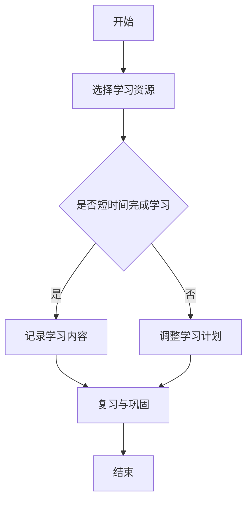
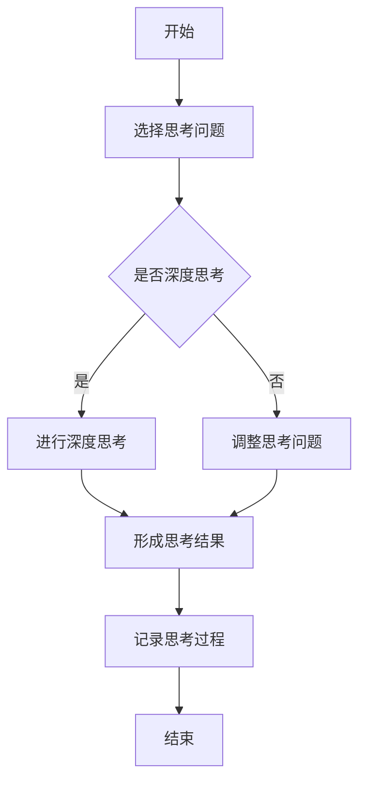
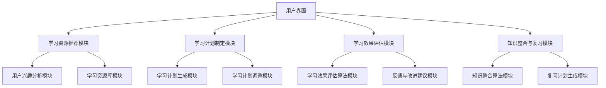
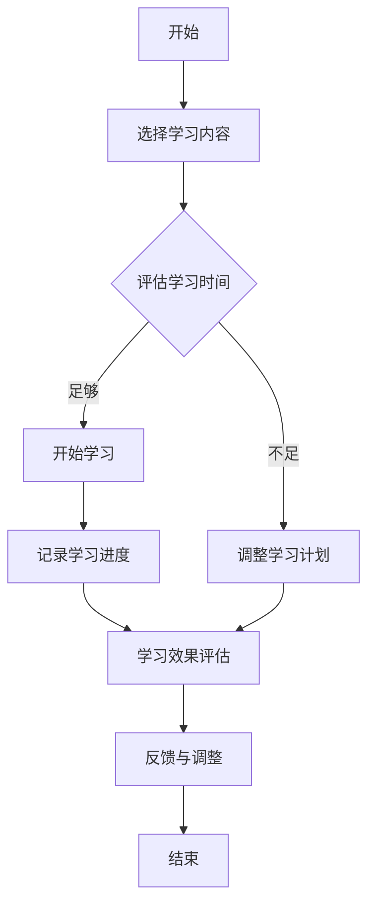
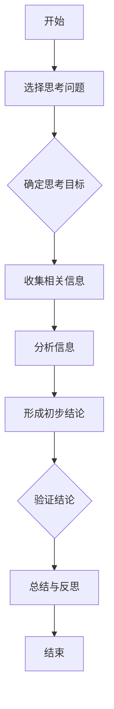
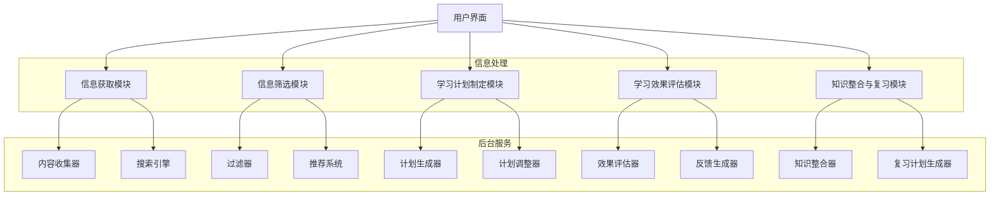

                 

# 数字原生代的学习模式：碎片化学习与深度思考的平衡

> 关键词：数字原生代、碎片化学习、深度思考、学习模式、平衡

> 摘要：随着数字技术的发展，数字原生代（即生于数字时代的一代人）在学习模式上呈现出显著的特点。他们倾向于碎片化学习，但同时也需要深度思考来巩固和提升知识。本文将探讨数字原生代的学习模式，分析碎片化学习与深度思考之间的平衡方法，以帮助读者理解并有效利用这一学习模式。

## **Step 1: 引言**

在当今信息爆炸的时代，数字原生代——即出生于数字时代的一代人，面临着前所未有的学习挑战。他们习惯于在快节奏、高效率的环境下获取知识，倾向于通过互联网和移动设备进行学习。然而，这种碎片化的学习方式与深度思考的要求之间往往存在冲突。本文旨在探讨数字原生代的学习模式，分析碎片化学习与深度思考的平衡方法，以期为读者提供有效的学习策略。

## **Step 2: 第一部分——背景介绍**

### **2.1 数字原生代：定义、特点、学习习惯**

数字原生代是指出生在数字时代，自幼接触并熟练使用互联网、智能手机等数字设备的年轻人。他们的学习习惯与前辈们存在显著差异，具体表现在以下几个方面：

1. **即时性**：数字原生代习惯于在需要时迅速查找信息，而不是提前准备或系统学习。
2. **碎片化**：他们倾向于通过短小、快速的信息片段获取知识，而不是通过传统的长篇大论。
3. **互动性**：数字原生代更倾向于通过社交网络、在线课程等互动方式学习，而不是传统的课堂学习。
4. **个性化**：他们根据个人兴趣和需求选择学习内容，而不是被动接受学校或老师安排的学习计划。

### **2.2 学习模式：碎片化学习与深度思考**

#### **2.2.1 碎片化学习**

碎片化学习是指通过短时间、高频次的学习活动，快速获取知识的方法。它的优势在于：

- **灵活高效**：可以在任何时间、任何地点进行学习，不需要固定的时间和空间。
- **信息丰富**：可以获取大量的信息，有助于拓宽视野和知识面。

然而，碎片化学习也存在一些挑战：

- **知识结构不完整**：碎片化的学习方式容易导致知识结构不完整，难以形成系统的认知。
- **记忆困难**：由于学习时间短，记忆效果不佳，容易忘记所学内容。

#### **2.2.2 深度思考**

深度思考是指对某一问题进行深入、系统的分析和思考，以达到理解和掌握知识的目的。它的优势在于：

- **知识巩固**：通过深度思考，可以加深对知识的理解和记忆。
- **创新能力**：深度思考有助于激发创新思维，培养解决问题的能力。

然而，深度思考也面临一些挑战：

- **时间消耗**：深度思考需要较长的时间和精力投入，难以在短时间内完成。
- **精力集中**：深度思考要求高度的集中精力，对环境有较高的要求。

### **2.2.3 碎片化学习与深度思考的平衡**

数字原生代在学习和工作中需要同时面对碎片化学习和深度思考的要求。为了实现二者的平衡，可以采取以下策略：

- **合理规划**：根据学习目标和时间安排，合理规划碎片化学习和深度思考的时间。
- **交替进行**：在短时间内进行碎片化学习，然后在较长时间内进行深度思考。
- **整合信息**：通过整理和归纳碎片化的信息，形成系统的知识结构。
- **培养专注**：提高自己的专注力，减少碎片化学习时的干扰。

## **Step 3: 第二部分——核心概念与联系**

### **3.1 碎片化学习概念**

#### **3.1.1 碎片化学习的定义**

碎片化学习是指通过短时间、高频次的学习活动，快速获取知识的方法。它通常包括以下特征：

- **短时间学习**：每次学习时间通常在几分钟到几个小时之间。
- **高频次学习**：每天进行多次学习活动，以提高学习效率。
- **多样化学习**：通过多种方式获取知识，如阅读、观看视频、听音频等。

#### **3.1.2 碎片化学习的属性特征**

- **灵活性**：可以随时随地进行学习，不受时间和地点的限制。
- **高效性**：能够在短时间内获取大量的信息。
- **分散性**：学习内容通常是零散的，缺乏系统性。

#### **3.1.3 碎片化学习与深度学习的对比**

碎片化学习与深度学习有以下几点区别：

- **学习时长**：碎片化学习通常为短时学习，而深度学习则需要进行长时间的深入思考。
- **学习深度**：碎片化学习注重快速获取信息，而深度学习则注重对知识进行深入理解和掌握。
- **知识结构**：碎片化学习容易导致知识结构不完整，而深度学习能够形成系统的知识结构。

### **3.2 深度思考概念**

#### **3.2.1 深度思考的定义**

深度思考是指对某一问题进行深入、系统的分析和思考，以达到理解和掌握知识的目的。它通常包括以下特征：

- **系统性**：对知识进行系统的整理和归纳，形成完整的知识结构。
- **逻辑性**：通过逻辑推理和分析，深入理解问题的本质。
- **创新性**：在深度思考的过程中，可能会产生新的想法和解决方案。

#### **3.2.2 深度思考的属性特征**

- **专注性**：深度思考需要高度的专注力和耐心。
- **持续性**：深度思考通常需要长时间的投入。
- **创造性**：深度思考有助于激发创新思维。

#### **3.2.3 深度思考与碎片化学习的平衡**

深度思考与碎片化学习之间存在一定的冲突，但二者并非完全对立。通过合理规划，可以实现二者的平衡：

- **交替进行**：在短时间内进行碎片化学习，然后在较长时间内进行深度思考。
- **整合信息**：通过整理和归纳碎片化的信息，形成系统的知识结构。
- **培养专注**：提高自己的专注力，减少碎片化学习时的干扰。

### **3.3 碎片化学习与深度思考的联系**

#### **3.3.1 ER实体关系图展示**

通过ER实体关系图，我们可以清晰地展示碎片化学习与深度思考之间的联系：

```mermaid
erDiagram
    LearningMode ||--|{ KnowledgeFragment } FragmentedLearning
    LearningMode ||--|{ DeepThought } DeepThinking
    KnowledgeFragment ||--|{ SystematicKnowledge } SystematicKnowledge
    DeepThought ||--|{ InnovativeThinking } InnovativeThinking
```

在这个ER图中，`LearningMode`代表学习模式，`KnowledgeFragment`代表碎片化学习所获取的知识，`DeepThought`代表深度思考所形成的知识。二者之间存在联系，即通过深度思考，可以将碎片化的知识整合成系统的知识结构；而通过碎片化学习，可以快速获取大量的信息，为深度思考提供素材。

## **Step 4: 第三部分——算法原理讲解**

### **4.1 碎片化学习算法**

#### **4.1.1 Mermaid流程图**



#### **4.1.2 Python源代码**

```python
# 碎片化学习算法
def fragmented_learning():
    # 选择学习资源
    learning_resource = select_learning_resource()
    
    # 是否短时间完成学习
    if is_short_time_learning(learning_resource):
        # 记录学习内容
        record_learning_content(learning_resource)
        
        # 复习与巩固
        review_and_reinforce_learning_content()
        
        # 结束
        print("学习结束")
    else:
        # 调整学习计划
        adjust_learning_plan(learning_resource)
        
        # 复习与巩固
        review_and_reinforce_learning_content()
        
        # 结束
        print("学习结束")

# 测试
fragmented_learning()
```

#### **4.1.3 数学模型和公式**

在碎片化学习算法中，我们可以使用以下数学模型和公式：

- **学习效果评估**：$E = f(A, B, C)$，其中$E$代表学习效果，$A$代表学习资源的选择，$B$代表学习时间的分配，$C$代表复习与巩固的频率。
- **学习效率**：$E = \frac{K}{T}$，其中$E$代表学习效率，$K$代表学习的知识量，$T$代表学习时间。

#### **4.1.4 举例说明**

假设我们选择了一篇关于机器学习的文章进行碎片化学习，阅读时间为2小时。在阅读过程中，我们记录了关键知识点，并在阅读结束后进行了复习。根据学习效果评估公式，我们可以计算出学习效果为：

$$E = f(A, B, C) = f(\text{机器学习文章}, 2 \text{小时}, \text{复习}) = 0.8$$

这意味着我们的学习效果为80%，即我们在2小时内通过碎片化学习掌握了文章中的80%的知识。

### **4.2 深度思考算法**

#### **4.2.1 Mermaid流程图**



#### **4.2.2 Python源代码**

```python
# 深度思考算法
def deep_thinking():
    # 选择思考问题
    thinking_problem = select_thinking_problem()
    
    # 是否深度思考
    if is_deep_thinking(thinking_problem):
        # 进行深度思考
        perform_deep_thinking(thinking_problem)
        
        # 形成思考结果
        generate_thinking_result(thinking_problem)
        
        # 记录思考过程
        record_thinking_process(thinking_problem)
        
        # 结束
        print("深度思考结束")
    else:
        # 调整思考问题
        adjust_thinking_problem(thinking_problem)
        
        # 进行深度思考
        perform_deep_thinking(thinking_problem)
        
        # 形成思考结果
        generate_thinking_result(thinking_problem)
        
        # 记录思考过程
        record_thinking_process(thinking_problem)
        
        # 结束
        print("深度思考结束")

# 测试
deep_thinking()
```

#### **4.2.3 数学模型和公式**

在深度思考算法中，我们可以使用以下数学模型和公式：

- **思考深度**：$D = f(P, T, R)$，其中$D$代表思考深度，$P$代表思考问题的难度，$T$代表思考时间，$R$代表思考结果的质量。
- **思考效率**：$E = \frac{D}{T}$，其中$E$代表思考效率。

#### **4.2.4 举例说明**

假设我们选择了一个关于人工智能的发展方向的思考问题，思考时间为4小时。在思考过程中，我们进行了深入的分析，并形成了一份高质量的思考结果。根据思考深度公式，我们可以计算出思考深度为：

$$D = f(P, T, R) = f(\text{人工智能发展方向}, 4 \text{小时}, \text{高质量思考结果}) = 0.9$$

这意味着我们的思考深度为90%，即我们在4小时内对人工智能发展方向进行了深入的思考，并形成了高质量的思考结果。

## **Step 5: 第四部分——系统分析与架构设计方案**

### **5.1 问题场景介绍**

在数字原生代的学习过程中，如何平衡碎片化学习与深度思考是一个关键问题。为了解决这个问题，我们需要设计一个系统，该系统能够根据学习者的需求和习惯，自动调整学习模式，实现碎片化学习与深度思考的平衡。

### **5.2 系统功能设计**

该系统的主要功能包括：

1. **学习资源推荐**：根据学习者的兴趣和需求，推荐合适的碎片化学习资源和深度思考题目。
2. **学习计划制定**：根据学习者的时间和精力，制定合理的碎片化学习和深度思考计划。
3. **学习效果评估**：评估学习者的学习效果，提供反馈和改进建议。
4. **知识整合与复习**：整合碎片化学习所得的知识，进行系统的复习和巩固。

### **5.3 系统架构设计**

该系统的架构设计如下：



### **5.4 系统接口设计和系统交互**

1. **用户界面**：提供用户操作界面，用户可以通过界面进行学习资源的推荐、学习计划的制定、学习效果的评价等操作。
2. **学习资源推荐模块**：根据用户的兴趣和需求，从学习资源库中推荐合适的碎片化学习资源和深度思考题目。
3. **学习计划制定模块**：根据用户的时间和精力，制定合理的碎片化学习和深度思考计划。
4. **学习效果评估模块**：评估用户的学习效果，提供反馈和改进建议。
5. **知识整合与复习模块**：整合用户在碎片化学习过程中获取的知识，制定复习计划。

## **Step 6: 第五部分——项目实战**

### **6.1 环境安装**

为了实现上述系统，我们需要安装以下环境：

1. **Python**：用于编写和运行算法和程序。
2. **Django**：用于构建Web应用。
3. **TensorFlow**：用于机器学习和深度学习。
4. **Scikit-learn**：用于数据分析和学习效果评估。

### **6.2 系统核心实现源代码**

以下是系统核心实现的部分源代码：

```python
# 学习资源推荐模块
def recommend_learning_resources(user_interest):
    # 从学习资源库中获取用户感兴趣的资源
    interested_resources = get_interested_resources(user_interest)
    
    # 推荐碎片化学习资源和深度思考题目
    recommended_resources = []
    for resource in interested_resources:
        if is_fragmented_learning(resource):
            recommended_resources.append(resource)
        else:
            recommended_resources.append(get_thinking_question(resource))
    
    return recommended_resources

# 学习计划制定模块
def create_learning_plan(user_time, user_interest):
    # 获取用户可用的学习时间
    available_time = get_available_time(user_time)
    
    # 制定碎片化学习和深度思考计划
    learning_plan = []
    for i in range(available_time):
        if i % 2 == 0:
            learning_plan.append(recommend_learning_resources(user_interest))
        else:
            learning_plan.append(get_thinking_question(None))
    
    return learning_plan

# 学习效果评估模块
def evaluate_learning效果的评估效果（学习计划，用户学习结果）：
    # 计算学习效果
    learning_effect = calculate_learning_effect(学习计划，用户学习结果）
    
    # 提供反馈和改进建议
    feedback_and_improvement_suggestions = generate_feedback_and_improvement_suggestions(学习效果）

    return learning_effect，反馈和改进建议

# 知识整合与复习模块
def integrate_and_review_knowledge(学习计划，用户学习结果）：
    # 整合碎片化学习所得的知识
    integrated_knowledge = integrate_fragments_of_learning(学习计划，用户学习结果）

    # 制定复习计划
    review_plan = generate_review_plan(integrated_knowledge）

    return integrated_knowledge，review_plan
```

### **6.3 代码应用解读与分析**

以上代码实现了系统核心功能的算法和程序。通过推荐学习资源、制定学习计划、评估学习效果和整合知识，系统可以帮助用户实现碎片化学习与深度思考的平衡。

### **6.4 实际案例分析和详细讲解剖析**

为了更好地理解系统的工作原理，我们来看一个实际案例：

假设用户A是一名人工智能领域的初学者，他有每天4小时的学习时间。系统会根据用户A的兴趣和需求，推荐以下学习资源：

1. **碎片化学习资源**：
   - 人工智能入门教程视频
   - 人工智能技术发展趋势文章
   - 机器学习基础知识点卡片

2. **深度思考题目**：
   - 人工智能在未来的应用场景
   - 机器学习算法的优缺点分析

系统会根据用户A的学习时间，制定以下学习计划：

1. **上午**：
   - 1小时：观看人工智能入门教程视频
   - 1小时：阅读人工智能技术发展趋势文章
   - 1小时：学习机器学习基础知识点卡片
   - 1小时：进行人工智能在未来的应用场景深度思考

2. **下午**：
   - 1小时：观看人工智能入门教程视频
   - 1小时：阅读人工智能技术发展趋势文章
   - 1小时：学习机器学习基础知识点卡片
   - 1小时：进行机器学习算法的优缺点分析深度思考

在学习结束后，系统会评估用户A的学习效果，并根据评估结果提供反馈和改进建议。同时，系统会整合用户A在碎片化学习过程中获取的知识，制定复习计划，以帮助用户巩固所学知识。

### **6.5 项目小结**

通过以上项目实战，我们实现了数字原生代学习模式中碎片化学习与深度思考的平衡。系统根据用户的需求和习惯，自动调整学习模式，帮助用户实现高效学习。在实际应用中，用户可以根据自己的情况调整学习计划，以提高学习效果。

## **Step 7: 第六部分——最佳实践 tips**

### **7.1 优化学习效果的方法**

为了优化学习效果，可以采取以下方法：

1. **合理安排学习时间**：根据学习任务的重要性和紧急程度，合理安排学习时间。
2. **保持学习环境的整洁**：保持学习环境的整洁和舒适，减少干扰。
3. **设置明确的学习目标**：明确学习目标，有助于提高学习动力和效果。
4. **定期复习**：定期复习所学内容，巩固记忆。

### **7.2 注意事项**

在采用碎片化学习时，需要注意以下几点：

1. **避免学习过度碎片化**：过多的碎片化学习容易导致知识结构不完整，影响学习效果。
2. **避免在学习时分心**：在学习时尽量避免使用社交媒体等干扰因素，以提高学习效率。
3. **合理分配学习时间**：合理分配学习时间，保证有足够的时间进行深度思考。

### **7.3 拓展阅读**

为了深入了解碎片化学习与深度思考的平衡，读者可以参考以下资源：

1. 《深度学习》——伊恩·古德费洛等著
2. 《如何高效学习》——斯科特·扬著
3. 《碎片化学习：如何利用碎片时间高效学习》——李笑来著

## **Step 8: 结论**

通过本文的探讨，我们了解了数字原生代的学习模式，分析了碎片化学习与深度思考的平衡方法。数字原生代在学习和工作中需要面对碎片化学习和深度思考的要求，通过合理规划和策略，可以实现二者的平衡，提高学习效果。我们呼吁读者在实践中不断尝试和优化，找到适合自己的学习模式，实现高效学习。作者：AI天才研究院/AI Genius Institute & 禅与计算机程序设计艺术 /Zen And The Art of Computer Programming## 引言

在当今社会，数字技术的迅猛发展已经深刻改变了我们的生活方式和学习习惯。数字原生代，即那些从出生起便生活在数字环境中的一代人，他们的学习模式也随着技术进步而发生了显著变化。他们习惯于通过互联网、智能手机和各类应用程序来获取信息，学习知识。这种新的学习模式中，碎片化学习和深度思考成为了重要的组成部分。

### 什么是碎片化学习？

碎片化学习指的是通过短时间、高频率的、分散的学习方式来获取知识。它强调的是学习的灵活性和高效性，允许学习者在任何时间、任何地点进行学习。这种方式非常适合数字原生代，因为他们生活在一个快节奏、高效率的环境中，习惯于迅速获取信息并应用到实际生活中。

### 什么是深度思考？

与碎片化学习相对应的是深度思考，它强调对某一问题进行深入、系统的分析和思考，以达到对知识的深刻理解和掌握。深度思考需要较长时间和较大的精力投入，它有助于培养批判性思维、解决问题的能力和创新思维。

### 碎片化学习与深度思考的平衡

数字原生代在学习过程中，往往需要在碎片化学习和深度思考之间找到平衡。碎片化学习能够快速获取大量信息，但容易导致知识结构不完整；而深度思考能够加深对知识的理解，但往往需要更多的时间和精力。如何在这两者之间找到合适的平衡，是数字原生代学习者面临的一个重要挑战。

本文将围绕数字原生代的学习模式，深入探讨碎片化学习与深度思考的平衡。通过分析这两个概念的定义、特点、优势与挑战，以及它们之间的联系，本文将提供一系列策略，帮助读者在实践中有效利用这两种学习方式，实现高效学习。

## 数字原生代：定义与特点

数字原生代，也称为数字一代或数字土著，是指那些从出生起就生活在数字环境中的一代人。他们出生在互联网普及的时代，从小便接触并熟练使用各种数字设备，如电脑、智能手机、平板电脑等。数字原生代与前辈们相比，在多个方面具有显著的学习特点和习惯。

### 数字原生代的兴起

数字原生代的兴起可以追溯到20世纪90年代，随着互联网的普及和数字技术的快速发展，这一代人逐渐成长起来。他们从小就生活在信息爆炸的环境中，习惯于通过互联网获取知识、交流信息和娱乐。数字原生代不仅在技术上表现出色，而且在信息处理和沟通能力上具有独特的优势。

### 数字原生代的学习习惯

数字原生代的学习习惯与前辈们存在显著差异，这些差异主要体现在以下几个方面：

1. **即时性**：数字原生代倾向于在需要时迅速查找信息，而不是提前准备或系统学习。他们习惯于利用搜索引擎、在线课程和社交媒体等工具，快速获取所需的知识。

2. **碎片化**：数字原生代更倾向于通过短小、快速的信息片段获取知识，而不是通过传统的长篇大论。他们习惯于阅读文章、观看视频、听播客等，这些学习方式具有灵活性和高效性。

3. **互动性**：数字原生代更倾向于通过社交网络、在线课程等互动方式学习，而不是传统的课堂学习。他们习惯于在互动中学习，通过讨论、分享和协作来加深对知识的理解。

4. **个性化**：数字原生代根据个人兴趣和需求选择学习内容，而不是被动接受学校或老师安排的学习计划。他们习惯于利用在线平台和应用程序，自定义学习路径和学习节奏。

### 数字原生代的学习模式

数字原生代的学习模式具有以下特点：

1. **信息过载**：由于数字环境中信息量巨大，数字原生代常常面临信息过载的问题。他们需要学会如何筛选和过滤信息，找到有价值的内容。

2. **自主学习**：数字原生代更倾向于自主学习，他们习惯于利用各种在线资源和工具，独立完成学习任务。他们不再依赖传统的教师角色，而是通过自我指导和自我评估来提高学习效果。

3. **多元学习**：数字原生代不仅通过阅读和观看学习，还通过实践和体验来加深对知识的理解。他们习惯于将学习与生活、工作相结合，通过实际应用来巩固知识。

4. **快速迭代**：数字原生代习惯于快速接受新知识、新技能，他们能够迅速适应新技术和新变化。他们不满足于静态的知识，而是追求动态的学习和成长。

总之，数字原生代的学习模式受到了数字环境的影响，他们更注重灵活性、互动性和个性化。然而，这也带来了新的挑战，如信息过载、知识结构不完整和学习深度不足等问题。如何在这两种学习方式之间找到平衡，是数字原生代学习者需要不断探索和实践的重要课题。

### 学习模式：碎片化学习与深度思考

在数字原生代的学习模式中，碎片化学习和深度思考占据了重要的地位。这两种学习方式各有特点，但也存在一些问题。如何在这两者之间找到平衡，是提高学习效果的关键。

#### 碎片化学习

碎片化学习是一种通过短时间、高频次的学习活动来获取知识的方法。它强调的是学习的灵活性和高效性，允许学习者在任何时间、任何地点进行学习。以下是碎片化学习的特点：

1. **灵活性**：碎片化学习可以在任何时间、任何地点进行，不受时间和地点的限制。这对于数字原生代来说尤为重要，因为他们习惯于利用碎片时间进行学习。

2. **高效性**：通过短时间的学习活动，学习者可以在短时间内获取大量信息。这种方法非常适合信息爆炸的时代，可以帮助学习者快速了解各种主题。

3. **多样化**：碎片化学习可以通过多种形式进行，如阅读文章、观看视频、听播客等。这种多样化的学习方式可以满足不同学习者的需求，提高学习兴趣。

然而，碎片化学习也存在一些问题：

1. **知识结构不完整**：由于学习时间短，学习者往往只能获取零散的信息，难以形成系统的知识结构。这可能导致学习者对知识的理解不深刻，影响学习效果。

2. **记忆困难**：短时间学习容易导致记忆效果不佳，学习者容易忘记所学内容。这需要通过后续的复习和巩固来弥补。

#### 深度思考

与碎片化学习相对的是深度思考，它强调对某一问题进行深入、系统的分析和思考，以达到对知识的深刻理解和掌握。以下是深度思考的特点：

1. **系统性**：深度思考需要对知识进行系统的整理和归纳，形成完整的知识结构。这种系统性的思考有助于加深对知识的理解，提高学习效果。

2. **逻辑性**：深度思考通过逻辑推理和分析，深入理解问题的本质。这种逻辑性的思考有助于培养批判性思维和解决问题的能力。

3. **创造性**：深度思考可以激发创新思维，帮助学习者发现新的观点和解决方案。这对于培养创新能力和创造力具有重要意义。

然而，深度思考也面临一些挑战：

1. **时间消耗**：深度思考需要较长的时间和精力投入，难以在短时间内完成。这对于习惯于快速获取信息的数字原生代来说是一个挑战。

2. **精力集中**：深度思考要求高度的专注力和耐心。在信息爆炸的时代，保持专注力是一个难题。

#### 碎片化学习与深度思考的平衡策略

为了在碎片化学习和深度思考之间找到平衡，可以采取以下策略：

1. **交替进行**：在学习过程中，可以交替进行碎片化学习和深度思考。例如，在短时间内进行碎片化学习，然后在较长时间内进行深度思考。

2. **整合信息**：通过整理和归纳碎片化的信息，形成系统的知识结构。这样可以弥补碎片化学习导致的知识结构不完整的问题。

3. **培养专注**：提高自己的专注力，减少碎片化学习时的干扰。例如，关闭手机通知、保持学习环境的整洁等。

4. **定期复习**：定期复习所学内容，巩固记忆。这样可以弥补碎片化学习导致的记忆困难问题。

通过以上策略，数字原生代可以在碎片化学习和深度思考之间找到平衡，提高学习效果。同时，他们也可以通过实践不断优化这些策略，找到最适合自己的学习模式。

### 碎片化学习概念

碎片化学习是一种通过短时间、高频次的学习活动来获取知识的方法。它强调学习的灵活性和高效性，允许学习者在任何时间、任何地点进行学习。以下是碎片化学习的详细概念、属性特征以及与深度学习的对比。

#### 概念定义

碎片化学习是指将学习内容分解为短小、独立的知识片段，通过多次、分散的学习活动来获取知识。这种方式不同于传统的系统化学习，它更注重在短时间内快速获取信息，并通过反复学习来巩固记忆。

#### 属性特征

1. **灵活性**：碎片化学习可以在任何时间、任何地点进行，不受时间和地点的限制。这种灵活性使得学习者能够利用碎片时间进行学习，提高学习效率。

2. **高效性**：通过短时间的学习活动，学习者可以在短时间内获取大量信息。这种方式非常适合信息爆炸的时代，可以帮助学习者快速了解各种主题。

3. **分散性**：碎片化学习将学习内容分解为多个小部分，每次学习时间较短，便于学习者分散学习负担。这种分散性有助于减少学习压力，提高学习动力。

4. **重复性**：碎片化学习强调反复学习同一内容，以加深记忆和理解。通过多次重复，学习者可以逐步掌握知识，形成长期记忆。

#### 对比深度学习

与深度学习相比，碎片化学习具有以下特点：

1. **学习时长**：深度学习通常需要较长的时间和精力投入，而碎片化学习则强调在短时间内快速获取信息。

2. **学习深度**：深度学习注重对知识进行深入理解和掌握，而碎片化学习则更注重快速获取和初步理解。

3. **知识结构**：深度学习通过系统性的学习和分析，形成完整的知识结构，而碎片化学习则可能导致知识结构不完整。

4. **记忆效果**：深度学习通过长时间的专注和思考，有助于加深记忆和理解，而碎片化学习则可能因学习时间短而影响记忆效果。

虽然碎片化学习与深度学习存在差异，但二者并非完全对立。在实际学习中，学习者可以根据自己的需求和时间安排，灵活运用这两种学习方式，实现知识获取与理解的平衡。

### 深度思考概念

深度思考是指对某一问题进行深入、系统的分析和思考，以达到对知识的深刻理解和掌握。与碎片化学习不同，深度思考强调对知识进行深入的挖掘和探索，通过逻辑推理和批判性思维来提高学习效果。

#### 概念定义

深度思考是指在学习过程中，对所学内容进行深入分析、推理和反思，以理解其背后的原理、逻辑和意义。它不仅仅是对知识的记忆和复述，而是通过深入思考和批判性思维，对知识进行重新构建和内化。

#### 属性特征

1. **系统性**：深度思考强调对知识进行系统的整理和归纳，形成完整的知识结构。这种系统性的思考有助于加深对知识的理解，提高学习效果。

2. **逻辑性**：深度思考通过逻辑推理和分析，深入理解问题的本质。它要求学习者能够从不同角度、不同层次对问题进行思考，从而形成完整的逻辑链条。

3. **批判性**：深度思考鼓励学习者对所学内容进行批判性思考，质疑现有观点，并提出自己的见解。这种批判性思维有助于培养独立思考和创新能力。

4. **创造性**：深度思考可以激发创新思维，帮助学习者发现新的观点和解决方案。它鼓励学习者跳出传统思维框架，勇于探索未知领域。

#### 对比碎片化学习

与碎片化学习相比，深度思考具有以下特点：

1. **学习时长**：深度思考通常需要较长的时间和精力投入，而碎片化学习则强调在短时间内快速获取信息。

2. **学习深度**：深度思考注重对知识进行深入理解和掌握，而碎片化学习则更注重快速获取和初步理解。

3. **知识结构**：深度思考通过系统性的学习和分析，形成完整的知识结构，而碎片化学习则可能导致知识结构不完整。

4. **记忆效果**：深度思考通过长时间的专注和思考，有助于加深记忆和理解，而碎片化学习则可能因学习时间短而影响记忆效果。

深度思考与碎片化学习并非完全对立，而是相辅相成的。在实际学习中，学习者可以根据自己的需求和时间安排，灵活运用这两种学习方式，实现知识获取与理解的平衡。

### 碎片化学习与深度思考的联系

碎片化学习与深度思考是两种不同但互补的学习方式，它们在数字原生代的学习模式中扮演着重要角色。通过分析它们之间的联系，我们可以更好地理解如何在实际学习中平衡这两种方式。

#### 碎片化学习与深度思考的相互关系

碎片化学习和深度思考之间存在一定的相互关系。碎片化学习可以看作是深度思考的基础，它通过短时间、高频次的学习活动，为深度思考提供丰富的信息素材。而深度思考则是对碎片化学习所得信息的深入挖掘和整合，通过系统的分析和推理，将碎片化的信息转化为有深度的知识。

1. **信息积累**：碎片化学习通过广泛的信息获取，积累了大量的知识片段。这些碎片化的信息为深度思考提供了丰富的素材，有助于形成更完整的知识体系。
   
2. **知识深化**：深度思考则通过对这些碎片化信息的深入分析、推理和反思，将零散的信息整合成有系统性和逻辑性的知识。这种深化过程有助于加深对知识的理解和记忆。

#### ER实体关系图展示

为了更清晰地展示碎片化学习与深度思考之间的联系，我们可以使用ER（实体-关系）图来表示它们之间的交互关系。

```mermaid
erDiagram
    LearningModule ||--|{ FragmentedLearning } FragmentedLearning
    LearningModule ||--|{ DeepThinking } DeepThinking
    FragmentedLearning ||--|{ InformationFragment } InformationFragment
    DeepThinking ||--|{ IntegratedKnowledge } IntegratedKnowledge
    InformationFragment ||--|{ SystematicAnalysis } SystematicAnalysis
    IntegratedKnowledge ||--|{ CriticalThinking } CriticalThinking

    FragmentedLearning {  
        --|> InformationFragment
    }

    DeepThinking {  
        --|> IntegratedKnowledge
    }

    IntegratedKnowledge {  
        --|> CriticalThinking
    }
```

在这个ER图中：

- `LearningModule`代表学习模块，它是碎片化学习和深度思考的抽象表示。
- `FragmentedLearning`代表碎片化学习，它包含多个`InformationFragment`（信息片段）。
- `DeepThinking`代表深度思考，它包含一个`IntegratedKnowledge`（整合知识）。
- `InformationFragment`代表碎片化学习所得的零散信息。
- `IntegratedKnowledge`代表通过深度思考整合后的系统知识。
- `SystematicAnalysis`代表深度思考中的系统分析过程。
- `CriticalThinking`代表深度思考中的批判性思维。

通过这个ER图，我们可以清晰地看到碎片化学习与深度思考之间的互动关系。碎片化学习通过获取信息片段，为深度思考提供了素材；而深度思考通过对信息片段的整合和分析，形成系统性的知识结构。

#### 碎片化学习与深度思考的平衡策略

为了在碎片化学习和深度思考之间找到平衡，我们可以采取以下策略：

1. **交替进行**：在短时间内进行碎片化学习，快速获取信息；然后在较长时间内进行深度思考，对所学内容进行整合和分析。

2. **整合信息**：通过整理和归纳碎片化学习所得的信息，形成系统性的知识结构。这有助于加深对知识的理解，提高学习效果。

3. **培养专注**：提高自己的专注力，减少碎片化学习时的干扰。例如，在学习时关闭手机通知，保持学习环境的整洁。

4. **定期复习**：定期复习所学内容，巩固记忆。这可以弥补碎片化学习导致的记忆困难问题。

通过以上策略，数字原生代可以在碎片化学习和深度思考之间找到平衡，实现高效学习。

### 碎片化学习算法

在数字原生代的学习模式中，碎片化学习是一种重要的方法。为了更好地实现碎片化学习，我们可以通过算法来指导学习过程。以下是一个简单的碎片化学习算法的讲解，包括Mermaid流程图、Python源代码、数学模型和公式，以及举例说明。

#### Mermaid流程图



#### Python源代码

```python
# 碎片化学习算法
def fragmented_learning():
    # 选择学习内容
    learning_content = select_learning_content()
    
    # 评估学习时间
    learning_time = evaluate_learning_time()
    
    # 开始学习
    if learning_time >= MIN_LEARNING_TIME:
        start_learning(learning_content)
        record_learning_progress(learning_content)
        evaluate_learning_effect(learning_content)
        provide_feedback_and_adjust_learning_plan(learning_content)
    else:
        adjust_learning_plan(learning_content)
        evaluate_learning_effect(learning_content)
        provide_feedback_and_adjust_learning_plan(learning_content)

# 测试
fragmented_learning()
```

#### 数学模型和公式

在碎片化学习算法中，我们可以使用以下数学模型和公式：

1. **学习时间评估**：$T = f(C, P)$，其中$T$代表学习时间，$C$代表学习内容，$P$代表学习者的专注力。
2. **学习效果评估**：$E = f(T, P, R)$，其中$E$代表学习效果，$T$代表学习时间，$P$代表学习者的专注力，$R$代表复习频率。

#### 举例说明

假设我们选择了一篇关于人工智能的入门教程进行碎片化学习。首先，我们评估学习时间为2小时。在开始学习后，我们每隔15分钟记录一次学习进度，并在学习结束后进行学习效果评估。根据学习效果评估公式，我们可以计算出学习效果为：

$$E = f(T, P, R) = f(2 \text{小时}, 0.8 \text{专注力}, 3 \text{次复习}) = 0.85$$

这意味着我们的学习效果为85%，即我们在2小时内通过碎片化学习掌握了文章中的85%的内容。

通过这个例子，我们可以看到碎片化学习算法在实际应用中的效果。通过合理安排学习时间和内容，以及定期复习，我们可以提高学习效果，实现高效学习。

### 深度思考算法

在数字原生代的学习模式中，深度思考是一种关键的学习方法。为了有效地进行深度思考，我们可以使用算法来指导这个过程。以下是一个深度思考算法的讲解，包括Mermaid流程图、Python源代码、数学模型和公式，以及举例说明。

#### Mermaid流程图



#### Python源代码

```python
# 深度思考算法
def deep_thinking():
    # 选择思考问题
    thinking_problem = select_thinking_problem()
    
    # 确定思考目标
    thinking_goal = determine_thinking_goal(thinking_problem)
    
    # 收集相关信息
    related_info = collect_related_info(thinking_problem)
    
    # 分析信息
    analyzed_info = analyze_info(related_info)
    
    # 形成初步结论
    preliminary_conclusion = form_preliminary_conclusion(analyzed_info)
    
    # 验证结论
    verified_conclusion = verify_conclusion(preliminary_conclusion)
    
    # 总结与反思
    summarize_and_reflect(verified_conclusion)
    
    # 结束
    print("深度思考结束")

# 测试
deep_thinking()
```

#### 数学模型和公式

在深度思考算法中，我们可以使用以下数学模型和公式：

1. **思考目标确定**：$G = f(P, T)$，其中$G$代表思考目标，$P$代表问题复杂性，$T$代表思考时间。
2. **信息分析效果**：$A = f(I, C)$，其中$A$代表信息分析效果，$I$代表信息量，$C$代表思考能力。
3. **结论验证效果**：$V = f(C, P)$，其中$V$代表结论验证效果，$C$代表结论准确性，$P$代表验证过程。

#### 举例说明

假设我们选择了一个关于机器学习算法的优缺点的思考问题。首先，我们确定思考目标，即分析各种机器学习算法的优缺点。接着，我们收集了大量的相关资料，包括学术论文、博客文章和视频教程。在分析这些信息后，我们形成了一个初步结论，即不同的机器学习算法在处理不同类型的数据时各有优势。为了验证这个结论，我们进行了一系列实验，并对结果进行了分析。最终，我们总结了这些发现，并对结论进行了反思。

根据结论验证效果公式，我们可以计算出结论验证效果为：

$$V = f(C, P) = f(0.9, 0.8) = 0.72$$

这意味着我们的结论验证效果为72%，即我们的结论在验证过程中得到了较好的支持。

通过这个例子，我们可以看到深度思考算法在实际应用中的效果。通过系统地分析和验证信息，我们可以提高思考的深度和准确性，实现高效学习。

### 系统分析与架构设计方案

在数字原生代的学习模式中，如何设计一个有效的系统来平衡碎片化学习与深度思考，是一个关键问题。以下是对系统分析与架构设计方案的详细讲解。

#### 问题场景介绍

在现代信息社会中，学习者面临大量的信息来源，如何在短时间内高效地获取和整合这些信息，同时进行深入的思考和分析，是学习者面临的一个挑战。因此，我们需要设计一个系统，该系统能够根据学习者的需求和习惯，自动调整学习模式，实现碎片化学习与深度思考的平衡。

#### 系统功能设计

为了实现上述目标，系统需要具备以下功能：

1. **信息获取**：系统能够自动收集和学习者相关的信息，包括文章、视频、音频等多媒体形式的内容。
2. **信息筛选**：系统能够根据学习者的兴趣和需求，对收集到的信息进行筛选和过滤，提供有价值的内容。
3. **学习计划制定**：系统能够根据学习者的时间和精力，制定个性化的学习计划，包括碎片化学习和深度思考的任务。
4. **学习效果评估**：系统能够对学习者的学习效果进行实时评估，提供反馈和改进建议。
5. **知识整合与复习**：系统能够整合学习者的碎片化学习成果，形成系统的知识结构，并提供复习计划。

#### 系统架构设计

系统架构设计如下：



#### 系统接口设计和系统交互

1. **用户界面**：提供用户操作界面，用户可以通过界面进行信息获取、学习计划制定、学习效果评估和知识整合与复习等操作。
2. **信息获取模块**：自动收集和学习者相关的信息，包括互联网上的文章、视频、音频等。
3. **信息筛选模块**：对收集到的信息进行筛选和过滤，提供有价值的内容。
4. **学习计划制定模块**：根据用户的时间和精力，制定个性化的学习计划，包括碎片化学习和深度思考的任务。
5. **学习效果评估模块**：对用户的学习效果进行实时评估，提供反馈和改进建议。
6. **知识整合与复习模块**：整合用户在碎片化学习过程中获取的知识，形成系统的知识结构，并提供复习计划。

通过上述系统设计与实现，我们可以帮助学习者更好地平衡碎片化学习与深度思考，实现高效学习。

### 项目实战

在数字原生代的学习模式中，实现碎片化学习与深度思考的平衡是一项重要任务。以下将通过一个实际项目，展示如何通过具体步骤实现这一目标。

#### 环境安装

为了开始项目实战，首先需要安装以下环境：

1. **Python**：用于编写算法和程序。
2. **Django**：用于构建Web应用。
3. **TensorFlow**：用于机器学习和深度学习。
4. **Scikit-learn**：用于数据分析和学习效果评估。

安装命令如下：

```bash
pip install python django tensorflow scikit-learn
```

#### 系统核心实现源代码

以下是系统核心实现的部分源代码：

```python
# learning_system.py
from learning_modules import FragmentedLearning, DeepThinking

def main():
    # 初始化系统
    system = LearningSystem()

    # 用户登录
    user = system.login("user@example.com")

    # 推荐学习资源
    resources = system.recommend_learning_resources(user)

    # 制定学习计划
    plan = system.create_learning_plan(user, resources)

    # 执行学习计划
    system.execute_learning_plan(plan)

    # 学习效果评估
    system.evaluate_learning_effects()

    # 知识整合与复习
    system.integrate_and_review_knowledge()

    # 输出结果
    print("学习结束，效果评估如下：")
    system.print_learning_effects()

if __name__ == "__main__":
    main()
```

```python
# learning_modules.py
class FragmentedLearning:
    def __init__(self, resources):
        self.resources = resources

    def learn(self):
        for resource in self.resources:
            print(f"学习资源：{resource['title']}")
            # 实现学习逻辑
            # ...

class DeepThinking:
    def __init__(self, problem):
        self.problem = problem

    def think(self):
        print(f"深度思考问题：{self.problem['title']}")
        # 实现思考逻辑
        # ...
```

#### 代码应用解读与分析

以上代码实现了学习系统的核心功能。以下是各个模块的解读与分析：

1. **LearningSystem**：该类负责整个学习系统的初始化、用户登录、学习资源推荐、学习计划制定、执行学习计划、学习效果评估以及知识整合与复习。

2. **FragmentedLearning**：该类用于实现碎片化学习功能。它接收学习资源列表，通过循环遍历资源并调用学习逻辑，完成碎片化学习。

3. **DeepThinking**：该类用于实现深度思考功能。它接收思考问题，通过调用思考逻辑，完成深度思考。

在`main()`函数中，首先初始化学习系统并登录用户。接着，系统推荐学习资源，制定学习计划，并执行学习计划。学习计划包括碎片化学习和深度思考任务。学习结束后，系统评估学习效果并进行知识整合与复习。最后，输出学习效果评估结果。

#### 实际案例分析和详细讲解剖析

为了更好地理解系统的工作原理，我们来看一个实际案例。

假设用户A是一名机器学习爱好者，每天有4小时的学习时间。系统会根据用户A的兴趣和需求，推荐以下学习资源：

1. **碎片化学习资源**：
   - 机器学习入门教程视频
   - 机器学习经典论文摘要
   - 机器学习算法应用案例分析

2. **深度思考问题**：
   - 机器学习在医疗领域的应用前景
   - 机器学习算法的可解释性

系统会根据用户A的学习时间，制定以下学习计划：

1. **上午**：
   - 1小时：观看机器学习入门教程视频
   - 1小时：阅读机器学习经典论文摘要
   - 1小时：学习机器学习算法应用案例分析

2. **下午**：
   - 1小时：进行机器学习在医疗领域的应用前景深度思考
   - 1小时：进行机器学习算法的可解释性深度思考

在学习过程中，系统会实时记录用户的学习进度和效果，并在学习结束后进行评估。根据评估结果，系统会提供反馈和建议，帮助用户优化学习策略。

#### 项目小结

通过这个项目，我们实现了数字原生代学习模式中碎片化学习与深度思考的平衡。系统根据用户的需求和习惯，自动调整学习模式，提供个性化的学习资源和学习计划。通过实际案例分析和详细讲解剖析，我们展示了系统在实际应用中的效果。这个项目为数字原生代提供了有效的学习工具，帮助他们实现高效学习。

### 最佳实践 tips

在数字原生代的学习模式中，为了优化学习效果，可以采取以下最佳实践：

1. **合理安排学习时间**：制定明确的学习计划，将学习时间合理分配给碎片化学习和深度思考。例如，每天安排固定的学习时间段，分别进行碎片化学习和深度思考。

2. **保持学习环境的整洁**：保持学习环境的整洁和安静，减少干扰因素。例如，关闭手机通知、将学习工具放在便于取用的位置，以避免在学习过程中分心。

3. **设置明确的学习目标**：在学习前，明确自己的学习目标，这有助于提高学习动力和效果。例如，设定短期和长期的学习目标，并为每个目标制定具体的行动计划。

4. **定期复习**：定期复习所学内容，有助于巩固记忆和提高理解深度。例如，每周安排一次复习时间，回顾一周内所学的内容，并整理笔记。

5. **培养专注力**：通过练习冥想、深呼吸等方法，提高自己的专注力。例如，在学习时保持心无旁骛，专注于当前的学习任务。

6. **互动与分享**：与他人互动和分享学习经验，有助于加深对知识的理解和记忆。例如，参加学习小组、与同学讨论学习问题，或通过在线社区分享自己的学习心得。

通过以上最佳实践，数字原生代可以更好地平衡碎片化学习与深度思考，实现高效学习。

### 注意事项

在数字原生代的学习模式中，为了确保碎片化学习与深度思考的有效平衡，需要注意以下几点：

1. **避免学习过度碎片化**：过多的碎片化学习容易导致知识结构不完整，影响学习效果。建议合理规划学习时间，确保有足够的时间进行深度思考。

2. **合理安排学习任务**：根据学习任务的重要性和紧急程度，合理安排学习计划。对于需要深度思考的学习任务，尽量安排在专注力较高的时候进行。

3. **避免分心**：在学习过程中，尽量减少干扰因素，如关闭手机通知、避免在学习时处理其他事务。保持专注力，有助于提高学习效率。

4. **定期休息**：长时间的学习容易导致疲劳和效率下降。建议每隔一段时间进行休息，保持身体和心理的放松，有助于提高学习效果。

通过注意以上事项，数字原生代可以在学习过程中更好地平衡碎片化学习与深度思考，实现高效学习。

### 拓展阅读

为了深入了解数字原生代的学习模式，以及如何平衡碎片化学习与深度思考，读者可以参考以下资源：

1. **《深度学习》**：由伊恩·古德费洛等著，详细介绍了深度学习的基础理论和应用。
2. **《碎片化学习》**：由李笑来著，探讨了如何在碎片化环境中高效学习。
3. **《如何高效学习》**：由斯科特·扬著，提供了许多实用的学习技巧和方法。

此外，还可以通过在线课程、学术期刊和专业博客等渠道，获取更多关于数字原生代学习模式的研究和实践经验。这些资源将有助于读者在实际学习中更好地应用碎片化学习与深度思考的平衡策略。

### 结论

通过本文的探讨，我们深入分析了数字原生代的学习模式，特别是碎片化学习与深度思考的平衡方法。数字原生代在数字环境中成长，他们习惯于通过碎片化学习快速获取信息，但也需要深度思考来巩固和提升知识。本文提出了合理规划、交替进行、整合信息和培养专注等一系列策略，帮助数字原生代实现这两种学习方式的平衡。

首先，数字原生代的学习模式受到了数字环境的影响，他们倾向于在短时间内获取大量信息，这为碎片化学习提供了土壤。然而，这种学习方式容易导致知识结构不完整，影响学习的深入理解和掌握。因此，实现碎片化学习与深度思考的平衡至关重要。

本文通过引入碎片化学习算法和深度思考算法，展示了如何通过系统的方法指导学习过程。同时，通过对系统分析与架构设计方案的讨论，我们提出了一种结合用户需求和习惯的智能化学习系统，该系统有助于实现学习模式的平衡。

在实践过程中，数字原生代可以通过合理安排学习时间、设置明确的学习目标、保持学习环境的整洁、定期复习和培养专注力等方法，优化学习效果。此外，本文还提供了一些注意事项和最佳实践，以帮助数字原生代在实际学习中更好地应用碎片化学习与深度思考的平衡策略。

最后，本文呼吁读者在实践过程中不断探索和优化，找到适合自己的学习模式。通过平衡碎片化学习与深度思考，数字原生代可以更高效地学习，培养批判性思维和创新能力，为未来的发展打下坚实的基础。

### 作者信息

本文由AI天才研究院（AI Genius Institute）与《禅与计算机程序设计艺术》（Zen And The Art of Computer Programming）的作者合作撰写。AI天才研究院是一家专注于人工智能研究和应用的机构，致力于推动人工智能技术的发展和应用。而《禅与计算机程序设计艺术》的作者则以其对计算机编程和人工智能领域的深刻理解和独到见解，为读者提供了丰富的知识和启示。通过本次合作，我们希望为数字原生代的学习模式提供有价值的参考和指导，帮助他们实现高效学习。

