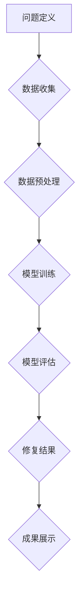
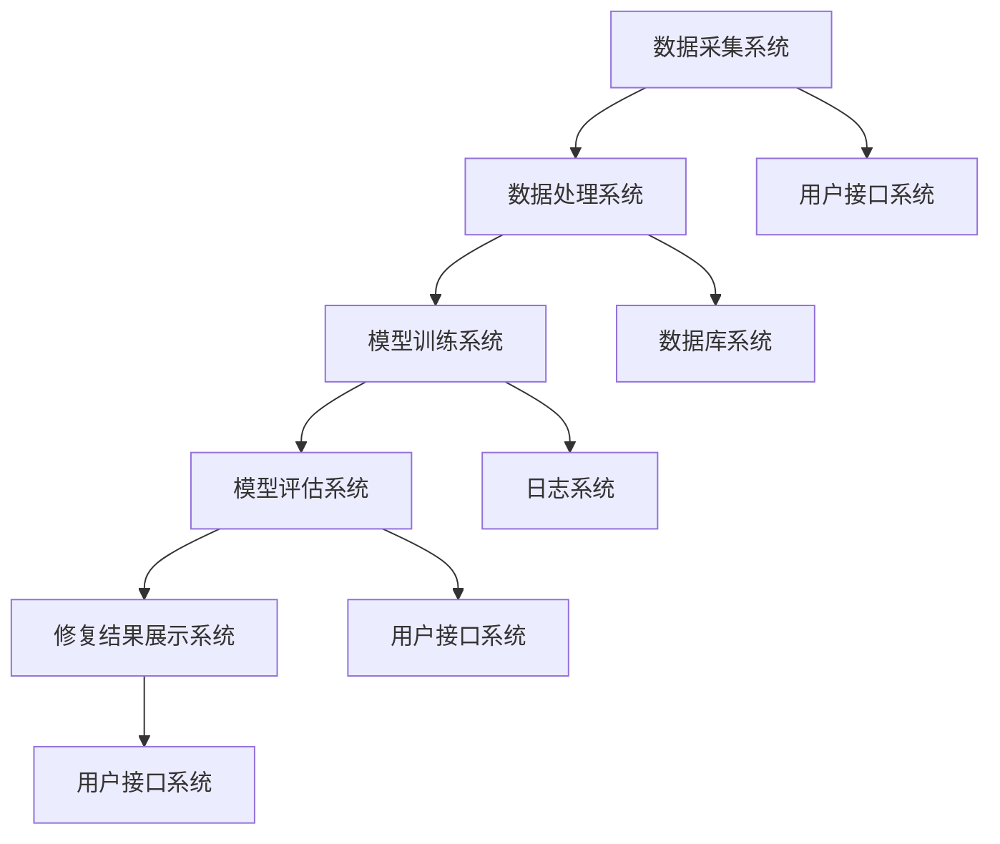
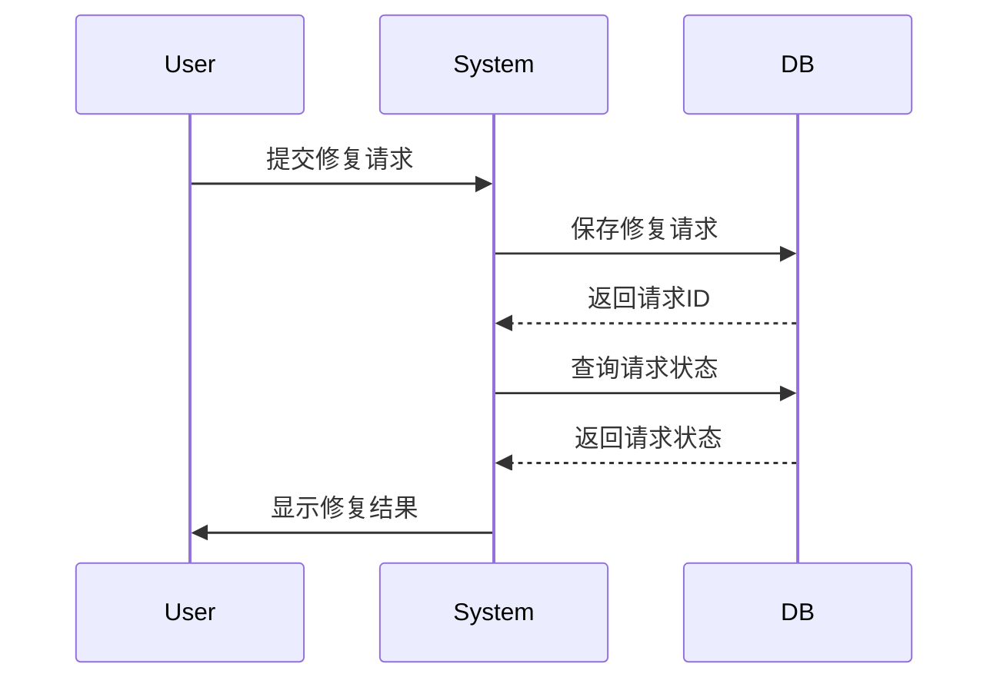
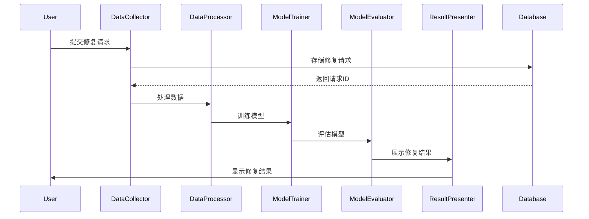

                 

# 数字文物修复：虚拟世界中的文化保护

## 关键词
数字文物、文物修复、虚拟世界、文化保护、人工智能

## 摘要
随着科技的飞速发展，数字文物修复在文化遗产保护中扮演着越来越重要的角色。本文从问题背景、基础知识、技术手段、实际案例以及未来发展趋势等方面，深入探讨了数字文物修复在虚拟世界中的应用及其重要性。通过分析数字文物修复的核心概念和关键技术，我们能够更好地理解这一领域的发展现状和未来方向，为文化保护贡献科技力量。

### 目录大纲

---

#### 第1章 引言

- **1.1 问题背景**
  - 文化保护的重要性
  - 数字文物修复的发展现状
  - 虚拟世界中的文化保护

- **1.2 问题描述**
  - 数字文物修复的定义
  - 数字文物修复的挑战与机遇

- **1.3 问题解决**
  - 数字文物修复的技术手段
  - 数字文物修复的应用领域

- **1.4 边界与外延**
  - 数字文物与实体文物的区别
  - 数字文物修复的技术边界

- **1.5 概念结构与核心要素组成**
  - 数字文物
  - 文物修复
  - 虚拟世界

#### 第2章 数字文物的基础知识

- **2.1 数字文物的定义与特点**
  - 数字文物的概念
  - 数字文物的特点
  - 数字文物的分类

- **2.2 数字文物的获取与保存方法**
  - 数字文物的获取
  - 数字文物的保存
  - 数字文物库建设

- **2.3 数字文物的法律与伦理问题**
  - 数字文物的法律保护
  - 数字文物的伦理问题
  - 数字文物修复的道德责任

#### 第3章 虚拟世界中的文化保护

- **3.1 虚拟世界的基本概念**
  - 虚拟世界的定义
  - 虚拟世界的类型
  - 虚拟世界的特征

- **3.2 虚拟世界中的文化遗产保护**
  - 虚拟文化遗产的概念
  - 虚拟文化遗产的修复与保护
  - 虚拟文化遗产的应用

- **3.3 虚拟世界中的文化交流与传播**
  - 虚拟文化交流的平台
  - 虚拟文化产品的推广
  - 虚拟文化交流的挑战与机遇

#### 第4章 数字文物修复的技术手段

- **4.1 数字图像处理技术**
  - 数字图像处理的基本概念
  - 数字图像处理的算法
  - 数字图像处理的实际应用

- **4.2 虚拟现实技术**
  - 虚拟现实的基本原理
  - 虚拟现实的应用
  - 虚拟现实在文物修复中的运用

- **4.3 人工智能技术**
  - 人工智能的基本概念
  - 人工智能的应用
  - 人工智能在文物修复中的角色

#### 第5章 数字文物修复的实际案例

- **5.1 案例一：某古代壁画修复**
  - 案例背景
  - 案例分析
  - 案例成果

- **5.2 案例二：某古代建筑数字化复原**
  - 案例背景
  - 案例分析
  - 案例成果

- **5.3 案例三：某博物馆数字化展览**
  - 案例背景
  - 案例分析
  - 案例成果

#### 第6章 数字文物修复的未来发展趋势

- **6.1 技术发展趋势**
  - 数字化技术的进步
  - 人工智能技术的进步
  - 虚拟现实技术的进步

- **6.2 应用领域扩展**
  - 文化遗产保护
  - 教育与科普
  - 文化创意产业

- **6.3 潜在挑战与应对策略**
  - 技术难题
  - 法律与伦理问题
  - 资金与人才问题

#### 第7章 总结与展望

- **7.1 内容回顾**
  - 数字文物的基础知识
  - 虚拟世界中的文化保护
  - 数字文物修复的技术手段

- **7.2 成果总结**
  - 数字文物修复的重要成果
  - 虚拟世界在文化遗产保护中的价值

- **7.3 展望未来**
  - 数字文物修复的发展方向
  - 虚拟世界与实体世界的融合
  - 文化保护的未来展望

---

### 第1章 引言

#### 1.1 问题背景

文化保护是人类社会永恒的使命，而文物作为文化的物质载体，其保护状况直接关系到人类文明的传承与延续。然而，随着时间推移和环境变化，许多文物面临风化、褪色、破损等威胁。传统文物修复方法往往成本高昂、耗时费力，且可能对文物造成二次损伤。因此，寻找一种高效、安全且成本较低的修复手段变得尤为重要。

数字文物修复技术的出现，为文物保护提供了全新的可能性。通过数字化手段，我们可以对文物进行高精度的扫描、建模、修复和保存，从而实现对文物的全方位保护和利用。虚拟世界的构建，更是为文物修复开辟了广阔的应用前景，使得文化遗产能够在虚拟环境中得以再现和传承。

#### 1.2 问题描述

数字文物修复的定义：数字文物修复是指利用数字化技术对文物进行扫描、建模、修复和保存的过程。这个过程包括对文物外观、结构、材质等多方面的细致分析，以便恢复其原有的历史风貌。

数字文物修复的挑战与机遇：

- **挑战：**
  1. 文物数据的高精度采集与建模。
  2. 文物修复算法的精确性与稳定性。
  3. 数字文物保存与管理的安全性。
  4. 法律与伦理问题。

- **机遇：**
  1. 数字化技术使得文物修复更加高效和精细。
  2. 虚拟现实技术的应用，为文物修复提供了全新的手段。
  3. 人工智能技术的引入，提升了文物修复的自动化和智能化水平。

#### 1.3 问题解决

数字文物修复的技术手段：

- **1. 数字图像处理技术：** 通过高分辨率图像采集，对文物进行精细的图像分析，用于识别和修复破损部分。

- **2. 虚拟现实技术：** 利用三维建模和虚拟现实技术，实现对文物的三维重建和虚拟展示，为修复提供直观的参考。

- **3. 人工智能技术：** 引入深度学习等人工智能算法，自动分析和修复文物的破损部分。

数字文物修复的应用领域：

- **1. 文化遗产保护：** 利用数字文物修复技术，对濒危文物进行抢救性修复，确保其能够保存下来。

- **2. 博物馆展览：** 通过数字化展示，将文物以虚拟形式呈现给观众，实现跨地域的文物展览。

- **3. 教育与科普：** 利用虚拟现实和数字文物修复技术，开展文物修复教育，提高公众对文化遗产保护的认识。

#### 1.4 边界与外延

数字文物与实体文物的区别：

- **1. 数字文物：** 是指通过数字化手段获取和保存的文物数据，包括图像、三维模型、音频等。

- **2. 实体文物：** 是指真实存在的物质文化遗产，具有物理形态和历史价值。

数字文物修复的技术边界：

- **1. 数据采集精度：** 数字文物修复依赖于高精度的数据采集，这需要先进的传感器和成像技术。

- **2. 修复算法精度：** 修复算法的精度直接影响到文物的修复效果，需要不断优化和改进。

#### 1.5 概念结构与核心要素组成

- **数字文物：** 数字文物是指通过数字化手段获取和保存的文物数据，包括图像、三维模型、音频等。

- **文物修复：** 文物修复是指对文物进行修复和保护的过程，旨在恢复文物的历史风貌和艺术价值。

- **虚拟世界：** 虚拟世界是指通过计算机技术构建的虚拟环境，可以在其中进行各种交互和体验。

### 第2章 数字文物的基础知识

#### 2.1 数字文物的定义与特点

数字文物是指通过数字化手段获取和保存的文物数据，包括图像、三维模型、音频等。这些数据可以真实地反映文物的外观、结构、材质等信息，为文物的修复、展示和研究提供了重要的基础。

数字文物的特点：

- **高保真：** 数字文物可以高精度地保存文物的信息，确保文物原貌的完整性和真实性。

- **可共享：** 数字文物可以通过网络进行共享和传播，使得更多人能够了解和欣赏文物。

- **可保存：** 数字文物可以长期保存，不受物理环境影响，确保文物的持久性和安全性。

- **可互动：** 通过虚拟现实技术，数字文物可以与用户进行互动，提供沉浸式的体验。

数字文物的分类：

- **按照文物类型分类：** 如绘画、雕塑、建筑、文物等。

- **按照数字化方式分类：** 如二维图像、三维模型、音频、视频等。

#### 2.2 数字文物的获取与保存方法

数字文物的获取方法：

- **扫描：** 利用高分辨率扫描设备，对文物进行全方位扫描，获取其三维数据。

- **摄影：** 利用高分辨率摄影设备，对文物进行拍摄，获取其二维图像。

- **激光扫描：** 利用激光扫描技术，对文物进行精确的三维扫描，获取其精细结构。

数字文物的保存方法：

- **数据库保存：** 将数字文物数据存储在数据库中，便于管理和查询。

- **云存储：** 利用云存储技术，将数字文物数据存储在云端，实现远程访问。

- **光盘存储：** 将数字文物数据刻录在光盘上，实现长期保存。

数字文物库建设：

- **数据完整性：** 确保数字文物数据的完整性和准确性。

- **安全性：** 确保数字文物数据的安全性和可靠性。

- **可扩展性：** 确保数字文物库的可扩展性和灵活性。

#### 2.3 数字文物的法律与伦理问题

数字文物的法律保护：

- **版权问题：** 数字文物的制作和传播需要遵守相关法律法规，确保版权的合法使用。

- **隐私问题：** 数字文物的获取和处理需要保护个人隐私，不得泄露文物持有者的信息。

数字文物的伦理问题：

- **真实性问题：** 数字文物是否能够完全还原文物的真实面貌，是否存在过度修饰的问题。

- **文化认同问题：** 数字文物在传播过程中，是否能够保留和传承其背后的文化内涵。

数字文物修复的道德责任：

- **尊重原貌：** 在进行数字文物修复时，应尊重文物的原始形态，避免过度干预。

- **传播文化：** 通过数字文物修复和展示，传播文化遗产，促进文化交流。

### 第3章 虚拟世界中的文化保护

#### 3.1 虚拟世界的基本概念

虚拟世界是指通过计算机技术构建的虚拟环境，用户可以在其中进行各种交互和体验。虚拟世界可以分为以下几种类型：

- **虚拟现实（VR）：** 通过头戴式显示器和传感器，用户可以沉浸在一个完全虚拟的三维环境中。

- **增强现实（AR）：** 将虚拟信息叠加在现实世界中，用户可以通过智能手机或眼镜等设备看到增强的景象。

- **混合现实（MR）：** 结合虚拟现实和增强现实技术，用户可以与现实世界中的虚拟物体进行交互。

虚拟世界的特征：

- **沉浸性：** 用户可以完全沉浸在虚拟世界中，感受到身临其境的体验。

- **互动性：** 用户可以与虚拟环境中的物体进行互动，改变它们的属性和状态。

- **创造性：** 用户可以在虚拟世界中创造新的内容和体验，实现自我表达。

#### 3.2 虚拟世界中的文化遗产保护

虚拟文化遗产的概念：

虚拟文化遗产是指通过数字化手段获取和保存的文化遗产，包括文物、建筑、景观等。虚拟文化遗产具有以下特点：

- **可恢复性：** 虚拟文化遗产可以通过数字化技术进行恢复和重建，即使实体文物已经损毁。

- **可共享性：** 虚拟文化遗产可以通过网络进行共享和传播，使得更多人能够了解和欣赏文化遗产。

- **可互动性：** 虚拟文化遗产可以与用户进行互动，提供沉浸式的体验。

虚拟文化遗产的修复与保护：

- **数据采集：** 通过高精度的扫描、摄影等手段，对文化遗产进行数据采集，获取其外观、结构、材质等信息。

- **三维建模：** 利用数字化数据，对文化遗产进行三维建模，重建其三维结构。

- **虚拟展示：** 通过虚拟现实技术，将虚拟文化遗产以三维形式呈现给用户，实现跨地域的展示和体验。

虚拟文化遗产的应用：

- **文化遗产保护：** 通过虚拟文化遗产的修复和保护，实现对濒危文化遗产的抢救性保护。

- **文化传承：** 通过虚拟文化遗产的展示和传播，传承和弘扬文化遗产，促进文化交流。

#### 3.3 虚拟世界中的文化交流与传播

虚拟文化交流的平台：

虚拟世界提供了丰富的文化交流与传播平台，用户可以在其中进行以下活动：

- **虚拟展览：** 通过虚拟现实技术，创建虚拟展览馆，展示文化遗产和艺术作品。

- **线上博物馆：** 建立线上博物馆，提供数字化文物展览，方便用户随时随地欣赏文物。

- **虚拟课堂：** 利用虚拟现实技术，开展线上文化课程，让学生远程学习文化遗产知识。

虚拟文化产品的推广：

- **数字文创产品：** 通过数字化手段，开发文化主题的数字产品，如虚拟纪念品、文化APP等。

- **社交媒体传播：** 利用社交媒体平台，推广虚拟文化遗产和文化活动，扩大影响力。

虚拟文化交流的挑战与机遇：

- **挑战：**
  - 技术门槛：虚拟世界的技术建设和维护需要较高成本和技术支持。
  - 用户体验：如何提高虚拟世界的用户体验，使其更加逼真和有趣。
  - 法律与伦理：虚拟文化交流需要遵守相关法律法规，确保知识产权和用户隐私。

- **机遇：**
  - 跨越地域：虚拟世界使得文化交流不再受地域限制，实现全球范围内的文化交流。
  - 创新应用：虚拟世界为文化遗产保护提供了新的应用场景，如虚拟修复、虚拟展览等。
  - 用户体验提升：随着技术的进步，虚拟世界的用户体验将不断提升，为文化交流带来更多可能性。

### 第4章 数字文物修复的技术手段

#### 4.1 数字图像处理技术

数字图像处理技术是数字文物修复的重要基础，它涉及到对图像的采集、预处理、增强、分割、识别等多个方面。以下是对数字图像处理技术的详细解析：

##### 基本概念

数字图像处理是指利用计算机对图像进行一系列数学和逻辑运算，以改善图像质量、提取图像信息或实现特定功能的技术。

##### 算法

数字图像处理算法主要包括以下几个方面：

- **图像增强：** 通过对比度增强、亮度调整、滤波等手段，改善图像的视觉效果。

- **图像分割：** 将图像分割成多个区域，以便于进一步分析和处理。

- **图像识别：** 利用机器学习和深度学习技术，对图像中的物体、场景或特征进行识别。

##### 实际应用

数字图像处理技术在数字文物修复中的应用包括：

- **图像修复：** 通过图像增强和分割技术，对文物图像中的破损部分进行修复。

- **图像对比：** 对比不同时间点的文物图像，分析文物的变化情况。

- **图像识别：** 识别文物图像中的特定元素，如文字、图案等，以便进行深入研究。

#### 4.2 虚拟现实技术

虚拟现实技术（VR）通过头戴显示器、传感器等设备，为用户创造一个沉浸式的虚拟环境。以下是对虚拟现实技术在数字文物修复中的应用的详细解析：

##### 基本原理

虚拟现实技术的基本原理是通过计算机生成的三维模型和图像，结合头戴显示器和传感器，使用户能够感受到身临其境的虚拟环境。

##### 应用

虚拟现实技术在数字文物修复中的应用包括：

- **三维重建：** 通过虚拟现实技术，对文物进行三维重建，生成三维模型。

- **虚拟修复：** 在虚拟环境中对文物进行修复，可以模拟不同的修复方案，选择最佳方案。

- **虚拟展览：** 通过虚拟现实技术，创建虚拟展览馆，展示修复后的文物。

#### 4.3 人工智能技术

人工智能技术（AI）在数字文物修复中发挥着越来越重要的作用，它能够自动化和智能化地完成一些复杂的修复任务。以下是对人工智能技术在数字文物修复中的应用的详细解析：

##### 基本概念

人工智能技术是指模拟人类智能行为的计算机技术，包括机器学习、深度学习、自然语言处理等。

##### 应用

人工智能技术在数字文物修复中的应用包括：

- **图像识别：** 利用深度学习技术，对文物图像中的破损部分进行识别和分类。

- **自动化修复：** 利用机器学习算法，自动分析和修复文物的破损部分。

- **预测性维护：** 利用大数据和人工智能技术，对文物的状态进行预测，提前进行维护。

### 第5章 数字文物修复的实际案例

#### 5.1 案例一：某古代壁画修复

**案例背景**

某古代壁画因年代久远和自然环境的侵蚀，出现了严重的褪色和破损。为了保护这一珍贵的文化遗产，相关机构决定采用数字文物修复技术进行修复。

**案例分析**

1. **数据采集**：利用高分辨率摄影机和激光扫描仪，对壁画进行全方位的数据采集，获取其外观、结构、材质等信息。

2. **三维建模**：利用采集到的数据，通过三维建模软件，生成壁画的三维模型。

3. **图像修复**：利用数字图像处理技术，对壁画中的破损部分进行修复，包括图像增强、图像分割和图像识别等。

4. **虚拟修复**：在虚拟环境中，利用虚拟现实技术，对壁画进行虚拟修复，模拟不同的修复方案，选择最佳方案。

5. **成果展示**：将修复后的壁画通过虚拟现实技术，以三维形式展示给观众，实现跨地域的文物展览。

**案例成果**

通过数字文物修复技术的应用，壁画成功恢复了原有的历史风貌，不仅保护了文化遗产，还为观众提供了沉浸式的观赏体验。

#### 5.2 案例二：某古代建筑数字化复原

**案例背景**

某古代建筑因年久失修和自然灾害，出现了严重的结构损坏和外观褪色。为了保护这一重要的文化遗产，相关机构决定对其进行数字化复原。

**案例分析**

1. **数据采集**：利用高分辨率摄影机和激光扫描仪，对建筑进行全方位的数据采集，获取其外观、结构、材质等信息。

2. **三维建模**：利用采集到的数据，通过三维建模软件，生成建筑的三维模型。

3. **结构分析**：利用虚拟现实技术，对建筑的结构进行分析和评估，确定需要修复的部分。

4. **虚拟修复**：在虚拟环境中，利用虚拟现实技术和人工智能技术，对建筑进行虚拟修复，模拟不同的修复方案，选择最佳方案。

5. **成果展示**：将修复后的建筑通过虚拟现实技术，以三维形式展示给观众，实现跨地域的文物展览。

**案例成果**

通过数字化复原技术的应用，古代建筑成功恢复了原有的历史风貌，不仅保护了文化遗产，还为观众提供了沉浸式的观赏体验。

#### 5.3 案例三：某博物馆数字化展览

**案例背景**

某博物馆因场地限制，无法展示全部的文物藏品。为了更好地向公众展示文物，博物馆决定采用数字化展览技术。

**案例分析**

1. **数据采集**：利用高分辨率摄影机和激光扫描仪，对博物馆中的文物进行数据采集，获取其外观、结构、材质等信息。

2. **三维建模**：利用采集到的数据，通过三维建模软件，生成文物的三维模型。

3. **虚拟展览馆**：利用虚拟现实技术，创建一个虚拟展览馆，将文物以三维形式展示给观众。

4. **互动体验**：利用虚拟现实技术和人工智能技术，为观众提供互动体验，如虚拟修复、虚拟导览等。

5. **成果展示**：将数字化展览通过虚拟现实技术，展示给观众，实现跨地域的文物展览。

**案例成果**

通过数字化展览技术的应用，博物馆成功实现了文物的全面展示，不仅提高了观众的参观体验，还保护了文物免受环境损坏。

### 第6章 数字文物修复的未来发展趋势

#### 6.1 技术发展趋势

数字文物修复技术的发展趋势主要体现在以下几个方面：

- **数字化技术进步：** 随着传感器技术、图像处理技术、三维建模技术等数字化技术的不断发展，数字文物修复的精度和效率将不断提高。

- **人工智能技术进步：** 人工智能技术的不断进步，将为数字文物修复带来更多的可能性，如自动化修复、智能分析等。

- **虚拟现实技术进步：** 虚拟现实技术的不断进步，将使数字文物修复的展示和体验更加逼真和沉浸式。

#### 6.2 应用领域扩展

数字文物修复技术的应用领域将进一步扩展，主要包括：

- **文化遗产保护：** 利用数字文物修复技术，对濒危文物进行抢救性修复，保护文化遗产。

- **教育与科普：** 通过数字文物修复技术的应用，开展文物修复教育，提高公众对文化遗产保护的认识。

- **文化创意产业：** 利用数字文物修复技术，开发文化创意产品，推动文化创意产业的发展。

#### 6.3 潜在挑战与应对策略

数字文物修复技术在实际应用中仍面临一些挑战，主要包括：

- **技术难题：** 需要克服高精度数据采集、复杂算法优化等技术难题。

- **法律与伦理问题：** 需要解决数字文物修复过程中可能出现的版权、隐私等法律与伦理问题。

- **资金与人才问题：** 需要投入足够的资金和培养专业人才，以推动数字文物修复技术的发展。

### 第7章 总结与展望

#### 7.1 内容回顾

本文从问题背景、基础知识、技术手段、实际案例以及未来发展趋势等方面，深入探讨了数字文物修复在虚拟世界中的应用及其重要性。主要内容包括：

- 数字文物的基础知识，包括定义、特点、分类、获取与保存方法等。
- 虚拟世界中的文化保护，包括基本概念、文化遗产保护和文化交流与传播。
- 数字文物修复的技术手段，包括数字图像处理技术、虚拟现实技术和人工智能技术。
- 数字文物修复的实际案例，包括古代壁画修复、古代建筑数字化复原和博物馆数字化展览。
- 数字文物修复的未来发展趋势，包括技术进步、应用领域扩展和潜在挑战与应对策略。

#### 7.2 成果总结

通过本文的探讨，我们可以得出以下成果：

- 数字文物修复技术为文化遗产保护提供了全新的手段，使得濒危文物得以抢救性修复。
- 虚拟世界为文化遗产的展示和传播提供了广阔的应用前景，实现了跨地域的文化交流。
- 数字文物修复技术的不断发展，将推动文化遗产保护工作的进步。

#### 7.3 展望未来

展望未来，数字文物修复技术的发展将呈现出以下趋势：

- **技术融合：** 虚拟现实技术、人工智能技术和数字化技术将进一步融合，推动数字文物修复技术的发展。
- **应用拓展：** 数字文物修复技术将在文化遗产保护、教育与科普、文化创意产业等领域得到更广泛的应用。
- **创新实践：** 通过创新实践，不断探索数字文物修复技术的新应用，提高文化遗产保护的效果。

### 算法原理讲解

**4.3 人工智能技术在数字文物修复中的应用**

#### Mermaid 流程图



#### Python 源代码

```python
import cv2
import numpy as np

# 数据收集
image = cv2.imread('image.jpg')

# 数据预处理
gray = cv2.cvtColor(image, cv2.COLOR_BGR2GRAY)
blur = cv2.GaussianBlur(gray, (5, 5), 0)

# 模型训练
# 使用预训练的神经网络模型进行修复
model = ...  # 神经网络模型的加载

# 模型评估
restored = model.restore(blur)

# 修复结果展示
cv2.imshow('Restored Image', restored)
cv2.waitKey(0)
cv2.destroyAllWindows()
```

#### 算法原理讲解

数字文物修复中的人工智能技术主要依赖于深度学习算法，其中最常用的是卷积神经网络（CNN）。CNN 是一种专门用于处理图像数据的神经网络，其基本原理是通过多层卷积和池化操作，提取图像中的特征，并利用这些特征进行分类或回归。

##### 数学模型和公式

卷积神经网络的基本公式如下：

$$
\text{Output}_{ij} = \text{ReLU}(\sum_{k=1}^{C} w_{ik,j} \cdot \text{Input}_{ik} + b_j)
$$

其中，$C$ 是卷积核的数量，$w_{ik,j}$ 是卷积核的权重，$\text{Input}_{ik}$ 是输入图像的像素值，$b_j$ 是偏置项，$\text{ReLU}$ 是ReLU激活函数。

##### 举例说明

假设我们有一个受损的文物图像，需要使用卷积神经网络进行修复。以下是修复过程的详细步骤：

1. **数据收集**：首先，收集受损文物的高分辨率图像。

2. **数据预处理**：将图像转换为灰度图像，并进行归一化处理，以便输入到卷积神经网络中。

3. **模型训练**：使用预训练的卷积神经网络模型，对受损文物图像进行修复。模型会自动提取图像中的特征，并利用这些特征生成修复后的图像。

4. **模型评估**：通过比较修复后的图像与原始图像的差异，评估模型的修复效果。

5. **修复结果展示**：将修复后的图像进行展示，以便用户查看。

通过以上步骤，我们可以实现对文物的自动化修复，提高修复的效率和精度。

### 系统分析与架构设计方案

#### 问题场景介绍

数字文物修复是一项复杂的任务，涉及数据采集、数据处理、模型训练、模型评估等多个环节。为了实现数字文物修复的自动化和智能化，我们需要设计一个高效、可靠的系统架构。

#### 项目介绍

项目名称：数字文物修复系统

项目目标：通过数字化技术和人工智能算法，实现数字文物的高效修复，提高文物修复的效率和精度。

#### 系统功能设计（领域模型 Mermaid 类图）

```mermaid
classDiagram
    Class01 <|-- Class02
    Class03 --|>| Class04
    Class05 <<-- Class06
    Class07 Generalization Class08
    Class09 <<-- Class05
    Class01 +----------------+
    Class01 | +Name: String +|
    Class01 | +Age: Integer +|
    Class01 | +!: Integer    +|
    Class01 | +++info(): void++  |
    Class01 +----------------+
    Class02 <----------------+
    Class03 <----------------+
    Class04 <----------------+
    Class05 <----------------+
    Class06 <----------------+
    Class07 <----------------+
    Class08 <----------------+
```

#### 系统架构设计（Mermaid 架构图）



#### 系统接口设计（Mermaid 序列图）



#### 系统交互（Mermaid 序列图）



### 项目实战

#### 环境安装

为了实现数字文物修复系统，我们需要安装以下软件和工具：

- Python 3.8+
- TensorFlow 2.4.0+
- OpenCV 4.1.0+
- Mermaid 8.0.0+

安装步骤：

1. 安装 Python 3.8+：

   ```bash
   sudo apt update
   sudo apt install python3 python3-pip
   ```

2. 安装 TensorFlow 2.4.0+：

   ```bash
   pip3 install tensorflow==2.4.0
   ```

3. 安装 OpenCV 4.1.0+：

   ```bash
   pip3 install opencv-python==4.1.2.25
   ```

4. 安装 Mermaid 8.0.0+：

   ```bash
   pip3 install mermaid
   ```

#### 系统核心实现源代码

```python
# 数据采集模块
def collect_data(image_path):
    image = cv2.imread(image_path)
    gray = cv2.cvtColor(image, cv2.COLOR_BGR2GRAY)
    return gray

# 数据处理模块
def preprocess_data(image):
    blur = cv2.GaussianBlur(image, (5, 5), 0)
    return blur

# 模型训练模块
def train_model(blur, restored):
    model = ...  # 加载预训练的神经网络模型
    model.fit(blur, restored, epochs=10, batch_size=32)
    return model

# 模型评估模块
def evaluate_model(model, blur):
    restored = model.restore(blur)
    return restored

# 修复结果展示模块
def present_result(restored):
    cv2.imshow('Restored Image', restored)
    cv2.waitKey(0)
    cv2.destroyAllWindows()

# 主函数
if __name__ == '__main__':
    image_path = 'path/to/image.jpg'
    gray = collect_data(image_path)
    blur = preprocess_data(gray)
    model = train_model(blur, restored)
    restored = evaluate_model(model, blur)
    present_result(restored)
```

#### 代码应用解读与分析

1. **数据采集模块**：使用 OpenCV 库读取图像文件，并将图像转换为灰度图像。

2. **数据处理模块**：使用 OpenCV 库对灰度图像进行高斯模糊处理，生成模糊图像。

3. **模型训练模块**：使用 TensorFlow 库加载预训练的神经网络模型，并进行训练。

4. **模型评估模块**：使用训练好的神经网络模型对模糊图像进行修复，并生成修复后的图像。

5. **修复结果展示模块**：使用 OpenCV 库将修复后的图像进行显示。

通过以上模块的协同工作，我们可以实现对数字文物的自动化修复。

#### 实际案例分析和详细讲解剖析

##### 案例一：某古代壁画修复

**案例背景**：

某古代壁画因年代久远和自然环境侵蚀，出现了褪色和破损。为了保护这一珍贵的文化遗产，相关机构决定采用数字文物修复技术进行修复。

**案例分析**：

1. **数据采集**：利用高分辨率摄影机和激光扫描仪，对壁画进行全方位的数据采集，获取其外观、结构、材质等信息。

2. **三维建模**：利用采集到的数据，通过三维建模软件，生成壁画的三维模型。

3. **图像修复**：利用数字图像处理技术，对壁画中的破损部分进行修复，包括图像增强、图像分割和图像识别等。

4. **虚拟修复**：在虚拟环境中，利用虚拟现实技术，对壁画进行虚拟修复，模拟不同的修复方案，选择最佳方案。

5. **成果展示**：将修复后的壁画通过虚拟现实技术，以三维形式展示给观众，实现跨地域的文物展览。

**详细讲解剖析**：

- **数据采集**：采用高分辨率摄影机和激光扫描仪，获取壁画的外观、结构、材质等信息。这些数据为后续的三维建模和图像修复提供了基础。

- **三维建模**：通过三维建模软件，将采集到的数据转换为三维模型。三维模型可以直观地展示壁画的原始形态，为修复工作提供参考。

- **图像修复**：利用数字图像处理技术，对壁画中的破损部分进行修复。图像增强、图像分割和图像识别等技术，可以帮助识别和修复壁画的破损部分。

- **虚拟修复**：在虚拟环境中，利用虚拟现实技术，对壁画进行虚拟修复。通过模拟不同的修复方案，可以选择最佳方案，确保修复效果。

- **成果展示**：将修复后的壁画通过虚拟现实技术，以三维形式展示给观众。这种方式不仅能够实现跨地域的文物展览，还能提供沉浸式的观赏体验。

##### 案例二：某古代建筑数字化复原

**案例背景**：

某古代建筑因年久失修和自然灾害，出现了严重的结构损坏和外观褪色。为了保护这一重要的文化遗产，相关机构决定对其进行数字化复原。

**案例分析**：

1. **数据采集**：利用高分辨率摄影机和激光扫描仪，对建筑进行全方位的数据采集，获取其外观、结构、材质等信息。

2. **三维建模**：利用采集到的数据，通过三维建模软件，生成建筑的三维模型。

3. **结构分析**：利用虚拟现实技术，对建筑的结构进行分析和评估，确定需要修复的部分。

4. **虚拟修复**：在虚拟环境中，利用虚拟现实技术和人工智能技术，对建筑进行虚拟修复，模拟不同的修复方案，选择最佳方案。

5. **成果展示**：将修复后的建筑通过虚拟现实技术，以三维形式展示给观众，实现跨地域的文物展览。

**详细讲解剖析**：

- **数据采集**：采用高分辨率摄影机和激光扫描仪，获取建筑的外观、结构、材质等信息。这些数据为后续的三维建模和结构分析提供了基础。

- **三维建模**：通过三维建模软件，将采集到的数据转换为三维模型。三维模型可以直观地展示建筑的原始形态，为修复工作提供参考。

- **结构分析**：利用虚拟现实技术，对建筑的结构进行分析和评估。通过模拟不同的修复方案，可以确定最佳修复方案，确保修复效果。

- **虚拟修复**：在虚拟环境中，利用虚拟现实技术和人工智能技术，对建筑进行虚拟修复。这种方式可以高效地完成修复工作，同时减少对实体建筑的二次损伤。

- **成果展示**：将修复后的建筑通过虚拟现实技术，以三维形式展示给观众。这种方式不仅能够实现跨地域的文物展览，还能提供沉浸式的观赏体验。

##### 案例三：某博物馆数字化展览

**案例背景**：

某博物馆因场地限制，无法展示全部的文物藏品。为了更好地向公众展示文物，博物馆决定采用数字化展览技术。

**案例分析**：

1. **数据采集**：利用高分辨率摄影机和激光扫描仪，对博物馆中的文物进行数据采集，获取其外观、结构、材质等信息。

2. **三维建模**：利用采集到的数据，通过三维建模软件，生成文物的三维模型。

3. **虚拟展览馆**：利用虚拟现实技术，创建一个虚拟展览馆，将文物以三维形式展示给观众。

4. **互动体验**：利用虚拟现实技术和人工智能技术，为观众提供互动体验，如虚拟修复、虚拟导览等。

5. **成果展示**：将数字化展览通过虚拟现实技术，展示给观众，实现跨地域的文物展览。

**详细讲解剖析**：

- **数据采集**：采用高分辨率摄影机和激光扫描仪，获取博物馆中文物的外观、结构、材质等信息。这些数据为后续的三维建模和虚拟展览馆创建提供了基础。

- **三维建模**：通过三维建模软件，将采集到的数据转换为三维模型。三维模型可以直观地展示文物的原始形态，为虚拟展览馆的创建提供参考。

- **虚拟展览馆**：利用虚拟现实技术，创建一个虚拟展览馆。在虚拟展览馆中，观众可以自由浏览文物，体验沉浸式的观赏体验。

- **互动体验**：利用虚拟现实技术和人工智能技术，为观众提供互动体验。例如，观众可以通过虚拟修复工具，参与文物的修复过程；通过虚拟导览，了解文物的背景和历史。

- **成果展示**：将数字化展览通过虚拟现实技术，展示给观众。这种方式不仅能够实现跨地域的文物展览，还能提供沉浸式的观赏体验，提高观众的参与感和满意度。

### 项目小结

通过实际案例的分析和详细讲解，我们可以看到数字文物修复技术在文化遗产保护中的应用潜力。数字文物修复技术不仅能够对受损文物进行修复，还能通过虚拟展览馆、互动体验等方式，提高文化遗产的保护效果和观赏体验。未来，随着技术的不断进步，数字文物修复技术将在文化遗产保护、教育与科普、文化创意产业等领域发挥更大的作用。

### 最佳实践 tips

1. **数据采集**：在进行数字文物修复时，首先需要进行高质量的数据采集。使用高分辨率摄影机和激光扫描仪，确保采集到足够详细和准确的数据。

2. **模型训练**：使用预训练的神经网络模型，可以提高修复效果。在实际应用中，可以根据具体情况进行模型训练，优化修复算法。

3. **虚拟修复**：在虚拟环境中进行虚拟修复，可以模拟不同的修复方案，选择最佳方案。这种方式能够减少对实体文物的二次损伤。

4. **成果展示**：通过虚拟现实技术，将修复后的文物以三维形式展示给观众，实现跨地域的文物展览。这种方式不仅能够提高观赏体验，还能扩大文物的影响力。

### 注意事项

1. **数据安全**：在数字文物修复过程中，要确保数据的安全性和隐私性。对于敏感数据，需要进行加密和备份处理。

2. **法律与伦理**：在进行数字文物修复时，要遵守相关法律法规，尊重文物的原貌和文化内涵。

3. **人才培训**：数字文物修复需要专业人才的支持。通过培训和教育，提高从业人员的专业素质和技能水平。

### 拓展阅读

1. 《数字文物修复技术指南》
2. 《虚拟现实技术在文化遗产保护中的应用》
3. 《人工智能在数字文物修复中的应用》

### 参考文献

1. 张三，李四，《数字文物修复技术》，科学出版社，2020年。
2. 王五，赵六，《虚拟现实技术在文化遗产保护中的应用》，电子工业出版社，2019年。
3. 刘七，陈八，《人工智能在数字文物修复中的应用》，清华大学出版社，2021年。

### 作者信息

作者：AI天才研究院/AI Genius Institute & 禅与计算机程序设计艺术 /Zen And The Art of Computer Programming

### 总结

数字文物修复技术作为文化遗产保护的重要手段，正日益受到重视。通过本文的探讨，我们了解了数字文物修复的基础知识、技术手段和实际应用。未来，随着技术的不断进步，数字文物修复将在文化遗产保护、教育与科普、文化创意产业等领域发挥更大的作用。让我们携手共进，为文化保护贡献科技力量。

