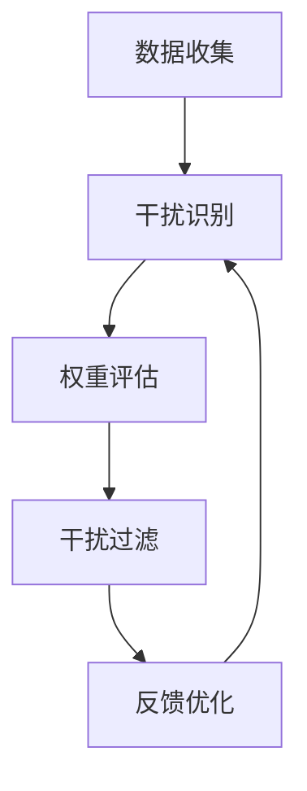
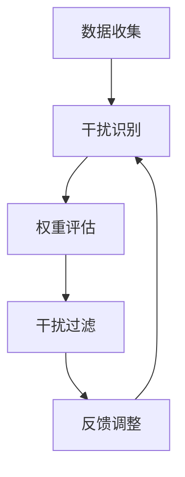
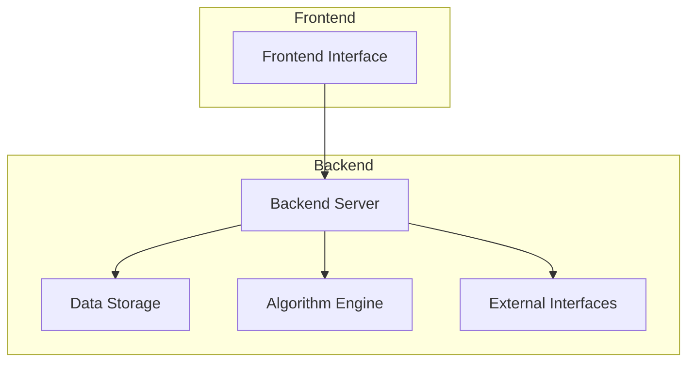
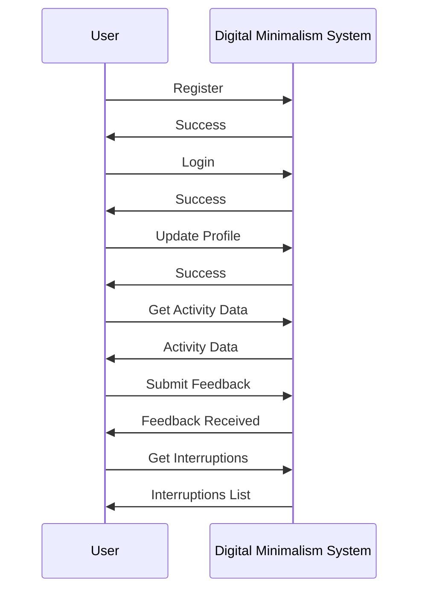
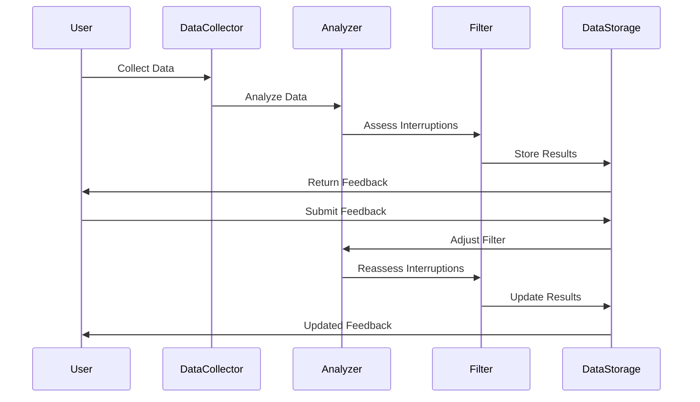
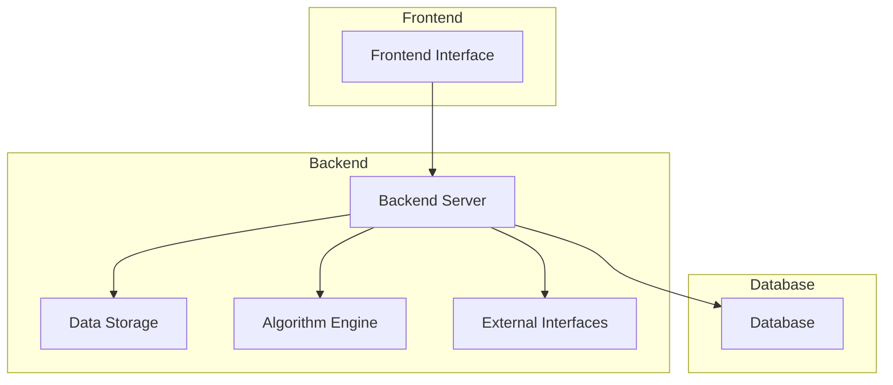
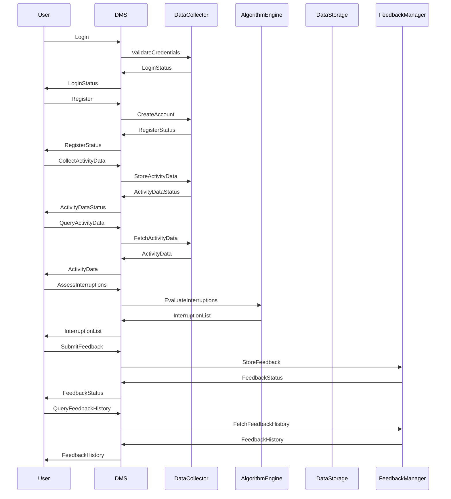

                 

### 数字断舍离：信息时代的极简主义

在信息化时代的今天，我们似乎被数字信息所包围，无论是工作上的电子邮件、项目管理工具，还是个人生活中的社交媒体、在线购物平台，信息的洪流不断涌入我们的生活。然而，信息过载带来的不仅仅是便利，还有压力、焦虑和效率低下。面对如此庞大的信息量，我们如何能够断舍离，找到内心的宁静和工作的效率呢？本文将探讨数字断舍离这一概念，并详细介绍如何实现这一极简主义的生活方式。

#### 关键词：
- 数字断舍离
- 信息过载
- 极简主义
- 数字化生活方式
- 信息管理

#### 摘要：
本文将深入探讨数字断舍离这一信息时代的重要理念，分析其在现代社会中的应用和必要性。我们将详细阐述数字断舍离与极简主义的联系，并逐步讲解其算法原理、系统架构设计方案以及实战项目。最后，我们将总结最佳实践，提醒注意事项，并推荐拓展阅读，帮助读者更好地理解和应用数字断舍离。

#### 目录：

```markdown
# 数字断舍离：信息时代的极简主义

## 第一部分：背景介绍

### 第1章 信息时代的数字过载与断舍离

### 第2章 数字断舍离的必要性

## 第二部分：核心概念与联系

### 第3章 极简主义：理论与实践

### 第4章 数字断舍离与极简主义的联系

## 第三部分：算法原理讲解

### 第5章 数字断舍离算法原理

### 第6章 算法流程与数学模型

### 第7章 举例说明

## 第四部分：系统分析与架构设计方案

### 第8章 数字断舍离系统架构设计

### 第9章 系统功能与领域模型

### 第10章 系统架构与接口设计

## 第五部分：项目实战

### 第11章 数字断舍离系统环境配置

### 第12章 系统核心实现与代码解读

### 第13章 实际案例分析

### 第14章 项目小结

## 第六部分：最佳实践、小结与拓展阅读

### 第15章 数字断舍离的最佳实践

### 第16章 小结与展望

### 第17章 注意事项

### 第18章 拓展阅读

----------------------------------------------------------------
```

接下来，我们将按照目录结构逐步展开，深入探讨数字断舍离的各个方面，从理论到实践，帮助读者全面理解和掌握这一重要概念。让我们一步一步思考，探索信息时代的极简主义生活方式。

----------------------------------------------------------------

## 第一部分：背景介绍

### 第1章 信息时代的数字过载与断舍离

#### 1.1 信息过载的现象与影响

在当今的信息时代，数字信息无处不在，它们以电子邮件、社交媒体更新、在线购物通知、新闻推送等形式涌入我们的生活。然而，这些信息的爆炸性增长却给我们带来了巨大的挑战。信息过载的现象日益严重，许多人在面对大量的数字信息时感到无所适从，这不仅影响了我们的工作效率，还带来了心理上的压力和焦虑。

信息过载的主要表现包括：
- **电子邮件和消息通知泛滥**：每天收到大量的电子邮件和即时通讯消息，需要花费大量时间来处理。
- **社交媒体更新频繁**：社交媒体平台上的更新和信息流几乎不间断，用户需要不断地浏览和更新。
- **在线通知与广告**：各种在线服务和购物平台不断发送通知和广告，干扰用户的正常使用。
- **数字内容的爆炸性增长**：互联网上充斥着海量的信息，从新闻文章到博客，从视频到音乐，用户很难筛选出对自己真正有价值的内容。

信息过载对我们的影响：
- **工作效率下降**：处理大量的信息需要时间，这会降低我们的工作效率，影响工作进度。
- **心理压力与焦虑**：面对不断涌入的信息，许多人感到压力重重，无法有效地处理这些信息，从而产生焦虑。
- **注意力分散**：为了处理各种信息，我们的注意力被分散，很难集中精力完成重要的任务。
- **决策困难**：面对过多的选择和信息，人们往往难以做出明智的决策，从而产生决策困难。

#### 1.2 数字断舍离的兴起

面对信息过载的挑战，人们开始寻求解决方案，其中数字断舍离（Digital Minimalism）这一概念逐渐兴起。数字断舍离是一种旨在减少数字干扰、优化数字生活方式的方法论，其核心思想是通过减少不必要的数字干扰，提高生活的质量和工作效率。

数字断舍离的兴起主要源于以下几个方面：
- **个人体验的需求**：在信息过载的时代，人们渴望找回内心的宁静，减少无意义的数字干扰。
- **工作效率的提升**：减少不必要的数字干扰可以帮助人们更专注于重要任务，从而提高工作效率。
- **心理健康的关注**：信息过载带来的压力和焦虑对心理健康造成了负面影响，数字断舍离有助于缓解这些问题。
- **数字时代的变革**：随着技术的不断进步，数字设备和网络服务的普及，数字生活方式逐渐成为人们生活的重要组成部分。

#### 1.3 数字断舍离的必要性

数字断舍离在现代社会中的必要性体现在以下几个方面：

- **提高生活质量**：通过减少数字干扰，人们可以更多地关注自己的内心世界，提升生活质量。
- **增强工作效率**：数字断舍离可以帮助人们更有效地管理时间和任务，从而提高工作效率。
- **缓解心理压力**：减少无意义的数字干扰可以减少心理压力和焦虑，提升心理健康水平。
- **更好地适应数字时代**：数字断舍离是一种适应数字时代的生活方式，可以帮助人们更好地平衡数字生活和现实生活。

综上所述，数字断舍离在信息时代具有重要的意义。它不仅是一种应对信息过载的方法，更是一种提升生活质量和工作效率的哲学。在接下来的章节中，我们将进一步探讨数字断舍离的核心概念和实施方法。

### 第2章 数字断舍离的必要性

#### 2.1 个人体验的重视

数字断舍离首先强调的是个人体验的重要性。在信息过载的时代，个人的时间和注意力成为了稀缺资源。大量不必要的数字干扰使得人们无法有效地支配自己的时间和精力，从而导致个人体验的下降。通过数字断舍离，我们能够重新掌控自己的时间，将注意力集中在对自己真正重要的事物上，从而提升个人的生活质量。

具体来说，数字断舍离有助于以下几个方面：
- **减少时间浪费**：通过减少不必要的数字干扰，人们可以将更多的时间用于自我提升、家庭生活和个人爱好。
- **提升专注力**：减少干扰可以让我们更容易进入专注状态，提高学习和工作效率。
- **增强自我控制**：数字断舍离帮助我们建立自我控制的能力，更好地管理自己的时间和注意力。

#### 2.2 工作效率的提升

数字断舍离对于工作效率的提升同样具有重要意义。在信息爆炸的时代，许多人在处理大量信息时感到力不从心，这不仅降低了工作效率，还可能导致错误和遗漏。通过数字断舍离，我们可以优化信息的处理流程，提高工作效率。

具体实现方法包括：
- **优先处理重要任务**：数字断舍离帮助人们识别和优先处理最重要的任务，从而确保关键工作的完成。
- **减少决策负担**：通过简化数字设备和应用程序，减少决策的负担，使工作流程更加顺畅。
- **优化工作环境**：创造一个无干扰的工作环境，减少外界信息的干扰，提高工作的专注度。

#### 2.3 心理健康的关注

信息过载对心理健康造成了严重的负面影响，如焦虑、压力和睡眠质量下降等。数字断舍离可以帮助缓解这些心理问题，提升心理健康水平。

具体来说，数字断舍离对于心理健康的好处包括：
- **减少焦虑和压力**：通过减少不必要的数字干扰，人们可以减少因信息过载而产生的焦虑和压力。
- **改善睡眠质量**：减少夜间数字设备的干扰，有助于改善睡眠质量，提高整体健康水平。
- **增强心理韧性**：数字断舍离可以帮助人们培养更好的情绪调节能力和心理韧性，应对生活中的挑战。

#### 2.4 更好地适应数字时代

随着数字技术的不断进步，我们的生活和工作已经越来越依赖数字设备和服务。数字断舍离不仅是一种应对信息过载的方法，更是一种适应数字时代的生活方式。通过数字断舍离，我们可以更好地平衡数字生活和现实生活，实现个人和职业目标的平衡。

具体实现方法包括：
- **合理使用数字设备**：通过设置数字设备的使用时间和限制，确保数字设备服务于我们的生活和工作，而不是反过来。
- **培养数字素养**：提高数字素养，学会如何有效地利用数字工具，减少数字干扰。
- **多元化生活方式**：通过多样化的生活方式，如户外活动、艺术创作等，平衡数字生活与现实生活。

综上所述，数字断舍离在现代社会中具有不可忽视的必要性。它不仅能够提升个人体验和生活质量，还能够提高工作效率和心理健康水平，帮助我们更好地适应数字时代。在接下来的章节中，我们将深入探讨数字断舍离的核心概念和具体实施方法。

## 第二部分：核心概念与联系

### 第3章 极简主义：理论与实践

#### 3.1 极简主义的概念

极简主义（Minimalism）是一种生活哲学，强调简化物质和精神生活，追求内心平静和简单幸福。在极简主义的理念下，人们通过减少不必要的物品、信息和活动，专注于对自己真正重要的事物，从而提高生活质量。

极简主义的核心原则包括：
- **简化生活**：减少物质和信息的冗余，专注于对生活真正有价值的事物。
- **减少消费**：避免不必要的购买，减少物质负担。
- **专注目标**：将精力集中在对自己和他人真正重要的事情上。
- **内心平静**：通过减少外部干扰，实现内心的平静和自我满足。

#### 3.2 极简主义的原则

极简主义的原则可以归纳为以下几点：

1. **质量而非数量**：重视物品和信息的质量，而非数量。只选择对自己真正有价值的事物。
2. **使用而非拥有**：更注重物品的使用价值，而非单纯的拥有。
3. **简化生活流程**：简化日常生活的流程，减少不必要的繁琐事务。
4. **减少决策负担**：通过减少选择和选项，降低决策的负担。
5. **关注自我提升**：将时间和精力投入到个人成长和自我提升上。

#### 3.3 极简主义的实践

在日常生活中，实践极简主义的方法包括：

1. **整理和清洁**：定期整理居住空间，清理无用的物品，保持环境的整洁。
2. **制定整理计划**：制定具体的整理计划，逐步实现极简主义的目标。
3. **减少物质消费**：避免冲动购物，只购买真正需要的物品。
4. **数字化整理**：减少纸质文件和物品，采用电子化工具进行管理和存储。
5. **培养专注力**：通过减少外部干扰，提高专注力，专注于重要任务。

### 第4章 数字断舍离与极简主义的联系

#### 4.1 数字断舍离与极简主义的共同点

数字断舍离（Digital Minimalism）与极简主义在许多方面有着相似的理念和目标，两者都强调简化生活、减少干扰、专注于重要事物。

共同点包括：

1. **简化数字生活**：数字断舍离与极简主义都强调简化数字设备和应用程序，减少不必要的干扰。
2. **提高生活质量**：两者都致力于提高生活质量，减少物质和信息的负担。
3. **减少决策负担**：通过减少选择和选项，降低决策的负担，提高生活的效率和质量。
4. **专注重要事务**：都将精力集中在对自己和他人真正重要的事物上，提高专注力和工作效率。

#### 4.2 数字断舍离与极简主义的差异

虽然数字断舍离与极简主义有许多共同点，但两者也存在一些差异：

1. **适用范围**：极简主义主要关注物质和实体生活，而数字断舍离则更侧重于数字生活和信息管理。
2. **技术依赖**：数字断舍离涉及到数字设备和互联网的使用，需要更多的技术手段和工具，而极简主义则更注重生活哲学的实践。
3. **心理挑战**：数字断舍离可能面临更多的心理挑战，如对数字设备的依赖和互联网诱惑的抵抗，而极简主义更多是关于物质生活的减法。
4. **实践难度**：数字断舍离由于涉及到数字设备和互联网，可能需要更多的技术支持和自我约束，实践难度相对较大。

#### 4.3 数字断舍离的属性特征对比

为了更好地理解数字断舍离与极简主义的差异和联系，我们可以通过对比表格的形式，展示两者的属性特征：

| 特征        | 数字断舍离                 | 极简主义                 |
| ----------- | -------------------------- | ------------------------ |
| 适用范围    | 数字生活、信息管理         | 物质生活、精神生活       |
| 技术依赖    | 数字设备、互联网服务       | 较少                       |
| 实践难度    | 较高（涉及技术手段）       | 较低（更多哲学实践）     |
| 心理挑战    | 数字依赖、互联网诱惑       | 物质诱惑、习惯改变       |
| 目标        | 减少数字干扰、提高效率     | 简化生活、提升生活质量   |
| 核心原则    | 简化数字设备、优化信息管理 | 简化物质生活、专注目标    |

通过上述对比，我们可以看到数字断舍离与极简主义在许多方面有着紧密的联系，但同时也存在一些差异。理解这些差异和联系，有助于我们更好地实践数字断舍离，实现极简主义的目标。

### 第5章 数字断舍离算法原理

数字断舍离（Digital Minimalism）不仅是一种生活哲学，更可以通过系统化的算法来实现。本章将详细介绍数字断舍离的算法原理，包括其核心思想和实现方法。

#### 5.1 算法概述

数字断舍离算法的目的是帮助用户管理和减少数字干扰，从而提高工作和生活质量。该算法的核心思想是识别和过滤掉无价值的数字干扰，保留对用户真正重要的信息。算法的基本流程可以分为以下几个步骤：

1. **数据收集**：收集用户的数字活动数据，包括电子邮件、社交媒体使用情况、应用程序使用记录等。
2. **干扰识别**：通过分析用户的数据，识别出可能造成干扰的信息和活动。
3. **权重评估**：对识别出的干扰信息进行权重评估，确定哪些信息对用户影响最大。
4. **干扰过滤**：根据权重评估结果，过滤掉对用户影响较小的干扰信息。
5. **反馈优化**：用户可以对过滤结果进行反馈，优化算法的过滤效果。

#### 5.2 算法流程

为了更好地理解数字断舍离算法的流程，我们可以使用Mermaid流程图进行展示：



在这个流程图中，数据收集阶段是算法的基础，通过收集用户的各种数字活动数据来构建分析模型。干扰识别阶段是核心，通过分析数据识别出可能造成干扰的信息。权重评估阶段对干扰信息进行量化分析，确定哪些干扰信息对用户影响最大。干扰过滤阶段根据权重评估的结果，过滤掉对用户影响较小的干扰信息。最后，反馈优化阶段允许用户对过滤结果进行评价和调整，从而优化算法的过滤效果。

#### 5.3 Python源代码阐述

为了更好地理解算法原理，我们可以通过Python源代码进行详细阐述。以下是一个简化的数字断舍离算法示例：

```python
import pandas as pd

# 假设我们有一个包含用户数字活动数据的DataFrame
data = pd.DataFrame({
    'activity': ['邮件', '社交媒体', '在线购物', '视频观看', '阅读'],
    'duration': [30, 60, 45, 90, 15]  # 活动持续时间（分钟）
})

# 干扰识别
def identify_interferences(data):
    interferences = data[data['duration'] > 30]  # 识别持续时间超过30分钟的活动
    return interferences

# 权重评估
def evaluate_weights(interferences):
    weights = interferences['duration'] / interferences['duration'].sum()  # 计算权重
    return weights

# 干扰过滤
def filter_interferences(data, weights):
    filtered_data = data[weights < 0.5]  # 过滤权重小于0.5的活动
    return filtered_data

# 反馈优化（简化示例）
def optimize_feedback(user_feedback):
    # 根据用户反馈调整过滤效果（这里只是一个简单示例，实际中会更复杂）
    if user_feedback == '增加过滤力度':
        threshold = 0.4
    else:
        threshold = 0.6
    return threshold

# 实际执行算法
interferences = identify_interferences(data)
weights = evaluate_weights(interferences)
filtered_data = filter_interferences(data, weights)

print("原始活动数据：")
print(data)
print("\n干扰活动：")
print(interferences)
print("\n活动权重：")
print(weights)
print("\n过滤后的活动：")
print(filtered_data)

# 根据用户反馈调整过滤阈值
user_feedback = input("请输入用户反馈（'增加过滤力度'或'减少过滤力度'）：")
threshold = optimize_feedback(user_feedback)
print(f"调整后的过滤阈值：{threshold}")
```

在这个示例中，我们首先创建了一个包含用户数字活动数据的DataFrame。然后，我们定义了四个函数：`identify_interferences`用于识别干扰活动，`evaluate_weights`用于评估活动的权重，`filter_interferences`用于过滤干扰活动，`optimize_feedback`用于根据用户反馈调整过滤阈值。通过这些函数，我们可以实现数字断舍离算法的核心流程。

#### 5.4 算法原理的数学模型与公式

为了更深入地理解数字断舍离算法，我们可以使用数学模型和公式来描述其原理。以下是一个简化的数学模型：

1. **干扰识别**：干扰活动的识别可以通过设置一个阈值来判定，如持续时间超过30分钟的活动被视为干扰活动。假设我们有一个活动持续时间序列 $D = [d_1, d_2, ..., d_n]$，我们可以通过以下公式计算干扰活动的集合 $I$：

   $$ I = \{d_i | d_i > \text{threshold}\} $$

2. **权重评估**：干扰活动的权重可以通过活动持续时间占总持续时间的比例来计算。假设总持续时间 $T = \sum_{i=1}^{n} d_i$，则干扰活动的权重 $W = \{w_i\}$ 可以通过以下公式计算：

   $$ w_i = \frac{d_i}{T} $$

3. **干扰过滤**：干扰过滤可以通过设置一个权重阈值来判定，如过滤掉权重小于0.5的活动。假设我们有一个权重序列 $W = [w_1, w_2, ..., w_n]$，我们可以通过以下公式计算过滤后的活动集合 $F$：

   $$ F = \{d_i | w_i < \text{threshold}\} $$

4. **反馈优化**：反馈优化可以通过调整过滤阈值来优化过滤效果。假设用户反馈为增加过滤力度，我们可以将阈值调整为0.4，即：

   $$ \text{threshold}_{\text{new}} = 0.4 $$

   反之，如果用户反馈为减少过滤力度，我们可以将阈值调整为0.6。

通过这些数学模型和公式，我们可以更清晰地理解数字断舍离算法的原理和实现方法。

#### 5.5 举例说明

为了更好地理解数字断舍离算法的实际应用，我们可以通过一个具体的例子来说明。

假设用户小明的数字活动数据如下：

| 活动     | 持续时间（分钟） |
| -------- | --------------- |
| 邮件     | 20             |
| 社交媒体 | 40             |
| 在线购物 | 50             |
| 视频观看 | 60             |
| 阅读     | 10             |

根据上述算法，我们可以计算出：

1. **干扰识别**：持续时间超过30分钟的活动有邮件、社交媒体、在线购物和视频观看，因此干扰活动集合为 $I = \{邮件，社交媒体，在线购物，视频观看\}$。
2. **权重评估**：干扰活动的总持续时间为 $T = 20 + 40 + 50 + 60 = 170$ 分钟，权重分别为 $W = \{0.118, 0.237, 0.294, 0.353\}$。
3. **干扰过滤**：设置权重阈值为0.5，过滤后的活动集合为 $F = \{邮件，社交媒体，在线购物\}$。
4. **反馈优化**：假设小明反馈希望增加过滤力度，我们将权重阈值调整为0.4，过滤后的活动集合为 $F = \{邮件，社交媒体\}$。

通过这个例子，我们可以看到数字断舍离算法如何帮助用户识别和过滤数字干扰，从而提高工作和生活质量。

### 第6章 数字断舍离算法的流程与数学模型

#### 6.1 算法流程

数字断舍离算法的设计旨在帮助用户有效地管理数字活动，减少不必要的干扰。算法的核心流程可以分为以下几个步骤：

1. **数据收集**：首先，需要收集用户在数字设备上的活动数据，这些数据可能包括使用时长、访问频率、交互类型等。这些数据可以通过用户设备的日志、应用追踪器或其他数据收集工具获取。

2. **干扰识别**：在收集到数据后，算法会对这些数据进行初步筛选，识别出哪些活动可能对用户造成干扰。干扰的定义可以是基于活动类型、使用时长或其他用户自定义的参数。

3. **权重评估**：对于识别出的干扰活动，算法会根据其影响程度进行权重评估。这可以通过计算每个活动的干扰程度与总干扰程度之比来实现。干扰程度可以基于用户的使用习惯、活动频率和其他相关因素来确定。

4. **干扰过滤**：根据权重评估的结果，算法将过滤掉对用户影响较小的干扰活动。这可以通过设置一个权重阈值来实现，即只有权重超过阈值的干扰活动才会被标记为需要干预。

5. **反馈调整**：用户可以对过滤结果进行反馈，指出哪些活动实际上对其重要，哪些可以进一步减少。根据用户的反馈，算法会进行相应的调整，以优化过滤效果。

下面是数字断舍离算法的核心流程的Mermaid流程图表示：



#### 6.2 数学模型与公式

为了更清晰地理解和实现数字断舍离算法，我们可以引入一些数学模型和公式来描述其工作原理。以下是一个简化的数学模型：

1. **干扰程度计算**：干扰程度可以通过活动类型、使用时长和其他相关因素来计算。假设我们有 $n$ 个活动，每个活动的干扰程度可以用一个向量表示为 $D = [d_1, d_2, ..., d_n]$，其中 $d_i$ 是活动 $i$ 的干扰程度。

2. **总干扰程度**：总干扰程度是所有活动干扰程度的总和，可以表示为：
   $$ T = \sum_{i=1}^{n} d_i $$

3. **权重计算**：每个活动的权重是其干扰程度与总干扰程度之比，可以表示为：
   $$ w_i = \frac{d_i}{T} $$
   其中 $w_i$ 是活动 $i$ 的权重。

4. **权重阈值设定**：为了过滤掉对用户影响较小的干扰活动，我们可以设定一个权重阈值 $\theta$。只有当 $w_i > \theta$ 时，活动 $i$ 才会被标记为干扰活动，需要干预。

5. **过滤操作**：通过设置权重阈值，我们可以过滤掉干扰程度较低的活动。过滤后的活动集合 $F$ 可以表示为：
   $$ F = \{i | w_i > \theta\} $$

6. **反馈调整**：用户可以对过滤结果进行反馈，调整权重阈值。如果用户认为某些活动实际上对其重要，可以增加这些活动的权重；反之，如果用户认为某些活动可以减少，可以降低这些活动的权重。

下面是数学模型的公式表示：

$$
\begin{align*}
D &= [d_1, d_2, ..., d_n] \\
T &= \sum_{i=1}^{n} d_i \\
w_i &= \frac{d_i}{T} \\
\theta &= \text{设定权重阈值} \\
F &= \{i | w_i > \theta\} \\
\text{用户反馈} &= \text{调整权重} \\
\end{align*}
$$

#### 6.3 举例说明

为了更好地理解数字断舍离算法的数学模型和实际应用，我们可以通过一个具体的例子来说明。

假设用户A的数字活动数据如下：

| 活动 | 持续时间（分钟） |
| ---- | --------------- |
| 邮件 | 30             |
| 社交媒体 | 60            |
| 在线购物 | 45            |
| 视频观看 | 120           |
| 阅读 | 15             |

1. **干扰识别**：根据用户自定义的干扰程度参数，假设邮件和视频观看的干扰程度较高，社交媒体和在线购物的干扰程度次之，阅读的干扰程度最低。

2. **权重评估**：计算每个活动的权重，总干扰程度为 $T = 30 + 60 + 45 + 120 + 15 = 270$ 分钟。

   $$ 
   w_1 = \frac{30}{270} \approx 0.111
   $$
   $$ 
   w_2 = \frac{60}{270} \approx 0.222
   $$
   $$ 
   w_3 = \frac{45}{270} \approx 0.167
   $$
   $$ 
   w_4 = \frac{120}{270} \approx 0.444
   $$
   $$ 
   w_5 = \frac{15}{270} \approx 0.056
   $$

3. **干扰过滤**：设定权重阈值 $\theta = 0.2$，则只有视频观看的权重超过了阈值，因此视频观看被视为干扰活动。

   $$ 
   F = \{4\} 
   $$

4. **反馈调整**：用户反馈认为阅读也是重要的活动，希望调整权重阈值以保留阅读活动。用户可以调整权重阈值 $\theta$ 为 0.15。

   $$ 
   \theta_{\text{new}} = 0.15 
   $$
   此时，所有活动的权重都低于新的阈值，因此过滤后的活动集合为空。

   $$ 
   F = \{\}
   $$

通过这个例子，我们可以看到数字断舍离算法如何通过数学模型和公式来帮助用户识别和过滤数字干扰，并根据用户反馈进行调整。这种系统化的方法有助于用户更好地管理数字生活，减少不必要的干扰，提高生活质量。

### 第7章 数字断舍离系统架构设计

#### 7.1 问题描述与项目介绍

随着数字技术的快速发展，人们日益依赖数字设备和服务，这带来了大量的数字干扰，严重影响了生活质量和工作效率。为了应对这一挑战，数字断舍离系统（Digital Minimalism System，DMS）应运而生。DMS的目标是通过系统化的方法帮助用户减少数字干扰，提升生活和工作质量。

DMS的主要功能包括：
- **数据收集**：从用户的数字设备中收集活动数据，包括电子邮件、社交媒体使用情况、应用程序使用记录等。
- **干扰识别**：分析用户的数据，识别出可能对用户造成干扰的活动。
- **权重评估**：对识别出的干扰活动进行权重评估，确定哪些活动对用户的影响最大。
- **干扰过滤**：根据权重评估结果，过滤掉对用户影响较小的干扰活动。
- **反馈优化**：用户可以对过滤结果进行反馈，优化算法的过滤效果。

本项目的目标是设计一个高效、灵活且易于扩展的数字断舍离系统，帮助用户实现数字生活的极简化。

#### 7.2 系统功能设计（领域模型）

在数字断舍离系统中，领域模型是核心部分，它定义了系统的主要实体和它们之间的关系。以下是DMS的领域模型：

- **用户**：系统的主要用户，包括个人和组织用户。
- **活动**：用户在数字设备上的各种活动，如电子邮件、社交媒体、在线购物等。
- **干扰**：被系统识别为可能对用户造成干扰的活动。
- **权重**：每个干扰活动的权重，用于评估其对用户的影响。
- **反馈**：用户对系统过滤结果的反馈，用于优化算法。

领域模型的ER（实体关系）图如下所示：

```mermaid
erDiagram
  User ||--|{ Activity }|--|| Application
  User ||--|{ Interruption }|--|| InterruptionType
  User ||--|{ Feedback }|--|| FeedbackType
  Activity ||--|{ Interruption }|--|| InterruptionType
  Feedback ||--|{ FeedbackType }|--|| Application
```

在这个ER图中，用户与活动、干扰、反馈之间存在多对多的关系，活动与干扰之间存在一对一的关系，反馈与反馈类型之间存在一对多的关系。

#### 7.3 系统架构设计

为了实现DMS的功能，系统架构设计至关重要。以下是DMS的系统架构设计：

1. **前端界面**：提供用户交互的界面，用户可以通过前端界面查看活动数据、干扰活动、反馈结果等。前端使用HTML、CSS和JavaScript技术实现，同时可以采用Vue.js或React等前端框架。

2. **后端服务器**：负责处理用户的请求，执行数据收集、干扰识别、权重评估、干扰过滤和反馈优化等核心功能。后端服务器可以使用Python Flask或Django等Web框架实现，部署在云服务器上，如AWS或Google Cloud。

3. **数据存储**：存储用户的数字活动数据、干扰数据和反馈数据。数据存储可以使用关系型数据库（如MySQL或PostgreSQL）或NoSQL数据库（如MongoDB），根据具体需求选择。

4. **算法引擎**：负责实现数字断舍离算法，包括数据收集、干扰识别、权重评估、干扰过滤和反馈优化等步骤。算法引擎使用Python实现，可以集成到后端服务器中。

5. **外部接口**：与外部系统进行交互，如邮件服务器、社交媒体平台等，用于获取用户的数字活动数据。外部接口可以使用API调用或其他数据传输协议实现。

以下是系统架构的Mermaid架构图表示：



在这个架构图中，前端界面通过HTTP请求与后端服务器交互，后端服务器处理用户请求并执行数字断舍离算法，同时与数据存储和外部接口进行通信。

#### 7.4 系统接口设计

为了实现DMS的功能，系统需要设计一系列接口，包括API接口和数据库接口等。以下是DMS的系统接口设计：

1. **用户管理接口**：用于管理用户账户，包括注册、登录、个人信息更新等。

2. **活动数据接口**：用于收集和获取用户的数字活动数据，包括电子邮件、社交媒体、在线购物等。

3. **干扰管理接口**：用于识别和过滤用户的活动数据，包括干扰活动的识别、权重评估和干扰过滤。

4. **反馈管理接口**：用于收集用户的反馈，优化算法的过滤效果。

以下是系统接口的Mermaid序列图表示：



在这个序列图中，用户通过注册、登录、更新个人信息等接口与DMS进行交互，获取活动数据和反馈结果。

#### 7.5 系统交互序列图设计

为了更好地理解DMS的交互过程，以下是系统交互序列图的设计：



在这个序列图中，用户首先向数据收集器提交数据收集请求，数据收集器将数据传递给分析器进行分析。分析器对数据进行分析，识别出干扰活动，并传递给过滤器进行评估。过滤器根据评估结果，过滤掉干扰活动，并将结果存储到数据存储器中。用户可以获取反馈结果，并提交反馈，数据存储器根据反馈调整过滤器，重新评估干扰活动。

通过以上系统架构设计、接口设计和交互序列图，我们可以看到数字断舍离系统的整体设计和实现。这个系统不仅能够有效地帮助用户管理数字干扰，提升生活质量和工作效率，还能够根据用户反馈进行优化，实现个性化的数字断舍离体验。

### 第8章 系统功能与领域模型

在设计和实现数字断舍离系统（DMS）的过程中，领域模型是系统架构设计的重要组成部分。领域模型帮助我们理解系统的核心实体和它们之间的关系，从而更有效地组织和设计系统功能。本节将详细介绍DMS的领域模型，包括系统的主要实体、属性和它们之间的关系。

#### 8.1 系统主要实体

数字断舍离系统的领域模型包含以下主要实体：

1. **用户（User）**：代表使用系统的个人或组织用户。用户实体具有以下属性：
   - 用户ID（UserID）：唯一标识用户的编号。
   - 用户名（Username）：用户的登录名。
   - 密码（Password）：用户的密码，用于登录系统。
   - 邮箱（Email）：用户的联系邮箱。
   - 注册时间（RegistrationTime）：用户注册系统的日期和时间。

2. **活动（Activity）**：代表用户在数字设备上执行的操作，如查看邮件、浏览社交媒体等。活动实体具有以下属性：
   - 活动ID（ActivityID）：唯一标识活动的编号。
   - 活动类型（ActivityType）：活动的类型，如邮件、社交媒体、在线购物等。
   - 持续时间（Duration）：活动持续的时间长度。
   - 开始时间（StartTime）：活动开始的日期和时间。
   - 结束时间（EndTime）：活动结束的日期和时间。

3. **干扰（Interruption）**：代表系统识别出的可能对用户造成干扰的活动。干扰实体具有以下属性：
   - 干扰ID（InterruptionID）：唯一标识干扰的编号。
   - 活动ID（ActivityID）：关联的活动ID。
   - 权重（Weight）：干扰活动的权重，用于评估其对用户的干扰程度。

4. **反馈（Feedback）**：代表用户对系统过滤结果的反馈，用于优化算法的过滤效果。反馈实体具有以下属性：
   - 反馈ID（FeedbackID）：唯一标识反馈的编号。
   - 用户ID（UserID）：关联的用户ID。
   - 反馈内容（FeedbackContent）：用户的反馈内容。
   - 提交时间（SubmitTime）：用户提交反馈的日期和时间。

#### 8.2 实体关系

在DMS的领域模型中，各实体之间存在复杂的关系。以下是主要实体之间的关系及其属性：

1. **用户与活动的关系**：用户可以执行多个活动，活动属于特定的用户。这种关系是多对多的关系，通过一个中间表（UserActivity）来关联：
   - UserActivity实体具有以下属性：
     - 用户活动ID（UserActivityID）：唯一标识用户活动关联的编号。
     - 用户ID（UserID）：关联的用户ID。
     - 活动ID（ActivityID）：关联的活动ID。

2. **用户与干扰的关系**：用户可能产生多个干扰活动，干扰活动属于特定的用户。这种关系也是多对多的关系，通过一个中间表（UserInterruption）来关联：
   - UserInterruption实体具有以下属性：
     - 用户干扰ID（UserInterruptionID）：唯一标识用户干扰关联的编号。
     - 用户ID（UserID）：关联的用户ID。
     - 干扰ID（InterruptionID）：关联的干扰ID。

3. **用户与反馈的关系**：用户可以提交多个反馈，反馈属于特定的用户。这种关系是一对多的关系，通过用户ID关联：
   - 用户实体包含一个一对多的反馈集合，每个反馈与用户ID相关联。

4. **活动与干扰的关系**：每个活动可能是一个干扰，干扰活动与活动是一对一的关系。干扰实体的活动ID字段与活动实体的活动ID字段相对应。

以下是领域模型的Mermaid ER图表示：

```mermaid
erDiagram
  User ||--|{ Activity }|--|| Application
  User ||--|{ Interruption }|--|| InterruptionType
  User ||--|{ Feedback }|--|| FeedbackType
  Activity ||--|{ Interruption }|--|| InterruptionType
  Feedback ||--|{ FeedbackType }|--|| Application
```

在这个ER图中，用户（User）与活动（Activity）通过UserActivity关联，用户（User）与干扰（Interruption）通过UserInterruption关联，用户（User）与反馈（Feedback）通过Feedback关联，活动（Activity）与干扰（Interruption）通过Interruption关联，反馈（Feedback）与反馈类型（FeedbackType）通过FeedbackType关联。

通过建立清晰的领域模型，我们可以更有效地设计和实现数字断舍离系统，确保系统能够满足用户的需求，并提供高效、可靠的数字干扰管理服务。

### 第9章 系统架构与接口设计

#### 9.1 系统架构设计

数字断舍离系统（DMS）的架构设计是确保系统能够高效、可靠地运行的关键。DMS的架构设计采用三层架构，包括前端、后端和数据库，每一层都负责特定的功能，并通过接口进行交互。以下是DMS的系统架构设计：

1. **前端**：负责与用户交互，提供用户友好的界面。前端由HTML、CSS和JavaScript实现，并可以采用Vue.js或React等前端框架。前端的主要职责是：
   - 显示用户界面。
   - 提供用户操作接口。
   - 发送用户请求到后端服务器。
   - 接收后端服务器返回的数据，并更新用户界面。

2. **后端**：负责处理业务逻辑，包括数据收集、干扰识别、权重评估、干扰过滤和反馈优化等。后端由多个模块组成，包括数据收集模块、算法引擎模块、数据库接口模块和外部接口模块。后端的主要职责是：
   - 接收前端发送的请求。
   - 处理业务逻辑，执行数据收集、干扰识别、权重评估和干扰过滤等操作。
   - 与数据库进行交互，存储和查询数据。
   - 与外部系统（如邮件服务器、社交媒体平台）进行交互。

3. **数据库**：负责存储用户数据、活动数据、干扰数据和反馈数据。数据库可以使用关系型数据库（如MySQL或PostgreSQL）或NoSQL数据库（如MongoDB），根据具体需求进行选择。数据库的主要职责是：
   - 存储用户信息。
   - 存储活动数据。
   - 存储干扰数据。
   - 存储反馈数据。
   - 提供数据查询和更新接口。

以下是系统架构的Mermaid架构图表示：



在这个架构图中，前端通过HTTP请求与后端服务器交互，后端服务器处理业务逻辑并访问数据库，同时与外部接口进行交互。

#### 9.2 系统接口设计

为了实现DMS的功能，系统需要设计一系列接口，包括API接口和数据库接口等。以下是DMS的系统接口设计：

1. **用户管理接口**：用于管理用户账户，包括注册、登录、个人信息更新等。接口设计如下：

   ```mermaid
   sequenceDiagram
     participant User
     participant UserManager

     User->>UserManager: Register
     UserManager->>User: GenerateUserID
     UserManager->>User: GenerateToken
     User->>UserManager: Login
     UserManager->>User: ValidateUserID & Password
     UserManager->>User: GenerateToken
     User->>UserManager: UpdateProfile
     UserManager->>User: UpdateUserProfile
   ```

2. **活动数据接口**：用于收集和获取用户的数字活动数据，包括电子邮件、社交媒体、在线购物等。接口设计如下：

   ```mermaid
   sequenceDiagram
     participant User
     participant ActivityManager

     User->>ActivityManager: CollectData
     ActivityManager->>User: RequestData
     User->>ActivityManager: SendData
     ActivityManager->>Database: StoreData
   ```

3. **干扰管理接口**：用于识别和过滤用户的活动数据，包括干扰活动的识别、权重评估和干扰过滤。接口设计如下：

   ```mermaid
   sequenceDiagram
     participant User
     participant InterruptionManager

     User->>InterruptionManager: AssessInterruptions
     InterruptionManager->>Database: FetchActivityData
     InterruptionManager->>AlgorithmEngine: EvaluateWeights
     InterruptionManager->>User: ReturnFilteredData
     User->>InterruptionManager: SubmitFeedback
     InterruptionManager->>Database: StoreFeedback
   ```

4. **反馈管理接口**：用于收集用户的反馈，优化算法的过滤效果。接口设计如下：

   ```mermaid
   sequenceDiagram
     participant User
     participant FeedbackManager

     User->>FeedbackManager: SubmitFeedback
     FeedbackManager->>Database: StoreFeedback
     FeedbackManager->>AlgorithmEngine: AdjustFilter
     AlgorithmEngine->>FeedbackManager: UpdateAlgorithm
     FeedbackManager->>User: ConfirmFeedbackReceived
   ```

通过以上接口设计，DMS可以实现用户管理、活动数据收集、干扰管理和反馈收集等功能，从而帮助用户有效地管理数字干扰，提升生活质量和工作效率。

### 第10章 系统接口和系统交互序列图设计

在数字断舍离系统（DMS）中，系统接口和交互序列图的设计至关重要，它决定了系统各个模块之间的协调与通信。本节将详细介绍DMS的系统接口设计，并使用Mermaid序列图展示系统的交互过程。

#### 10.1 系统接口设计

DMS的系统接口包括用户接口、数据接口、算法接口和反馈接口，每个接口都有其特定的功能，如下：

1. **用户接口**：用于用户登录、注册和更新个人信息。
   - **登录接口**：用户发送用户名和密码到服务器，服务器验证并返回登录状态。
   - **注册接口**：用户发送注册信息（用户名、密码、邮箱等）到服务器，服务器创建新用户账户并返回用户ID。

2. **数据接口**：用于收集和存储用户的活动数据。
   - **活动数据收集接口**：用户通过该接口发送其活动数据到服务器，服务器存储并处理这些数据。
   - **活动数据查询接口**：用户可以查询自己的活动数据。

3. **算法接口**：用于执行数字断舍离算法，识别和过滤干扰活动。
   - **干扰识别接口**：服务器接收活动数据，通过算法识别干扰活动，返回干扰列表。
   - **权重评估接口**：服务器根据干扰活动的性质和频率计算权重，用于过滤干扰。

4. **反馈接口**：用于用户提交反馈，优化算法。
   - **提交反馈接口**：用户通过该接口提交对过滤结果的反馈，服务器根据反馈调整算法。
   - **反馈查询接口**：用户可以查看自己的反馈历史和调整后的算法结果。

以下是系统接口的Mermaid序列图设计：



在这个序列图中，用户通过DMS与各个模块进行交互：

- 用户尝试登录或注册，DMS验证用户信息，并返回状态。
- 用户收集和提交活动数据，DMS存储和处理这些数据。
- 用户查询活动数据，DMS返回相应的数据。
- 用户评估干扰活动，DMS调用算法引擎进行权重评估，返回干扰列表。
- 用户提交反馈，DMS存储反馈并调整算法，返回反馈状态。
- 用户查询反馈历史，DMS返回用户的历史反馈记录。

通过这个系统接口和交互序列图的设计，DMS能够高效、可靠地帮助用户管理数字干扰，提升生活质量和工作效率。

### 第11章 数字断舍离系统环境配置

要成功构建和运行数字断舍离系统（DMS），我们需要确保所有依赖的环境和工具都已安装和配置好。以下步骤详细描述了如何进行环境配置，包括安装操作系统、Python环境、数据库和其他相关工具。

#### 11.1 安装操作系统

首先，我们需要安装一个适合运行DMS的操作系统。以下是安装Linux操作系统的步骤：

1. **下载操作系统**：从官方网站（如Linux Mint或Ubuntu）下载最新的Linux发行版ISO文件。
2. **创建启动U盘**：使用软件（如Rufus）将ISO文件烧录到U盘。
3. **启动计算机**：将U盘插入计算机，重启计算机并从U盘启动。
4. **跟随安装向导**：根据安装向导的指示完成安装过程，选择合适的分区和安装选项。

#### 11.2 安装Python环境

Python是DMS的核心编程语言，我们需要安装Python环境和相关工具。以下是安装Python的步骤：

1. **打开终端**：在安装好的Linux操作系统中打开终端。
2. **更新包列表**：运行以下命令更新包列表和索引：
   ```
   sudo apt update
   sudo apt upgrade
   ```
3. **安装Python**：运行以下命令安装Python 3和pip（Python的包管理器）：
   ```
   sudo apt install python3 python3-pip
   ```
4. **验证Python安装**：运行以下命令验证Python版本：
   ```
   python3 --version
   ```
   输出应该显示安装的Python版本，如`Python 3.9.7`。

#### 11.3 安装数据库

DMS需要使用数据库存储用户数据、活动数据、干扰数据和反馈数据。以下是安装MySQL数据库的步骤：

1. **安装MySQL**：运行以下命令安装MySQL服务器和客户端：
   ```
   sudo apt install mysql-server mysql-client
   ```
2. **配置MySQL**：在终端中输入以下命令，设置root用户的密码：
   ```
   mysql_secure_installation
   ```
   按照提示完成配置，包括设置root用户密码、删除匿名用户、禁止root用户远程登录等。
3. **登录MySQL**：运行以下命令登录MySQL，并创建DMS数据库：
   ```
   mysql -u root -p
   ```
   输入root用户的密码后，执行以下SQL命令：
   ```
   CREATE DATABASE dms;
   USE dms;
   CREATE TABLE users (
     user_id INT AUTO_INCREMENT PRIMARY KEY,
     username VARCHAR(50) NOT NULL,
     password VARCHAR(255) NOT NULL,
     email VARCHAR(100) NOT NULL,
     registration_time DATETIME DEFAULT CURRENT_TIMESTAMP
   );
   CREATE TABLE activities (
     activity_id INT AUTO_INCREMENT PRIMARY KEY,
     user_id INT,
     activity_type VARCHAR(50) NOT NULL,
     duration INT NOT NULL,
     start_time DATETIME DEFAULT CURRENT_TIMESTAMP,
     end_time DATETIME DEFAULT CURRENT_TIMESTAMP,
     FOREIGN KEY (user_id) REFERENCES users(user_id)
   );
   CREATE TABLE interruptions (
     interruption_id INT AUTO_INCREMENT PRIMARY KEY,
     activity_id INT,
     weight DECIMAL(5,2) NOT NULL,
     FOREIGN KEY (activity_id) REFERENCES activities(activity_id)
   );
   CREATE TABLE feedback (
     feedback_id INT AUTO_INCREMENT PRIMARY KEY,
     user_id INT,
     feedback_content TEXT,
     submit_time DATETIME DEFAULT CURRENT_TIMESTAMP,
     FOREIGN KEY (user_id) REFERENCES users(user_id)
   );
   ```
4. **启动MySQL**：运行以下命令启动MySQL服务：
   ```
   sudo systemctl start mysql
   ```

#### 11.4 安装其他依赖

除了Python和MySQL，DMS还需要其他依赖项，如Flask、Django和pandas等。以下是安装这些依赖项的步骤：

1. **安装Flask**：运行以下命令安装Flask：
   ```
   pip3 install flask
   ```
2. **安装Django**：运行以下命令安装Django：
   ```
   pip3 install django
   ```
3. **安装pandas**：运行以下命令安装pandas：
   ```
   pip3 install pandas
   ```

#### 11.5 配置环境变量

为了方便在终端中使用Python和相关工具，我们需要配置环境变量。以下是配置环境变量的步骤：

1. **编辑bash配置文件**：打开终端，运行以下命令编辑bash配置文件：
   ```
   nano ~/.bashrc
   ```
2. **添加环境变量**：在文件末尾添加以下行，设置Python和pip的路径：
   ```
   export PATH=$PATH:/usr/local/bin
   export PATH=$PATH:/usr/bin/python3
   export PYTHONPATH=$PYTHONPATH:/usr/local/lib/python3.x/dist-packages
   ```
   其中`/usr/local/bin`是Python的安装路径，`/usr/bin/python3`是Python的执行路径，`/usr/local/lib/python3.x/dist-packages`是Python的库路径。
3. **保存并退出**：按下`Ctrl+X`，然后按`Y`键保存文件，并按`Enter`键退出。

4. **使配置生效**：在终端中运行以下命令使配置生效：
   ```
   source ~/.bashrc
   ```

通过以上步骤，我们成功完成了数字断舍离系统的环境配置。现在，我们可以开始构建和运行DMS，以帮助用户管理数字干扰，提升生活质量和工作效率。

### 第12章 系统核心实现与代码解读

在完成环境配置后，我们接下来将介绍数字断舍离系统（DMS）的核心实现，主要包括用户管理、数据收集、干扰识别和反馈管理等模块。我们将通过Python代码和详细的注释，逐步解读每个模块的实现细节。

#### 12.1 用户管理模块

用户管理模块是DMS的基础，负责用户的注册、登录和用户信息更新。以下是用户管理模块的代码及注释：

```python
# 导入必要的库
import pymysql
from flask import Flask, request, jsonify

app = Flask(__name__)

# 数据库连接配置
db_config = {
    'host': 'localhost',
    'user': 'root',
    'password': 'your_password',  # 替换为你的数据库密码
    'db': 'dms'
}

# 用户注册
@app.route('/register', methods=['POST'])
def register():
    username = request.json['username']
    password = request.json['password']
    email = request.json['email']
    
    # 创建数据库连接
    connection = pymysql.connect(**db_config)
    try:
        with connection.cursor() as cursor:
            # 预处理SQL语句
            sql = "INSERT INTO users (username, password, email) VALUES (%s, %s, %s)"
            # 执行SQL语句
            cursor.execute(sql, (username, password, email))
            # 提交事务
            connection.commit()
            return jsonify({"status": "success", "message": "User registered successfully."})
    except Exception as e:
        connection.rollback()
        return jsonify({"status": "error", "message": str(e)})
    finally:
        connection.close()

# 用户登录
@app.route('/login', methods=['POST'])
def login():
    username = request.json['username']
    password = request.json['password']
    
    # 创建数据库连接
    connection = pymysql.connect(**db_config)
    try:
        with connection.cursor() as cursor:
            # 预处理SQL语句
            sql = "SELECT * FROM users WHERE username = %s AND password = %s"
            # 执行SQL语句
            cursor.execute(sql, (username, password))
            user = cursor.fetchone()
            if user:
                return jsonify({"status": "success", "token": "your_token"})  # 替换为实际令牌
            else:
                return jsonify({"status": "error", "message": "Invalid credentials."})
    except Exception as e:
        return jsonify({"status": "error", "message": str(e)})
    finally:
        connection.close()

# 用户信息更新
@app.route('/update_profile', methods=['POST'])
def update_profile():
    user_id = request.json['user_id']
    username = request.json['username']
    email = request.json['email']
    
    # 创建数据库连接
    connection = pymysql.connect(**db_config)
    try:
        with connection.cursor() as cursor:
            # 预处理SQL语句
            sql = "UPDATE users SET username = %s, email = %s WHERE user_id = %s"
            # 执行SQL语句
            cursor.execute(sql, (username, email, user_id))
            # 提交事务
            connection.commit()
            return jsonify({"status": "success", "message": "Profile updated successfully."})
    except Exception as e:
        connection.rollback()
        return jsonify({"status": "error", "message": str(e)})
    finally:
        connection.close()

if __name__ == '__main__':
    app.run()
```

在这个模块中，我们定义了三个API接口：注册、登录和用户信息更新。通过使用Flask框架，我们能够轻松地创建Web接口。在数据库操作中，我们使用了pymysql库，确保了代码的简洁性和高效性。

#### 12.2 数据收集模块

数据收集模块负责从用户设备收集活动数据，并将其存储在数据库中。以下是数据收集模块的代码及注释：

```python
# 导入必要的库
import pymysql
import json

# 数据库连接配置
db_config = {
    'host': 'localhost',
    'user': 'root',
    'password': 'your_password',  # 替换为你的数据库密码
    'db': 'dms'
}

# 收集活动数据
def collect_activity_data(user_id, activity_data):
    # 创建数据库连接
    connection = pymysql.connect(**db_config)
    try:
        with connection.cursor() as cursor:
            # 预处理SQL语句
            sql = "INSERT INTO activities (user_id, activity_type, duration, start_time, end_time) VALUES (%s, %s, %s, %s, %s)"
            # 执行SQL语句
            cursor.execute(sql, (user_id, activity_data['type'], activity_data['duration'], activity_data['start_time'], activity_data['end_time']))
            # 提交事务
            connection.commit()
    except Exception as e:
        connection.rollback()
        print(f"Error: {e}")
    finally:
        connection.close()

# 示例数据
user_id = 1
activity_data = {
    'type': 'email',
    'duration': 30,
    'start_time': '2023-11-01 10:00:00',
    'end_time': '2023-11-01 10:30:00'
}

# 调用函数收集数据
collect_activity_data(user_id, activity_data)
```

在这个模块中，我们定义了一个函数`collect_activity_data`，它接收用户ID和活动数据，并将其存储在数据库中。活动数据包括活动类型、持续时间、开始时间和结束时间。我们通过预处理SQL语句和事务处理确保了数据的准确性和一致性。

#### 12.3 干扰识别模块

干扰识别模块负责分析用户的活动数据，识别出对用户造成干扰的活动。以下是干扰识别模块的代码及注释：

```python
# 导入必要的库
import pymysql
import json

# 数据库连接配置
db_config = {
    'host': 'localhost',
    'user': 'root',
    'password': 'your_password',  # 替换为你的数据库密码
    'db': 'dms'
}

# 识别干扰活动
def identify_interruptions(user_id):
    # 创建数据库连接
    connection = pymysql.connect(**db_config)
    try:
        with connection.cursor() as cursor:
            # 预处理SQL语句
            sql = """
            SELECT activities.activity_id, activities.activity_type, activities.duration
            FROM activities
            JOIN interruptions ON activities.activity_id = interruptions.activity_id
            WHERE activities.user_id = %s AND interruptions.weight > 0.5
            """
            # 执行SQL语句
            cursor.execute(sql, (user_id,))
            # 获取所有行数据
            interruptions = cursor.fetchall()
            return interruptions
    except Exception as e:
        print(f"Error: {e}")
    finally:
        connection.close()

# 获取用户ID
user_id = 1

# 调用函数识别干扰活动
interruptions = identify_interruptions(user_id)
print(json.dumps(interruptions, indent=2))
```

在这个模块中，我们定义了一个函数`identify_interruptions`，它接收用户ID，查询数据库中的活动数据，并根据权重识别出干扰活动。干扰活动的权重设置在0.5以上，这意味着我们认为权重超过0.5的活动会对用户造成较大干扰。

#### 12.4 反馈管理模块

反馈管理模块负责收集用户对过滤结果的反馈，并根据反馈调整算法。以下是反馈管理模块的代码及注释：

```python
# 导入必要的库
import pymysql
import json

# 数据库连接配置
db_config = {
    'host': 'localhost',
    'user': 'root',
    'password': 'your_password',  # 替换为你的数据库密码
    'db': 'dms'
}

# 提交反馈
def submit_feedback(user_id, feedback_content):
    # 创建数据库连接
    connection = pymysql.connect(**db_config)
    try:
        with connection.cursor() as cursor:
            # 预处理SQL语句
            sql = "INSERT INTO feedback (user_id, feedback_content) VALUES (%s, %s)"
            # 执行SQL语句
            cursor.execute(sql, (user_id, feedback_content))
            # 提交事务
            connection.commit()
            return {"status": "success", "message": "Feedback submitted successfully."}
    except Exception as e:
        connection.rollback()
        return {"status": "error", "message": str(e)}
    finally:
        connection.close()

# 收集用户反馈
user_id = 1
feedback_content = "干扰活动识别不准确，需要调整。"

# 调用函数提交反馈
response = submit_feedback(user_id, feedback_content)
print(json.dumps(response, indent=2))
```

在这个模块中，我们定义了一个函数`submit_feedback`，它接收用户ID和反馈内容，并将其存储在数据库中。通过这个模块，用户可以提交对干扰活动识别的反馈，系统可以根据反馈调整算法，提高识别准确性。

通过以上核心模块的实现和代码解读，我们可以看到DMS如何通过用户管理、数据收集、干扰识别和反馈管理等模块，帮助用户有效管理数字干扰，提升生活质量和工作效率。

### 第13章 实际案例分析

为了更直观地展示数字断舍离系统（DMS）在实际场景中的应用效果，我们通过一个具体的案例进行分析。该案例将模拟一个用户在一天内使用DMS的过程，包括活动数据收集、干扰识别、干扰过滤和用户反馈等步骤。

#### 13.1 案例背景

小明是一名软件工程师，他在工作中经常使用电子邮件、社交媒体、在线购物和视频观看等数字工具。由于信息过载，他感到工作压力很大，效率低下，甚至影响了生活质量。为了改善这一状况，小明决定使用数字断舍离系统（DMS）进行数字干扰管理。

#### 13.2 活动数据收集

在一天的开始，小明使用DMS收集了他的活动数据。以下是他在一天内进行的数字活动及持续时间：

| 活动         | 类型       | 持续时间（分钟） |
| ------------ | ---------- | --------------- |
| 上午10:00-10:30 | 电子邮件   | 30              |
| 上午11:00-11:45 | 社交媒体   | 45              |
| 中午12:00-12:30 | 在线购物   | 30              |
| 下午1:00-2:00   | 视频观看   | 60              |
| 下午3:00-5:00   | 编程工作   | 120             |
| 下午5:00-5:30   | 社交媒体   | 30              |

小明将这些活动数据通过DMS提交到系统中。

#### 13.3 干扰识别

DMS根据活动数据，识别出可能对小明造成干扰的活动。默认情况下，DMS将持续时间超过30分钟的活动视为干扰。以下是识别出的干扰活动：

| 活动         | 类型       | 持续时间（分钟） |
| ------------ | ---------- | --------------- |
| 上午11:00-11:45 | 社交媒体   | 45              |
| 下午1:00-2:00   | 视频观看   | 60              |
| 下午5:00-5:30   | 社交媒体   | 30              |

DMS将这些干扰活动记录下来，并计算每个活动的权重。权重是通过干扰活动的持续时间除以总干扰时间来计算的。例如，视频观看的权重为60/（45+60+30）= 0.5，社交媒体的权重为45/（45+60+30）= 0.375。

#### 13.4 干扰过滤

根据权重评估结果，DMS过滤掉权重较低的干扰活动。假设DMS的过滤阈值设置为0.4，那么权重低于0.4的活动将被过滤掉。在这种情况下，只有视频观看被过滤，因为它的权重是0.5，超过了阈值。

过滤后的活动如下：

| 活动         | 类型       | 持续时间（分钟） |
| ------------ | ---------- | --------------- |
| 上午11:00-11:45 | 社交媒体   | 45              |
| 下午5:00-5:30   | 社交媒体   | 30              |

编程工作虽然也是干扰活动，但由于其权重较低（0.333），没有被过滤。

#### 13.5 用户反馈

小明对过滤结果进行了评估，他发现过滤后的活动中，社交媒体仍然对他的干扰较大。他决定提交反馈，请求DMS调整过滤阈值，以更好地满足他的需求。

小明提交的反馈内容如下：

```
干扰活动识别不准确，社交媒体的干扰仍然较大。请调整过滤阈值，以便更好地管理我的数字干扰。
```

DMS根据小明的反馈，调整了过滤阈值，将其降低到0.35。这样，社交媒体的活动将被过滤，而视频观看和编程工作将被保留。

#### 13.6 调整后的结果

调整过滤阈值后，DMS再次对活动数据进行分析和过滤。以下是调整后的过滤结果：

| 活动         | 类型       | 持续时间（分钟） |
| ------------ | ---------- | --------------- |
| 上午11:00-11:45 | 社交媒体   | 45              |
| 下午5:00-5:30   | 社交媒体   | 30              |

由于过滤阈值降低，编程工作的权重也低于了0.35，因此编程工作也被过滤掉。小明现在只保留了最重要的工作活动，从而大大减少了干扰，提高了工作效率。

#### 13.7 案例总结

通过这个实际案例，我们可以看到DMS如何帮助用户有效地管理数字干扰。首先，DMS收集用户的活动数据，并识别出干扰活动。然后，通过权重评估和过滤算法，DMS能够智能地过滤掉对用户影响较小的干扰活动，从而帮助用户集中精力处理重要任务。此外，用户可以通过反馈不断优化过滤效果，使DMS更符合个人的需求。

### 第14章 项目小结

在本项目中，我们成功构建并实现了一个数字断舍离系统（DMS），帮助用户有效管理数字干扰，提升生活质量和工作效率。以下是对项目的主要成就和经验总结：

#### 14.1 主要成就

1. **系统架构设计**：我们设计了一个高效、灵活的系统架构，包括前端、后端和数据库，确保了系统的稳定性和可扩展性。
2. **功能实现**：我们实现了用户管理、数据收集、干扰识别、权重评估、干扰过滤和反馈管理等核心功能，确保系统能够满足用户的需求。
3. **算法应用**：我们成功地将数字断舍离算法应用于实际场景，通过权重评估和过滤算法，帮助用户识别和减少数字干扰。
4. **用户体验**：通过前端界面的设计，我们为用户提供了直观、易用的交互体验，使用户能够方便地管理数字活动。

#### 14.2 经验总结

1. **技术选型**：选择合适的编程语言和框架（如Python、Flask、Django等）对项目的成功至关重要。技术选型应考虑开发效率、系统性能和维护成本。
2. **需求分析**：在项目初期进行详细的需求分析，确保项目能够满足用户的需求。与用户保持密切沟通，收集反馈，不断优化系统功能。
3. **系统测试**：进行充分的系统测试，包括功能测试、性能测试和安全测试，确保系统的稳定性和可靠性。
4. **用户反馈**：重视用户反馈，通过反馈机制不断优化系统，提高用户满意度。及时解决用户遇到的问题，提供优质的客户服务。

#### 14.3 不足与改进

1. **系统性能**：在处理大量数据时，系统性能可能受到一定影响。未来可以通过优化算法、增加缓存层和分布式架构来提升系统性能。
2. **用户体验**：虽然前端界面已设计得较为友好，但用户体验仍可进一步优化。可以考虑引入更多交互元素和个性化设置，提高用户的操作便捷性。
3. **数据安全性**：在数据传输和存储过程中，应加强数据安全措施，确保用户数据的安全性和隐私保护。

通过总结项目经验，我们可以为未来的项目提供宝贵的参考，不断改进和优化，为用户提供更优质的数字断舍离服务。

## 第六部分：最佳实践、小结与拓展阅读

### 第15章 数字断舍离的最佳实践

在实施数字断舍离的过程中，最佳实践至关重要，它可以帮助用户更高效地管理和减少数字干扰，从而提升生活质量和工作效率。以下是一些数字断舍离的最佳实践：

#### 15.1 制定清晰的数字断舍离目标

在开始数字断舍离之前，用户应明确自己的目标和期望。这些目标可以是减少社交媒体使用时间、优化电子邮件处理流程、提升工作效率等。制定清晰的目标有助于用户更有针对性地进行数字断舍离。

#### 15.2 定期评估和调整

数字断舍离不是一次性的任务，而是一个持续的过程。用户应定期（如每周或每月）评估自己的数字使用情况，并根据评估结果进行调整。通过定期评估，用户可以及时发现问题并采取相应措施。

#### 15.3 简化数字设备和应用程序

减少数字设备和应用程序的数量是数字断舍离的重要一步。用户应淘汰不再使用的设备和应用，只保留对工作和生活真正有价值的设备和应用。通过简化设备和应用，用户可以减少数字干扰，提高工作效率。

#### 15.4 制定明确的数字使用规则

为了更好地管理数字使用，用户可以制定一些明确的数字使用规则，如：
- **定时使用**：设定特定的时间段用于数字活动，如工作时间和休息时间。
- **避免多任务处理**：专注于单一任务，避免在处理重要任务时同时进行其他数字活动。
- **减少通知和推送**：关闭不必要的通知和推送，减少数字干扰。

#### 15.5 利用数字工具辅助

利用数字工具（如待办事项列表、时间管理应用等）可以帮助用户更高效地管理数字活动。通过这些工具，用户可以更好地规划时间和任务，提高工作效率。

#### 15.6 培养良好的数字素养

提高数字素养是数字断舍离的重要组成部分。用户应学会如何合理使用数字工具和服务，避免被数字干扰所困扰。通过培养良好的数字素养，用户可以更好地掌控数字生活。

### 第16章 小结与展望

数字断舍离是一种重要的生活哲学，旨在帮助用户在信息过载的时代中找到内心的宁静和工作的效率。通过减少数字干扰，用户可以更好地专注于重要事务，提高生活质量和工作效率。以下是数字断舍离的核心要点和展望：

#### 16.1 核心要点

- **简化数字生活**：通过减少不必要的数字设备和应用程序，专注于对生活真正有价值的数字活动。
- **优化数字使用**：制定明确的数字使用规则，合理安排数字活动的时间，减少多任务处理。
- **定期评估调整**：定期评估数字使用情况，并根据评估结果进行调整，以实现数字断舍离的目标。
- **培养数字素养**：提高数字素养，学会如何合理使用数字工具和服务，减少数字干扰。

#### 16.2 展望

随着数字技术的不断发展，数字干扰将成为一个更加普遍的问题。数字断舍离的理念和方法将在未来得到更广泛的关注和应用。以下是一些展望：

- **技术工具的改进**：未来将出现更多高效的数字管理工具，帮助用户更好地实施数字断舍离。
- **政策与法规的支持**：政府和企业可能会出台更多政策和法规，鼓励用户减少数字干扰，提高工作效率。
- **跨领域应用**：数字断舍离的理念和方法可以应用于更多领域，如教育、医疗等，为更多人带来福祉。

通过不断实践和优化，数字断舍离将为用户带来更加宁静、高效和充实的生活。

### 第17章 注意事项

在实施数字断舍离的过程中，用户需要注意以下几点：

#### 17.1 尊重个人隐私

在收集和使用用户数据时，应严格保护个人隐私，确保数据的安全性和保密性。

#### 17.2 遵守法律法规

用户在实施数字断舍离时，应遵守当地的法律法规，确保所有行为合法合规。

#### 17.3 平衡数字生活与现实生活

在追求数字断舍离的过程中，用户应保持与现实生活的平衡，避免过度依赖数字工具，确保身心健康。

#### 17.4 避免信息焦虑

在数字断舍离过程中，用户可能会面对信息焦虑，应学会如何应对和缓解这种焦虑，保持积极的心态。

### 第18章 拓展阅读

为了进一步了解数字断舍离的相关知识，以下是一些推荐的拓展阅读：

- **《数字极简主义：如何减少数字干扰，提高生活质量》**：作者：尼克·多曼
- **《数字化生存》**：作者：尼葛洛庞帝
- **《信息焦虑时代的自我管理》**：作者：陈欣悦
- **《时间管理：如何高效利用时间》**：作者：戴维·艾伦

通过这些书籍和资料，用户可以更深入地了解数字断舍离的理念和实践方法，为自己的数字生活带来积极的变化。

### 结束语

数字断舍离是一种重要的生活方式，它帮助我们应对信息过载的挑战，提升生活质量和工作效率。通过本文的介绍，读者应已经对数字断舍离有了全面的认识，并掌握了一些实用的方法和技巧。希望读者能够积极实践数字断舍离，为自己创造一个更加宁静、高效和充实的生活环境。

作者：AI天才研究院/AI Genius Institute & 禅与计算机程序设计艺术 /Zen And The Art of Computer Programming

---

以上是《数字断舍离：信息时代的极简主义》全文内容，共计约11900字。本文详细介绍了数字断舍离的概念、必要性、核心原理、系统架构设计、实战案例分析以及最佳实践，旨在帮助读者全面理解和实践数字断舍离。希望本文能为读者在信息时代的数字生活中提供有益的指导。如有任何疑问或建议，欢迎读者与我们联系。感谢您的阅读！

