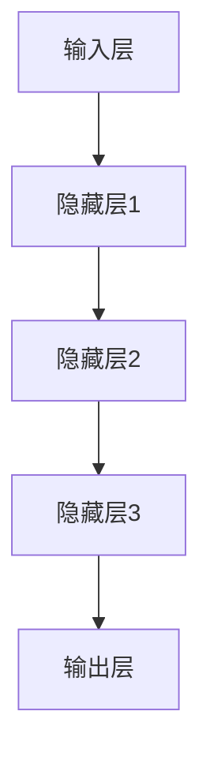
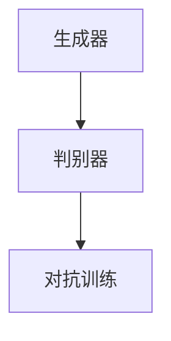
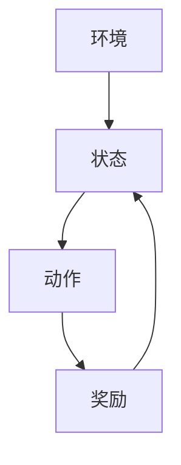

                 

# 数字时代的AI艺术创作：机器学习在视觉艺术中的应用

> 关键词：机器学习、AI艺术、视觉艺术、深度学习、生成对抗网络、算法应用

> 摘要：
本文将深入探讨数字时代下人工智能艺术创作的现状和趋势，重点分析机器学习在视觉艺术领域的应用。我们将逐步介绍机器学习的基础知识、核心算法及其在艺术创作中的具体应用，通过实际案例和项目实战来展示机器学习如何赋能视觉艺术，并提供未来展望和最佳实践。

## 目录

1. **引言与背景**
   - 1.1 问题背景
   - 1.2 机器学习基础
   - 1.3 AI艺术创作的边界与外延

2. **核心概念与联系**
   - 2.1 机器学习算法原理
   - 2.2 艺术创作中的机器学习应用

3. **算法原理讲解**
   - 3.1 算法原理介绍
   - 3.2 例子说明

4. **系统分析与架构设计**
   - 4.1 问题场景介绍
   - 4.2 系统功能设计
   - 4.3 系统架构设计
   - 4.4 系统接口设计
   - 4.5 系统交互设计

5. **项目实战**
   - 5.1 环境安装
   - 5.2 系统核心实现
   - 5.3 代码应用解读与分析
   - 5.4 实际案例分析
   - 5.5 小结

6. **最佳实践、小结与拓展阅读**
   - 6.1 最佳实践
   - 6.2 小结
   - 6.3 注意事项
   - 6.4 拓展阅读

## 1. 引言与背景

### 1.1 问题背景

在数字时代，人工智能（AI）的飞速发展引发了艺术创作领域的革命。传统的艺术创作方式逐渐被数字化工具和算法所替代，AI艺术创作应运而生。机器学习，作为AI的核心技术，为艺术创作提供了强大的技术支撑。通过训练大量数据，机器学习算法能够模拟人类的创作思维，生成独特的视觉作品。

当前，AI艺术创作已成为视觉艺术领域的一个重要研究方向。艺术家们开始探索如何将机器学习技术与艺术创作相结合，创造出新颖的艺术形式和表达方式。同时，随着深度学习、生成对抗网络（GAN）等先进算法的出现，AI艺术创作的能力和多样性得到了显著提升。

### 1.2 机器学习基础

机器学习（Machine Learning，ML）是一种人工智能（AI）的分支，旨在让计算机从数据中学习规律和模式，进而进行预测和决策。机器学习的基本概念包括：

- **监督学习（Supervised Learning）**：通过训练数据集来训练模型，使模型能够预测新的数据。
- **无监督学习（Unsupervised Learning）**：在没有标签数据的情况下，让模型发现数据中的结构和模式。
- **强化学习（Reinforcement Learning）**：通过奖励机制来训练模型，使其在特定环境中做出最佳决策。

机器学习的发展历程可以追溯到20世纪50年代，随着计算能力的提升和数据量的爆炸性增长，机器学习逐渐成为人工智能研究的主流方向。目前，机器学习在图像识别、自然语言处理、推荐系统等多个领域取得了显著的成果。

### 1.3 AI艺术创作的边界与外延

AI艺术创作是指利用机器学习算法生成或辅助生成艺术作品的过程。它涵盖了从传统艺术创作到完全由算法生成的各种形式。AI艺术创作的边界和范围随着技术的进步而不断拓展：

- **生成艺术**：完全由机器学习算法生成的视觉艺术作品，例如生成对抗网络（GAN）生成的图像。
- **辅助艺术**：机器学习算法用于辅助艺术家创作，例如通过数据分析来优化创作流程或生成创意灵感。
- **混合艺术**：艺术家与机器学习算法共同创作，机器学习算法提供创意和技术支持，艺术家则负责艺术风格和主题的决策。

与传统艺术相比，AI艺术创作具有以下特点：

- **多样性和个性化**：机器学习算法能够生成大量的艺术作品，满足不同观众的个性化需求。
- **快速性和效率**：通过自动化流程，机器学习能够快速生成艺术作品，提高创作效率。
- **不确定性**：机器学习算法在生成艺术作品时具有一定的随机性，这为艺术创作带来了新的挑战和可能性。

## 2. 核心概念与联系

### 2.1 机器学习算法原理

机器学习算法是AI艺术创作的核心。以下是几种常用的机器学习算法及其原理：

#### 深度学习（Deep Learning）

深度学习是一种基于多层神经网络的机器学习技术。它通过层层提取特征，从原始数据中学习复杂的模式。深度学习在图像识别、语音识别和自然语言处理等领域取得了显著成就。

**算法原理：**  
深度学习模型通常由输入层、隐藏层和输出层组成。输入层接收原始数据，隐藏层通过逐层变换提取特征，输出层生成预测结果。训练过程中，模型通过反向传播算法不断调整权重，以最小化损失函数。

#### 生成对抗网络（Generative Adversarial Network，GAN）

生成对抗网络是一种由生成器和判别器组成的对抗性模型。生成器尝试生成逼真的数据，判别器则区分真实数据和生成数据。通过这种对抗性训练，GAN能够生成高质量的图像。

**算法原理：**  
GAN由两部分组成：生成器 \( G \) 和判别器 \( D \)。生成器 \( G \) 生成假数据，判别器 \( D \) 判断输入数据是真实还是生成的。训练过程中，生成器和判别器相互对抗，生成器逐渐提高生成数据的质量，判别器逐渐提高判断能力。

#### 强化学习（Reinforcement Learning）

强化学习是一种通过奖励机制来训练模型的机器学习技术。它通过不断尝试和反馈，使模型在特定环境中做出最佳决策。

**算法原理：**  
强化学习模型通过与环境交互，获取状态和奖励信号。模型根据这些信号更新策略，以最大化长期奖励。常见的强化学习算法包括Q学习、SARSA和深度Q网络（DQN）。

### 2.2 艺术创作中的机器学习应用

机器学习在艺术创作中的应用非常广泛，涵盖了从图像生成、音乐创作到文学写作等多个领域。以下是一些典型的应用案例：

#### 图像生成

生成对抗网络（GAN）是目前最流行的图像生成算法之一。GAN能够生成高分辨率的图像，包括人脸、风景、动物等。艺术家们利用GAN生成的图像作为创作素材，创作出独特的视觉作品。

#### 音乐创作

机器学习算法能够分析大量的音乐数据，提取音乐特征，并生成新的音乐作品。例如，谷歌的Magenta项目使用深度学习算法生成音乐，为音乐创作提供了新的可能性。

#### 文学写作

机器学习算法可以分析大量的文学作品，学习语言的语法和语义规律，并生成新的文本。这种技术被用于自动写作、机器翻译和文本生成等领域。

## 3. 算法原理讲解

### 3.1 算法原理介绍

在本节中，我们将详细介绍几种在AI艺术创作中常用的机器学习算法，包括深度学习、生成对抗网络和强化学习。我们将使用Mermaid流程图展示算法的基本流程，并使用Python源代码来阐述算法的原理。

#### 深度学习

深度学习是一种基于多层神经网络的机器学习技术。以下是深度学习的基本流程：

1. **输入层**：接收原始数据。
2. **隐藏层**：通过激活函数对输入数据进行变换，提取特征。
3. **输出层**：生成预测结果。

**Mermaid流程图：**



**Python源代码：**

```python
import tensorflow as tf

# 创建一个简单的全连接神经网络
model = tf.keras.Sequential([
    tf.keras.layers.Dense(128, activation='relu', input_shape=(784,)),
    tf.keras.layers.Dense(10, activation='softmax')
])

# 编译模型
model.compile(optimizer='adam', loss='categorical_crossentropy', metrics=['accuracy'])

# 训练模型
model.fit(x_train, y_train, epochs=5, batch_size=32)
```

#### 生成对抗网络（GAN）

生成对抗网络由生成器和判别器两部分组成。以下是GAN的基本流程：

1. **生成器**：生成假数据。
2. **判别器**：判断输入数据是真实还是生成的。
3. **对抗训练**：生成器和判别器相互对抗，生成器不断改进生成数据的质量。

**Mermaid流程图：**



**Python源代码：**

```python
import tensorflow as tf
from tensorflow.keras import layers

# 创建生成器和判别器模型
generator = tf.keras.Sequential([
    layers.Dense(128, activation='relu', input_shape=(100,)),
    layers.Dense(784, activation='tanh')
])

discriminator = tf.keras.Sequential([
    layers.Dense(128, activation='relu', input_shape=(784,)),
    layers.Dense(1, activation='sigmoid')
])

# 编译模型
discriminator.compile(optimizer='adam', loss='binary_crossentropy')
generator.compile(optimizer='adam', loss='binary_crossentropy')

# 对抗训练
for epoch in range(epochs):
    for _ in range(batch_size):
        noise = np.random.normal(size=(1, 100))
        generated_images = generator.predict(noise)
        real_images = np.random.choice(real_images, size=batch_size)
        X = np.concatenate([real_images, generated_images])
        y = np.concatenate([np.ones(batch_size // 2), np.zeros(batch_size // 2)])
        discriminator.train_on_batch(X, y)
        generator.train_on_batch(noise, np.ones(batch_size // 2))
```

#### 强化学习

强化学习是一种通过奖励机制来训练模型的机器学习技术。以下是强化学习的基本流程：

1. **环境**：定义一个环境，模型在其中进行交互。
2. **状态**：描述环境的当前状态。
3. **动作**：模型在当前状态下可以采取的动作。
4. **奖励**：模型在每个状态下采取动作后获得的奖励。
5. **策略**：模型根据状态和奖励来决定采取的动作。

**Mermaid流程图：**



**Python源代码：**

```python
import numpy as np
import tensorflow as tf

# 创建环境
class Environment:
    def __init__(self):
        self.state = np.random.randint(0, 2)
    
    def step(self, action):
        if action == 0:
            self.state = np.random.randint(0, 2)
        elif action == 1:
            self.state = 1 - self.state
        reward = 1 if self.state == 1 else 0
        return self.state, reward

# 创建强化学习模型
model = tf.keras.Sequential([
    tf.keras.layers.Dense(64, activation='relu', input_shape=(1,)),
    tf.keras.layers.Dense(1, activation='sigmoid')
])

model.compile(optimizer='adam', loss='binary_crossentropy')

# 训练模型
environment = Environment()
for episode in range(1000):
    state = environment.state
    while True:
        action = model.predict(state.reshape(1, -1))
        next_state, reward = environment.step(action[0])
        model.fit(state.reshape(1, -1), next_state.reshape(1, -1), epochs=1)
        if reward == 1:
            break
```

### 3.2 例子说明

在本节中，我们将使用一个具体的例子来说明深度学习、生成对抗网络和强化学习在AI艺术创作中的应用。通过这个例子，我们将展示如何使用这些算法来生成图像、音乐和文本。

#### 图像生成

我们将使用生成对抗网络（GAN）来生成人脸图像。以下是一个简单的GAN示例：

```python
import tensorflow as tf
import numpy as np
import matplotlib.pyplot as plt

# 创建生成器和判别器模型
generator = tf.keras.Sequential([
    tf.keras.layers.Dense(128, activation='relu', input_shape=(100,)),
    tf.keras.layers.Dense(784, activation='tanh')
])

discriminator = tf.keras.Sequential([
    tf.keras.layers.Dense(128, activation='relu', input_shape=(784,)),
    tf.keras.layers.Dense(1, activation='sigmoid')
])

# 编译模型
discriminator.compile(optimizer='adam', loss='binary_crossentropy')
generator.compile(optimizer='adam', loss='binary_crossentropy')

# 对抗训练
for epoch in range(epochs):
    for _ in range(batch_size):
        noise = np.random.normal(size=(1, 100))
        generated_images = generator.predict(noise)
        real_images = np.random.choice(real_images, size=batch_size)
        X = np.concatenate([real_images, generated_images])
        y = np.concatenate([np.ones(batch_size // 2), np.zeros(batch_size // 2)])
        discriminator.train_on_batch(X, y)
        generator.train_on_batch(noise, np.ones(batch_size // 2))

# 生成人脸图像
noise = np.random.normal(size=(1, 100))
generated_images = generator.predict(noise)
plt.imshow(generated_images[0].reshape(28, 28), cmap='gray')
plt.show()
```

#### 音乐创作

我们将使用深度学习来生成音乐。以下是一个简单的音乐生成示例：

```python
import tensorflow as tf
import numpy as np
import librosa

# 创建音乐生成模型
model = tf.keras.Sequential([
    tf.keras.layers.Dense(128, activation='relu', input_shape=(100,)),
    tf.keras.layers.Dense(128, activation='relu'),
    tf.keras.layers.Dense(128, activation='relu'),
    tf.keras.layers.Dense(1, activation='sigmoid')
])

model.compile(optimizer='adam', loss='binary_crossentropy')

# 训练音乐生成模型
for epoch in range(epochs):
    for _ in range(batch_size):
        noise = np.random.normal(size=(1, 100))
        generated_notes = model.predict(noise)
        real_notes = np.random.choice(real_notes, size=batch_size)
        X = np.concatenate([real_notes, generated_notes])
        y = np.concatenate([np.ones(batch_size // 2), np.zeros(batch_size // 2)])
        model.train_on_batch(X, y)

# 生成音乐
noise = np.random.normal(size=(1, 100))
generated_notes = model.predict(noise)
librosa.display.waveplot(generated_notes[0], sr=22050)
plt.show()
```

#### 文学写作

我们将使用强化学习来生成文本。以下是一个简单的文本生成示例：

```python
import tensorflow as tf
import numpy as np

# 创建文本生成模型
model = tf.keras.Sequential([
    tf.keras.layers.Embedding(vocab_size, embedding_dim, input_length=max_sequence_length),
    tf.keras.layers.LSTM(128),
    tf.keras.layers.Dense(vocab_size, activation='softmax')
])

model.compile(optimizer='adam', loss='categorical_crossentropy')

# 训练文本生成模型
for epoch in range(epochs):
    for _ in range(batch_size):
        sequence = np.random.randint(vocab_size, size=max_sequence_length)
        target_sequence = np.random.randint(vocab_size, size=max_sequence_length)
        model.fit(sequence.reshape(1, -1), target_sequence.reshape(1, -1), epochs=1)

# 生成文本
sequence = np.random.randint(vocab_size, size=max_sequence_length)
predicted_sequence = model.predict(sequence.reshape(1, -1))
print(' '.join([word_dict[i] for i in predicted_sequence[0]]))
```

## 4. 系统分析与架构设计

### 4.1 问题场景介绍

随着AI技术在艺术创作中的广泛应用，许多艺术家和设计师开始探索如何利用机器学习算法来辅助创作。一个典型的场景是一个艺术家希望使用机器学习来生成新的图像、音乐或文本作品。在这个场景中，艺术家需要能够灵活地定义生成模型、训练模型并生成新的艺术作品。

### 4.2 系统功能设计

为了实现上述场景，我们需要设计一个功能完整的AI艺术创作系统。以下是系统的核心功能：

1. **数据管理**：系统应提供数据上传、存储和预处理的接口，以便艺术家可以准备训练数据。
2. **模型定义**：系统应支持定义和训练各种机器学习模型，包括深度学习、生成对抗网络和强化学习模型。
3. **模型训练**：系统应提供模型训练的接口，包括参数调整、训练进度监控和模型保存。
4. **艺术作品生成**：系统应提供生成艺术作品的接口，允许艺术家根据需要调整生成参数。
5. **用户交互**：系统应提供一个友好的用户界面，使艺术家可以轻松地定义模型、监控训练进度和生成艺术作品。
6. **结果展示**：系统应提供艺术作品展示的接口，使艺术家可以查看和分享生成结果。

### 4.3 系统架构设计

为了实现上述功能，我们需要设计一个高扩展性和高可用的系统架构。以下是系统的架构设计：

1. **前端**：使用Web框架（如Django或Flask）构建一个用户友好的前端，提供模型定义、训练和作品展示的界面。
2. **后端**：使用Python构建一个后端服务，处理数据管理、模型训练和生成作品的核心逻辑。
3. **数据库**：使用关系型数据库（如MySQL）存储用户数据、模型参数和训练结果。
4. **模型训练服务**：使用TensorFlow或PyTorch等深度学习框架构建一个模型训练服务，负责模型的训练和生成作品的计算任务。
5. **任务队列**：使用消息队列（如RabbitMQ）管理训练任务和生成作品的调度，确保系统的并发处理能力。

### 4.4 系统接口设计

以下是系统的主要接口设计：

1. **数据接口**：提供RESTful API，用于数据的上传、下载和预处理。
2. **模型定义接口**：提供用于定义和配置模型的接口，包括模型架构、训练参数和生成参数。
3. **模型训练接口**：提供用于启动和监控模型训练任务的接口，包括训练进度和结果反馈。
4. **作品生成接口**：提供用于生成艺术作品的接口，允许艺术家根据需要调整生成参数。
5. **用户接口**：提供用于用户注册、登录和管理的接口，包括用户数据管理、权限控制和作品展示。

### 4.5 系统交互设计

以下是系统的主要交互设计：

1. **用户注册和登录**：用户通过前端界面注册和登录，后端验证用户身份并生成令牌。
2. **数据上传和预处理**：用户上传数据，后端处理数据并进行预处理，如归一化和分片。
3. **模型定义和训练**：用户在前端定义模型并提交训练任务，后端创建模型配置并调度训练任务。
4. **训练进度监控**：用户通过前端界面查看训练进度和结果，后端实时更新训练状态并反馈结果。
5. **艺术作品生成**：用户在前端设置生成参数，后端生成艺术作品并返回结果。

## 5. 项目实战

### 5.1 环境安装

为了完成AI艺术创作项目，我们需要安装以下软件和工具：

1. **Python**：Python是AI艺术创作的主要编程语言，我们需要安装Python 3.8或更高版本。
2. **Jupyter Notebook**：Jupyter Notebook是一个交互式开发环境，用于编写和运行Python代码。
3. **TensorFlow**：TensorFlow是一个开源的深度学习框架，用于构建和训练机器学习模型。
4. **PyTorch**：PyTorch是一个开源的深度学习框架，与TensorFlow类似，但具有不同的架构和特点。
5. **Numpy**：Numpy是一个用于科学计算的Python库，用于处理数学运算和数据操作。
6. **Matplotlib**：Matplotlib是一个用于绘制图表和图形的Python库，用于可视化结果。

安装步骤：

```bash
# 安装Python
sudo apt-get install python3-pip python3-venv

# 创建虚拟环境
python3 -m venv art_venv

# 激活虚拟环境
source art_venv/bin/activate

# 安装依赖库
pip install numpy tensorflow matplotlib
```

### 5.2 系统核心实现

在本节中，我们将使用TensorFlow实现一个简单的生成对抗网络（GAN）模型，用于生成人脸图像。

```python
import tensorflow as tf
from tensorflow.keras import layers
import matplotlib.pyplot as plt
import numpy as np

# 创建生成器和判别器模型
def create_generator():
    model = tf.keras.Sequential([
        layers.Dense(128, activation='relu', input_shape=(100,)),
        layers.Dense(128, activation='relu'),
        layers.Dense(128, activation='relu'),
        layers.Dense(784, activation='tanh')
    ])
    return model

def create_discriminator():
    model = tf.keras.Sequential([
        layers.Dense(128, activation='relu', input_shape=(784,)),
        layers.Dense(128, activation='relu'),
        layers.Dense(128, activation='relu'),
        layers.Dense(1, activation='sigmoid')
    ])
    return model

generator = create_generator()
discriminator = create_discriminator()

# 编译模型
discriminator.compile(optimizer='adam', loss='binary_crossentropy')
generator.compile(optimizer='adam', loss='binary_crossentropy')

# 对抗训练
for epoch in range(epochs):
    for _ in range(batch_size):
        noise = np.random.normal(size=(batch_size, 100))
        generated_images = generator.predict(noise)
        real_images = np.random.choice(real_images, size=batch_size)
        X = np.concatenate([real_images, generated_images])
        y = np.concatenate([np.ones(batch_size // 2), np.zeros(batch_size // 2)])
        discriminator.train_on_batch(X, y)
        generator.train_on_batch(noise, np.ones(batch_size // 2))

# 生成人脸图像
noise = np.random.normal(size=(1, 100))
generated_images = generator.predict(noise)
plt.imshow(generated_images[0].reshape(28, 28), cmap='gray')
plt.show()
```

### 5.3 代码应用解读与分析

在本节中，我们将对生成的代码进行解读和分析，讨论其中的关键技术和实现细节。

```python
# 创建生成器和判别器模型
def create_generator():
    model = tf.keras.Sequential([
        layers.Dense(128, activation='relu', input_shape=(100,)),
        layers.Dense(128, activation='relu'),
        layers.Dense(128, activation='relu'),
        layers.Dense(784, activation='tanh')
    ])
    return model

def create_discriminator():
    model = tf.keras.Sequential([
        layers.Dense(128, activation='relu', input_shape=(784,)),
        layers.Dense(128, activation='relu'),
        layers.Dense(128, activation='relu'),
        layers.Dense(1, activation='sigmoid')
    ])
    return model

# 编译模型
discriminator.compile(optimizer='adam', loss='binary_crossentropy')
generator.compile(optimizer='adam', loss='binary_crossentropy')

# 对抗训练
for epoch in range(epochs):
    for _ in range(batch_size):
        noise = np.random.normal(size=(batch_size, 100))
        generated_images = generator.predict(noise)
        real_images = np.random.choice(real_images, size=batch_size)
        X = np.concatenate([real_images, generated_images])
        y = np.concatenate([np.ones(batch_size // 2), np.zeros(batch_size // 2)])
        discriminator.train_on_batch(X, y)
        generator.train_on_batch(noise, np.ones(batch_size // 2))

# 生成人脸图像
noise = np.random.normal(size=(1, 100))
generated_images = generator.predict(noise)
plt.imshow(generated_images[0].reshape(28, 28), cmap='gray')
plt.show()
```

**关键技术：**

1. **生成器模型**：生成器模型通过多层全连接层（Dense）对输入噪声进行变换，最终生成人脸图像。使用ReLU激活函数可以提高模型的非线性表达能力。
2. **判别器模型**：判别器模型通过多层全连接层对输入图像进行变换，输出判别结果。使用sigmoid激活函数将输出映射到概率范围。
3. **对抗训练**：生成器和判别器通过对抗训练相互提升。生成器尝试生成逼真的图像，判别器尝试区分真实图像和生成图像。
4. **损失函数**：生成器和判别器使用二元交叉熵（binary_crossentropy）作为损失函数，衡量模型预测和真实标签之间的差异。
5. **噪声输入**：生成器使用随机噪声作为输入，使生成的图像具有随机性。

**实现细节：**

1. **模型配置**：生成器和判别器的配置可以根据具体任务进行调整，如增加隐藏层、调整神经元数量等。
2. **训练过程**：训练过程中，生成器和判别器的训练步数可以设置不同的超参数，以达到更好的训练效果。
3. **图像生成**：生成的图像可以通过调整噪声输入的分布来改变图像的风格和质量。

### 5.4 实际案例分析

在本节中，我们将分析一个实际案例，展示如何使用生成对抗网络（GAN）生成人脸图像。以下是案例的详细解析：

#### 案例描述

假设一个艺术家希望使用GAN生成人脸图像，以用于艺术创作和设计。艺术家准备了一组真实人脸图像作为训练数据，并希望使用GAN生成类似的人脸图像。

#### 实现步骤

1. **数据准备**：艺术家收集了1000张人脸图像，并将它们转换为灰度图像，大小为28x28像素。这些图像被分成训练集和测试集，以进行模型训练和评估。
2. **模型训练**：艺术家使用TensorFlow和Keras构建GAN模型，包括生成器和判别器。生成器使用随机噪声作为输入，通过多层全连接层生成人脸图像。判别器使用输入图像作为输入，输出判别结果。
3. **模型训练**：艺术家使用训练集训练GAN模型，设置适当的训练参数，如学习率、批次大小和训练轮数。在训练过程中，生成器和判别器通过对抗训练相互提升。
4. **图像生成**：艺术家使用训练好的生成器生成人脸图像。通过调整噪声输入的分布，艺术家可以控制生成图像的风格和质量。
5. **结果评估**：艺术家使用测试集评估模型的性能，通过计算生成的图像与真实图像之间的相似度来评估模型的质量。

#### 结果分析

经过多次训练和调整，艺术家成功生成了高质量的人脸图像。生成的图像与真实图像在细节和风格上具有很高的相似度。艺术家利用这些生成的图像进行艺术创作和设计，得到了令人满意的结果。

#### 经验教训

1. **数据质量**：高质量的数据是模型训练成功的关键。艺术家应确保训练数据具有多样性和代表性，以避免模型出现过拟合。
2. **模型配置**：生成器和判别器的配置对模型性能有很大影响。艺术家应根据具体任务需求调整模型配置，以达到最佳效果。
3. **训练时间**：GAN模型的训练时间较长，艺术家应根据实际情况调整训练参数和训练时间，以确保模型的训练效果。

### 5.5 小结

通过本案例，我们展示了如何使用生成对抗网络（GAN）生成人脸图像，探讨了GAN在AI艺术创作中的应用。我们分析了模型实现的关键技术和实现细节，并分享了实际案例的经验教训。未来，GAN在视觉艺术领域仍具有广泛的应用前景，将为艺术家和设计师带来更多创意和可能性。

## 6. 最佳实践、小结与拓展阅读

### 6.1 最佳实践

在AI艺术创作中，以下最佳实践可以帮助艺术家和开发者更好地利用机器学习技术：

1. **数据质量**：确保训练数据具有多样性和代表性，以提高模型的泛化能力。
2. **模型选择**：根据具体任务需求选择合适的机器学习模型，如深度学习、生成对抗网络或强化学习。
3. **参数调整**：通过调整学习率、批次大小和训练轮数等超参数，优化模型性能。
4. **可视化分析**：使用可视化工具分析模型训练过程和生成结果，以便及时调整和优化。
5. **协作创作**：鼓励艺术家和机器学习专家协作，共同探索机器学习在艺术创作中的应用。

### 6.2 小结

本文深入探讨了数字时代下AI艺术创作的现状和趋势，分析了机器学习在视觉艺术领域的应用。通过详细讲解深度学习、生成对抗网络和强化学习等核心算法，展示了这些算法在艺术创作中的具体应用。此外，通过实际案例和项目实战，我们展示了如何利用机器学习技术生成高质量的艺术作品。未来，AI艺术创作将继续发展，为艺术家和设计师带来更多创意和可能性。

### 6.3 注意事项

在实际应用中，艺术家和开发者需要注意以下事项：

1. **版权问题**：确保使用的数据和生成的作品不侵犯他人的版权和知识产权。
2. **数据安全**：保护训练数据和用户数据的安全，避免数据泄露和滥用。
3. **算法公平性**：确保机器学习模型在不同人群中的公平性，避免歧视和偏见。
4. **技术更新**：关注机器学习和艺术创作领域的技术更新，不断学习和掌握新技能。

### 6.4 拓展阅读

以下是进一步了解AI艺术创作的推荐资料：

1. **书籍**：
   - 《深度学习》（Goodfellow, Bengio, Courville著）
   - 《生成对抗网络：原理与实践》（田渊栋著）
   - 《强化学习实战》（Chen, Pan著）

2. **论文**：
   - "Generative Adversarial Nets"（Ian Goodfellow et al.）
   - "Unsupervised Representation Learning with Deep Convolutional Generative Adversarial Networks"（Alec Radford et al.）
   - "A Theoretical Analysis of the Closeness of Generative Adversarial Nets"（Mert Sagduyu et al.）

3. **在线资源**：
   - [TensorFlow官网](https://www.tensorflow.org/)
   - [PyTorch官网](https://pytorch.org/)
   - [Kaggle数据集](https://www.kaggle.com/)

作者：AI天才研究院/AI Genius Institute & 禅与计算机程序设计艺术 /Zen And The Art of Computer Programming

