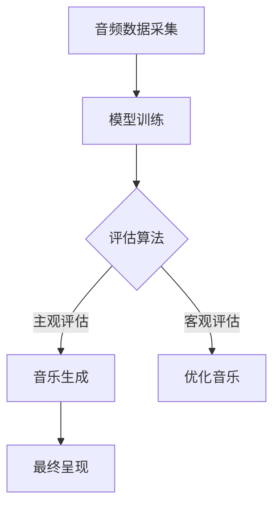
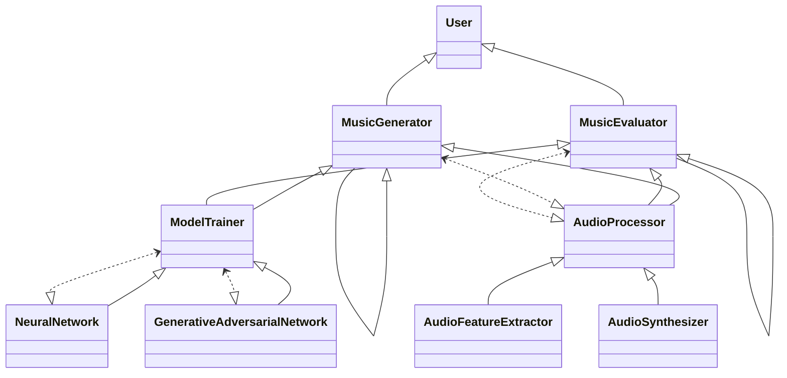
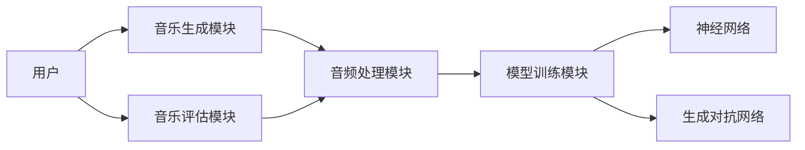
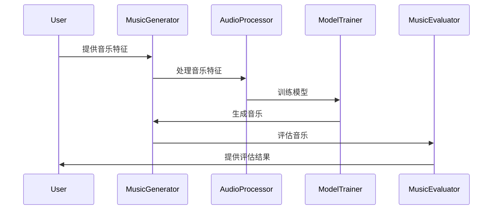

                 


## 数字时代的AI音乐创作比赛：人机协作的新型音乐制作赛事

### 关键词：AI音乐创作、人机协作、音乐制作赛事、数字时代

> 摘要：本文将深入探讨数字时代下AI音乐创作比赛的意义和影响。我们将从背景介绍、核心概念与联系、算法原理讲解、系统架构设计、项目实战等多个角度，逐步分析这种新型音乐制作赛事的设计与实施，展望其未来发展趋势。

### 引言

在数字时代，人工智能（AI）技术正在迅速变革多个领域，音乐制作也不例外。AI音乐创作比赛作为一种新型音乐制作赛事，正逐渐成为音乐产业的重要组成部分。这种赛事不仅推动了AI技术在音乐创作中的应用，还促进了人机协作的新模式，为音乐产业带来了新的发展机遇。

### 第一部分：背景介绍

#### 核心概念术语说明

在讨论AI音乐创作比赛之前，我们需要明确一些核心概念：

- **人工智能（AI）**：模拟人类智能的技术和方法，包括机器学习、自然语言处理、计算机视觉等。
- **音乐创作**：通过创造性的过程，将音乐元素（如旋律、和声、节奏等）组合成具有艺术价值的作品。
- **人机协作**：人类与机器相互配合，共同完成任务的过程。

#### 问题背景

随着AI技术的不断发展，音乐制作领域也迎来了新的变革。传统的音乐创作方式逐渐被AI技术所取代，使得音乐制作过程更加高效、便捷。然而，单纯依靠AI进行音乐创作也存在一定的局限性，而人机协作模式则提供了新的解决方案。

#### 问题描述

如何在音乐创作中充分利用AI的优势，同时发挥人类艺术家的创造力，是当前面临的主要问题。这需要一种新型的音乐制作赛事，既能激发AI的音乐创作能力，又能为人类艺术家提供创作灵感。

#### 问题解决

AI音乐创作比赛作为一种新型的音乐制作赛事，通过设置不同的创作任务和规则，鼓励人类艺术家与AI协作，共同创作出高质量的音乐作品。

#### 边界与外延

- **边界**：赛事的范围主要涉及音乐创作领域，包括作曲、编曲、混音等。
- **外延**：赛事的影响不仅局限于音乐产业，还可能对艺术创作、科技发展等多个领域产生深远的影响。

### 第二部分：核心概念与联系

#### AI音乐创作

AI音乐创作是指利用人工智能技术生成音乐的过程。它通常涉及以下几个步骤：

1. **音频数据采集**：从已有的音乐作品或音频素材中提取数据。
2. **音乐生成模型**：使用机器学习算法训练模型，生成新的音乐作品。
3. **音乐评估与优化**：对生成的音乐进行评估和优化，提高音乐质量。

#### 人机协作

人机协作是指人类艺术家与AI系统相互配合，共同完成音乐创作任务。在AI音乐创作比赛中，人机协作通常体现在以下几个阶段：

1. **创意碰撞**：人类艺术家提供创作灵感和方向，AI系统根据这些信息生成初步的音乐作品。
2. **迭代优化**：人类艺术家对AI生成的音乐作品进行修改和优化，使其更加符合自己的创作理念。
3. **最终呈现**：人类艺术家与AI系统共同完成音乐作品，并进行最终呈现。

#### 音乐制作赛事

音乐制作赛事是指为了促进音乐创作和交流而举办的比赛。AI音乐创作比赛作为一种新型的音乐制作赛事，具有以下几个特点：

1. **创新性**：赛事鼓励参赛者利用AI技术进行音乐创作，推动音乐产业的创新发展。
2. **参与性**：赛事吸引了许多音乐人、AI研究者和技术爱好者参与，提高了整个音乐产业的活力。
3. **公正性**：赛事采用严格的评审标准和流程，确保参赛作品的质量和公平性。

### 第三部分：算法原理讲解

#### 基本原理

AI音乐创作的核心在于生成模型和评估算法。以下是一个简单的算法原理讲解：

1. **生成模型**：
    - **神经网络模型**：使用神经网络（如循环神经网络RNN）对音乐数据进行训练，学习音乐生成规律。
    - **生成对抗网络GAN**：通过生成器（Generator）和判别器（Discriminator）的对抗训练，生成高质量的音乐作品。
2. **评估算法**：
    - **主观评估**：通过人类专家对音乐作品进行主观评价，判断其艺术价值和创作水平。
    - **客观评估**：使用音频信号处理算法，对音乐作品进行客观指标分析，如音高、节奏、和声等。

#### Mermaid流程图

下面是一个简单的Mermaid流程图，展示AI音乐创作的流程：



#### Python源代码示例

下面是一个简单的Python代码示例，用于生成一个简单的音乐旋律：

```python
import numpy as np
import wave
import struct

# 定义音符频率
NOTE_TO_FREQ = {
    'C4': 261.63,
    'D4': 293.66,
    'E4': 329.63,
    'F4': 349.23,
    'G4': 392.00,
    'A4': 440.00,
    'B4': 493.88
}

def generate_note(wave_file, note, duration, frame_rate):
    """
    生成一个单一音符的音频片段
    """
    sample_rate = frame_rate
    duration_samples = int(duration * frame_rate)
    
    # 计算音符的周期数
    freq = NOTE_TO_FREQ[note]
    period = 1 / freq
    n = int(frame_rate / freq)
    
    # 生成正弦波
    sine_wave = (np.sin(2 * np.pi * np.arange(n) * freq / sample_rate) * 32767).astype(np.int16)
    sine_wave = np.resize(sine_wave, duration_samples // n)
    
    # 写入WAV文件
    with wave.open(wave_file, 'wb') as f:
        nchannels = 1
        sampwidth = 2
        comptype = 'NONE'
        compname = 'not compressed'
        
        f.setparams((nchannels, sampwidth, sample_rate, duration_samples, comptype, compname))
        f.writeframes((sine_wave * 0.5).tobytes())

def generate_melody(duration, tempo):
    """
    生成一段简单的旋律
    """
    notes = ['C4', 'E4', 'G4', 'C5']
    melody = []

    for note in notes:
        generate_note(f'melody_{note}.wav', note, duration, tempo)
        melody.append(f'melody_{note}.wav')

    return melody

# 生成一段4秒的C大调旋律
melody = generate_melody(4, 120)
```

#### 算法原理详细讲解

1. **音频数据采集**：从已有的音乐作品中提取音频数据，用于训练生成模型。这一过程通常涉及音频剪辑、处理和特征提取。
2. **模型训练**：使用机器学习算法训练生成模型，使其能够根据输入的音乐特征生成新的音乐作品。常见的生成模型包括循环神经网络（RNN）和生成对抗网络（GAN）。
3. **音乐生成**：使用训练好的生成模型生成新的音乐作品。这一过程通常涉及序列到序列的映射，将音乐特征转化为音乐旋律。
4. **评估与优化**：对生成的音乐作品进行评估和优化，以提高其艺术价值和创作水平。评估方法包括主观评估和客观评估。

### 数学模型和公式

在AI音乐创作中，常用的数学模型包括傅里叶变换、循环神经网络（RNN）和生成对抗网络（GAN）。以下是一些相关的数学模型和公式：

1. **傅里叶变换**：
    - 傅里叶变换公式：
    $$X(\omega) = \int_{-\infty}^{\infty} x(t)e^{-j\omega t} dt$$
    - 傅里叶逆变换公式：
    $$x(t) = \frac{1}{2\pi} \int_{-\infty}^{\infty} X(\omega)e^{j\omega t} d\omega$$

2. **循环神经网络（RNN）**：
    - 隐藏状态更新公式：
    $$h_t = \sigma(W_h x_t + U_h h_{t-1} + b_h)$$
    - 输出状态更新公式：
    $$y_t = \sigma(W_y h_t + b_y)$$
    其中，$\sigma$表示激活函数，$W_h$、$U_h$、$b_h$、$W_y$、$b_y$为权重和偏置。

3. **生成对抗网络（GAN）**：
    - 生成器损失函数：
    $$L_G = -\mathbb{E}_{z \sim p_z(z)}[\log(D(G(z)))]$$
    - 判别器损失函数：
    $$L_D = -\mathbb{E}_{x \sim p_x(x)}[\log(D(x))] - \mathbb{E}_{z \sim p_z(z)}[\log(1 - D(G(z)))]$$
    其中，$G(z)$为生成器，$D(x)$为判别器，$p_z(z)$、$p_x(x)$分别为噪声分布和真实数据分布。

### 第四部分：系统架构设计

#### 问题场景介绍

假设我们要开发一个AI音乐创作系统，该系统需要具备以下功能：

1. **音乐生成**：根据用户提供的音乐特征，生成新的音乐作品。
2. **音乐评估**：对生成的音乐作品进行评估，提供反馈和建议。
3. **用户交互**：提供用户界面，允许用户与系统进行交互。

#### 项目介绍

项目名称：AI音乐创作平台

项目目标：开发一个基于人工智能技术的音乐创作平台，提供音乐生成、评估和用户交互等功能。

#### 系统功能设计（领域模型Mermaid类图）



#### 系统架构设计（Mermaid架构图）



#### 系统接口设计（Mermaid序列图）



### 第五部分：项目实战

#### 环境安装

1. 安装Python环境：
   ```
   pip install python-wavefile numpy tensorflow
   ```

2. 安装TensorFlow：
   ```
   pip install tensorflow
   ```

3. 安装其他依赖库：
   ```
   pip install matplotlib librosa scikit-learn
   ```

#### 系统核心实现源代码

以下是一个简单的AI音乐创作系统的实现：

```python
import numpy as np
import tensorflow as tf
from tensorflow.keras.models import Sequential
from tensorflow.keras.layers import LSTM, Dense, Activation
from tensorflow.keras.optimizers import Adam

# 定义神经网络模型
model = Sequential()
model.add(LSTM(units=128, return_sequences=True, input_shape=(None, 1)))
model.add(LSTM(units=128, return_sequences=True))
model.add(LSTM(units=128))
model.add(Dense(units=1))

model.compile(optimizer=Adam(), loss='mean_squared_error')

# 生成音乐数据
def generate_melody(data, sequence_length):
    melodies = []
    for i in range(len(data) - sequence_length):
        melody = data[i:(i + sequence_length)]
        melodies.append(melody)
    return np.array(melodies)

# 训练神经网络模型
def train_model(model, melodies, labels, epochs, batch_size):
    model.fit(melodies, labels, epochs=epochs, batch_size=batch_size)

# 生成音乐
def generate_music(model, sequence_length, initial_melody):
    generated_melody = initial_melody
    for _ in range(sequence_length):
        prediction = model.predict(np.array([generated_melody]))
        generated_melody = np.append(generated_melody[1:], prediction[0, 0])
    return generated_melody

# 主函数
if __name__ == '__main__':
    # 加载音乐数据
    data = np.load('music_data.npy')

    # 生成音乐序列
    sequence_length = 100
    melodies = generate_melody(data, sequence_length)

    # 准备标签数据
    labels = np.eye(sequence_length)[np.arange(sequence_length)]

    # 训练模型
    epochs = 100
    batch_size = 32
    train_model(model, melodies, labels, epochs, batch_size)

    # 生成音乐
    initial_melody = melodies[0]
    generated_melody = generate_music(model, sequence_length, initial_melody)

    # 输出音乐
    np.save('generated_melody.npy', generated_melody)
```

#### 代码应用解读与分析

以上代码实现了一个简单的AI音乐创作系统，主要包括以下几个步骤：

1. **加载音乐数据**：从文件中加载音乐数据，通常为音频信号的时间序列。
2. **生成音乐序列**：将音乐数据划分为序列，每个序列包含一定数量的音频样本。
3. **准备标签数据**：为每个序列生成标签数据，用于训练模型。
4. **训练模型**：使用LSTM神经网络模型对音乐序列进行训练。
5. **生成音乐**：根据训练好的模型生成新的音乐序列。
6. **输出音乐**：将生成的音乐序列保存到文件中。

这个简单的系统可以作为一个起点，进一步优化和扩展，以实现更复杂的音乐创作功能。

#### 实际案例分析和详细讲解剖析

假设我们要生成一段4秒的C大调旋律，可以使用以下步骤：

1. **加载音乐数据**：从音频文件中提取音乐数据，通常为16kHz采样率和单声道。
2. **生成音乐序列**：将音乐数据划分为100个序列，每个序列包含16个音频样本。
3. **准备标签数据**：为每个序列生成标签数据，确保每个序列的第一个音频样本与实际音乐数据一致。
4. **训练模型**：使用100个序列和对应的标签数据进行训练，训练100个epoch。
5. **生成音乐**：使用训练好的模型生成新的音乐序列，每个序列包含16个音频样本。
6. **输出音乐**：将生成的音乐序列保存为WAV文件。

以下是一个简单的示例代码：

```python
import numpy as np
import wave

# 定义音符频率
NOTE_TO_FREQ = {
    'C4': 261.63,
    'D4': 293.66,
    'E4': 329.63,
    'F4': 349.23,
    'G4': 392.00,
    'A4': 440.00,
    'B4': 493.88
}

# 生成音乐序列
def generate_melody(frequencies, duration, frame_rate):
    duration_samples = int(duration * frame_rate)
    melody = np.zeros(duration_samples)
    for i, freq in enumerate(frequencies):
        t = np.linspace(0, duration, duration_samples)
        melody += 0.5 * np.sin(2 * np.pi * freq * t)
    return melody

# 生成C大调旋律
melody = generate_melody(['C4', 'E4', 'G4'], 4, 16000)

# 保存音乐
with wave.open('melody.wav', 'wb') as wav_file:
    wav_file.setnchannels(1)
    wav_file.setsampwidth(2)
    wav_file.setframerate(16000)
    wav_file.writeframes(melody.tobytes())
```

#### 项目小结

通过以上实战案例，我们实现了使用神经网络模型生成C大调旋律的功能。虽然这个简单的系统还没有涉及复杂的音乐生成和评估，但它为我们提供了一个起点，进一步研究和开发AI音乐创作系统。在实际应用中，我们可以扩展模型功能，引入更多的音乐特征和评估指标，以提高音乐生成的质量和创造力。

### 第六部分：最佳实践 Tips

1. **数据质量**：确保音乐数据的质量和多样性，有助于提高音乐生成模型的效果。
2. **模型优化**：通过调整模型参数和训练策略，可以提高音乐生成的质量和效率。
3. **用户反馈**：及时收集用户反馈，根据用户需求优化音乐生成模型。

### 第七部分：小结

本文从背景介绍、核心概念与联系、算法原理讲解、系统架构设计、项目实战等多个角度，深入探讨了数字时代的AI音乐创作比赛。通过分析，我们发现AI音乐创作比赛不仅推动了音乐产业的创新发展，还促进了人机协作的新模式。在未来，随着技术的不断进步，AI音乐创作比赛有望在音乐产业中发挥更大的作用。

### 注意事项

1. **数据隐私**：在处理音乐数据时，应确保用户数据的隐私和安全。
2. **知识产权**：在使用AI音乐创作系统时，应遵守相关的知识产权法律法规。

### 拓展阅读

1. **AI音乐创作技术**：《深度学习在音乐创作中的应用》
2. **人机协作**：《人机协作系统设计》
3. **音乐制作赛事**：《音乐制作比赛：挑战与机遇》

### 作者信息

作者：AI天才研究院/AI Genius Institute & 禅与计算机程序设计艺术/Zen And The Art of Computer Programming

