                 

### 数字时代的个人知识管理：构建数字化第二大脑的方法

> 关键词：数字时代、个人知识管理、数字化第二大脑、知识获取、知识存储、知识加工、知识应用

> 摘要：本文将探讨数字时代下的个人知识管理问题，分析其在现代工作中的重要性，并提出一种构建数字化第二大脑的方法。通过详细的步骤和实例，帮助读者了解如何高效地获取、存储、管理和应用知识，从而提升个人工作和生活的效率。

### 1.1 背景介绍：数字时代的个人知识管理

#### 1.1.1 问题背景

在数字时代，信息爆炸使得个人知识管理变得更加重要。我们每天都会接触到大量的信息，从互联网、书籍、讲座、会议等各个渠道获取知识。然而，如何有效地获取、存储、管理和应用这些知识，成为一个亟待解决的问题。

#### 1.1.2 问题描述

个人知识管理面临的主要问题包括：信息过载、知识分散、难以检索和利用、知识更新迭代快等。这些问题的存在，使得个人难以高效地进行知识管理，从而影响了工作效率和创新能力。

#### 1.1.3 问题解决

为了解决这些问题，我们需要构建数字化第二大脑，通过工具和方法，实现知识的系统化、结构化和智能化管理。数字化第二大脑可以看作是一个虚拟的知识库，它能够帮助个人高效地获取、存储、管理和应用知识。

#### 1.1.4 边界与外延

数字时代的个人知识管理不仅涉及到知识获取和存储，还包括知识加工、知识传播和知识应用。它不仅局限于个人，还可以扩展到团队和组织层面，实现知识的共享和协同。

#### 1.1.5 概念结构与核心要素组成

数字时代的个人知识管理由以下几个核心要素组成：

1. **知识获取**：通过各种渠道获取知识，如互联网搜索、书籍阅读、讲座学习等。
2. **知识存储**：将获取到的知识存储到数字化工具中，如笔记软件、知识库系统等。
3. **知识加工**：对存储的知识进行整理、分类、标注等，使其更加系统化和结构化。
4. **知识应用**：将加工后的知识应用到实际工作和生活中，实现知识的价值和效能。
5. **知识传播**：通过分享、交流等方式，将个人的知识传播给他人，实现知识的扩散和增值。

### 1.2 核心概念与联系

#### 1.2.1 数字化第二大脑

数字化第二大脑是一个虚拟的知识库，它能够帮助个人高效地获取、存储、管理和应用知识。它由以下几个部分组成：

1. **知识获取模块**：负责从互联网、书籍、讲座等渠道获取知识。
2. **知识存储模块**：将获取到的知识存储到数据库或知识库系统中。
3. **知识加工模块**：对存储的知识进行整理、分类、标注等，使其更加系统化和结构化。
4. **知识应用模块**：将加工后的知识应用到实际工作和生活中。
5. **知识传播模块**：通过分享、交流等方式，将个人的知识传播给他人。

##### 知识获取模块

知识获取模块是数字化第二大脑的起点，负责从各种渠道获取知识。以下是一个简单的 Mermaid 流程图，展示了知识获取的过程：

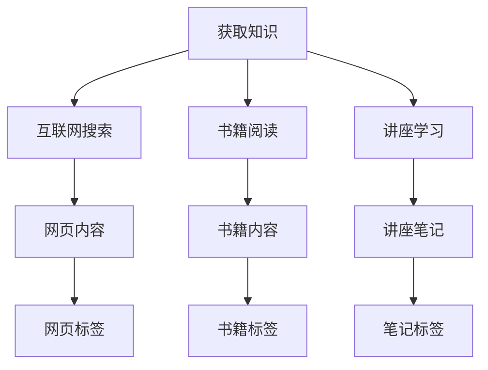

##### 知识存储模块

知识存储模块是数字化第二大脑的核心，负责将获取到的知识存储到数据库或知识库系统中。以下是一个简单的 Mermaid 流程图，展示了知识存储的过程：

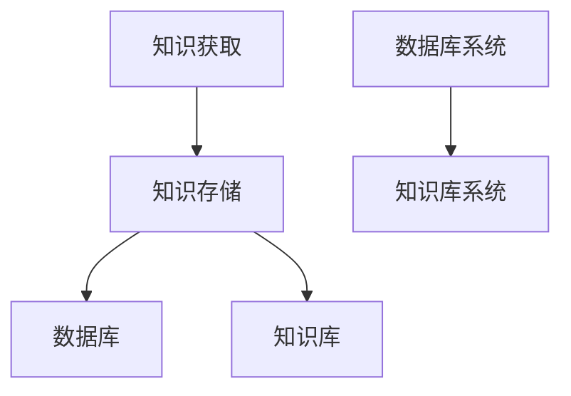

##### 知识加工模块

知识加工模块对存储的知识进行整理、分类、标注等，使其更加系统化和结构化。以下是一个简单的 Mermaid 流程图，展示了知识加工的过程：

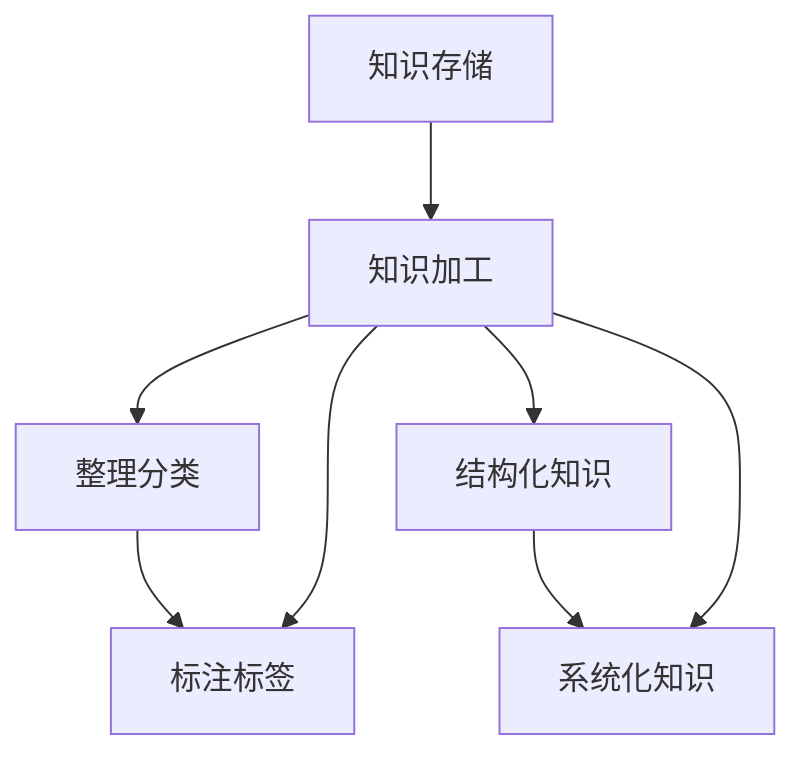

##### 知识应用模块

知识应用模块将加工后的知识应用到实际工作和生活中。以下是一个简单的 Mermaid 流程图，展示了知识应用的过程：

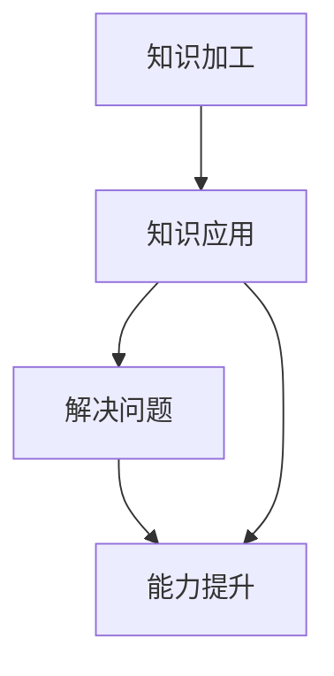

##### 知识传播模块

知识传播模块通过分享、交流等方式，将个人的知识传播给他人，实现知识的扩散和增值。以下是一个简单的 Mermaid 流程图，展示了知识传播的过程：

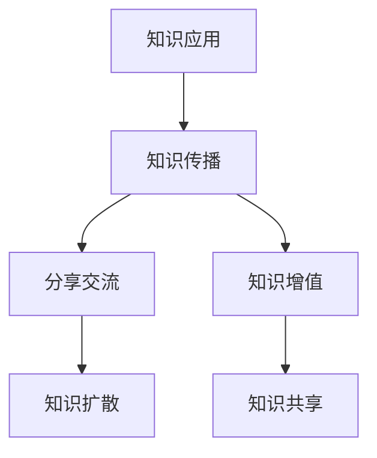

#### 1.2.2 知识图谱

知识图谱是一个由实体、属性和关系构成的知识网络，它能够帮助我们更好地理解和组织知识。以下是一个简单的 ER 实体关系图，展示了知识图谱的构成：

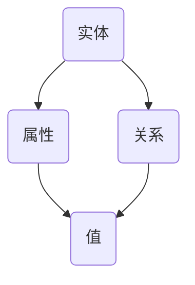

实体：表示知识的主体，如“人”、“书籍”、“讲座”等。

属性：表示实体的特征，如“姓名”、“出版日期”、“主题”等。

关系：表示实体之间的关系，如“作者”、“所属”、“参加”等。

值：表示属性的取值，如“张三”、“2023-01-01”、“算法”等。

#### 1.2.3 个人知识管理工具

个人知识管理工具是指用于帮助个人进行知识获取、存储、加工、应用和传播的软件或平台。常见的个人知识管理工具有笔记软件、知识库系统、学习平台等。

以下是一个简单的 Mermaid 类图，展示了个人知识管理工具的构成：

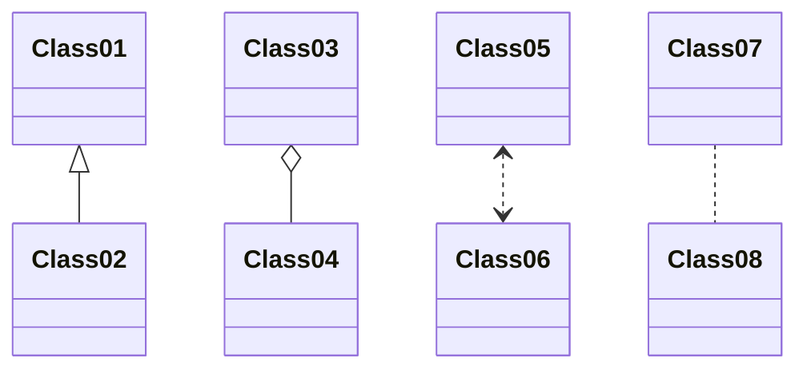

- **笔记软件**：如 Evernote、OneNote 等，用于记录和整理知识。
- **知识库系统**：如 Confluence、Wiki 等，用于创建和存储知识库。
- **学习平台**：如 Coursera、Udemy 等，用于在线学习和知识传播。

### 1.3 数字化第二大脑的构建方法

#### 1.3.1 知识获取

知识获取是数字化第二大脑构建的基础。我们可以通过以下几种方式获取知识：

1. **主动搜索**：利用搜索引擎、学术数据库等，主动搜索感兴趣的知识。
2. **被动获取**：通过阅读书籍、文章、听讲座等方式，被动获取知识。
3. **互动学习**：通过线上课程、研讨会、交流互动等方式，与他人共同学习知识。

以下是一个简单的 Mermaid 流程图，展示了知识获取的过程：

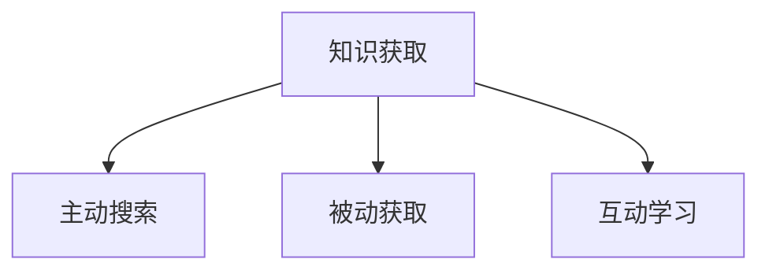

#### 1.3.2 知识存储

知识存储是将获取到的知识保存到数字化工具中。我们可以使用以下几种工具进行知识存储：

1. **笔记软件**：如 Evernote、OneNote 等，用于记录和整理知识。
2. **知识库系统**：如 Confluence、Wiki 等，用于创建和存储知识库。
3. **云存储**：如 Google Drive、Dropbox 等，用于存储和共享知识文件。

以下是一个简单的 Mermaid 流程图，展示了知识存储的过程：

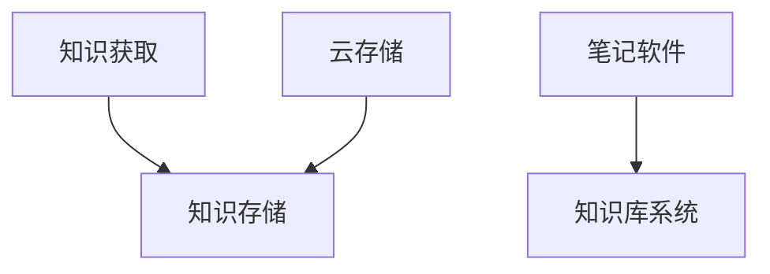

#### 1.3.3 知识加工

知识加工是对存储的知识进行整理、分类、标注等，使其更加系统化和结构化。我们可以使用以下几种方法进行知识加工：

1. **思维导图**：使用思维导图软件，如 MindManager、Xmind 等，对知识进行可视化整理。
2. **知识标签**：对知识进行分类和标注，使其更加易于检索和应用。
3. **知识梳理**：对知识进行深度整理，形成知识体系。

以下是一个简单的 Mermaid 流程图，展示了知识加工的过程：

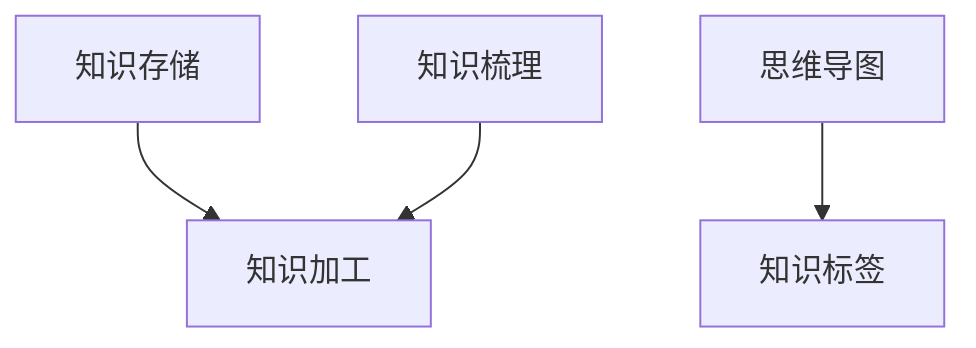

#### 1.3.4 知识应用

知识应用是将加工后的知识应用到实际工作和生活中。我们可以通过以下几种方式实现知识应用：

1. **解决问题**：利用知识解决实际工作中遇到的问题。
2. **提升能力**：通过学习知识，提升个人的专业技能和综合素质。
3. **创新思维**：通过运用知识，激发创新思维，提出新的观点和想法。

以下是一个简单的 Mermaid 流程图，展示了知识应用的过程：

#### 1.3.5 知识传播

知识传播是将个人的知识分享给他人，实现知识的扩散和增值。

以下是一个简单的 Mermaid 流程图，展示了知识传播的过程：

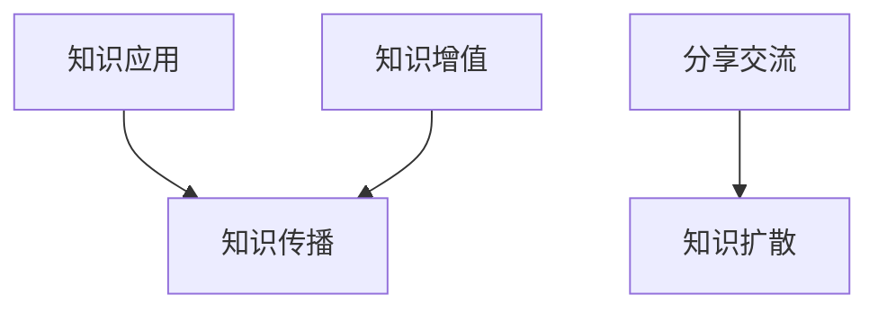

### 1.4 数字化第二大脑的优势

构建数字化第二大脑具有以下优势：

1. **高效的知识获取**：通过主动搜索、被动获取和互动学习，快速获取所需知识。
2. **系统化的知识存储**：将知识存储到数字化工具中，便于长期保存和管理。
3. **结构化的知识加工**：对知识进行整理、分类、标注等，使其更加系统化和结构化。
4. **智能化的知识应用**：通过知识图谱等技术，实现知识的智能化应用和推荐。
5. **共享的知识传播**：将知识分享给他人，实现知识的扩散和增值。

### 1.5 实践与建议

在构建数字化第二大脑的过程中，以下是一些建议和实践方法：

1. **选择合适的工具**：根据个人需求和习惯，选择合适的笔记软件、知识库系统等工具。
2. **建立知识体系**：对知识进行深度整理，形成知识体系，便于理解和应用。
3. **定期回顾和更新**：定期回顾和更新知识库，确保知识的准确性和时效性。
4. **与他人交流和分享**：与他人交流和分享知识，促进知识的传播和增值。
5. **持续学习和探索**：保持对新技术和新知识的敏感度，持续学习和探索。

### 1.6 小结

数字时代的个人知识管理是一个复杂而重要的话题。通过构建数字化第二大脑，我们可以高效地获取、存储、管理和应用知识，从而提升个人工作和生活的效率。本文介绍了数字化第二大脑的背景、核心概念、构建方法以及优势，并提供了一些建议和实践方法。希望本文能够为读者提供一些有益的启示和帮助。 

### 1.7 拓展阅读

- 《智能知识图谱：原理、方法与应用》
- 《知识管理：技术与实践》
- 《数字化生存：如何适应信息时代》

### 作者信息

作者：AI天才研究院/AI Genius Institute & 禅与计算机程序设计艺术 /Zen And The Art of Computer Programming

---

**注意**：本文为示例文本，内容仅供参考。实际撰写时，应根据具体需求和情况进行调整和补充。在撰写技术博客时，确保文章内容准确、完整，并符合 Markdown 格式要求。此外，适当使用图表和示例代码，有助于提高文章的可读性和实用性。

