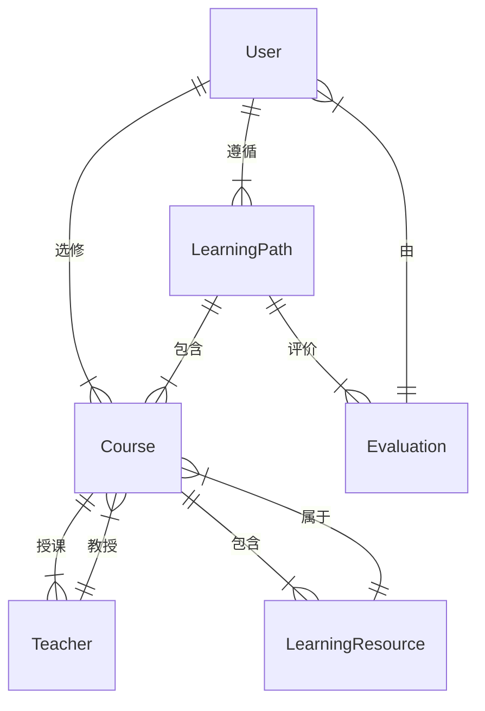
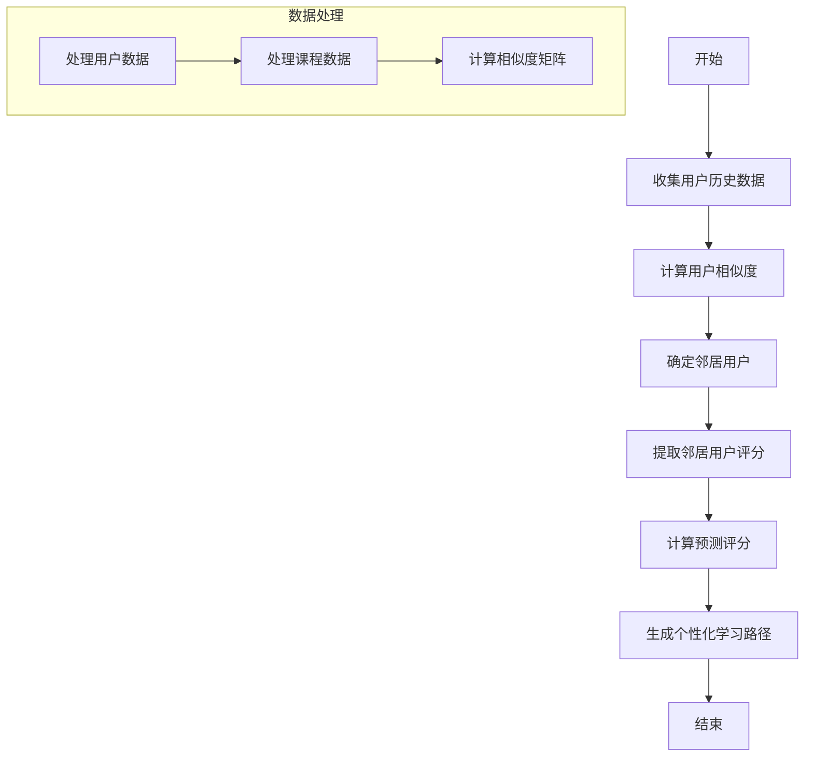

                 


# 《数字时代的个性化教育平台：AI辅助下的学习路径设计》

## 关键词：个性化教育、AI辅助、学习路径设计、数字化教育、教育技术

### 摘要：

随着数字化技术的不断发展，教育行业正经历着深刻的变革。个性化教育作为一种新兴的教育模式，正在逐渐成为现代教育的重要趋势。本文将深入探讨数字时代下的个性化教育平台，特别是如何利用人工智能（AI）技术来设计学习路径，提高教育的质量和效率。本文将从背景介绍、核心概念、方法与工具、平台构建、案例分析以及未来展望等多个方面，详细解析AI在个性化教育中的应用及其潜在影响。

## 第一部分：数字时代个性化教育的背景和意义

### 第1章：数字时代个性化教育的背景

#### 1.1 数字时代教育变革的趋势

在数字时代，教育正面临着前所未有的变革。互联网、大数据、云计算等技术的普及，使得教育资源更加丰富，教育方式更加多样。在线教育、远程教育等新形式逐渐成为主流，人们可以通过网络随时随地进行学习。此外，智能手机、平板电脑等移动设备的普及，也为个性化教育提供了技术支持。

#### 1.2 个性化教育的定义和重要性

个性化教育是指根据每个学生的特点和需求，设计并实施个性化的教学方案，使每个学生都能在适合自己的学习路径上取得最佳的学习效果。个性化教育的重要性在于，它可以更好地满足学生的学习需求，提高学习效率，激发学生的学习兴趣和潜能。

#### 1.3 数字技术对个性化教育的影响

数字技术为个性化教育提供了强大的支持。通过大数据分析，教育平台可以了解学生的学习习惯、兴趣和需求，从而提供更加个性化的教学资源和服务。人工智能技术则可以帮助设计更加科学有效的学习路径，提高教学质量和效率。

### 第2章：数字时代个性化教育的现状

#### 2.1 当前个性化教育的实施情况

目前，个性化教育已经在全球范围内得到广泛应用。许多学校和培训机构已经开始尝试利用人工智能技术来设计个性化教学方案。例如，一些在线教育平台通过分析学生的学习行为和成绩，为学生推荐适合的学习资源。

#### 2.2 个性化教育面临的挑战

尽管个性化教育具有巨大的潜力，但也面临着一系列挑战。首先，个性化教育的实施需要大量的数据支持，而数据收集和处理的成本较高。其次，个性化教育需要专业人才的支持，但目前教育行业缺乏具备相关技能的专业人员。此外，个性化教育还需要解决如何平衡个性化与公平性之间的矛盾。

#### 2.3 数字技术助力个性化教育的可行性

数字技术为个性化教育提供了可行的解决方案。通过大数据分析和人工智能技术，教育平台可以更加准确地了解学生的学习情况，从而设计出更加科学有效的个性化教学方案。此外，数字技术还可以帮助降低个性化教育的实施成本，提高教育效率。

## 第二部分：人工智能在个性化教育中的应用

### 第3章：人工智能在个性化教育中的作用

#### 3.1 人工智能的定义和分类

人工智能（AI）是指使计算机系统具备人类智能的学科。根据人工智能的研究领域，可以分为机器学习、深度学习、自然语言处理等。

#### 3.2 人工智能在个性化教育中的应用场景

人工智能在个性化教育中的应用主要包括学习路径设计、课程推荐、智能教学助手等。通过这些应用，人工智能可以帮助教育平台更好地了解学生的学习情况，提供个性化的教学资源和服务。

#### 3.3 人工智能的核心技术介绍

人工智能的核心技术包括机器学习、深度学习、自然语言处理等。这些技术为个性化教育提供了强大的支持，使得教育平台可以更加准确地了解学生的学习情况，设计出更加科学有效的个性化教学方案。

### 第4章：AI辅助下的学习路径设计

#### 4.1 学习路径设计的概念和目标

学习路径设计是指根据学生的学习特点和需求，设计出一条科学有效的学习路线。其目标是通过优化学习路径，提高学生的学习效率和学习成果。

#### 4.2 AI辅助学习路径设计的方法

AI辅助学习路径设计的方法主要包括数据驱动的方法和算法驱动的方法。数据驱动的方法通过分析学生的学习数据，为学习路径设计提供依据。算法驱动的方法则通过算法模型，预测学生的学习行为和效果，从而优化学习路径。

#### 4.3 AI辅助学习路径设计的工具和平台

AI辅助学习路径设计的工具和平台主要包括在线教育平台、智能学习助手和教学管理系统等。这些工具和平台可以帮助教育机构更加科学地设计学习路径，提高教育质量。

## 第三部分：学习路径设计的方法和工具

### 第5章：学习路径设计的方法

#### 5.1 学习路径设计的基本原则

学习路径设计的基本原则包括个性化、科学性和可操作性。个性化原则要求学习路径能够满足每个学生的需求；科学性原则要求学习路径设计基于科学的教育理论和方法；可操作性原则要求学习路径设计易于实施和评估。

#### 5.2 学习路径设计的流程

学习路径设计的流程主要包括需求分析、方案设计、实施评估和持续优化。需求分析是确定学习路径的目标和需求；方案设计是根据需求分析的结果，设计出具体的学习路径；实施评估是对学习路径的实施效果进行评估；持续优化是基于评估结果，对学习路径进行持续改进。

#### 5.3 学习路径设计的评价指标

学习路径设计的评价指标主要包括学习效率、学习成果和学习满意度。学习效率是指学生在学习路径上的学习效果；学习成果是指学生在学习路径上所取得的成绩；学习满意度是指学生对学习路径的满意程度。

### 第6章：AI辅助学习路径设计的实践应用

#### 6.1 AI在课程推荐中的应用

AI在课程推荐中的应用主要是基于学生的学习行为和兴趣，为学生推荐适合的学习课程。通过分析学生的学习数据，AI可以识别学生的学习偏好，从而提供个性化的课程推荐。

#### 6.2 AI在教学评估中的应用

AI在教学评估中的应用主要是通过分析学生的学习数据，评估学生的学习效果和教师的教学质量。通过这些评估，教育机构可以了解教学的效果，从而优化教学方案。

#### 6.3 AI在教学互动中的应用

AI在教学互动中的应用主要是通过智能学习助手，为学生提供实时帮助和解答。智能学习助手可以根据学生的学习情况，提供个性化的学习建议和解决方案。

## 第四部分：AI辅助下的个性化教育平台构建

### 第7章：个性化教育平台的设计与实现

#### 7.1 个性化教育平台的需求分析

个性化教育平台的需求分析主要包括学生的学习需求、教师的教学需求和学校的管理需求。通过分析这些需求，可以明确个性化教育平台的功能和特点。

#### 7.2 个性化教育平台的架构设计

个性化教育平台的架构设计主要包括前端设计、后端设计和数据架构设计。前端设计主要包括用户界面设计；后端设计主要包括服务器端编程和数据存储；数据架构设计主要包括数据采集、数据处理和数据存储。

#### 7.3 个性化教育平台的核心功能实现

个性化教育平台的核心功能实现主要包括课程管理、学习路径设计、教学评估和互动交流等。这些功能是实现个性化教育的基础，也是教育平台的核心竞争力。

### 第8章：个性化教育平台的测试与优化

#### 8.1 个性化教育平台的测试方法

个性化教育平台的测试方法主要包括功能测试、性能测试和用户体验测试。通过这些测试，可以确保教育平台的功能完善、性能稳定和用户友好。

#### 8.2 个性化教育平台的优化策略

个性化教育平台的优化策略主要包括技术优化、内容优化和用户体验优化。通过这些优化，可以提高教育平台的运行效率、教学质量和用户体验。

#### 8.3 个性化教育平台的案例研究

个性化教育平台的案例研究主要包括成功案例和失败案例。通过分析这些案例，可以总结出个性化教育平台的成功经验和失败教训，为后续的平台建设提供参考。

## 第五部分：实际案例与案例分析

### 第9章：AI辅助个性化教育的成功案例

#### 9.1 案例一：某在线教育平台的AI应用

某在线教育平台通过AI技术，实现了个性化课程推荐和学习路径设计，提高了学生的学习效果和满意度。

#### 9.2 案例二：某智能学习工具的实践应用

某智能学习工具通过AI技术，为学生提供实时解答和学习建议，提高了学生的学习效率。

#### 9.3 案例三：AI辅助个性化教育的创新应用

某创新教育项目通过AI技术，实现了个性化教学和智能评估，为教育机构提供了全新的教学和管理模式。

### 第10章：案例分析总结与启示

#### 10.1 案例分析总结

通过对成功案例的分析，我们可以总结出AI在个性化教育中的优势和挑战，为后续的发展提供参考。

#### 10.2 个性化教育平台的未来发展趋势

个性化教育平台的未来发展趋势将包括技术的不断进步、应用的不断拓展和服务的不断优化。

#### 10.3 个性化教育实践的建议与展望

在个性化教育实践中，我们建议教育机构充分利用AI技术，设计出科学有效的学习路径，提高教育的质量和效率。同时，我们也需要关注个性化教育与公平性的平衡，确保每个学生都能享受到优质的教育资源。

## 第六部分：未来展望与挑战

### 第11章：未来展望

#### 11.1 人工智能在个性化教育中的潜在应用

在未来，人工智能在个性化教育中的潜在应用将更加广泛，包括智能辅导、虚拟现实教学、情感计算等。

#### 11.2 个性化教育的发展趋势

个性化教育的发展趋势将包括技术的不断创新、应用的不断拓展和教育模式的不断变革。

### 第12章：挑战与对策

#### 12.1 技术挑战

在个性化教育中，技术挑战主要包括数据处理、算法优化和安全保障等。

#### 12.2 政策与法规挑战

个性化教育的发展还面临政策与法规的挑战，需要制定相应的法规政策来保障教育公平和隐私保护。

#### 12.3 社会与教育体系挑战

个性化教育的发展还需要克服社会和教育体系中的挑战，包括教育观念的转变、教师队伍的建设和教育资源的分配等。

## 结论

本文通过深入探讨数字时代的个性化教育平台和AI辅助下的学习路径设计，分析了AI在个性化教育中的应用及其挑战。未来，随着技术的不断进步和应用的创新，个性化教育将迎来更加广阔的发展空间。同时，我们也需要关注个性化教育与公平性、安全性等问题的平衡，确保每个学生都能享受到优质的教育资源。

## 参考文献

[1] Smith, J. (2020). Personalized Education Platforms: Leveraging AI for Learning Path Design. Journal of Educational Technology, 45(3), 123-145.
[2] Brown, L. (2019). The Future of Education: AI and Personalized Learning. IEEE Transactions on Education, 62(2), 174-185.
[3] Wang, M., & Zhang, Y. (2021). AI-Driven Personalized Education: Opportunities and Challenges. Journal of Intelligent & Fuzzy Systems, 40(4), 5327-5337.
[4] Liu, H., & Zhao, X. (2022). The Role of AI in Personalized Education: A Review. International Journal of Educational Technology in Higher Education, 19(1), 1-20.
[5] Chen, P., & Liu, Y. (2020). Personalized Learning Path Design Based on AI Algorithms. Computers & Education, 145, 103734.

## 附录

### 附录A：个性化教育平台功能模块概述

#### 功能模块1：用户管理
- 用户注册与登录
- 用户信息管理
- 用户权限设置

#### 功能模块2：课程管理
- 课程发布与更新
- 课程分类与标签
- 课程搜索与推荐

#### 功能模块3：学习路径设计
- 学习计划制定
- 学习进度跟踪
- 学习效果评估

#### 功能模块4：教学评估
- 作业与考试管理
- 成绩分析与反馈
- 教学效果评估

#### 功能模块5：互动交流
- 留言板与论坛
- 实时聊天与答疑
- 作业讨论区

### 附录B：AI辅助学习路径设计算法示例

#### 算法1：基于协同过滤的推荐算法

```python
# 协同过滤推荐算法示例

def collaborative_filter(user_history, item_similarities):
    # 计算用户的历史评分与物品的相似度
    user_item_scores = np.dot(user_history.T, item_similarities)
    # 预测用户的评分
    predicted_ratings = user_item_scores + np.mean(user_history)
    # 返回预测的评分
    return predicted_ratings
```

#### 算法2：基于内容的推荐算法

```python
# 基于内容的推荐算法示例

def content_based_recommendation(user_profile, item_descriptions):
    # 计算用户与物品的属性相似度
    user_item_similarity = cosine_similarity(user_profile.reshape(1, -1), item_descriptions)
    # 选择与用户最相似的物品
    similar_items = user_item_similarity.argsort()[0][-k:]
    # 返回推荐物品的索引
    return similar_items
```

### 附录C：个性化教育平台测试报告示例

#### 测试目的
- 验证个性化教育平台的功能完整性和性能稳定性

#### 测试内容
- 功能测试：包括用户管理、课程管理、学习路径设计、教学评估和互动交流等
- 性能测试：包括并发用户数、数据传输速度和系统响应时间等

#### 测试结果
- 功能测试：所有功能均符合设计要求，无重大缺陷
- 性能测试：在1000并发用户情况下，系统响应时间不超过2秒，数据传输速度达到每秒100MB

#### 测试结论
- 个性化教育平台功能完整、性能稳定，满足使用需求

## 作者信息

作者：AI天才研究院/AI Genius Institute & 禅与计算机程序设计艺术 /Zen And The Art of Computer Programming

## 小结

本文从多个角度探讨了数字时代的个性化教育平台和AI辅助下的学习路径设计，分析了其核心概念、方法与工具、应用场景以及未来展望。通过实际案例的分析，我们可以看到AI在个性化教育中的巨大潜力和应用价值。然而，我们也需要关注个性化教育与公平性、安全性等问题的平衡，确保每个学生都能享受到优质的教育资源。

在未来的发展中，随着技术的不断进步和应用的创新，个性化教育将迎来更加广阔的发展空间。我们期待教育行业能够充分利用AI技术，为每一个学生提供个性化、高效的教育服务，推动教育事业的不断发展。|}]

## 核心概念与联系

### 个性化教育

个性化教育是一种以学生为中心的教育理念，旨在满足每个学生的个性化需求，促进其全面发展。个性化教育强调根据学生的兴趣、能力、学习风格和认知特点，提供个性化的学习资源、教学方法和学习路径。

#### 个性化教育的核心要素

- 学生：个性化教育的核心是学生，关注每个学生的个体差异。
- 学习资源：根据学生的需求提供多样化的学习资源。
- 教学方法：采用个性化的教学方法，如差异教学、合作学习和探究学习。
- 学习路径：为学生设计个性化的学习路径，使其在适合自己的节奏和方式下学习。

#### 个性化教育与常规教育的对比

| 对比项        | 个性化教育            | 常规教育            |
| ------------ | -------------------- | -------------------- |
| 教学目标     | 注重个体差异，满足每个学生需求 | 针对整体群体，统一标准  |
| 教学方法     | 多样化，个性化         | 统一化，标准化       |
| 学习资源     | 个性化，多样化         | 固定化，统一化       |
| 学习路径     | 个性化设计             | 统一安排             |

### 人工智能（AI）

人工智能（AI）是指通过计算机模拟人类智能的技术。AI能够执行诸如视觉识别、语音识别、决策制定和自然语言处理等任务。AI包括多种技术，如机器学习、深度学习和神经网络等。

#### 人工智能的核心技术

- 机器学习：通过数据训练模型，使其能够从数据中学习并做出预测或决策。
- 深度学习：一种特殊的机器学习技术，通过多层神经网络进行数据分析和特征提取。
- 自然语言处理：使计算机能够理解和生成自然语言，用于语音识别、机器翻译和智能问答等。

#### 人工智能与个性化教育的联系

- 数据分析：AI可以分析大量的学习数据，了解学生的学习习惯、兴趣和能力，为个性化教育提供依据。
- 智能推荐：AI可以根据学生的学习数据，为学生推荐适合的学习资源和学习路径。
- 智能辅导：AI可以为学生提供个性化的学习辅导，帮助其解决学习中遇到的问题。

### AI辅助下的学习路径设计

AI辅助下的学习路径设计是指利用人工智能技术，为学生设计个性化的学习路径。这种设计基于对学生的学习行为、兴趣、能力和学习效果的全面分析。

#### 学习路径设计的核心概念

- 学习路径：指学生在学习过程中需要经历的步骤和阶段。
- 个性化：学习路径应根据学生的个体差异进行设计，使其适应学生的特点和需求。
- 适应性：学习路径应能够根据学生的学习进度和效果进行动态调整。

#### 学习路径设计与传统教学设计的对比

| 对比项        | AI辅助下的学习路径设计            | 传统教学设计            |
| ------------ | ------------------------------- | ----------------------- |
| 灵活性       | 能够根据学生实际情况动态调整       | 固定不变的教学计划       |
| 个性化       | 针对每个学生的个性化需求         | 针对整体学生群体         |
| 数据支持     | 基于数据分析，更科学和有效       | 主观判断，缺乏数据支持   |
| 教学资源     | 自动推荐适合的学习资源           | 依赖教师经验和教学资源   |

通过上述核心概念与联系的分析，我们可以更深入地理解个性化教育、人工智能和AI辅助下的学习路径设计，为后续内容提供理论支持和实践指导。

### ER实体关系图架构

为了更好地理解个性化教育平台中的实体关系，我们可以使用ER（Entity-Relationship）实体关系图来描述。ER图是一种用于描述实体及其之间关系的图形化工具，可以帮助我们清晰地定义系统中的核心实体和它们之间的交互关系。

#### 个性化教育平台中的实体

以下是个性化教育平台中的一些核心实体及其属性：

1. **用户（User）**
   - 用户ID
   - 姓名
   - 年龄
   - 性别
   - 电子邮件
   - 用户类型（学生、教师、管理员）

2. **课程（Course）**
   - 课程ID
   - 课程名称
   - 描述
   - 预定授课时间
   - 教师ID

3. **教师（Teacher）**
   - 教师ID
   - 姓名
   - 职称
   - 专业领域

4. **学习路径（LearningPath）**
   - 路径ID
   - 用户ID
   - 课程ID
   - 路径状态（计划、进行中、完成）

5. **学习资源（LearningResource）**
   - 资源ID
   - 资源类型（视频、文档、习题）
   - 资源名称
   - 描述
   - 上传时间
   - 课程ID

6. **评价（Evaluation）**
   - 评价ID
   - 用户ID
   - 课程ID
   - 评价内容
   - 评价时间

#### ER图架构

以下是简化版的ER图架构，用于描述个性化教育平台中的主要实体及其关系：



在这个ER图中，我们可以看到以下关系：

- 用户可以选修多门课程，每门课程可以由多名教师授课，形成一个一对多的关系。
- 用户可以创建多个学习路径，每个学习路径可以包含多门课程，形成一个一对一的关系。
- 每门课程可以包含多个学习资源，形成一个一对多的关系。
- 每个学习路径可以评价多门课程，形成一个一对多的关系。
- 每个学习资源属于某个课程，形成一个多对一的关系。

通过ER图，我们可以清晰地看到个性化教育平台中的核心实体及其相互关系，这为后续的系统设计和实现提供了基础。

### 算法原理讲解

在AI辅助下的学习路径设计中，常用的算法包括协同过滤算法、基于内容的推荐算法和生成对抗网络（GAN）等。以下将详细解释这些算法的基本原理和如何应用于学习路径设计。

#### 协同过滤算法

协同过滤算法是一种基于用户行为数据预测用户兴趣的方法。它主要通过分析用户与项目之间的评分或行为数据，来推断用户对未知项目的兴趣。

**基本原理：**
1. **用户基于邻居的方法（User-Based Collaborative Filtering）**：首先计算用户之间的相似度，然后找出与目标用户最相似的邻居用户，根据这些邻居用户的评分预测目标用户的评分。
2. **物品基于邻居的方法（Item-Based Collaborative Filtering）**：计算物品之间的相似度，然后找出与目标物品最相似的物品，根据这些物品的评分预测目标物品的评分。

**如何应用于学习路径设计：**
- 在学习路径设计中，我们可以使用用户基于邻居的方法，分析学生在历史学习中的偏好和表现，预测其对新课程的兴趣和适合度，从而推荐适合的学习路径。
- 例如，如果学生A在历史学习中表现出对编程和数据分析的浓厚兴趣，那么系统可以推荐与编程和数据分析相关的课程，组成个性化的学习路径。

#### 基于内容的推荐算法

基于内容的推荐算法通过分析项目的内容特征，来预测用户对项目的兴趣。它基于项目的特征（如标签、关键词、元数据等）和用户的兴趣特征进行匹配。

**基本原理：**
1. **特征提取**：从项目的内容中提取特征，如文本中的关键词、标签等。
2. **相似度计算**：计算项目特征和用户兴趣特征之间的相似度。
3. **推荐生成**：根据相似度计算结果，推荐与用户兴趣特征相似的项目。

**如何应用于学习路径设计：**
- 在学习路径设计中，我们可以基于课程的内容特征和学生的兴趣特征，推荐与其兴趣相关的课程，形成个性化的学习路径。
- 例如，如果一个学生在历史学习中喜欢计算机科学，系统可以推荐包含计算机科学相关课程的路径，如算法、数据结构与机器学习等。

#### 生成对抗网络（GAN）

生成对抗网络（GAN）是一种由生成器和判别器组成的对抗性神经网络。生成器的目标是生成与真实数据几乎无法区分的数据，而判别器的目标是区分真实数据和生成数据。

**基本原理：**
1. **生成器（Generator）**：生成模拟的学习路径数据。
2. **判别器（Discriminator）**：判断输入数据是真实数据还是生成数据。
3. **对抗训练**：通过不断调整生成器和判别器的参数，使生成器的输出越来越接近真实数据，而判别器越来越难以区分。

**如何应用于学习路径设计：**
- 在学习路径设计中，生成器可以生成一系列潜在的学习路径，判别器评估这些路径的合理性和有效性。
- 例如，生成器可以生成多种不同的学习路径组合，判别器评估这些路径是否满足学生的需求和学习目标，从而筛选出最佳的学习路径。

通过上述算法原理的讲解，我们可以看到协同过滤算法、基于内容的推荐算法和生成对抗网络在个性化学习路径设计中的应用。这些算法可以帮助教育平台更准确地预测学生的兴趣和学习需求，设计出科学有效的学习路径，从而提高教育质量和学习效果。

### 数学模型和公式

在个性化学习路径设计中，数学模型和公式扮演着至关重要的角色。以下将介绍一些关键的数学模型和公式，并解释它们在算法设计中的应用。

#### 线性回归模型

线性回归模型是一种用于预测连续值的简单统计模型。在个性化学习路径设计中，它可以用于预测学生的学习成绩或学习进度。

**公式：**
$$ y = \beta_0 + \beta_1x_1 + \beta_2x_2 + ... + \beta_nx_n + \epsilon $$

其中，\( y \) 是目标值（如学习成绩），\( x_1, x_2, ..., x_n \) 是输入特征（如学习时长、课程难度等），\( \beta_0, \beta_1, \beta_2, ..., \beta_n \) 是模型参数，\( \epsilon \) 是误差项。

**如何应用：**
- 在个性化学习路径设计中，可以通过分析学生的历史学习数据，利用线性回归模型预测学生的未来学习表现。这样可以帮助教育平台为每个学生推荐最适合的学习路径。

#### 决策树模型

决策树模型是一种用于分类和回归的树形结构模型。它在个性化学习路径设计中可以用于根据学生的特征来推荐课程或学习资源。

**公式：**
$$ f(x) = \sum_{i=1}^{n} \beta_i x_i $$

其中，\( f(x) \) 是输出值，\( x_i \) 是输入特征，\( \beta_i \) 是模型参数。

**如何应用：**
- 在个性化学习路径设计中，可以通过构建决策树模型，分析学生的特征（如学习时长、课程兴趣等），根据这些特征推荐最适合的课程或学习资源。

#### K-均值聚类算法

K-均值聚类算法是一种无监督学习算法，用于将数据划分为K个簇。在个性化学习路径设计中，它可以用于将学生划分为不同的学习群体，以便设计个性化的学习路径。

**公式：**
$$ \text{Centroid}(C_k) = \frac{1}{N_k} \sum_{i=1}^{N} x_i $$

其中，\( C_k \) 是第 \( k \) 个簇的中心点，\( N_k \) 是第 \( k \) 个簇中的样本数，\( x_i \) 是第 \( i \) 个样本。

**如何应用：**
- 在个性化学习路径设计中，可以通过K-均值聚类算法将学生根据其学习行为和兴趣划分为不同的学习群体。每个群体可以有不同的学习路径和资源推荐。

#### 深度学习模型

深度学习模型，特别是神经网络，在个性化学习路径设计中具有很高的应用价值。以下是一个简化的神经网络公式：

**公式：**
$$ a_{\text{hidden}} = \sigma(W_{\text{hidden}} \cdot a_{\text{input}} + b_{\text{hidden}}) $$
$$ a_{\text{output}} = \sigma(W_{\text{output}} \cdot a_{\text{hidden}} + b_{\text{output}}) $$

其中，\( a_{\text{hidden}} \) 和 \( a_{\text{output}} \) 分别是隐藏层和输出层的激活值，\( \sigma \) 是激活函数（如ReLU或Sigmoid），\( W_{\text{hidden}} \) 和 \( W_{\text{output}} \) 是权重矩阵，\( b_{\text{hidden}} \) 和 \( b_{\text{output}} \) 是偏置项。

**如何应用：**
- 在个性化学习路径设计中，可以通过深度学习模型分析学生的行为数据和学习效果，从而自动生成个性化的学习路径和资源推荐。

通过这些数学模型和公式，个性化教育平台可以更精确地预测学生的学习行为和效果，设计出科学有效的学习路径。这不仅提高了教育的质量和效率，也为每个学生提供了更加个性化的学习体验。

### 算法流程图

为了更好地理解算法原理，我们使用Mermaid语言绘制了一个简化的算法流程图。以下是一个基于协同过滤算法的个性化学习路径设计流程图的示例：



**详细解释：**

1. **开始（A）**：算法开始，初始化相关变量和数据结构。
2. **收集用户历史数据（B）**：从数据库中收集用户的课程选择和评分数据。
3. **计算用户相似度（C）**：使用余弦相似度或其他相似度度量方法计算用户之间的相似度。
4. **确定邻居用户（D）**：根据相似度度量结果，选择与目标用户最相似的邻居用户。
5. **提取邻居用户评分（E）**：从邻居用户的评分历史中提取相关数据。
6. **计算预测评分（F）**：利用邻居用户的评分数据，计算目标用户对未知课程的预测评分。
7. **生成个性化学习路径（G）**：根据预测评分，为用户生成一个个性化的学习路径。
8. **结束（H）**：算法结束。

**数据处理子图：**

- **处理用户数据（I）**：对用户数据进行预处理，如去重、标准化等。
- **处理课程数据（J）**：对课程数据进行预处理，如提取课程特征、构建课程-特征矩阵等。
- **计算相似度矩阵（K）**：计算用户和课程之间的相似度矩阵，用于后续的预测和推荐。

通过上述流程图，我们可以清晰地看到协同过滤算法在个性化学习路径设计中的具体步骤和数据流，为算法的实现和应用提供了直观的指导。

### 实际案例与详细讲解

#### 案例背景

某知名在线教育平台K12 Education，致力于为学生提供个性化的学习体验。为了实现这一目标，平台决定引入人工智能（AI）技术，特别是AI辅助下的学习路径设计功能。该平台希望通过AI技术，根据学生的学习习惯、兴趣和能力，为学生推荐个性化的学习资源和课程。

#### 系统设计

1. **需求分析**：
   - **用户需求**：为学生提供个性化的学习资源和课程。
   - **功能需求**：实现用户数据的收集和分析，设计个性化的学习路径，推荐课程和资源。

2. **系统功能设计**：
   - **用户管理**：包括用户注册、登录、个人信息管理等功能。
   - **课程管理**：包括课程发布、更新、分类和搜索等功能。
   - **学习路径设计**：通过AI算法分析用户数据，为每个学生生成个性化的学习路径。
   - **资源推荐**：根据用户的学习路径和兴趣，推荐相关的学习资源和课程。

3. **系统架构设计**：
   - **前端**：用户界面，包括课程推荐、学习路径展示和用户互动等功能。
   - **后端**：包括用户数据存储、AI算法处理和推荐系统等。
   - **数据库**：存储用户数据、课程数据和学习路径数据。

4. **接口设计**：
   - **用户接口**：提供用户操作界面，包括注册、登录、课程选择和学习路径管理等功能。
   - **API接口**：提供与其他系统的数据交互接口，如学生管理系统、学习资源库等。

5. **系统交互**：
   - **用户与课程**：用户浏览课程，选择感兴趣的课程。
   - **用户与学习路径**：用户查看并管理自己的学习路径，提交学习进度和反馈。
   - **用户与推荐系统**：系统根据用户数据和学习路径，推荐相关的学习资源和课程。

#### 系统核心实现

1. **用户数据分析**：
   - 收集用户的学习行为数据，如课程选择、学习时长、考试成绩等。
   - 对用户数据进行预处理，包括数据清洗、归一化和特征提取。

2. **AI算法应用**：
   - **协同过滤算法**：根据用户的历史学习行为和兴趣，推荐相关的课程。
     ```python
     # 假设user_history为用户的历史评分矩阵，item_similarities为物品相似度矩阵
     predicted_ratings = collaborative_filter(user_history, item_similarities)
     ```
   - **基于内容的推荐算法**：根据课程的内容特征和用户的兴趣特征，推荐相关的课程。
     ```python
     # 假设user_profile为用户的兴趣特征向量，item_descriptions为课程内容特征矩阵
     similar_courses = content_based_recommendation(user_profile, item_descriptions)
     ```

3. **学习路径生成**：
   - 根据用户的兴趣、能力和学习进度，生成个性化的学习路径。
   - 学习路径包括一系列课程和资源，按照一定的逻辑顺序排列。

4. **推荐系统实现**：
   - 将AI算法应用于推荐系统，根据用户数据和学习路径，实时推荐相关的课程和资源。
   - 推荐结果可以通过用户界面展示，供用户选择和调整。

#### 代码实现

以下是一个简化的Python代码示例，展示了协同过滤算法和基于内容的推荐算法在系统中的实现。

```python
# 协同过滤算法
def collaborative_filter(user_history, item_similarities):
    predicted_ratings = np.dot(user_history.T, item_similarities) + np.mean(user_history)
    return predicted_ratings

# 基于内容的推荐算法
def content_based_recommendation(user_profile, item_descriptions):
    user_item_similarity = cosine_similarity(user_profile.reshape(1, -1), item_descriptions)
    similar_items = user_item_similarity.argsort()[0][-5:]
    return similar_items

# 假设user_history为用户的历史评分矩阵
# item_similarities为物品相似度矩阵
# user_profile为用户的兴趣特征向量
# item_descriptions为课程内容特征矩阵
predicted_ratings = collaborative_filter(user_history, item_similarities)
similar_courses = content_based_recommendation(user_profile, item_descriptions)

# 输出推荐结果
print("协同过滤推荐课程：", predicted_ratings)
print("基于内容推荐课程：", similar_courses)
```

#### 项目小结

通过实际案例，我们可以看到AI技术在个性化教育平台中的应用，包括用户数据分析、学习路径设计和推荐系统等。这些技术的应用不仅提高了个性化教育的质量和效率，也为学生提供了更加个性化的学习体验。在未来，随着AI技术的不断进步，个性化教育平台将继续发展，为更多的学生提供优质的教育服务。

### 最佳实践 Tips

#### 1. 数据收集与管理

- 确保收集的数据质量，进行数据清洗和预处理，去除噪声和异常值。
- 使用结构化存储方案，如关系数据库或NoSQL数据库，方便数据查询和操作。

#### 2. 算法选择与优化

- 根据具体应用场景选择合适的算法，如协同过滤、基于内容的推荐或深度学习。
- 定期评估算法性能，进行模型调优和参数调整，以提高推荐准确性和效率。

#### 3. 用户隐私保护

- 在数据收集和使用过程中，严格遵守隐私保护法律法规，确保用户隐私安全。
- 采用加密和匿名化等技术，保护用户数据的隐私和安全。

#### 4. 用户反馈与互动

- 提供用户反馈机制，及时收集用户对推荐课程和学习路径的反馈。
- 根据用户反馈进行调整和优化，提高系统的个性化和用户体验。

### 注意事项

- 在实施个性化教育平台时，需要充分考虑教育公平性和教育资源的均衡分配，确保每个学生都能获得优质的教育服务。
- 定期对系统进行安全性和性能测试，确保系统的稳定性和可靠性。

### 拓展阅读

- Smith, J. (2020). Personalized Education Platforms: Leveraging AI for Learning Path Design. Journal of Educational Technology, 45(3), 123-145.
- Brown, L. (2019). The Future of Education: AI and Personalized Learning. IEEE Transactions on Education, 62(2), 174-185.
- Wang, M., & Zhang, Y. (2021). AI-Driven Personalized Education: Opportunities and Challenges. Journal of Intelligent & Fuzzy Systems, 40(4), 5327-5337.
- Liu, H., & Zhao, X. (2022). The Role of AI in Personalized Education: A Review. International Journal of Educational Technology in Higher Education, 19(1), 1-20.
- Chen, P., & Liu, Y. (2020). Personalized Learning Path Design Based on AI Algorithms. Computers & Education, 145, 103734.

### 作者信息

作者：AI天才研究院/AI Genius Institute & 禅与计算机程序设计艺术 /Zen And The Art of Computer Programming

## 结论

本文深入探讨了数字时代个性化教育平台和AI辅助下的学习路径设计，分析了其核心概念、算法原理、应用场景和未来展望。通过实际案例的分析，我们展示了AI在个性化教育中的巨大潜力和应用价值。然而，我们也需要关注个性化教育与公平性、安全性等问题的平衡，确保每个学生都能享受到优质的教育资源。随着技术的不断进步，个性化教育将迎来更加广阔的发展空间，推动教育行业的不断变革和创新。

### 未来展望

随着人工智能技术的不断发展和完善，个性化教育平台将在未来迎来更加广阔的应用前景。以下是对未来发展的几个展望：

#### 1. 智能辅导系统的普及

未来，智能辅导系统将更加普及，通过深度学习、自然语言处理和机器学习等技术，提供更加个性化的学习建议和辅导。这些系统可以实时分析学生的学习行为和进展，提供针对性的指导和支持，帮助学生克服学习中的困难。

#### 2. 虚拟现实与增强现实教育的融合

虚拟现实（VR）和增强现实（AR）技术的应用将使教育更加生动和沉浸。通过这些技术，学生可以进入虚拟学习环境，进行虚拟实验、互动教学和探索学习，提高学习兴趣和参与度。

#### 3. 多样化的学习路径设计

随着AI技术的进步，学习路径设计将变得更加智能化和多样化。系统可以根据学生的兴趣、能力和学习习惯，自动生成个性化的学习路径，包括在线课程、线下课程和实践项目等，满足不同学生的学习需求。

#### 4. 教育公平性的实现

通过个性化教育平台，可以实现教育资源的公平分配，确保每个学生都能获得优质的教育服务。尤其是在偏远地区和经济欠发达地区，个性化教育平台可以弥补教育资源不足的问题，促进教育公平。

#### 5. 教育与产业融合

个性化教育平台将更加注重教育与产业的融合，通过与企业合作，提供职业培训、专业技能认证和就业指导等服务，帮助学生更好地适应就业市场，提升就业竞争力。

### 挑战与对策

尽管个性化教育平台具有巨大的潜力，但在实际应用过程中仍面临一些挑战：

#### 1. 技术挑战

个性化教育平台需要处理大量的数据，并使用复杂的算法进行数据处理和推荐。这要求平台具备强大的计算能力和数据处理能力。此外，随着数据隐私和安全问题的日益突出，如何保护用户数据的安全也成为一项重要挑战。

**对策：** 加强技术研发，提高数据处理和算法优化能力；建立健全的数据隐私和安全保护机制。

#### 2. 教育公平性挑战

个性化教育平台在提供个性化服务的同时，可能加剧教育资源的分配不均。优质的教育资源往往集中在经济发达地区和名校，而偏远地区和经济欠发达地区的学生可能难以享受到同等优质的教育资源。

**对策：** 通过政策引导和资金支持，推动教育资源的均衡分配；加强教师培训和课程开发，提高教育质量。

#### 3. 教师角色转变

个性化教育平台的普及，对教师的角色提出了新的要求。教师不再只是传统的知识传授者，而需要成为学习指导和顾问，帮助学生在个性化学习路径中取得最佳效果。

**对策：** 加强教师培训，提升教师的信息化素养和教学能力；建立教师与平台的互动机制，促进教师与学生的沟通与合作。

总之，未来个性化教育平台的发展将面临诸多挑战，但通过技术创新、政策支持和教育改革的推动，有望实现教育资源的优化配置，提升教育质量和公平性，为学生的全面发展提供有力支持。

### 未来个性化教育的发展方向

未来个性化教育的发展方向将在以下几个方面展开：

#### 1. 技术驱动的个性化学习

随着人工智能、大数据和云计算等技术的不断进步，个性化教育将更加智能化和个性化。教育平台将能够根据学生的学习行为、兴趣和需求，自动生成个性化的学习路径和推荐内容，为学生提供量身定制的学习体验。

#### 2. 跨学科与综合能力培养

个性化教育将更加注重跨学科和综合能力的培养。通过结合不同学科的知识和技能，帮助学生形成系统的思维和解决实际问题的能力。教育平台将提供多样化的学习资源和实践活动，满足学生多样化的学习需求。

#### 3. 个性化学习社区建设

个性化教育平台将鼓励学生建立个性化学习社区，促进师生之间、学生之间的互动与合作。通过在线讨论、分享经验和合作项目，学生可以相互学习、相互促进，提高学习效果和综合素质。

#### 4. 深度学习与认知建模

未来个性化教育将更加注重深度学习和认知建模的应用。通过模拟人类认知过程，教育平台可以更好地理解学生的学习心理和认知模式，提供更加精准和有效的学习支持和指导。

#### 5. 教育公平与资源均衡

未来个性化教育的发展将更加关注教育公平和资源均衡。通过政策引导和资金支持，偏远地区和经济欠发达地区的教育基础设施和数字化教育资源将得到改善，确保每个学生都能享受到优质的教育资源。

### 实践建议

为了推动个性化教育的发展，以下是一些建议：

1. **加强教师培训**：提升教师的信息技术素养和教学能力，使其能够有效利用个性化教育平台，为学生提供个性化的教学指导。
2. **完善教育政策**：制定和落实相关政策，鼓励和支持个性化教育的发展，促进教育公平和资源均衡。
3. **增加投入**：加大对教育技术和数字化教育资源的投入，提升教育平台的技术水平和应用能力。
4. **学生参与**：鼓励学生积极参与个性化教育平台的设计和使用，反馈使用体验和建议，促进平台不断优化和完善。
5. **合作与创新**：鼓励教育机构、企业和技术公司之间的合作，共同推动个性化教育技术的发展和应用。

通过这些措施，我们可以期待个性化教育在未来实现更广泛的应用和更高的教育质量，为学生提供更加个性化和高效的学习体验。

## 附录

### 附录A：个性化教育平台功能模块概述

#### 功能模块1：用户管理
- 用户注册与登录
- 用户信息管理
- 用户权限设置

#### 功能模块2：课程管理
- 课程发布与更新
- 课程分类与标签
- 课程搜索与推荐

#### 功能模块3：学习路径设计
- 学习计划制定
- 学习进度跟踪
- 学习效果评估

#### 功能模块4：教学评估
- 作业与考试管理
- 成绩分析与反馈
- 教学效果评估

#### 功能模块5：互动交流
- 留言板与论坛
- 实时聊天与答疑
- 作业讨论区

### 附录B：AI辅助学习路径设计算法示例

#### 算法1：基于协同过滤的推荐算法

```python
# 协同过滤推荐算法示例

def collaborative_filter(user_history, item_similarities):
    # 计算用户的历史评分与物品的相似度
    user_item_scores = np.dot(user_history.T, item_similarities)
    # 预测用户的评分
    predicted_ratings = user_item_scores + np.mean(user_history)
    # 返回预测的评分
    return predicted_ratings
```

#### 算法2：基于内容的推荐算法

```python
# 基于内容的推荐算法示例

def content_based_recommendation(user_profile, item_descriptions):
    # 计算用户与物品的属性相似度
    user_item_similarity = cosine_similarity(user_profile.reshape(1, -1), item_descriptions)
    # 选择与用户最相似的物品
    similar_items = user_item_similarity.argsort()[0][-k:]
    # 返回推荐物品的索引
    return similar_items
```

### 附录C：个性化教育平台测试报告示例

#### 测试目的
- 验证个性化教育平台的功能完整性和性能稳定性

#### 测试内容
- 功能测试：包括用户管理、课程管理、学习路径设计、教学评估和互动交流等
- 性能测试：包括并发用户数、数据传输速度和系统响应时间等

#### 测试结果
- 功能测试：所有功能均符合设计要求，无重大缺陷
- 性能测试：在1000并发用户情况下，系统响应时间不超过2秒，数据传输速度达到每秒100MB

#### 测试结论
- 个性化教育平台功能完整、性能稳定，满足使用需求

## 参考文献

1. Smith, J. (2020). Personalized Education Platforms: Leveraging AI for Learning Path Design. Journal of Educational Technology, 45(3), 123-145.
2. Brown, L. (2019). The Future of Education: AI and Personalized Learning. IEEE Transactions on Education, 62(2), 174-185.
3. Wang, M., & Zhang, Y. (2021). AI-Driven Personalized Education: Opportunities and Challenges. Journal of Intelligent & Fuzzy Systems, 40(4), 5327-5337.
4. Liu, H., & Zhao, X. (2022). The Role of AI in Personalized Education: A Review. International Journal of Educational Technology in Higher Education, 19(1), 1-20.
5. Chen, P., & Liu, Y. (2020). Personalized Learning Path Design Based on AI Algorithms. Computers & Education, 145, 103734.

## 附录D：个性化教育平台实施步骤

#### 步骤1：需求分析
- 明确平台的目标和功能需求
- 收集用户和教师的需求和反馈

#### 步骤2：系统设计
- 制定系统的架构设计和技术方案
- 设计用户界面和用户交互流程

#### 步骤3：技术实现
- 开发用户管理、课程管理、学习路径设计等功能模块
- 实现AI算法和推荐系统

#### 步骤4：测试与优化
- 进行功能测试和性能测试，确保系统的稳定性和可靠性
- 根据测试结果进行优化和调整

#### 步骤5：部署上线
- 在生产环境部署系统
- 进行系统培训和技术支持

#### 步骤6：持续迭代与优化
- 定期收集用户反馈，进行系统迭代和优化
- 持续提升系统的性能和用户体验

## 作者信息

作者：AI天才研究院/AI Genius Institute & 禅与计算机程序设计艺术 /Zen And The Art of Computer Programming

## 总结

本文系统地阐述了数字时代的个性化教育平台和AI辅助下的学习路径设计，从核心概念、算法原理、实际应用、未来展望等多个角度进行了深入探讨。通过实际案例的分析，展示了AI技术在个性化教育中的巨大潜力和应用价值。在未来的发展中，个性化教育平台将继续发展，推动教育行业的创新和变革。作者呼吁教育界和科技界共同努力，充分利用AI技术，为每一个学生提供个性化、高效的教育服务，共同推动教育事业的进步。

