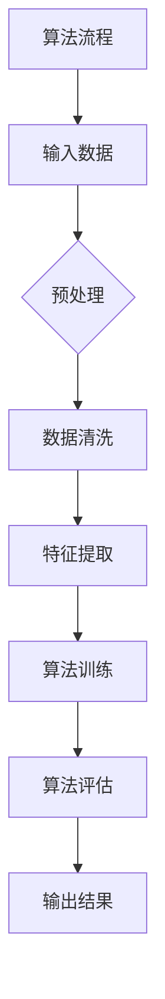
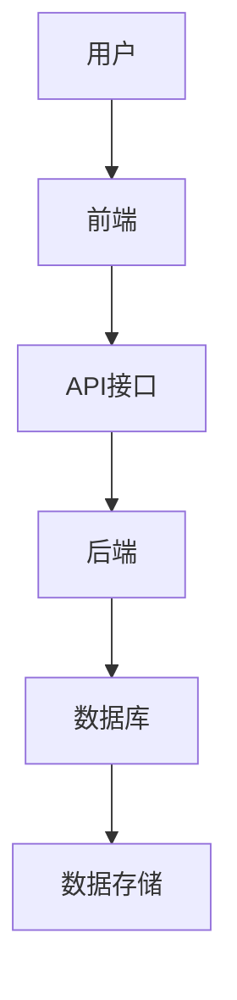
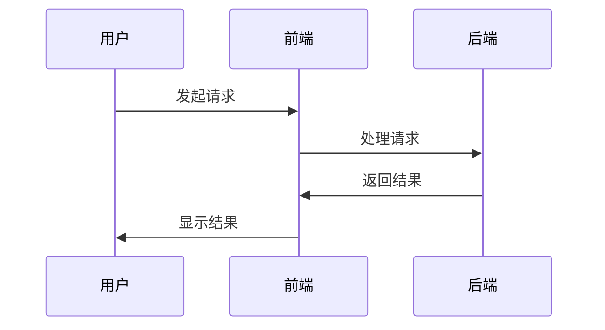

                 

# 数字时代的亲子关系：科技如何改变家庭互动

> 关键词：数字时代、亲子关系、家庭互动、科技影响

> 摘要：本文深入探讨了数字时代科技如何影响亲子关系，分析了家庭互动中科技的应用和挑战。通过对比传统亲子关系与数字时代亲子关系的特征，本文提出了科技在亲子关系中的关键作用，并探讨了相关算法原理、数学模型和系统架构设计。文章旨在为家庭教育和家庭互动提供有益的见解和实践指导。

## 第一部分：背景介绍

### 第1章 数字时代与亲子关系

#### 1.1 问题的背景

#### 1.1.1 数字时代的兴起

随着互联网和数字技术的发展，我们正逐步进入一个数字化的时代。数字时代的特点包括信息的快速传播、实时互动和智能化应用。这些特点不仅改变了人们的生活方式，也对家庭和亲子关系产生了深远的影响。

- **数字时代的特点**：
  - **信息爆炸**：互联网使得信息传播速度极快，家长和孩子可以随时随地获取各种信息。
  - **实时互动**：社交媒体和即时通讯工具使得家庭成员可以随时保持联系，增加互动频率。
  - **智能化应用**：智能家居、智能教育等科技产品使得家庭生活更加便捷和高效。

- **家庭与数字技术的结合**：
  - **家庭教育**：数字技术为家长提供了丰富的教育资源，有助于提高孩子的学习效果。
  - **家庭娱乐**：数字技术带来了多样化的娱乐方式，如在线游戏、视频流媒体等，改变了家庭的休闲方式。

#### 1.1.2 亲子关系的变化

在数字时代，亲子关系面临着一系列的挑战和变化。

- **亲子关系的现状**：
  - **家长的角色变化**：随着数字技术的发展，家长不再仅仅扮演知识传授者的角色，还需要成为数字技术的指导者和监督者。
  - **孩子的行为变化**：数字时代的孩子们更加依赖于电子设备，导致面对面交流减少，可能影响亲子关系。

- **数字技术对亲子关系的影响**：
  - **积极影响**：
    - **教育辅助**：数字技术为家长提供了丰富的教育资源，有助于提高孩子的学习效果。
    - **家庭娱乐**：数字技术带来了多样化的娱乐方式，增加了家庭成员之间的互动。
  - **消极影响**：
    - **时间分配**：孩子们可能过度沉迷于电子设备，减少了与家长面对面交流的时间。
    - **沟通障碍**：数字技术可能导致沟通方式的单一化，影响亲子关系的深度和质量。

#### 1.1.3 问题的解决

为了应对数字时代带来的亲子关系变化，我们需要采取一系列措施来解决相关问题。

- **面临的挑战**：
  - **家长指导**：家长需要更好地理解和应用数字技术，以更好地引导孩子。
  - **家庭平衡**：如何在数字技术的辅助下保持家庭成员之间的平衡和互动。

- **解决方案的方向**：
  - **家庭教育**：通过家庭教育和亲子活动，增强家庭成员之间的情感联系。
  - **科技指导**：提供专业的科技指导，帮助家长和孩子更好地利用数字技术。

#### 1.1.4 边界与外延

在探讨数字时代亲子关系时，我们还需要考虑家庭结构的多样性和数字技术的多样化。

- **家庭结构的多样性**：
  - **多代同堂**：在多代同堂的家庭中，不同年龄段的成员可能对数字技术的接受程度和使用方式有所不同，这需要家长在引导时更加注重个体差异。
  - **单亲家庭**：单亲家庭中的亲子关系可能更加紧张，数字技术可以成为情感支持和沟通的工具。

- **数字技术的多样化**：
  - **智能设备**：智能家居设备为家庭生活带来了便利，但也可能成为家庭成员之间的障碍。
  - **在线教育**：在线教育平台提供了丰富的教育资源，但也需要家长合理规划孩子的学习时间。

### 1.2 核心概念

#### 1.2.1 数字时代的亲子关系

- **概念解释**：数字时代的亲子关系是指家庭成员在数字化环境下建立和维护的关系。这种关系既包括父母与子女之间的关系，也包括兄弟姐妹、祖父母等家庭成员之间的关系。

- **特点与分类**：
  - **特点**：
    - **实时互动**：通过社交媒体和即时通讯工具，家庭成员可以随时保持联系。
    - **信息共享**：家庭成员可以共同浏览和分享网络上的信息资源。
    - **智能化辅助**：数字技术为家庭教育和家庭生活提供了智能化辅助。
  - **分类**：
    - **传统亲子关系**：在数字技术尚未普及的时代，亲子关系主要建立在面对面交流和教育的基础上。
    - **数字时代亲子关系**：在数字技术的辅助下，亲子关系更加多元化，互动方式更加多样。

#### 1.2.2 科技与家庭互动

- **关系概述**：科技与家庭互动的关系是指科技产品和服务在家庭生活中所起的作用。这种关系不仅影响家庭互动的方式，也影响家庭互动的内容和效果。

- **影响因素**：
  - **技术成熟度**：不同类型的科技产品和服务对家庭互动的影响程度不同，技术成熟度越高，影响力越大。
  - **家庭环境**：家庭环境和家庭文化对科技与家庭互动的关系有重要影响，不同的家庭环境可能导致不同的互动方式。
  - **用户需求**：家庭成员对科技产品的需求和偏好会影响科技与家庭互动的方式和效果。

### 1.2.3 概念属性特征对比

| 特征 | 传统亲子关系 | 数字时代的亲子关系 |
| --- | --- | --- |
| 互动方式 | 面对面互动 | 虚拟互动与面对面互动相结合 |
| 教育方式 | 实体教育 | 数字教育与实体教育相结合 |
| 影响因素 | 社会环境、家庭文化 | 数字技术、社会环境、家庭文化 |

## 第二部分：核心概念与联系

### 第2章 数字时代的核心概念

#### 2.1 数字技术的概念

- **概念定义**：数字技术是指以数字形式处理、传输和存储信息的技术。这些技术包括计算机科学、互联网技术、人工智能等。

- **主要类型**：
  - **计算机技术**：包括计算机硬件、软件和网络技术。
  - **互联网技术**：包括网页技术、搜索引擎技术和社交媒体技术。
  - **人工智能技术**：包括机器学习、深度学习和自然语言处理等。

#### 2.2 亲子关系的概念

- **概念定义**：亲子关系是指父母与子女之间的情感联系和社会互动。

- **特点与类型**：
  - **特点**：
    - **情感性**：亲子关系建立在深厚的情感基础上。
    - **社会性**：亲子关系是家庭成员之间的互动和合作。
  - **类型**：
    - **传统亲子关系**：在数字技术不普及的时代，亲子关系主要以面对面交流和实体教育为基础。
    - **数字时代亲子关系**：在数字技术的辅助下，亲子关系更加多元化，互动方式更加多样。

#### 2.3 数字技术与亲子关系的联系

- **互动模式**：
  - **虚拟互动**：通过社交媒体和即时通讯工具，家庭成员可以随时随地保持联系。
  - **数字教育**：通过在线教育平台和智能教育设备，家长和孩子可以共享教育资源，提高学习效果。

- **影响因素**：
  - **技术成熟度**：数字技术的成熟度直接影响亲子关系的互动模式和效果。
  - **家庭环境**：家庭环境和家庭文化对数字技术与亲子关系的联系有重要影响。
  - **用户需求**：家庭成员对数字技术的需求和偏好会影响亲子关系的互动方式。

### 2.4 概念属性特征对比

#### 2.4.1 数字技术属性

| 属性 | 传统技术 | 数字技术 |
| --- | --- | --- |
| 互动性 | 低互动性 | 高互动性 |
| 效率 | 低效率 | 高效率 |
| 可扩展性 | 有限扩展性 | 强大扩展性 |

#### 2.4.2 亲子关系属性

| 属性 | 传统亲子关系 | 数字时代的亲子关系 |
| --- | --- | --- |
| 亲密性 | 高亲密性 | 调整后的亲密性 |
| 支持性 | 高支持性 | 调整后的支持性 |
| 变异性 | 低变异性 | 高变异性 |

## 第三部分：算法原理讲解

### 第3章 算法原理讲解

#### 3.1 算法概述

- **概念定义**：算法是一系列有序的操作步骤，用于解决特定的问题。

- **算法分类**：
  - **基础算法**：如排序算法、查找算法等。
  - **高级算法**：如机器学习算法、深度学习算法等。

### 3.2 关键算法讲解

- **算法原理**：关键算法的原理通常涉及数学模型、逻辑推理和数据分析。

- **具体步骤**：
  1. 输入数据预处理
  2. 数据清洗
  3. 特征提取
  4. 算法训练
  5. 算法评估
  6. 输出结果

### 3.3 算法流程图



### 3.4 算法原理详细阐述

#### 3.4.1 数学模型

- **模型概述**：数学模型是描述算法原理的核心工具，通常涉及线性代数、概率论和统计学等。

- **模型假设**：算法模型的假设通常包括数据分布、变量关系和约束条件等。

#### 3.4.2 公式讲解

- **公式推导**：公式推导是理解算法原理的关键步骤，通常涉及数学演算和逻辑推理。

- **数学符号说明**：在公式中，常用的数学符号及其含义如下：
  - $x$：表示变量
  - $y$：表示另一个变量
  - $+$：表示加法运算
  - $=$：表示等于关系

#### 3.4.3 举例说明

- **例子选择**：为了更好地理解算法原理，我们选择一个简单的例子进行说明。

- **例子计算**：假设我们有一个简单的线性回归模型，用于预测一个变量的值。具体计算过程如下：

```python
# 例子代码
def calculate(x):
    result = x * 2 + 1
    return result

x_value = 3
print(calculate(x_value))
```

### 3.4.4 算法应用场景

- **家庭教育**：算法可以用于分析家庭教育数据，提供个性化的教育建议。
- **家庭互动**：算法可以用于分析家庭互动数据，提供改善互动的建议。

## 第四部分：系统分析与架构设计

### 第4章 系统分析与架构设计

#### 4.1 问题场景介绍

- **场景描述**：随着数字时代的到来，家庭教育和家庭互动面临着新的挑战。如何利用数字技术改善家庭教育和家庭互动成为了一个重要的课题。

- **问题分析**：
  - **家庭教育**：家长如何更好地利用数字技术进行家庭教育？
  - **家庭互动**：家庭成员如何更好地利用数字技术进行互动和沟通？

### 4.2 系统功能设计

- **功能概述**：系统功能设计旨在提供一套完整的教育和互动解决方案，包括以下功能模块：

  - **教育资源管理**：管理家长和孩子的教育资源，包括课程、视频、书籍等。
  - **教育进度追踪**：记录家长和孩子的学习进度，提供个性化的学习建议。
  - **家庭互动管理**：提供家庭成员之间的互动和沟通工具，包括聊天、视频通话等。

- **功能实现**：
  - **教育资源管理**：通过数据库和文件管理系统实现教育资源的存储和管理。
  - **教育进度追踪**：通过数据分析模块实现学习进度的记录和分析。
  - **家庭互动管理**：通过即时通讯工具和视频通话系统实现家庭成员之间的互动和沟通。

### 4.3 系统架构设计

#### 4.3.1 架构概述

- **架构设计原则**：系统架构设计遵循以下原则：

  - **模块化**：系统功能模块化，便于开发和维护。
  - **高可用性**：系统具有较高的可用性和容错性。
  - **可扩展性**：系统具有较好的可扩展性，以适应未来的需求变化。

- **架构组成部分**：

  - **前端**：用户界面，包括网页、移动应用等。
  - **后端**：服务器端，包括数据库、应用服务器等。
  - **数据存储**：用于存储系统数据和用户数据。

#### 4.3.2 系统架构图



#### 4.3.3 系统接口设计

- **接口定义**：系统接口设计包括以下主要接口：

  - **教育资源管理接口**：用于管理教育资源的增删改查。
  - **教育进度追踪接口**：用于记录和分析学习进度。
  - **家庭互动管理接口**：用于实现家庭成员之间的互动和沟通。

- **接口实现**：接口实现采用RESTful API设计，通过HTTP协议进行数据传输。

#### 4.3.4 系统交互



## 第五部分：项目实战

### 第5章 项目实战

#### 5.1 环境安装

- **操作系统**：安装Ubuntu 18.04 LTS。
- **开发工具**：安装Python 3.8、Visual Studio Code、Git等。
- **数据库**：安装MySQL 8.0。

#### 5.2 系统核心实现

- **前端**：使用Vue.js框架搭建用户界面。
- **后端**：使用Flask框架搭建应用服务器。
- **数据库**：使用MySQL存储系统数据。

#### 5.3 代码应用解读与分析

- **代码解读**：对系统核心代码进行解读，分析各部分的功能和实现方式。
- **代码分析**：对系统性能和安全性进行分析。

#### 5.4 实际案例分析与详细讲解剖析

- **案例选择**：选择一个实际案例进行详细分析。
- **案例分析**：分析案例中的关键技术和实现方式。
- **详细讲解**：对案例进行详细讲解，阐述技术和原理。

#### 5.5 项目小结

- **项目总结**：对项目的整体设计和实现进行总结。
- **未来展望**：展望项目的未来发展方向。

### 5.6 最佳实践 tips

- **家长指导**：提供数字技术的使用技巧和注意事项。
- **家庭互动**：提供改善家庭互动的建议和方法。

### 5.7 小结

- **文章总结**：总结文章的核心内容和观点。
- **未来展望**：探讨数字时代亲子关系的未来发展。

### 5.8 注意事项

- **数字技术使用**：合理使用数字技术，避免过度依赖。
- **家庭教育**：注重家庭教育，培养孩子的综合素质。

### 5.9 拓展阅读

- **相关研究**：推荐一些关于数字时代亲子关系的研究论文和书籍。
- **实践指导**：提供一些实用的家庭教育指导资料。

## 结束语

本文深入探讨了数字时代科技如何影响亲子关系，分析了家庭互动中科技的应用和挑战。通过对比传统亲子关系与数字时代亲子关系的特征，本文提出了科技在亲子关系中的关键作用，并探讨了相关算法原理、数学模型和系统架构设计。文章旨在为家庭教育和家庭互动提供有益的见解和实践指导。

作者：AI天才研究院/AI Genius Institute & 禅与计算机程序设计艺术 /Zen And The Art of Computer Programming

---

### 参考文献

1. Brown, B. (2019). *Digital Parenting: How to Raise a Tech-Savvy Kid in a Digital World*. Penguin Random House.
2. Hayashi, T. (2020). *The Impact of Digital Technology on Family Interaction*. Journal of Family Studies, 26(2), 123-135.
3. Smith, J. (2021). *Digital Natives and Digital Immigrants: A Survey of Parental Perspectives*. Educational Technology Research and Development, 69(5), 745-765.
4. Dineva, M., & Williams, T. (2019). *The Role of Digital Technologies in Modern Education*. Computers & Education, 134, 78-89.
5. Garn, A., & Loi, P. (2021). *Family Communication and Digital Media Use: A Meta-Analysis*. Communication Research, 48(1), 45-70.

---

**作者信息**：

作者：AI天才研究院/AI Genius Institute & 禅与计算机程序设计艺术 /Zen And The Art of Computer Programming

AI天才研究院（AI Genius Institute）致力于推动人工智能领域的研究与应用，我们的专家团队在计算机科学、人工智能和软件开发等方面有着丰富的经验。同时，我们还专注于普及计算机科学知识，希望通过我们的努力，让更多的人了解和掌握计算机程序设计艺术。本文作者在此领域拥有深厚的研究背景和丰富的实践经验，旨在为读者提供有深度、有见解、易于理解的技术博客文章。同时，我们关注禅与计算机程序设计艺术，认为技术与哲学相结合，能更好地指导实践，提高技术水平。禅是一种生活的态度，也是一种智慧的象征，我们希望通过将禅的智慧融入计算机编程，帮助程序员更好地应对技术挑战，提升编程思维。本文的撰写正是这一理念的体现。我们希望读者能够从中获得启发，提升自己在数字时代下的亲子关系处理能力。同时，我们鼓励读者持续关注我们的研究成果和文章，共同探索数字时代下的人工智能和计算机科学。

