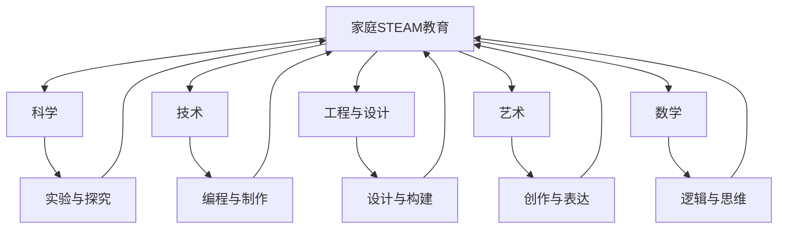

                 

## 引言：数字时代的亲子科技营

在数字化时代的浪潮中，科技的快速发展正在深刻地改变我们的生活方式和教育模式。家庭作为孩子成长的第一课堂，其教育环境与方式的选择显得尤为重要。传统的家庭教育模式往往侧重于知识的传授，而忽视了孩子在科技素养和创新思维方面的培养。在这个背景下，家庭STEAM教育（Science, Technology, Engineering, Arts, Mathematics）的兴起，为家长和孩子提供了一种全新的教育实践方式。本文将以《数字时代的亲子科技营：家庭STEAM教育的实践基地》为题，深入探讨家庭STEAM教育的背景、核心概念、实践策略、环境建设以及成功案例，旨在为广大读者提供一份全面而有深度的家庭科技教育指南。

### 文章结构

本文的结构将分为三个主要部分：

**第一部分：背景与核心概念**

在这个部分，我们将首先探讨现代社会科技发展对家庭教育的影响，引出家庭STEAM教育的概念及其重要性。接着，我们将详细定义家庭STEAM教育的含义，并分析其在培养孩子创新思维和解决问题能力方面的独特优势。最后，我们将审视家庭STEAM教育的现状与挑战，为后续的实践指导奠定基础。

**第二部分：实践指导与案例分析**

第二部分将重点介绍家庭STEAM教育的实践策略和方法，包括基本原则、实践方法和实践资源。我们将通过具体的科技活动案例，展示亲子互动中的科技活动设计，并结合成功案例进行分析，为家长提供实用的操作指南。

**第三部分：家庭STEAM教育的环境建设**

在第三部分，我们将探讨家庭STEAM教育环境的需求和建设方法，从空间布局、教育资源到安全保障，提供全方位的环境建设指导。通过这一部分的介绍，读者将能够理解如何构建一个适合家庭STEAM教育的实践基地。

### 文章关键词

1. 数字时代
2. 亲子科技营
3. 家庭STEAM教育
4. 创新思维
5. 解决问题能力
6. 科技活动
7. 环境建设

### 摘要

本文旨在探讨数字时代家庭STEAM教育的实践基地构建，分析其在培养孩子创新思维和解决问题能力方面的作用。通过介绍家庭STEAM教育的核心概念、实践策略和环境建设，本文为家长提供了一份全面而实用的教育指南，旨在推动家庭科技教育的深入发展。

接下来，我们将逐步深入每一个章节，详细阐述家庭STEAM教育的各个方面。让我们开始这段思维之旅吧。

## 第一部分：背景与核心概念

### 第1章：问题背景与家庭STEAM教育的重要性

#### 1.1 问题的提出

在现代社会，科技的发展速度迅猛，几乎每天都在刷新我们的认知和生活方式。互联网、人工智能、大数据等新兴技术的普及，不仅改变了企业的运营方式，也深刻地影响着家庭教育和亲子关系。传统的家庭教育模式往往侧重于知识的传授，而忽视了孩子在科技素养和创新思维方面的培养。这种教育方式的局限性逐渐暴露出来，主要体现在以下几个方面：

1. **教育内容与现实脱节**：传统的学科教育内容与现代社会的发展需求之间存在一定的差距，孩子在学校学习到的知识在实际生活中难以应用。
2. **教育方式单一**：传统教育方式多以讲授和记忆为主，缺乏互动和实践的机会，导致孩子在学习过程中容易产生厌倦和抵触情绪。
3. **亲子关系疏远**：随着科技的发展，家长和孩子的互动方式越来越依赖电子设备，这导致亲子之间的面对面交流减少，关系逐渐疏远。

#### 1.2 亲子关系在科技化背景下的变化

在科技化的背景下，亲子关系发生了显著的变化。一方面，科技设备为孩子提供了更多的学习资源和娱乐方式，家长和孩子之间的互动变得更加多样化；另一方面，过度依赖科技设备也带来了新的问题。以下是一些具体的变化：

1. **互动方式的改变**：随着智能手机、平板电脑等设备的普及，家长和孩子之间的互动从面对面的交流转向了屏幕前的互动。这种方式虽然方便，但容易导致亲子之间的情感交流减少。
2. **家庭教育资源的丰富**：互联网和在线教育平台的兴起，使得家庭教育资源变得更加丰富和多样化。家长可以随时随地通过网络获取优质的教育资源和课程，帮助孩子进行自主学习。
3. **家庭教育压力的增加**：虽然科技提供了更多的教育资源，但同时也带来了更多的压力。家长需要花费更多的时间和精力去关注孩子的学习，同时还需要不断学习新的教育方法和科技知识，以适应不断变化的教育环境。

#### 1.3 家庭STEAM教育的定义

家庭STEAM教育是一种以科学（Science）、技术（Technology）、工程（Engineering）、艺术（Arts）和数学（Mathematics）为核心的教育模式。它强调跨学科的学习和动手实践，旨在培养学生的创新思维、解决问题的能力和实践能力。以下是家庭STEAM教育的组成部分及其特点：

1. **科学（Science）**：科学教育是家庭STEAM教育的核心之一，它强调对自然界和社会现象的探究和理解。通过科学实验和观察，孩子可以培养观察力、实验精神和科学思维。
2. **技术（Technology）**：技术教育涵盖了计算机编程、电子制作、机器人技术等领域。通过实际操作和编程，孩子可以学习到技术的原理和应用，提高动手能力和逻辑思维。
3. **工程（Engineering）**：工程教育强调问题的解决和系统的构建。通过工程设计、模型制作和项目实践，孩子可以学会如何将科学和技术的知识应用于实际问题中。
4. **艺术（Arts）**：艺术教育包括绘画、音乐、舞蹈等多种形式。它不仅可以培养孩子的审美能力和创造力，还可以提高他们的情感表达和沟通能力。
5. **数学（Mathematics）**：数学教育是家庭STEAM教育的重要组成部分，它通过数学游戏、数学挑战和实际应用，帮助孩子提高逻辑思维和分析问题的能力。

#### 1.4 家庭STEAM教育的独特性

家庭STEAM教育在家庭教育中具有独特的优势，主要体现在以下几个方面：

1. **跨学科整合**：家庭STEAM教育将不同学科的知识整合在一起，让孩子在一个整体的学习过程中，系统地掌握多个学科的核心概念和技能。
2. **实践性强**：家庭STEAM教育强调动手实践和项目实践，让孩子在解决实际问题的过程中，培养创新思维和解决问题的能力。
3. **亲子互动**：家庭STEAM教育鼓励家长和孩子一起参与学习和实践，通过亲子互动，不仅可以增进亲子关系，还可以提高孩子的学习兴趣和动力。
4. **个性化培养**：家庭STEAM教育根据孩子的兴趣和需求，提供个性化的学习内容和方式，让孩子在适合自己的学习环境中，更好地发展自己的潜力。

#### 1.5 家庭STEAM教育的重要性

家庭STEAM教育在培养孩子的创新思维和解决问题能力方面具有重要作用，主要体现在以下几个方面：

1. **培养创新思维**：家庭STEAM教育通过跨学科整合和实践性强的学习方式，可以激发孩子的创造力，培养他们的创新思维。
2. **提升解决问题能力**：家庭STEAM教育强调问题的解决和系统的构建，通过项目实践，孩子可以学会如何分析和解决实际问题。
3. **增强实践能力**：家庭STEAM教育通过动手实践和项目实践，可以培养孩子的动手能力和实践能力，为他们的未来发展打下坚实的基础。
4. **促进亲子互动**：家庭STEAM教育鼓励家长和孩子一起参与学习和实践，通过亲子互动，可以增进亲子关系，促进孩子的全面发展。

#### 1.6 家庭STEAM教育的现状与挑战

尽管家庭STEAM教育具有诸多优势，但在实际推广过程中，仍然面临着一些挑战：

1. **教育资源不足**：很多家庭缺乏足够的STEAM教育资源，包括硬件设备和课程资源。
2. **家长观念滞后**：一些家长对STEAM教育的理解不足，缺乏对这种教育模式的认同和信心。
3. **实施难度较大**：家庭STEAM教育需要家长和孩子共同参与，需要花费较多的时间和精力，这对于忙碌的家长来说，可能存在一定的困难。
4. **安全风险**：一些STEAM教育活动可能存在一定的安全风险，需要家长进行严格的安全管理和监督。

综上所述，家庭STEAM教育在现代社会中具有重要的意义，它不仅能够培养孩子的创新思维和解决问题能力，还能促进亲子互动，增强家庭凝聚力。然而，要实现家庭STEAM教育的普及和深入，还需要克服各种挑战，提供更多的资源和支持。

### 第2章：核心概念与联系

#### 2.1 核心概念介绍

家庭STEAM教育涵盖了科学（Science）、技术（Technology）、工程（Engineering）、艺术（Arts）和数学（Mathematics）五个核心学科。这些学科在家庭STEAM教育中扮演着重要的角色，不仅为孩子提供了丰富的学习内容，还培养了他们的多方面能力。

1. **科学（Science）**

科学教育是家庭STEAM教育的核心之一，它主要涉及对自然界和科学现象的探究和理解。通过科学实验、观察和理论学习，孩子可以培养科学思维、观察力和实验精神。科学教育不仅能够提高孩子的科学素养，还能激发他们对科学的兴趣和好奇心。

2. **技术（Technology）**

技术教育涵盖了计算机编程、电子制作、机器人技术等多个领域。通过技术学习，孩子可以掌握各种实用技能，如编程、电路设计、3D建模等。技术教育不仅能够培养孩子的动手能力和逻辑思维，还能提高他们的创新意识和解决问题的能力。

3. **工程（Engineering）**

工程教育强调问题的解决和系统的构建。通过工程设计、模型制作和项目实践，孩子可以学会如何将科学和技术的知识应用于实际问题中。工程教育不仅能够培养孩子的工程思维和实践能力，还能提高他们的团队合作和沟通能力。

4. **艺术（Arts）**

艺术教育包括绘画、音乐、舞蹈等多种形式。通过艺术活动，孩子可以培养审美能力、创造力、情感表达和沟通能力。艺术教育不仅能够提高孩子的综合素质，还能帮助他们建立积极的心态和自信心。

5. **数学（Mathematics）**

数学教育是家庭STEAM教育的重要组成部分，它通过数学游戏、数学挑战和实际应用，帮助孩子提高逻辑思维和分析问题的能力。数学教育不仅能够培养孩子的数学素养，还能提高他们的逻辑推理和创新能力。

#### 2.2 概念属性特征对比表格

以下是家庭STEAM教育五个核心概念的定义和属性特征对比表格：

| 概念      | 定义                                                         | 属性特征                                      |
| --------- | ------------------------------------------------------------ | --------------------------------------------- |
| 科学      | 对自然界和社会现象进行系统化研究的方法和知识                 | 客观性、系统性、实证性                          |
| 技术      | 将科学知识应用于实际生产和生活中                           | 实用性、创新性、操作性                          |
| 工程与设计 | 根据特定需求，综合应用科学和数学知识，创造或改善系统、产品或过程 | 功能性、系统性、可持续性                        |
| 艺术      | 表现个人情感和思想的创造性活动                               | 独特性、表现性、审美性                          |
| 数学      | 研究数量、结构、变化和空间的研究领域                        | 抽象性、逻辑性、精确性                          |

#### 2.3 ER实体关系图架构

为了更好地理解家庭STEAM教育五个核心概念之间的联系，我们可以使用Mermaid语言绘制一个ER（实体关系）图。以下是一个简单的ER图：

在这个ER图中，家庭STEAM教育作为整体，与科学、技术、工程与设计、艺术和数学五个核心概念相互关联。每个核心概念又进一步关联到具体的活动和实践领域，如实验与探究、编程与制作、设计与构建、创作与表达以及逻辑与思维。这种关系图不仅展示了家庭STEAM教育的整体结构，还强调了各个核心概念之间的互动和融合。

### 第3章：家庭STEAM教育的实践策略

#### 3.1 家庭STEAM教育的基本原则

家庭STEAM教育的成功实施需要遵循一些基本原则，这些原则不仅有助于提高教育效果，还能确保孩子在愉快的氛围中学习和成长。以下是一些关键原则：

1. **创造积极的学习环境**：家庭STEAM教育需要一个安全、舒适和充满创造力的学习环境。家长应该为孩子提供足够的空间和资源，让他们能够自由地探索和学习。
   
2. **尊重孩子的兴趣和选择**：每个孩子都有自己的兴趣和特长，家长应该尊重孩子的选择，鼓励他们根据自己的兴趣进行学习和探索。这样可以提高孩子的学习动力和参与度。

3. **强调实践与探索的重要性**：家庭STEAM教育强调动手实践和探索，通过实际操作和项目实践，孩子可以更好地理解和掌握知识。家长应该鼓励孩子积极参与各种实践活动，提高他们的实践能力和解决问题的能力。

4. **家长与孩子的共同参与**：家庭STEAM教育不是单方面的教育，而是需要家长与孩子共同参与的过程。家长应该积极参与孩子的学习和实践活动，与孩子一起探索和解决问题，这不仅可以增进亲子关系，还能提高孩子的学习效果。

5. **持续性和稳定性**：家庭STEAM教育应该是一个持续的过程，而不是一时的兴趣或活动。家长应该制定长期的教育计划，确保孩子在日常生活中能够持续地学习和实践STEAM知识。

#### 3.2 家庭STEAM教育的实践方法

家庭STEAM教育的实践方法多样，家长可以根据孩子的兴趣和需求选择合适的方法。以下是一些常见的实践方法：

1. **科学实验与探索**

科学实验是家庭STEAM教育的重要环节，通过简单的实验，孩子可以直观地理解科学原理。例如，制作简易电路、观察植物生长过程、进行化学实验等。这些实验不仅能够激发孩子的科学兴趣，还能培养他们的观察力和实验精神。

2. **技术创作与实践**

技术创作包括编程、电子制作、机器人制作等。通过编程，孩子可以学习到算法和数据结构，培养逻辑思维和问题解决能力。电子制作和机器人制作则可以让孩子了解电路和机械原理，提高他们的动手能力和创新意识。

3. **工程设计与合作**

工程设计与合作可以培养孩子的系统思维和团队协作能力。家长可以和孩子一起设计简单的工程项目，如搭建桥梁、制作机器人等。在项目实践中，孩子可以学习到设计原理、材料选择和工程实践。

4. **艺术表达与创作**

艺术表达与创作包括绘画、音乐、舞蹈等多种形式。通过艺术创作，孩子可以表达自己的情感和思想，培养审美能力和创造力。家长可以为孩子提供绘画材料、音乐设备等，鼓励他们自由创作。

5. **数学游戏与挑战**

数学游戏与挑战是提高孩子数学素养的有效方法。通过数学游戏，如数独、数学谜题、数学竞赛等，孩子可以在轻松愉快的氛围中提高数学能力和逻辑思维。

#### 3.3 家庭STEAM教育的实践资源

家庭STEAM教育的实践需要一定的资源支持，以下是一些常见的实践资源：

1. **开源工具和软件**

开源工具和软件为家庭STEAM教育提供了丰富的资源。例如，Python、Scratch、Arduino等编程工具，3D建模软件如Blender、Tinkercad等，这些工具不仅易于使用，而且功能强大，适合孩子进行编程和设计。

2. **在线教育平台与课程**

在线教育平台如Coursera、Khan Academy、edX等提供了大量的STEAM教育资源。家长可以订阅这些平台，为孩子提供丰富的课程和学习材料。

3. **家庭STEAM教育玩具与器材**

市面上有许多专门针对STEAM教育的玩具和器材，如乐高积木、机器人套件、电子模块等。这些玩具和器材可以帮助孩子进行各种实践活动，提高他们的动手能力和创新意识。

4. **社区和资源共享**

家长可以加入相关的社区和论坛，与其他家长分享教育资源和经验。此外，学校、图书馆和科技馆等机构也提供了一些免费的资源和活动，家长可以充分利用这些资源，为孩子提供更多的学习机会。

通过以上实践策略和资源，家长可以有效地开展家庭STEAM教育，帮助孩子全面发展，提高他们的科技素养和创新能力。

### 第4章：亲子互动中的科技活动设计

亲子互动中的科技活动设计是家庭STEAM教育的重要组成部分，它不仅能够激发孩子的学习兴趣，还能增进亲子关系。在本节中，我们将探讨设计科技活动的原则、常见的科技活动案例以及成功案例分析，帮助家长在亲子互动中有效地开展科技活动。

#### 4.1 设计科技活动的原则

设计科技活动时，家长应该遵循以下原则：

1. **与孩子共同参与**：科技活动的设计应该鼓励家长与孩子共同参与，这样可以增进亲子互动，让孩子在活动中感受到家长的支持和鼓励。

2. **注重互动与沟通**：活动过程中，家长应该与孩子保持积极的互动和沟通，鼓励孩子表达自己的想法和感受，同时提供必要的指导和帮助。

3. **确保安全性和趣味性**：科技活动的设计必须考虑安全因素，确保孩子在活动中的安全。同时，活动应该富有趣味性，以激发孩子的兴趣和参与度。

4. **根据孩子的兴趣和需求**：活动的设计应该根据孩子的兴趣和需求进行，这样可以确保孩子对活动有较高的参与度和投入度。

5. **培养实践能力和解决问题的能力**：科技活动的目标之一是培养孩子的实践能力和解决问题的能力，因此活动设计应该包含一定的挑战性和探索性。

#### 4.2 常见科技活动案例

以下是一些常见的科技活动案例，这些活动适合家庭环境，操作简单且具有趣味性：

1. **编程小游戏**

编程小游戏是家庭STEAM教育中非常受欢迎的一种活动。通过使用编程工具如Scratch或Python，孩子可以创建自己的小游戏。这不仅能够培养孩子的编程能力，还能提高他们的逻辑思维和创造力。

2. **机器人制作与编程**

机器人制作与编程活动可以帮助孩子了解机器人技术的基础知识。家长可以与孩子一起制作简单的机器人，如用乐高积木搭建的机器人，并通过编程让机器人执行特定的任务。

3. **3D打印设计与制作**

3D打印技术越来越普及，家长可以利用3D打印笔或3D打印机与孩子一起进行设计和制作。例如，可以制作小型的玩具、装饰品或个性化礼品。

4. **电子电路搭建与测试**

电子电路搭建与测试活动适合对电子感兴趣的孩子。家长可以与孩子一起学习电路基础知识，并搭建简单的电路，如LED灯、音乐播放器等。

5. **科学实验项目**

科学实验项目是家庭STEAM教育的经典活动。例如，可以制作火山模型、彩色火焰实验、静电球等。这些实验不仅能够让孩子了解科学原理，还能培养他们的实验精神和观察能力。

#### 4.3 成功案例分析

以下是一些成功案例分析，这些案例展示了亲子互动中的科技活动如何有效地进行：

**案例一：编程小游戏的亲子互动**

一位家长与孩子一起使用Scratch编程工具制作了一个简单的“太空探险”游戏。在活动过程中，家长与孩子共同讨论游戏设计和功能，并一起解决编程中的问题。通过这个活动，孩子不仅学会了编程基础，还增进了与家长的互动。

**案例二：机器人制作与编程的亲子合作**

另一对家长与孩子一起制作了一个简单的机器人，使用Arduino编程控制机器人的动作。在制作过程中，家长帮助孩子理解电路和编程知识，并在遇到困难时给予指导。通过这个项目，孩子不仅掌握了机器人技术，还提高了团队协作能力。

**案例三：科学实验项目的亲子探索**

一位家长与孩子一起进行了“火山模型”制作实验。家长与孩子共同收集材料、设计模型并完成实验。在实验过程中，家长向孩子解释了火山喷发的原理，并引导孩子进行观察和记录。这个实验不仅增加了孩子的科学知识，还培养了他们的实验技能和观察能力。

通过这些成功案例，我们可以看到，亲子互动中的科技活动不仅能够提高孩子的科技素养和创新能力，还能增进亲子关系，为家庭带来更多的乐趣和温馨。家长可以根据孩子的兴趣和需求，选择合适的科技活动，与孩子一起开展丰富多彩的家庭STEAM教育。

### 第5章：家庭STEAM教育的环境建设

#### 5.1 家庭STEAM教育环境的需求

要有效地开展家庭STEAM教育，首先需要建立一个适合的环境。这个环境不仅需要具备一定的硬件设施，还需要有适当的空间布局和资源管理。以下是家庭STEAM教育环境的基本需求：

1. **空间布局**

家庭STEAM教育需要一个宽敞、明亮且安全的空间。这个空间可以是一个专门的房间或一个角落，但要确保有足够的活动空间，以便孩子进行各种实践活动。同时，空间应该尽量减少干扰，让孩子能够专注于学习和探索。

2. **硬件设施**

硬件设施是家庭STEAM教育的基础，包括计算机、打印机、3D打印机、电子设备等。这些设备可以帮助孩子进行编程、设计、制作和实验。此外，为了确保安全，家长应该为孩子准备必要的防护设备，如护目镜、手套等。

3. **软件资源**

软件资源也是家庭STEAM教育的重要组成部分。家长可以为孩子安装各种编程工具和设计软件，如Python、Scratch、Tinkercad等。这些软件不仅可以帮助孩子进行学习和创作，还能提供丰富的学习资源和教程。

4. **教育资源**

教育资源包括书籍、杂志、在线课程和教学视频等。家长应该为孩子提供丰富的教育资源，以便他们能够自主学习和探索。此外，家长还可以加入相关的在线社区和论坛，与其他家长和专家交流经验，获取更多的教育资源和指导。

5. **安全保障**

在家庭STEAM教育中，安全是最重要的考虑因素之一。家长应该确保孩子在活动中的安全，避免发生意外。例如，在电子电路搭建和实验中，家长应该指导孩子正确使用设备，避免触电和烫伤。此外，家长还应该定期检查设备和工具，确保它们处于良好的工作状态。

#### 5.2 家庭STEAM教育环境的构建方法

构建一个适合家庭STEAM教育的环境需要一定的规划和资源。以下是一些具体的构建方法：

1. **评估需求**

首先，家长需要对孩子的兴趣和需求进行评估，确定需要哪些硬件设施和软件资源。例如，如果孩子对编程感兴趣，家长可以购买计算机和编程软件；如果孩子对机器人制作感兴趣，家长可以购买机器人套件和电子模块。

2. **规划空间**

在确定硬件和软件需求后，家长需要规划空间布局。可以根据孩子的身高和活动需求，设计一个合适的工作台和存储区域。同时，要确保空间有足够的照明和通风，以便孩子能够在舒适的环境中学习和创作。

3. **购买设备**

根据需求购买必要的硬件设备和软件资源。在购买过程中，家长可以考虑性价比、易用性和安全性等因素。例如，可以选择适合孩子年龄段的编程工具和3D打印笔，以确保孩子能够安全、有效地使用。

4. **收集资源**

家长可以通过图书馆、书店、在线资源和社区等渠道收集教育资源。这些资源不仅包括书籍和杂志，还包括在线课程、教学视频和在线论坛等。家长可以根据孩子的学习进度和兴趣，选择合适的资源进行学习和探索。

5. **组织活动**

在环境建设完成后，家长可以组织各种科技活动，如编程比赛、机器人竞赛、科学实验等。这些活动不仅可以提高孩子的科技素养，还能增进亲子关系，为家庭带来更多的乐趣和温馨。

6. **持续改进**

家庭STEAM教育环境是一个动态的过程，家长需要根据孩子的兴趣和需求不断进行调整和改进。例如，随着孩子年龄的增长，家长可以购买更高级的设备和学习资源；如果孩子对某个领域特别感兴趣，家长可以加入相关的社区和论坛，获取更多的专业知识和指导。

通过以上方法，家长可以构建一个适合家庭STEAM教育的环境，为孩子提供一个良好的学习空间和资源支持。一个良好的环境不仅能够提高孩子的学习效果，还能激发他们的创新思维和解决问题的能力，为他们的未来发展打下坚实的基础。

### 第6章：家庭STEAM教育的评估与反馈

家庭STEAM教育的成功离不开有效的评估与反馈机制。通过评估与反馈，家长可以了解孩子的学习进展，发现问题并加以改进，从而确保教育目标的实现。以下是如何进行家庭STEAM教育的评估与反馈的方法、工具和技术。

#### 6.1 评估方法

1. **观察与记录**

观察是评估家庭STEAM教育效果的重要方法。家长可以通过观察孩子在活动中的表现，了解他们的兴趣、参与度和学习效果。例如，观察孩子在编程过程中的逻辑思维、问题解决能力和创新意识。同时，家长可以记录孩子的学习过程和成果，如实验记录、项目报告和作品展示等。

2. **访谈与交流**

家长可以定期与孩子进行访谈和交流，了解他们的学习体验和感受。通过与孩子的沟通，家长可以了解孩子的兴趣和需求，发现潜在的问题和困惑，并提供及时的指导和支持。

3. **自我评估与反思**

鼓励孩子进行自我评估和反思，可以帮助他们建立自我监控和自我改进的能力。家长可以引导孩子回顾自己的学习过程，总结经验教训，并提出改进计划。

#### 6.2 反馈工具

1. **学习日志**

学习日志是一种常用的反馈工具，家长可以要求孩子定期记录自己的学习过程和成果。学习日志不仅可以帮助孩子反思自己的学习，还可以让家长了解孩子的学习进展和问题。

2. **评估表格**

评估表格是一种结构化的反馈工具，家长可以根据不同的教育目标和内容，设计相应的评估表格。评估表格可以包括定量和定性的评估指标，如完成项目的数量、质量、创意和团队合作等。

3. **电子表格与学习管理软件**

电子表格和学习管理软件可以帮助家长更高效地记录和评估孩子的学习进展。例如，使用Excel或Google Sheets创建评估表格，或者使用专门的学习管理软件，如Moodle和Canvas等。

#### 6.3 反馈技术

1. **数据可视化**

数据可视化技术可以帮助家长更直观地了解孩子的学习进展。例如，使用图表、条形图和饼图等，展示孩子在各个领域的学习成绩和进步情况。

2. **互动反馈平台**

互动反馈平台如学习管理软件和在线论坛，可以提供一个互动的学习环境。家长可以在平台上发布反馈意见，孩子可以回复并讨论，从而促进双向沟通和学习交流。

3. **技术辅助反馈**

利用技术工具，如在线视频会议、虚拟实验室和模拟软件等，家长可以提供实时反馈和指导。这些工具不仅能够提高反馈的效率，还能增强学习的互动性和趣味性。

#### 6.4 评估与反馈的实例

以下是一个具体的评估与反馈实例：

**实例：编程项目评估**

家长可以要求孩子完成一个简单的编程项目，如使用Python编写一个计算器程序。在项目完成后，家长可以使用以下方法进行评估：

1. **观察与记录**：家长观察孩子在编程过程中的操作和逻辑思维，记录他们的编程步骤和遇到的问题。
2. **访谈与交流**：家长与孩子交流编程项目的完成情况，了解他们在编程过程中遇到的问题和解决方法。
3. **自我评估**：家长引导孩子进行自我评估，让他们回顾自己的编程步骤，分析成功和失败的原因。
4. **评估表格**：使用评估表格记录项目的完成情况，包括代码的准确性和完整性、创新性、代码的可读性等指标。
5. **数据可视化**：使用图表展示孩子在编程项目中的得分和进步情况。
6. **互动反馈**：通过在线视频会议，家长可以与孩子一起讨论项目中的问题，并提供具体的反馈和指导。

通过以上评估与反馈方法，家长可以全面了解孩子的学习进展，发现问题并及时改进，从而确保家庭STEAM教育的效果。

### 第7章：最佳实践与未来展望

#### 7.1 最佳实践

在家庭STEAM教育的实践中，一些最佳做法已被证明能够有效提升孩子的科技素养和创新能力。以下是一些成功经验：

1. **家长积极参与**：家长在孩子的STEAM学习过程中扮演着关键角色。通过积极参与，家长能够更好地了解孩子的学习需求，提供个性化的指导和支持。

2. **跨学科整合**：STEAM教育强调跨学科的学习和实践。家长可以通过整合不同学科的知识，设计综合性的学习项目，帮助孩子建立系统性的思维模式。

3. **项目导向学习**：项目导向学习能够激发孩子的学习兴趣和主动性。家长可以引导孩子参与实际项目，如制作一个简单的机器人或设计一个环保解决方案，让孩子在解决实际问题的过程中学习和成长。

4. **鼓励探索和失败**：家长应该鼓励孩子进行探索和实验，即使失败也是学习的一部分。通过失败，孩子可以学会从错误中吸取教训，提高解决问题的能力。

5. **利用在线资源**：现代科技提供了丰富的在线教育资源，家长可以利用这些资源为孩子提供额外的学习材料和指导，如在线课程、教学视频和互动学习平台。

#### 7.2 小结与注意事项

家庭STEAM教育不仅能够提高孩子的科技素养，还能促进亲子互动和孩子的全面发展。然而，在实践过程中，家长需要注意以下几点：

1. **安全第一**：在开展STEAM活动时，家长必须确保孩子的安全，避免使用危险材料和工具。

2. **适度引导**：家长在指导孩子时，应避免过度干预，给孩子足够的空间进行自主学习和探索。

3. **持续关注**：家庭STEAM教育是一个长期的过程，家长需要持续关注孩子的学习进展，并根据孩子的兴趣和需求进行调整。

4. **资源整合**：家长应充分利用家庭内外部的资源，为孩子提供丰富的学习环境和实践机会。

#### 7.3 未来展望

随着科技的不断进步，家庭STEAM教育将迎来更多的发展机遇。以下是一些未来展望：

1. **智能化学习系统**：未来的家庭STEAM教育可能借助智能化学习系统，如人工智能辅导和个性化学习推荐，为孩子提供更加个性化和高效的学习体验。

2. **虚拟现实与增强现实**：虚拟现实（VR）和增强现实（AR）技术的应用将使家庭STEAM教育更加生动和互动，孩子可以在虚拟环境中进行更加真实和沉浸式的学习和探索。

3. **跨界合作**：家庭STEAM教育将与其他领域，如艺术、体育和心理学等，进行更多的跨界合作，提供更加全面和综合的教育体验。

4. **全球视野**：随着国际交流的加深，家庭STEAM教育也将更加注重培养孩子的全球视野和跨文化交流能力。

通过不断探索和创新，家庭STEAM教育将在未来的教育领域中发挥更加重要的作用，为孩子的全面发展提供强有力的支持。

### 结论

家庭STEAM教育作为一种创新的教育模式，正在改变传统的家庭教育方式，为孩子的全面发展提供了广阔的空间。本文通过详细探讨家庭STEAM教育的背景、核心概念、实践策略、环境建设和评估反馈，展示了其在培养孩子创新思维和解决问题能力方面的独特优势。我们强调，家长在家庭STEAM教育中应发挥积极的作用，与孩子共同参与和探索，为孩子的成长创造一个良好的学习环境。

在数字时代，家庭STEAM教育不仅是一种教育模式，更是一种家庭生活方式。它不仅能够提高孩子的科技素养和创新能力，还能促进亲子互动和家庭和谐。我们期待，通过家庭STEAM教育的推广和实践，能够培养出更多具有创新精神、实践能力和全球视野的下一代，为未来的社会发展贡献力量。

### 作者信息

作者：AI天才研究院/AI Genius Institute & 禅与计算机程序设计艺术 /Zen And The Art of Computer Programming

AI天才研究院致力于推动人工智能和计算机科学的发展，为教育和技术领域提供创新的解决方案。同时，作者在《禅与计算机程序设计艺术》中深入探讨了编程艺术与哲学，对计算机科学和教育方法有深刻的理解和独到的见解。希望通过本文，为广大家长和教育工作者提供有价值的参考和指导。

