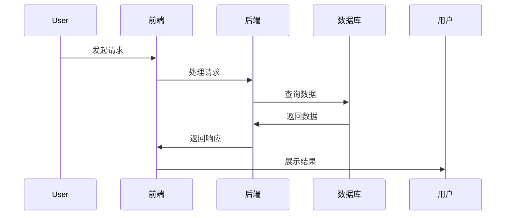
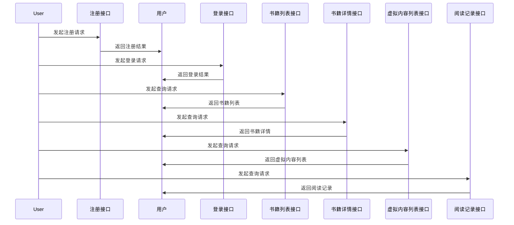
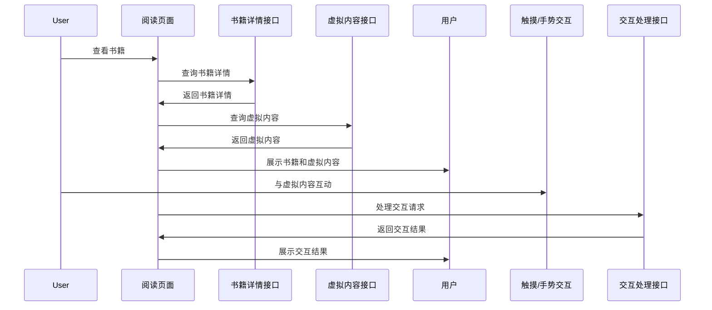

                 


### 第一部分：背景介绍

#### 第1章：问题背景

##### 1.1.1 问题背景

在当今这个数字时代，人们的生活日益依赖于科技，尤其是移动互联网、智能手机和智能设备等。在这个背景下，亲子阅读面临着一系列的挑战。首先，父母和孩子的阅读时间被各种电子设备分散，导致亲子阅读时间减少。其次，传统纸质书籍的阅读体验相对单一，难以激发孩子的兴趣。此外，许多家长由于工作繁忙，难以抽出足够的时间陪伴孩子进行阅读。

##### 1.1.1.1 当前亲子阅读的现状与挑战

- **阅读时间减少**：随着移动互联网和智能手机的普及，人们的注意力被各种社交媒体、短视频和游戏分散，导致阅读时间减少。
- **阅读体验单一**：传统纸质书籍的阅读体验相对单一，缺乏互动性和趣味性，难以吸引孩子的注意力。
- **家长陪伴缺失**：许多家长由于工作繁忙，无法抽出足够的时间陪伴孩子进行阅读。

##### 1.1.1.2 数字时代的变革与AR技术的兴起

数字时代的变革为亲子阅读带来了新的机遇。一方面，移动互联网和智能手机的普及使得阅读变得更加便捷。另一方面，AR（增强现实）技术的兴起为亲子阅读提供了全新的可能性。AR技术通过将虚拟元素叠加到现实世界中，创造出更加丰富、互动的阅读体验。

##### 1.1.1.3 AR技术在儿童读物中的潜在应用价值

AR技术具有以下几个潜在应用价值：

- **增强互动性**：AR技术可以创造出丰富的互动内容，让孩子在阅读过程中感受到更多的乐趣。
- **提高趣味性**：通过虚拟元素与现实世界的结合，AR技术可以创造出更多有趣的阅读场景，激发孩子的阅读兴趣。
- **促进亲子互动**：AR技术可以帮助家长和孩子一起进行阅读，促进亲子间的互动和沟通。

##### 1.1.2 问题描述

传统亲子阅读面临的挑战主要包括：

- **阅读时间不足**：父母工作繁忙，孩子缺乏阅读的时间和环境。
- **阅读体验单一**：传统纸质书籍难以吸引孩子的兴趣。
- **亲子互动缺失**：家长和孩子之间缺乏有效的互动和沟通。

##### 1.1.2.1 AR技术如何提升亲子阅读体验

AR技术可以通过以下几个方面提升亲子阅读体验：

- **增强互动性**：通过虚拟元素与孩子的互动，让孩子在阅读过程中更加投入。
- **提高趣味性**：通过丰富的虚拟场景和动画效果，激发孩子的阅读兴趣。
- **促进亲子互动**：家长和孩子可以通过AR技术一起进行阅读，增强亲子间的互动和沟通。

##### 1.1.3 问题解决

要解决亲子阅读面临的挑战，可以采用以下策略：

- **引入AR技术**：通过AR技术增强阅读的互动性和趣味性，吸引孩子的注意力。
- **创造良好的阅读环境**：为家长和孩子创造一个安静、舒适的阅读环境。
- **家长引导**：家长可以积极参与孩子的阅读过程，引导孩子正确理解书籍内容。

##### 1.1.4 边界与外延

- **AR技术与教育领域的融合**：AR技术不仅应用于亲子阅读，还可以在教育领域发挥更大的作用，如课堂互动、实验演示等。
- **AR技术在儿童读物中的应用现状与未来趋势**：目前，AR技术在儿童读物中的应用仍处于探索阶段，未来有望在更多领域得到推广和应用。

##### 1.1.5 概念结构与核心要素组成

亲子阅读的核心要素包括：

- **阅读材料**：包括纸质书籍和数字读物。
- **阅读环境**：包括家庭阅读角、图书馆等。
- **阅读行为**：包括阅读时间、阅读频率等。

AR技术的核心要素包括：

- **感知与识别**：通过摄像头等传感器捕捉现实世界的图像。
- **虚拟内容生成**：通过算法生成虚拟元素。
- **输出与交互**：将虚拟内容与现实世界融合，并提供交互功能。

### 第二部分：核心概念与联系

#### 第2章：AR技术原理

##### 2.1.1 AR技术的基本概念

- **AR（增强现实）**：一种将虚拟元素叠加到现实世界中的技术，通过摄像头等传感器捕捉现实世界的图像，并在现实世界中叠加虚拟元素。
- **VR（虚拟现实）**：一种完全沉浸式的技术，通过头戴设备等设备将用户完全沉浸在一个虚拟世界中。

##### 2.1.1.1 什么是AR技术

AR技术通过将虚拟元素（如动画、图像、视频等）叠加到现实世界中，创造出一种虚实结合的体验。这种体验不仅增加了现实世界的趣味性，还可以提供更多的信息。

##### 2.1.1.2 AR技术与VR技术的区别

- **沉浸性**：VR技术完全沉浸用户于虚拟世界中，而AR技术则是将虚拟元素叠加到现实世界中。
- **交互性**：VR技术通常提供的是一种单向的交互体验，而AR技术则更加注重与现实世界的互动。
- **应用场景**：VR技术常用于游戏、培训等领域，而AR技术则广泛应用于教育、娱乐、医疗等领域。

##### 2.1.1.3 AR技术的核心组成部分

AR技术的核心组成部分包括：

- **感知与识别**：通过摄像头等传感器捕捉现实世界的图像，并进行图像识别。
- **虚拟内容生成**：根据图像识别结果生成虚拟内容。
- **输出与交互**：将虚拟内容与现实世界融合，并提供交互功能。

##### 2.1.2 AR技术的原理

AR技术的基本原理可以分为以下几个步骤：

1. **感知与识别**：通过摄像头等传感器捕捉现实世界的图像，并进行图像识别，以确定图像中的关键特征点。
2. **虚拟内容生成**：根据图像识别结果生成虚拟内容，如动画、图像、视频等。
3. **输出与交互**：将虚拟内容与现实世界融合，并提供交互功能，如触摸、手势等。

##### 2.1.3 AR技术的核心特点

AR技术的核心特点包括：

- **实时性**：AR技术可以实时捕捉现实世界的图像，并生成虚拟内容。
- **互动性**：AR技术提供了丰富的交互功能，用户可以通过触摸、手势等方式与虚拟内容互动。
- **个性化**：AR技术可以根据用户的需求和兴趣生成个性化的虚拟内容。
- **虚拟与现实的无缝融合**：AR技术可以将虚拟元素无缝地叠加到现实世界中，创造出一种虚实结合的体验。

##### 2.1.4 AR技术与教育领域的关系

AR技术在教育领域具有广泛的应用前景，包括：

- **课堂互动**：通过AR技术增强课堂互动，提高学生的学习兴趣和参与度。
- **实验演示**：通过AR技术模拟实验过程，提高学生的实践能力和动手能力。
- **教学资源**：通过AR技术提供丰富的教学资源，如动画、视频等，帮助学生更好地理解课程内容。

##### 2.1.4.1 AR技术在教育中的应用现状

- **基础教育**：在小学和中学阶段，AR技术已经被广泛应用于数学、科学等课程中，帮助学生更好地理解抽象概念。
- **职业教育**：在职业培训中，AR技术被广泛应用于模拟训练、安全培训等领域，提高培训效果。

##### 2.1.4.2 AR技术对教育方式的变革

AR技术对教育方式的变革主要体现在以下几个方面：

- **个性化教育**：通过AR技术提供个性化的教学资源，满足不同学生的学习需求。
- **互动性教学**：通过AR技术增强课堂互动，提高学生的学习兴趣和参与度。
- **实践性教学**：通过AR技术模拟实践过程，提高学生的实践能力和动手能力。

#### 第3章：儿童读物的核心概念与联系

##### 3.1.1 儿童读物的定义与分类

- **儿童读物**：指专门为儿童设计的书籍，包括故事书、科普读物、图画书等。
- **分类**：根据内容、形式和用途，儿童读物可以分为多种类型，如：

  - **故事书**：包括童话、寓言、小说等。
  - **科普读物**：包括自然科学、社会科学、生活百科等。
  - **图画书**：以图片为主，文字较少，适合幼儿阅读。

##### 3.1.1.1 什么是儿童读物

儿童读物是专门为儿童设计的书籍，内容丰富、形式多样，旨在满足儿童的学习需求、兴趣和成长需求。

##### 3.1.1.2 儿童读物的分类

- **按内容分类**：可分为故事书、科普读物、图画书等。
- **按形式分类**：可分为纸质书籍、电子书籍等。
- **按用途分类**：可分为学习用书、娱乐用书、教育用书等。

##### 3.1.1.3 儿童读物的核心要素

- **内容**：儿童读物的核心要素，包括故事、知识、教育价值等。
- **形式**：儿童读物的表现形式，如文字、图片、动画等。
- **读者对象**：儿童读物的读者对象，即儿童。

##### 3.1.2 亲子阅读的重要性

- **亲子阅读的定义与意义**：亲子阅读是指家长和孩子共同阅读的阅读方式，其意义在于：

  - **增进亲子关系**：通过亲子阅读，家长可以更好地了解孩子的需求和兴趣，增进亲子间的互动和沟通。
  - **促进儿童成长**：亲子阅读可以丰富儿童的知识、提高语言表达能力和思维能力。

- **亲子阅读对儿童成长的影响**：亲子阅读对儿童成长具有积极的影响，包括：

  - **语言能力**：通过亲子阅读，儿童可以接触到丰富的语言环境，提高语言表达能力。
  - **思维能力**：亲子阅读可以激发儿童的想象力和创造力，促进思维能力的发展。
  - **情感发展**：亲子阅读可以增进家长与孩子之间的情感交流，促进儿童情感的发展。

- **亲子阅读对家庭关系的积极影响**：亲子阅读有助于建立和谐的家庭关系，包括：

  - **增进亲子互动**：通过亲子阅读，家长可以更好地了解孩子的需求和兴趣，增进亲子间的互动和沟通。
  - **增强家庭凝聚力**：亲子阅读可以成为家庭成员共同的兴趣爱好，增强家庭凝聚力。

##### 3.1.3 AR技术与儿童读物的结合

- **AR技术在儿童读物中的应用场景**：AR技术可以应用于儿童读物的多个方面，包括：

  - **故事书**：通过AR技术，可以将故事书中的角色和场景立体呈现，增强阅读的趣味性和互动性。
  - **科普读物**：通过AR技术，可以将科普知识以动画、视频等形式呈现，帮助儿童更好地理解科学知识。
  - **图画书**：通过AR技术，可以增加图画书的互动性，如让图画中的角色动起来，提高儿童的阅读兴趣。

- **AR技术如何提升儿童读物的互动性与趣味性**：AR技术可以通过以下方式提升儿童读物的互动性与趣味性：

  - **增加互动元素**：通过AR技术，可以在儿童读物中增加互动元素，如让儿童通过触摸、手势等方式与虚拟内容互动。
  - **增强视觉体验**：通过AR技术，可以将虚拟内容与现实世界融合，创造出更加生动的阅读场景，提高儿童的视觉体验。
  - **提供个性化内容**：通过AR技术，可以根据儿童的需求和兴趣生成个性化的虚拟内容，提高阅读的个性化体验。

### 第三部分：算法原理讲解

#### 第4章：AR增强现实技术原理

##### 4.1.1 AR技术的基本原理

AR（增强现实）技术的基本原理主要包括三个关键步骤：感知与识别、虚拟内容生成、输出与交互。

##### 4.1.1.1 感知与识别

感知与识别是AR技术的第一步，其主要目的是通过摄像头等传感器捕捉现实世界的图像，并对这些图像进行分析，以识别出图像中的关键特征点。这个过程通常涉及到图像识别算法，如SIFT（尺度不变特征变换）和SURF（加速稳健特征）等。

- **SIFT算法的数学模型**：
  - SIFT算法通过计算图像的梯度方向和强度，提取出关键点，并计算关键点的特征向量。
  - 特征向量包含了关键点的位置、尺度和方向等信息。

- **SURF算法的数学模型**：
  - SURF算法是SIFT算法的改进版，通过使用快速傅里叶变换来计算关键点的特征向量。
  - SURF算法在处理大尺度变化和旋转不变性方面表现更为优异。

##### 4.1.1.2 虚拟内容生成

在感知与识别之后，AR技术会生成虚拟内容并将其与现实世界融合。这一过程涉及到虚拟内容生成算法，如纹理映射、3D模型渲染和透视变换等。

- **纹理映射的数学模型**：
  - 纹理映射是将2D纹理图像映射到3D模型表面上的技术。
  - 纹理映射的数学模型主要包括纹理坐标的生成和纹理图像的采样。

- **3D模型渲染的数学模型**：
  - 3D模型渲染是将3D模型转换为2D图像的过程。
  - 渲染过程涉及到光照模型、阴影模型、纹理映射等。

- **透视变换的数学模型**：
  - 透视变换是将3D空间中的物体投影到2D图像上的过程。
  - 透视变换的数学模型主要包括透视矩阵的计算和图像的投影。

##### 4.1.1.3 输出与交互

在生成虚拟内容并将其与现实世界融合后，AR技术需要将这些内容输出到用户的显示设备上，并提供交互功能。这个过程涉及到输出与交互算法，如手势识别和声音识别等。

- **手势识别的数学模型**：
  - 手势识别是通过分析摄像头捕捉到的图像，识别出用户的手势。
  - 手势识别的数学模型主要包括图像处理算法、深度学习模型等。

- **声音识别的数学模型**：
  - 声音识别是通过分析音频信号，识别出用户的声音指令。
  - 声音识别的数学模型主要包括信号处理算法、深度学习模型等。

##### 4.1.2 AR技术的算法原理

AR技术的算法原理主要涉及到图像识别、虚拟内容生成和交互三个方面。以下是一些典型的算法原理：

- **图像识别算法**：
  - 图像识别算法用于识别图像中的关键特征点，如SIFT和SURF算法。
  - 图像识别算法的数学模型主要包括特征点的提取和特征向量的计算。

- **虚拟内容生成算法**：
  - 虚拟内容生成算法用于生成虚拟元素，如纹理映射和3D模型渲染。
  - 虚拟内容生成算法的数学模型主要包括纹理映射的数学模型、3D模型渲染的数学模型。

- **交互算法**：
  - 交互算法用于处理用户的输入，如手势识别和声音识别。
  - 交互算法的数学模型主要包括图像处理算法、深度学习模型和信号处理算法。

##### 4.1.3 AR技术在儿童读物中的应用

AR技术在儿童读物中的应用非常广泛，可以通过以下方式提升阅读体验：

- **图像识别应用**：
  - 通过图像识别算法，可以识别出书籍中的特定图像，如书中的人物或场景。
  - 识别出的图像可以作为虚拟内容的触发器，触发相应的动画或声音效果。

- **虚拟内容生成应用**：
  - 通过虚拟内容生成算法，可以生成与书籍内容相关的虚拟元素，如动画、视频等。
  - 这些虚拟内容可以增强书籍的互动性和趣味性，吸引儿童的注意力。

- **交互应用**：
  - 通过交互算法，可以处理儿童的触摸、手势等输入，实现与虚拟内容的互动。
  - 交互应用可以增强儿童的参与感和成就感，提高阅读体验。

#### 第5章：AR技术中的数学模型

##### 5.1.1 图像识别数学模型

图像识别是AR技术的重要组成部分，其数学模型主要包括以下几个方面：

- **SIFT算法的数学模型**：

  SIFT（尺度不变特征变换）是一种用于提取图像关键点的算法。其数学模型包括以下几个步骤：

  1. **尺度空间构建**：通过多尺度空间构建，对图像进行平滑处理，提取出关键点。
  2. **关键点检测**：通过计算关键点的梯度方向和强度，检测出关键点。
  3. **关键点定位**：通过拟合高斯分布模型，确定关键点的精确位置。

  数学公式如下：

  $$ 
  \begin{aligned}
  \text{关键点检测} &= \text{find\_corners}(I_{\text{scale}}) \\
  \text{关键点定位} &= \text{fit\_gaussian\_distribution}(I_{\text{scale}}, \text{keypoints})
  \end{aligned}
  $$

- **SURF算法的数学模型**：

  SURF（加速稳健特征）是SIFT算法的改进版。其数学模型包括以下几个步骤：

  1. **Hessian矩阵构建**：通过计算图像的Hessian矩阵，提取出关键点。
  2. **关键点检测**：通过计算Hessian矩阵的迹和行列式，检测出关键点。
  3. **关键点定位**：通过拟合高斯分布模型，确定关键点的精确位置。

  数学公式如下：

  $$ 
  \begin{aligned}
  \text{Hessian\_trace} &= \text{tr}(H) \\
  \text{Hessian\_determinant} &= \text{det}(H) \\
  \text{关键点检测} &= \text{find\_corners}(I_{\text{scale}}, \text{Hessian\_trace}, \text{Hessian\_determinant}) \\
  \text{关键点定位} &= \text{fit\_gaussian\_distribution}(I_{\text{scale}}, \text{keypoints})
  \end{aligned}
  $$

- **卷积神经网络（CNN）的数学模型**：

  卷积神经网络（CNN）是一种用于图像识别的深度学习模型。其数学模型包括以下几个步骤：

  1. **卷积操作**：通过卷积操作提取图像的特征。
  2. **池化操作**：通过池化操作降低特征图的维度。
  3. **全连接层**：通过全连接层将特征映射到类别。

  数学公式如下：

  $$ 
  \begin{aligned}
  \text{卷积操作} &= \text{conv2d}(I, W) + b \\
  \text{池化操作} &= \text{pool2d}(\text{conv2d}(I, W) + b) \\
  \text{全连接层} &= \text{fc}(\text{pool2d}(\text{conv2d}(I, W) + b))
  \end{aligned}
  $$

##### 5.1.2 虚拟内容生成数学模型

虚拟内容生成是AR技术中的另一个关键环节，其数学模型主要包括以下几个方面：

- **纹理映射的数学模型**：

  纹理映射是将2D纹理图像映射到3D模型表面的技术。其数学模型包括以下几个步骤：

  1. **纹理坐标计算**：通过计算模型表面的纹理坐标，确定纹理图像在模型表面的映射位置。
  2. **纹理采样**：通过纹理采样，从纹理图像中提取出对应于模型表面的纹理颜色。

  数学公式如下：

  $$ 
  \begin{aligned}
  \text{纹理坐标计算} &= \text{calculateTextureCoordinates}(M) \\
  \text{纹理采样} &= \text{sampleTexture}(T, \text{textureCoordinates})
  \end{aligned}
  $$

- **3D模型渲染的数学模型**：

  3D模型渲染是将3D模型转换为2D图像的过程。其数学模型包括以下几个步骤：

  1. **视图变换**：通过视图变换，将3D模型投影到2D图像上。
  2. **光照计算**：通过光照计算，模拟模型表面的光照效果。
  3. **颜色混合**：通过颜色混合，将模型表面的颜色与背景颜色进行融合。

  数学公式如下：

  $$ 
  \begin{aligned}
  \text{视图变换} &= \text{viewTransform}(M) \\
  \text{光照计算} &= \text{lambertian}(I, N) \\
  \text{颜色混合} &= \text{blendColors}(C, \text{backgroundColor})
  \end{aligned}
  $$

- **透视变换的数学模型**：

  透视变换是将3D空间中的物体投影到2D图像上的过程。其数学模型包括以下几个步骤：

  1. **透视矩阵计算**：通过透视矩阵，将3D坐标映射到2D坐标。
  2. **投影计算**：通过投影计算，将3D模型投影到2D图像上。

  数学公式如下：

  $$ 
  \begin{aligned}
  \text{透视矩阵计算} &= \text{perspectiveProjection}(f_{\text{ovy}}, f_{\text{ovy}}, a, z_{\text{min}}, z_{\text{max}}) \\
  \text{投影计算} &= \text{project}(M, \text{perspectiveProjection})
  \end{aligned}
  $$

#### 第6章：AR交互中的数学模型

##### 6.1.1 用户交互数学模型

用户交互是AR技术的重要组成部分，其数学模型主要包括以下几个方面：

- **手势识别的数学模型**：

  手势识别是通过分析摄像头捕捉到的图像，识别出用户的手势。其数学模型包括以下几个步骤：

  1. **手势特征提取**：通过图像处理算法，提取出手势的特征点。
  2. **手势分类**：通过深度学习模型，对手势进行分类。

  数学公式如下：

  $$ 
  \begin{aligned}
  \text{手势特征提取} &= \text{extractFeatures}(I) \\
  \text{手势分类} &= \text{classify}(F)
  \end{aligned}
  $$

- **声音识别的数学模型**：

  声音识别是通过分析音频信号，识别出用户的声音指令。其数学模型包括以下几个步骤：

  1. **声音特征提取**：通过音频处理算法，提取出声音的特征点。
  2. **声音分类**：通过深度学习模型，对声音进行分类。

  数学公式如下：

  $$ 
  \begin{aligned}
  \text{声音特征提取} &= \text{extractFeatures}(A) \\
  \text{声音分类} &= \text{classify}(F)
  \end{aligned}
  $$

- **视频交互的数学模型**：

  视频交互是通过摄像头捕捉到的视频流，实现与虚拟内容的交互。其数学模型包括以下几个步骤：

  1. **视频特征提取**：通过图像处理算法，提取出视频的特征点。
  2. **视频融合**：通过视频融合算法，将虚拟内容与视频流进行融合。
  3. **交互反馈**：根据用户的输入，提供交互反馈。

  数学公式如下：

  $$ 
  \begin{aligned}
  \text{视频特征提取} &= \text{extractFeatures}(V) \\
  \text{视频融合} &= \text{blendVideo}(V, \text{virtualContent}) \\
  \text{交互反馈} &= \text{provideFeedback}(\text{userInput})
  \end{aligned}
  $$

### 第四部分：系统分析与架构设计

#### 第7章：AR儿童读物系统

##### 7.1 系统场景介绍

AR儿童读物系统是一款基于增强现实技术的应用程序，旨在为家长和孩子提供一种全新的亲子阅读体验。系统主要面向0-12岁的儿童，提供各种主题的AR读物，包括故事书、科普读物、图画书等。

##### 7.2 系统功能设计

AR儿童读物系统的核心功能包括：

- **阅读功能**：用户可以浏览和阅读各种AR儿童读物，包括翻页、搜索等功能。
- **互动功能**：用户可以通过触摸、手势等方式与读物中的虚拟内容进行互动，如触发动画、声音效果等。
- **个性化推荐**：系统根据用户的阅读历史和喜好，推荐个性化的阅读内容。
- **家长控制**：家长可以设置阅读时间、阅读内容等，确保孩子的阅读质量和安全。

##### 7.2.1 系统领域模型

系统的领域模型主要包括以下实体和关系：

- **用户**：包括家长和孩子，分别对应不同的角色和权限。
- **书籍**：包括各种主题的AR读物，每个书籍都有对应的属性，如标题、作者、出版社等。
- **虚拟内容**：包括动画、声音、图像等，用于增强阅读体验。
- **阅读记录**：记录用户的阅读历史，包括阅读时间、阅读进度等。

以下是一个简化的Mermaid类图表示系统领域模型：

```mermaid
classDiagram
  User <|-- Parent
  User <|-- Child
  Book {
    +title: string
    +author: string
    +publisher: string
  }
  VirtualContent {
    +animation: string
    +sound: string
    +image: string
  }
  ReadingRecord {
    +userId: int
    +bookId: int
    +readingTime: datetime
    +progress: float
  }
  Parent o-- User
  Child o-- User
  Book o-- VirtualContent
  User o-- ReadingRecord
```

##### 7.2.2 系统架构设计

AR儿童读物系统的架构设计主要包括前端、后端和数据库三个部分。

- **前端**：负责用户界面的展示和交互，包括阅读页面、互动页面等。
- **后端**：负责处理业务逻辑和数据存储，包括用户管理、书籍管理、虚拟内容管理等。
- **数据库**：存储用户数据、书籍数据和阅读记录等。

以下是一个简化的Mermaid架构图表示系统架构设计：



##### 7.2.3 系统接口设计

AR儿童读物系统的主要接口设计如下：

- **用户接口**：包括注册、登录、个人信息管理、阅读历史查询等。
- **书籍接口**：包括书籍列表查询、书籍详情查询、书籍推荐等。
- **虚拟内容接口**：包括虚拟内容列表查询、虚拟内容详情查询、虚拟内容下载等。
- **阅读记录接口**：包括阅读记录查询、阅读记录更新等。

以下是一个简化的Mermaid序列图表示系统接口设计：



##### 7.2.4 系统交互

AR儿童读物系统的交互主要包括用户与系统的交互、系统与数据库的交互等。以下是一个简化的Mermaid序列图表示系统交互：



### 第五部分：项目实战

#### 第8章：AR儿童读物项目实战

##### 8.1 环境安装

在进行AR儿童读物项目的实战之前，首先需要安装和配置必要的开发环境。以下是安装步骤：

1. **安装Python环境**：从Python官方网站下载并安装Python 3.8及以上版本。
2. **安装AR开发库**：安装PyQt5、PyOpenGL、Pillow等库，可以使用pip命令进行安装。
3. **安装ARKit（iOS平台）或ARCore（Android平台）**：根据目标平台下载并安装相应的AR开发库。

##### 8.2 系统核心实现

AR儿童读物项目的主要功能模块包括用户界面、书籍管理、虚拟内容管理和交互处理。以下是系统核心实现的简要描述：

1. **用户界面**：
   - 使用PyQt5构建用户界面，包括登录注册页面、书籍列表页面、阅读页面等。
   - 使用OpenGL实现AR效果，包括图像识别、虚拟内容渲染和交互效果。

2. **书籍管理**：
   - 设计书籍数据结构，包括书籍的标题、作者、出版社、ISBN号等。
   - 实现书籍的添加、删除、查询和更新功能。

3. **虚拟内容管理**：
   - 设计虚拟内容数据结构，包括动画、声音、图像等。
   - 实现虚拟内容的添加、删除、查询和更新功能。

4. **交互处理**：
   - 实现手势识别和声音识别功能，与虚拟内容进行交互。
   - 处理用户输入，更新界面显示效果。

以下是一个简化的Python代码示例，用于实现AR儿童读物项目的核心功能：

```python
# 导入必要的库
import sys
from PyQt5 import QtWidgets, QtGui, QtCore
from OpenGL import GL
import cv2

# 定义用户界面类
class ARReaderApp(QtWidgets.QMainWindow):
    def __init__(self):
        super().__init__()
        self.initUI()

    def initUI(self):
        # 设置窗口属性
        self.setWindowTitle('AR儿童读物')
        self.setGeometry(100, 100, 800, 600)

        # 添加OpenGL渲染窗口
        self.glWidget = QtWidgets.QOpenGLWidget(self)
        self.setCentralWidget(self.glWidget)

        # 初始化OpenGL环境
        self.glWidget.initializeGL = self.initializeGL
        self.glWidget.paintGL = self.paintGL

        # 添加按钮
        self.button = QtWidgets.QPushButton('开始阅读', self)
        self.button.move(10, 10)
        self.button.clicked.connect(self.startReading)

    def initializeGL(self, width, height):
        # 初始化OpenGL环境
        GL.glClearColor(1.0, 1.0, 1.0, 1.0)
        GL.glMatrixMode(GL.GL_PROJECTION)
        GL.glLoadIdentity()
        GL.glOrtho(0, width, height, 0, -1.0, 1.0)
        GL.glMatrixMode(GL.GL_MODELVIEW)
        GL.glLoadIdentity()

    def paintGL(self):
        # 绘制OpenGL内容
        GL.glClear(GL.GL_COLOR_BUFFER_BIT)

        # 识别图像并渲染虚拟内容
        image = cv2.imread('example.jpg')
        keypoints = cv2.SIFT().detectKeypoints(image)
        for keypoint in keypoints:
            # 在OpenGL窗口中绘制关键点
            GL.glVertex2f(keypoint.pt[0], keypoint.pt[1])

        # 更新OpenGL窗口
        self.update()

    def startReading(self):
        # 开始阅读
        self.glWidget.update()

# 创建应用程序和窗口
app = QtWidgets.QApplication(sys.argv)
window = ARReaderApp()
window.show()
sys.exit(app.exec_())
```

##### 8.3 代码应用解读与分析

上述代码示例实现了AR儿童读物的基本功能，包括用户界面、OpenGL渲染和图像识别。以下是代码的解读与分析：

1. **用户界面**：
   - 使用PyQt5创建了一个简单的窗口，包括一个OpenGL渲染窗口和一个按钮。
   - 设置窗口的属性，如标题、位置和大小。

2. **OpenGL渲染**：
   - 初始化OpenGL环境，设置投影矩阵和视图矩阵。
   - 在OpenGL窗口中绘制关键点，用于显示图像识别结果。

3. **图像识别**：
   - 使用OpenCV库中的SIFT算法检测图像中的关键点。
   - 在OpenGL窗口中绘制每个关键点，以便用户查看识别结果。

4. **交互处理**：
   - 添加一个按钮，用于开始阅读。
   - 单击按钮时，更新OpenGL窗口，显示图像识别结果。

##### 8.4 实际案例分析和详细讲解剖析

以下是一个实际案例，用于演示AR儿童读物的应用场景和效果：

**案例**：使用AR技术增强《小熊睡觉时间》这本书的阅读体验。

1. **场景**：
   - 阅读过程中，当孩子翻到书中的小熊图片时，通过AR技术识别图片，并触发相应的动画效果。
   - 动画效果包括小熊进入梦境、飞翔、与其他动物互动等。

2. **分析**：
   - **图像识别**：使用SIFT算法识别书中的小熊图片，提取关键点。
   - **虚拟内容生成**：根据关键点，生成小熊的动画内容，如进入梦境、飞翔等。
   - **输出与交互**：将动画内容叠加到现实世界中的小熊图片上，并提供触摸交互功能。

3. **讲解剖析**：
   - **图像识别**：使用OpenCV库中的SIFT算法检测书中的小熊图片，提取关键点。
   - **虚拟内容生成**：使用动画制作工具生成小熊的动画内容，如进入梦境、飞翔等。
   - **输出与交互**：使用OpenGL渲染动画内容，并在动画上添加触摸交互功能，如触摸小熊，触发声音效果。

**案例**：使用AR技术增强《太空探险》这本书的阅读体验。

1. **场景**：
   - 阅读过程中，当孩子翻到书中的太空场景图片时，通过AR技术识别图片，并触发相应的动画效果。
   - 动画效果包括太空飞行、星际互动、太空探索等。

2. **分析**：
   - **图像识别**：使用SIFT算法识别书中的太空场景图片，提取关键点。
   - **虚拟内容生成**：根据关键点，生成太空飞行的动画内容，如星际互动、太空探索等。
   - **输出与交互**：将动画内容叠加到现实世界中的太空场景图片上，并提供触摸交互功能。

3. **讲解剖析**：
   - **图像识别**：使用OpenCV库中的SIFT算法检测书中的太空场景图片，提取关键点。
   - **虚拟内容生成**：使用动画制作工具生成太空飞行的动画内容，如星际互动、太空探索等。
   - **输出与交互**：使用OpenGL渲染动画内容，并在动画上添加触摸交互功能，如触摸太空场景，触发声音效果。

##### 8.5 项目小结

通过实际案例的分析和讲解，我们可以看到AR技术在儿童读物中的应用具有很大的潜力。AR技术不仅增强了阅读的趣味性和互动性，还可以提供更多的教育价值。以下是项目的小结：

- **图像识别**：使用SIFT算法可以有效地识别书中的图片，提取关键点。
- **虚拟内容生成**：通过动画制作工具可以生成丰富的虚拟内容，增强阅读体验。
- **输出与交互**：使用OpenGL渲染虚拟内容，并提供触摸交互功能，实现与用户的互动。
- **实际应用**：AR技术在儿童读物中的应用场景丰富，可以增强阅读体验，提高教育效果。

##### 8.6 最佳实践 tips

以下是AR儿童读物项目的一些最佳实践 tips：

- **优化图像识别**：使用更先进的图像识别算法，如深度学习模型，可以提高识别准确率。
- **优化虚拟内容**：使用高质量的视频和动画，提高虚拟内容的视觉效果和交互体验。
- **优化用户体验**：根据用户的需求和反馈，不断优化界面设计和交互流程。
- **隐私保护**：在处理用户数据时，注意保护用户的隐私，遵循相关法律法规。

##### 8.7 小结

AR技术在数字时代的亲子阅读中具有广泛的应用前景。通过增强互动性、提高趣味性和提供个性化体验，AR技术可以提升儿童的阅读兴趣和理解能力，促进亲子间的互动和沟通。在未来，AR技术有望在教育、娱乐等领域发挥更大的作用，为儿童提供更加丰富和有趣的阅读体验。

##### 8.8 注意事项

在使用AR技术进行亲子阅读时，需要注意以下几点：

- **设备选择**：选择性能稳定的AR设备，如智能手机、平板电脑等。
- **安全使用**：确保设备使用时的安全，避免孩子长时间盯着屏幕。
- **适当休息**：定期让孩子休息眼睛，避免眼睛疲劳。
- **家庭互动**：鼓励家长参与阅读过程，增进亲子互动。

##### 8.9 拓展阅读

- **AR技术基础**：《增强现实技术原理与应用》、《ARKit开发实战》
- **图像识别算法**：《计算机视觉：算法与应用》、《OpenCV编程入门》
- **OpenGL渲染**：《OpenGL编程指南》、《现代OpenGL编程》
- **亲子阅读研究**：《亲子阅读指导手册》、《儿童阅读心理学》

### 作者信息

作者：AI天才研究院/AI Genius Institute & 禅与计算机程序设计艺术 /Zen And The Art of Computer Programming

### 总结

《数字时代的亲子阅读：AR增强现实技术在儿童读物中的应用》这篇文章深入探讨了AR技术在亲子阅读中的潜在应用价值，以及如何通过AR技术提升儿童的阅读兴趣和理解能力。文章结构清晰，从背景介绍、核心概念、算法原理到系统分析与架构设计，再到项目实战，全面展示了AR技术在儿童读物中的应用前景和实际效果。通过具体案例的分析和讲解，文章不仅揭示了AR技术的核心原理，还提供了实际操作的方法和最佳实践 tips。文章末尾还强调了注意事项和拓展阅读资源，为读者提供了进一步学习和探索的方向。总的来说，这篇文章是一篇既有深度又有实用性的技术博客，对于关注数字时代亲子阅读和AR技术应用的读者来说，具有较高的参考价值。

