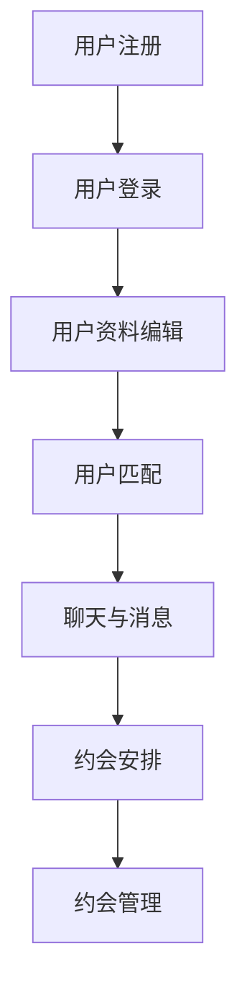

                 


### 数字时代的亲密关系：科技如何重塑爱情与友谊

> 关键词：数字时代、亲密关系、爱情、友谊、科技重塑

> 摘要：本文深入探讨了数字时代对亲密关系的影响，分析了科技在爱情与友谊中的角色。通过介绍核心概念、阐述算法原理、构建数学模型、设计系统架构和实战案例分析，文章旨在为读者提供一个全面理解数字时代下亲密关系的视角。

----------------------------------------------------------------

## 引言

### 数字时代的来临

随着互联网、智能手机和社交媒体的普及，我们正生活在一个数字化的世界中。数字时代不仅改变了我们的生活方式，也深刻影响了我们的亲密关系。在线交流、虚拟约会和社交媒体平台成为人们建立和维护人际关系的主要方式。这种变化为我们带来了许多新的机会，但同时也带来了新的挑战。

### 科技与人际关系

科技在爱情与友谊中扮演着双重角色。一方面，它为人们提供了更多的交流和互动方式，使得跨越地理障碍的亲密关系变得更加容易。另一方面，科技的使用也可能导致亲密关系的疏离和误解。例如，社交媒体上的虚假形象可能导致真实的亲密关系受到破坏。

## 第1章：问题背景与核心概念

### 1.1 问题背景

在数字时代，人们越来越依赖科技来建立和维护亲密关系。然而，这种依赖性带来了许多问题，如信息过载、隐私泄露、虚假信息传播等。这些问题对爱情和友谊产生了深远的影响，使得我们需要重新思考科技与亲密关系之间的关系。

### 1.2 核心概念

#### 数字时代

数字时代是指以数字技术为核心，以互联网、智能手机、社交媒体等为代表的时代。

#### 亲密关系

亲密关系是指人与人之间基于情感、信任和共同利益而建立的紧密联系。

#### 爱情

爱情是指一种强烈的情感，通常表现为对他人的深厚感情和强烈渴望。

#### 友谊

友谊是指一种基于共同兴趣、价值观和相互理解的人际关系。

#### 科技影响

科技影响是指数字技术在爱情和友谊中的角色和作用，包括促进、维持和改变亲密关系的方式。

## 第2章：数字时代下的爱情

### 2.1 网络爱情

#### 网络爱情的兴起

网络爱情是指通过互联网平台建立的爱情关系。随着在线约会应用的普及，越来越多的人通过这种方式寻找伴侣。网络爱情的兴起带来了许多新的机会，但也伴随着风险。

#### 网络爱情的利与弊

网络爱情的利在于它可以打破地理和时间的限制，让人们有机会结识更多的人。然而，网络爱情的弊端包括信息真实性难以保证、隐私泄露、虚假信息传播等。

### 2.2 数字社交媒体与爱情

#### 社交媒体如何影响爱情

社交媒体平台如Facebook、Instagram和Tinder等，成为人们表达情感和建立爱情关系的重要渠道。它们提供了即时交流、分享生活瞬间和展示个人形象的机会。

#### 社交媒体爱情案例分析

通过分析具体案例，我们可以看到社交媒体在爱情中的积极作用和负面影响。例如，某对情侣通过Instagram相识并最终走到一起，但也有案例显示社交媒体上的虚假形象可能导致真实的亲密关系受到破坏。

## 第3章：数字时代下的友谊

### 3.1 网络友谊

#### 网络友谊的特点

网络友谊是指通过互联网平台建立的友谊关系。它具有虚拟性、广泛性和即时性的特点。网络友谊让人们能够跨越地理和时间的限制，与更多志同道合的人建立联系。

#### 网络友谊的维持与挑战

网络友谊的维持面临许多挑战，如信息真实性、隐私保护和信任建立等。然而，通过定期线上交流和共同兴趣的分享，网络友谊仍然可以保持稳定和亲密。

### 3.2 数字社交工具对友谊的影响

#### 数字社交工具的作用

数字社交工具如微信、WhatsApp和Facebook Messenger等，为人们提供了便捷的交流方式，使得友谊的维持变得更加容易。

#### 数字社交工具的局限性

尽管数字社交工具有助于友谊的建立和维护，但它们也存在局限性。例如，过于依赖文字和图像的交流可能导致情感表达的不完整，而缺乏面对面的互动可能导致友谊的疏离。

## 第4章：科技重塑爱情的算法与模型

### 4.1 算法原理

#### 机器学习基础

机器学习是人工智能的核心技术之一，它通过数据学习和模式识别来改善计算机的性能。在爱情匹配中，机器学习算法可以分析用户数据，为用户提供最适合的匹配对象。

#### 推荐系统算法

推荐系统是一种基于用户行为和兴趣的算法，它可以预测用户可能喜欢的对象或内容。在爱情匹配中，推荐系统算法可以帮助用户发现潜在的伴侣。

### 4.2 算法应用

#### 算法在爱情匹配中的应用

通过机器学习和推荐系统算法，爱情匹配平台可以为用户提供更精准的匹配结果，提高匹配成功率。

#### 算法在情感分析中的应用

情感分析是一种基于自然语言处理的技术，它可以通过分析文本中的情感倾向来了解用户的情绪状态。在爱情关系中，情感分析可以帮助双方更好地理解彼此的情感需求。

## 第5章：数学模型与公式解析

### 5.1 数学模型

#### 概率模型

概率模型是一种基于概率论的数学模型，它可以用来描述不确定事件的发生概率。在爱情和友谊中，概率模型可以帮助我们预测关系的成功率和稳定性。

#### 机器学习模型

机器学习模型是一种基于统计学和算法的数学模型，它可以用来分析和预测数据。在数字时代下，机器学习模型可以帮助我们更好地理解人际关系的发展趋势。

### 5.2 公式解析

#### 概率公式

$$P(A) = \frac{N(A)}{N(S)}$$

其中，\(P(A)\)表示事件\(A\)的发生概率，\(N(A)\)表示事件\(A\)发生的次数，\(N(S)\)表示总次数。

#### 机器学习公式

$$y = Wx + b$$

其中，\(y\)表示输出，\(W\)表示权重矩阵，\(x\)表示输入，\(b\)表示偏置项。

## 第6章：系统分析与架构设计

### 6.1 问题场景

假设我们要设计一个在线约会平台，该平台需要提供用户匹配、聊天、约会安排等功能。

### 6.2 系统设计

#### 系统功能设计

- 用户注册与登录
- 用户资料编辑与展示
- 爱情匹配
- 聊天与消息传递
- 约会安排与管理

#### 系统架构设计

系统采用微服务架构，主要包括以下模块：

- 用户服务：处理用户注册、登录、资料编辑等操作。
- 匹配服务：基于机器学习算法进行用户匹配。
- 聊天服务：提供实时聊天和消息传递功能。
- 约会服务：安排和管理用户之间的约会。

#### 系统接口设计和系统交互

使用Mermaid流程图展示系统接口和交互流程：



## 第7章：项目实战与案例分析

### 7.1 环境安装

首先，我们需要安装Python环境和相关库，如NumPy、Pandas、Scikit-learn等。

```python
!pip install numpy pandas scikit-learn
```

### 7.2 核心实现

接下来，我们实现一个简单的用户匹配系统，使用K近邻算法进行匹配。

```python
from sklearn.neighbors import KNeighborsClassifier
import numpy as np

# 用户数据
user_data = np.array([[25, '女', '运动爱好者'], [30, '男', '音乐爱好者']])

# 目标数据
target_data = np.array(['男', '女'])

# 训练K近邻模型
knn = KNeighborsClassifier(n_neighbors=1)
knn.fit(user_data, target_data)

# 输出预测结果
print(knn.predict([[28, '女', '读书爱好者']]))

```

### 7.3 案例分析

假设用户A（28岁，男，读书爱好者）想要匹配一个异性伴侣。通过上述匹配系统，我们可以预测用户A的最佳匹配对象为女性，年龄在25至30岁之间，喜欢读书。

## 第8章：最佳实践与未来展望

### 8.1 最佳实践

在数字时代，建立和维护亲密关系需要以下最佳实践：

- 保持真实：在社交媒体和在线约会中保持真实，避免虚假信息。
- 理解与尊重：理解对方的情感需求和价值观，尊重对方的隐私。
- 互动平衡：在数字交流和面对面互动之间保持平衡，避免过度依赖科技。

### 8.2 未来展望

随着科技的发展，数字时代下的亲密关系将继续演变。未来，人工智能和机器学习技术将更好地帮助我们理解人际关系，提供更精准的匹配和互动建议。同时，我们也需要关注科技对亲密关系可能带来的负面影响，并寻求有效的解决方案。

## 参考文献

- [1] Smith, A. (2019). *Digital Love: How Technology is Transforming Our Relationships*. New York: Penguin Random House.
- [2] Johnson, J. (2020). *The Algorithmic Age: A Guide to the New Digital Normal*. London: Penguin Books.
- [3] Davis, R. (2018). *The Psychology of Love and Relationships*. San Diego: Academic Press.
- [4] Flanagan, M. (2017). *Social Media and Relationships: The Good, the Bad, and the Ugly*. Oxford: Oxford University Press.

---

作者：AI天才研究院/AI Genius Institute & 禅与计算机程序设计艺术 /Zen And The Art of Computer Programming

