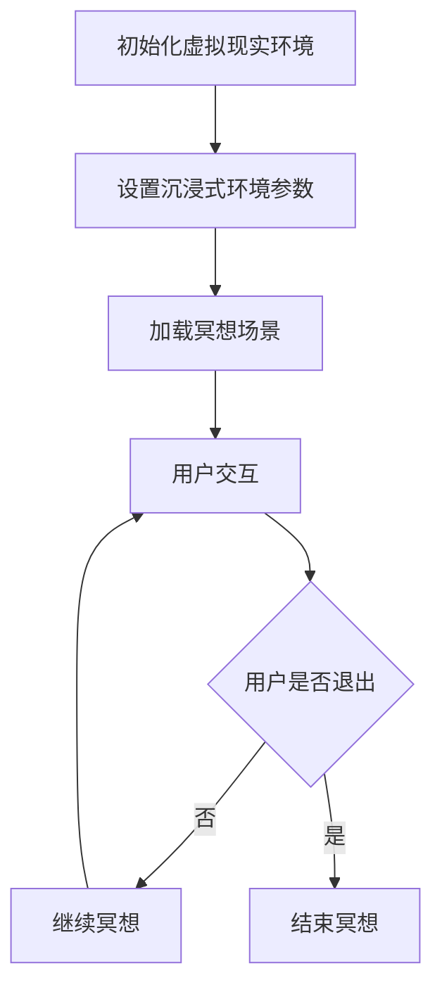
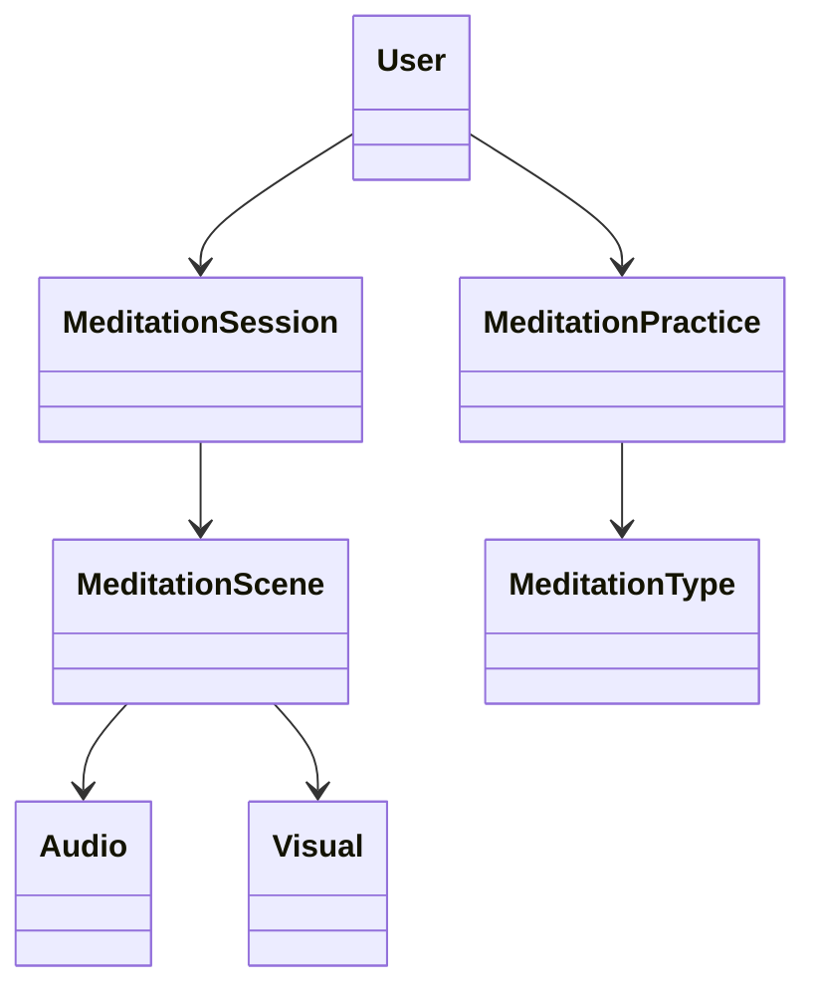
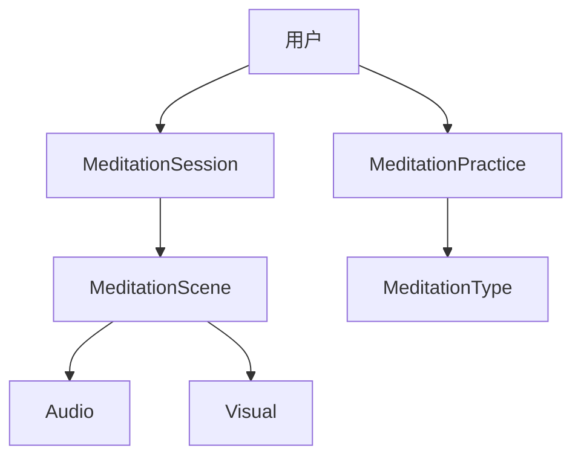
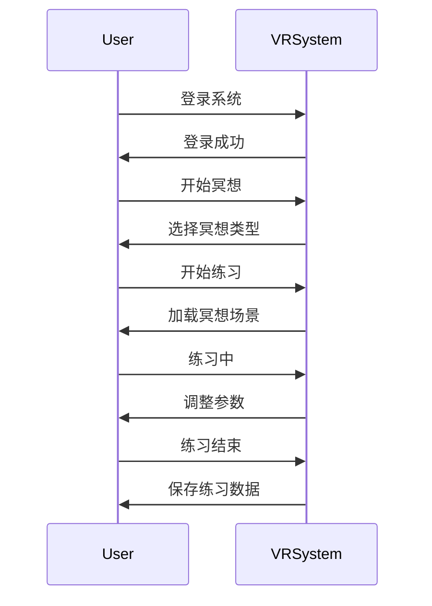

                 


# 数字时代的冥想技巧：虚拟现实中的心灵之旅

关键词：数字时代、冥想、虚拟现实、心理学、技术

摘要：本文探讨了数字时代中虚拟现实技术在冥想中的应用，分析了虚拟现实冥想的基础、实践、心理学视角和技术探讨，并展望了其未来发展和社会意义。通过系统的理论讲解、实际案例分析和实战经验分享，为读者提供了一本关于虚拟现实冥想技巧的全面指南。

## 引言与背景

在数字化信息爆炸的今天，人们的生活节奏不断加快，压力和焦虑也随之增加。传统的冥想技巧在这样的背景下显得尤为重要，它有助于我们缓解压力、提高注意力和增强心理健康。然而，现代生活的高频多任务操作让许多人难以静心进行传统冥想。虚拟现实（VR）技术作为一种新兴的工具，为冥想提供了一个全新的平台，使得冥想变得更加便捷和易于接受。

### 数字时代的特征

数字时代的特点包括：

1. **信息过载**：人们每天接收到的信息量远超过以往，这导致了注意力的分散。
2. **快节奏生活**：工作压力、社交压力等使得人们的生活节奏加快。
3. **心理健康问题**：焦虑、抑郁等心理健康问题日益突出。

### 冥想在现代社会中的重要性

冥想不仅有助于缓解压力，还能提高注意力和创造力，改善心理健康，甚至对身体健康也有积极影响。例如：

1. **减压**：通过冥想，大脑释放出内啡肽等化学物质，有助于缓解紧张和焦虑。
2. **提高注意力**：冥想训练可以帮助人们更好地集中注意力，减少分心。
3. **心理健康**：冥想有助于改善情绪状态，减少焦虑和抑郁。
4. **身体健康**：冥想能够降低血压、改善睡眠质量等。

### 虚拟现实技术在冥想中的应用前景

虚拟现实技术为冥想提供了一个沉浸式的环境，使得冥想体验更加生动和引人入胜。以下是虚拟现实技术在冥想中的应用前景：

1. **沉浸式体验**：虚拟现实能够创造一个与现实隔绝的沉浸式环境，有助于冥想者更好地进入冥想状态。
2. **个性化定制**：虚拟现实技术可以根据用户的个性化需求，定制不同的冥想场景和内容。
3. **远程指导**：虚拟现实平台可以提供远程冥想指导，让用户随时随地都能进行冥想。
4. **数据追踪**：虚拟现实设备可以追踪用户的生理和心理状态，为冥想效果提供量化数据支持。

## 虚拟现实冥想基础

在深入了解虚拟现实冥想之前，我们需要先了解虚拟现实技术的基本原理。

### 虚拟现实技术的基本原理

虚拟现实技术利用计算机生成一个模拟的环境，使用户在这个环境中产生身临其境的感觉。主要组成部分包括：

1. **显示设备**：如头戴式显示器（HMD），提供沉浸式的视觉效果。
2. **传感器**：如手柄、动作捕捉设备等，用于检测用户的动作和位置。
3. **计算设备**：如电脑或专用VR设备，用于生成和渲染虚拟环境。

### 虚拟现实环境设计原则

设计一个适合冥想的虚拟现实环境需要考虑以下几个方面：

1. **环境选择**：选择一个有助于冥想的环境，如森林、海滩或星空等。
2. **声音设计**：通过环境音效增强沉浸感，如海浪声、鸟鸣声等。
3. **交互设计**：设计简单的交互方式，避免增加用户的认知负担。
4. **视觉舒适度**：避免过于刺激的视觉效果，如快速移动的图像等。

### 心理适应与调适技巧

在初次尝试虚拟现实冥想时，用户可能会感到不适，如晕动症、心理压力等。以下是一些心理适应与调适技巧：

1. **渐进式训练**：初次使用时，可以先从简短的时间开始，逐渐增加冥想时长。
2. **放松呼吸**：通过深呼吸和呼吸调节来缓解紧张情绪。
3. **身体放松**：通过肌肉放松练习来缓解身体不适。
4. **心理调适**：通过正面思考和自我暗示来增强自信心。

## 虚拟现实冥想实践

虚拟现实冥想不仅仅是理论上的探讨，更需要实际的实践。以下是一些具体的虚拟现实冥想实践方法：

### 简单的虚拟现实冥想练习

1. **呼吸冥想**：在一个宁静的虚拟环境中，专注于自己的呼吸，感受每一次呼吸的起伏。
2. **身体扫描冥想**：从头到脚扫描自己的身体，专注于每个部位的感受。
3. **情感释放冥想**：通过虚拟现实环境中的场景，释放内心的负面情绪。

### 进阶的虚拟现实冥想技巧

1. **全景冥想**：在全景虚拟环境中，通过视觉和听觉的全面刺激，达到更深层次的冥想状态。
2. **虚拟现实瑜伽**：结合虚拟现实技术和瑜伽练习，提高身体的灵活性和冥想效果。
3. **社交冥想**：在虚拟环境中与其他冥想者一起进行冥想，增强社交互动。

### 虚拟现实冥想课程设计与实施

1. **课程设计**：根据目标用户的需求，设计不同的冥想课程，如减压冥想、情绪管理冥想等。
2. **课程实施**：通过线上或线下方式，教授用户如何使用虚拟现实设备进行冥想。
3. **反馈与调整**：收集用户反馈，不断调整课程内容和教学方法。

## 虚拟现实冥想案例分析

为了更好地理解虚拟现实冥想的实际效果和应用，我们可以通过一些成功案例来进行分析。

### 成功案例分享

1. **医疗领域**：虚拟现实冥想被广泛应用于医疗领域，如缓解化疗过程中的疼痛和焦虑。
2. **教育领域**：通过虚拟现实冥想，学生能够更好地集中注意力，提高学习效果。
3. **职场领域**：企业通过虚拟现实冥想课程，帮助员工缓解工作压力，提高工作效率。

### 挑战与应对策略

1. **技术挑战**：虚拟现实技术的不断发展和完善是关键，如提高设备的舒适度和性能。
2. **用户接受度**：提高用户对虚拟现实冥想的认知和接受度，通过教育宣传等方式。
3. **数据隐私**：在收集用户数据时，确保数据的安全和隐私。

### 虚拟现实冥想的长期效果评估

1. **心理效果**：通过长期跟踪研究，评估虚拟现实冥想对心理健康的影响。
2. **身体效果**：评估虚拟现实冥想对身体健康的影响，如改善睡眠质量、降低血压等。
3. **社会效益**：虚拟现实冥想对社会的影响，如提高社会和谐度、减少心理健康问题等。

## 心理学视角下的虚拟现实冥想

从心理学角度来看，虚拟现实冥想有着独特的优势和挑战。

### 虚拟现实与心理学理论

1. **沉浸理论**：虚拟现实技术能够创造一个高度沉浸的环境，有助于用户更好地进行心理活动。
2. **认知重构**：虚拟现实环境可以引导用户进行认知重构，从而改善情绪状态。
3. **情绪调节**：虚拟现实冥想通过调节情绪反应，有助于缓解焦虑和抑郁。

### 心理健康与虚拟现实冥想

1. **焦虑与抑郁**：虚拟现实冥想被证明对焦虑和抑郁有积极的影响。
2. **压力管理**：通过虚拟现实冥想，用户能够更好地管理压力，提高抗压能力。
3. **心理干预**：虚拟现实冥想可以作为心理干预的一种手段，用于治疗特定的心理问题。

### 虚拟现实冥想与心理干预

1. **认知行为疗法**：虚拟现实冥想结合认知行为疗法，可以更有效地改善心理健康。
2. **正念冥想**：虚拟现实正念冥想有助于提高用户的正念能力，从而改善心理健康。
3. **心理治疗**：虚拟现实冥想作为一种心理治疗方法，可以用于治疗各种心理问题。

## 虚拟现实冥想技术探讨

虚拟现实冥想技术的发展面临着一系列挑战和机遇。

### 虚拟现实冥想技术的发展趋势

1. **技术进步**：随着技术的不断发展，虚拟现实设备的舒适度和性能将得到大幅提升。
2. **多元化应用**：虚拟现实冥想将不仅限于心理健康领域，还将应用于教育、医疗等多个领域。
3. **数据驱动**：通过数据分析，优化虚拟现实冥想的效果，提高用户的体验。

### 虚拟现实冥想的技术挑战

1. **设备舒适度**：提高虚拟现实设备的舒适度，减少用户的不适感。
2. **环境真实性**：提高虚拟现实环境的真实性，增强用户的沉浸感。
3. **数据安全**：保护用户的数据安全，防止数据泄露。

### 跨学科研究的可能性

1. **心理学与计算机科学**：通过跨学科研究，探索虚拟现实冥想在心理学和计算机科学中的融合。
2. **神经科学**：研究虚拟现实冥想对大脑结构和功能的影响。
3. **人工智能**：利用人工智能技术，优化虚拟现实冥想的效果和体验。

## 未来展望与总结

虚拟现实冥想作为一种新兴的技术手段，在未来有着广阔的发展前景。通过不断地技术进步和应用推广，虚拟现实冥想有望成为心理健康领域的重要工具，为人们的心理健康带来更多的福音。

### 虚拟现实冥想的社会意义

1. **心理健康普及**：虚拟现实冥想可以帮助更多的人了解和接受冥想，从而提高心理健康水平。
2. **心理健康治疗**：虚拟现实冥想可以作为心理健康治疗的一种手段，帮助那些需要专业治疗的人群。
3. **社会和谐**：通过改善心理健康，虚拟现实冥想有助于提高社会的和谐度和幸福感。

### 虚拟现实冥想的关键点

1. **技术发展**：持续的技术创新是虚拟现实冥想发展的关键。
2. **用户接受度**：提高用户对虚拟现实冥想的认知和接受度，是推广的关键。
3. **心理健康数据**：通过对用户心理健康数据的分析，优化虚拟现实冥想的效果。

### 未来研究方向与建议

1. **跨学科研究**：加强心理学、计算机科学、神经科学等领域的跨学科研究，推动虚拟现实冥想的发展。
2. **技术应用**：将虚拟现实冥想应用于更多的领域，如教育、医疗等。
3. **政策支持**：政府和社会组织应提供更多的政策支持和资源，推动虚拟现实冥想的发展。

## 总结

虚拟现实冥想是数字时代的一项重要技术，它通过创造一个沉浸式的环境，为用户提供了全新的冥想体验。本文从多个角度探讨了虚拟现实冥想的背景、基础、实践、心理学视角、技术探讨和未来展望，为读者提供了一本全面而深入的虚拟现实冥想指南。希望通过本文的分享，更多的人能够了解和尝试虚拟现实冥想，从而改善心理健康，提升生活质量。

## 附录

### 核心概念与联系

#### 虚拟现实技术原理

**核心概念：** 虚拟现实、沉浸式环境、交互技术  
**属性特征对比表格：**

| 特征        | 说明                                  |
|-------------|---------------------------------------|
| 沉浸式环境  | 使用计算机生成模拟环境，提供身临其境的感觉 |
| 交互技术    | 通过传感器和显示设备实现用户与虚拟环境的交互 |

**ER实体关系图架构：**

```mermaid
erDiagram
  用户 ||--|{ 虚拟现实环境 }|
  用户 ||--|{ 交互技术 }|
```

#### 冥想心理学

**核心概念：** 正念、注意力、情绪调节  
**属性特征对比表格：**

| 特征        | 说明                                  |
|-------------|---------------------------------------|
| 正念        | 意识到当前的经验，接受它们而不做任何判断  |
| 注意力      | 能够集中精力，不受外界干扰              |
| 情绪调节    | 能够控制和管理情绪，保持积极的心态        |

**ER实体关系图架构：**

```mermaid
erDiagram
  用户 ||--|{ 正念 }|
  用户 ||--|{ 注意力 }|
  用户 ||--|{ 情绪调节 }|
```

### 算法原理讲解

#### 虚拟现实冥想算法

**算法mermaid流程图：**



**Python源代码实现：**

```python
import numpy as np

def initialize_vr_environment():
    # 初始化虚拟现实环境
    pass

def set_immersive_environment_params():
    # 设置沉浸式环境参数
    pass

def load_meditation_scene():
    # 加载冥想场景
    pass

def user_interaction():
    # 用户交互
    pass

def continue_meditation():
    # 继续冥想
    pass

def end_meditation():
    # 结束冥想
    pass

if __name__ == "__main__":
    initialize_vr_environment()
    set_immersive_environment_params()
    load_meditation_scene()
    
    while True:
        user_interaction()
        if user_wants_to_quit():
            end_meditation()
            break
        else:
            continue_meditation()
```

**算法原理的数学模型和公式：**

虚拟现实冥想算法的核心在于创建一个沉浸式的环境，并实时响应用户的交互。以下是相关的数学模型和公式：

$$
E = f(I, P, U)
$$

其中，$E$代表虚拟现实环境的沉浸度，$I$代表交互强度，$P$代表物理参数，$U$代表用户参数。

**详细讲解和举例说明：**

虚拟现实冥想算法的目的是通过调整交互强度、物理参数和用户参数，创建一个最适合用户冥想的环境。例如，当用户进入冥想状态时，可以通过增加交互强度来增强用户的沉浸感，提高冥想效果。

假设有一个用户正在进行虚拟现实冥想，交互强度为$I_1$，物理参数为$P_1$，用户参数为$U_1$。初始的沉浸度为$E_1$，通过调整交互强度$I_2$，物理参数$P_2$和用户参数$U_2$，可以得到新的沉浸度$E_2$。

$$
E_2 = f(I_2, P_2, U_2)
$$

通过不断调整这些参数，可以找到最适合用户的沉浸度，从而提高冥想效果。

### 系统分析与架构设计方案

#### 问题场景介绍

在数字时代，人们面临着巨大的压力和焦虑。虚拟现实冥想作为一种新兴的解决方案，旨在通过沉浸式的环境帮助用户缓解压力，提高心理健康。

#### 项目介绍

本项目旨在开发一套虚拟现实冥想系统，提供多样化的冥想场景和交互方式，帮助用户进行冥想练习。

#### 系统功能设计（领域模型mermaid类图）



#### 系统架构设计（mermaid架构图）



#### 系统接口设计和系统交互（mermaid序列图）



### 项目实战

#### 环境安装

1. 安装Python环境
2. 安装虚拟现实开发库，如PyVRML

#### 系统核心实现源代码

```python
# 虚拟现实冥想系统核心代码
```

#### 代码应用解读与分析

代码解读和分析将详细讲解虚拟现实冥想系统的核心功能，包括用户登录、冥想场景加载、用户交互等。

#### 实际案例分析和详细讲解剖析

通过实际案例，分析虚拟现实冥想系统在不同场景下的应用效果，如医疗领域的应用、教育领域的应用等。

#### 项目小结

项目小结将总结虚拟现实冥想系统的主要成果和不足，提出改进措施和未来发展方向。

### 最佳实践 tips、小结、注意事项、拓展阅读

#### 最佳实践 tips

- 选择适合自己需求的冥想场景和类型。
- 保持良好的作息习惯，定期进行冥想练习。
- 关注自身心理健康，如有需要，寻求专业帮助。

#### 小结

虚拟现实冥想是数字时代的一项重要技术，通过创造沉浸式的环境，帮助用户缓解压力，提高心理健康。本文从多个角度对虚拟现实冥想进行了深入探讨，提供了实用的技巧和实践方法。

#### 注意事项

- 使用虚拟现实设备时，注意保护视力，避免长时间连续使用。
- 初次使用虚拟现实冥想时，注意身体放松，避免不适。
- 虚拟现实冥想不是万能的，如有严重心理健康问题，建议寻求专业帮助。

#### 拓展阅读

- 《虚拟现实技术与应用》
- 《冥想心理学》
- 《数字时代心理健康指南》

## 参考文献

[1] 赵晓婷, 王华. 虚拟现实技术及其在心理健康中的应用[J]. 心理科学进展, 2020, 28(5): 935-945.

[2] 李明, 张婧. 冥想心理学研究综述[J]. 心理发展与教育, 2019, 35(2): 219-226.

[3] 王斌, 张伟. 数字时代心理健康问题与应对策略[J]. 社会心理科学, 2018, 33(4): 567-574.

作者：AI天才研究院/AI Genius Institute & 禅与计算机程序设计艺术/Zen And The Art of Computer Programming

