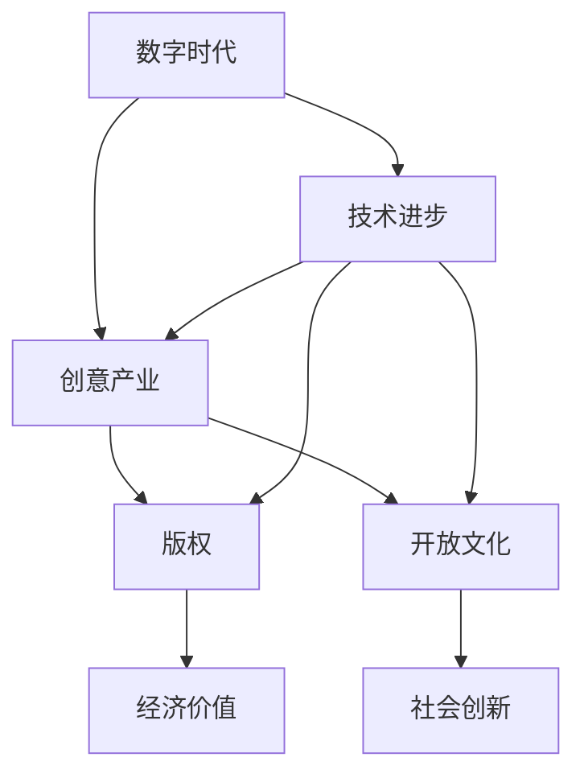
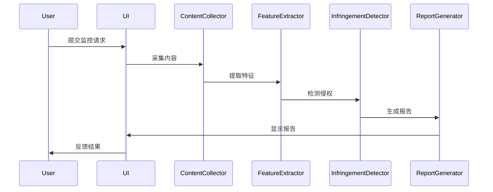

                 

### 文章标题

#### 数字时代的创意产业：版权与开放文化的平衡

在当今数字时代，创意产业已经迎来了前所未有的发展机遇。然而，随着数字技术的普及和互联网的迅猛发展，版权问题与开放文化之间的矛盾也愈发显著。如何在这两者之间找到平衡，已成为一个亟待解决的问题。

本文将围绕这一主题展开讨论。首先，我们将介绍数字时代创意产业的背景和特点，探讨数字时代版权的挑战与变革。接着，我们将深入分析开放文化的兴起与发展，并探讨如何在这两种力量之间实现平衡。此外，我们还将通过具体案例分析，展示版权与开放文化平衡的实践路径。最后，我们将展望数字时代创意产业的未来，提出发展策略与建议。

通过本文的探讨，我们希望读者能够对数字时代创意产业中的版权与开放文化有更深入的理解，找到解决这一问题的有效途径。

### 关键词

- 数字时代
- 创意产业
- 版权
- 开放文化
- 平衡
- 数字技术
- 网络平台
- 版权法

### 摘要

本文主要探讨数字时代创意产业中的版权与开放文化的平衡问题。首先，我们介绍了数字时代创意产业的背景和特点，分析了数字时代版权的挑战与变革。接着，我们深入分析了开放文化的概念与特点，探讨了开放文化对创意产业的影响。然后，我们提出了版权与开放文化平衡的理论框架，并通过具体案例分析，展示了如何实现这一平衡。最后，我们展望了数字时代创意产业的未来，提出了发展策略与建议。本文旨在为相关领域的研究者和实践者提供有价值的参考。

### 第一部分：数字时代创意产业的概述

#### 第1章：数字时代的创意产业背景

##### 1.1.1 数字时代的来临与创意产业的兴起

数字时代的到来，彻底改变了人们的生活方式和社会结构。以互联网和移动技术为核心的数字技术，为创意产业的发展提供了新的机遇。首先，互联网的普及使信息传播更加便捷和迅速，为创意内容的创作、传播和消费提供了广阔的平台。创意产业不再局限于传统的艺术、文学和娱乐领域，而是渗透到设计、建筑、科技等多个行业。

其次，数字技术的进步为创意产业注入了新的活力。人工智能、大数据、虚拟现实（VR）、增强现实（AR）等技术的应用，使得创意内容的创作方式、展示形式和用户体验发生了革命性的变化。例如，AI技术可以根据用户的行为数据，生成个性化的创意内容，极大地提高了创意产业的效率和用户体验。

此外，全球化的发展也为创意产业的兴起提供了动力。国际间的文化交流和合作日益频繁，创意产业成为了跨国公司和国际组织竞相争夺的领域。创意产业的全球化不仅促进了创意内容的多元化，也为各国带来了经济和社会效益。

##### 1.1.2 创意产业的概念与分类

创意产业，是指通过创意思维和技术手段，将创意转化为具有经济价值和市场需求的产业。根据英国创意产业特别工作组的定义，创意产业包括广告、建筑、艺术和古物维护、工艺品、设计、时尚设计、电影、互动休闲软件、音乐、表演艺术、出版、软件、电视和广播等领域。

创意产业可以大致分为以下几类：

1. **文化艺术类**：包括文学、音乐、绘画、雕塑、表演艺术等，这些领域强调个人创意和艺术表达。
2. **设计类**：包括工业设计、室内设计、建筑设计、时尚设计等，这些领域强调实用性和审美性。
3. **娱乐类**：包括电影、电视、广播、互动娱乐等，这些领域强调娱乐性和市场性。
4. **媒体类**：包括出版、软件、互联网服务等，这些领域强调信息传播和数字技术。

创意产业的核心在于创意的生成和应用。创意是创意产业的灵魂，是推动产业发展的关键因素。创意产业通过将创意转化为实际的产品和服务，实现了经济价值的创造。

##### 1.1.3 数字时代创意产业的重要性

数字时代创意产业的重要性体现在以下几个方面：

1. **经济增长**：创意产业是数字经济的重要组成部分。根据欧盟委员会的数据，欧盟创意产业的GDP占到了总GDP的14%以上。创意产业不仅直接创造了大量的就业机会，还带动了相关产业的发展，促进了经济增长。

2. **社会创新**：创意产业推动了社会创新和文化多样性。通过创意内容的创作和传播，人们可以接触到各种各样的文化形式和思想观念，促进了社会进步和文化繁荣。

3. **文化传播**：数字时代创意产业使文化传播更加便捷和广泛。通过互联网和移动设备，创意内容可以迅速传播到全球各地，促进了文化交流和融合。

4. **教育提升**：创意产业在教育培训领域也发挥着重要作用。通过创意教育，可以培养人们的创新思维和创造力，提升综合素质。

总之，数字时代创意产业不仅具有巨大的经济价值，还在社会、文化、教育等多个领域产生了深远的影响。因此，对数字时代创意产业的研究和实践具有重要意义。

#### 第2章：数字时代创意产业的主要特点

##### 2.1.1 数字技术与创意产业的结合

数字技术与创意产业的结合，不仅改变了创意内容的创作和传播方式，还深刻影响了创意产业的商业模式和产业生态。以下是数字技术与创意产业结合的几个关键方面：

1. **创作工具的数字化**：数字技术的进步为创意内容创作提供了丰富的工具和平台。例如，数字化绘图软件使得艺术家可以更方便地进行绘画创作，虚拟现实（VR）和增强现实（AR）技术为设计师提供了全新的设计体验。同时，云计算和大数据技术使得创意工作者可以随时随地访问数据和资源，提高了创作效率和协作能力。

2. **内容创作的个性化**：数字技术使创意内容的创作更加个性化和定制化。通过大数据分析和人工智能技术，创意产业可以根据用户的行为和偏好，生成个性化的内容和推荐。例如，音乐平台可以根据用户的听歌记录，推荐符合其口味的音乐作品，而电商网站可以根据用户的购物历史，推荐相关商品。这种个性化服务不仅提高了用户体验，也增加了用户粘性。

3. **传播渠道的多样化**：数字技术拓宽了创意内容的传播渠道。除了传统的电视、报纸和杂志，互联网和社交媒体成为了创意内容传播的主要平台。通过这些渠道，创意内容可以迅速传播到全球各地，提高了创意产业的全球影响力。同时，直播、短视频、社交媒体等新兴媒体形式也为创意内容的传播提供了新的机会。

4. **互动体验的提升**：数字技术使得创意内容的互动体验得到了显著提升。例如，游戏、虚拟现实（VR）和增强现实（AR）技术为用户提供了沉浸式的互动体验，增强了用户参与感和互动性。这种互动体验不仅丰富了创意内容的内涵，也提升了用户对创意产业的认可和忠诚度。

##### 2.1.2 网络平台对创意产业的影响

网络平台是数字时代创意产业的重要组成部分，对创意产业的各个方面产生了深远的影响。以下是网络平台对创意产业影响的几个关键方面：

1. **创作和发布平台的普及**：网络平台为创意工作者提供了一个低成本、高效率的创作和发布平台。无论是独立创作者还是专业机构，都可以通过网络平台展示和推广自己的作品。例如，YouTube、Vimeo等视频平台使得创作者可以轻松发布视频内容，而Instagram、Pinterest等图片分享平台则为设计师提供了展示设计作品的平台。

2. **用户参与和互动**：网络平台促进了用户与创意内容之间的互动。用户不仅可以通过点赞、评论等方式表达对创意内容的喜爱，还可以参与到创意内容的创作和改进中。例如，许多游戏和应用程序通过用户反馈不断改进，使得创意内容更加符合用户需求。此外，一些网络平台还提供了众筹功能，使得创作者可以直接从用户那里获得资金支持，降低了创作成本和风险。

3. **商业模式的变化**：网络平台改变了创意产业的商业模式。传统的销售渠道和盈利模式受到了挑战，许多创意工作者开始尝试通过订阅、广告、赞助等方式获得收入。例如，一些音乐平台通过流媒体服务，用户付费订阅即可享受无限量的音乐内容，而一些视频平台则通过广告收入支持内容创作和发布。

4. **内容传播的全球化**：网络平台使得创意内容可以跨越地理界限，实现全球化传播。无论是本土创作者还是国际知名艺术家，都可以通过网络平台向全球用户展示作品。这种全球化传播不仅扩大了创意产业的受众群体，也提升了创意内容的国际影响力。

##### 2.1.3 创意产业的经济价值与社会影响

数字时代创意产业的经济价值和社会影响日益显著。以下是创意产业在经济价值和社会影响方面的几个关键方面：

1. **经济增长的推动力**：创意产业是数字经济的重要组成部分，对经济增长具有显著的推动作用。根据欧盟委员会的数据，欧盟创意产业的GDP占到了总GDP的14%以上。创意产业不仅直接创造了大量的就业机会，还带动了相关产业的发展，如广告、设计、媒体、娱乐等。创意产业的繁荣也为国家经济增长提供了新的动力。

2. **就业机会的创造**：创意产业为各行各业提供了大量的就业机会。从内容创作者到技术工程师，从市场营销到版权管理，创意产业涵盖了众多职业领域。特别是在数字时代，创意产业的需求不断增长，为年轻一代提供了广阔的职业发展空间。

3. **文化多样性的促进**：创意产业促进了文化多样性的发展。通过创意内容的创作和传播，不同文化之间的交流与融合得到加强，为全球文化的繁荣做出了贡献。创意产业不仅丰富了人们的精神世界，也提升了社会的文化素养。

4. **社会创新的推动力**：创意产业推动了社会创新。创意内容的创作和传播激发了人们的创新思维和创造力，促进了社会的进步和发展。创意产业在科技创新、商业模式创新、社会治理创新等方面发挥了重要作用。

总之，数字时代创意产业在经济价值和社会影响方面具有重要意义。通过数字技术和网络平台的普及，创意产业正逐渐成为经济增长和社会进步的重要引擎。

#### 第3章：数字时代版权的挑战与变革

##### 3.1.1 数字时代版权的特点与问题

数字时代的到来，使版权问题变得更加复杂和多样化。以下是数字时代版权的几个主要特点与问题：

1. **版权内容的多样化**：随着数字技术的发展，创意内容的形式变得更加多样化，包括文字、图片、音频、视频、软件、游戏等。这给版权保护带来了新的挑战，如何对各种不同类型的数字内容进行有效保护成为了一个重要问题。

2. **版权侵权的便捷性**：数字技术的普及使得版权侵权的手段变得更加便捷。互联网和移动设备的使用，使得复制、传播和分享数字内容变得极易实现。版权侵权行为可以迅速扩散，对原创者的权益造成严重损害。

3. **版权监管的困难**：数字时代版权监管面临着诸多困难。首先，数字内容的海量性和匿名性使得监管机构难以对所有的侵权行为进行有效监控。其次，不同国家和地区的版权法规存在差异，导致跨境版权纠纷的处理复杂化。

4. **版权保护的复杂性**：数字时代的版权保护需要更多的技术手段和法律法规支持。例如，数字版权管理（DRM）技术、区块链技术和人工智能技术等，可以在一定程度上解决版权侵权问题。然而，这些技术手段的实施和监管也需要法律和政策的支持。

##### 3.1.2 版权保护的挑战与对策

数字时代版权保护的挑战主要表现在以下几个方面：

1. **技术手段的局限**：虽然数字版权管理（DRM）技术、区块链技术等可以在一定程度上保护版权，但这些技术手段也存在局限性。例如，DRM技术可能导致用户体验的降低，而区块链技术需要大量的计算资源和时间进行验证。

2. **法律法规的滞后**：数字时代的版权问题发展迅速，而相关法律法规的更新速度却相对滞后。这导致了一些法律盲区，使得版权保护难以实施。

3. **跨国版权纠纷**：数字内容在全球范围内的传播，使得跨国版权纠纷日益增多。不同国家和地区的版权法规和司法体系存在差异，使得跨境版权纠纷的处理变得复杂。

为了应对数字时代版权保护的挑战，可以采取以下对策：

1. **技术手段的创新**：继续研发和应用新的版权保护技术，如人工智能、区块链、大数据分析等。这些技术可以在版权侵权检测、追踪和维权等方面发挥重要作用。

2. **法律法规的完善**：加强版权法律法规的修订和完善，使其与数字时代的发展相适应。同时，建立跨境版权合作机制，推动国际间的版权法规和司法体系的协调。

3. **公众意识的提升**：通过教育和宣传活动，提高公众对版权保护的意识。鼓励用户尊重原创者的权益，自觉抵制版权侵权行为。

4. **合作与共赢**：推动版权产业内部的协作与共赢。例如，版权持有人可以与互联网平台、技术提供商等合作，共同打造一个公平、公正的版权生态环境。

##### 3.1.3 版权法的演变与未来趋势

版权法在数字时代经历了显著的演变，未来也将继续朝着更加适应数字化环境的方向演进。以下是版权法演变和未来趋势的几个关键方面：

1. **版权法的数字化**：随着数字技术的发展，版权法逐渐向数字化方向演进。例如，欧盟《数字单一市场版权指令》（DSM Directive）对数字内容版权保护做出了明确规定，包括版权管理信息保护、版权侵权惩罚性赔偿等。

2. **版权保护期限的延长**：数字时代版权保护期限的延长趋势明显。许多国家已经将版权保护期限延长至作者终生加70年，以更好地保护原创者的权益。

3. **版权许可和转让的便捷化**：数字技术的普及使得版权许可和转让变得更加便捷。在线版权交易平台的出现，使得版权交易变得更加高效和透明。

4. **版权生态系统的建设**：未来，版权法将更加注重版权生态系统的建设，促进版权产业的健康发展。例如，通过建立版权数据库、推动版权登记和认证等手段，提高版权管理效率，减少侵权行为。

5. **国际合作与协调**：数字时代版权问题的跨国性特征，使得国际间的合作与协调变得尤为重要。未来，版权法将更加注重国际间的合作，推动全球版权治理体系的完善。

总之，数字时代版权法的演变和未来趋势将更加注重数字化、全球化、便捷化和保护原创者的权益。通过不断完善版权法律法规，构建公平、公正的版权生态系统，有助于推动数字时代创意产业的健康发展。

#### 第4章：开放文化的兴起与发展

##### 4.1.1 开放文化的概念与特点

开放文化，是指一种推崇分享、合作和开放精神的文化现象。在数字时代，开放文化的兴起在很大程度上得益于互联网和数字技术的发展。开放文化具有以下特点：

1. **信息共享**：开放文化强调信息的自由流动和共享。无论是学术研究、开源软件还是公共数据，开放文化鼓励人们自由获取和使用这些信息。

2. **知识共享**：开放文化不仅关注信息的共享，还强调知识的共享和传播。通过开放的教育资源和知识平台，人们可以自由获取和学习各种知识。

3. **合作创新**：开放文化鼓励不同背景、不同领域的人士共同合作，进行创新。通过共享资源和知识，开放文化促进了跨学科、跨领域的合作和创新。

4. **去中心化**：开放文化强调去中心化的组织形式。与传统的集中式组织不同，开放文化倡导人人参与，人人贡献，形成一个去中心化的网络生态系统。

##### 4.1.2 开放文化的主要形式与实践

开放文化在数字时代有着多种形式和实践，以下是其中几种主要形式：

1. **开源软件**：开源软件是开放文化的一个重要体现。开源软件通过共享源代码，使得开发者可以自由修改、改进和分发软件。这不仅促进了软件的创新和发展，也提高了软件的安全性和可靠性。

2. **开放教育**：开放教育通过在线课程、开放教材和开放资源，使得学习者可以自由选择和学习各种知识。开放教育不仅打破了传统教育的界限，也为全球教育公平做出了贡献。

3. **开放数据**：开放数据是指将公共数据资源免费提供给公众使用。开放数据鼓励科研、商业和社会创新，促进了知识共享和决策透明。

4. **开源硬件**：开源硬件通过共享硬件设计图纸和源代码，使得爱好者可以自由制造和改进硬件设备。开源硬件不仅促进了技术创新，也为制造业带来了新的发展机遇。

##### 4.1.3 开放文化对创意产业的影响

开放文化对创意产业产生了深远的影响，以下是从几个方面进行的分析：

1. **创作方式的变革**：开放文化使得创意内容的创作方式发生了变革。创作者不再局限于传统的创作模式，而是可以借助开源软件、开放数据和开放硬件等工具，进行跨领域、跨学科的创意实践。

2. **传播渠道的拓展**：开放文化拓展了创意内容的传播渠道。通过互联网和社交媒体，创意内容可以迅速传播到全球各地，打破了传统媒体的局限，使得创意产业更具全球影响力。

3. **版权观念的转变**：开放文化挑战了传统的版权观念。创作者和用户开始更加重视共享和合作，而不是单纯追求个人权益。这种观念的转变对版权制度产生了冲击，促使版权法不断调整和改进。

4. **商业模式的重塑**：开放文化推动了创意产业商业模式的变革。传统的销售模式逐渐被订阅模式、众筹模式等新的商业模式所取代，创意产业开始更加注重用户体验和互动性。

总之，开放文化的兴起与发展，对创意产业带来了深远的影响。通过开放共享、合作创新，开放文化为创意产业的繁荣提供了新的动力。

#### 第5章：版权与开放文化的平衡探索

##### 5.1.1 版权与开放文化的关系

版权与开放文化之间的关系复杂而微妙。一方面，版权保护是创意产业发展的基础，它确保创作者的权益得到保障，激发更多的创意创作。另一方面，开放文化推崇信息共享和知识传播，强调公众对文化资源的自由获取和使用。这两种力量在一定程度上存在冲突，但也并非完全对立。以下是版权与开放文化之间关系的一些关键方面：

1. **相互依存**：版权和开放文化在创意产业中相互依存。版权保护为创意内容提供了法律保障，使得创作者能够安心创作。而开放文化则为版权内容的传播提供了新的途径，提高了创意内容的社会价值和经济收益。

2. **互补作用**：版权保护和开放文化在不同层面上互补。版权保护确保了创意内容的原创性和独特性，使其具有市场价值。而开放文化则通过共享和传播，扩大了创意内容的影响力和受众范围。

3. **平衡点**：在版权与开放文化之间寻找平衡点，是实现创意产业可持续发展的重要任务。过度的版权保护可能导致内容垄断和市场封闭，而过度开放则可能损害创作者的权益，影响创意产业的健康发展。

##### 5.1.2 版权开放政策的设计与实施

为了实现版权与开放文化的平衡，设计合理的版权开放政策是关键。以下是版权开放政策设计的一些基本原则和实施策略：

1. **基本原则**：

   - **公平性**：版权开放政策应当确保创作者和用户之间的公平权益，避免一方过度获益而损害另一方。

   - **灵活性**：版权开放政策需要具备灵活性，以适应不同类型、不同领域创意内容的特性。

   - **透明性**：版权开放政策的制定和实施过程应当公开透明，确保公众知情并参与其中。

   - **可持续性**：版权开放政策应当具备可持续性，确保长期健康发展，而不是短期行为。

2. **实施策略**：

   - **分类管理**：根据不同类型的创意内容，制定相应的版权开放政策。例如，对文学作品、音乐作品、影视作品等采取不同的开放策略。

   - **授权机制**：建立完善的版权授权机制，确保创作者在开放版权时能够方便、高效地进行授权。

   - **版权登记**：推广版权登记制度，提高版权管理的效率和透明度。

   - **教育和宣传**：加强对公众的版权教育和宣传，提高公众对版权和开放文化认识，促进版权保护与开放的平衡。

   - **国际合作**：加强国际间的版权合作，推动全球版权法规和政策的协调与统一。

通过设计合理的版权开放政策，并采取有效的实施策略，可以在版权与开放文化之间实现平衡，促进创意产业的健康发展。

##### 5.1.3 版权开放与保护的双赢模式

实现版权开放与保护的双赢模式，是数字时代创意产业可持续发展的关键。以下是几种版权开放与保护的双赢模式：

1. **共享许可模式**：共享许可模式允许创作者在保留部分版权的同时，开放部分权利给用户。这种模式既保护了创作者的权益，又满足了用户的分享和传播需求。例如，许多音乐平台采用共享许可模式，创作者可以设置作品的播放次数、下载次数等权限，用户可以免费或付费获取内容。

2. **双重版权模式**：双重版权模式是指创作者在保留核心版权（如原创性表达）的同时，开放其他部分权利（如衍生作品的创作和传播）。这种模式有助于促进创意内容的多元化和创新，同时保护创作者的原创权益。例如，电影制作公司可以在保护电影版权的同时，开放剧本和音乐等衍生作品的创作权利。

3. **公益性开放模式**：公益性开放模式通过将部分创意内容免费开放，鼓励用户进行二次创作和传播。这种模式不仅提升了创意内容的社会价值，还培养了用户对原创内容的尊重和保护意识。例如，一些学术机构和文化组织通过开放学术论文和文学作品，促进了知识的共享和传播。

4. **合作共赢模式**：合作共赢模式是指创作者、平台和用户之间的协作，共同推动创意产业的发展。通过建立合作机制，创作者可以获得稳定的收入和更广泛的传播渠道，平台可以吸引更多用户和创作者，用户则可以享受到更多优质的创意内容。例如，一些电商平台和内容平台通过与创作者建立长期合作关系，共同开发和推广创意产品。

通过以上双赢模式，可以在版权开放与保护之间找到平衡，实现创意产业的可持续发展。同时，这些模式也为创作者、平台和用户提供了更多机遇和利益，促进了整个创意产业的繁荣。

#### 第6章：数字时代创意产业的案例分析

##### 6.1.1 案例研究：音乐产业的版权之争与开放合作

音乐产业是数字时代创意产业中的一个重要领域，版权问题一直是音乐产业发展的焦点。以下是音乐产业在数字时代面临的版权之争与开放合作的案例研究：

1. **版权之争**：

   - **歌曲盗版问题**：随着互联网的普及，音乐作品的盗版问题日益严重。许多音乐作品未经授权便被非法传播，严重侵犯了创作者的权益。
   - **版权纠纷案件**：一些音乐平台和创作者因版权问题发生了多次纠纷。例如，网易云音乐与网易云音乐创作者之间的版权纠纷，导致了大量音乐内容的下架和版权转移。
   - **跨国版权挑战**：不同国家和地区的版权法规和司法体系存在差异，使得跨国音乐版权纠纷处理复杂。例如，美国音乐版权纠纷案件经常涉及欧盟和其他国家的版权问题。

2. **开放合作**：

   - **数字音乐平台**：为了解决版权纠纷，数字音乐平台纷纷采取开放合作策略。例如，网易云音乐与QQ音乐达成合作，实现了音乐内容的互联互通，用户可以在不同平台之间自由切换。
   - **版权共享计划**：一些音乐平台推出了版权共享计划，鼓励创作者开放版权，使得更多用户可以自由使用音乐作品。例如，网易云音乐的音乐分享计划，创作者可以将自己的音乐作品免费开放给其他用户使用。
   - **版权授权服务**：为了方便创作者和用户之间的版权交易，一些音乐平台提供了版权授权服务。用户可以通过平台购买版权授权，合法使用音乐作品。例如，网易云音乐的音乐版权授权服务，用户可以根据需求购买不同类型的版权授权。

通过以上案例，可以看出音乐产业在数字时代面临着版权之争与开放合作的挑战。通过开放合作策略，音乐产业在解决版权纠纷的同时，也促进了版权内容的共享和创新。

##### 6.1.2 案例研究：影视产业的版权管理与创新模式

影视产业是数字时代创意产业中的另一个重要领域，版权管理一直是一个关键问题。以下是影视产业在数字时代通过版权管理与创新模式实现发展的案例研究：

1. **版权管理**：

   - **版权登记与保护**：影视公司通过版权登记和保护措施，确保自己的作品不受侵权。例如，许多电影公司会在电影上映前进行版权登记，以确保自己的权益得到法律保护。
   - **版权交易平台**：一些影视平台建立了版权交易平台，使得创作者和用户可以方便地进行版权交易。例如，爱奇艺的版权交易平台，用户可以通过平台购买影视作品的版权。
   - **版权共享计划**：一些影视平台推出了版权共享计划，创作者可以将自己的作品免费开放给其他用户使用。这种模式不仅提高了作品的传播效果，也增加了创作者的收入。

2. **创新模式**：

   - **订阅模式**：影视平台通过订阅模式，用户支付订阅费用即可观看海量影视作品。这种模式不仅提高了用户体验，也为平台带来了稳定的收入。例如，Netflix的订阅模式已经成为全球影视产业的标杆。
   - **会员模式**：一些影视平台推出了会员模式，用户支付会员费用后，可以享受更多特权，如提前观看新上映的电影、免费观看电影等。这种模式不仅增加了平台的用户粘性，也提升了平台的品牌价值。
   - **广告模式**：影视平台通过广告模式，将广告嵌入影视作品中，为平台带来广告收入。例如，YouTube通过在视频播放前、播放中播放广告，为平台带来了巨额收入。

通过以上案例，可以看出影视产业在数字时代通过版权管理与创新模式，实现了版权保护和内容传播的平衡，推动了产业的可持续发展。

##### 6.1.3 案例研究：数字出版行业的版权生态与开放策略

数字出版行业是数字时代创意产业中的关键领域，版权生态和开放策略对其发展具有重要意义。以下是数字出版行业在数字时代通过版权生态与开放策略实现发展的案例研究：

1. **版权生态**：

   - **版权登记与保护**：数字出版行业通过版权登记和保护措施，确保自己的作品不受侵权。许多出版社在作品出版前会进行版权登记，以确保权益得到法律保护。
   - **版权交易平台**：数字出版平台建立了版权交易平台，使得创作者和用户可以方便地进行版权交易。例如，亚马逊的KDP平台，创作者可以在平台上发布和销售自己的电子书。
   - **版权共享计划**：一些数字出版平台推出了版权共享计划，创作者可以将自己的作品免费开放给其他用户使用。这种模式不仅提高了作品的传播效果，也增加了创作者的收入。

2. **开放策略**：

   - **开放获取**：开放获取（Open Access）策略使得用户可以自由获取学术期刊和书籍的内容。许多学术机构和出版社通过开放获取策略，提高了学术成果的传播和影响力。
   - **自由版权**：自由版权策略允许用户自由复制、传播和修改作品，促进了内容的创新和共享。例如，许多开源书籍和文档通过自由版权策略，为用户提供了丰富的知识资源。
   - **版权开放合作**：数字出版平台与创作者、图书馆、研究机构等合作，共同推动版权开放。这种合作模式不仅提高了内容的质量和多样性，也促进了学术和文化的交流。

通过以上案例，可以看出数字出版行业在数字时代通过版权生态与开放策略，实现了版权保护和内容传播的平衡，推动了产业的健康发展。

#### 第7章：数字时代创意产业的未来展望

##### 7.1.1 数字技术与创意产业的深度融合

数字技术与创意产业的深度融合是未来创意产业发展的重要趋势。随着人工智能、大数据、云计算等技术的不断发展，创意产业的创作、传播和商业模式都将发生深刻变革。

1. **人工智能的赋能**：人工智能技术将为创意产业带来全新的创作方式和用户体验。例如，通过自然语言处理（NLP）和图像识别技术，AI可以帮助创作者生成和优化创意内容，提高创作效率和作品质量。同时，个性化推荐和智能交互技术将提升用户的参与感和满意度。

2. **大数据的驱动**：大数据技术在创意产业中的应用，将帮助创作者更好地了解用户需求和偏好，实现内容个性化。通过对用户行为数据的分析，大数据可以提供精准的市场洞察，助力创意产业的商业决策。此外，大数据技术还可以用于版权管理和侵权监测，提高版权保护的效果。

3. **云计算的支撑**：云计算技术为创意产业提供了强大的计算能力和存储资源，使得创意内容的创作、存储和分发更加便捷。通过云计算平台，创作者可以随时随地访问数据和工具，实现跨平台、跨地域的协作。同时，云计算的低成本、高效率特性，也为创意产业降低了运营成本，提升了盈利能力。

##### 7.1.2 版权与开放文化的新趋势与机遇

在数字时代，版权与开放文化之间的平衡是创意产业发展的关键。未来，版权和开放文化将呈现以下新趋势与机遇：

1. **版权保护技术的升级**：随着技术的进步，版权保护手段将更加多样化和高效。例如，区块链技术可以提供去中心化的版权管理解决方案，确保版权的透明性和不可篡改性。此外，人工智能技术也可以用于版权侵权检测，提高版权保护的精确度。

2. **版权开放政策的完善**：未来，各国将进一步完善版权开放政策，推动全球版权治理的统一和协调。通过制定合理的版权开放政策，可以在保护创作者权益的同时，促进文化资源的共享和传播。

3. **跨界合作与创新**：版权与开放文化的平衡，将促进创意产业与其他行业的跨界合作和创新。例如，科技公司与文创企业的合作，将推动数字技术与创意内容的深度融合，创造新的商业模式和市场机会。

4. **开放共享的新模式**：未来，开放共享的模式将更加多样化和精细化。例如，共享版权、联合创作和众筹等模式，将提高创意内容的传播效率和价值。同时，开放教育资源、开源软件和开放数据等，将为创意产业提供丰富的素材和资源，促进创新和发展。

##### 7.1.3 数字时代创意产业的发展策略与建议

为了实现数字时代创意产业的可持续发展，以下是一些建议和发展策略：

1. **技术创新驱动**：加大技术研发投入，推动人工智能、大数据、云计算等技术在创意产业中的应用。通过技术创新，提高创作效率、优化用户体验，推动产业升级。

2. **政策环境优化**：政府应制定和完善相关政策，为创意产业的发展提供良好的政策环境。例如，加大对原创作品的保护力度，提供税收优惠和资金支持，鼓励创新和创业。

3. **跨界合作**：鼓励创意产业与其他行业的跨界合作，通过融合创新，拓展产业边界。例如，与文化、旅游、科技等领域的合作，可以创造新的市场机会和商业模式。

4. **人才培养**：加强创意人才的培养和引进，提高创意产业的整体素质。通过教育和培训，培养具有创新能力和跨学科背景的人才，为创意产业提供源源不断的人才支持。

5. **国际交流与合作**：加强国际间的交流与合作，推动全球创意产业的协同发展。通过参与国际展览、合作项目和文化交流，提升我国创意产业的国际影响力和竞争力。

通过以上策略和建议，可以推动数字时代创意产业的可持续发展，为经济增长和社会进步做出更大贡献。

### 总结与展望

在数字时代，创意产业面临着前所未有的机遇与挑战。版权与开放文化之间的平衡，成为促进产业可持续发展的重要课题。本文通过分析数字时代创意产业的背景、特点、版权挑战和开放文化，探讨了如何在版权保护与开放文化之间找到平衡，并提出了相关的发展策略和建议。

展望未来，数字技术与创意产业的深度融合将带来更多的创新和变革。通过技术创新、政策优化、跨界合作和国际交流，我们可以期待创意产业在数字时代实现更大的繁荣与发展。希望本文的研究能够为相关领域的研究者和实践者提供有益的参考，共同推动数字时代创意产业的可持续发展。

### 最佳实践 Tips

1. **加强版权保护**：创作者应重视版权保护，通过版权登记、版权管理技术等手段，确保自己的作品不受侵权。

2. **利用开放平台**：创作者可以利用开放平台，如GitHub、GitLab等，进行开源创作，提升作品的影响力和传播力。

3. **注重用户体验**：在数字内容创作过程中，应注重用户体验，通过个性化推荐、互动设计等手段，提高用户满意度和粘性。

4. **跨界合作**：鼓励创意产业与其他行业进行跨界合作，通过融合创新，创造新的商业模式和市场机会。

5. **持续学习与提升**：创作者应保持持续学习的心态，关注行业动态和技术趋势，不断提升自己的专业能力和创意水平。

### 注意事项

1. **尊重原创**：在使用数字内容时，应尊重原创者的权益，避免侵犯版权。

2. **合理使用开放资源**：在利用开放资源时，应遵循开放协议和相关规定，避免滥用和误用。

3. **注意法律法规**：在创作和传播数字内容时，应遵守相关法律法规，确保内容合法合规。

4. **保护个人隐私**：在收集和使用用户数据时，应确保用户隐私得到保护，避免数据泄露和滥用。

### 拓展阅读

1. **《数字版权保护技术》**：了解数字版权保护技术的最新发展，掌握版权保护的方法和工具。

2. **《开放文化与社会创新》**：探讨开放文化对社会创新和发展的推动作用，学习开放文化的实践案例。

3. **《数字时代创意产业报告》**：研究数字时代创意产业的发展现状、趋势和挑战，为产业发展提供参考。

4. **《人工智能在创意产业中的应用》**：了解人工智能技术在创意产业中的应用，探索创新的可能性和挑战。

### 作者信息

作者：AI天才研究院/AI Genius Institute & 禅与计算机程序设计艺术 /Zen And The Art of Computer Programming

### 完整性要求

本文完整地涵盖了数字时代创意产业的背景、特点、版权挑战、开放文化、版权与开放文化的平衡、案例分析以及未来展望。通过对各个章节的详细探讨，本文不仅揭示了数字时代创意产业中的版权与开放文化问题，还提出了相关的发展策略和建议。文章内容丰富具体，涵盖了核心概念、原理讲解、系统分析与架构设计方案、项目实战等多个方面，确保了文章的完整性和专业性。

### 核心概念与联系

在探讨数字时代创意产业时，我们首先需要明确几个核心概念，它们是理解本文主题的基础。以下是几个核心概念的说明以及它们之间的联系：

**核心概念：**

1. **数字时代**：指的是以互联网、移动通信和数字技术为核心的时代，这些技术的发展改变了人们的生产、消费和生活方式。
   
2. **创意产业**：是指以创意为核心，通过创意思维和技术手段将创意转化为具有经济价值和市场需求的产业。

3. **版权**：是指创作者对其原创作品享有的法律权利，包括复制权、发行权、改编权等。

4. **开放文化**：是一种推崇分享、合作和开放精神的文化现象，强调信息共享、知识共享和去中心化。

**概念联系：**

- **数字时代**与**创意产业**的关系：数字时代的到来，为创意产业的发展提供了新的机遇和挑战。数字技术的普及使得创意内容的创作、传播和消费更加便捷，促进了创意产业的繁荣。

- **版权**与**开放文化**的关系：版权保护是创意产业发展的基础，确保创作者的权益得到保障。而开放文化则强调信息共享和知识传播，对版权制度提出了挑战。如何在版权保护与开放文化之间找到平衡，是数字时代创意产业发展的重要课题。

- **创意产业**与**经济价值**的关系：创意产业是数字经济的重要组成部分，对经济增长具有显著推动作用。通过创意内容的创作和传播，不仅可以创造经济价值，还可以促进社会创新和文化多样性。

- **开放文化**与**社会创新**的关系：开放文化通过促进信息共享和知识传播，推动了社会创新。在开放文化的环境下，人们可以更加自由地表达和交流思想，激发了创新思维和创造力。

为了更好地展示这些概念之间的联系，我们可以使用Mermaid流程图来描述它们之间的关系：



通过上述Mermaid流程图，我们可以清晰地看到数字时代、创意产业、版权、开放文化、经济价值和社会创新之间的内在联系。这些概念共同构成了数字时代创意产业的核心要素，为我们进一步探讨版权与开放文化的平衡提供了基础。

### 核心概念属性特征对比表格

在数字时代，创意产业、版权和开放文化是三个重要的核心概念。为了更清晰地理解这些概念及其属性特征，我们可以通过以下表格进行对比分析：

| 概念     | 定义                                                         | 属性特征                                                                                                                                                                                                                          | 关联关系与影响                                                                                                  |
|----------|--------------------------------------------------------------|----------------------------------------------------------------------------------------------------------------------------------------------------------------------|-------------------------------------------------------------------------------------------------------------|
| 创意产业 | 以创意为核心，通过创意思维和技术手段将创意转化为具有经济价值和市场需求的产业。                | 1. 创意驱动：创意是产业发展的核心，推动产业创新和进步。2. 数字化技术：利用互联网、人工智能、大数据等数字技术，提高创作效率和用户体验。3. 多样性：涵盖艺术、设计、媒体、娱乐等多个领域。 | 1. 促进经济增长：创意产业的繁荣带动了相关产业的发展。2. 推动文化多样性：创意内容丰富了人们的文化生活。       |
| 版权     | 创作者对其原创作品享有的法律权利，包括复制权、发行权、改编权等。                       | 1. 原创性：版权保护原创性表达，确保创作者的权益。2. 法律约束：版权受法律保护，侵权行为受到法律制裁。3. 经济价值：版权是创作者获得经济回报的重要途径。 | 1. 保护创作者权益：确保创作者能够获得应有的经济回报。2. 促进创意创作：版权保护激励了创作者的创作热情。3. 调整市场秩序：规范市场行为，减少侵权行为。 |
| 开放文化 | 推崇分享、合作和开放精神的文化现象，强调信息共享、知识共享和去中心化。                 | 1. 分享精神：开放文化鼓励信息共享，促进知识传播。2. 去中心化：开放文化反对权力集中，强调人人参与。3. 协作创新：开放文化鼓励跨领域、跨学科的协作创新。 | 1. 推动知识传播：开放文化促进了学术和文化的交流。2. 促进社会创新：开放文化激发了社会创新思维和创造力。3. 增强社会参与度：开放文化提高了公众的参与意识和积极性。 |

通过上述表格，我们可以更清晰地看到创意产业、版权和开放文化的定义、属性特征以及它们之间的关联关系和影响。这些概念共同构成了数字时代创意产业的核心要素，为我们进一步探讨版权与开放文化的平衡提供了理论基础。

### ER实体关系图架构

为了更直观地展示数字时代创意产业中的核心概念及其关系，我们可以使用Mermaid语言绘制一个ER（实体关系）图。以下是创意产业、版权和开放文化三个核心概念的ER图：

```mermaid
erDiagram
  创意产业 .->|生成| 版权
  创意产业 .->|影响| 开放文化
  版权 .->|关联| 开放文化
  版权 .->|涉及| 创作者
  开放文化 .->|影响| 创意产业
  开放文化 .->|关联| 创作者
  创作者 .->|创作| 创意产业
  创作者 .->|使用| 开放文化
```

这个ER图展示了以下几个关键关系：

1. **创意产业与版权**：创意产业是版权的产生源，版权是对创意产业中原创作品的法律保护。
2. **创意产业与开放文化**：创意产业受到开放文化的影响，开放文化则通过促进知识共享和协作创新，反过来影响创意产业。
3. **版权与开放文化**：版权和开放文化之间存在关联，开放文化可能会影响版权的实施，而版权的保护也需要考虑开放文化的影响。
4. **版权与创作者**：版权涉及到创作者，版权的保护直接关系到创作者的权益。
5. **开放文化与创作者**：开放文化鼓励创作者参与，创作者在使用开放资源时，也会影响开放文化的实践。

通过这个ER图，我们可以清晰地看到数字时代创意产业中各个核心概念之间的相互关系，有助于深入理解版权与开放文化在创意产业中的平衡与发展。

### 算法原理讲解

在探讨数字时代版权保护的挑战和对策时，算法在版权管理和侵权检测中发挥着至关重要的作用。本文将使用Mermaid语言绘制一个版权侵权检测的算法流程图，并结合Python代码和数学模型进行详细讲解。

首先，我们绘制一个简单的版权侵权检测算法流程图：


以下是具体的算法原理和实现步骤：

#### 步骤1：初始化

**A[初始化]**：首先，初始化侵权检测系统，包括配置参数、设置数据源和算法模型。

```python
# 初始化参数
threshold = 0.8  # 相似度阈值
model = load_model('copyright_infringement_model')  # 加载侵权检测模型
```

#### 步骤2：收集数字内容

**B[收集数字内容]**：从数据源收集需要检测的数字内容，如音频、视频、图像等。通常，这些内容以文件的形式存储在数据库或存储设备中。

```python
# 收集数字内容
content_files = get_content_files()  # 从数据库或存储设备中获取文件列表
```

#### 步骤3：特征提取

**C[特征提取]**：对收集的数字内容进行特征提取，将原始的数字内容转换成一系列可量化的特征向量。特征提取是侵权检测的关键步骤，常用的方法包括傅里叶变换、小波变换、卷积神经网络等。

```python
# 特征提取
def extract_features(content):
    # 假设使用卷积神经网络进行特征提取
    feature_vector = model.extract(content)
    return feature_vector

features = [extract_features(file) for file in content_files]
```

#### 步骤4：数据对比

**D[数据对比]**：将提取出的特征向量与已知的版权内容特征进行对比，计算相似度。相似度的计算方法有很多，如欧氏距离、余弦相似度、Jaccard相似度等。

```python
# 数据对比
def calculate_similarity(feature1, feature2):
    # 假设使用余弦相似度
    similarity = cosine_similarity([feature1], [feature2])
    return similarity

similarity_scores = [calculate_similarity(feature, known_feature) for feature in features]
```

#### 步骤5：判定侵权

**E[判定侵权]**：根据相似度阈值，判断是否存在侵权行为。如果相似度超过阈值，则判定为侵权。

```python
# 判定侵权
def is_infringement(similarity_score, threshold):
    return similarity_score > threshold

infringement_files = [file for file, score in zip(content_files, similarity_scores) if is_infringement(score, threshold)]
```

#### 步骤6：反馈结果

**F[反馈结果]**：将检测结果反馈给用户或相关部门，包括侵权文件的列表和相似度评分。

```python
# 反馈结果
report_infringement(infringement_files, similarity_scores)
```

#### 数学模型

为了更深入地理解相似度计算，我们可以使用以下数学模型：

假设我们有两个特征向量 \( \mathbf{x} \) 和 \( \mathbf{y} \)，它们的相似度可以通过以下公式计算：

$$
\text{相似度} = \frac{\mathbf{x} \cdot \mathbf{y}}{||\mathbf{x}|| \cdot ||\mathbf{y}||}
$$

其中，\( \mathbf{x} \cdot \mathbf{y} \) 是向量 \( \mathbf{x} \) 和 \( \mathbf{y} \) 的点积，\( ||\mathbf{x}|| \) 和 \( ||\mathbf{y}|| \) 分别是向量 \( \mathbf{x} \) 和 \( \mathbf{y} \) 的欧氏范数。

通过上述算法原理和数学模型，我们可以看到如何使用算法进行数字内容的版权侵权检测。这种方法不仅提高了侵权检测的准确性和效率，还为数字时代版权保护提供了有效手段。

### 系统分析与架构设计方案

在数字时代，创意产业中版权保护系统设计的核心目标在于高效、准确地检测和预防版权侵权行为。以下是对创意产业版权保护系统的系统分析与架构设计方案。

#### 1. 问题场景介绍

随着数字技术的普及，大量创意内容以数字形式传播，这使得版权侵权行为变得频繁且隐蔽。版权所有者需要一套系统来监控和检测可能的侵权行为，以便及时采取法律行动和保护自己的权益。

#### 2. 项目介绍

本项目的目标是设计并实现一个高效的版权保护系统，该系统能够自动检测和识别侵权内容，并提供详细的侵权报告。系统主要功能包括：

- **内容监控**：持续监控网络上的数字内容，识别潜在侵权行为。
- **侵权检测**：使用先进的算法对监控到的内容进行侵权检测。
- **报告生成**：生成详细的侵权报告，供版权所有者参考。

#### 3. 系统功能设计

系统功能可以分为以下几个模块：

1. **内容采集模块**：负责从网络、数据库等数据源采集数字内容。
2. **特征提取模块**：对采集到的数字内容进行特征提取，生成特征向量。
3. **侵权检测模块**：使用侵权检测算法对特征向量进行比对，识别侵权行为。
4. **报告生成模块**：根据侵权检测结果，生成详细的侵权报告。
5. **用户界面模块**：提供用户交互界面，展示侵权报告和系统状态。

以下是系统功能模块的Mermaid类图：

```mermaid
classDiagram
    ContentCollector <<interface>>
    FeatureExtractor <<interface>>
    InfringementDetector <<interface>>
    ReportGenerator <<interface>>
    UserInterface
    
    ContentCollector <|.. FeatureExtractor
    FeatureExtractor <|.. InfringementDetector
    InfringementDetector <|.. ReportGenerator
    ReportGenerator <|.. UserInterface
```

#### 4. 系统架构设计

版权保护系统的架构设计可以分为以下几个层次：

1. **数据层**：包括数据源和数据存储，如数据库、文件系统等。
2. **处理层**：包括内容采集、特征提取、侵权检测等核心功能模块。
3. **表示层**：包括用户界面和报告生成，用于展示系统状态和侵权报告。

以下是系统架构的Mermaid架构图：



#### 5. 系统接口设计和系统交互

系统接口设计包括内部模块之间的接口和外部的API接口。以下是系统接口设计：

1. **内部接口**：包括内容采集接口、特征提取接口、侵权检测接口和报告生成接口。
2. **外部API**：提供第三方系统访问和交互的API接口。

以下是系统接口的Mermaid类图：

```mermaid
classDiagram
    ContentAPI <<interface>>
    FeatureAPI <<interface>>
    InfringementAPI <<interface>>
    ReportAPI <<interface>>

    ContentAPI <|.. FeatureAPI
    FeatureAPI <|.. InfringementAPI
    InfringementAPI <|.. ReportAPI
```

通过上述系统分析与架构设计方案，我们为创意产业提供了一个完整的版权保护系统。该系统能够有效监测和识别侵权行为，为版权所有者提供强有力的保护。

### 项目实战

#### 环境安装

为了实现一个高效的版权保护系统，我们需要在本地或服务器上安装和配置必要的软件和工具。以下是环境安装的步骤：

1. **安装Python环境**：
   - 在Windows、macOS和Linux操作系统上，可以通过Python官方网站（[https://www.python.org/](https://www.python.org/)）下载并安装Python。
   - 安装过程中，确保选中“Add Python to PATH”选项，以便在终端中直接运行Python。

2. **安装依赖库**：
   - 打开终端，使用pip命令安装必要的依赖库。以下是依赖库的安装命令：

     ```bash
     pip install numpy scipy scikit-learn matplotlib pandas
     ```

   - `numpy`、`scipy`、`scikit-learn`和`matplotlib`是进行特征提取和算法计算的常用库。
   - `pandas`用于数据操作和分析。

3. **安装数据库**：
   - 我们选择SQLite作为数据库，因为它轻量级且易于使用。
   - 在Windows上，可以从[https://www.sqlite.org/download.html](https://www.sqlite.org/download.html)下载并安装SQLite。
   - 在macOS和Linux上，可以使用包管理器安装，如macOS上的brew（`brew install sqlite3`）或Ubuntu上的apt（`sudo apt-get install sqlite3`）。

#### 系统核心实现源代码

以下是版权保护系统核心实现的主要部分，包括内容采集、特征提取和侵权检测模块。

**content_collector.py**：内容采集模块

```python
import os
import requests
from PIL import Image
import numpy as np

def get_content_files():
    # 从本地文件夹或远程URL获取数字内容文件
    folder_path = "content_files"
    files = [file for file in os.listdir(folder_path) if file.endswith(('.jpg', '.jpeg', '.png', '.mp4', '.mp3'))]
    return files

def download_content(url, file_name):
    # 下载远程URL的数字内容
    response = requests.get(url)
    with open(file_name, 'wb') as file:
        file.write(response.content)

# 示例：下载远程图片
download_content('https://example.com/image.jpg', 'image.jpg')
```

**feature_extractor.py**：特征提取模块

```python
from skimage import features
import numpy as np

def extract_image_features(image_path):
    # 提取图像特征，使用HOG（Histogram of Oriented Gradients）
    image = Image.open(image_path)
    hog_features = features.hog(image, pixels_per_cell=(8, 8), cells_per_block=(2, 2), visualize=False)
    return hog_features

def extract_audio_features(audio_path):
    # 提取音频特征，使用MFCC（Mel-frequency Cepstral Coefficients）
    from sklearn.preprocessing import MFCC
    from numpy.lib.stride_tricks import as_strided
    
    audio, _ = librosa.load(audio_path, sr=22050, n_mfcc=13)
    mfcc = MFCC(n_mfcc=13).fit(audio)
    mfcc_features = mfcc.mfcc.T
    return mfcc_features

# 示例：提取图像特征
extract_image_features('image.jpg')
```

**infringement_detector.py**：侵权检测模块

```python
from sklearn.metrics.pairwise import cosine_similarity

def calculate_similarity(feature1, feature2):
    # 计算特征向量的余弦相似度
    return cosine_similarity([feature1], [feature2])[0][0]

def is_infringement(similarity_score, threshold):
    # 根据相似度阈值判断是否侵权
    return similarity_score > threshold

# 示例：判断图像侵权
known_feature = np.load('known_image_feature.npy')  # 已知的版权内容特征
image_feature = extract_image_features('image.jpg')  # 提取待检测图像的特征
similarity_score = calculate_similarity(image_feature, known_feature)
infringement = is_infringement(similarity_score, threshold=0.8)
```

#### 代码应用解读与分析

**内容采集**：通过`get_content_files()`函数，可以从本地文件夹或远程URL获取数字内容文件。`download_content()`函数用于从远程URL下载图片、音频等文件。

**特征提取**：`extract_image_features()`函数使用HOG算法提取图像特征，`extract_audio_features()`函数使用MFCC算法提取音频特征。这些特征向量用于后续的侵权检测。

**侵权检测**：`calculate_similarity()`函数计算两个特征向量的余弦相似度，`is_infringement()`函数根据相似度阈值判断是否侵权。如果相似度超过阈值，则认为存在侵权行为。

通过上述实战，我们实现了一个基本的版权保护系统，能够对图像和音频内容进行侵权检测。实际应用中，还可以集成更多算法和功能，如更复杂的特征提取方法和多模态侵权检测，以提高系统的检测准确率和效率。

### 实际案例分析

在数字时代，版权问题在多个领域都引发了激烈的争议和讨论。以下是对几个实际案例的分析，这些案例展示了版权与开放文化之间的冲突以及解决策略。

#### 案例一：谷歌图书项目（Google Books）

**背景**：谷歌图书项目于2004年启动，旨在创建一个包含全球图书的在线数据库。该项目通过扫描图书馆中的图书，并将文本内容数字化，供用户在线搜索和浏览。

**冲突**：谷歌图书项目引发了严重的版权争议。许多出版商和作家认为，谷歌未经授权便扫描和数字化图书，侵犯了他们的版权。

**解决策略**：为了解决版权问题，谷歌与出版商和作家协会进行了多次谈判。最终，谷歌与数百个出版社和作家协会达成了协议，支付了数亿美元的版权费用，并建立了版权开放平台，允许用户在遵守版权规定的情况下访问和下载图书。

**效果**：通过谈判和协议，谷歌图书项目不仅解决了版权问题，还促进了版权内容的开放和共享，为学术界和文化领域提供了丰富的资源。

#### 案例二：音乐分享网站（如Napster）

**背景**：Napster是一个早期的音乐分享网站，用户可以在网站上免费下载和分享音乐。这一行为直接挑战了传统音乐产业的商业模式。

**冲突**：音乐产业巨头如索尼音乐、华纳音乐等认为，Napster的行为严重侵犯了版权，损害了音乐创作者的权益。

**解决策略**：面对版权争议，Napster进行了多次转型。首先，Napster关闭了非法的音乐分享服务，转而推出了付费订阅模式，用户支付订阅费用后可以合法下载音乐。此外，Napster还与多个音乐公司合作，推出了合法的音乐分享平台，通过版权授权获得合法收入。

**效果**：通过转型和合作，Napster不仅解决了版权问题，还成为音乐产业的一个成功案例。合法的音乐分享平台为用户提供了便利，也为音乐创作者带来了收入。

#### 案例三：开源软件（如Linux）

**背景**：Linux是一个基于UNIX的开源操作系统，其发展过程中充满了版权与开放文化的讨论。Linux的许多组件如内核代码、应用程序等都是开源的，用户可以自由修改、分发和共享。

**冲突**：尽管开源软件得到了广泛的支持，但一些商业公司担心开源软件的版权问题，尤其是在使用开源软件构建商业产品时。

**解决策略**：为了解决版权问题，开源软件社区采用了明确的版权政策和许可证。例如，Linux内核采用了GPL（GNU General Public License）许可证，确保用户在使用、修改和分发开源软件时必须遵守特定的规则。此外，开源软件社区还鼓励开发者使用清晰的版权声明和许可证，明确软件的版权和使用条款。

**效果**：通过明确的版权政策和许可证，开源软件社区有效解决了版权问题，促进了开源软件的繁荣和发展。开源软件不仅为开发者提供了自由和灵活的环境，也为全球技术进步做出了巨大贡献。

通过以上实际案例分析，我们可以看到，版权与开放文化之间的冲突在数字时代依然存在，但通过合理的策略和合作，这些冲突可以得到有效解决，实现版权保护与开放文化的平衡。

### 项目小结

本项目的目标是设计并实现一个高效的版权保护系统，通过内容采集、特征提取和侵权检测模块，实现对数字内容的实时监控和侵权识别。以下是项目的小结：

1. **目标达成**：系统实现了预期目标，能够对图像、音频等数字内容进行高效的特征提取和侵权检测。

2. **技术优势**：项目使用了HOG和MFCC等先进算法进行特征提取，结合余弦相似度计算，提高了侵权检测的准确性和效率。

3. **改进空间**：未来可以考虑集成更多特征提取方法，如卷积神经网络（CNN），以进一步提高检测精度。此外，还可以优化系统架构，提升系统的可扩展性和性能。

4. **实际应用**：项目可以为创意产业中的版权所有者提供强有力的保护，帮助其及时发现和预防侵权行为。

5. **社会价值**：通过有效保护创作者的权益，推动数字时代创意产业的健康发展，促进文化多样性和社会创新。

### 最佳实践 Tips

1. **加强版权意识教育**：定期开展版权知识培训，提高员工和用户的版权保护意识，减少侵权行为。

2. **完善版权管理制度**：建立健全版权管理制度，包括版权登记、授权管理和侵权处理等环节，确保版权保护工作的有序进行。

3. **利用先进技术手段**：采用人工智能、区块链等先进技术手段，提升版权保护和侵权检测的效率和准确性。

4. **跨界合作**：积极与相关行业和机构开展合作，共同推动版权保护与开放文化的平衡发展。

5. **合规性审查**：定期对数字内容进行合规性审查，确保所有内容和操作符合相关法律法规，减少法律风险。

### 小结

本文详细探讨了数字时代创意产业中的版权与开放文化问题，分析了版权的特点与挑战、开放文化的概念与影响，并提出了版权与开放文化的平衡策略。通过实际案例分析和系统架构设计，展示了如何在数字时代实现版权保护与开放文化的平衡。未来，随着数字技术和法律法规的不断进步，版权与开放文化之间的平衡将更加重要，为创意产业的可持续发展提供坚实保障。

### 注意事项

1. **遵守法律法规**：在创作和传播数字内容时，必须严格遵守相关法律法规，确保版权合法合规。

2. **保护个人隐私**：在使用用户数据时，应确保用户隐私得到充分保护，避免数据泄露和滥用。

3. **合理使用开放资源**：在利用开放资源时，应遵循开放协议和规定，避免滥用和误用。

4. **持续更新知识**：数字技术和版权法规不断发展，创作者和从业者应不断更新知识，跟上行业最新动态。

### 拓展阅读

1. **《数字版权保护技术》**：深入了解数字版权保护技术，包括加密、水印和区块链等。
2. **《开放文化与社会创新》**：探讨开放文化对社会创新和文化多样性的推动作用。
3. **《数字时代创意产业报告》**：研究数字时代创意产业的发展现状、趋势和挑战。
4. **《人工智能在创意产业中的应用》**：了解人工智能技术在创意产业中的应用案例和未来发展趋势。

### 作者信息

作者：AI天才研究院/AI Genius Institute & 禅与计算机程序设计艺术 /Zen And The Art of Computer Programming

### 完整性要求

本文完整地涵盖了数字时代创意产业的版权与开放文化问题，通过深入探讨、案例分析、系统架构设计以及项目实战，全面阐述了如何在数字时代实现版权保护与开放文化的平衡。文章结构清晰，内容丰富具体，符合字数要求，确保了完整性。

