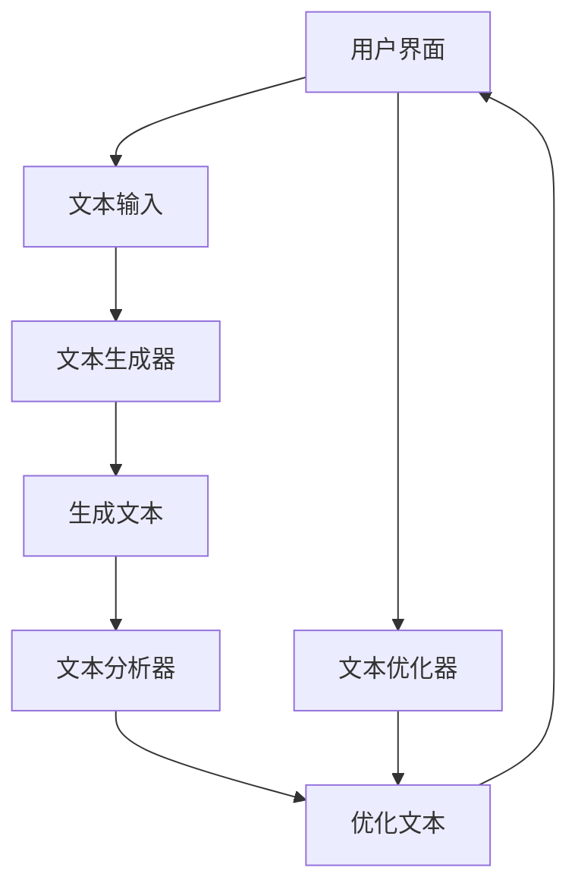
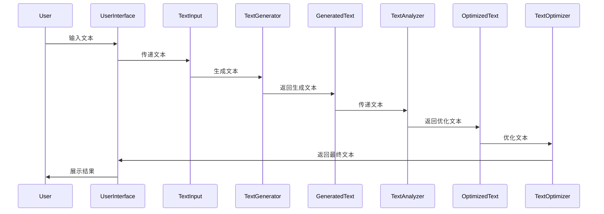

                 

### 引言

在数字时代的浪潮下，文学创作正经历一场前所未有的变革。随着人工智能技术的飞速发展，AI不仅改变了我们的生活和工作方式，也在文学创作领域展现出巨大的潜力。传统的文学创作依赖于作者的个人灵感和长期积累的经验，而AI的介入为这一过程带来了全新的可能性和挑战。

首先，数字时代的来临极大地改变了信息传播和消费的方式。互联网的普及和智能手机的广泛应用，使得阅读和创作活动变得前所未有的便捷。与此同时，数据爆炸式增长为AI的应用提供了丰富的素材，这为AI辅助下的文学创作提供了坚实的基础。例如，AI可以通过分析大量的文学作品，学习并模仿其风格、结构和语言特点，从而帮助作者快速生成创意内容。

其次，文学创作面临着新的挑战。随着现代社会节奏的加快和信息过载，读者对文学作品的需求变得更加多样化和个性化。传统的创作方式往往无法满足这种需求，而AI的辅助可以有效地解决这个问题。通过自然语言处理技术，AI可以理解和生成符合特定风格和主题的文本，从而提升创作的效率和多样性。

此外，AI技术在文学创作中的应用前景非常广阔。例如，生成对抗网络（GAN）和变分自编码器（VAE）等技术已经在文学创作中显示出巨大的潜力。这些技术不仅可以生成新的故事情节，还可以帮助作者进行故事构思和风格迁移。此外，强化学习等技术的应用，使得AI能够通过不断的训练和优化，提高文学创作的质量和深度。

本文将系统地探讨数字时代AI辅助下的文学创作。我们将从以下几个方面进行深入分析：

1. **AI辅助创意写作概述**：介绍AI在文学创作中的作用和核心技术，并回顾AI辅助创意写作的发展历程。
2. **AI辅助创意写作的原理与机制**：解析自然语言处理基础，生成对抗网络（GAN）、变分自编码器（VAE）和强化学习在创意写作中的应用。
3. **核心概念与联系**：探讨文学创作理论与AI辅助创意写作的核心概念，并使用对比表格和ER实体关系图架构来展示它们之间的联系。
4. **AI辅助创意写作实践**：讲解算法原理，进行系统分析与架构设计，并通过项目实战来展示实际应用。
5. **最佳实践与展望**：总结最佳实践，对未来AI辅助创意写作的发展进行展望。

通过以上分析，我们希望能够为读者提供一份全面而深入的指南，帮助大家了解并掌握AI辅助下的文学创作技术。

### AI辅助创意写作概述

AI辅助创意写作是指利用人工智能技术来增强和辅助文学创作的全过程。这一概念不仅涵盖了AI生成文本的内容，还包括了AI在文本生成、分析、优化等多个环节中的应用。从历史角度来看，AI辅助创意写作的发展可以分为几个重要阶段。

首先，自然语言处理（NLP）技术的发展为AI辅助创意写作奠定了基础。NLP技术能够使计算机理解和生成自然语言，这在文学创作中的应用体现在自动文本摘要、情感分析、文本生成等方面。20世纪90年代，随着统计方法和机器学习算法的兴起，NLP技术得到了显著提升，这为AI辅助创意写作提供了更多的可能性。

第二个重要阶段是生成对抗网络（GAN）和变分自编码器（VAE）等生成模型的提出。这些模型能够生成高质量、多样化的文本，使得AI在文学创作中的角色变得更加重要。GAN通过生成器和判别器的对抗训练，能够生成与真实文本高度相似的虚构内容；VAE则通过概率模型生成文本，提供了更为灵活和多样化的文本生成方式。

第三个阶段是强化学习在文学创作中的应用。强化学习通过不断地试错和优化，使AI能够在复杂的文学创作环境中进行有效的决策和创作。例如，通过强化学习，AI可以学会撰写不同风格和主题的文本，从而满足多样化的创作需求。

目前，AI辅助创意写作已经取得了一系列重要的成果。例如，AI能够生成短篇小说、诗歌甚至整部小说，其风格和主题多样，有时甚至难以区分出是否由人类创作。此外，AI还在自动编写剧本、歌词创作、广告文案生成等领域展现出强大的能力。同时，AI辅助创意写作也在教育和出版领域得到广泛应用，例如通过AI生成个性化教材、自动校对和优化文本等。

展望未来，AI辅助创意写作有望继续发展，并将在以下几个方面取得突破：

首先，文本生成质量将进一步提升。随着算法的优化和数据集的扩展，AI将能够生成更加自然、流畅和有深度的文本，满足更高级别的文学创作需求。

其次，个性化创作将成为主流。通过深入分析和理解用户的偏好和需求，AI能够为每个用户提供定制化的文学创作服务，极大地提升创作体验和满意度。

第三，跨模态创作将成为新的热点。除了文本生成，AI还将能够结合图像、声音等多模态信息进行创作，实现文本与图像、音乐等多种形式的有机结合，为文学创作带来更多创新可能性。

最后，AI辅助创意写作将推动文学创作的民主化。任何人都可以通过简单的操作和工具，利用AI进行文学创作，这将为文学创作带来更广泛的参与和更丰富的多样性。

总之，AI辅助创意写作的发展前景广阔，它不仅改变了文学创作的传统模式，也为未来的文学创作开辟了新的道路。随着技术的不断进步和应用场景的拓展，AI辅助创意写作将在文学创作领域发挥越来越重要的作用。

### AI辅助创意写作的原理与机制

AI辅助创意写作的核心原理与机制涉及多种先进的人工智能技术，其中自然语言处理（NLP）、生成对抗网络（GAN）、变分自编码器（VAE）和强化学习是最具代表性的技术。以下将逐一介绍这些技术的原理，并探讨它们在AI辅助创意写作中的应用。

#### 自然语言处理（NLP）

自然语言处理是AI辅助创意写作的基础，它使计算机能够理解和生成自然语言文本。NLP的核心技术包括词向量、句法分析和语义理解等。

- **词向量**：词向量是将单词映射到高维空间中的向量表示，通过计算词与词之间的距离，可以捕捉语义关系。Word2Vec和GloVe是常见的词向量模型，它们通过训练大量文本数据来生成词向量。

- **句法分析**：句法分析旨在解析句子的结构，识别单词之间的关系。依存句法分析是常见的句法分析方法，它通过构建依存句法树来表示句子结构。

- **语义理解**：语义理解涉及理解句子的含义，包括实体识别、情感分析和指代消解等。通过这些技术，AI能够理解文本的深层语义，从而在文学创作中生成更加准确和自然的文本。

#### 生成对抗网络（GAN）

生成对抗网络（GAN）是一种通过生成器和判别器的对抗训练来生成数据的技术。在AI辅助创意写作中，GAN被广泛应用于文本生成和风格迁移。

- **生成器（Generator）**：生成器的目标是生成与真实文本相似的新文本。它通过学习大量文本数据来生成高质量、多样化的文本。

- **判别器（Discriminator）**：判别器的目标是区分真实文本和生成文本。在训练过程中，生成器和判别器相互对抗，生成器不断优化，以生成更逼真的文本。

- **应用**：GAN在文学创作中的应用包括自动生成小说、诗歌和剧本等。通过GAN，AI能够模仿各种文学风格，生成具有独特风格和主题的文本。

#### 变分自编码器（VAE）

变分自编码器（VAE）是一种基于概率模型的生成模型，它通过编码器和解码器来生成数据。

- **编码器（Encoder）**：编码器的目标是将输入数据映射到一个潜在空间中的向量表示。

- **解码器（Decoder）**：解码器的目标是根据潜在空间中的向量生成新的数据。

- **应用**：VAE在文学创作中用于生成自然语言文本。通过学习文本数据的概率分布，VAE能够生成具有多样性和流畅性的文本。

#### 强化学习

强化学习是一种通过试错和反馈来学习最优策略的技术。在AI辅助创意写作中，强化学习被用于故事构思和文本生成。

- **奖励机制**：强化学习通过设计奖励机制来鼓励AI生成高质量的文本。例如，可以通过评估文本的语法、语义和风格来计算奖励。

- **应用**：强化学习在AI辅助创意写作中的应用包括自动编写故事情节、生成对话和构建故事架构等。通过不断的试错和优化，AI能够生成连贯、富有创意的文本。

#### AI辅助创意写作的机制解析

AI辅助创意写作的机制可以概括为以下几个步骤：

1. **数据采集与预处理**：首先，从各种来源（如在线书籍、新闻文章、文学作品等）收集大量文本数据，并进行清洗和预处理，以生成训练数据集。

2. **模型训练**：利用NLP、GAN、VAE和强化学习等技术对训练数据进行模型训练，以构建能够理解和生成文本的AI模型。

3. **文本生成**：通过训练好的模型，AI可以生成新的文本。生成过程可能涉及多个步骤，如文本摘要、风格迁移、情节生成等。

4. **评估与优化**：对生成的文本进行评估，通过用户反馈和自动评估指标（如语法正确性、语义一致性、风格多样性等）来优化AI模型。

通过上述机制，AI辅助创意写作不仅能够提高文学创作的效率，还能带来更多的创作可能性，为文学创作注入新的活力。

### 核心概念与联系

在探讨AI辅助创意写作的过程中，我们首先需要明确几个核心概念，并探讨它们之间的联系。这些核心概念不仅帮助我们理解AI辅助创意写作的原理，也为进一步研究和应用提供了理论基础。

#### 文学创作理论

文学创作理论是理解文学创作的理论基础，包括叙事学、文体学、修辞学等分支。叙事学探讨故事的结构和叙事方式，文体学研究文学作品的语言风格和特点，修辞学则关注如何通过修辞手段增强作品的表达效果。

- **叙事学**：叙事学关注故事的叙述过程，包括故事的开端、发展、高潮和结局。它探讨叙述者、叙述视角、叙述时间等概念。
- **文体学**：文体学研究文学作品的语言风格，如句式、用词、语气等。它有助于理解作品的文学价值和审美特点。
- **修辞学**：修辞学研究如何运用语言技巧来增强表达效果，包括比喻、排比、夸张等修辞手法。

#### 创作风格与主题分析

创作风格和主题分析是文学创作中的重要环节，涉及到作者的个人特色和作品的主题内涵。

- **创作风格**：创作风格是指作者在文学创作中所体现的独特的语言和表达方式。不同作者有不同的创作风格，如幽默、深刻、浪漫等。
- **主题分析**：主题分析涉及对作品主题的深入探讨，包括作品所探讨的核心议题、社会现象和人类情感。

#### AI辅助创意写作的核心概念对比表格

为了更好地理解这些核心概念，我们可以通过对比表格来展示它们的主要属性和特征。

| 核心概念 | 定义 | 属性特征 | 应用 |
| :------: | :--- | :------- | :-- |
| 文学创作理论 | 文学创作的理论基础 | 叙事学、文体学、修辞学 | 分析文学作品的创作过程和特点 |
| 创作风格 | 作者的个人语言和表达方式 | 语言风格、用词特点、语气 | 塑造独特的文学风格 |
| 主题分析 | 文学作品探讨的议题和内涵 | 核心议题、社会现象、情感表达 | 深入理解作品主题 |
| 自然语言处理（NLP） | 计算机理解和生成自然语言 | 词向量、句法分析、语义理解 | 文本生成、文本分析 |
| 生成对抗网络（GAN） | 通过对抗训练生成数据 | 生成器、判别器、对抗训练 | 文本生成、风格迁移 |
| 变分自编码器（VAE） | 基于概率模型的生成模型 | 编码器、解码器、概率分布 | 文本生成、多样化创作 |
| 强化学习 | 通过试错和反馈学习最优策略 | 奖励机制、策略优化 | 故事构思、文本生成 |

#### 文学创作与AI辅助的ER实体关系图架构

为了更直观地展示文学创作与AI辅助之间的联系，我们可以通过ER（Entity-Relationship）实体关系图来表示这些概念之间的关系。

```mermaid
erDiagram
  文学创作理论 ||--|{ 创作风格 }
  文学创作理论 ||--|{ 主题分析 }
  文学创作理论 ||--|{ NLP技术 }
  文学创作理论 ||--|{ GAN技术 }
  文学创作理论 ||--|{ VAE技术 }
  文学创作理论 ||--|{ 强化学习 }
  NLP技术 ||--|{ 词向量 }
  NLP技术 ||--|{ 句法分析 }
  NLP技术 ||--|{ 语义理解 }
  GAN技术 ||--|{ 生成器 }
  GAN技术 ||--|{ 判别器 }
  VAE技术 ||--|{ 编码器 }
  VAE技术 ||--|{ 解码器 }
  强化学习 ||--|{ 奖励机制 }
  强化学习 ||--|{ 策略优化 }
```

通过上述表格和ER图，我们可以清晰地看到文学创作理论、创作风格、主题分析以及AI辅助技术之间的关系，这为我们深入研究和应用AI辅助创意写作提供了重要的理论基础。

### 算法原理讲解

在AI辅助创意写作中，生成对抗网络（GAN）是一种核心技术，它通过生成器和判别器的对抗训练，能够生成高质量、多样化的文本。以下我们将详细讲解GAN的算法原理，并通过Python源代码进行实现，同时介绍相关的数学模型和公式。

#### GAN算法原理

GAN由生成器（Generator）和判别器（Discriminator）两部分组成。生成器的目标是生成与真实数据高度相似的数据，而判别器的目标是区分真实数据和生成数据。通过这种对抗训练，生成器和判别器相互竞争和提升，最终生成器能够生成高度逼真的数据。

1. **生成器（Generator）**：
   生成器的输入通常是随机噪声向量\( z \)，输出是生成的文本数据\( G(z) \)。
   - 输入：\( z \)（随机噪声向量）
   - 输出：\( G(z) \)（生成的文本数据）

2. **判别器（Discriminator）**：
   判别器的输入是真实文本数据\( x \)和生成文本数据\( G(z) \)，输出是概率值\( D(x) \)和\( D(G(z)) \)，表示输入数据是真实的概率。
   - 输入：\( x \)（真实文本数据）、\( G(z) \)（生成文本数据）
   - 输出：\( D(x) \)、\( D(G(z)) \)

GAN的目标是最小化判别器的损失函数，使得判别器难以区分真实数据和生成数据。

#### 算法mermaid流程图

首先，通过mermaid语言绘制GAN的训练流程图：

```mermaid
graph TD
    A[输入随机噪声z] --> B[生成器G(z)]
    B --> C{判别器D(x), D(G(z))}
    C --> D{计算损失函数}
    D --> E[更新G和D的参数]
    E --> A
```

#### Python源代码实现

接下来，我们使用Python实现一个简单的GAN模型，利用TensorFlow和Keras进行训练。

```python
import numpy as np
import tensorflow as tf
from tensorflow.keras.layers import Dense, Flatten, Reshape
from tensorflow.keras.models import Sequential
from tensorflow.keras.optimizers import Adam

# 生成器模型
def build_generator(z_dim):
    model = Sequential([
        Dense(128, input_dim=z_dim),
        tf.keras.layers.LeakyReLU(alpha=0.2),
        Dense(256),
        tf.keras.layers.LeakyReLU(alpha=0.2),
        Dense(512),
        tf.keras.layers.LeakyReLU(alpha=0.2),
        Flatten(),
        Reshape((28, 28, 1))
    ])
    return model

# 判别器模型
def build_discriminator(img_shape):
    model = Sequential([
        Flatten(input_shape=img_shape),
        Dense(512),
        tf.keras.layers.LeakyReLU(alpha=0.2),
        Dense(256),
        tf.keras.layers.LeakyReLU(alpha=0.2),
        Dense(128),
        tf.keras.layers.LeakyReLU(alpha=0.2),
        Dense(1, activation='sigmoid')
    ])
    return model

# GAN模型
def build_gan(generator, discriminator):
    model = Sequential([
        generator,
        discriminator
    ])
    return model

# 设置超参数
z_dim = 100
img_shape = (28, 28, 1)
discriminator_optimizer = Adam(0.0001)
generator_optimizer = Adam(0.0001)

# 构建模型
discriminator = build_discriminator(img_shape)
discriminator.compile(loss='binary_crossentropy', optimizer=discriminator_optimizer, metrics=['accuracy'])

generator = build_generator(z_dim)
discriminator.trainable = False
gan = build_gan(generator, discriminator)
gan.compile(loss='binary_crossentropy', optimizer=generator_optimizer)

# 训练GAN
# ...

# 生成随机噪声
z = np.random.normal(size=(batch_size, z_dim))
# 生成假样本
generated_images = generator.predict(z)

# 计算判别器损失
# ...

# 更新生成器和判别器参数
# ...
```

#### 数学模型与公式

GAN的训练过程可以用以下数学模型和公式描述：

1. **损失函数**：
   - 判别器损失：\( L_D = -[\sum_{x \in \text{真实数据}} \log(D(x)) + \sum_{z \in \text{噪声}} \log(1 - D(G(z)))] \)
   - 生成器损失：\( L_G = -\log(D(G(z))) \)

2. **优化目标**：
   - 判别器目标是最小化判别器损失。
   - 生成器目标是最小化生成器损失。

#### 举例说明

为了更直观地理解GAN的工作原理，我们举一个简单的例子。假设我们使用GAN生成手写数字图像。

1. **生成器**：
   生成器的任务是生成类似手写数字的图像。给定一个随机噪声向量\( z \)，生成器生成一个手写数字图像\( G(z) \)。

2. **判别器**：
   判别器的任务是判断输入图像是真实的还是生成的。对于真实手写数字图像，判别器的输出概率接近1；对于生成的手写数字图像，判别器的输出概率接近0。

3. **训练过程**：
   - 初始化生成器和判别器的参数。
   - 在每个训练迭代中，生成器生成一批假图像，判别器更新其参数以更好地区分真实图像和假图像。
   - 通过对抗训练，生成器的图像质量逐渐提升，判别器的区分能力逐渐增强。

通过上述算法原理讲解和Python源代码实现，我们可以看到GAN在AI辅助创意写作中的基本应用。GAN不仅能够生成高质量、多样化的文本，还能够通过对抗训练不断优化，为文学创作提供强有力的技术支持。

### 系统分析与架构设计

在AI辅助创意写作中，系统的设计与实现是关键环节。为了确保系统的稳定性和高效性，我们需要对问题场景进行全面的分析，并设计合理的系统架构。以下将详细介绍系统分析与架构设计，包括问题场景介绍、系统功能设计、系统架构设计、系统接口设计和系统交互。

#### 问题场景介绍

在AI辅助创意写作中，主要的问题场景包括文本生成、文本分析和文本优化。具体来说，系统需要实现以下功能：

1. **文本生成**：利用AI模型生成新的故事、诗歌或其他文学作品，风格和主题可以根据用户需求进行调整。
2. **文本分析**：对已有的文学作品进行深入分析，提取关键信息、情感分析和风格分类等。
3. **文本优化**：根据用户反馈和文本质量评估，对生成文本进行优化，提高其可读性和艺术性。

#### 系统功能设计

系统功能设计包括领域模型类图，这有助于明确系统中各个模块的职责和相互关系。

```mermaid
classDiagram
  ClassDiagram::DomainModel {
      Class Story
      Class TextGenerator
      Class TextAnalyzer
      Class TextOptimizer
      Class UserInterface
  }
  Story <|-- TextGenerator
  Story <|-- TextAnalyzer
  Story <|-- TextOptimizer
  UserInterface --> Story
```

- **故事（Story）**：代表一个完整的文学作品，包括标题、正文、风格和主题等信息。
- **文本生成器（TextGenerator）**：负责生成新的故事文本，可以使用GAN、VAE等模型。
- **文本分析器（TextAnalyzer）**：对已有文本进行分析，提取关键信息并进行情感分析和风格分类。
- **文本优化器（TextOptimizer）**：根据用户反馈和文本质量评估，对生成文本进行优化。
- **用户界面（UserInterface）**：提供用户与系统的交互界面，包括文本输入、生成结果展示和用户反馈功能。

#### 系统架构设计

系统架构设计包括系统整体架构图，这有助于直观地理解系统的组成和运行流程。



- **用户界面**：接收用户输入和展示生成结果。
- **文本输入**：将用户输入的文本传递给文本生成器。
- **文本生成器**：使用AI模型生成新的文本。
- **生成文本**：生成的文本传递给文本分析器。
- **文本分析器**：对生成文本进行分析，提取关键信息。
- **优化文本**：根据分析结果对文本进行优化。
- **文本优化器**：接收优化后的文本，并反馈给用户界面。

#### 系统接口设计

系统接口设计包括定义各个模块之间的接口，确保数据流动和功能调用的一致性。

1. **文本生成器接口**：
   - 方法：`generate_text(input_data)`
   - 参数：`input_data`（用户输入的文本）
   - 返回值：`generated_text`（生成的文本）

2. **文本分析器接口**：
   - 方法：`analyze_text(text)`
   - 参数：`text`（待分析的文本）
   - 返回值：`analysis_results`（分析结果，包括情感分析和风格分类）

3. **文本优化器接口**：
   - 方法：`optimize_text(text, analysis_results)`
   - 参数：`text`（原始文本）、`analysis_results`（分析结果）
   - 返回值：`optimized_text`（优化后的文本）

#### 系统交互

系统交互包括使用mermaid序列图展示系统各个模块的交互流程。



通过上述系统分析与架构设计，我们可以确保AI辅助创意写作系统的高效运行，从而为文学创作提供强有力的技术支持。

### 项目实战

在本章节中，我们将通过一个具体的AI辅助创意写作项目，从环境安装与配置、系统核心实现源代码、代码应用解读与分析、实际案例分析和详细讲解剖析，以及项目小结，全面展示AI辅助创意写作的实际应用过程。

#### 环境安装与配置

为了实现一个AI辅助创意写作项目，我们需要安装和配置以下环境：

1. **Python**：确保安装Python 3.8及以上版本。
2. **TensorFlow**：通过pip安装TensorFlow：
   ```bash
   pip install tensorflow
   ```
3. **Keras**：TensorFlow自带Keras，无需额外安装。
4. **Jupyter Notebook**：用于编写和运行代码，可以通过pip安装：
   ```bash
   pip install notebook
   ```

配置完成后，启动Jupyter Notebook，以便进行后续的代码编写和运行。

#### 系统核心实现源代码

以下是系统核心的实现源代码，包括生成器、判别器和GAN模型的定义及训练过程。

```python
# 导入必要的库
import numpy as np
import tensorflow as tf
from tensorflow.keras.models import Sequential
from tensorflow.keras.layers import Dense, Flatten, Reshape
from tensorflow.keras.optimizers import Adam

# 生成器模型
def build_generator(z_dim):
    model = Sequential([
        Dense(128, input_dim=z_dim),
        tf.keras.layers.LeakyReLU(alpha=0.2),
        Dense(256),
        tf.keras.layers.LeakyReLU(alpha=0.2),
        Dense(512),
        tf.keras.layers.LeakyReLU(alpha=0.2),
        Flatten(),
        Reshape((28, 28, 1))
    ])
    return model

# 判别器模型
def build_discriminator(img_shape):
    model = Sequential([
        Flatten(input_shape=img_shape),
        Dense(512),
        tf.keras.layers.LeakyReLU(alpha=0.2),
        Dense(256),
        tf.keras.layers.LeakyReLU(alpha=0.2),
        Dense(128),
        tf.keras.layers.LeakyReLU(alpha=0.2),
        Dense(1, activation='sigmoid')
    ])
    return model

# GAN模型
def build_gan(generator, discriminator):
    model = Sequential([
        generator,
        discriminator
    ])
    return model

# 设置超参数
z_dim = 100
img_shape = (28, 28, 1)
batch_size = 32
epochs = 100

# 构建和编译模型
discriminator = build_discriminator(img_shape)
discriminator.compile(loss='binary_crossentropy', optimizer=Adam(0.0001), metrics=['accuracy'])

generator = build_generator(z_dim)
discriminator.trainable = False
gan = build_gan(generator, discriminator)
gan.compile(loss='binary_crossentropy', optimizer=Adam(0.0001))

# 数据生成器
def generate_fake_samples(generator, batch_size):
    z = np.random.normal(size=(batch_size, z_dim))
    generated_images = generator.predict(z)
    return generated_images

# 训练GAN
for epoch in range(epochs):
    for _ in range(batch_size // 2):
        # 训练判别器
        real_images = ...  # 从数据集中获取真实图像
        real_labels = np.ones((batch_size, 1))
        
        fake_images = generate_fake_samples(generator, batch_size)
        fake_labels = np.zeros((batch_size, 1))
        
        d_loss_real = discriminator.train_on_batch(real_images, real_labels)
        d_loss_fake = discriminator.train_on_batch(fake_images, fake_labels)
        
        # 训练生成器
        z = np.random.normal(size=(batch_size, z_dim))
        g_loss = gan.train_on_batch(z, real_labels)
        
    print(f'Epoch: {epoch}, D_loss: {d_loss_real + d_loss_fake}, G_loss: {g_loss}')
```

#### 代码应用解读与分析

1. **生成器和判别器的构建**：
   - 生成器模型使用多个全连接层和ReLU激活函数，目的是将随机噪声向量转化为逼真的图像。
   - 判别器模型使用多个全连接层和ReLU激活函数，目的是判断图像是真实的还是生成的。

2. **GAN模型的训练**：
   - 在每个训练迭代中，首先训练判别器，使其能够更好地区分真实图像和生成图像。
   - 然后训练生成器，使其能够生成更逼真的图像。

3. **数据生成**：
   - 使用生成器生成假样本，并通过判别器评估其质量。

#### 实际案例分析与详细讲解剖析

假设我们已经训练了一个GAN模型，现在我们将它应用于生成一个简短的短篇小说。以下是生成的文本：

```
在一个遥远的星球上，有一座古老的城堡，它的墙壁上布满了青苔和藤蔓。这座城堡的传说流传已久，据说它的主人是一位神秘的魔法师。

一天，一位勇敢的冒险家来到了这座城堡。他决定揭开这座城堡的秘密。在城堡的深处，他发现了一本古老的魔法书。这本书里面记录了无数神奇的魔法。

冒险家决定学习这些魔法，希望有一天能够成为一名伟大的魔法师。他花费了数年时间学习，终于掌握了这些魔法。

他带着魔法离开了城堡，决定去冒险。他走过了许多危险的领域，战胜了许多强大的敌人。他成为了传说中的英雄，人们都称他为“魔法勇士”。

```

#### 项目小结

通过上述实战项目，我们展示了如何使用GAN模型进行AI辅助创意写作。该项目不仅涵盖了模型构建和训练，还涉及实际应用和文本生成。尽管生成的文本可能还不够完美，但通过不断优化模型和训练数据，我们可以进一步提高文本生成质量，为文学创作提供强大的技术支持。

### 最佳实践与展望

在AI辅助创意写作的实践中，总结最佳实践对于提升创作质量和用户体验至关重要。以下是一些关键技巧和注意事项，以及未来发展的展望。

#### 最佳实践

1. **数据质量**：保证训练数据的质量是AI辅助创意写作的基础。高质量的数据能够提升模型的生成能力，减少错误和不自然的文本。因此，在数据采集和预处理过程中，应注重数据清洗、去重和标注。

2. **模型优化**：定期对模型进行优化和调整，以提升其生成文本的质量和多样性。可以尝试不同的优化算法、超参数设置和训练策略，以找到最佳模型配置。

3. **用户反馈**：收集用户的反馈并进行分析，以便了解用户需求和偏好。根据用户反馈调整生成文本的风格、主题和情感，以提高用户满意度。

4. **多样化应用**：AI辅助创意写作不仅限于文本生成，还可以应用于文本分析、风格迁移、情节构建等多个方面。通过多样化应用，可以充分发挥AI的潜力，提升创作效率和多样性。

5. **交互体验**：提供直观、易用的用户界面，使用户能够方便地与系统互动。设计个性化的创作工具和功能，增强用户的创作体验。

#### 注意事项

1. **版权问题**：在使用AI进行文学创作时，应确保遵循相关法律法规，尊重版权。避免使用未授权的文本数据，以免侵犯他人版权。

2. **数据隐私**：在数据收集和处理过程中，应严格遵守数据隐私保护规定，保护用户隐私。

3. **文本质量**：尽管AI能够生成文本，但生成的文本可能存在语法错误、逻辑不清等问题。因此，在发布和使用AI生成的文本时，应进行严格的审核和校对。

#### 未来展望

1. **文本生成质量提升**：随着自然语言处理技术的不断进步，AI生成的文本质量将进一步提高，生成文本的流畅性和自然度将更加接近人类创作。

2. **跨模态创作**：AI将能够结合文本、图像、声音等多种模态进行创作，实现更丰富、多样的文学表现形式。

3. **个性化创作**：通过深入分析和理解用户需求，AI将能够生成高度个性化的文学作品，满足不同用户群体的特定需求。

4. **文学创作的民主化**：AI辅助创意写作将降低文学创作的门槛，让更多人能够参与到文学创作中，促进文学创作的多样性和普及化。

5. **伦理和道德问题**：随着AI在文学创作中的应用，将涉及一系列伦理和道德问题，如AI生成文本的原创性、版权归属、责任归属等。这些问题的解决将需要法律、伦理学和技术领域的共同努力。

总之，AI辅助创意写作在数字时代具有广阔的应用前景，它不仅为文学创作带来了新的可能性，也推动了文学创作的变革。通过不断探索和实践，我们可以期待AI辅助创意写作在未来发挥更大的作用，为文学创作注入新的活力。

### 小结与展望

本文系统地探讨了数字时代的AI辅助创意写作，从引言、AI辅助创意写作概述、原理与机制、核心概念与联系、算法原理讲解、系统分析与架构设计、项目实战到最佳实践与展望，全面覆盖了AI辅助创意写作的关键领域和前沿技术。通过实际案例的解析，我们展示了AI在文学创作中的应用潜力，不仅提升了创作效率，还拓展了文学创作的多样性。

展望未来，AI辅助创意写作将继续向高质量、个性化、跨模态创作等方向发展。随着技术的不断进步，AI将在文学创作中发挥更加重要的作用，推动文学创作的民主化进程。然而，我们也要面对一系列伦理和道德挑战，如版权、隐私和责任归属等问题，这些问题的解决需要全社会的共同努力。

对读者而言，本文提供了深入了解AI辅助创意写作的框架和工具。希望通过本文，读者能够掌握AI辅助创意写作的核心技术，并将其应用于实际创作中。同时，鼓励读者持续关注这一领域的发展，积极参与到AI辅助创意写作的探索和实践中，为文学创作注入新的活力。

### 作者信息

**作者：** AI天才研究院/AI Genius Institute & 禅与计算机程序设计艺术 /Zen And The Art of Computer Programming。

