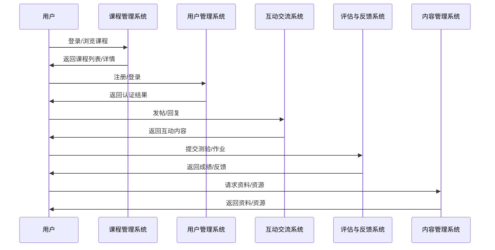

                 

### 引言与背景

**数字时代的在线社交与礼仪**

在当今数字化的时代，在线社交已经成为人们生活中不可或缺的一部分。从社交媒体到即时通讯应用，网络社交平台极大地改变了人们的交流方式。然而，伴随着在线社交的普及，一系列相关问题也随之而来，其中之一便是社交礼仪的缺失。在线社交的特殊环境要求人们在数字空间中同样遵守一定的礼仪规范，这不仅关乎个人形象，更关乎整个网络文化的健康发展。

**礼仪在网络环境中的特殊意义**

礼仪自古以来是人类社会中调节人际关系、维护社会秩序的重要手段。在网络环境中，礼仪同样扮演着重要角色。一方面，它能够帮助建立互信和尊重的在线氛围，减少误解和冲突；另一方面，它有助于形成良好的网络文化，提升整个社会的文明程度。特别是在公共论坛、社交平台等广泛使用的网络空间，良好的礼仪规范更是至关重要。

**教育平台的角色**

为了培养良好的在线社交礼仪，建立积极的网络文化，教育平台显得尤为重要。一个专门设计用于在线社交礼仪的教育平台，不仅可以系统地传授礼仪知识，还可以通过互动和实践，帮助用户更好地理解和应用这些规范。本文将探讨如何构建这样一款教育平台，旨在为数字时代的社会提供有效的礼仪教育解决方案。

**积极网络文化的目标与原则**

构建积极网络文化的目标在于创造一个健康、和谐、富有建设性的在线环境。为实现这一目标，我们需要遵循以下基本原则：

1. **尊重与包容**：尊重每个人的观点和意见，包容不同文化和背景的差异。
2. **诚实与透明**：在交流中保持诚实，公开透明地分享信息。
3. **互助与合作**：鼓励用户互相帮助，共同维护网络环境的秩序。
4. **尊重隐私与安全**：保护用户隐私，确保网络空间的安全。

**文化建设的重要性**

积极网络文化的建设不仅对个人有深远影响，也对整个社会具有重要意义。通过礼仪教育，我们可以提高社会整体的文明程度，减少网络暴力和恶意行为的出现，促进网络空间的和谐发展。

**结论与展望**

本文旨在探讨数字时代在线社交礼仪教育的重要性，并提出了构建教育平台的具体思路。通过逐步分析在线社交的现状、礼仪的核心概念、实践方法，以及教育平台的设计与实施，我们希望为构建积极网络文化提供理论依据和实践指导。未来，随着技术的发展，在线社交礼仪教育平台将继续演进，为更多人带来正面的影响。

### 社交礼仪的核心概念

**社交礼仪的定义**

社交礼仪是指在社会交往过程中，人们为了维护和谐的人际关系，所遵守的一套行为规范和准则。它涵盖了语言、行为、着装等多个方面，是一种社会规范，旨在确保交往的顺利进行。在传统社会中，礼仪被视为一种道德准则，随着社会的发展，礼仪也逐步融入到现代社交中，尤其是在网络环境中。

**礼仪的属性与作用**

礼仪具有以下几大属性：

1. **规范性**：礼仪是一种规范，它为人们的行为设立了标准，帮助人们判断什么行为是合适的，什么行为是不恰当的。
2. **文化性**：礼仪是文化的一部分，它反映了特定社会的价值观、道德观和行为准则。
3. **调节性**：礼仪在人际关系中起到了调节作用，通过规范行为，减少冲突和误解，促进人际和谐。

礼仪在社会交往中具有重要作用，主要体现在以下几个方面：

1. **维护人际关系**：通过遵守礼仪，人们能够建立和维护良好的人际关系，增进相互间的信任和理解。
2. **传递信息**：礼仪作为一种非言语沟通方式，能够传递信息，帮助人们更好地理解对方的意图。
3. **提升形象**：遵守礼仪能够提升个人形象，增加他人对个人的尊重和好感。
4. **促进社会和谐**：在更广泛的社会层面上，礼仪有助于构建和谐的社会环境，减少冲突和矛盾。

**社交礼仪的层次结构**

社交礼仪可以按照不同的层次进行分类，常见的层次结构包括：

1. **基本礼仪**：这是社交礼仪的基础，包括问候、致谢、道歉等基本行为规范。
2. **专业礼仪**：针对特定行业或领域的礼仪规范，如商务礼仪、职场礼仪等。
3. **高级礼仪**：这是社交礼仪的更高层次，涉及更为复杂和精细的礼仪规则，如国际礼仪、宫廷礼仪等。
4. **情境礼仪**：根据不同的社交情境，如宴会、会议、公共场合等，制定的特定礼仪规范。

**核心概念与联系**

在理解社交礼仪的核心概念时，以下几个关键术语和概念是不可或缺的：

1. **尊重**：尊重是社交礼仪的核心，它体现在对他人观点、隐私、习俗的尊重上。
2. **礼貌**：礼貌是礼仪的外在表现，通过言行举止展现对他人的尊重和关心。
3. **诚实**：在社交过程中，诚实是建立信任的基础，也是礼仪的重要组成部分。
4. **诚信**：诚信是一种道德准则，它要求人们在交往中保持真实、可靠，不欺骗、不欺诈。
5. **包容**：包容是尊重的延伸，它要求人们在多元文化环境中，尊重他人的差异，包容不同的观点和行为。

这些核心概念相互联系，共同构成了社交礼仪的完整体系。尊重是礼仪的基础，礼貌是尊重的体现，诚实和诚信是交往的基石，而包容则使礼仪更具包容性和适应性。

**社交礼仪的历史与发展**

社交礼仪的历史悠久，其起源可以追溯到古代文明。在古代，礼仪是统治阶级维护社会秩序、强化等级制度的重要工具。例如，古代中国的《礼记》详细记载了各种礼仪规范，这些规范对后世的礼仪发展产生了深远影响。

随着社会的发展，礼仪逐步从统治阶级扩展到普通民众，从家庭、社交扩展到职场、商务等领域。现代礼仪在传统礼仪的基础上，融入了更多的现代元素，如网络礼仪。在网络环境中，礼仪的规范更加复杂，要求人们在数字空间中同样遵守一定的行为准则。

在数字化时代，社交礼仪的发展面临新的挑战和机遇。一方面，网络环境的匿名性和虚拟性使得礼仪的遵守变得更加困难；另一方面，社交媒体的普及为礼仪的创新和传播提供了广阔的平台。因此，现代礼仪不仅需要继承和发扬传统礼仪的优点，还需要根据数字时代的特点进行创新和调整。

**概念属性特征对比表格**

为了更好地理解社交礼仪的核心概念，我们可以通过以下对比表格来分析这些概念的属性特征：

| 概念   | 定义                                                         | 属性特征                                                                                                                                                                                           | 作用                                       |
| ------ | ------------------------------------------------------------ | -------------------------------------------------------------------------------------------------------------------------------- | ------------------------------------------ |
| 尊重   | 对他人观点、隐私、习俗的尊重                                   | 1. 社会性：礼仪的基础<br>2. 文化性：不同文化背景的体现<br>3. 情境性：特定情境下的尊重要求 | 维护人际关系、促进社会和谐                 |
| 礼貌   | 通过言行举止展现对他人的尊重和关心                             | 1. 表现性：外在表现<br>2. 多样性：不同情境下的表现<br>3. 时效性：适时展现礼貌 | 增强人际互动、提升个人形象                 |
| 诚实   | 在社交过程中保持真实、可靠，不欺骗、不欺诈                     | 1. 道德性：诚信的核心<br>2. 实用性：建立信任的基础<br>3. 公共性：公众行为的准则 | 建立信任、促进社会公正                   |
| 诚信   | 在交往中保持真实、可靠，不欺骗、不欺诈                         | 1. 道德性：行为准则<br>2. 法律性：法律责任的依据<br>3. 实践性：日常行为的体现 | 维护社会秩序、保障交易安全               |
| 包容   | 尊重他人的差异，包容不同的观点和行为                           | 1. 开放性：对不同文化的接纳<br>2. 适应性：应对多样性<br>3. 互助性：共同发展的基础 | 促进文化多样性、增强社会包容性           |

通过这个对比表格，我们可以清晰地看到各个概念的定义、属性特征以及它们在社交礼仪中的作用。

**社交礼仪的ER实体关系图**

为了进一步理解社交礼仪的构成，我们可以使用实体关系图（ER图）来表示社交礼仪中的核心实体及其关系。以下是社交礼仪的ER实体关系图：

```mermaid
erDiagram
  用户 ||--|{ 礼貌 }|-- 用户
  用户 ||--|{ 尊重 }|-- 用户
  用户 ||--|{ 诚实 }|-- 用户
  用户 ||--|{ 诚信 }|-- 用户
  用户 ||--|{ 包容 }|-- 用户
  礼貌 ||--|{ 社交礼仪 }|
  尊重 ||--|{ 社交礼仪 }|
  诚实 ||--|{ 社交礼仪 }|
  诚信 ||--|{ 社交礼仪 }|
  包容 ||--|{ 社交礼仪 }|
```

在这个ER图中，"用户"是核心实体，代表了在社交过程中遵守礼仪的个体。其他实体如"礼貌"、"尊重"、"诚实"、"诚信"和"包容"则代表了社交礼仪的不同方面，它们与"用户"之间存在联系，共同构成了完整的社交礼仪体系。

### 在线社交礼仪的具体实践

**在线社交的基本规范**

在线社交礼仪的基本规范主要包括语言规范和行为规范。这些规范旨在确保网络交流的文明、有序和有效。

**语言规范**

1. **文明用语**：避免使用侮辱性、攻击性的语言，尊重他人。
2. **简明扼要**：在发帖、评论时，尽量表达清晰、简洁，避免冗长、复杂的表述。
3. **客观理性**：在讨论问题时，保持客观、理性的态度，避免情绪化。
4. **避免重复**：在社交媒体上，避免重复发表相同或类似的内容，以减少信息噪音。

**行为规范**

1. **尊重他人**：尊重他人的观点，不随意反驳或攻击。
2. **避免隐私泄露**：不要随意泄露个人或他人的隐私信息。
3. **合理使用图片和视频**：上传的图片和视频应遵守相关法律法规，不发布低俗、暴力等不良内容。
4. **适当互动**：积极参与互动，但不过度打扰他人。

**避免冲突的策略**

在线社交中，冲突是难以完全避免的。以下是一些避免冲突的策略：

1. **保持冷静**：在遇到冲突时，保持冷静，避免情绪化。
2. **沟通方式**：通过私下沟通解决问题，避免公开场合争执。
3. **寻求中立第三方**：如果双方无法自行解决冲突，可以寻求中立第三方的帮助。
4. **换位思考**：尝试理解对方的立场和观点，减少误解和冲突。

**在线社交礼仪的实践案例**

以下是一些具体的在线社交礼仪实践案例：

**案例一：网络会议中的礼仪**

1. **提前准备**：在会议前，确保设备正常、网络稳定。
2. **准时参加**：按时参加会议，不要迟到。
3. **保持安静**：在会议期间，保持安静，避免无关话题的讨论。
4. **积极参与**：在主持人邀请时，积极发言，提出有建设性的意见。

**案例二：社交媒体上的互动**

1. **文明评论**：在评论他人内容时，保持文明、尊重，不发表侮辱性言论。
2. **合理点赞**：对于优质内容，给予合理点赞和评论，但不过度刷赞。
3. **避免恶意攻击**：不要恶意攻击他人，避免引发不必要的冲突。
4. **适当分享**：合理分享有价值的内容，但避免过度分享。

**案例三：在线教育的礼仪规范**

1. **积极参与**：在线课程中，积极参与讨论，提出问题，促进互动。
2. **遵守纪律**：按时完成作业，不拖延，遵守在线学习纪律。
3. **尊重教师**：尊重教师，遵守教学规则，不随意打断教学。
4. **合理提问**：在提问时，清晰、明确地表达问题，不重复提问。

**网络礼仪教育的策略与方法**

为了提高用户的网络礼仪意识，以下是一些教育策略和方法：

1. **在线课程**：开设网络礼仪课程，通过系统化的教育，帮助用户掌握网络礼仪知识。
2. **宣传活动**：通过社交媒体、宣传海报等渠道，开展网络礼仪宣传活动，提高公众意识。
3. **案例分享**：分享网络礼仪的典型案例，通过真实案例，加深用户对礼仪的理解和应用。
4. **互动问答**：在社交媒体上开展互动问答活动，鼓励用户参与，提高参与度。
5. **技术支持**：利用人工智能等技术，提供实时礼仪指导和反馈，帮助用户规范行为。

通过以上策略和方法，我们可以有效地提高用户的网络礼仪意识，促进网络环境的健康发展。

### 教育平台的设计与实施

**教育平台的设计原则**

在设计和构建在线社交礼仪教育平台时，我们需要遵循以下几项核心设计原则，以确保平台能够有效地传达礼仪知识，并促进用户在实践中的应用。

1. **目标导向设计**：平台的设计应以明确的用户目标为核心，例如提高用户的网络礼仪意识、提升在线交流的质量等。
2. **用户友好设计**：平台的界面和交互设计应简洁、直观，便于用户快速上手和学习。
3. **安全性设计**：确保用户数据和隐私的安全，采取适当的安全措施，防止数据泄露和恶意攻击。
4. **互动性设计**：通过互动性强的学习方式，如讨论区、测验、角色扮演等，增加用户参与度。
5. **持续更新**：随着社交环境的变化和用户需求的变化，平台应具备持续更新和迭代的能力。

**教育平台的架构设计**

教育平台的架构设计需要充分考虑系统的可扩展性、稳定性和用户体验。以下是该平台的架构设计概述：

1. **功能模块设计**：平台应包括以下主要功能模块：
   - **课程管理系统**：负责课程的发布、管理、更新和用户课程进度跟踪。
   - **用户管理系统**：管理用户信息、权限和认证。
   - **互动交流系统**：提供论坛、讨论区、即时通讯等互动功能。
   - **评估与反馈系统**：对用户的学习效果进行评估，并提供反馈。
   - **内容管理系统**：用于管理课程内容、资料和多媒体资源。

2. **系统架构图**：以下是教育平台的基本架构图，展示了各模块之间的关系和交互流程。



3. **接口设计**：平台应提供完善的API接口，方便第三方系统和应用接入，如社交媒体账号绑定、数据分析接口等。

**平台实施与运营策略**

1. **实施流程**：
   - **需求分析**：明确平台的目标和功能需求，制定详细的实施计划。
   - **系统开发**：按照需求分析和设计，进行平台的功能开发和测试。
   - **上线部署**：将开发完成的系统部署到生产环境，进行上线测试和用户验收。
   - **后期维护**：定期对平台进行更新和维护，确保系统的稳定性和安全性。

2. **运营策略**：
   - **内容更新**：定期更新课程内容和资源，保持内容的时效性和吸引力。
   - **用户互动**：通过在线讨论、互动问答等方式，促进用户参与和互动。
   - **宣传推广**：利用社交媒体、广告等渠道，进行平台的宣传和推广。
   - **用户反馈**：及时收集用户反馈，对平台进行优化和改进。

**用户反馈与改进**

用户反馈是平台改进的重要依据。以下是一些收集和处理用户反馈的方法：

1. **反馈渠道**：提供多种反馈渠道，如在线表单、社交媒体、客服电话等。
2. **定期评估**：定期对用户反馈进行分析和评估，识别问题和改进方向。
3. **快速响应**：对用户反馈的问题进行快速响应，提供解决方案或改进措施。
4. **持续改进**：根据用户反馈，持续对平台进行改进和优化，提升用户体验。

通过科学的设计和实施，以及积极的运营策略和用户反馈机制，在线社交礼仪教育平台能够更好地服务于用户，提升网络礼仪意识，构建健康的网络文化。

### 积极网络文化的特征

**积极网络文化的特征**

积极网络文化是指在网络环境中，人们通过互相尊重、合作与互助，形成的一种健康、和谐、富有建设性的网络氛围。这种文化具有以下几个显著特征：

1. **互尊互敬**：网络用户之间相互尊重，尊重他人的观点和意见，不随意攻击或诋毁他人。
2. **友好互动**：用户在互动过程中表现出友好和善意，积极参与讨论，乐于帮助他人。
3. **诚实透明**：在网络交往中保持诚实，不隐瞒事实，公开透明地分享信息和经验。
4. **包容多样性**：尊重网络环境的多样性，包容不同的文化、观点和背景。
5. **积极向上**：鼓励积极的内容和态度，抵制负面情绪和行为，营造积极向上的网络氛围。

**积极网络文化的价值**

积极网络文化对个人和社会都具有重要的价值：

1. **个人成长**：在积极的网络环境中，用户能够更好地表达自己，获取知识，提升个人能力和自信心。
2. **社会和谐**：积极网络文化有助于减少网络冲突和误解，促进社会和谐发展。
3. **信息传播**：在积极的文化氛围中，信息传播更加高效和准确，有助于形成健康、有建设性的网络舆论。
4. **创新推动**：积极的网络文化鼓励创新和合作，为科技和社会的发展提供动力。

**积极网络文化的实践路径**

要构建积极网络文化，需要采取以下实践路径：

1. **教育引导**：通过网络礼仪教育，提高用户对网络礼仪的认知和理解，培养良好的网络行为习惯。
2. **平台规范**：制定严格的平台规范，鼓励用户遵守礼仪，对违规行为进行处罚。
3. **用户参与**：鼓励用户积极参与网络文化构建，通过互动、反馈和贡献，共同营造积极氛围。
4. **技术支持**：利用人工智能、大数据等技术，监测和预测网络行为，及时干预负面行为。
5. **宣传推广**：通过线上线下活动，宣传积极网络文化的重要性，提高公众意识。

通过这些实践路径，我们可以逐步构建起一个健康、和谐的积极网络文化，为社会的长期发展创造良好的环境。

### 结论与展望

通过本文的探讨，我们深入分析了数字时代在线社交礼仪教育的重要性，并详细介绍了如何构建一款有效的在线社交礼仪教育平台。首先，我们探讨了社交礼仪的核心概念，包括尊重、礼貌、诚实、诚信和包容，并解释了这些概念在网络环境中的特殊意义。接着，我们提出了在线社交礼仪的具体实践方法，如语言规范、行为规范以及避免冲突的策略。随后，我们详细阐述了教育平台的设计原则、架构设计和实施策略，强调了用户反馈在平台改进中的关键作用。

**未来展望**

未来的在线社交礼仪教育平台将面临新的发展机遇和挑战：

1. **技术进步**：随着人工智能、大数据等技术的不断进步，平台将能够更精确地监测和预测用户行为，提供个性化礼仪指导和干预。
2. **内容创新**：为适应不断变化的网络环境，平台需要不断更新和丰富课程内容，引入更多互动和实践环节，提高用户的参与度。
3. **用户需求**：随着用户对网络礼仪的认知不断提升，平台需要更加关注用户需求，提供更加实用和贴近生活的礼仪教育。
4. **国际合作**：在全球化的背景下，国际合作将成为构建积极网络文化的重要途径，平台可以借鉴不同国家和地区的成功经验，共同推动全球网络文化的健康发展。

**总结**

总之，构建积极网络文化是每个网民的责任，也是社会发展的需要。通过有效的在线社交礼仪教育，我们可以培养更多尊重、礼貌、诚实和包容的网民，共同营造一个健康、和谐的网络环境。让我们共同努力，为构建美好的数字时代贡献力量。

---

**作者：AI天才研究院/AI Genius Institute & 禅与计算机程序设计艺术 /Zen And The Art of Computer Programming** 

感谢您的阅读，希望本文能对您在构建积极网络文化方面提供一些有价值的启示和指导。如果您有任何建议或反馈，欢迎随时与我们联系。期待与您共同探讨更多关于数字时代社交礼仪教育的话题。

