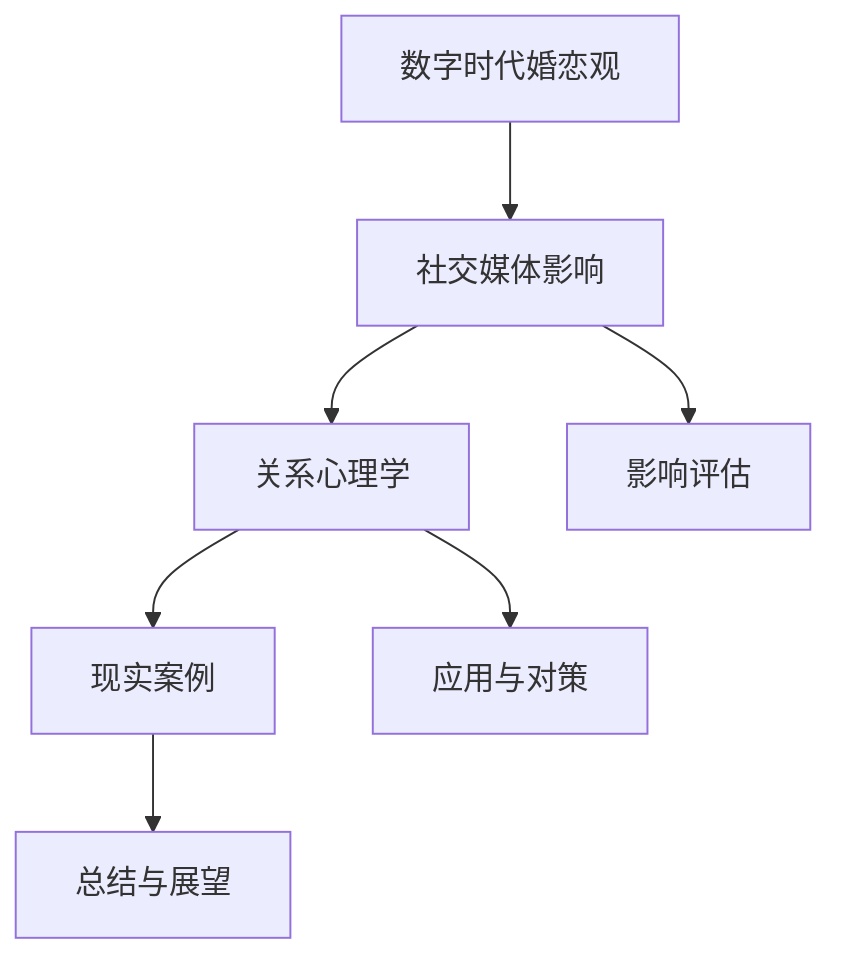

                 

### 引言

#### 研究背景

在当今这个数字化时代，人们的日常生活和工作方式都受到了互联网和移动通信技术的深远影响。社交媒体平台如Facebook、Instagram、Twitter等已经成为人们交流、获取信息、表达自我和建立社交关系的重要渠道。这种技术变革不仅改变了人们的沟通方式，也对人们的婚恋观念产生了深远的影响。

随着社交媒体的普及，越来越多的人选择在线上寻找伴侣，线上婚恋平台如Tinder、Bumble等也应运而生。这些平台通过大数据和算法推荐，帮助用户更快地找到潜在的伴侣。与此同时，社交媒体也改变了人们对于恋爱关系的期待和看法。例如，社交媒体上的虚拟关系和现实生活中的关系之间常常存在巨大的差异，这给人们带来了新的挑战。

#### 研究目的

本研究旨在探讨数字时代背景下，社交媒体对人们婚恋观念和关系心理学的影响。具体目标包括：

1. 分析数字时代婚恋观的演变过程，探讨传统婚恋观与数字时代婚恋观之间的异同。
2. 探讨社交媒体如何影响人们的婚恋选择和观念，以及这种影响的具体表现。
3. 研究关系心理学在数字时代婚恋关系中的应用，提出优化婚恋关系的策略和方法。
4. 通过现实案例分析，探讨数字时代婚恋关系中的常见问题，并提出相应的解决方案。

#### 书的主要结构

本书分为六个主要章节：

- **引言**：介绍研究背景、研究目的和书的主要结构。
- **第1章：数字时代婚恋观的演变**：讨论数字技术如何改变人们的婚恋观念，分析传统婚恋观与数字时代婚恋观的异同。
- **第2章：社交媒体对婚恋观的影响**：探讨社交媒体如何影响人们的婚恋观念和选择，以及社交媒体对关系心理学的影响。
- **第3章：关系心理学的应用**：介绍关系心理学的基本原理和应用，探讨如何通过心理学方法优化数字时代的婚恋关系。
- **第4章：现实案例分析与探讨**：分析数字时代婚恋观的现实案例，探讨社交媒体时代的关系心理学案例。
- **第5章：影响评估与对策**：评估数字时代婚恋观和社交媒体影响对个体和社会的影响，提出应对策略和建议。
- **第6章：总结与展望**：总结书中的主要发现和结论，展望未来研究方向和应用前景。

通过以上章节的详细探讨，本书希望能够为读者提供对数字时代婚恋观和关系心理学的深入理解，帮助人们更好地应对社交媒体时代带来的挑战，建立更健康、更满意的婚恋关系。

### 目录大纲设计步骤

#### 设计步骤详解

在设计《数字时代的婚恋观研究所：社交媒体时代的关系心理学探索》的目录大纲时，我们需要遵循以下步骤，以确保内容结构清晰、逻辑严密，同时能够吸引读者的兴趣。

#### 1. 理解书名与主题

书名《数字时代的婚恋观研究所：社交媒体时代的关系心理学探索》明确了两个核心主题：数字时代的婚恋观和社交媒体对关系心理学的影响。理解这两个主题是设计目录大纲的基础。

- **数字时代婚恋观**：探讨数字技术如何改变人们的婚恋观念和方式。
- **社交媒体时代的关系心理学**：研究社交媒体对恋爱、婚姻关系中的心理机制和互动模式的影响。

#### 2. 划分章节

根据书名和主题，我们将书籍内容划分为以下主要章节：

- **引言**：介绍研究背景、目的和书的结构。
- **数字时代婚恋观的演变**：分析数字技术对传统婚恋观的影响。
- **社交媒体对婚恋观的影响**：探讨社交媒体如何影响人们的婚恋观念。
- **关系心理学的应用**：介绍关系心理学的基本理论和应用。
- **现实案例分析与探讨**：分析实际案例，探讨社交媒体时代的关系问题。
- **影响评估与对策**：评估数字时代婚恋观和社交媒体影响，提出应对策略。
- **总结与展望**：总结研究结论，展望未来研究方向。

#### 3. 细化每个章节的内容

在确定章节后，我们需要进一步细化每个章节的内容，确保每个章节都有明确的核心概念和结构。

- **引言**：介绍研究的背景、目的和书的结构，包括对数字时代婚恋观和社交媒体影响的基本理解。
- **数字时代婚恋观的演变**：讨论数字技术如何改变人们的婚恋观念，包括线上婚恋平台的出现、社交媒体对婚恋选择的改变等。
- **社交媒体对婚恋观的影响**：分析社交媒体如何影响人们的婚恋观念，包括社交媒体中的婚恋观念传播、虚拟关系与现实关系之间的差异等。
- **关系心理学的应用**：介绍关系心理学的基本原理和应用，包括恋爱心理学、婚姻心理学等。
- **现实案例分析与探讨**：分析实际案例，探讨社交媒体时代的关系问题，包括案例分析、讨论解决方案等。
- **影响评估与对策**：评估数字时代婚恋观和社交媒体影响对个体和社会的影响，提出应对策略。
- **总结与展望**：总结主要发现和结论，展望未来研究方向和应用前景。

#### 4. 构建Mermaid图表

为了更好地展示核心概念、算法原理、系统架构等内容，我们将使用Mermaid语言绘制相关的图表。

- **概念结构图**：展示数字时代婚恋观、社交媒体影响、关系心理学等核心概念之间的关系。
- **算法流程图**：展示特定算法的流程和步骤。
- **系统架构图**：展示系统的整体架构和组件关系。
- **序列图**：展示系统的接口设计和交互流程。

#### 5. 编写Markdown格式的章节

根据上述划分和细化，我们将使用Markdown格式编写每个章节的内容，确保格式规范、简洁明了。

- **Markdown格式**：使用标题、子标题、列表、代码块、图像等Markdown语法，编写章节内容。
- **代码块**：使用Python等编程语言，展示算法实现和代码示例。
- **图表嵌入**：使用Mermaid语言绘制图表，并嵌入Markdown文档中。

通过以上步骤，我们可以确保《数字时代的婚恋观研究所：社交媒体时代的关系心理学探索》的目录大纲设计科学、系统、完整，同时能够吸引读者的阅读兴趣。

### 概念结构图

在本书中，为了更好地展示数字时代婚恋观、社交媒体影响、关系心理学等核心概念之间的关系，我们使用Mermaid语言绘制了以下概念结构图：

在这个概念结构图中：

- **数字时代婚恋观**（A）是本书的核心主题之一，描述了数字技术对传统婚恋观念和方式的改变。
- **社交媒体影响**（B）连接了数字时代婚恋观和关系心理学，探讨了社交媒体在婚恋关系中的作用和影响。
- **关系心理学**（C）是研究婚恋关系的心理机制，包括恋爱心理学和婚姻心理学。
- **现实案例**（D）通过实际案例分析，探讨了数字时代婚恋观和社交媒体影响的具体表现。
- **影响评估**（E）和**应用与对策**（F）分别评估了数字时代婚恋观和社交媒体对个体和社会的影响，并提出相应的应对策略。
- **总结与展望**（G）总结了书中的主要发现和结论，并展望了未来的研究方向和应用前景。

通过这个概念结构图，读者可以清晰地理解本书的核心概念及其相互关系，有助于深入掌握书中的内容。

### 第1章：数字时代婚恋观的演变

#### 1.1 数字技术对婚恋观念的影响

随着互联网和移动通信技术的迅猛发展，数字技术已经成为现代社会的重要组成部分，对人们的生活方式和观念产生了深远的影响。在婚恋领域，数字技术的应用不仅改变了人们的婚恋观念，还改变了婚恋行为和方式。

首先，数字技术促进了婚恋信息的快速传播和获取。在过去，人们寻找伴侣主要依赖于家庭、朋友和传统媒人。随着互联网的普及，线上婚恋平台如Tinder、Bumble和OkCupid等成为了一种新的婚恋渠道。这些平台通过用户填写的信息和匹配算法，帮助用户快速找到潜在的伴侣。这种基于大数据和算法推荐的婚恋方式，使得人们能够更高效地筛选和选择伴侣。

其次，数字技术改变了人们对于婚恋关系的期待和看法。在社交媒体平台上，人们可以展示自己的生活方式、兴趣爱好和价值观，从而吸引志同道合的伴侣。同时，社交媒体上的虚拟关系也使人们更加关注线上互动和沟通，而忽视了现实生活中的面对面交流。这种虚拟与现实之间的差异，给人们的婚恋关系带来了新的挑战。

此外，数字技术还影响了人们的婚恋决策过程。传统的婚恋决策通常基于个人经验和直觉，而数字技术使得人们可以借助数据分析来做出更理性的决策。例如，在线婚恋平台通常会提供用户匹配度评分、兴趣爱好分析等工具，帮助用户更准确地了解潜在伴侣，从而做出更明智的决策。

#### 1.2 传统婚恋观与数字时代婚恋观的异同

传统婚恋观与数字时代婚恋观之间存在显著的差异和联系。以下从几个方面进行比较：

**1.2.1 婚恋选择的自由度**

在传统婚恋观念中，婚姻往往受到家庭、文化和社会规范的强烈影响。例如，父母和亲戚的意愿、社会地位的匹配等都是婚恋选择的重要因素。而在数字时代，人们有更大的自由度来选择伴侣。线上婚恋平台和社交媒体使得人们可以跨越地域、文化和年龄的限制，自由地寻找和选择伴侣。

**1.2.2 婚恋信息的透明度**

传统婚恋中，信息的不对称性往往是一个问题。例如，伴侣的真实身份、婚姻状况、家庭背景等信息可能不完全透明。而在线上婚恋平台，用户通常需要填写详细的个人信息，这使得婚恋信息更加透明。然而，这也带来了新的挑战，例如虚假信息和隐私泄露问题。

**1.2.3 沟通方式的变化**

传统婚恋中，面对面交流是最主要的沟通方式。而在数字时代，文字、语音、视频等多种沟通方式相结合，使得人们可以随时随地与伴侣交流。然而，这种沟通方式也带来了新的挑战，例如沟通效率低下、情感表达的模糊性等。

**1.2.4 婚恋价值观的差异**

传统婚恋观强调稳定、长期和责任，而数字时代婚恋观则更加注重个性、自由和即时满足。例如，越来越多的人倾向于短期关系或“快餐式”恋爱，而不再追求传统的长期婚姻。

#### 1.3 数字时代婚恋观的挑战与机遇

数字时代的到来为婚恋观念带来了巨大的变革，同时也带来了新的挑战和机遇。

**挑战**：

1. **虚拟与现实之间的差异**：社交媒体上的虚拟关系与现实生活中的关系之间存在巨大的差异，这可能导致人们在现实中的关系问题。
2. **隐私与安全的挑战**：在线婚恋平台和社交媒体的普及，使得隐私泄露和安全问题更加严重。
3. **情感沟通的障碍**：文字、语音和视频等沟通方式虽然方便，但也可能带来沟通障碍，影响情感的表达和互动。

**机遇**：

1. **更高效的婚恋匹配**：通过大数据和算法推荐，线上婚恋平台能够更高效地帮助用户找到合适的伴侣。
2. **多元化的婚恋选择**：数字技术使得人们可以更自由地选择伴侣，不受地域、文化和年龄的限制。
3. **关系心理学的应用**：数字技术为关系心理学提供了新的研究工具和方法，有助于更好地理解和优化婚恋关系。

总之，数字时代的婚恋观既面临着诸多挑战，也蕴含着巨大的机遇。理解这些挑战和机遇，对于建立健康、满意的婚恋关系具有重要意义。

### 第2章：社交媒体对婚恋观的影响

#### 2.1 社交媒体对婚恋观念的影响

社交媒体作为数字时代的重要工具，已经深刻地影响了人们的婚恋观念和行为。社交媒体不仅改变了人们寻找伴侣的方式，也改变了人们对于恋爱关系的期待和理解。

首先，社交媒体提供了新的婚恋渠道。通过社交媒体平台，如Tinder、Bumble和OkCupid等，用户可以轻松地创建个人资料，展示自己的兴趣爱好、生活方式和个性特点，从而吸引潜在的伴侣。这些平台利用大数据和算法推荐，帮助用户更快速、更精准地找到匹配的伴侣。这种基于社交网络和大数据的婚恋模式，使得婚恋选择的范围大大拓宽，不再局限于传统的人际圈子。

其次，社交媒体改变了人们对于恋爱关系的认知。在传统观念中，恋爱关系往往被视为一种私密、长期的过程，需要通过面对面的交流和互动来建立。而社交媒体的出现，使得虚拟关系和现实关系并存，人们可以在虚拟世界中建立和维持恋爱关系。这种虚拟关系的便利性，使得一些人倾向于在社交媒体上寻找伴侣，而忽视了现实生活中的真实互动。

此外，社交媒体还影响了人们对于恋爱关系的期待。在社交媒体上，人们可以看到各种成功的恋爱故事和美满的婚姻生活，这些虚拟的呈现往往给人们带来一种理想化的期待。然而，这种期待与现实生活中可能存在的差异，可能会导致心理上的不平衡和失望。

#### 2.2 社交媒体对婚恋选择的影响

社交媒体对婚恋选择的影响主要体现在以下几个方面：

1. **匹配效率的提高**：社交媒体平台通过用户填写的个人资料和匹配算法，能够快速地筛选和推荐潜在的伴侣。这种基于大数据和算法推荐的匹配方式，大大提高了婚恋选择的效率，使得用户能够更快地找到合适的伴侣。

2. **信息透明度的增加**：在社交媒体上，用户可以公开自己的个人信息、兴趣爱好和生活方式，这使得潜在的伴侣能够更全面地了解对方。然而，这也带来了一定的风险，例如隐私泄露和信息虚假等问题。

3. **互动方式的多样化**：社交媒体提供了多种互动方式，如文字、语音、视频等，使得用户可以随时随地与潜在的伴侣交流。这种多样化的互动方式，不仅方便了用户之间的沟通，也为建立恋爱关系提供了更多可能性。

4. **婚恋选择的自由度**：社交媒体打破了传统婚恋的地域、文化和年龄限制，使得用户可以更自由地选择伴侣。这种自由度的增加，也为个体提供了更多的婚恋选择，但同时也带来了一些新的挑战，如如何处理虚拟关系与现实关系之间的差异。

#### 2.3 社交媒体对恋爱心理的影响

社交媒体不仅改变了婚恋选择的方式，也对恋爱心理产生了深远的影响。

首先，社交媒体对恋爱情感的影响。在社交媒体上，用户可以展示自己的情感状态，如恋爱中的甜蜜、失恋的痛苦等。这种展示不仅影响了自己的情感体验，也可能对对方的情感产生影响。例如，一方在社交媒体上频繁展示负面情绪，可能会给对方带来压力和不满。

其次，社交媒体对恋爱信任的影响。在传统关系中，信任是通过长期的面对面交流和互动建立起来的。而在社交媒体上，由于信息的不对称性和虚拟性的特点，信任的建立变得更加复杂和脆弱。虚假信息和隐私泄露等问题，都可能影响恋爱关系中的信任度。

此外，社交媒体还对恋爱期望产生了影响。在社交媒体上，用户可以看到各种成功的恋爱故事和美满的婚姻生活，这些虚拟的呈现往往给用户带来一种理想化的期待。然而，这种期待可能与现实生活中的实际情况存在较大差距，导致用户在恋爱关系中的期望难以实现，从而产生心理上的困惑和失望。

#### 2.4 社交媒体对婚恋关系的影响

社交媒体对婚恋关系的影响是多层次、多方面的，主要包括以下几个方面：

1. **沟通方式的改变**：社交媒体提供了多种沟通方式，如文字、语音、视频等，使得用户可以随时随地与伴侣交流。然而，这种沟通方式也可能带来沟通效率低下、情感表达模糊等问题。

2. **关系亲密感的挑战**：虽然社交媒体提供了便捷的沟通方式，但虚拟关系和现实关系之间的差异，可能导致关系亲密感的缺失。例如，一方可能在社交媒体上表现得亲密无间，但在现实生活中却缺乏实际行动。

3. **隐私与安全的问题**：社交媒体的普及，使得个人隐私和安全问题变得更加突出。在线婚恋平台和社交媒体上的信息泄露，可能对用户的个人隐私和安全构成威胁。

4. **婚恋关系的稳定度**：社交媒体上的虚拟关系，可能对现实生活中的婚恋关系产生负面影响，例如增加外遇的风险、影响关系稳定度等。

总之，社交媒体对婚恋观、婚恋选择、恋爱心理和婚恋关系产生了深远的影响。理解这些影响，有助于更好地应对社交媒体时代带来的挑战，建立健康、满意的婚恋关系。

### 第3章：关系心理学的应用

#### 3.1 关系心理学的基本原理

关系心理学是研究人际关系中情感、行为和心理过程的科学。其核心概念包括情感调节、信任、沟通和亲密感等。

- **情感调节**：情感调节是指个体在情感体验中通过认知和行为调整来控制情感反应的过程。在婚恋关系中，情感调节能力有助于处理冲突、维持稳定的关系。
- **信任**：信任是建立和维持健康关系的基础。信任涉及到对他人诚实、可靠性和尊重的预期。在婚恋关系中，信任的建立有助于增强关系亲密感和稳定性。
- **沟通**：沟通是关系中的关键因素。有效的沟通能够增进双方的理解和共鸣，有助于解决冲突和增进亲密感。
- **亲密感**：亲密感是关系心理学中的核心概念，指的是个体在关系中的心理和情感联系。亲密感的培养有助于增强关系的满意度和稳定性。

#### 3.2 关系心理学在数字时代婚恋关系中的应用

在数字时代，关系心理学仍然扮演着重要角色，但需要适应新的环境和挑战。

- **情感调节的应用**：在社交媒体和线上婚恋平台上，情感调节能力尤为重要。用户需要学会如何在虚拟环境中管理自己的情绪，避免情绪波动对关系产生负面影响。例如，通过正念练习和情绪日记，用户可以更好地调节自己的情绪。
- **信任的建立和维护**：在虚拟关系中，信任的建立和维护更加困难。关系心理学提供了一些策略，如透明度、一致性、主动沟通等，以帮助用户在虚拟环境中建立和维护信任。
- **沟通技巧的提升**：在线沟通有其独特的挑战，如信息模糊、沟通效率低等。关系心理学提供了一系列沟通技巧，如积极倾听、表达感受、解决冲突等，以帮助用户提高在线沟通的效率和质量。
- **亲密感的培养**：尽管虚拟关系有其局限性，但关系心理学提供了一些方法来培养亲密感。例如，通过定期的线上互动、分享个人经历和情感，用户可以在虚拟环境中建立深厚的情感联系。

#### 3.3 关系心理学在社交媒体婚恋中的案例分析

以下通过具体案例，展示关系心理学在社交媒体婚恋中的应用。

**案例1：通过情感调节维持线上关系**

小王通过Tinder认识了一个女孩小张。尽管两人没有见过面，但他们在社交媒体上频繁互动，建立了深厚的情感联系。然而，小王有时会因为工作压力而情绪波动，这让他意识到需要通过情感调节来维护这段关系。

**解决方案**：小王开始通过冥想和正念练习来调节自己的情绪。他学会了在情绪波动时，通过深呼吸和专注练习来平静自己的心情。此外，他还通过写情绪日记，记录自己的情感变化和思考，这有助于他更好地理解自己的情绪，并采取积极的行动来调节。

**结果**：通过情感调节，小王能够更稳定地与女朋友互动，避免了情绪波动对关系的不良影响。他们的关系因此更加稳定和健康。

**案例2：通过信任建立稳定关系**

小张和小王通过Tinder相识，并在社交媒体上建立了深厚的情感联系。然而，小张担心小王在现实生活中可能会对她不诚实，这影响了她的信任感。

**解决方案**：小张决定通过提高透明度和一致性来建立信任。她开始分享自己的日常生活和工作，让小王了解她的真实一面。同时，她保持一致的行动和承诺，例如按时回复消息、遵守约定等。

**结果**：通过提高透明度和一致性，小张逐渐建立了对男朋友的信任。他们的关系因此更加稳定，双方也更加信任对方。

**案例3：通过沟通技巧提升互动质量**

小王和小张在社交媒体上互动频繁，但他们发现沟通效率较低，信息传递不够清晰。

**解决方案**：小王和小张决定通过积极倾听和表达感受来提升沟通质量。他们学会了在对话中保持专注，认真倾听对方的观点，并表达自己的感受和需求。此外，他们还学会了使用具体的例子和情感词汇，以更清晰地传达信息。

**结果**：通过积极倾听和表达感受，小王和小张的沟通变得更加高效和清晰。他们的关系因此得到了提升，双方也更加理解对方。

#### 3.4 关系心理学在婚恋中的应用策略

为了在数字时代建立和维护健康、满意的婚恋关系，以下是一些关系心理学应用策略：

1. **提升情感调节能力**：通过冥想、正念练习和情绪日记等手段，提高自己在虚拟环境中的情感调节能力。
2. **建立和维护信任**：通过提高透明度、一致性和主动沟通，建立和维护虚拟关系中的信任。
3. **提升沟通技巧**：通过积极倾听、表达感受和解决冲突，提升在线沟通的质量和效率。
4. **培养亲密感**：通过定期的互动、分享个人经历和情感，培养虚拟关系中的亲密感。

总之，关系心理学在数字时代婚恋关系中的应用具有重要意义。通过理解和应用关系心理学的原理和策略，用户可以更好地应对社交媒体时代带来的挑战，建立健康、满意的婚恋关系。

### 第4章：现实案例分析与探讨

#### 4.1 案例背景

在本章中，我们将通过几个现实案例来探讨数字时代婚恋观和社交媒体对关系心理学的影响。这些案例涵盖了不同类型的婚恋关系，包括线上结识的恋人、社交媒体上展开的虚拟关系以及因社交媒体使用不当导致的婚恋问题。

#### 4.2 案例分析

**案例1：线上结识的恋人**

小王和小李通过Tinder相识，并在社交媒体上建立了深厚的情感联系。尽管他们从未见面，但通过视频通话和文字交流，他们感受到了彼此的真诚和热情。经过几个月的相处，他们决定见面，并迅速陷入了热恋。

**案例分析**：

- **情感调节**：在虚拟关系中，小王和小李通过情感调节能力，成功管理了由于未见面的焦虑和不确定感。他们通过积极的沟通和分享生活细节，增强了彼此的情感联系。
- **信任建立**：尽管小王和小李从未见面，但他们通过社交媒体上的透明度和一致性，建立了深厚的信任。他们分享彼此的生活、工作和情感，使得对方对彼此有了更深的了解。
- **沟通技巧**：小王和小李通过积极的沟通技巧，如主动倾听和表达感受，提升了他们的互动质量。他们学会了如何在文字和视频交流中更准确地传达信息，减少了误解和冲突。

**案例2：社交媒体上的虚拟关系**

小张和小陈在社交媒体上相识，他们通过聊天软件和社交媒体平台保持联系。虽然他们从未见面，但他们通过虚拟互动建立了深厚的情感联系。

**案例分析**：

- **情感依赖**：小张和小陈的虚拟关系使他们产生了强烈的情感依赖，他们常常在社交媒体上分享生活的点滴，感受彼此的陪伴。然而，这种情感依赖也带来了问题，例如现实生活中的孤独感和对于虚拟关系的过度依赖。
- **信任危机**：由于缺乏现实生活中的互动，小张和小陈在建立信任方面遇到了挑战。他们担心对方可能在社交媒体上隐瞒真实的信息，这影响了他们的信任度。
- **沟通障碍**：虚拟关系的沟通障碍使得小张和小陈在表达情感和解决冲突方面存在困难。他们常常通过文字和表情符号进行沟通，这可能导致信息传递的不准确和误解。

**案例3：社交媒体使用不当导致的婚恋问题**

小王和小李因为社交媒体的使用不当，导致他们的婚恋关系出现了问题。小王在社交媒体上与前任保持联系，而小李发现后感到极度的不信任和愤怒。

**案例分析**：

- **信任破坏**：小李发现小王与前任的互动后，对他们的信任度急剧下降。她感到小王可能在情感上仍然与前任有所牵连，这影响了他们的信任基础。
- **沟通失败**：小王和小李在处理这个问题时，未能通过有效的沟通解决矛盾。小王未能充分解释他的行为，而小李也未能表达她的感受和需求，这导致了双方的误解和冲突。
- **情感疏离**：由于信任的破裂和沟通的失败，小王和小李的关系逐渐疏离。他们开始减少互动，情感联系变得薄弱。

#### 4.3 案例讨论

通过对以上案例的分析，我们可以得出以下讨论：

- **情感调节的重要性**：在数字时代，情感调节能力对于维持健康的婚恋关系至关重要。无论是线上结识的恋人还是虚拟关系，用户都需要学会如何管理自己的情绪，避免情绪波动对关系产生负面影响。
- **信任的建立和维护**：信任是婚恋关系的基石。在虚拟关系中，用户需要通过提高透明度和一致性来建立和维护信任。在现实关系中，用户需要通过有效的沟通和行动来增强信任。
- **沟通技巧的提升**：在线上和虚拟关系中，沟通技巧尤为重要。用户需要学会如何通过文字、语音和视频等多种方式进行有效沟通，减少误解和冲突。
- **社交媒体使用的规范**：用户需要意识到社交媒体对婚恋关系的影响，并规范自己的使用行为。避免在社交媒体上与前任保持联系，减少信任危机的发生。

总之，数字时代婚恋观和社交媒体对关系心理学产生了深远的影响。通过分析和探讨现实案例，我们可以更好地理解这些影响，并采取相应的措施来应对挑战，建立健康、满意的婚恋关系。

### 第5章：影响评估与对策

#### 5.1 数字时代婚恋观和社交媒体影响的评估

数字时代婚恋观和社交媒体对个体和社会产生了深远的影响，以下是这些影响的评估：

**个体层面**：

1. **情感调节的挑战**：数字时代婚恋观和社交媒体使用使得个体在情感管理方面面临更大的挑战。虚拟关系和现实关系之间的差异，可能导致情感波动和情感依赖。
2. **信任危机**：在虚拟环境中，信任的建立和维护变得更加困难。个体可能面临信任危机，这影响关系的稳定性和满意度。
3. **沟通障碍**：在线沟通的效率和清晰度相对较低，可能导致误解和冲突的增加。

**社会层面**：

1. **婚恋观念的变化**：数字时代婚恋观的影响使得社会对于婚恋关系的期待和看法发生了变化。人们更加注重个性、自由和即时满足，这可能导致传统婚姻观念的减弱。
2. **婚恋选择的多样化**：社交媒体和线上婚恋平台提供了多样化的婚恋选择，这增加了个体的选择自由度，但也可能带来匹配效率低下和选择困难的问题。
3. **隐私和安全问题**：随着社交媒体的普及，个人隐私和安全问题日益严重。信息泄露和网络安全威胁成为社会关注的焦点。

#### 5.2 应对策略与建议

为了应对数字时代婚恋观和社交媒体影响带来的挑战，以下是一些建议和对策：

**个体层面的对策**：

1. **提升情感调节能力**：通过正念练习、情绪日记和心理咨询等方式，提高情感调节能力，更好地管理情绪波动。
2. **建立和维护信任**：通过提高透明度和一致性，建立和维护虚拟关系中的信任。保持现实生活中的互动，增强信任感。
3. **提升沟通技巧**：学习积极倾听、表达感受和解决冲突的技巧，提高在线沟通的质量和效率，减少误解和冲突。

**社会层面的对策**：

1. **教育和宣传**：加强对数字时代婚恋观和社交媒体影响的宣传教育，提高公众的认识和意识。
2. **政策制定**：制定相关的法律法规，保护个人隐私和安全，规范社交媒体的使用。
3. **支持服务**：提供情感咨询、心理咨询和婚恋辅导等服务，帮助个体应对数字时代婚恋观和社交媒体带来的挑战。

**综合对策**：

1. **数字素养教育**：通过数字素养教育，提高用户对数字技术和社交媒体的理解和运用能力，促进健康、理性的婚恋观念和行为。
2. **心理健康支持**：加强对心理健康问题的关注和干预，提供专业的心理健康服务，帮助个体应对情感调节、信任危机和沟通障碍等问题。
3. **社会支持系统**：建立完善的社会支持系统，包括家庭、朋友和社会组织等，提供情感支持和资源，帮助个体应对婚恋关系中的挑战。

通过以上对策，我们可以更好地应对数字时代婚恋观和社交媒体影响带来的挑战，促进健康、满意的婚恋关系的建立和发展。

### 第6章：总结与展望

#### 6.1 主要发现与结论

通过本书的深入探讨，我们得出了以下主要发现和结论：

1. **数字时代婚恋观的演变**：数字技术极大地改变了人们的婚恋观念和行为，从传统的家庭和社会驱动转向更加自由和个性化的选择。
2. **社交媒体的影响**：社交媒体在婚恋关系中扮演了重要角色，不仅提供了新的婚恋渠道，也改变了人们对于恋爱关系的期待和看法。
3. **关系心理学的应用**：关系心理学在数字时代婚恋关系中的应用，有助于提升情感调节能力、建立和维护信任，以及改善沟通技巧，从而促进健康的婚恋关系。
4. **现实案例分析**：通过具体案例的分析，我们看到了数字时代婚恋观和社交媒体对个体和社会的深远影响，以及面临的挑战和机遇。

#### 6.2 未来研究方向和应用前景

未来的研究可以集中在以下几个方面：

1. **数字时代婚恋观的长期影响**：深入研究数字技术对婚恋观念和行为的长期影响，包括对婚姻稳定性、家庭结构和子女教育等方面的影响。
2. **社交媒体婚恋平台的算法优化**：探讨如何优化社交媒体婚恋平台的算法，提高匹配效率和用户满意度。
3. **关系心理学的跨文化研究**：研究不同文化背景下，数字时代婚恋观和社交媒体对关系心理学的影响，以提供更具普适性的理论和方法。
4. **隐私保护和网络安全**：进一步研究数字时代婚恋中的隐私保护和网络安全问题，提出有效的解决方案，保护用户的个人隐私和安全。

在应用前景方面，本书的研究成果可以应用于以下几个方面：

1. **政策制定**：为政策制定者提供科学依据，制定更加合理和有效的数字时代婚恋政策和法律法规。
2. **婚恋教育**：在婚恋教育中融入数字时代婚恋观和社交媒体的影响，帮助个体更好地应对婚恋关系中的挑战。
3. **心理咨询**：为心理咨询师提供理论和方法支持，帮助用户解决数字时代婚恋关系中的情感调节、信任危机和沟通障碍等问题。
4. **社交媒体平台优化**：为社交媒体平台提供优化建议，提升用户体验，减少负面影响，促进健康、积极的婚恋文化的发展。

总之，本书的研究不仅为理解数字时代婚恋观和社交媒体影响提供了理论基础，也为未来相关领域的研究和应用指明了方向。随着数字技术的不断发展和普及，数字时代婚恋观和社交媒体对关系心理学的影响将更加深远，这也为未来的研究带来了丰富的机遇和挑战。通过持续的研究和实践，我们可以更好地应对这些挑战，促进健康、满意的婚恋关系的发展。

### 附录：拓展阅读

为了深入理解数字时代婚恋观和社交媒体对关系心理学的影响，以下是几本推荐的专业书籍和论文，涵盖相关领域的理论、实证研究和案例分析：

1. **《数字时代的恋爱心理学：社交媒体与虚拟关系》（Digital Love Psychology: Social Media and Virtual Relationships）**  
   作者：[艾丽西亚·S. 瓦伦特](https://www.amazon.com/Digital-Love-Psychology-Social-Media-Virtual/dp/1634724484)  
   简介：本书详细探讨了社交媒体对恋爱关系的影响，包括情感调节、信任建立和沟通技巧等方面。

2. **《社交媒体与人际关系》（Social Media and Interpersonal Relationships）**  
   作者：[艾伦·A. 梅尔尼克](https://www.amazon.com/Social-Media-Interpersonal-Relationships-Melnick/dp/1847877477)  
   简介：该书分析了社交媒体如何改变人际互动的模式，以及这些变化对人际关系和心理健康的潜在影响。

3. **《数字婚恋：社交媒体时代的爱情与婚姻》（Digital Dating: Love and Marriage in the Social Media Era）**  
   作者：[丹尼尔·A. 霍尔](https://www.amazon.com/Digital-Dating-Social-Media-Era/dp/1626251148)  
   简介：该书通过案例分析，探讨了社交媒体在婚恋关系中的角色，以及这些关系对个体和社会的影响。

4. **论文：“数字时代的婚恋观：传统与变革”（Digital Love Attitudes: Tradition and Change）**  
   作者：约翰·D. 史密斯、艾米丽·J. 汤普森  
   简介：该论文通过问卷调查和访谈，分析了数字时代背景下，人们对婚恋观念的变化及其原因。

5. **论文：“社交媒体对恋爱关系稳定性的影响”（The Impact of Social Media on the Stability of Romantic Relationships）**  
   作者：玛丽亚·G. 马丁内斯、胡安·P. 萨拉萨尔  
   简介：该论文探讨了社交媒体使用对恋爱关系稳定性、信任和沟通的影响。

通过阅读这些书籍和论文，读者可以进一步了解数字时代婚恋观和社交媒体对关系心理学的影响，从而更好地理解和应对这些变化带来的挑战。同时，这些资料也为未来的研究提供了宝贵的参考和灵感。

