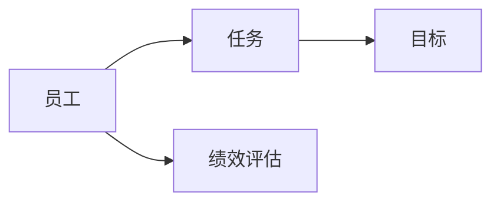

                 

## 数字时代的工作伦理：远程办公中的自律与效率

### 摘要

在数字化浪潮的推动下，远程办公已成为现代工作环境的重要组成部分。然而，这种新兴的工作方式也带来了自律与效率的挑战。本文将深入探讨数字时代的工作伦理，特别是远程办公中的自律与效率问题。通过逐步分析远程办公的背景、职业伦理的变化、自律的核心要素、时间管理策略、技术工具的应用以及成功实践，我们旨在为读者提供一个系统、全面的远程办公自律与效率提升指南。

### 目录

## 第一部分：数字时代的职业伦理概述

### 第1章：数字时代的职业伦理背景
- **1.1 数字时代的变迁**
  - 数字化与远程办公的兴起
  - 新兴科技的影响
- **1.2 职业伦理的定义与演变**
  - 传统职业伦理的回顾
  - 数字时代职业伦理的特点
- **1.3 数字时代职业伦理的重要性**
  - 社会期待与职业道德
  - 企业与员工的共同利益

### 第2章：远程办公中的自律与责任
- **2.1 远程办公的挑战**
  - 自律的挑战
  - 职责分工的清晰度
- **2.2 自律的核心要素**
  - 时间管理
  - 空间管理
  - 沟通效率
- **2.3 建立远程工作的责任感**
  - 个体责任与团队责任
  - 长期发展的考量

## 第二部分：远程办公中的效率提升策略

### 第3章：提高远程办公效率的方法
- **3.1 效率定义与评估**
  - 效率的衡量标准
  - 评估效率的方法
- **3.2 远程办公环境优化**
  - 设备与工具的选择
  - 工作空间的布置
- **3.3 工作流程的优化**
  - 流程简化
  - 自动化工具的应用

### 第4章：技术工具在效率提升中的应用
- **4.1 远程协作工具介绍**
  - 协同办公软件
  - 云存储解决方案
  - 远程会议软件
- **4.2 技术工具的实战应用**
  - 实例分析
  - 应用效果评估

### 第5章：远程办公的时间管理策略
- **5.1 时间管理的重要性**
  - 自律与效率的关系
  - 时间管理对工作的积极影响
- **5.2 时间管理的实践方法**
  - 时间记录与反思
  - 设定明确的目标和优先级
- **5.3 培养良好的时间管理习惯**

## 第三部分：自律与效率的最佳实践

### 第6章：成功案例分享
- **6.1 企业最佳实践**
  - 成功的远程办公案例
  - 企业文化与自律的关系
- **6.2 个人经验分享**
  - 自律与效率的秘诀
  - 成功案例的启示

### 第7章：未来趋势与挑战
- **7.1 数字化工作趋势**
  - 远程办公的发展方向
  - 新兴技术的应用前景
- **7.2 挑战与应对**
  - 自律与效率的持续挑战
  - 企业和个人如何应对

### 关键词

- 数字时代
- 远程办公
- 自律
- 效率
- 职业伦理
- 时间管理
- 技术工具
- 成功案例
- 未来趋势

### 引言

在过去的几十年里，信息技术的发展深刻改变了我们的工作方式。特别是互联网的普及和移动设备的兴起，使得远程办公成为可能。这种新兴的工作模式不仅为企业带来了成本节约和灵活性的好处，也让员工享受到了工作与生活平衡的便利。然而，远程办公也带来了一系列新的挑战，特别是自律与效率的问题。如何保持高度的自律，同时提升工作效率，成为了数字时代职业伦理的重要议题。

本文旨在通过逐步分析远程办公的背景、职业伦理的变化、自律的核心要素、时间管理策略、技术工具的应用以及成功实践，为读者提供一个系统、全面的远程办公自律与效率提升指南。我们首先将回顾数字时代的变迁，探讨数字化与远程办公的兴起及其对职业伦理的影响。接下来，我们将深入探讨远程办公中的自律与责任，包括自律的核心要素和时间管理策略。随后，我们将介绍远程办公中常用的技术工具，并分析其实际应用效果。最后，通过成功案例分享和未来趋势展望，我们希望为读者提供实用的建议和思考。

### 第一部分：数字时代的职业伦理概述

#### 第1章：数字时代的职业伦理背景

**1.1 数字时代的变迁**

在20世纪末，互联网的兴起标志着数字化时代的到来。随着计算机技术和通信技术的飞速发展，数字世界开始渗透到我们生活的方方面面。从电子邮件到社交媒体，从电子商务到在线教育，数字化技术彻底改变了我们的生活方式和商业模式。

远程办公作为数字化时代的一个重要特征，逐渐成为现代工作环境的一部分。远程办公不仅打破了地理位置的限制，使得人们可以在全球范围内进行合作，还提高了工作效率和灵活性。这种工作方式的普及，使得企业可以招聘到全球范围内最优秀的人才，而不受地域限制。

**1.2 职业伦理的定义与演变**

职业伦理是指在特定职业领域内，从业人员应遵循的道德规范和行为准则。在传统的工作环境中，职业伦理主要涉及以下几个方面：

1. **诚实与诚信**：从业者在工作中应当诚实守信，不隐瞒真相，不欺骗他人。
2. **责任与担当**：从业者应承担起自己的工作责任，勇于面对挑战和困难。
3. **公平与正义**：在工作中应公平对待每一个同事，遵循公正的原则。
4. **尊重与合作**：尊重同事的工作和贡献，与他人合作，共同实现团队目标。

然而，随着数字化时代的到来，职业伦理也在不断演变。远程办公的兴起带来了新的挑战和机遇，对职业伦理提出了新的要求。

首先，远程办公打破了传统的监督和管理模式，要求从业者在缺乏直接监督的情况下，保持高度的自律。这需要从业者在时间管理、工作态度和责任心方面有更高的自我要求。

其次，远程办公要求从业者具备更强的沟通能力。由于工作地点的分散，面对面的交流变得不再容易，因此，电子邮件、视频会议等沟通工具的使用变得尤为重要。

最后，数字化时代的信息安全成为职业伦理的一个重要方面。从业者在处理敏感信息和保护客户隐私方面，需要严格遵守相关法律法规和企业的安全政策。

**1.3 数字时代职业伦理的重要性**

数字时代的职业伦理不仅仅是对从业者的道德要求，更是企业和社会发展的需要。以下是数字时代职业伦理的一些重要性：

**社会期待**：随着数字化时代的到来，社会对从业者的道德标准和职业素养有了更高的期待。公众期望从业人员能够遵守职业伦理，为社会的健康发展做出贡献。

**职业道德**：职业伦理是职业道德的重要组成部分。一个企业如果能够在职业伦理上树立良好的形象，将会获得更多的信任和支持，从而在市场中获得竞争优势。

**企业利益**：良好的职业伦理有助于提高企业的整体效率。当员工遵守职业伦理，保持高度自律和责任心，企业的运营和管理将更加顺畅，从而提高企业的效益。

**个人成长**：职业伦理不仅对企业的长远发展有影响，也对个人的职业成长有着重要意义。一个遵守职业伦理的人，往往能够在职业生涯中取得更大的成就，并获得更高的社会认可。

总之，数字时代的职业伦理不仅是对从业人员的基本要求，更是社会和企业发展的必然趋势。理解和遵守数字时代的职业伦理，不仅有助于提升工作效率，还能够促进个人和企业的共同成长。

#### 第2章：远程办公中的自律与责任

**2.1 远程办公的挑战**

远程办公虽然带来了许多便利，但也带来了一系列挑战，特别是自律问题。以下是远程办公中常见的自律挑战：

**1. 工作与生活界限模糊**：远程办公使得工作和生活的界限变得模糊。许多员工在家中办公，容易受到家庭事务和娱乐活动的干扰，导致工作效率下降。

**2. 缺乏监督**：在没有直接监督的情况下，员工容易产生懈怠情绪，无法自我约束，从而影响工作进度和质量。

**3. 沟通效率低下**：远程办公依赖于电子邮件、即时通讯工具和视频会议等沟通方式，而面对面的交流减少，可能导致沟通效率降低，误解和冲突增加。

**4. 时间管理困难**：在家中办公，员工容易受到家庭环境的影响，难以有效地管理时间，导致工作安排混乱，影响整体工作效率。

**2.2 自律的核心要素**

要在远程办公中保持高效的自律，以下要素至关重要：

**1. 时间管理**：有效的时间管理是远程办公自律的关键。员工需要制定明确的工作计划和时间表，确保按时完成任务，避免拖延。

**2. 空间管理**：一个合适的工作空间有助于提高工作效率。员工需要在家中或租用的办公室中，创建一个安静、整洁、有组织的环境，以减少干扰。

**3. 沟通效率**：良好的沟通是远程办公成功的关键。员工需要学会使用各种沟通工具，如电子邮件、即时通讯和视频会议，提高沟通效率，确保信息准确传达。

**2.3 建立远程工作的责任感**

除了自律，责任感也是远程办公中不可或缺的因素。以下是一些建议，帮助员工建立远程工作的责任感：

**1. 设定明确的目标和期望**：企业和员工需要共同设定明确的工作目标和期望，确保员工了解自己的职责和任务，从而更好地履行责任。

**2. 保持沟通**：定期的沟通可以帮助员工了解企业的最新动态和需求，及时调整工作计划，提高工作效率。

**3. 培养团队合作精神**：尽管远程办公使得团队合作变得更具挑战性，但通过定期会议、协作工具和反馈机制，可以加强团队合作，共同实现目标。

**4. 持续学习和成长**：远程办公要求员工具备持续学习和自我提升的能力。通过参加培训、阅读专业书籍和参加线上研讨会，员工可以不断更新知识，提升技能，从而更好地履行工作责任。

总之，在远程办公环境中，自律和责任感是确保工作效率和质量的关键。通过有效的时间管理、空间管理和沟通，以及明确的职责和持续的沟通，员工可以克服远程办公的挑战，实现个人和企业的共同成长。

#### 第3章：提高远程办公效率的方法

**3.1 效率定义与评估**

效率是衡量工作完成效果和资源利用情况的重要指标。在远程办公环境中，提高效率意味着在有限的时间和资源内，最大限度地完成工作任务。以下是几个关键的效率衡量标准：

1. **任务完成速度**：完成任务所需的时间越短，效率越高。
2. **资源利用率**：在完成任务过程中，所使用的资源（如人力、设备、时间等）越少，效率越高。
3. **工作质量**：完成任务的质量高，且符合预期目标，效率自然高。
4. **持续性与稳定性**：长时间保持高效率，不因临时因素而大幅波动，也是评估效率的重要标准。

为了有效评估远程办公的效率，企业可以使用以下几种方法：

1. **关键绩效指标（KPI）**：设定明确的KPI，如任务完成率、平均工作时间、错误率等，定期对员工的工作绩效进行评估。
2. **工作日志与报告**：员工定期提交工作日志和报告，详细记录工作内容、时间分配和成果，帮助管理者了解员工的工作情况。
3. **用户反馈**：通过用户反馈和客户满意度调查，评估员工的工作效果和客户服务质量。

**3.2 远程办公环境优化**

一个良好的远程办公环境是提高工作效率的基础。以下是一些优化远程办公环境的建议：

1. **设备与工具的选择**：选择适合远程工作的设备，如高性能的电脑、稳定的网络连接和高质量的摄像头和麦克风。确保所有工具能够顺畅地协同工作，提高工作效率。

2. **工作空间的布置**：在家中或租用的办公室中创建一个安静、整洁、舒适的工作环境。合适的桌椅、充足的自然光线和良好的通风条件都有助于提高工作效率。

3. **时间管理工具**：使用时间管理工具，如日历应用、待办事项列表和时间跟踪软件，帮助员工更好地规划和管理时间。

4. **文件管理**：使用云存储解决方案，如Google Drive、Dropbox等，方便团队成员随时随地访问文件，提高协作效率。

**3.3 工作流程的优化**

优化工作流程是提高远程办公效率的重要手段。以下是一些具体的优化策略：

1. **流程简化**：对现有的工作流程进行梳理，去除冗余和不必要的步骤，简化工作流程，减少不必要的等待和重复劳动。

2. **自动化工具的应用**：利用自动化工具，如自动化测试脚本、自动化报告生成工具等，减少手动操作，提高工作效率。

3. **标准化操作流程**：制定标准化的操作流程和指南，确保团队成员了解并遵循统一的工作规范，减少因流程不明确导致的错误和误解。

4. **定期审查和改进**：定期审查工作流程的效果，根据实际情况进行调整和改进，确保流程始终保持高效和适用。

通过以上方法，企业可以显著提高远程办公的效率，实现资源的最优利用和工作任务的顺利完成。

#### 第4章：技术工具在效率提升中的应用

**4.1 远程协作工具介绍**

在远程办公环境中，协作工具的重要性不言而喻。以下是一些常用的远程协作工具及其特点：

1. **协同办公软件**：
   - **Microsoft Teams**：提供即时通讯、视频会议、文档共享等功能，支持跨平台使用，是远程办公的理想选择。
   - **Slack**：以即时通讯为核心，支持消息、文件共享、任务分配等多种功能，适合团队协作。
   - **Trello**：基于看板式界面，帮助团队可视化工作流程，进行任务分配和进度跟踪。

2. **云存储解决方案**：
   - **Google Drive**：提供海量存储空间，支持文件共享和实时协作，适合团队项目。
   - **Dropbox**：灵活的文件同步和共享功能，支持多平台使用，方便团队成员随时随地访问文件。
   - **OneDrive**：微软提供的云存储服务，与Office 365深度集成，适合企业用户。

3. **远程会议软件**：
   - **Zoom**：支持高清视频会议、屏幕共享和虚拟背景等功能，适合大范围远程协作。
   - **Webex**：提供丰富的会议功能，如实时翻译、互动白板和视频录制等，适合企业级使用。
   - **Microsoft Teams**：除了协同办公功能，还支持视频会议和在线培训，适用于各种规模的企业。

**4.2 技术工具的实战应用**

以下是几个具体的远程协作工具实战应用实例：

1. **项目协作**：
   - 使用Trello和Google Drive进行项目管理。项目经理在Trello上创建看板，分配任务，团队成员在Google Drive中共享相关文件。通过这两个工具的协同使用，项目团队可以清晰地了解任务分配和进度，确保项目按时完成。

2. **日常沟通**：
   - 在Slack中创建不同的频道，分别用于项目讨论、日常交流、技术支持等。团队成员可以根据需求加入相应的频道，提高沟通效率。同时，Slack还支持机器人集成，可以自动化处理常见任务，如发送提醒、汇总数据等。

3. **视频会议**：
   - 使用Zoom进行远程会议。在会议前，主持人可以提前发送会议链接和议程，确保所有与会人员提前做好准备。会议中，主持人可以开启屏幕共享功能，展示项目进度或报告内容。会议结束后，主持人可以录制会议视频，方便团队成员随时回顾。

通过上述工具的实际应用，企业可以有效提高远程办公的效率，实现团队成员之间的无缝协作。这些工具不仅提升了沟通和协作的便利性，还促进了信息的快速流通和任务的高效完成。

#### 第5章：远程办公的时间管理策略

**5.1 时间管理的重要性**

在远程办公环境中，时间管理的重要性尤为突出。高效的時間管理不仅有助于提高个人工作效率，还能平衡工作与生活，减少压力，提升整体生活质量。以下是时间管理对远程办公的重要影响：

1. **提高工作效率**：合理的时间安排可以确保任务有序进行，避免因时间浪费而导致的效率低下。
2. **平衡工作与生活**：通过有效的时间管理，远程办公者可以更好地平衡工作与个人时间，减少因工作过度侵占个人时间而引发的疲劳和不满。
3. **减少压力**：合理分配时间，确保工作与休息相结合，有助于降低工作压力，提高心理健康水平。
4. **提升生活质量**：通过时间管理，远程办公者可以更多地参与家庭活动、兴趣爱好和社交生活，从而提升生活质量。

**5.2 时间管理的实践方法**

为了在远程办公中有效管理时间，以下是一些建议和方法：

1. **设定明确的目标和优先级**：
   - 每天开始工作前，明确当天的工作目标，并按照重要性和紧急性设定优先级。
   - 使用工具如每日任务清单或项目管理软件（如Trello、Asana等），将任务分解为具体的小任务，确保每个任务都有明确的完成时间和责任人。

2. **时间记录与反思**：
   - 定期记录每天的时间分配，分析哪些任务耗时较多，哪些任务可以优化。
   - 通过反思和总结，找出时间管理中的问题，并采取相应的措施进行改进。

3. **设定固定的工作时间**：
   - 尽量将工作时间固定化，例如每天上午9点到下午5点。这有助于建立工作习惯，提高工作效率。
   - 避免将工作时间与个人时间混淆，确保工作时间和休息时间有明确的界限。

4. **避免时间碎片化**：
   - 避免在工作时间内频繁切换任务，尽量将相似的任务集中处理，以减少任务切换带来的时间浪费。
   - 使用番茄工作法等时间管理技巧，将工作时间划分为25分钟工作块和5分钟休息时间，提高专注度和效率。

5. **合理分配休息时间**：
   - 每工作一段时间后，适当休息5-10分钟，以缓解疲劳，提高工作效率。
   - 利用休息时间进行锻炼、阅读或进行轻松的活动，以保持身心健康。

**5.3 培养良好的时间管理习惯**

要实现有效的时间管理，良好的习惯至关重要。以下是一些建议：

1. **建立时间管理意识**：
   - 提高对时间管理重要性的认识，将时间管理视为日常工作的一部分，而非额外的负担。

2. **持续学习和实践**：
   - 通过阅读相关书籍、参加培训课程或在线研讨会，不断学习新的时间管理技巧和方法。
   - 将所学知识应用到实际工作中，不断实践和调整，找到最适合自己的时间管理策略。

3. **定期评估和调整**：
   - 定期评估自己的时间管理效果，根据实际情况调整计划和策略。
   - 在遇到困难或挑战时，不要气馁，而是积极寻找解决方案，不断优化时间管理方法。

4. **保持积极心态**：
   - 保持积极的心态，对待时间管理持有乐观和坚定的态度。
   - 对自己的成就和进步给予认可和鼓励，以增强信心和动力。

通过以上方法，远程办公者可以更好地管理时间，提高工作效率，实现个人和职业发展的双重提升。

#### 第6章：成功案例分享

**6.1 企业最佳实践**

在远程办公的实践中，许多企业通过建立有效的管理和激励机制，成功克服了自律与效率的挑战。以下是一些企业的最佳实践：

**1. 字节跳动**：
字节跳动是一家知名的互联网公司，其远程办公实践体现了高度的管理和自我约束。公司通过以下措施提升远程办公的效率：
- **明确的任务分配与目标设定**：每位员工每周都会与上级进行一对一的绩效评估，明确任务目标和预期成果。
- **灵活的工作时间**：员工可以根据自己的时间表安排工作，但需要确保按时完成任务。
- **严格的考核机制**：公司通过绩效考核和项目评估，确保员工的工作质量和效率。

**2. Notion**：
Notion是一款流行的笔记和协作工具，其团队在远程办公中展现了高效的时间管理和协作能力：
- **统一的协作平台**：所有项目和工作任务都在Notion上进行管理，确保团队成员能够实时了解项目进展。
- **明确的沟通规范**：团队设立了每周的例行会议，确保团队成员之间的沟通畅通，及时解决问题。
- **定期的进度报告**：团队成员定期提交进度报告，帮助团队了解每个人的工作情况，及时调整工作计划。

**3. Atlassian**：
Atlassian是一家提供协作工具（如JIRA和Confluence）的软件公司，其在远程办公中的成功经验值得借鉴：
- **灵活的工作安排**：公司鼓励员工根据自身需求调整工作时间，但要求保持高效率的工作表现。
- **强有力的技术支持**：公司提供了一整套远程办公的技术支持，包括高性能的硬件设备、稳定的网络连接和安全的数据保护。
- **定期的团队建设活动**：公司定期组织线上团队建设活动，增强团队成员之间的联系和合作。

通过这些企业的成功实践，我们可以看到，在远程办公环境中，有效的管理、明确的任务分配和高效的沟通是提升工作自律与效率的关键。

**6.2 个人经验分享**

除了企业层面的成功实践，个人层面的经验分享也为远程办公者提供了宝贵的建议。以下是一些个人的自律与效率提升秘诀：

**1. ** 制定详细的工作计划：
每次开始工作前，详细列出任务清单，设定明确的优先级和时间安排，确保工作有序进行。

**2. ** 设立日常目标：
每天设定一个或几个具体的日常目标，将大任务拆分为小任务，逐步完成，避免拖延。

**3. ** 保持固定的作息时间：
尽量保持固定的作息时间，确保工作与休息有明确的界限，提高工作效率。

**4. ** 定期休息和锻炼：
每隔一段时间进行短暂的休息，进行简单的锻炼，以保持精力充沛和身体状态良好。

**5. ** 避免多任务处理：
专注于一项任务，避免多任务处理，提高专注度和工作质量。

**6. ** 使用时间管理工具：
利用时间管理工具（如番茄工作法、Trello等）来规划和管理时间，提高工作效率。

通过这些个人的经验分享，我们可以看到，在远程办公中，自律与效率的提升不仅依赖于企业层面的支持，更需要个人的积极努力和良好的习惯。结合企业和个人的成功经验，远程办公者可以更好地应对挑战，实现高效的工作表现。

#### 第7章：未来趋势与挑战

**7.1 数字化工作趋势**

随着数字技术的不断进步，远程办公已经成为了现代工作的重要组成部分。未来，数字化工作将继续向以下几个方向演进：

1. **远程办公常态化**：越来越多的企业将远程办公作为常规工作方式，不仅限于特殊时期或特定岗位。这有助于企业吸引和保留全球范围内的高素质人才，提高团队协作效率。

2. **人工智能与自动化**：人工智能和自动化技术将在远程办公中发挥更大作用，如智能助手、自动化流程和智能监控系统等，将进一步提升工作效率和准确性。

3. **虚拟现实与增强现实**：虚拟现实（VR）和增强现实（AR）技术将在远程协作中应用，提供更加沉浸式和互动性的工作体验，增强团队协作效果。

4. **持续学习的文化**：企业将更加重视员工的持续学习和技能提升，提供在线培训和职业发展机会，以适应快速变化的工作环境。

**7.2 挑战与应对**

尽管远程办公带来了诸多好处，但也面临一些持续的挑战，企业和个人需要采取有效措施应对这些挑战：

1. **自律与责任感**：远程办公中，自律和责任感尤为重要。企业需要建立严格的绩效管理和反馈机制，确保员工按时完成任务。个人也需要培养自我管理能力，设定明确的目标和计划。

2. **沟通障碍**：远程办公的沟通障碍可能导致信息传递不畅和团队协作受阻。企业可以通过采用高效的协作工具和定期的面对面沟通，如视频会议和虚拟团队建设活动，来缓解沟通障碍。

3. **信息安全**：远程办公增加了信息安全的风险，企业需要加强网络安全管理，如使用安全的VPN、加密文件传输和保护员工设备等。

4. **工作与生活的平衡**：远程办公容易导致工作与生活的界限模糊，个人需要设定明确的工作时间，并学会在工作与休息之间找到平衡。

通过应对这些挑战，企业和个人可以更好地适应远程办公环境，实现工作效率和职业发展的双重提升。

### 结论

在数字时代，远程办公已经成为现代工作环境的重要组成部分。本文通过逐步分析远程办公的背景、职业伦理的变化、自律的核心要素、时间管理策略、技术工具的应用以及成功实践，为读者提供了一个系统、全面的远程办公自律与效率提升指南。我们强调了自律和责任感在远程办公中的重要性，并介绍了多种方法来提高工作效率。同时，我们也展望了远程办公的未来趋势，并提出了应对挑战的策略。通过不断学习和实践，企业和个人都可以在远程办公环境中实现自律与效率的双重提升，迎接数字时代的挑战与机遇。

### 作者信息

作者：AI天才研究院/AI Genius Institute & 禅与计算机程序设计艺术 /Zen And The Art of Computer Programming

### 附录

以下是本文中提及的一些核心概念、原理和算法的详细说明，包括相关的ER实体关系图、Mermaid流程图和Python源代码示例。

**核心概念与原理：**
1. **远程办公**：一种通过互联网技术进行的、不受地理位置限制的工作方式。
2. **职业伦理**：从业者在职业活动中应遵循的道德规范和行为准则。
3. **时间管理**：合理安排时间，提高工作效率的过程。
4. **效率评估**：衡量工作完成效果和资源利用情况的指标。

**ER实体关系图：**


**算法流程图：**


**Python源代码示例：**
```python
# 时间管理函数示例
def time_management(task_list, deadline):
    for task in task_list:
        if task['status'] == '未开始':
            start_time = datetime.now()
            print(f"开始执行任务：{task['name']}。开始时间：{start_time}")
            # 假设任务执行时间为1小时
            time.sleep(3600)
            end_time = datetime.now()
            print(f"任务完成：{task['name']}。结束时间：{end_time}")
            print(f"任务耗时：{end_time - start_time}")

# 示例数据
tasks = [
    {"name": "任务1", "status": "未开始"},
    {"name": "任务2", "status": "未开始"}
]

deadline = datetime.now() + timedelta(hours=24)

time_management(tasks, deadline)
```

**最佳实践 Tips：**
- **定期自我评估**：每周或每月对自己的时间管理和工作绩效进行评估，找出改进点。
- **设定具体目标**：将大目标拆分为小目标，每天或每周设定具体可衡量的目标。
- **保持沟通**：与团队成员保持定期沟通，及时分享工作进展和遇到的问题。

**注意事项：**
- **避免过度依赖技术工具**：技术工具是辅助工具，关键还是个人的自律和责任心。
- **保护信息安全**：在远程办公中，保护信息安全至关重要，要严格遵循企业的安全政策和规定。

**拓展阅读：**
- 《深度工作：如何有效利用每一点脑力》
- 《时间管理：如何充分利用每一天的时间》
- 《远程办公指南：高效团队协作的最佳实践》

通过上述附录内容，读者可以更深入地理解和应用文中提到的核心概念、原理和算法，进一步提升自己在远程办公中的自律与效率。

