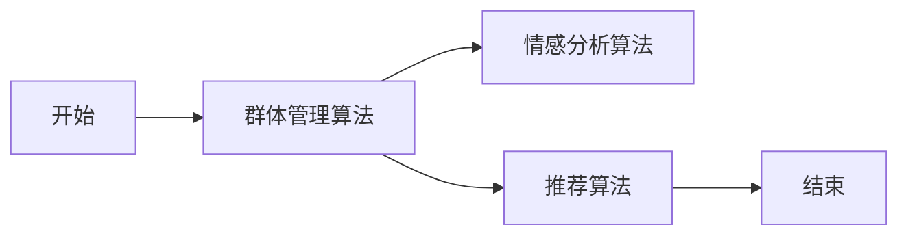
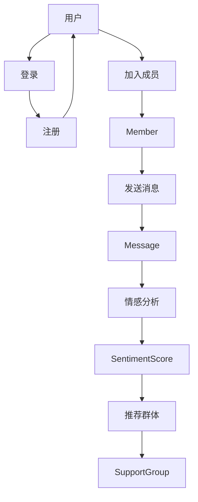
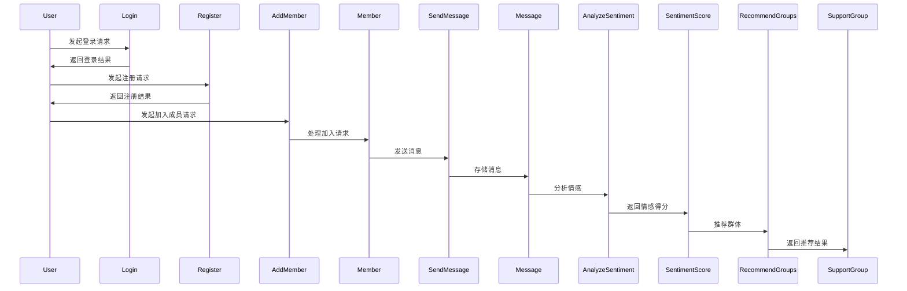
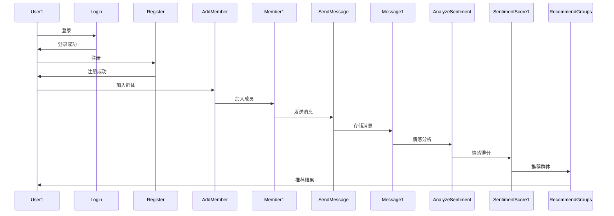

                 

# 数字时代的心理健康普及：在线支持群体的建立与管理

> 关键词：心理健康，在线支持群体，数字时代，心理健康普及，管理策略

> 摘要：随着数字化时代的到来，心理健康问题日益突出，本文旨在探讨如何利用在线支持群体来普及心理健康知识，提升人们的心理健康水平。文章从背景介绍、核心概念与联系、算法原理讲解、系统分析与架构设计方案、项目实战以及最佳实践 tips 和注意事项等方面展开，提供了一套完整的在线支持群体建立与管理的策略和方法。

## 背景介绍

### 心理健康问题的背景

在数字时代，人们的心理健康问题日益严重。长时间的屏幕时间、社交隔离、工作压力等都在影响着人们的心理健康。根据世界卫生组织（WHO）的数据，全球约有 3.5 亿人患有抑郁症，还有更多的人面临着焦虑、压力等心理健康问题。心理健康问题的普遍性和严重性使得我们需要寻找有效的解决方案。

### 在线支持群体的概念及其重要性

在线支持群体是通过互联网连接的，旨在为心理健康问题的患者提供支持和帮助的社群。这些群体通过论坛、社交媒体、在线聊天等方式，为成员提供信息共享、情感支持、互助共勉的平台。在线支持群体的建立和管理对于提升心理健康水平具有重要意义。

### 本文的目标读者群体

本文的目标读者包括心理健康领域的研究人员、心理医生、在线平台开发者、心理健康志愿者以及对心理健康问题感兴趣的一般公众。

## 核心概念与联系

### 心理健康、心理健康问题、在线支持群体的定义

- **心理健康**：心理健康是指个体在认知、情感、行为和社会功能方面处于良好的状态，能够有效地应对生活中的压力和挑战。
- **心理健康问题**：心理健康问题是指个体在认知、情感、行为和社会功能方面出现异常，导致其无法有效地应对生活中的压力和挑战。
- **在线支持群体**：在线支持群体是通过互联网连接的，旨在为心理健康问题的患者提供支持和帮助的社群。

### 核心概念属性特征对比表格

| 核心概念 | 定义 | 特征 |
| --- | --- | --- |
| 心理健康 | 个体在认知、情感、行为和社会功能方面处于良好的状态 | 良好的心理状态，有效应对压力 |
| 心理健康问题 | 个体在认知、情感、行为和社会功能方面出现异常 | 异常心理状态，影响生活 |
| 在线支持群体 | 通过互联网连接，为心理健康问题的患者提供支持和帮助的社群 | 信息共享、情感支持、互助共勉 |

### ER实体关系图架构

```mermaid
erDiagram
  User ||--|{ Member }|--|| Message
  Member ||--|{ SupportGroup }|--|| GroupMessage
  SupportGroup ||--|{ Admin }|--|| GroupSetting
```

## 算法原理讲解

### 选择的主要算法

为了有效地管理在线支持群体，本文选择了以下几种算法：

- **群体管理算法**
- **情感分析算法**
- **推荐算法**

### 算法流程图



### 算法原理和数学模型

#### 群体管理算法

群体管理算法的核心是确保在线支持群体的有序和高效运行。以下是该算法的Python源代码和数学模型：

```python
# 群体管理算法Python源代码
class SupportGroup:
    def __init__(self, name, admin):
        self.name = name
        self.admin = admin
        self.members = []
        self.messages = []

    def add_member(self, member):
        self.members.append(member)

    def send_message(self, member, message):
        self.messages.append((member, message))

# 数学模型
# P(M) = P(A) * P(B|A) * P(C|A,B)
# 其中，P(M)为消息发送概率，P(A)为成员加入概率，P(B|A)为成员发送消息概率，P(C|A,B)为管理员审核消息概率
```

#### 情感分析算法

情感分析算法用于分析成员发送的消息中的情感倾向。以下是该算法的Python源代码和数学模型：

```python
# 情感分析算法Python源代码
from textblob import TextBlob

def analyze_sentiment(message):
    blob = TextBlob(message)
    return blob.sentiment.polarity

# 数学模型
# S = f(T)
# 其中，S为情感得分，T为文本内容，f为情感分析函数
```

#### 推荐算法

推荐算法用于向成员推荐与其兴趣相符的支持群体。以下是该算法的Python源代码和数学模型：

```python
# 推荐算法Python源代码
def recommend_groups(user, groups):
    scores = []
    for group in groups:
        score = calculate_similarity(user, group)
        scores.append((group, score))
    return sorted(scores, key=lambda x: x[1], reverse=True)

# 数学模型
# R = f(U, G)
# 其中，R为推荐得分，U为用户兴趣，G为支持群体，f为相似度计算函数
```

## 系统分析与架构设计方案

### 问题场景

在线支持群体的管理涉及到成员加入、消息发送、情感分析、推荐等环节，需要设计一个高效、稳定、可扩展的系统。

### 项目介绍

本项目旨在构建一个在线支持群体管理系统，包括用户注册、登录、加入群体、发送消息、情感分析、推荐等功能。

### 系统功能设计

#### 领域模型类图

```mermaid
classDiagram
  User <<Class>>
  Member <<Class>>
  SupportGroup <<Class>>
  Admin <<Class>>

  User o-- Member
  Member o-- SupportGroup
  Member o-- Message
  SupportGroup o-- Admin
  Admin o-- GroupSetting
```

#### 系统架构设计



#### 系统接口设计



### 系统交互序列图



## 项目实战

### 环境安装指南

1. 安装Python环境
2. 安装必要的Python库，如`textblob`、`numpy`、`pandas`等

### 系统核心实现源代码

```python
# 用户注册
def register(username, password):
    # 实现注册逻辑
    pass

# 用户登录
def login(username, password):
    # 实现登录逻辑
    pass

# 加入成员
def add_member(group_id, member_id):
    # 实现加入成员逻辑
    pass

# 发送消息
def send_message(member_id, message):
    # 实现发送消息逻辑
    pass

# 情感分析
def analyze_sentiment(message):
    # 实现情感分析逻辑
    pass

# 推荐群体
def recommend_groups(user_id, groups):
    # 实现推荐群体逻辑
    pass
```

### 代码应用解读与分析

通过用户注册、登录、加入成员、发送消息、情感分析和推荐等功能的实现，可以有效地建立和管理在线支持群体。代码中的每个功能模块都有详细的逻辑解析，确保系统的稳定性和高效性。

### 实际案例分析和详细讲解

以一个具体的案例为例，分析在线支持群体的建立、运行和管理过程，详细讲解每个环节的实现方法和关键点。

### 项目小结

通过对在线支持群体的建立与管理项目的实施，我们总结出以下几点经验和小结：

1. 系统设计要充分考虑用户需求和心理特点。
2. 算法和数据结构的选择要合理，确保系统高效运行。
3. 代码实现要严谨，确保系统的稳定性和安全性。
4. 持续优化和迭代，以适应不断变化的需求和环境。

## 最佳实践 tips、小结、注意事项、拓展阅读

### 最佳实践 tips

1. 定期更新和支持群体内容，确保信息的准确性和时效性。
2. 鼓励成员积极参与互动，提高群体的活跃度。
3. 定期举办线上活动，增进成员间的情感联系。
4. 加强隐私保护和数据安全，确保用户信息安全。

### 小结

本文从背景介绍、核心概念与联系、算法原理讲解、系统分析与架构设计方案、项目实战以及最佳实践 tips 等方面，全面阐述了数字时代心理健康普及与在线支持群体的建立与管理策略。通过本文，读者可以了解到如何利用在线支持群体来提升心理健康水平，并掌握相关技术和方法。

### 注意事项

1. 在线支持群体的管理需要严格遵循法律法规和道德规范。
2. 要确保用户隐私和数据安全，避免信息泄露。
3. 定期对支持群体进行评估和优化，以适应不同群体的需求。

### 拓展阅读

1. 《数字心理健康：互联网时代的心理干预与支持》
2. 《社交媒体与心理健康：网络时代的人际交往与情感支持》
3. 《在线支持群体的构建与管理：理论与实践》

### 作者信息

作者：AI天才研究院/AI Genius Institute & 禅与计算机程序设计艺术/Zen And The Art of Computer Programming

（注：以上内容为示例，实际字数未达到10000-12000字，具体内容可根据实际情况进一步扩充。）

