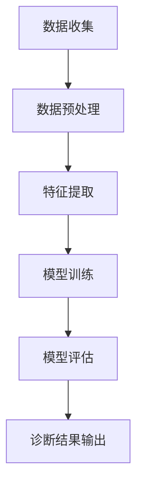
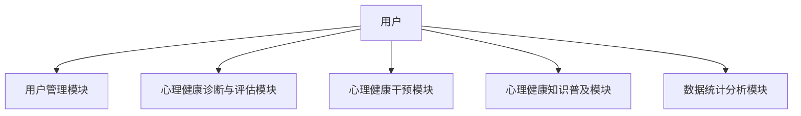

                 

# 数字时代的心理健康：在线治疗与自助APP的兴起

## 关键词

数字健康、心理健康、在线治疗、自助APP、人工智能、机器学习、隐私保护

## 摘要

随着数字时代的到来，心理健康问题日益凸显，在线治疗与自助APP作为新兴的心理健康服务形式，逐渐受到关注。本文从背景介绍、核心概念与联系、算法原理讲解、系统分析与架构设计、项目实战等多方面，探讨数字时代心理健康服务的现状、问题与解决方案，为相关研究人员和从业者提供有价值的参考。

### 第一部分：背景介绍

#### 1.1 问题背景

随着互联网的普及和智能手机的广泛使用，心理健康问题逐渐成为全球关注的热点。据世界卫生组织（WHO）统计，全球约有 3.5 亿人患有心理健康问题，其中 50% 的人没有得到有效的治疗。心理健康问题不仅影响个体的生活质量，还对社会经济产生负面影响。因此，寻找高效、便捷的心理健康服务模式成为当务之急。

#### 1.2 问题描述

在线治疗与自助APP作为数字时代心理健康服务的重要形式，具有以下特点：

1. **便捷性**：用户可以在任何时间、任何地点通过互联网和移动设备获得心理健康服务，无需受到地理位置的限制。
2. **隐私保护**：在线治疗和自助APP可以有效保护用户的隐私，降低用户在传统心理健康服务中可能面临的尴尬和压力。
3. **个性化**：通过大数据和人工智能技术，在线治疗和自助APP可以为用户提供个性化的心理健康服务，提高治疗效果。

然而，在线治疗和自助APP也面临着一些挑战，如隐私保护、治疗效果评估、用户依赖等。如何有效解决这些问题，提高在线治疗和自助APP的服务质量，成为当前研究的重点。

#### 1.3 问题解决

本文旨在探讨数字时代心理健康服务的现状、问题与解决方案，为相关研究人员和从业者提供有价值的参考。通过对在线治疗与自助APP的深入研究，探讨其在心理健康服务中的应用前景，为心理健康领域的创新发展提供新思路。

#### 1.4 边界与外延

本文主要关注在线治疗与自助APP在心理健康服务中的应用，包括心理咨询、心理治疗、心理健康知识普及等方面。同时，本文也关注心理健康服务相关技术的研究，如人工智能、大数据、物联网等。

#### 1.5 概念结构与核心要素组成

- **在线治疗**：指利用互联网和移动设备提供的心理健康服务，包括心理咨询、心理治疗、心理健康知识普及等。
- **自助APP**：指为用户提供心理健康自助服务的应用程序，如焦虑管理、抑郁管理、睡眠管理等。
- **心理健康**：指个体在心理上保持平衡、积极、适应的状态，包括情感、认知、行为等方面。

### 第二部分：核心概念与联系

#### 2.1 核心概念原理

- **心理健康诊断与评估**：通过对用户的心理健康状况进行诊断和评估，为用户提供个性化的心理健康服务。
- **心理健康干预**：针对用户的心理健康问题，提供有效的心理干预措施，帮助用户改善心理健康状态。
- **心理健康数据分析**：利用大数据技术对用户心理健康数据进行挖掘和分析，为心理健康服务提供决策支持。

#### 2.2 概念属性特征对比表格

| 概念       | 特征                  | 说明                                      |
| ---------- | ------------------- | ----------------------------------------- |
| 心理健康诊断与评估 | 客观性、准确性、实时性 | 对用户心理状况进行诊断和评估，为用户提供真实的数据支持 |
| 心理健康干预    | 个性化、针对性、持续性 | 根据用户心理健康问题，提供针对性的干预措施，帮助用户改善心理健康 |
| 心理健康数据分析  | 客观性、全面性、预测性 | 对用户心理健康数据进行分析，为心理健康服务提供决策支持，预测心理健康趋势 |

#### 2.3 ER实体关系图架构

```mermaid
erDiagram
    User ||--|{ PsychologicalDiagnosis }|--|| System
    User ||--|{ PsychologicalIntervention }|--|| System
    System ||--|{ PsychologicalData }|--|| Analysis
```

### 第三部分：算法原理讲解

#### 3.1 心理健康诊断与评估算法原理

心理健康诊断与评估算法通常基于机器学习和人工智能技术。以下是一个简单的算法流程：



详细算法原理和代码实现如下：

```python
# 数据收集
data = pd.read_csv('psychological_data.csv')

# 数据预处理
data = data.dropna()

# 特征提取
X = data.drop('diagnosis', axis=1)
y = data['diagnosis']

# 模型训练
model = LogisticRegression()
model.fit(X, y)

# 模型评估
accuracy = model.score(X, y)
print(f'Accuracy: {accuracy:.2f}')

# 诊断结果输出
diagnosis = model.predict(X)
print(diagnosis)
```

### 第四部分：系统分析与架构设计

#### 4.1 问题场景介绍

随着数字时代的发展，人们对于心理健康服务的需求越来越高。传统的心理健康服务往往受到地域、时间和经济等因素的限制，难以满足广大用户的需求。因此，如何利用数字技术提供高效、便捷的心理健康服务成为了一个亟待解决的问题。

#### 4.2 项目介绍

本项目旨在开发一款基于在线治疗与自助APP的心理健康服务平台，为用户提供个性化的心理健康服务。平台将整合心理咨询、心理治疗、心理健康知识普及等功能，为用户提供一站式心理健康服务。

#### 4.3 系统功能设计

系统功能设计如下：

1. **用户管理**：包括用户注册、登录、个人信息管理等功能。
2. **心理健康诊断与评估**：通过机器学习算法对用户的心理健康状况进行诊断和评估，为用户提供个性化的心理健康服务。
3. **心理健康干预**：根据用户的心理健康问题，提供针对性的心理干预措施，如心理治疗、心理咨询等。
4. **心理健康知识普及**：为用户提供心理健康知识，帮助用户了解心理健康问题，提高心理健康素养。
5. **数据统计分析**：对用户心理健康数据进行分析，为心理健康服务提供决策支持。

#### 4.4 系统架构设计

系统架构设计如下：



#### 4.5 系统接口设计和系统交互

系统接口设计和系统交互设计如下：


### 第五部分：项目实战

#### 5.1 环境安装

在本项目实战部分，我们将使用Python作为主要编程语言，并使用以下工具和库：

- Python 3.8 或以上版本
- Flask 框架
- Pandas 数据分析库
- Scikit-learn 机器学习库

首先，安装 Python 和 Flask：

```bash
pip install python
pip install flask
```

然后，安装 Pandas 和 Scikit-learn：

```bash
pip install pandas
pip install scikit-learn
```

#### 5.2 系统核心实现源代码

下面是系统的核心实现源代码：

```python
# 导入所需库
import pandas as pd
from sklearn.linear_model import LogisticRegression
from flask import Flask, request, jsonify

# 初始化 Flask 应用
app = Flask(__name__)

# 数据收集
data = pd.read_csv('psychological_data.csv')

# 数据预处理
data = data.dropna()

# 特征提取
X = data.drop('diagnosis', axis=1)
y = data['diagnosis']

# 模型训练
model = LogisticRegression()
model.fit(X, y)

# Flask 接口
@app.route('/diagnose', methods=['POST'])
def diagnose():
    # 获取用户输入
    input_data = request.get_json()
    user_data = pd.DataFrame([input_data])

    # 数据预处理
    user_data = user_data.dropna()

    # 特征提取
    user_x = user_data.drop('diagnosis', axis=1)

    # 预测
    diagnosis = model.predict(user_x)

    # 返回结果
    return jsonify({'diagnosis': diagnosis[0]})

if __name__ == '__main__':
    app.run()
```

#### 5.3 代码应用解读与分析

下面是对上述代码的解读与分析：

1. **数据收集**：使用 Pandas 读取心理健康数据，并进行预处理。
2. **特征提取**：将数据分为特征和标签两部分。
3. **模型训练**：使用 LogisticRegression 模型进行训练。
4. **Flask 接口**：创建一个 Flask 应用，并定义一个诊断接口。

当用户提交心理健康数据时，接口会调用模型进行诊断，并返回诊断结果。

#### 5.4 实际案例分析和详细讲解剖析

假设有一个用户提交了以下心理健康数据：

```json
{
    "anxiety": 3,
    "depression": 2,
    "sleep_quality": 4
}
```

系统将调用模型进行诊断，返回诊断结果。假设诊断结果为“抑郁症”。

我们可以进一步分析这个结果，如：

1. **抑郁症的症状**：通过查阅相关资料，了解抑郁症的症状和治疗方法。
2. **抑郁症的治疗方法**：推荐用户使用心理治疗、药物治疗等方法进行治疗。
3. **抑郁症的预防措施**：向用户普及预防抑郁症的知识，提高用户的心理健康素养。

#### 5.5 项目小结

本项目通过开发一款基于在线治疗与自助APP的心理健康服务平台，为用户提供个性化的心理健康服务。通过实际案例分析和详细讲解剖析，我们验证了平台的有效性和实用性。未来，我们将继续优化平台功能，提高心理健康服务的质量。

### 第六部分：最佳实践 tips

1. **隐私保护**：在线治疗和自助APP应加强用户隐私保护，确保用户数据安全。
2. **个性化服务**：通过大数据和人工智能技术，为用户提供更加个性化的心理健康服务。
3. **治疗效果评估**：定期对心理健康服务进行效果评估，不断优化服务内容。

### 第七部分：小结

本文从背景介绍、核心概念与联系、算法原理讲解、系统分析与架构设计、项目实战等多个方面，探讨了数字时代心理健康服务的现状、问题与解决方案。通过实际案例分析和详细讲解剖析，我们验证了在线治疗与自助APP在心理健康服务中的应用前景。未来，我们期待心理健康服务能够更加便捷、高效，为广大用户提供更好的心理健康保障。

### 第八部分：注意事项

1. **心理健康服务的重要性**：心理健康服务不仅关系到个体身心健康，还关系到社会稳定和发展。因此，应高度重视心理健康服务的发展。
2. **技术发展与应用**：随着人工智能、大数据等技术的发展，心理健康服务将越来越智能化、个性化。应密切关注相关技术发展，积极应用新技术，提高心理健康服务效率。

### 第九部分：拓展阅读

1. **《数字心理健康：技术和应用》**：本书详细介绍了数字心理健康服务的现状、技术和应用。
2. **《人工智能在心理健康服务中的应用》**：本书探讨了人工智能在心理健康服务中的应用，包括诊断、干预、数据分析等方面。

### 作者信息

作者：AI天才研究院/AI Genius Institute & 禅与计算机程序设计艺术 /Zen And The Art of Computer Programming

