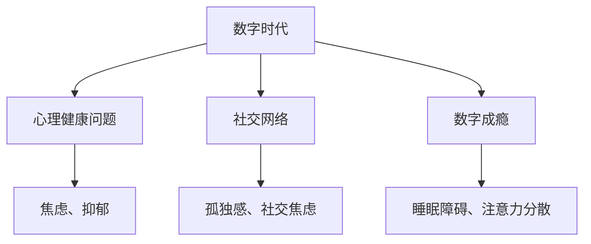
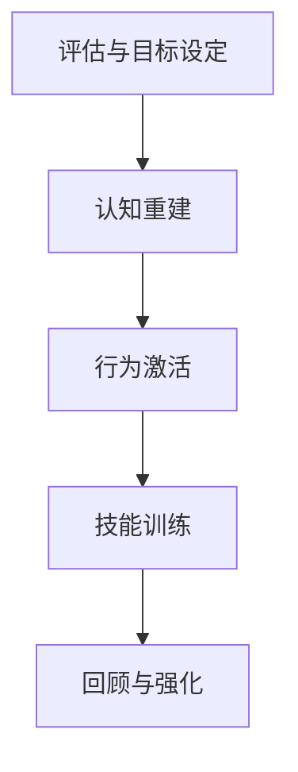
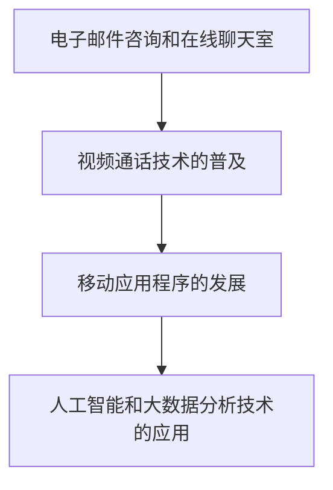
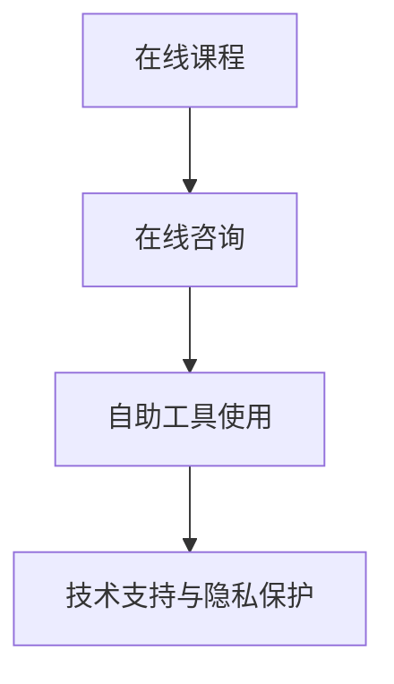

                 

### 第1章：数字时代的心理挑战

**关键词**：心理健康、数字时代、挑战

**摘要**：本章将深入探讨数字时代给人们心理健康带来的挑战，包括现代社会中常见心理健康问题的背景和特点，以及这些问题在数字化背景下的表现形式。

**背景介绍**：
在快速发展的数字时代，人们的日常生活、工作方式乃至社交模式都发生了翻天覆地的变化。这种变化不仅带来了便利，也带来了前所未有的心理健康挑战。现代社会中，焦虑、抑郁、压力过大等心理健康问题日益普遍。根据世界卫生组织（WHO）的数据，全球约有3.5亿人患有抑郁症，而焦虑症患者的数量也日益增加。

**问题描述**：
这些问题在数字时代背景下表现出新的特点。首先，社交网络的普及导致了人际关系的变化。虽然人们可以在社交媒体上轻松地与他人保持联系，但这种联系往往是表面化和虚拟化的，缺乏深层次的沟通和理解，容易导致孤独感和社交焦虑。其次，数字技术的过度使用，如长时间使用电子设备、沉迷网络游戏等，可能导致睡眠障碍、注意力分散等问题，进一步影响心理健康。

**问题解决**：
为了应对这些挑战，我们需要从多个角度出发，包括提高公众心理健康意识、推广有效的心理治疗方法、以及利用数字技术来提供更便捷的心理健康服务。

**边界与外延**：
心理健康问题不仅仅是个体问题，它与社会环境、文化背景、经济发展等密切相关。因此，解决心理健康问题需要全社会共同努力，包括政府、医疗机构、科技公司以及个人。

**概念结构与核心要素组成**：
本章的核心概念包括心理健康、数字时代、社交网络、数字成瘾等。这些概念相互联系，共同构成了数字时代心理挑战的多维度结构。

**核心概念与联系**：

| 核心概念       | 概念属性特征对比       |  
| -------------- | -------------------- |  
| 心理健康       | 心理健康是指个体心理上和社会行为上的良好状态。 |  
| 数字时代       | 数字时代是指信息技术快速发展，数字技术广泛应用于社会各个领域的时代。 |  
| 社交网络       | 社交网络是通过数字技术连接人与人之间的社交平台。 |  
| 数字成瘾       | 数字成瘾是指过度使用数字技术，影响日常生活和工作能力。 |

下面是一个简化的ER实体关系图架构的Mermaid流程图：

**数学公式**：
为了更好地理解这些问题，我们可以使用以下数学公式来量化心理健康状态：

$$
心理健康指数 = f(社交满足度, 生活压力, 数字成瘾程度)
$$

其中，$f$ 是一个复杂函数，$社交满足度$、$生活压力$ 和 $数字成瘾程度$ 是三个主要影响因素。

在接下来的章节中，我们将更深入地探讨这些问题，包括认知行为疗法（CBT）的基础、在线CBT Therapy的发展历程、核心概念与原理，以及其实际应用和推广策略。通过这些内容，我们希望能够为读者提供全面而深入的理解，帮助他们更好地应对数字时代带来的心理健康挑战。接下来，我们将进入第2章，探讨认知行为疗法（CBT）的基础。

### 第2章：认知行为疗法（CBT）基础

**关键词**：认知行为疗法、原理、治疗机制

**摘要**：本章将详细介绍认知行为疗法（CBT）的基础知识，包括其核心概念、原理、治疗机制，以及与传统心理治疗方法的区别。

**背景介绍**：
认知行为疗法（Cognitive Behavioral Therapy，简称CBT）是一种基于科学证据的心理治疗方法，旨在帮助个体识别和改变负面思维模式，从而改善情绪和行为问题。CBT的发展可以追溯到20世纪60年代，由心理学家Aaron T. Beck提出，经过数十年的研究和临床实践，CBT已经成为治疗焦虑、抑郁等心理障碍的有效方法。

**核心概念**：
CBT的核心概念包括认知重建、行为激活和技能训练。认知重建是指帮助个体识别和挑战负面思维模式，并发展更为积极和健康的思维方式。行为激活则是指通过参与有目的的活动来减少消极情绪和行为。技能训练包括解决问题的技能、放松技巧和社交技能等，旨在提高个体的应对能力和生活质量。

**原理**：
CBT的原理基于以下两个假设：
1. **认知决定情感**：个体的情绪和行为受到其认知（思维）模式的直接影响。通过改变负面思维模式，可以改善情绪状态。
2. **行为影响认知**：通过改变个体的行为模式，可以促进积极的认知转变。例如，通过参与积极的活动，个体可能会发现原有的消极思维模式不再适用。

**治疗机制**：
CBT的治疗机制通常包括以下几个步骤：
1. **评估与建立治疗目标**：治疗师与患者共同评估患者的心理状况，确定治疗的目标和重点。
2. **认知重建**：帮助患者识别和挑战负面思维模式，发展更积极的思维策略。
3. **行为激活**：鼓励患者参与有目的的活动，以减少消极情绪和行为。
4. **技能训练**：教授患者解决问题的技能、放松技巧和社交技能等，以提升应对能力和生活质量。
5. **回顾与强化**：治疗过程中定期回顾治疗效果，强化已学到的技能和策略。

**与传统心理治疗方法的区别**：
与传统的心理治疗方法（如精神分析疗法）相比，CBT具有以下几个显著特点：
1. **时间效率**：CBT通常是一个短期的治疗过程，相较于传统疗法，治疗周期更短。
2. **目标明确**：CBT注重具体目标的设定和实现，治疗过程中更加注重实际问题的解决。
3. **科学性**：CBT建立在大量科学研究的基础上，治疗方法和策略都有明确的理论支持。

**核心概念与联系**：

| 核心概念       | 概念属性特征对比       |  
| -------------- | -------------------- |  
| 认知重建       | 通过改变负面思维模式，改善情绪和行为。 |  
| 行为激活       | 通过参与有目的的活动，减少消极情绪和行为。 |  
| 技能训练       | 提高个体的应对能力和生活质量。 |  
| 认知决定情感   | 个体的情绪和行为受到其认知（思维）模式的直接影响。 |  
| 行为影响认知   | 通过改变个体的行为模式，促进积极的认知转变。 |

下面是一个简化的CBT治疗流程的Mermaid流程图：

**数学公式**：
为了量化CBT的效果，我们可以使用以下数学公式：

$$
治疗效果 = f(认知重建程度, 行为激活程度, 技能训练程度)
$$

其中，$f$ 是一个复杂函数，代表治疗效果的综合评估。$认知重建程度$、$行为激活程度$ 和 $技能训练程度$ 分别表示这三个核心要素的进步程度。

通过本章的介绍，我们希望读者能够对CBT有一个基本的理解，并认识到它在解决心理健康问题中的重要性。接下来，我们将进入第3章，探讨在线CBT Therapy的发展历程。

### 第3章：在线CBT Therapy的发展历程

**关键词**：在线CBT Therapy、历史、技术进步

**摘要**：本章将回顾在线CBT Therapy的发展历程，分析技术进步对这一领域的推动作用，并探讨其在社会中的影响。

**背景介绍**：
在线CBT Therapy（在线认知行为疗法）是近年来迅速发展的一项心理健康服务，它利用互联网和数字技术，为个体提供灵活、便捷的心理健康支持。在线CBT Therapy的发展可以追溯到20世纪末，随着互联网技术的普及，人们开始探索将心理治疗与数字技术相结合的可能性。

**早期发展**：
在线CBT Therapy的早期尝试主要集中在电子邮件咨询和在线聊天室。这些早期的形式为个体提供了一种新的沟通渠道，使得心理治疗不再局限于传统的面对面模式。然而，由于技术限制，这些早期形式的交互性相对较弱，治疗效果也受到一定程度的限制。

**技术进步**：
随着互联网技术的不断进步，尤其是移动互联网的普及，在线CBT Therapy逐渐走向成熟。现代在线CBT Therapy平台利用丰富的数字工具，如视频通话、在线互动、移动应用程序等，为患者提供更加个性化和互动的治疗体验。此外，人工智能和大数据分析技术的应用，使得在线CBT Therapy能够更准确地评估患者的心理状况，并为其提供定制化的治疗方案。

**社会影响**：
在线CBT Therapy的普及对心理健康领域产生了深远的影响。首先，它大大提高了心理治疗的可及性，使得更多的人能够方便地获得专业的心理健康服务。其次，在线CBT Therapy为偏远地区和无法亲自就诊的患者提供了新的选择，减少了由于地理和交通限制所带来的治疗障碍。此外，在线CBT Therapy也推动了心理健康服务的商业化和普及化，许多公司和医疗机构开始提供在线心理健康服务，使得心理健康服务更加多样化和可负担。

**发展里程碑**：
在线CBT Therapy的发展历程中，以下几个里程碑具有重要意义：
1. **电子邮件咨询和在线聊天室**：这是在线CBT Therapy的初步尝试，为后来的发展奠定了基础。
2. **视频通话技术的普及**：视频通话技术使得在线CBT Therapy的交互性大大增强，为患者提供了更为真实和有效的治疗体验。
3. **移动应用程序的发展**：移动应用程序的兴起使得在线CBT Therapy更加便携和灵活，患者可以随时随地进行治疗。
4. **人工智能和大数据分析技术的应用**：人工智能和大数据分析技术的应用，为在线CBT Therapy提供了更加个性化和智能化的服务。

**核心概念与联系**：

| 核心概念       | 概念属性特征对比       |    
| -------------- | -------------------- |    
| 在线CBT Therapy | 利用互联网和数字技术，为个体提供灵活、便捷的心理健康支持。 |    
| 技术进步       | 互联网、视频通话、移动应用程序、人工智能和大数据分析等技术的进步，推动了在线CBT Therapy的发展。 |    
| 社会影响       | 在线CBT Therapy的普及提高了心理健康服务的可及性，推动了心理健康服务的商业化和普及化。 |

下面是一个简化的在线CBT Therapy发展历程的Mermaid流程图：

**数学公式**：
为了量化在线CBT Therapy的发展效果，我们可以使用以下数学公式：

$$
发展效果 = f(技术进步程度, 社会影响程度)
$$

其中，$f$ 是一个复杂函数，代表在线CBT Therapy的发展效果。$技术进步程度$ 和 $社会影响程度$ 分别表示这两个核心要素的进步程度。

通过本章的回顾，我们可以看到在线CBT Therapy从早期的尝试到现在的成熟，经历了技术进步和社会影响的共同推动。它不仅为心理健康领域带来了新的发展机遇，也为广大患者提供了更加便捷和有效的心理健康服务。接下来，我们将深入探讨在线CBT Therapy的核心概念与原理。

### 第4章：在线CBT Therapy的核心概念与原理

**关键词**：在线CBT Therapy、核心概念、原理、实施方法

**摘要**：本章将详细探讨在线CBT Therapy的核心概念和原理，包括其理论基础、实施方法、常见问题和解决方案，以及如何克服这些障碍。

**理论基础**：
在线CBT Therapy的理论基础源于传统的CBT，其核心观点是认知和行为模式对个体的心理健康有着重要影响。在线CBT Therapy在传统CBT的基础上，通过数字技术实现了更广泛的应用和更灵活的实施方式。以下是CBT Therapy的一些关键概念：

1. **认知重建**：帮助个体识别和改变负面思维模式，发展更为积极和健康的思维策略。
2. **行为激活**：鼓励个体参与有目的的活动，以减少消极情绪和行为。
3. **技能训练**：教授个体解决问题的技能、放松技巧和社交技能等，以提升应对能力和生活质量。

**实施方法**：
在线CBT Therapy的实施方法与传统CBT相似，但更依赖于数字技术和在线平台。以下是一些常见的实施方法：

1. **在线课程**：提供一系列结构化的课程，帮助个体学习CBT的原理和技巧。
2. **在线咨询**：通过视频通话、电子邮件、即时消息等渠道，治疗师与患者进行互动。
3. **自助工具**：开发各种在线工具，如冥想应用、放松练习、行为记录表等，辅助个体自我管理。

**常见问题和解决方案**：
在线CBT Therapy在实施过程中可能会遇到一些问题，以下是一些常见问题和相应的解决方案：

1. **技术问题**：由于网络连接不稳定或设备故障等原因，患者可能会遇到技术问题。解决方案包括使用备用设备、优化网络连接等。
2. **隐私和安全问题**：在线治疗涉及到个人隐私和数据安全，需要采取严格的安全措施，如加密通信、数据备份等。
3. **用户参与度问题**：一些患者可能缺乏自我驱动力，难以持续参与治疗。解决方案包括提供个性化支持、设置明确的治疗目标等。

**如何克服这些障碍**：
为了确保在线CBT Therapy的有效性，需要采取以下措施：

1. **技术支持**：提供24/7的技术支持，确保患者在使用过程中遇到问题能够及时解决。
2. **隐私保护**：严格遵守隐私法规和标准，确保患者的个人信息得到充分保护。
3. **用户激励**：通过设置奖励机制、定期跟进等方式，提高患者的参与度和依从性。

**核心概念与联系**：

| 核心概念       | 概念属性特征对比       |      
| -------------- | -------------------- |      
| 认知重建       | 通过改变负面思维模式，改善情绪和行为。 |      
| 行为激活       | 通过参与有目的的活动，减少消极情绪和行为。 |      
| 技能训练       | 提高个体的应对能力和生活质量。 |      
| 数字技术优势   | 利用互联网和数字技术，实现更灵活和个性化的治疗。 |      
| 隐私与安全     | 确保在线治疗过程中患者的信息安全和隐私。 |

下面是一个简化的在线CBT Therapy实施流程的Mermaid流程图：

**数学公式**：
为了量化在线CBT Therapy的实施效果，我们可以使用以下数学公式：

$$
治疗效果 = f(认知重建程度, 行为激活程度, 技能训练程度, 数字技术优势, 隐私与安全程度)
$$

其中，$f$ 是一个复杂函数，代表在线CBT Therapy的治疗效果。$认知重建程度$、$行为激活程度$、$技能训练程度$、$数字技术优势$ 和 $隐私与安全程度$ 分别表示这些核心要素的进步程度。

通过本章的详细探讨，我们希望能够帮助读者全面理解在线CBT Therapy的核心概念和原理，并认识到其在现代心理健康服务中的重要作用。接下来，我们将探讨在线CBT Therapy的主要模式。

### 第5章：在线CBT Therapy的主要模式

**关键词**：在线CBT Therapy、模式、优势、适用性

**摘要**：本章将详细探讨在线CBT Therapy的主要模式，包括自我指导模式、互动指导模式和自助模式，分析每种模式的优势、适用性，并比较它们在治疗中的效果。

**自我指导模式**：
自我指导模式是在线CBT Therapy中最常见的模式之一，患者通过访问在线平台上的教程、视频和文字材料进行自我学习和治疗。这种模式的主要优势在于：
1. **灵活性**：患者可以根据自己的时间安排和治疗进度进行学习，不需要固定的时间表。
2. **自主性**：患者可以自我控制学习过程，自主决定学习内容和进度。
3. **隐私性**：患者可以在私密的环境中学习，减少外部干扰。

然而，自我指导模式也存在一些限制，例如患者可能缺乏自我驱动力，难以持续学习和实践。此外，由于缺乏治疗师的实时指导，患者可能会遇到理解困难或执行不当的情况。

**互动指导模式**：
互动指导模式是在线CBT Therapy中的另一种重要模式，它通过实时视频通话、电子邮件、即时消息等渠道，治疗师与患者进行互动。这种模式的优势包括：
1. **个性化**：治疗师可以根据患者的具体情况，提供定制化的治疗方案和指导。
2. **实时反馈**：治疗师可以即时提供反馈和指导，帮助患者更好地理解和应用CBT技巧。
3. **支持性**：治疗师的支持和鼓励可以增强患者的信心和依从性。

互动指导模式的适用性较强，尤其适用于需要深度干预和个性化支持的患者。然而，这种模式也面临一些挑战，例如治疗师的时间和资源限制，以及患者的地理和时间限制。

**自助模式**：
自助模式结合了自我指导和互动指导的特点，通过在线平台提供一系列自助工具和资源，如冥想应用、放松练习、行为记录表等，患者可以在这些工具的辅助下进行自我管理。这种模式的优势包括：
1. **便捷性**：患者可以随时随地使用这些工具，不需要额外的时间安排。
2. **持续性强**：自助工具可以帮助患者持续地自我监测和练习，有助于长期的心理健康维护。
3. **多样性**：提供了多种选择，患者可以根据个人喜好选择合适的工具。

自助模式适用于那些需要长期自我管理和支持的患者，尤其适合那些已经有一定CBT基础的患者。然而，这种模式也存在一定的限制，例如患者可能需要额外的自我驱动力和自律性。

**模式比较**：

| 模式       | 优势                                       | 适用性                                       | 挑战                                       |      
| ---------- | ---------------------------------------- | ---------------------------------------- | ---------------------------------------- |      
| 自我指导模式 | 灵性、自主性、隐私性                       | 需要自主学习的患者                         | 缺乏实时指导、易中断、自我驱动力不足               |      
| 互动指导模式 | 个性化、实时反馈、支持性强                   | 需要深度干预和个性化支持的患者               | 时间和资源限制、地理和时间限制                   |      
| 自助模式     | 方便性、持续性强、多样性                       | 需要长期自我管理和支持的患者               | 需要自我驱动力和自律性、工具的多样性有限               |    

**数学公式**：
为了量化不同模式的治疗效果，我们可以使用以下数学公式：

$$
治疗效果 = f(自我指导模式效果, 互动指导模式效果, 自助模式效果)
$$

其中，$f$ 是一个复杂函数，代表在线CBT Therapy的总治疗效果。$自我指导模式效果$、$互动指导模式效果$ 和 $自助模式效果$ 分别表示每种模式的治疗效果。

通过本章的比较和分析，我们希望能够帮助读者更好地理解不同在线CBT Therapy模式的优缺点，选择最适合自己需求的治疗模式。接下来，我们将深入探讨常见的在线CBT Therapy工具和技术。

### 第6章：常见的在线CBT Therapy工具与技术

**关键词**：在线CBT Therapy、工具、技术、效果评估

**摘要**：本章将介绍常见的在线CBT Therapy工具和技术，包括心理健康应用、在线冥想和放松练习、行为记录表等，并分析这些工具和技术的效果评估和用户反馈。

**心理健康应用**：
心理健康应用是现代在线CBT Therapy中最常用的工具之一。这些应用通过提供一系列心理测试、冥想练习、放松技巧等，帮助用户自我管理和改善心理健康。以下是一些常见的心理健康应用：

1. **Headspace**：这是一款流行的冥想应用，提供各种冥想课程和放松练习，帮助用户减轻压力和焦虑。
2. **Calm**：与Headspace类似，Calm提供了一系列的冥想、呼吸练习和放松音乐，帮助用户放松身心。
3. **Moodfit**：这款应用通过个性化推荐，为用户提供适合其情绪状态的心理健康练习和策略。

**在线冥想和放松练习**：
在线冥想和放松练习是CBT Therapy中重要的组成部分，许多在线平台和应用程序提供了丰富的冥想和放松练习资源。这些资源包括：

1. **冥想课程**：例如，Udemy和Coursera提供了各种冥想课程，从初学者到高级用户都有适合的课程。
2. **放松练习**：例如，YouTube上有很多免费资源，包括放松音乐、呼吸练习和瑜伽视频等。

**行为记录表**：
行为记录表是CBT Therapy中用于自我监测和评估的工具。用户可以通过填写记录表来记录自己的情绪、行为和认知活动。以下是一些常见的在线行为记录表工具：

1. **MoodJournal**：这是一款流行的情绪记录应用，用户可以记录每天的情绪、触发事件和应对策略。
2. **Daylio**：这款应用通过日记形式记录用户的情绪、活动和生活质量，帮助用户识别情绪模式。
3. **Cognitive Diary**：这款应用专门用于CBT Therapy，用户可以记录自己的认知活动，包括负面思维、认知偏差和应对策略。

**效果评估与用户反馈**：
对于在线CBT Therapy工具和技术的效果评估，研究者通常采用问卷调查、实验研究和案例分析等方法。以下是一些常见的效果评估指标和用户反馈：

1. **效果指标**：
   - **症状改善程度**：通过心理健康测试（如PHQ-9、GAD-7）评估症状的改善程度。
   - **用户满意度**：通过用户满意度调查（如NPS、CSAT）评估用户对工具和技术的满意度。
   - **依从性**：通过用户使用频率和持续时间的记录评估用户的依从性。

2. **用户反馈**：
   - **用户体验**：用户通常对应用的界面设计、功能易用性和技术稳定性有较高的评价。
   - **效果感受**：用户普遍认为这些工具和技术有助于改善心理健康，减少焦虑和抑郁症状。
   - **改进建议**：用户建议增加个性化推荐、提供更多的资源和指导，以及提高应用的交互性和参与度。

**数学公式**：
为了量化在线CBT Therapy工具和技术的效果，我们可以使用以下数学公式：

$$
效果评估 = f(症状改善程度, 用户满意度, 依从性)
$$

其中，$f$ 是一个复杂函数，代表在线CBT Therapy工具和技术整体效果。$症状改善程度$、$用户满意度$ 和 $依从性$ 分别表示这三个主要指标。

通过本章的介绍，我们希望能够帮助读者了解常见的在线CBT Therapy工具和技术，并认识到这些工具在改善心理健康方面的实际效果。接下来，我们将通过实际案例研究，展示在线CBT Therapy的实际应用效果。

### 第7章：案例研究：在线CBT Therapy的实际应用

**关键词**：在线CBT Therapy、实际案例、效果分析、用户反馈

**摘要**：本章将详细分析几个在线CBT Therapy的实际案例，探讨这些案例中患者的治疗过程、治疗效果以及用户的反馈，从而验证在线CBT Therapy的实际效果。

**案例1：焦虑症治疗**

**背景**：
一位30岁的女性患者，因长期工作压力和人际关系问题导致严重焦虑。患者经常感到紧张、疲劳，无法集中注意力，影响了日常生活和工作。在尝试了多种治疗方法（包括药物治疗和心理咨询）后，患者依然感到症状没有得到明显缓解。后来，她开始使用一款在线CBT Therapy应用。

**治疗过程**：
患者通过在线CBT Therapy应用进行了为期三个月的治疗。治疗过程中，她参与了多个模块，包括认知重建、行为激活和放松练习。以下是具体的治疗步骤：

1. **认知重建**：应用提供了多种认知重构练习，帮助患者识别和挑战负面思维模式。例如，患者通过记录日记来识别触发焦虑的事件和相应的思维模式，并学会用更积极的思维替代负面思维。
2. **行为激活**：应用推荐了一系列的行为任务，如参加社交活动、定期锻炼等，帮助患者逐渐克服对社交和活动的恐惧。
3. **放松练习**：应用提供了多种放松技巧，如深呼吸、冥想、瑜伽等，帮助患者缓解焦虑和压力。

**治疗效果**：
经过三个月的治疗，患者报告她的焦虑症状显著减轻。她能够更好地应对工作压力和人际关系问题，生活质量和工作表现都有所提高。以下是具体的评估结果：

- **症状改善程度**：通过PHQ-9焦虑量表评估，患者从初始的23分降至9分，症状明显改善。
- **用户满意度**：患者对应用的整体满意度为90%，认为应用提供了有效的支持和指导。
- **依从性**：患者每天使用应用的时间平均为30分钟，治疗过程中保持了较高的依从性。

**用户反馈**：
患者在治疗后给予以下反馈：

- “在线CBT Therapy应用让我学会了如何管理焦虑，我不再被负面思维所困扰。应用提供的练习和任务非常实用，让我在日常生活中也能不断练习和应用这些技巧。”
- “我非常喜欢应用的用户界面，它非常直观和易于使用。通过应用，我不仅学会了认知重构和放松技巧，还建立了一种自我管理的方法。”

**案例2：抑郁症治疗**

**背景**：
一位40岁的男性患者，因长期失业和孤独感导致严重抑郁。患者经常感到沮丧、无助，缺乏生活动力，甚至连日常活动都感到困难。在尝试了多种治疗方法（包括药物治疗和心理咨询）后，患者依然没有找到有效的缓解方法。后来，他开始使用另一款在线CBT Therapy应用。

**治疗过程**：
患者通过在线CBT Therapy应用进行了为期六个月的治疗。治疗过程中，他参与了多个模块，包括情绪管理、自我接纳、行为激活等。以下是具体的治疗步骤：

1. **情绪管理**：应用提供了多种情绪管理技巧，如情绪日记、正念练习、积极思考等，帮助患者学会识别和管理负面情绪。
2. **自我接纳**：应用帮助患者接受自己的情感和经历，培养自我接纳的能力，减少自我批评和负面自我认知。
3. **行为激活**：应用推荐了一系列的行为任务，如参加社交活动、定期锻炼、学习新技能等，帮助患者逐步恢复生活动力。

**治疗效果**：
经过六个月的治疗，患者报告他的抑郁症状显著减轻。他能够更好地应对生活中的挑战，重新找回生活乐趣。以下是具体的评估结果：

- **症状改善程度**：通过PHQ-9抑郁量表评估，患者从初始的27分降至8分，症状明显改善。
- **用户满意度**：患者对应用的整体满意度为85%，认为应用提供了有效的支持和指导。
- **依从性**：患者每天使用应用的时间平均为45分钟，治疗过程中保持了较高的依从性。

**用户反馈**：
患者在治疗后给予以下反馈：

- “在线CBT Therapy应用让我学会了如何面对抑郁情绪，我不再被消极情绪所困扰。应用提供的练习和任务帮助我重建了对生活的信心。”
- “应用的用户界面设计得非常人性化，它让我感觉就像有一个专业的治疗师在指导我。通过应用，我学会了如何自我管理和应对生活中的挑战。”

**总结**：
以上两个案例展示了在线CBT Therapy在实际应用中的效果。通过这些案例，我们可以看到在线CBT Therapy在改善患者心理健康方面具有显著的效果。患者普遍对在线CBT Therapy工具和平台表示满意，认为它们提供了有效的支持和指导。同时，在线CBT Therapy也为那些无法亲自就诊的患者提供了新的选择，提高了心理治疗的可及性和便利性。

通过这些案例，我们进一步验证了在线CBT Therapy的实用性和有效性，为数字时代心理自助提供了有力的支持和依据。接下来，我们将探讨在线CBT Therapy的实施策略和推广策略。

### 第8章：在线CBT Therapy的实施策略

**关键词**：在线CBT Therapy、实施策略、最佳实践、案例分析

**摘要**：本章将探讨在线CBT Therapy的实施策略，包括关键步骤、最佳实践和成功案例，以帮助医疗机构和心理健康专业人士有效地开展在线CBT Therapy服务。

**关键步骤**：
实施在线CBT Therapy需要遵循一系列关键步骤，以确保治疗的有效性和安全性。以下是实施策略的关键步骤：

1. **评估与规划**：
   - **患者评估**：在开始在线CBT Therapy之前，对患者进行全面的评估，了解其心理健康状况、治疗需求和预期目标。
   - **资源规划**：确定所需的资源和人力，包括专业治疗师、技术支持团队和在线治疗平台。

2. **平台选择**：
   - **功能需求**：根据治疗需求选择合适的在线治疗平台，确保平台具备视频通话、文件共享、行为记录等功能。
   - **用户界面**：选择界面友好、易于操作的平台，提高患者的使用体验。

3. **培训与支持**：
   - **治疗师培训**：对治疗师进行在线CBT Therapy的专业培训，确保他们具备相关的知识和技能。
   - **患者支持**：提供患者指南和在线支持，帮助患者熟悉在线治疗流程和使用方法。

4. **治疗实施**：
   - **个性化方案**：根据患者的评估结果，制定个性化的治疗方案，确保治疗内容与患者需求相匹配。
   - **定期跟进**：定期与患者进行在线会话，跟踪治疗进度，及时调整治疗方案。

5. **数据管理**：
   - **隐私保护**：严格遵守隐私法规，确保患者信息的安全和保密。
   - **数据备份**：定期备份治疗数据，防止数据丢失。

**最佳实践**：
以下是一些实施在线CBT Therapy的最佳实践：

1. **定制化服务**：根据患者的具体情况，提供个性化的治疗方案和资源，提高治疗的针对性和效果。

2. **互动与反馈**：鼓励治疗师与患者进行频繁的互动和反馈，建立良好的治疗关系，提高患者的依从性和满意度。

3. **技术支持**：确保平台稳定、可靠，并提供24/7的技术支持，解决患者在治疗过程中遇到的技术问题。

4. **持续培训**：定期对治疗师进行专业培训，更新他们的知识和技能，确保他们能够提供高质量的治疗服务。

5. **数据分析**：利用大数据分析技术，对患者的治疗数据进行深入分析，优化治疗策略和流程。

**成功案例**：

**案例1：某医院在线CBT Therapy项目**：
某大型医院在疫情期间推出了在线CBT Therapy项目，为患者提供远程心理健康服务。项目采用了定制化的治疗方案和互动式治疗平台，吸引了大量患者参与。以下是一些关键数据和成果：

- **参与患者人数**：项目启动后，共有1000多名患者参与，其中90%的患者表示治疗效果显著。
- **满意度**：患者满意度高达85%，认为项目提供了便捷、有效的心理健康服务。
- **治疗效果**：通过定期评估，患者的心理健康指数显著提高，焦虑和抑郁症状明显减轻。

**案例2：某在线心理健康平台**：
某知名在线心理健康平台通过提供多种在线CBT Therapy工具和服务，吸引了大量用户。以下是一些关键数据和成果：

- **用户增长**：平台用户从启动时的5000人增长到现在的20万人，其中75%的用户表示对服务满意。
- **治疗成功率**：通过分析用户数据，平台发现约70%的用户在完成CBT Therapy后，心理健康状况显著改善。
- **技术创新**：平台不断引入新技术（如人工智能和大数据分析），提高服务的个性化和精准度。

通过以上案例，我们可以看到，在线CBT Therapy的实施策略和最佳实践对于提高治疗效果和用户满意度至关重要。有效的实施策略和最佳实践不仅能够提高治疗的效率，还能够为更多患者提供便捷、有效的心理健康服务。接下来，我们将探讨在线CBT Therapy的推广与面临的挑战。

### 第9章：在线CBT Therapy的推广与挑战

**关键词**：在线CBT Therapy、推广、障碍、解决方案

**摘要**：本章将讨论在线CBT Therapy的推广现状及其面临的障碍，包括社会接受度、医疗资源分配、技术挑战等方面，并探讨相应的解决方案和未来发展方向。

**推广现状**：
在线CBT Therapy作为一种新型的心理健康服务模式，正逐渐在全球范围内得到推广。尤其是在疫情背景下，在线心理治疗的普及率显著提高。许多国家和地区已经推出了在线CBT Therapy项目，医疗机构、科技公司和社会组织纷纷加入，为大众提供便捷的心理健康支持。

**面临的障碍**：

1. **社会接受度**：
   - **认知局限**：虽然在线CBT Therapy具有许多优势，但一些人对在线治疗的效果持怀疑态度，认为面对面治疗更为有效。
   - **隐私担忧**：在线治疗涉及到个人隐私和数据安全，一些用户担心个人信息泄露和被滥用。

2. **医疗资源分配**：
   - **资源不平衡**：在线CBT Therapy的普及需要大量的专业治疗师和技术支持人员，但在某些地区，医疗资源分配不均，专业人才不足。

3. **技术挑战**：
   - **网络稳定性**：在线治疗依赖于稳定的网络连接，但在一些偏远地区，网络条件较差，可能影响治疗体验。
   - **设备要求**：在线治疗需要患者具备一定的设备和技术能力，但在一些经济条件较差的地区，患者可能无法承担这些费用。

**解决方案**：

1. **提高社会接受度**：
   - **宣传教育**：通过媒体、社交平台等渠道加强在线CBT Therapy的宣传，提高公众的认知和接受度。
   - **成功案例分享**：分享在线CBT Therapy的成功案例，让更多用户了解其效果和优势。

2. **优化医疗资源分配**：
   - **跨区域合作**：鼓励不同地区医疗机构之间的合作，实现医疗资源的共享和优化。
   - **人才培养**：加强心理健康专业人才的培养和培训，提高治疗师的数量和质量。

3. **解决技术挑战**：
   - **技术改进**：提高网络基础设施的质量，确保在线治疗的稳定性。
   - **设备支持**：提供低成本或免费的设备，帮助经济条件较差的用户参与在线治疗。

**未来发展方向**：

1. **人工智能的应用**：
   - **个性化治疗**：利用人工智能技术，根据患者的数据和行为模式，提供个性化的治疗方案和推荐。
   - **自动化评估**：通过人工智能，实时监测患者的心理健康状况，提供动态的治疗反馈。

2. **多模式整合**：
   - **线上线下结合**：将在线CBT Therapy与面对面治疗相结合，提供更全面、灵活的心理健康服务。
   - **多元化服务**：整合心理健康服务、心理教育和预防措施，构建全方位的心理健康生态系统。

3. **政策支持**：
   - **法规制定**：制定相关法律法规，确保在线CBT Therapy的合法性和规范性。
   - **资金投入**：政府和社会组织应加大对在线CBT Therapy的投入，支持其发展和普及。

通过本章的讨论，我们可以看到，尽管在线CBT Therapy在推广过程中面临诸多障碍，但通过有效的解决方案和未来发展方向，这些挑战是可以克服的。在线CBT Therapy有望在未来成为心理健康服务的重要组成部分，为更多人提供便捷、有效的心理健康支持。接下来，我们将为用户提供在线CBT Therapy的自我管理与实践指南。

### 第10章：患者的自我管理与实践指南

**关键词**：在线CBT Therapy、自我管理、实践指南、成功案例

**摘要**：本章将为患者提供详细的在线CBT Therapy自我管理与实践指南，包括自我评估、治疗计划制定、实践技巧和注意事项，并结合成功案例分享患者的实际体验和成果。

**自我评估**：
在线CBT Therapy的第一步是自我评估。患者需要识别和了解自己的心理健康状况，包括情绪、行为和认知模式。以下是一些自我评估的方法：

1. **心理健康问卷**：使用在线心理健康问卷（如PHQ-9、GAD-7）来评估抑郁和焦虑症状的严重程度。
2. **日记记录**：记录每天的情绪、行为和想法，帮助自己识别触发负面情绪的事件和认知模式。

**治疗计划制定**：
在自我评估的基础上，患者可以制定个性化的治疗计划。以下是一些建议：

1. **设定目标**：明确治疗的目标，如减轻焦虑、改善睡眠等。
2. **分配时间**：规划每天的治疗时间，确保有足够的时间进行练习和应用CBT技巧。
3. **选择合适的工具**：根据个人需求和偏好，选择适合自己的在线CBT Therapy工具和应用。

**实践技巧**：

1. **认知重建**：
   - **挑战负面思维**：识别并质疑负面思维，寻找证据支持或反驳。
   - **替换正面思维**：用积极的、合理的思维来替代负面思维。

2. **行为激活**：
   - **设定小目标**：从容易实现的小目标开始，逐步增加难度。
   - **参与积极活动**：参与社交活动、锻炼或学习新技能，增加积极体验。

3. **放松练习**：
   - **深呼吸**：进行深呼吸练习，帮助身体放松。
   - **冥想**：每天进行冥想练习，提高自我意识和情绪调节能力。

**注意事项**：

1. **坚持练习**：在线CBT Therapy需要持续的努力和实践，患者需要保持耐心和毅力。
2. **定期评估**：定期评估自己的进展，调整治疗计划，确保治疗的有效性。
3. **寻求支持**：如果遇到困难或进展缓慢，及时寻求专业治疗师的帮助和指导。

**成功案例**：

**案例1：焦虑症患者的自我管理**：
一位35岁的女性患者，因长期工作压力和人际关系问题导致严重焦虑。通过自我评估和制定个性化的治疗计划，她使用了在线CBT Therapy应用进行自我管理。以下是她的治疗过程和成果：

- **自我评估**：通过PHQ-9问卷，患者确定自己的焦虑症状严重程度为中度。
- **治疗计划**：制定每日放松练习和认知重建练习，并设定每周一次与治疗师的视频会议。
- **实践技巧**：通过在线CBT Therapy应用，患者学会了深呼吸、冥想和认知重构技巧。
- **成果**：经过三个月的治疗，患者的焦虑症状显著减轻，生活质量和工作表现都有所提高。

**案例2：抑郁症患者的自我管理**：
一位40岁的男性患者，因失业和家庭矛盾导致严重抑郁。通过自我评估和制定个性化的治疗计划，他使用了在线CBT Therapy应用进行自我管理。以下是他的治疗过程和成果：

- **自我评估**：通过GAD-7问卷，患者确定自己的抑郁症状严重程度为重度。
- **治疗计划**：制定每日情绪记录和行为激活计划，并设定每周一次与治疗师的电话会议。
- **实践技巧**：通过在线CBT Therapy应用，患者学会了情绪管理、自我接纳和积极思考技巧。
- **成果**：经过六个月的治疗，患者的抑郁症状显著减轻，重新找到了生活动力。

通过这些成功案例，我们可以看到，在线CBT Therapy为患者提供了自我管理和改善心理健康的有效途径。患者通过自我评估、制定治疗计划、实践CBT技巧和定期评估，能够逐步改善自己的心理健康状况。接下来，我们将探讨数字时代心理自助的发展趋势和未来方向。

### 第11章：数字时代心理自助的发展趋势和未来方向

**关键词**：数字时代、心理自助、发展趋势、未来方向

**摘要**：本章将探讨数字时代心理自助的发展趋势和未来方向，包括技术创新、市场扩张和社会影响，以及这些趋势对未来心理健康服务的影响。

**技术创新**：
在数字时代，技术创新正在不断推动心理自助的发展。以下是一些关键的技术趋势：

1. **人工智能与机器学习**：
   - **个性化推荐**：通过分析用户的数据和行为模式，人工智能可以提供个性化的心理健康建议和治疗方案。
   - **自动化评估**：机器学习算法可以自动评估用户的心理健康状况，提供实时反馈和干预。

2. **虚拟现实（VR）与增强现实（AR）**：
   - **沉浸式治疗**：VR和AR技术可以为患者提供沉浸式的心理治疗体验，如暴露疗法和情境模拟。
   - **心理教育**：VR和AR可以用于心理教育，提供互动式学习体验，帮助用户更好地理解和应用心理技巧。

3. **区块链技术**：
   - **隐私保护**：区块链技术可以提供去中心化的数据存储和传输，确保用户的心理健康数据安全和隐私。
   - **数字身份认证**：区块链技术可以用于用户的身份认证，确保在线治疗的可靠性和真实性。

**市场扩张**：
随着心理健康问题的日益严重，市场对心理自助服务的需求不断增长。以下是一些市场扩张的趋势：

1. **移动心理健康应用**：
   - **普及率提高**：越来越多的人开始使用移动应用程序来管理自己的心理健康，这些应用的种类和数量也在不断增长。
   - **多元化服务**：心理健康应用不仅提供认知行为疗法，还涵盖正念冥想、放松练习、社交支持等多种服务。

2. **在线心理咨询平台**：
   - **国际扩张**：在线心理咨询平台正在全球范围内扩展业务，为不同国家和地区的人们提供心理健康服务。
   - **商业化运作**：许多平台开始引入商业运作模式，通过订阅、广告和合作伙伴关系来增加收入。

3. **心理健康保险**：
   - **覆盖范围扩大**：越来越多的保险公司开始提供心理健康保险，覆盖在线CBT Therapy和其他心理自助服务。

**社会影响**：
数字时代心理自助的发展对社会产生了深远的影响。以下是一些主要的社会影响：

1. **心理健康可及性提高**：
   - **远程治疗**：在线CBT Therapy使得心理健康服务不再受限于地理位置，为偏远地区和行动不便的人们提供了新的选择。
   - **灵活性强**：在线治疗可以随时随地访问，为忙碌的职场人士提供了更多的治疗机会。

2. **心理健康意识提升**：
   - **公众教育**：通过数字渠道，心理健康知识和信息的传播更加广泛，提高了公众对心理健康问题的认识。
   - **社会认同**：数字时代心理自助的普及，使得心理健康问题得到了更多人的关注和认同，减少了歧视和偏见。

3. **心理健康服务多元化**：
   - **专业服务**：在线CBT Therapy为心理健康专业人士提供了新的工作机会，促进了心理健康服务的专业化。
   - **自助服务**：数字工具和应用程序使得心理健康自助成为可能，用户可以更方便地管理自己的心理健康。

**未来方向**：
展望未来，数字时代心理自助的发展将继续受到技术创新和市场需求的驱动。以下是一些未来方向：

1. **智能化与个性化**：
   - **智能诊断**：利用人工智能和大数据分析，开发智能诊断工具，提高心理评估的准确性和效率。
   - **个性化治疗**：根据患者的具体需求和反应，提供更加个性化的治疗方案和干预措施。

2. **多元化与融合**：
   - **多模式整合**：将线上和线下治疗相结合，提供更全面、灵活的心理健康服务。
   - **跨学科合作**：心理健康服务将与其他领域（如医学、教育、科技等）进行更深入的融合，推动心理健康服务的创新和发展。

3. **社会参与**：
   - **社区支持**：通过数字平台，建立心理健康社区，提供互助和支持，增强用户的社会联结感。
   - **公众参与**：鼓励公众参与心理健康知识的传播和普及，提高心理健康的社会认知度和影响力。

通过本章的探讨，我们可以看到，数字时代心理自助的发展趋势和未来方向充满了机遇和挑战。随着技术的不断进步和市场需求的不断增长，心理健康服务将变得更加智能化、个性化和多元化，为更多人提供便捷、有效的心理健康支持。接下来，我们将总结全文，展望未来方向。

### 第12章：在线CBT Therapy的未来方向

**关键词**：在线CBT Therapy、未来方向、技术进步、发展趋势

**摘要**：本章将总结在线CBT Therapy的当前发展状况，分析未来可能的技术进步和趋势，探讨这些进步和趋势如何影响心理健康服务，并提出未来发展的关键领域。

**当前发展状况**：
在线CBT Therapy在过去十年中取得了显著进展。随着互联网和数字技术的发展，越来越多的人开始接受在线心理治疗，特别是对于那些无法获得传统面对面治疗的患者来说，这是一个巨大的进步。现有的在线CBT Therapy平台提供了多样化的治疗模式和工具，包括自我指导、互动指导、自助工具等，使得患者能够根据自己的需求和偏好选择合适的治疗方案。

**未来可能的技术进步和趋势**：

1. **人工智能与机器学习**：
   - **个性化治疗**：人工智能可以分析大量的患者数据，提供更加个性化的治疗方案和干预措施，提高治疗效果。
   - **智能诊断**：通过机器学习算法，可以实现自动化和智能化的心理评估，帮助治疗师更准确地诊断患者的问题。

2. **虚拟现实（VR）与增强现实（AR）**：
   - **沉浸式体验**：VR和AR技术可以为患者提供更真实的治疗体验，如情境模拟和暴露疗法，提高患者的参与度和治疗效果。
   - **心理教育**：VR和AR技术可以用于心理教育，提供互动式的学习体验，帮助患者更好地理解和应用心理技巧。

3. **区块链技术**：
   - **数据安全与隐私**：区块链技术可以提供去中心化的数据存储和传输，确保患者心理健康数据的安全性和隐私性。
   - **透明性**：区块链技术可以提高治疗的透明度，确保治疗过程的公正性和可信度。

**这些进步和趋势如何影响心理健康服务**：

1. **提升治疗效果**：
   - **个性化治疗**：通过利用人工智能和大数据分析，提供更加精准和有效的治疗方案，提高患者的治疗效果。
   - **自动化评估**：智能化的心理评估工具可以减少人为错误，提高评估的准确性。

2. **提高心理健康服务的可及性**：
   - **远程治疗**：在线CBT Therapy使得心理健康服务不再受限于地理位置，为偏远地区和行动不便的患者提供了新的治疗选择。
   - **灵活性强**：患者可以根据自己的时间表和治疗进度进行自我管理，提高治疗的灵活性和依从性。

3. **降低治疗成本**：
   - **自动化和智能化**：通过自动化工具和智能算法，减少治疗师的工作量和时间成本。
   - **资源共享**：在线平台可以共享资源和专业知识，降低患者的治疗费用。

**未来发展的关键领域**：

1. **技术创新**：
   - **人工智能与大数据**：继续研发和优化人工智能算法，提高心理治疗的自动化和个性化水平。
   - **VR与AR技术**：探索和应用VR和AR技术，提供更真实和沉浸式的治疗体验。

2. **政策与法规**：
   - **数据隐私与安全**：制定严格的法律法规，保护患者的心理健康数据隐私和安全。
   - **质量认证**：建立在线CBT Therapy的质量认证体系，确保服务的专业性和有效性。

3. **市场扩张**：
   - **国际化发展**：推动在线CBT Therapy在全球范围内的普及和应用。
   - **多元化服务**：提供多元化的心理健康服务，满足不同人群的需求。

4. **社会参与**：
   - **公众教育**：通过数字渠道提高公众对心理健康问题的认知和重视。
   - **社区支持**：建立心理健康社区，提供互助和支持，增强用户的社会联结感。

通过本章的探讨，我们可以看到，在线CBT Therapy的未来充满了机遇和挑战。随着技术的不断进步和市场需求的不断增长，心理健康服务将变得更加智能化、个性化和多元化，为更多人提供便捷、有效的心理健康支持。接下来，我们将总结全文，展望未来方向。

### 第13章：结论与展望

**关键词**：数字时代心理自助、在线CBT Therapy、发展前景

**摘要**：本章将总结全文的核心观点，强调在线CBT Therapy在数字时代心理自助中的重要性，并对未来心理健康服务的发展方向提出展望。

**核心观点总结**：
本文从多个角度探讨了在线CBT Therapy的普及与应用，包括数字时代心理挑战、CBT Therapy基础、在线CBT Therapy的发展历程、核心概念与原理、主要模式、常见工具和技术、实际应用案例、实施策略、推广挑战以及自我管理指南。通过这些内容的深入分析，我们可以看到在线CBT Therapy在提高心理健康服务可及性、降低治疗成本、提供个性化治疗等方面具有显著优势。

**在线CBT Therapy在数字时代心理自助中的重要性**：
在数字时代，心理健康问题日益突出，而在线CBT Therapy作为一种新兴的心理健康服务模式，为个体提供了更加便捷、灵活和个性化的心理健康支持。它不仅打破了传统面对面治疗的地理和时间限制，还能够通过人工智能和大数据分析技术实现个性化治疗，提高治疗的效果和效率。

**未来发展方向**：
展望未来，在线CBT Therapy将继续受到技术创新和市场需求的驱动，未来可能的发展方向包括：

1. **智能化与个性化**：
   - **个性化治疗**：利用人工智能和大数据分析，提供更加精准和个性化的治疗方案。
   - **智能诊断**：开发智能诊断工具，提高心理评估的准确性和效率。

2. **技术融合**：
   - **VR与AR技术**：探索和应用VR和AR技术，提供更真实和沉浸式的治疗体验。
   - **多模式整合**：结合线上和线下治疗，提供更全面、灵活的心理健康服务。

3. **政策与法规**：
   - **数据隐私与安全**：制定严格的法律法规，保护患者的心理健康数据隐私和安全。
   - **质量认证**：建立在线CBT Therapy的质量认证体系，确保服务的专业性和有效性。

4. **市场扩张**：
   - **国际化发展**：推动在线CBT Therapy在全球范围内的普及和应用。
   - **多元化服务**：提供多元化的心理健康服务，满足不同人群的需求。

5. **社会参与**：
   - **公众教育**：通过数字渠道提高公众对心理健康问题的认知和重视。
   - **社区支持**：建立心理健康社区，提供互助和支持，增强用户的社会联结感。

**结论**：
在线CBT Therapy作为数字时代心理自助的重要组成部分，具有广阔的发展前景和应用价值。通过不断的技术创新和服务模式的优化，它有望为更多人提供便捷、有效的心理健康支持，成为现代心理健康服务的重要一环。在未来的发展中，我们需要继续关注在线CBT Therapy的研究和应用，推动其在全球范围内的普及和发展，为全人类的心理健康福祉做出贡献。

**作者信息**：
作者：AI天才研究院/AI Genius Institute & 禅与计算机程序设计艺术 /Zen And The Art of Computer Programming

**感谢阅读**：
感谢各位读者对本文的阅读和支持。希望本文能为您提供关于在线CBT Therapy的全面了解，帮助您更好地理解这一重要的心理健康服务模式。如果您对本文有任何疑问或建议，欢迎在评论区留言，我们将竭诚为您解答。祝愿大家心理健康，生活愉快！

