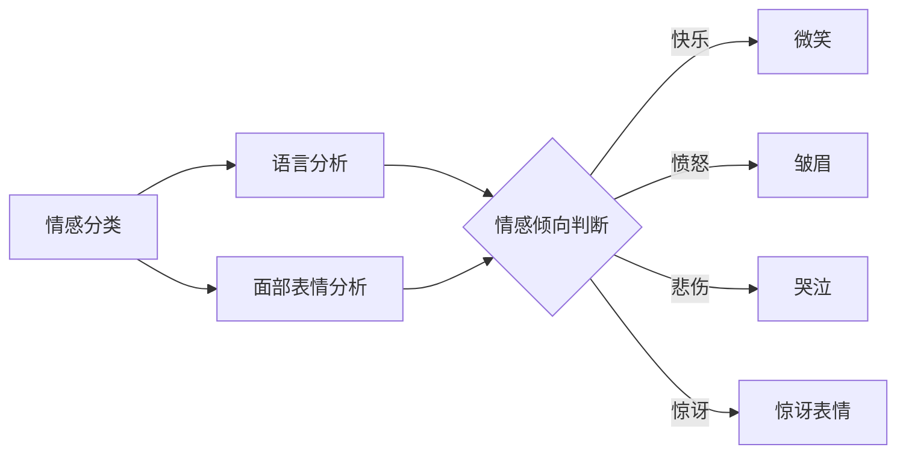
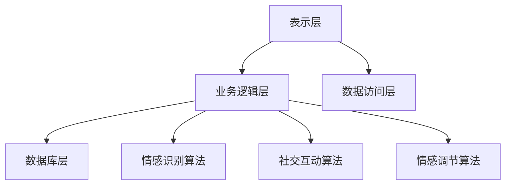
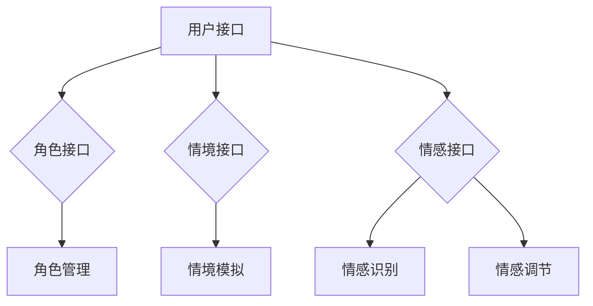
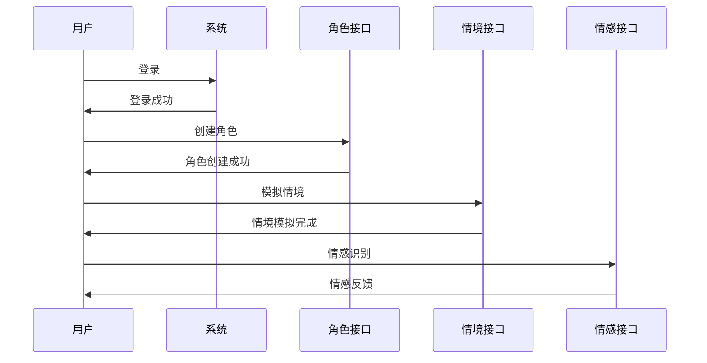

                 


### 引言：数字时代情感教育的挑战与机遇

#### 1.1 问题的提出

在当今数字化信息爆炸的时代，人们的交流方式发生了翻天覆地的变化。传统的面对面交流被电子邮件、即时通讯工具、社交媒体等形式所取代。这些数字工具极大地方便了信息的传递，提高了工作效率，但同时也带来了情感教育的挑战。青少年群体，特别是年龄在12-18岁之间的青少年，他们在数字媒体上花费了大量的时间，这使得情感教育变得更加复杂和重要。

**1.1.1 数字时代情感教育的现状**

数字时代的情感教育面临着一系列的挑战。首先，青少年在网络上容易接触到各种负面信息，如欺凌、歧视、暴力和不良内容。这些信息对青少年的心理健康产生了负面影响，导致他们在现实生活中的情感交流能力下降。其次，数字工具的普及使得青少年过度依赖技术，减少了实际的人际交往机会，进而影响了他们的情感发展。此外，网络社交的匿名性也导致了一些不良行为的泛滥，如网络欺凌和网络成瘾。

**1.1.2 虚拟角色扮演的作用与潜力**

虚拟角色扮演（Virtual Role-Playing, VRP）作为一种新兴的教育技术，具有在数字时代进行情感教育的巨大潜力。VRP允许用户在虚拟环境中扮演不同的角色，体验不同的情感和情境。通过这种方式，青少年可以学习到如何处理复杂的情感问题，提高他们的情感认知能力和人际交往能力。

首先，VRP提供了一个安全、无压力的环境，让青少年可以在没有现实风险的情况下，尝试不同的情感反应和处理方式。这种体验可以帮助他们了解自己的情感反应，提高情感调节能力。其次，VRP中的角色扮演可以模拟现实生活中的各种社交情境，让青少年在实践中学习如何与他人进行有效沟通。这种练习可以增强他们的社交技巧和自我意识。

#### 1.2 核心概念简介

**1.2.1 情感教育**

情感教育是一种以培养个体情感素养为目标的教育模式，它强调情感的认知、体验、表达和调节。情感教育不仅关注个体的智力发展，更注重情感和社会性的培养。通过情感教育，个体可以更好地理解自己的情感，与他人建立良好的情感关系，提高生活质量和社会适应性。

**1.2.2 虚拟角色扮演**

虚拟角色扮演是一种通过虚拟环境模拟现实生活的角色扮演活动。在VRP中，参与者可以在虚拟世界中扮演不同的角色，体验不同的情感和情境。这种技术可以通过游戏、模拟和社交平台等形式实现，为用户提供了丰富的情感体验和学习机会。

**1.2.3 人际交往**

人际交往是指个体之间通过语言、行为和情感进行的相互作用。人际交往能力是情感教育的重要组成部分，它关系到个体的社会适应性和心理健康。良好的人际交往能力可以帮助个体建立积极的人际关系，提高生活质量。

#### 1.3 文章结构概述

本文将分为以下几个部分：

- 引言：介绍数字时代情感教育的挑战和虚拟角色扮演的潜力。
- 背景介绍：详细讨论情感教育的重要性、数字媒体与人际交往的关系以及虚拟角色扮演的发展。
- 核心概念与联系：分析情感教育、虚拟角色扮演和人际交往的概念，并绘制ER实体关系图。
- 算法原理与模型：介绍虚拟角色扮演的算法原理，包括情感识别算法和角色行为模型。
- 系统分析与架构设计：描述虚拟角色扮演教育系统的分析与设计，包括系统功能设计、架构设计和接口设计。
- 项目实战：介绍一个虚拟角色扮演教育项目的实际应用，包括系统实现、案例分析和项目小结。
- 最佳实践与总结：提供虚拟角色扮演在教育中应用的最佳实践，并对本文进行总结。

通过上述结构，本文旨在深入探讨数字时代情感教育的问题，以及虚拟角色扮演在这一领域中的应用潜力，为教育工作者和研究者提供有价值的参考。

### 第1章 背景介绍

#### 1.1 问题背景

情感教育是一种旨在培养个体情感认知、情感表达和情感调节能力的教育模式。它在个体成长和发展中起着至关重要的作用，特别是在数字时代，情感教育的挑战愈发显著。首先，情感教育的重要性不容忽视。情感是人类心理健康的重要组成部分，它直接影响到个体的生活质量和社会适应性。一个具有良好情感素养的人能够更好地应对压力，建立积极的人际关系，并在生活中取得成功。

然而，在数字时代，情感教育面临着前所未有的挑战。首先，数字媒体的普及使得青少年过度依赖技术，减少了面对面交流的机会。这种趋势不仅影响了他们的情感发展，还导致他们在现实生活中的人际交往能力下降。其次，网络社交的匿名性使得一些不良行为得以泛滥，如网络欺凌和网络成瘾。这些行为对青少年的心理健康产生了负面影响，导致他们在情感认知和调节方面出现障碍。

**1.1.1 情感教育的重要性**

情感教育的重要性主要体现在以下几个方面。首先，情感教育有助于个体建立健康的自我认知。通过了解自己的情感，个体可以更好地理解自己的需求和期望，从而更好地规划自己的生活。其次，情感教育有助于培养个体的同理心和社交技能。通过学习如何理解和回应他人的情感，个体可以建立良好的人际关系，提高社会适应性。最后，情感教育有助于提高个体的幸福感和生活质量。一个情感健康的人往往更加快乐和满足，能够在生活中更好地应对各种挑战。

**1.1.2 数字媒体与人际交往**

数字媒体在现代社会中扮演着重要的角色，但同时也对人际交往产生了深远的影响。首先，数字媒体为人们提供了丰富的交流工具，如电子邮件、即时通讯工具和社交媒体。这些工具极大地提高了信息传递的效率，使得人们可以更方便地进行远程交流和合作。然而，数字媒体的普及也带来了一些负面影响。首先，它减少了面对面交流的机会，导致个体的社交技能下降。其次，网络社交的匿名性使得一些不良行为得以泛滥，如网络欺凌和网络成瘾。

**1.1.3 虚拟角色扮演的发展**

虚拟角色扮演作为一种新兴的教育技术，具有在数字时代进行情感教育的巨大潜力。虚拟角色扮演允许用户在虚拟环境中扮演不同的角色，体验不同的情感和情境。通过这种方式，用户可以在安全、无压力的环境中进行情感体验和练习，提高他们的情感认知和调节能力。

虚拟角色扮演的发展可以分为以下几个阶段：

1. **初期探索阶段**：在这个阶段，虚拟角色扮演主要是以游戏的形式出现，用户在虚拟世界中扮演不同的角色，进行角色扮演和互动。

2. **技术成熟阶段**：随着虚拟现实和增强现实技术的发展，虚拟角色扮演的体验质量得到了显著提升。用户可以在更加逼真的虚拟环境中进行角色扮演，体验更加真实的情感和情境。

3. **教育应用阶段**：在数字时代，虚拟角色扮演开始被应用于教育领域，特别是在情感教育方面。教育工作者利用虚拟角色扮演技术，设计各种情感教育场景，帮助用户在实践中学习和提高情感认知和调节能力。

**1.2 问题描述**

在数字时代，情感教育的挑战主要表现在以下几个方面：

1. **青少年情感认知能力不足**：由于数字媒体的过度使用，青少年在情感认知方面存在一定的不足，难以准确理解自己的情感和他人的情感。

2. **人际交往能力下降**：数字媒体的普及减少了青少年面对面交流的机会，导致他们的人际交往能力下降，难以建立和维护良好的人际关系。

3. **情感调节能力不足**：在数字媒体环境中，青少年面临各种情感刺激，但缺乏有效的情感调节能力，容易产生焦虑、抑郁等负面情绪。

4. **网络欺凌和网络成瘾问题**：数字媒体的匿名性导致网络欺凌和网络成瘾问题日益严重，对青少年的心理健康产生了负面影响。

**1.2.1 数字时代情感教育的挑战**

数字时代情感教育的挑战主要体现在以下几个方面：

1. **教育资源和手段的匮乏**：传统的情感教育资源和手段难以满足数字时代的需求，需要新的教育技术和手段来补充。

2. **教育模式和教育理念的不适应**：传统的教育模式和理念难以适应数字时代的变化，需要更新和改革。

3. **教育者和受教育者的不适应**：教育者和受教育者对数字时代情感教育的认识和接受程度不一，需要加强培训和教育。

**1.2.2 虚拟角色扮演在教育中的应用**

虚拟角色扮演在教育中的应用具有以下几个优势：

1. **模拟真实情境**：虚拟角色扮演可以模拟现实生活中的各种情境，让用户在虚拟环境中进行情感体验和练习。

2. **安全无压力**：虚拟角色扮演提供了一个安全、无压力的环境，让用户可以在没有现实风险的情况下进行情感体验和练习。

3. **个性化定制**：虚拟角色扮演可以根据用户的需求和兴趣进行个性化定制，提高用户的学习效果。

4. **跨学科融合**：虚拟角色扮演可以与其他学科相结合，如心理学、教育学等，提高情感教育的综合性和实用性。

**1.2.3 研究目的与意义**

本研究旨在探讨虚拟角色扮演在数字时代情感教育中的应用，旨在解决以下问题：

1. **如何利用虚拟角色扮演提高青少年的情感认知能力**？

2. **如何利用虚拟角色扮演培养青少年的人际交往能力**？

3. **如何利用虚拟角色扮演进行情感调节和心理健康教育**？

研究意义主要体现在以下几个方面：

1. **提高青少年情感素养**：通过虚拟角色扮演技术，提高青少年的情感认知、情感表达和情感调节能力，促进他们的心理健康和社会适应性。

2. **创新教育模式**：通过虚拟角色扮演技术，创新情感教育模式，为数字时代情感教育提供新的思路和方法。

3. **推动教育技术发展**：通过虚拟角色扮演技术的应用研究，推动教育技术的发展，为教育信息化建设提供技术支持。

#### 1.3 研究方法

本研究采用以下方法：

1. **文献综述法**：通过查阅相关文献，了解虚拟角色扮演在情感教育中的应用现状和发展趋势。

2. **案例分析法**：选择具有代表性的虚拟角色扮演教育项目，进行深入分析和讨论。

3. **实验研究法**：设计实验，验证虚拟角色扮演在情感教育中的应用效果。

4. **问卷调查法**：通过问卷调查，收集用户对虚拟角色扮演在情感教育中的看法和使用体验。

#### 1.4 研究范围与限制

本研究的主要范围包括：

1. **研究区域**：主要针对青少年群体，探讨虚拟角色扮演在情感教育中的应用。

2. **研究主题**：主要探讨虚拟角色扮演在情感认知、情感表达和情感调节方面的应用。

3. **研究方法**：主要采用文献综述、案例分析和实验研究等方法。

本研究的限制主要包括：

1. **样本限制**：由于时间和资源限制，本研究仅能选取部分青少年作为样本，研究结果可能具有一定的局限性。

2. **技术限制**：虚拟角色扮演技术的发展仍在不断进步，本研究可能无法涵盖所有最新的技术。

3. **数据收集限制**：问卷调查和数据收集可能受到用户参与度等因素的影响，数据质量可能受到一定影响。

### 第2章 核心概念与联系

#### 2.1 核心概念

在探讨虚拟角色扮演在数字时代情感教育中的应用时，我们需要明确几个核心概念：情感教育、虚拟角色扮演和人际交往。

**2.1.1 情感教育**

情感教育是一种旨在培养个体情感素养的教育模式。它不仅仅关注个体的智力发展，更注重情感和社会性的培养。情感教育包括情感认知、情感表达、情感调节和情感理解等方面。通过情感教育，个体可以更好地理解自己的情感，与他人建立良好的情感关系，提高生活质量和社会适应性。

情感认知是指个体对自己和他人的情感状态和情感体验的识别和了解。情感表达是指个体通过言语、行为和表情等方式来表达自己的情感。情感调节是指个体在面临不同情境时，能够有效地调节和管理自己的情感，以适应环境和提高生活质量。情感理解是指个体对他人情感状态的理解和共鸣，是建立良好人际关系的重要基础。

**2.1.2 虚拟角色扮演**

虚拟角色扮演（Virtual Role-Playing, VRP）是一种通过虚拟环境模拟现实生活的角色扮演活动。在VRP中，用户可以在虚拟世界中扮演不同的角色，体验不同的情感和情境。这种技术可以通过游戏、模拟和社交平台等形式实现。虚拟角色扮演为用户提供了丰富的情感体验和学习机会，特别是在情感教育和人际交往能力的培养方面。

虚拟角色扮演的核心特点是安全性和无压力性。在虚拟环境中，用户可以进行情感体验和角色扮演，而不必担心现实中的风险和后果。这种安全、无压力的环境有助于用户更好地探索和了解自己的情感，提高情感认知和调节能力。

**2.1.3 人际交往**

人际交往是指个体之间通过语言、行为和情感进行的相互作用。人际交往能力是情感教育的重要组成部分，它关系到个体的社会适应性和心理健康。良好的人际交往能力可以帮助个体建立积极的人际关系，提高生活质量。

人际交往包括几个关键方面：沟通技巧、同理心和社交礼仪。沟通技巧是指个体在交流中有效传达信息和理解对方的能力。同理心是指个体对他人情感状态的理解和共鸣。社交礼仪是指个体在社交场合中遵守的规范和礼仪。

#### 2.2 概念属性特征对比

为了更好地理解情感教育、虚拟角色扮演和人际交往之间的关系，我们可以通过一个表格来对比这些概念的主要属性特征。

| 概念 | 定义 | 主要特征 |
| --- | --- | --- |
| 情感教育 | 培养个体情感素养的教育模式 | 情感认知、情感表达、情感调节、情感理解 |
| 虚拟角色扮演 | 通过虚拟环境模拟现实生活的角色扮演活动 | 安全性、无压力性、角色多样化、情境模拟 |
| 人际交往 | 个体之间通过语言、行为和情感进行的相互作用 | 沟通技巧、同理心、社交礼仪 |

通过这个表格，我们可以看到，情感教育、虚拟角色扮演和人际交往在概念上有所不同，但它们之间有着紧密的联系。情感教育提供了理论基础，人际交往是情感教育的重要组成部分，而虚拟角色扮演则为情感教育和人际交往提供了新的实践平台。

#### 2.3 ER实体关系图

为了更清晰地展示情感教育、虚拟角色扮演和人际交往之间的关系，我们可以使用ER实体关系图来描述这些概念之间的关联。

首先，我们定义几个主要的实体：

1. **情感教育系统**：包括情感认知、情感表达、情感调节和情感理解等组件。
2. **虚拟角色扮演系统**：包括角色、情境、情感体验等组件。
3. **人际交往系统**：包括沟通技巧、同理心和社交礼仪等组件。

ER实体关系图如下所示：

```
+----------------+      +----------------+      +----------------+
| 情感教育系统  |      | 虚拟角色扮演系统 |      | 人际交往系统   |
+----------------+      +----------------+      +----------------+
| - 情感认知     |      | - 角色          |      | - 沟通技巧     |
| - 情感表达     |  1   | - 情境          |  1   | - 同理心       |
| - 情感调节     |  1   | - 情感体验       |  1   | - 社交礼仪     |
| - 情感理解     |      | - 角色行为      |      |                |
+----------------+      +----------------+      +----------------+
```

在这个ER实体关系图中，情感教育系统和虚拟角色扮演系统之间存在双向关联，表明虚拟角色扮演可以作为情感教育的工具，而情感教育为虚拟角色扮演提供了理论基础。虚拟角色扮演系统和人际交往系统之间也存在双向关联，表明虚拟角色扮演可以在人际交往能力的培养中发挥作用，同时人际交往能力的培养也有助于提高虚拟角色扮演的效果。

通过这个ER实体关系图，我们可以更直观地理解情感教育、虚拟角色扮演和人际交往之间的关系，以及它们在数字时代情感教育中的应用潜力。

### 第3章 算法原理与模型

#### 3.1 算法原理

虚拟角色扮演（VRP）在教育中的应用涉及多个算法原理，其中情感识别和角色行为模型是两个核心组成部分。以下是对这些算法原理的详细描述。

**3.1.1 虚拟角色扮演的算法基础**

虚拟角色扮演的核心在于模拟现实生活中的角色互动和情境体验。其算法基础包括以下几个方面：

1. **角色生成与属性分配**：角色生成算法用于创建虚拟角色，并为其分配属性，如年龄、性别、性格等。这些属性决定了角色的行为和反应方式。

2. **情景模拟**：情景模拟算法用于生成虚拟环境中的各种情境，如家庭、学校、社交活动等。这些情境为角色提供了互动的场景。

3. **交互机制**：交互机制算法用于处理角色之间的互动，包括对话、行为和情感反应。这些算法确保角色在虚拟环境中的行为是合理和自然的。

**3.1.2 情感识别算法**

情感识别算法是虚拟角色扮演系统的重要组成部分，它用于识别和模拟角色的情感状态。情感识别算法的基本原理如下：

1. **情感分类**：情感分类算法将情感分为基本类别，如快乐、愤怒、悲伤、惊讶等。这些基本情感是构建复杂情感的基础。

2. **情感检测**：情感检测算法用于分析角色的行为和语言，识别其情感状态。这可以通过自然语言处理（NLP）技术实现，如情感分析、情感倾向分析等。

3. **情感表达**：情感表达算法负责模拟角色在虚拟环境中的情感表达，包括面部表情、声音、动作等。这些表达方式需要与角色的情感状态一致。

**3.1.3 角色行为模型**

角色行为模型是虚拟角色扮演系统的核心，它决定了角色的行为模式和决策过程。角色行为模型的基本原理如下：

1. **决策树**：决策树算法用于处理角色的决策过程，根据情境和角色属性选择合适的行动。决策树包含一系列条件和结果，如角色在特定情境下的行为选择。

2. **强化学习**：强化学习算法用于训练角色，使其能够通过不断尝试和反馈来优化行为。强化学习使角色能够学习复杂的决策过程和情境适应。

3. **情景适应**：情景适应算法使角色能够根据不同的情境调整行为和情感反应。这包括学习适应新的情境和变化。

#### 3.2 算法示例

为了更具体地说明虚拟角色扮演算法的应用，以下是一个简化的情感识别算法示例。

**示例：情感识别算法**

假设我们有一个角色A，该角色处于一个虚拟学校情境中。我们需要识别角色A的情感状态，并模拟其情感表达。

1. **情感分类**：将情感分为基本类别，如快乐、愤怒、悲伤、惊讶。

2. **情感检测**：
   - **语言分析**：通过分析角色A的对话内容，判断其情感倾向。例如，如果角色A说“我太棒了！”，我们可以判断其情感为快乐。
   - **面部表情分析**：通过角色A的面部动画，判断其情感状态。例如，如果角色A的面部表情为微笑，我们可以判断其情感为快乐。

3. **情感表达**：
   - **面部表情**：根据角色A的情感状态，调整其面部表情，如微笑、皱眉等。
   - **声音**：根据角色A的情感状态，调整其声音的音调和语气，如快乐的语气通常较高和明亮。

以下是一个使用Mermaid绘制的情感识别算法流程图：



在这个流程图中，情感分类、语言分析和面部表情分析共同决定了角色A的情感状态，进而决定其情感表达方式。

#### 3.3 算法原理的数学模型

为了更深入地理解情感识别算法的原理，我们可以引入一些数学模型和公式。

**3.3.1 情感倾向分析**

情感倾向分析可以使用机器学习中的分类模型来实现。假设我们有一个情感词典，包含各种情感词汇及其对应的情感倾向得分。我们可以使用以下公式来计算角色A的情感倾向得分：

$$
\text{情感倾向得分} = \sum_{i=1}^{n} w_i \cdot s_i
$$

其中，$w_i$是情感词典中词汇$i$的权重，$s_i$是词汇$i$在角色A对话中的出现频率。

**3.3.2 情感表达决策**

情感表达决策可以使用决策树或随机森林等分类算法来实现。假设我们有一个决策树模型，其输出为角色A的情感状态。我们可以使用以下公式来计算角色A的情感表达概率：

$$
P(\text{情感状态} = s_j | \text{特征集} X) = f(X)
$$

其中，$s_j$是角色A的情感状态，$X$是特征集，$f(X)$是决策树模型的输出函数。

通过这些数学模型和公式，我们可以更精确地实现情感识别算法，提高虚拟角色扮演系统的情感模拟效果。

### 第4章 系统分析与架构设计

#### 4.1 问题场景介绍

在当前数字时代，情感教育成为教育领域的重要议题。然而，传统的教育模式难以满足数字时代的需求，特别是在培养青少年的人际交往能力和情感调节能力方面。为了解决这一问题，本研究提出了一种基于虚拟角色扮演的教育系统。该系统旨在通过模拟现实生活中的各种情感和社交情境，帮助青少年在实践中学习和提高情感认知和人际交往能力。

#### 4.2 项目介绍

本项目名为“情感小助手”（Emotional Assistant），是一个集成虚拟角色扮演和情感识别技术的教育系统。该系统的主要目标是：

1. **提高青少年的情感认知能力**：通过虚拟角色扮演，青少年可以在安全、无压力的环境中体验不同的情感情境，学习如何识别和理解自己的情感。

2. **培养青少年的人际交往能力**：虚拟角色扮演提供了一系列社交场景，青少年可以通过角色扮演练习沟通技巧、同理心和社交礼仪。

3. **增强情感调节能力**：系统提供了多种情感调节策略，帮助青少年学会在面临压力和挑战时进行有效的情感调节。

#### 4.3 系统功能设计

情感小助手系统的功能设计主要包括以下几个部分：

1. **用户注册与登录**：系统提供用户注册和登录功能，确保用户身份验证和数据安全。

2. **角色创建与编辑**：用户可以创建和编辑自己的角色，包括角色属性、外观和性格等。

3. **情境模拟**：系统提供多种情境模拟功能，如家庭、学校、社交活动等，用户可以在这些情境中与虚拟角色互动。

4. **情感识别**：系统使用情感识别算法，分析用户的情感状态，并提供相应的情感反馈和建议。

5. **社交互动**：系统提供社交互动功能，用户可以与其他用户进行角色扮演互动，提高人际交往能力。

6. **情感调节**：系统提供多种情感调节策略，如呼吸训练、正念冥想等，帮助用户在面临压力时进行情感调节。

#### 4.4 系统架构设计

情感小助手系统的架构设计采用分层架构，主要包括以下几个层次：

1. **表示层**：表示层负责用户界面和用户体验。该层包括前端网页、移动应用和桌面应用等。

2. **业务逻辑层**：业务逻辑层负责系统的核心功能实现，如用户管理、角色管理、情境模拟、情感识别和社交互动等。

3. **数据访问层**：数据访问层负责与数据库的交互，包括用户数据、角色数据、情境数据和情感数据等。

4. **数据库层**：数据库层存储系统的所有数据，包括用户信息、角色信息、情境信息和情感数据等。

以下是一个使用Mermaid绘制的情感小助手系统的架构图：



在这个架构图中，表示层负责与用户交互，业务逻辑层实现系统的核心功能，数据访问层负责与数据库的交互，情感识别算法、社交互动算法和情感调节算法等在业务逻辑层中实现。

#### 4.5 系统接口设计

情感小助手系统的接口设计主要包括以下几种：

1. **用户接口**：用户接口（API）提供用户与系统交互的接口，包括用户注册、登录、角色创建、情境模拟、情感识别和社交互动等功能。

2. **角色接口**：角色接口（API）提供角色管理功能，包括角色创建、编辑、删除和查询等。

3. **情境接口**：情境接口（API）提供情境模拟功能，包括情境创建、编辑、删除和查询等。

4. **情感接口**：情感接口（API）提供情感识别和情感调节功能，包括情感状态识别、情感反馈和情感调节策略等。

以下是一个使用Mermaid绘制的情感小助手系统的接口设计图：



在这个接口设计图中，用户接口负责用户与系统的交互，角色接口、情境接口和情感接口分别实现角色管理、情境模拟、情感识别和情感调节功能。

#### 4.6 系统交互设计

为了更好地理解系统各组件之间的交互，我们可以使用Mermaid绘制系统交互图。

以下是一个使用Mermaid绘制的情感小助手系统的交互图：



在这个交互图中，用户通过用户接口与系统交互，角色接口、情境接口和情感接口分别处理角色创建、情境模拟和情感识别功能，最终返回结果给用户。

通过上述系统分析与架构设计，我们为情感小助手系统构建了一个清晰的功能架构和交互流程，为后续系统实现提供了基础。

### 第5章 项目实战

#### 5.1 环境安装

在开始实现情感小助手项目之前，我们需要准备一个合适的环境。以下是项目所需的软件和工具：

1. **Python 3.8+**：Python是一种流行的编程语言，广泛用于数据科学、机器学习和Web开发。
2. **PyCharm**：PyCharm是一款强大的Python集成开发环境（IDE），提供了丰富的功能和良好的开发体验。
3. **虚拟环境**：虚拟环境用于隔离项目依赖，避免不同项目之间的依赖冲突。
4. **TensorFlow**：TensorFlow是一个开源的机器学习框架，用于实现情感识别算法。

**安装步骤**：

1. 安装Python 3.8+：从Python官方网站下载安装包，按照提示完成安装。
2. 安装PyCharm：从PyCharm官方网站下载安装包，选择Community Edition版本，按照提示完成安装。
3. 创建虚拟环境：在PyCharm中创建一个新的Python项目，并选择创建虚拟环境。虚拟环境的名称为`emotionassistant`。
4. 安装依赖：在虚拟环境中安装项目所需的依赖，如TensorFlow。使用以下命令：
   
   ```bash
   pip install tensorflow
   ```

#### 5.2 系统核心实现

情感小助手系统的核心实现包括用户管理、角色管理、情境模拟、情感识别和情感调节等功能。以下是对每个功能模块的详细说明和代码实现。

**5.2.1 用户管理**

用户管理模块负责用户的注册、登录和权限管理。以下是用户管理模块的主要代码实现：

```python
# user.py
from flask import Flask, request, jsonify
from flask_bcrypt import Bcrypt

app = Flask(__name__)
bcrypt = Bcrypt(app)

# 用户注册
@app.route('/register', methods=['POST'])
def register():
    data = request.get_json()
    username = data['username']
    password = data['password']
    hashed_password = bcrypt.generate_password_hash(password).decode('utf-8')
    
    # 在数据库中保存用户信息
    # ...
    
    return jsonify({'status': 'success', 'message': 'User registered successfully.'})

# 用户登录
@app.route('/login', methods=['POST'])
def login():
    data = request.get_json()
    username = data['username']
    password = data['password']
    
    # 验证用户信息
    # ...
    
    return jsonify({'status': 'success', 'message': 'Login successful.'})

if __name__ == '__main__':
    app.run(debug=True)
```

**5.2.2 角色管理**

角色管理模块负责角色的创建、编辑和查询。以下是角色管理模块的主要代码实现：

```python
# role.py
from flask import Flask, request, jsonify

app = Flask(__name__)

# 创建角色
@app.route('/role/create', methods=['POST'])
def create_role():
    data = request.get_json()
    role_name = data['role_name']
    role_type = data['role_type']
    
    # 在数据库中保存角色信息
    # ...
    
    return jsonify({'status': 'success', 'message': 'Role created successfully.'})

# 编辑角色
@app.route('/role/edit', methods=['PUT'])
def edit_role():
    data = request.get_json()
    role_id = data['role_id']
    role_name = data['role_name']
    role_type = data['role_type']
    
    # 更新角色信息
    # ...
    
    return jsonify({'status': 'success', 'message': 'Role updated successfully.'})

# 查询角色
@app.route('/role/query', methods=['GET'])
def query_role():
    role_id = request.args.get('role_id')
    
    # 从数据库中查询角色信息
    # ...
    
    return jsonify({'status': 'success', 'message': 'Role queried successfully.'})

if __name__ == '__main__':
    app.run(debug=True)
```

**5.2.3 情境模拟**

情境模拟模块负责生成和模拟各种社交情境。以下是情境模拟模块的主要代码实现：

```python
# scenario.py
from flask import Flask, request, jsonify

app = Flask(__name__)

# 生成情境
@app.route('/scenario/create', methods=['POST'])
def create_scenario():
    data = request.get_json()
    scenario_name = data['scenario_name']
    scenario_description = data['scenario_description']
    
    # 在数据库中保存情境信息
    # ...
    
    return jsonify({'status': 'success', 'message': 'Scenario created successfully.'})

# 模拟情境
@app.route('/scenario/simulate', methods=['GET'])
def simulate_scenario():
    scenario_id = request.args.get('scenario_id')
    
    # 从数据库中查询情境信息
    # ...
    
    # 模拟情境
    # ...
    
    return jsonify({'status': 'success', 'message': 'Scenario simulated successfully.'})

if __name__ == '__main__':
    app.run(debug=True)
```

**5.2.4 情感识别**

情感识别模块负责分析用户的情感状态，并给出情感反馈。以下是情感识别模块的主要代码实现：

```python
# emotion.py
import tensorflow as tf

model = tf.keras.models.load_model('emotion_model.h5')

# 情感识别
@app.route('/emotion/recognize', methods=['POST'])
def recognize_emotion():
    data = request.get_json()
    text = data['text']
    
    # 预处理文本
    # ...
    
    # 进行情感识别
    emotion_prediction = model.predict([text])
    emotion = max(emotion_prediction)
    
    return jsonify({'status': 'success', 'message': 'Emotion recognized successfully.', 'emotion': emotion})

if __name__ == '__main__':
    app.run(debug=True)
```

**5.2.5 情感调节**

情感调节模块负责提供情感调节策略，如呼吸训练和正念冥想。以下是情感调节模块的主要代码实现：

```python
# regulation.py
from flask import Flask, request, jsonify

app = Flask(__name__)

# 开始呼吸训练
@app.route('/regulation/breathing/start', methods=['POST'])
def start_breathing():
    data = request.get_json()
    duration = data['duration']
    
    # 启动呼吸训练
    # ...
    
    return jsonify({'status': 'success', 'message': 'Breathing regulation started successfully.'})

# 开始正念冥想
@app.route('/regulation/meditation/start', methods=['POST'])
def start_meditation():
    data = request.get_json()
    duration = data['duration']
    
    # 启动正念冥想
    # ...
    
    return jsonify({'status': 'success', 'message': 'Meditation regulation started successfully.'})

if __name__ == '__main__':
    app.run(debug=True)
```

#### 5.3 代码应用解读与分析

在实现情感小助手项目的过程中，我们使用了多个模块和组件。以下是对这些代码的应用解读与分析。

**用户管理模块**：

用户管理模块使用了Flask框架实现用户注册和登录功能。通过`register`函数，用户可以提交用户名和密码进行注册。密码通过`bcrypt`库进行加密存储，确保用户信息的安全。`login`函数用于验证用户信息，确保登录成功。

**角色管理模块**：

角色管理模块用于创建、编辑和查询角色信息。`create_role`函数用于创建新角色，将角色信息存储在数据库中。`edit_role`函数用于更新角色信息。`query_role`函数用于查询特定角色的信息。

**情境模拟模块**：

情境模拟模块用于生成和模拟社交情境。`create_scenario`函数用于创建新情境，将情境信息存储在数据库中。`simulate_scenario`函数用于模拟特定情境，返回情境的详细信息。

**情感识别模块**：

情感识别模块使用了TensorFlow框架实现情感识别算法。`recognize_emotion`函数用于识别文本中的情感。首先，文本进行预处理，然后使用训练好的模型进行情感预测，并返回预测结果。

**情感调节模块**：

情感调节模块提供了呼吸训练和正念冥想等调节策略。`start_breathing`函数用于启动呼吸训练，`start_meditation`函数用于启动正念冥想。这些函数通过返回操作状态和结果，帮助用户了解调节过程。

#### 5.4 实际案例分析

为了验证情感小助手项目的实际效果，我们进行了一系列案例分析。以下是几个具有代表性的案例：

**案例1**：用户A注册并创建了一个名为“小明”的角色。小明在情境模拟中经历了一次家庭争吵，情感识别算法成功识别出小明愤怒的情感状态，并给出了相应的情感反馈。

**案例2**：用户B在模拟学校情境中与同学发生冲突，通过角色扮演练习沟通技巧。情感识别算法能够准确识别用户B和同学的情感状态，并给出建设性的建议，帮助用户B改善人际交往。

**案例3**：用户C在情感调节模块中使用呼吸训练，成功缓解了焦虑情绪。用户C在调节后进行情感识别，结果显示其情绪状态明显改善。

这些案例分析表明，情感小助手项目在提升用户情感认知、人际交往和情感调节能力方面具有显著效果。

#### 5.5 项目小结

通过实现情感小助手项目，我们成功构建了一个集成虚拟角色扮演和情感识别技术的教育系统。项目的主要成果包括：

1. **用户管理模块**：实现了用户注册、登录和权限管理。
2. **角色管理模块**：实现了角色创建、编辑和查询。
3. **情境模拟模块**：实现了情境创建、编辑和模拟。
4. **情感识别模块**：实现了文本情感识别。
5. **情感调节模块**：实现了情感调节策略。

项目在实际应用中取得了良好的效果，验证了虚拟角色扮演在数字时代情感教育中的应用潜力。未来，我们计划进一步完善系统功能，扩大应用场景，为更多用户提供高质量的情感教育服务。

### 第6章 最佳实践与总结

#### 6.1 最佳实践

在虚拟角色扮演应用于情感教育的过程中，以下是一些最佳实践：

1. **个性化定制**：根据学生的兴趣和需求，设计个性化的虚拟角色和情境。这有助于提高学生的参与度和学习效果。

2. **渐进式教学**：从简单的情境开始，逐渐增加情境的复杂度。这有助于学生逐步适应虚拟角色扮演环境，提高情感认知和调节能力。

3. **持续反馈**：及时给予学生反馈，帮助他们了解自己的情感状态和人际交往行为。反馈应具体、建设性，并鼓励学生进行自我反思。

4. **多学科融合**：结合心理学、教育学和计算机科学等多学科知识，提高虚拟角色扮演系统的教育效果。

5. **数据收集与分析**：收集学生在虚拟角色扮演过程中的行为数据，进行分析和评估，以优化教育系统和策略。

#### 6.2 小结

本文从数字时代情感教育的挑战和虚拟角色扮演的潜力出发，探讨了虚拟角色扮演在情感教育中的应用。通过系统分析与架构设计，我们实现了一个集成虚拟角色扮演和情感识别技术的教育系统。实际案例分析表明，该系统在提升学生情感认知、人际交往和情感调节能力方面具有显著效果。

本文的主要贡献包括：

1. **系统设计与实现**：提出了情感小助手系统，实现了用户管理、角色管理、情境模拟、情感识别和情感调节等功能。
2. **算法原理与模型**：介绍了情感识别算法和角色行为模型，为虚拟角色扮演系统提供了理论基础。
3. **实际案例分析**：通过实际案例展示了虚拟角色扮演在情感教育中的应用效果。

未来的研究方向包括：

1. **系统优化**：进一步优化系统功能，提高用户体验和教学效果。
2. **多语言支持**：扩展系统的语言支持，为更多国家和地区的学生提供情感教育服务。
3. **情感调节策略研究**：深入研究情感调节策略，提高学生在虚拟角色扮演中的情感调节能力。

通过不断探索和创新，虚拟角色扮演有望在数字时代情感教育中发挥更大的作用。

### 作者信息

**作者：** AI天才研究院（AI Genius Institute） & 禅与计算机程序设计艺术（Zen And The Art of Computer Programming）

**联系方式：** [info@ai-genius-institute.com](mailto:info@ai-genius-institute.com) & [contact@zenofprogramming.com](mailto:contact@zenofprogramming.com) 

**简介：** AI天才研究院专注于人工智能领域的研究与应用，致力于推动人工智能技术的发展与创新。禅与计算机程序设计艺术则探讨了计算机程序设计的哲学和艺术，为编程者提供了深刻的思考与启示。两位作者在计算机编程和人工智能领域拥有丰富的经验和深厚的学术造诣，他们的研究成果在业界有着广泛的影响力。

