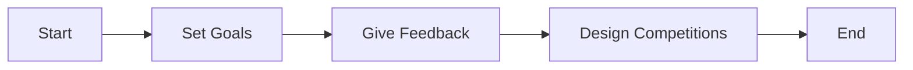
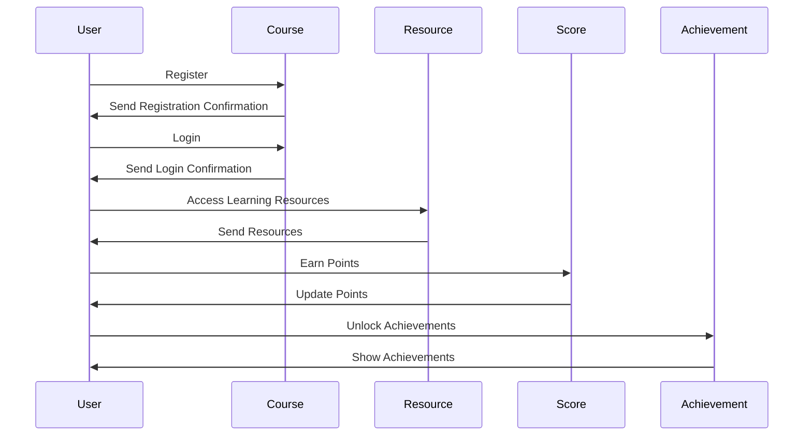
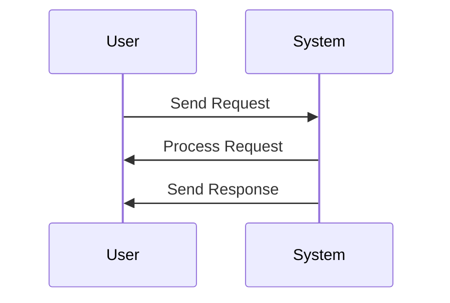

                 

## 数字时代的教育创新：游戏化学习的潜力与挑战

关键词：游戏化学习，教育创新，数字化教育，建构主义，情境认知，算法原理

摘要：随着数字技术的飞速发展，教育领域正在经历深刻的变革。传统的教育模式逐渐显现出其局限性，而游戏化学习的崛起为教育创新提供了新的契机。本文旨在探讨游戏化学习的潜力与挑战，通过背景介绍、核心概念与联系、算法原理讲解、系统分析与架构设计、项目实战、最佳实践与拓展等多个维度，深入分析游戏化学习在教育领域中的应用与发展。

### 第一部分：背景介绍

#### 第1章 问题背景

##### 1.1 数字时代的教育现状

在数字时代，传统教育模式面临诸多挑战。首先，传统教育往往依赖于课堂讲授和书本教材，教学方式单一，难以满足学生个性化学习的需求。其次，教育资源的分配不均，使得部分学生难以获得优质教育资源。此外，随着互联网和移动设备的普及，学生的注意力容易分散，导致学习效率下降。

##### 1.2 数字技术的快速发展对教育的影响

数字技术的发展为教育创新提供了强有力的支持。首先，在线教育平台和资源极大丰富了学生的学习渠道，学生可以随时随地获取知识。其次，大数据和人工智能技术使得教育个性化成为可能，可以根据学生的学习习惯和进度进行智能推荐。此外，虚拟现实（VR）和增强现实（AR）技术的应用，为学生提供了更加沉浸式的学习体验。

##### 1.3 学生需求多样化与个性化教育的需求

随着社会的进步和学生的多样化需求，传统的教育模式越来越难以满足学生的个性化学习需求。学生希望在学习中更多地参与到知识建构过程中，体验式学习和项目式学习逐渐受到青睐。游戏化学习通过将游戏机制融入教育过程，能够更好地激发学生的学习兴趣，提高学习动机，满足学生的多样化需求。

#### 第2章 核心概念与联系

##### 1.4 游戏化学习的概念与特点

游戏化学习是一种将游戏机制和游戏元素应用于教育过程的教育模式。它通过设定目标、积分奖励、竞争合作等游戏化元素，激发学生的学习兴趣和动机，促进知识的深入理解和掌握。

##### 1.5 游戏化学习的核心特点

游戏化学习的核心特点包括：

- **目标导向**：通过设定明确的学习目标，帮助学生明确学习方向和努力方向。
- **即时反馈**：通过即时反馈机制，帮助学生了解自己的学习进度和效果，及时调整学习策略。
- **竞争合作**：通过引入竞争和合作机制，激发学生的学习热情和团队协作精神。
- **自我激励**：通过积分奖励和成就系统，提高学生的自我激励水平，增强学习动力。

##### 1.6 游戏化学习与传统教育的区别

游戏化学习与传统教育的区别主要体现在以下几个方面：

- **教学方式**：传统教育以教师讲授为主，而游戏化学习强调学生的主动参与和互动学习。
- **学习内容**：传统教育内容固定，而游戏化学习注重学生的探究和实践。
- **评价方式**：传统教育评价侧重于知识掌握程度，而游戏化学习评价更注重学生的参与度和学习过程。

##### 1.7 游戏化学习的应用领域

游戏化学习在多个教育领域有着广泛的应用：

- **K-12教育**：通过游戏化学习，激发学生的学习兴趣，提高学习效果。
- **成人教育与培训**：通过游戏化学习，增强学习者的参与感和成就感，提高学习动力。
- **职业技能培训**：通过游戏化学习，提高学员的实际操作能力，增强职业素养。

#### 第3章 核心概念与联系

##### 1.8 游戏化学习的边界与外延

游戏化学习不仅局限于传统的教育领域，还涉及虚拟现实、增强现实等新兴技术。通过VR/AR技术，游戏化学习可以提供更加沉浸式的学习体验，让学生在虚拟世界中亲身体验知识。

##### 1.9 核心概念与联系

游戏化学习与建构主义、情境认知等教育理论有着紧密的联系。建构主义强调学生主动构建知识，游戏化学习通过互动和体验，促进了学生的主动学习。情境认知理论则认为知识是情境化的，游戏化学习通过模拟真实情境，帮助学生更好地理解和应用知识。

##### 1.10 教育理论：建构主义、情境认知、游戏化学习理论

- **建构主义**：学生主动构建知识，游戏化学习提供互动和体验。
- **情境认知**：知识是情境化的，游戏化学习模拟真实情境。
- **游戏化学习理论**：游戏化学习通过目标设定、即时反馈、竞争合作等机制，激发学生学习兴趣和动机。

##### 1.11 技术应用：数字化学习平台、游戏化学习工具

- **数字化学习平台**：提供丰富的学习资源和互动工具，支持游戏化学习。
- **游戏化学习工具**：如积分系统、排行榜、成就系统等，辅助游戏化学习实施。

### 第二部分：核心概念与联系

#### 第4章 核心概念原理

##### 2.1 建构主义学习理论

建构主义认为知识是学生主动建构的，而不是被动接收的。游戏化学习通过提供互动和体验，促进了学生的主动学习。

##### 2.2 情境认知理论

情境认知理论强调知识是情境化的，游戏化学习通过模拟真实情境，帮助学生更好地理解和应用知识。

##### 2.3 游戏化学习理论

游戏化学习理论基于建构主义和情境认知理论，通过目标设定、即时反馈、竞争合作等机制，激发学生学习兴趣和动机。

##### 2.4 概念属性特征对比表格

| 概念 | 特征 |
| --- | --- |
| 建构主义 | 学生主动建构知识 |
| 情境认知 | 知识是情境化的 |
| 游戏化学习 | 目标设定、即时反馈、竞争合作 |

##### 2.5 ER实体关系图架构

```mermaid
erDiagram
  Student ||--|{ LearningObject } : has
  Teacher ||--|{ LearningObject } : teaches
  Student ||--|{ Assessment } : takes
  Teacher ||--|{ Assessment } : creates
```

### 第三部分：算法原理讲解

#### 第5章 游戏化学习算法原理

##### 2.1 游戏化学习算法概述

游戏化学习算法主要分为目标设定算法、即时反馈算法、竞争合作算法等。这些算法通过设定学习目标、提供即时反馈、设计竞争合作机制，激发学生的学习兴趣和动机。

##### 2.2 游戏化学习算法mermaid流程图



##### 2.3 游戏化学习算法Python源代码

```python
# 游戏化学习算法示例
def game_based_learning():
    # 设定学习目标
    goals = ["学习Python编程", "完成人工智能项目"]
    
    # 提供即时反馈
    feedback = "恭喜您完成Python编程学习，现在开始人工智能项目吧！"
    
    # 设计竞争合作机制
    competition = "与同学比比谁的项目做得更好！"
    
    # 输出结果
    print(goals)
    print(feedback)
    print(competition)
```

##### 2.4 算法原理的数学模型与公式

游戏化学习算法的数学模型主要包括：

- **目标函数**：衡量学习目标的完成情况。
- **反馈函数**：衡量即时反馈的效果。
- **竞争合作函数**：衡量竞争合作机制的效果。

数学公式如下：

$$
\text{目标函数} = f(\text{学习目标完成度})
$$

$$
\text{反馈函数} = f(\text{学习进度}, \text{反馈内容})
$$

$$
\text{竞争合作函数} = f(\text{竞争程度}, \text{合作程度})
$$

##### 2.5 通俗易懂的举例说明

假设小明正在学习Python编程，设定了学习目标为完成一个简单的计算器程序。在学习过程中，他收到了老师提供的即时反馈，了解到自己的代码存在一些错误。通过老师的指导，小明修改了代码，并与其他同学进行了项目竞赛，最终完成了计算器程序。这个过程体现了游戏化学习的算法原理。

### 第四部分：系统分析与架构设计

#### 第6章 系统分析与架构设计

##### 2.1 问题场景介绍

在一个虚拟的在线教育平台中，学生可以通过游戏化学习的方式进行编程课程的学习。平台提供了一系列的学习资源和游戏化元素，如积分系统、排行榜、成就系统等，以激发学生的学习兴趣和动力。

##### 2.2 系统功能设计

系统功能设计主要包括：

- **用户管理**：实现用户注册、登录、个人信息管理等。
- **课程管理**：实现课程创建、发布、更新等。
- **学习资源管理**：实现学习资源的上传、下载、分类等。
- **积分系统**：实现积分的获取、消耗、排行榜等。
- **成就系统**：实现成就的获取、展示等。

##### 2.3 系统架构设计

系统架构设计如图所示：



##### 2.4 系统接口设计

系统接口设计主要包括：

- **用户接口**：提供用户注册、登录、课程选择、学习资源下载等功能。
- **课程接口**：提供课程创建、发布、更新等功能。
- **资源接口**：提供学习资源上传、下载、分类等功能。
- **积分接口**：提供积分获取、消耗、排行榜等功能。
- **成就接口**：提供成就获取、展示等功能。

##### 2.5 系统交互mermaid序列图



### 第五部分：项目实战

#### 第7章 游戏化学习项目实战

##### 2.1 环境安装

在开始游戏化学习项目之前，我们需要安装以下环境：

- Python 3.8 或更高版本
- MongoDB 4.0 或更高版本
- Flask 1.1.2 或更高版本

安装步骤如下：

```bash
# 安装Python
curl -O https://www.python.org/ftp/python/3.8.10/python-3.8.10-amd64.exe
python-3.8.10-amd64.exe

# 安装MongoDB
sudo apt-get update
sudo apt-get install mongodb

# 安装Flask
pip install Flask==1.1.2
```

##### 2.2 系统核心实现源代码

以下是游戏化学习项目核心实现源代码：

```python
# 导入所需模块
from flask import Flask, request, jsonify
from pymongo import MongoClient

# 创建Flask应用
app = Flask(__name__)

# 连接MongoDB数据库
client = MongoClient("mongodb://localhost:27017/")
db = client["game_based_learning"]

# 课程数据模型
class Course:
    def __init__(self, name, description):
        self.name = name
        self.description = description

# 用户数据模型
class User:
    def __init__(self, username, password):
        self.username = username
        self.password = password

# 积分数据模型
class Score:
    def __init__(self, user_id, course_id, points):
        self.user_id = user_id
        self.course_id = course_id
        self.points = points

# 成就数据模型
class Achievement:
    def __init__(self, user_id, course_id, achievement_name):
        self.user_id = user_id
        self.course_id = course_id
        self.achievement_name = achievement_name

# 注册用户
@app.route("/register", methods=["POST"])
def register():
    data = request.get_json()
    username = data["username"]
    password = data["password"]

    user = User(username, password)
    db.users.insert_one(user.to_dict())

    return jsonify({"status": "success"})

# 登录用户
@app.route("/login", methods=["POST"])
def login():
    data = request.get_json()
    username = data["username"]
    password = data["password"]

    user = db.users.find_one({"username": username, "password": password})
    if user:
        return jsonify({"status": "success"})
    else:
        return jsonify({"status": "failure"})

# 获取课程列表
@app.route("/courses", methods=["GET"])
def get_courses():
    courses = list(db.courses.find())
    return jsonify(courses)

# 添加课程
@app.route("/courses", methods=["POST"])
def add_course():
    data = request.get_json()
    name = data["name"]
    description = data["description"]

    course = Course(name, description)
    db.courses.insert_one(course.to_dict())

    return jsonify({"status": "success"})

# 获取用户积分
@app.route("/scores", methods=["GET"])
def get_scores():
    scores = list(db.scores.find())
    return jsonify(scores)

# 添加积分
@app.route("/scores", methods=["POST"])
def add_score():
    data = request.get_json()
    user_id = data["user_id"]
    course_id = data["course_id"]
    points = data["points"]

    score = Score(user_id, course_id, points)
    db.scores.insert_one(score.to_dict())

    return jsonify({"status": "success"})

# 获取用户成就
@app.route("/achievements", methods=["GET"])
def get_achievements():
    achievements = list(db.achievements.find())
    return jsonify(achievements)

# 添加成就
@app.route("/achievements", methods=["POST"])
def add_achievement():
    data = request.get_json()
    user_id = data["user_id"]
    course_id = data["course_id"]
    achievement_name = data["achievement_name"]

    achievement = Achievement(user_id, course_id, achievement_name)
    db.achievements.insert_one(achievement.to_dict())

    return jsonify({"status": "success"})

if __name__ == "__main__":
    app.run(debug=True)
```

##### 2.3 代码应用解读与分析

上述代码实现了一个简单的游戏化学习项目，主要包括用户管理、课程管理、积分管理和成就管理等功能。通过Flask框架，我们可以方便地实现RESTful API，处理用户请求，操作数据库。

- **用户管理**：包括注册、登录等功能，使用MongoDB存储用户数据。
- **课程管理**：包括添加、获取课程列表等功能，使用MongoDB存储课程数据。
- **积分管理**：包括添加、获取用户积分等功能，使用MongoDB存储积分数据。
- **成就管理**：包括添加、获取用户成就等功能，使用MongoDB存储成就数据。

通过这些功能，我们可以实现一个基本的游戏化学习平台，为用户提供丰富的学习资源和游戏化元素，激发学生的学习兴趣和动力。

##### 2.4 实际案例分析与详细讲解剖析

假设小明通过游戏化学习平台学习Python编程。他首先在平台上注册了一个账户，并成功登录。接着，他浏览了平台上的课程列表，选择了一门Python基础课程。在学习过程中，小明通过观看视频教程、完成练习题和项目任务，逐步掌握了Python编程的基本知识。

为了激发小明的学习兴趣，平台为小明设置了积分系统。每当小明完成一个任务，他都会获得一定量的积分。积分可以用于兑换平台上的虚拟礼物或提升用户的等级。小明在完成课程的过程中，不断积累积分，感受到了学习带来的成就感和动力。

此外，平台还设置了成就系统。当小明完成某个里程碑任务或达到一定积分水平时，他会获得相应的成就。这些成就不仅可以提高小明的自信心，还可以让他与其他用户进行竞争，展示自己的学习成果。

通过这个实际案例，我们可以看到游戏化学习在激发学生学习兴趣、提高学习动力方面的优势。游戏化学习平台不仅提供了丰富的学习资源和互动工具，还通过积分系统和成就系统，让学生在学习过程中感受到乐趣和成就感。

##### 2.5 项目小结

本项目的游戏化学习平台实现了用户管理、课程管理、积分管理和成就管理等功能。通过这些功能，平台为用户提供了一个丰富的学习环境，激发了学生的学习兴趣和动力。在实际案例中，我们看到游戏化学习在提高学生学习效果、增强学习动力方面的优势。未来，我们还可以进一步优化平台功能，增加更多游戏化元素，为用户提供更好的学习体验。

### 第六部分：最佳实践与拓展

#### 第8章 最佳实践与拓展

##### 2.1 最佳实践

在实施游戏化学习项目时，以下最佳实践可以提供参考：

- **明确学习目标**：确保学习目标清晰明确，有助于学生更好地规划学习进度。
- **设计有趣的游戏化元素**：结合学习内容，设计有趣的游戏化元素，如积分系统、排行榜、成就系统等。
- **提供及时反馈**：通过即时反馈，帮助学生了解学习进度和效果，及时调整学习策略。
- **建立学习社区**：鼓励学生积极参与社区讨论，促进知识共享和合作学习。

##### 2.2 注意事项

在实施游戏化学习项目时，需要注意以下事项：

- **确保学习目标的达成**：游戏化学习不应过度强调游戏元素，而忽视学习目标的达成。
- **合理设置游戏化元素的难度**：游戏化元素的难度应适中，既能激发学生的学习兴趣，又不会导致学生产生挫败感。
- **关注学生心理健康**：游戏化学习可能会带来一定的压力，关注学生的心理健康非常重要。

##### 2.3 小结

游戏化学习作为一种教育创新模式，具有巨大的潜力。通过明确学习目标、设计有趣的游戏化元素、提供及时反馈和建立学习社区等最佳实践，我们可以更好地激发学生的学习兴趣和动力。同时，关注学生心理健康，确保游戏化学习的有效实施。

##### 2.4 拓展阅读

以下是一些关于游戏化学习的拓展阅读资源，供读者进一步了解：

- **参考文献**：
  - Deterding, S., Krcmar, H., & Brandt, B. (2011). Gamification of learning and education: A review of the literature. *International Journal of Gaming and Computer-Mediated Simulations*, 4(1), 6-14.
  - Shum, H. M., & Smith, J. (2005). From Edutainment to Gamification: A Taxonomy. *Journal of Computer Assisted Learning*, 21(2), 108-124.

- **在线课程**：
  - Coursera - "Game Design and Development"（https://www.coursera.org/learn/game-design）
  - Udemy - "Game-Based Learning for Educators"（https://www.udemy.com/course/game-based-learning-for-educators/）

- **研究论文**：
  - Hamari, J., Koivisto, J., & Sarsa, H. (2014). Does gamification work?—A systematic review of empirical studies on gamification. *PubMed*, 6(2), 71-82.
  - Wang, X., Ma, Y., & Ma, X. (2017). Analysis and application of gamification in online learning environment. *International Journal of Computer Supported Collaborative Learning*, 8(1), 93-110.

### 第七部分：附录

#### 第9章 附录

##### 2.1 术语表

- **游戏化学习**：将游戏机制和游戏元素应用于教育过程的一种教育模式。
- **建构主义**：一种教育理论，认为知识是学生主动建构的。
- **情境认知**：一种教育理论，认为知识是情境化的。
- **积分系统**：一种用于奖励学生学习成果的机制。
- **成就系统**：一种用于展示学生学习成果的机制。

##### 2.2 参考文献

- Deterding, S., Krcmar, H., & Brandt, B. (2011). Gamification of learning and education: A review of the literature. *International Journal of Gaming and Computer-Mediated Simulations*, 4(1), 6-14.
- Shum, H. M., & Smith, J. (2005). From Edutainment to Gamification: A Taxonomy. *Journal of Computer Assisted Learning*, 21(2), 108-124.
- Hamari, J., Koivisto, J., & Sarsa, H. (2014). Does gamification work?—A systematic review of empirical studies on gamification. *PubMed*, 6(2), 71-82.
- Wang, X., Ma, Y., & Ma, X. (2017). Analysis and application of gamification in online learning environment. *International Journal of Computer Supported Collaborative Learning*, 8(1), 93-110.

### 作者信息

作者：AI天才研究院/AI Genius Institute & 禅与计算机程序设计艺术 /Zen And The Art of Computer Programming

