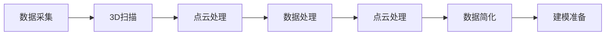
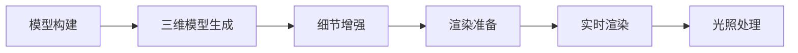
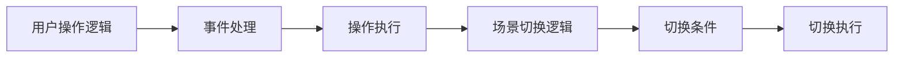
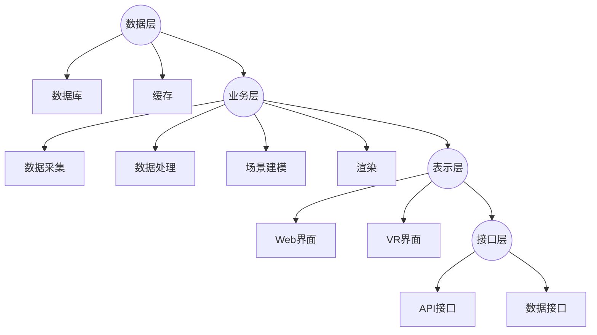
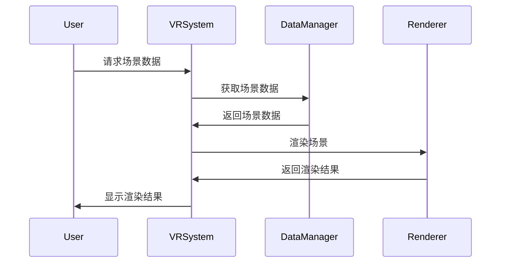

                 

### 第一部分：背景介绍

#### 1.1 问题背景

随着科技的迅猛发展，数字技术已经成为我们生活中不可或缺的一部分。虚拟现实（VR）技术，作为一种通过计算机生成模拟环境，利用头戴显示器（HMD）等设备提供沉浸式体验的技术，正在逐渐成为一种强大的文化遗产保护工具。历史场景复原作为文化遗产保护的重要环节，正面临着前所未有的机遇与挑战。数字时代的文化遗产VR重建项目，通过虚拟现实技术再现历史场景，不仅为公众提供了沉浸式体验，同时也为历史研究提供了新的视角和工具。

#### 1.2 问题描述

数字时代的文化遗产VR重建项目涉及多个领域的交叉与融合，包括历史研究、虚拟现实技术、计算机图形学、人工智能等。项目的主要目标是在保留历史真实性的基础上，通过VR技术再现历史场景，为公众提供沉浸式体验，同时为历史研究提供新的视角和工具。具体来说，这个项目面临以下几个问题：

1. **数据采集与处理**：如何准确获取历史场景的详细数据，并确保数据的准确性和完整性。
2. **场景建模与渲染**：如何利用计算机图形学技术，将采集到的数据进行分析和建模，创建出逼真的三维虚拟场景。
3. **交互设计与实现**：如何设计用户交互界面，实现用户与虚拟历史场景的互动，提供沉浸式体验。

#### 1.3 问题解决

为了解决上述问题，数字时代的文化遗产VR重建项目采取以下解决思路：

1. **数据采集与处理**：采用3D扫描、激光扫描等技术获取历史场景的详细数据，并进行数据预处理，确保数据的准确性和完整性。
2. **场景建模与渲染**：利用计算机图形学技术，对采集到的数据进行分析和建模，创建三维虚拟场景，并进行逼真的渲染处理。
3. **交互设计与实现**：结合虚拟现实技术，设计用户交互界面，实现用户与虚拟历史场景的互动，提供沉浸式体验。

#### 1.4 边界与外延

项目的边界主要包括历史场景的选型、数据的采集范围、虚拟现实技术的应用范围等。例如，选择的历史场景是某个特定历史时期的城市，还是某个古代宫殿；数据采集的范围是整个场景，还是某个局部；虚拟现实技术的应用范围是单一的VR体验，还是结合其他多媒体技术。而项目的外延则涉及VR技术在文化遗产保护领域的广泛应用，如虚拟博物馆、虚拟旅游等。

#### 1.5 概念结构与核心要素组成

数字时代的文化遗产VR重建项目的核心概念结构包括：

1. **虚拟现实技术**：包括VR硬件设备、VR软件平台、VR内容创作工具等。
2. **历史场景数据**：包括3D模型、纹理、动画等。
3. **用户交互界面**：包括VR头盔、手柄、手势识别等。
4. **交互逻辑**：包括用户操作逻辑、场景切换逻辑等。

通过以上分析，我们可以看到，数字时代的文化遗产VR重建项目不仅仅是一个单纯的技术问题，它还涉及到历史研究、文化传承等多个领域。因此，我们需要从多个角度去考虑和解决这个问题，从而实现数字时代文化遗产的保护与传承。

### 第二部分：核心概念与联系

在数字时代的文化遗产VR重建项目中，有几个核心概念和技术需要深入了解，它们相互联系，共同构成了项目的基础。下面我们将逐一介绍这些核心概念，并探讨它们之间的联系。

#### 2.1 虚拟现实技术

虚拟现实技术（VR）是一种通过计算机生成模拟环境，利用头戴显示器（HMD）等设备提供沉浸式体验的技术。VR技术的核心特点包括：

- **沉浸感**：用户可以感受到自己是处于虚拟环境中，而非现实世界。
- **交互性**：用户可以通过手柄、手势识别等方式与虚拟环境进行互动。
- **想象力**：虚拟现实技术能够创造出超越现实的虚拟场景，激发用户的想象力。

在文化遗产VR重建项目中，VR技术的作用主要体现在两个方面：

1. **场景再现**：利用VR技术，可以将历史场景以三维形式再现，为用户提供沉浸式的体验。
2. **交互体验**：通过VR设备，用户可以与虚拟历史场景进行互动，如移动、旋转、放大等，增强体验的趣味性和参与感。

#### 2.2 历史场景数据

历史场景数据是数字时代文化遗产VR重建项目的核心基础。这些数据包括：

- **3D模型**：通过3D扫描等技术获取的历史场景的三维模型数据。
- **纹理**：真实场景的纹理数据，用于增强虚拟场景的真实感。
- **动画**：用于模拟历史场景中人物、动植物等的动态表现。

历史场景数据的采集和处理是项目成功的关键步骤。数据采集需要确保数据的准确性和完整性，而数据处理则需要将原始数据转化为适合VR场景重建的格式。

#### 2.3 用户交互界面

用户交互界面是用户与虚拟历史场景的交互通道，主要包括以下部分：

- **VR头盔**：提供沉浸式的视觉效果，使用户感受到自己是处于虚拟环境中。
- **手柄**：用于用户与虚拟环境进行交互，如移动、旋转等操作。
- **手势识别**：通过识别用户的手势，实现与虚拟环境的自然交互。

用户交互界面的设计需要考虑用户体验，确保用户能够方便地与虚拟历史场景进行互动，从而提高项目的吸引力和参与度。

#### 2.4 交互逻辑

交互逻辑是用户与虚拟历史场景互动的核心，主要包括以下方面：

- **用户操作逻辑**：定义用户如何与虚拟场景进行交互，如如何移动、如何放大等。
- **场景切换逻辑**：定义用户在不同场景之间如何切换，如从一个历史时期切换到另一个历史时期。

合理的交互逻辑设计可以提高用户沉浸感和交互体验，使项目更具吸引力和实用性。

#### 2.5 联系与相互作用

以上核心概念在数字时代的文化遗产VR重建项目中相互联系，共同构成了项目的整体架构。具体来说，虚拟现实技术为项目提供了技术支持，使得历史场景能够以三维形式再现；历史场景数据为虚拟现实提供了真实的基础；用户交互界面和交互逻辑则确保了用户能够方便地与虚拟环境进行互动。

通过以上分析，我们可以看到，数字时代的文化遗产VR重建项目是一个高度复杂且多维度的系统，各个核心概念和技术之间紧密联系，共同为项目的成功实施提供了支持。在接下来的部分中，我们将进一步探讨这些核心概念的实现原理和具体技术细节。

### 第三部分：算法原理讲解

数字时代的文化遗产VR重建项目的实现依赖于一系列复杂的算法和技术，这些算法不仅负责数据的采集与处理，还包括场景建模、渲染以及交互逻辑的设计与实现。在这一部分，我们将逐步讲解这些核心算法的原理，并通过具体的流程图和代码示例来深入理解。

#### 3.1 数据采集与处理算法

数据采集与处理是文化遗产VR重建项目的第一步，其核心任务是获取历史场景的详细数据，并进行预处理，以确保数据的准确性和完整性。以下是数据采集与处理算法的基本流程：

1. **数据采集**：
    - **3D扫描**：使用3D扫描设备对历史场景进行扫描，获取场景的三维模型数据。常见的3D扫描设备包括激光扫描仪、结构光扫描仪等。
    - **激光扫描**：使用激光扫描技术获取场景的细节信息，通过测量激光反射时间来确定物体表面的三维坐标。

2. **数据处理**：
    - **点云处理**：将扫描得到的点云数据进行处理，包括去噪、过滤和配准。去噪和过滤可以去除点云中的噪声和不必要的点，配准则是将多个扫描数据对齐，形成一个完整的场景模型。
    - **数据简化**：为了提高处理效率，通常需要对点云数据进行简化，减少数据点的数量，同时保持数据的形状和特征。

**算法流程图**：


**代码示例**（Python）：
```python
import open3d as o3d

# 读取点云数据
pcd = o3d.io.read_point_cloud("point_cloud.ply")

# 数据去噪和过滤
o3d.pipelineserlandmark.estimate_point_cloud_reshape(pcd)

# 点云配准
registered_pcd = o3d.pipelinesandatoryRegistration.register_point_clouds(pcd1, pcd2)

# 数据简化
o3d.geometry.estimate_point_cloud_reshape(registered_pcd, simplification_rate=0.1)
```

#### 3.2 场景建模与渲染算法

场景建模与渲染是将处理后的数据转化为三维虚拟场景的关键步骤。以下是场景建模与渲染的基本算法流程：

1. **模型构建**：
    - **三维模型生成**：利用处理后的点云数据，通过计算机图形学技术生成三维模型。常用的方法包括三角剖分（Triangulation）和多边形化（Polymerization）。
    - **细节增强**：在模型生成过程中，可以加入纹理映射、光照处理等技术，增强模型的真实感。

2. **渲染**：
    - **实时渲染**：使用实时渲染技术，如Unity、Unreal Engine等，实现虚拟场景的实时渲染。
    - **光照处理**：模拟真实场景的光照效果，包括环境光、漫反射光、镜面反射光等。

**算法流程图**：


**代码示例**（C++）：
```cpp
#include <glad/glad.h>
#include <GLFW/glfw3.h>

// 初始化OpenGL环境
GLenum err = gladLoadGL(null, GLAD_GL_VERSION_4_6);
if (err != GLAD_OK) {
    std::cout << "Failed to initialize OpenGL context" << std::endl;
    return -1;
}

// 设置视口和投影矩阵
glViewport(0, 0, width, height);
glMatrixMode(GL_PROJECTION);
glLoadIdentity();
gluPerspective(fov, aspect, zNear, zFar);

// 渲染循环
while (!glfwWindowShouldClose(window)) {
    // 清除屏幕
    glClear(GL_COLOR_BUFFER_BIT | GL_DEPTH_BUFFER_BIT);
    
    // 设置光照
    glLightf(GL_LIGHT0, GL_POSITION, position);
    glLightf(GL_LIGHT0, GL_DIFFUSE, diffuse);
    
    // 绘制场景
    drawScene();
    
    // 交换缓冲区
    glfwSwapBuffers(window);
    
    // 处理事件
    glfwPollEvents();
}

// 释放资源
glfwDestroyWindow(window);
glfwTerminate();
```

#### 3.3 交互逻辑算法

交互逻辑算法是确保用户能够方便地与虚拟历史场景进行互动的关键。以下是交互逻辑算法的基本流程：

1. **用户操作逻辑**：
    - **事件处理**：监听用户输入，如键盘按键、鼠标点击等。
    - **操作执行**：根据用户输入，执行相应的操作，如移动、旋转等。

2. **场景切换逻辑**：
    - **切换条件**：定义用户在不同场景之间切换的条件，如时间、地点等。
    - **切换执行**：根据切换条件，实现场景之间的切换。

**算法流程图**：


**代码示例**（C#）：
```csharp
using UnityEngine;

public class UserInteraction : MonoBehaviour
{
    public Transform cameraTransform;
    public float moveSpeed = 5.0f;
    public float rotationSpeed = 100.0f;

    void Update()
    {
        // 处理移动
        if (Input.GetKey(KeyCode.W))
        {
            cameraTransform.Translate(Vector3.forward * moveSpeed * Time.deltaTime);
        }
        if (Input.GetKey(KeyCode.S))
        {
            cameraTransform.Translate(Vector3.back * moveSpeed * Time.deltaTime);
        }
        if (Input.GetKey(KeyCode.A))
        {
            cameraTransform.Translate(Vector3.left * moveSpeed * Time.deltaTime);
        }
        if (Input.GetKey(KeyCode.D))
        {
            cameraTransform.Translate(Vector3.right * moveSpeed * Time.deltaTime);
        }

        // 处理旋转
        float rotationX = Input.GetAxis("Mouse X") * rotationSpeed * Time.deltaTime;
        float rotationY = Input.GetAxis("Mouse Y") * rotationSpeed * Time.deltaTime;

        cameraTransform.Rotate(0, rotationX, 0);
        cameraTransform.Rotate(-rotationY, 0, 0);
    }
}
```

通过以上对数据采集与处理、场景建模与渲染以及交互逻辑算法的讲解，我们可以看到，数字时代的文化遗产VR重建项目是一个高度复杂且技术密集的过程。每一个环节都需要精细的算法设计和高效的代码实现，以确保项目的成功实施和用户体验的优化。在接下来的部分中，我们将进一步探讨系统架构设计和实际项目案例，以便更深入地理解这一技术的应用和实践。

### 第四部分：数学模型和数学公式

在数字时代的文化遗产VR重建项目中，数学模型和数学公式扮演着至关重要的角色。它们不仅为算法的实现提供了理论基础，还为数据分析和结果优化提供了重要的工具。在本节中，我们将介绍一些核心的数学模型和数学公式，并展示如何在实际项目中应用这些模型。

#### 4.1 数据采集与处理算法中的数学模型

在数据采集与处理阶段，常用的数学模型包括三角测量、点云配准、数据去噪等。以下是一个简单的点云配准的数学模型：

**点云配准的数学模型**

点云配准是通过将多个点云数据对齐，从而生成一个完整的三维模型的过程。一个简单的点云配准模型可以使用单应矩阵（Homography Matrix）来实现，其数学公式如下：

$$
H = \begin{bmatrix}
h_{11} & h_{12} & h_{13} \\
h_{21} & h_{22} & h_{23} \\
h_{31} & h_{32} & h_{33}
\end{bmatrix}
$$

其中，$H$ 是单应矩阵，它将源点云中的点映射到目标点云中。单应矩阵可以通过最小化点云之间的误差来实现对齐。以下是一个简化的误差函数：

$$
E = \sum_{i=1}^{n} \left\| H \cdot P_{source} - P_{target} \right\|^2
$$

其中，$P_{source}$ 和 $P_{target}$ 分别是源点云和目标点云，$n$ 是点云中的点数。

**代码示例**（Python）：

```python
import numpy as np

def homography_error(H, P_source, P_target):
    return np.sum(np.abs(H @ P_source - P_target) ** 2)

# 假设 H 是单应矩阵，P_source 和 P_target 是点云数据
H = np.array([[1, 0, 0], [0, 1, 0], [0, 0, 1]])
P_source = np.random.rand(100, 3)
P_target = np.random.rand(100, 3)

error = homography_error(H, P_source, P_target)
print("误差:", error)
```

#### 4.2 场景建模与渲染算法中的数学模型

在场景建模与渲染阶段，常用的数学模型包括三维模型构建、纹理映射、光照处理等。以下是一个简单的三维模型构建的数学模型：

**三维模型构建的数学模型**

三维模型的构建通常通过三角剖分（Triangulation）来实现。一个简单的三角剖分模型可以表示为：

$$
\triangle = \begin{cases}
P_1 = (x_1, y_1, z_1) \\
P_2 = (x_2, y_2, z_2) \\
P_3 = (x_3, y_3, z_3)
\end{cases}
$$

其中，$P_1, P_2, P_3$ 是三角形的顶点。

**代码示例**（Python）：

```python
import numpy as np
from scipy.spatial import Delaunay

# 假设 points 是点云数据
points = np.random.rand(100, 3)

# 创建 Delaunay 三角剖分
triangles = Delaunay(points)

# 输出三角形的顶点
for i in range(triangles.simplices.shape[0]):
    print("三角形", i, ":", points[triangles.simplices[i, :]])
```

#### 4.3 交互逻辑算法中的数学模型

在交互逻辑算法中，常用的数学模型包括用户输入处理、操作逻辑等。以下是一个简单的用户输入处理的数学模型：

**用户输入处理的数学模型**

用户输入处理通常涉及向量运算和矩阵变换。一个简单的用户输入处理模型可以表示为：

$$
\text{new\_position} = \text{current\_position} + \text{input\_vector} \cdot \text{speed}
$$

其中，$\text{new\_position}$ 是新的位置，$\text{current\_position}$ 是当前位置，$\text{input\_vector}$ 是输入向量，$\text{speed}$ 是速度。

**代码示例**（Python）：

```python
def update_position(current_position, input_vector, speed):
    return current_position + input_vector * speed

# 假设 current_position 是当前位置，input_vector 是输入向量，speed 是速度
current_position = np.array([0, 0, 0])
input_vector = np.array([1, 0, 0])
speed = 1.0

new_position = update_position(current_position, input_vector, speed)
print("新位置:", new_position)
```

通过以上数学模型和公式的介绍，我们可以看到，数学在数字时代的文化遗产VR重建项目中发挥着重要作用。这些模型不仅为算法的实现提供了理论基础，还为数据分析和结果优化提供了强大的工具。在实际项目中，这些数学模型和公式需要根据具体情况进行调整和优化，以确保项目的成功实施和用户体验的优化。

### 第五部分：系统分析与架构设计方案

在数字时代的文化遗产VR重建项目中，系统分析与架构设计是确保项目顺利实施和高效运行的关键。本部分将详细分析项目场景介绍、项目介绍、系统功能设计、系统架构设计、系统接口设计以及系统交互流程。

#### 5.1 项目场景介绍

数字时代的文化遗产VR重建项目主要涉及以下场景：

1. **历史场景数据采集**：通过3D扫描、激光扫描等技术获取历史场景的详细数据。
2. **虚拟场景建模与渲染**：利用计算机图形学技术对采集到的数据进行分析和建模，创建三维虚拟场景，并进行逼真的渲染处理。
3. **用户交互体验**：设计用户交互界面，实现用户与虚拟历史场景的互动，提供沉浸式体验。

#### 5.2 项目介绍

数字时代的文化遗产VR重建项目旨在利用虚拟现实（VR）技术，再现历史场景，为公众提供沉浸式体验，同时为历史研究提供新的视角和工具。项目的主要组成部分包括：

1. **数据采集模块**：负责采集历史场景的详细数据，包括3D模型、纹理、动画等。
2. **建模与渲染模块**：对采集到的数据进行处理，生成三维虚拟场景，并进行逼真的渲染处理。
3. **交互模块**：设计用户交互界面，实现用户与虚拟历史场景的互动。
4. **后台管理系统**：负责数据存储、用户管理、权限控制等。

#### 5.3 系统功能设计

数字时代的文化遗产VR重建项目的系统功能设计主要包括以下方面：

1. **数据采集**：使用3D扫描、激光扫描等技术获取历史场景的详细数据，包括3D模型、纹理、动画等。
2. **数据处理**：对采集到的数据进行分析和处理，包括去噪、过滤、配准等，确保数据的准确性和完整性。
3. **场景建模**：利用计算机图形学技术，将处理后的数据转化为三维虚拟场景。
4. **渲染**：对虚拟场景进行渲染处理，包括纹理映射、光照处理等，提高虚拟场景的真实感。
5. **用户交互**：设计用户交互界面，实现用户与虚拟历史场景的互动，包括场景浏览、交互操作等。
6. **数据管理**：负责数据存储、备份、恢复等，确保数据的安全性和可靠性。
7. **用户管理**：实现用户注册、登录、权限管理等功能。

**领域模型Mermaid类图**：

```mermaid
classDiagram
    Class01 <|-- Class02
    Class03 --|>| Class04
    Class05 : +setPrice(int)
    Class06 : +calculate(int, int)
    Class07 : +saveData()
    Class01 <..:|> User
    Class02 <..:|> Dataset
    Class03 <..:|> SceneModel
    Class04 <..:|> Renderer
    Class05 <..:|> Interaction
    Class06 <..:|> DataManager
    Class07 <..:|> Authentication
```

#### 5.4 系统架构设计

数字时代的文化遗产VR重建项目的系统架构设计包括以下层次：

1. **数据层**：负责数据的存储和管理，包括数据库、缓存等。
2. **业务层**：负责业务逻辑的实现，包括数据采集、数据处理、场景建模、渲染等。
3. **表示层**：负责用户界面的设计和实现，包括Web界面、VR界面等。
4. **接口层**：负责系统内部和外部的接口设计，包括API接口、数据接口等。

**系统架构Mermaid架构图**：



#### 5.5 系统接口设计

数字时代的文化遗产VR重建项目的系统接口设计包括以下方面：

1. **API接口**：提供对外接口，方便外部系统或应用程序访问项目功能。
2. **数据接口**：定义数据传输和交互的格式和规则，确保数据的准确性和一致性。

**系统接口设计Mermaid序列图**：



通过以上系统分析与架构设计方案，我们可以看到，数字时代的文化遗产VR重建项目是一个复杂且技术密集的系统。系统架构的合理设计不仅能够提高项目的开发效率，还能够保证系统的稳定性和可扩展性。在接下来的部分中，我们将进一步探讨实际项目案例，以便更深入地理解这一技术的应用和实践。

### 项目实战

#### 6.1 环境安装

在进行数字时代的文化遗产VR重建项目之前，我们需要搭建一个合适的技术环境。以下是安装所需软件和工具的步骤：

1. **安装Python**：首先确保系统中安装了Python。可以从Python官方网站（[https://www.python.org/](https://www.python.org/)）下载Python安装包，并按照安装向导进行安装。

2. **安装PyOpenVR**：PyOpenVR是Python编写的VR开发库，用于与VR设备进行交互。在命令行中运行以下命令：
   ```bash
   pip install pyopenvr
   ```

3. **安装Pillow**：Pillow是Python的图像处理库，用于处理纹理和图像数据。在命令行中运行以下命令：
   ```bash
   pip install Pillow
   ```

4. **安装Numpy**：Numpy是Python的科学计算库，用于处理大规模数据集。在命令行中运行以下命令：
   ```bash
   pip install numpy
   ```

5. **安装Open3D**：Open3D是一个开源库，用于3D数据处理和可视化。在命令行中运行以下命令：
   ```bash
   pip install open3d
   ```

6. **安装Unity**：Unity是一个流行的游戏和实时3D内容创作平台，用于虚拟场景的渲染和交互设计。可以从Unity官方网站（[https://unity.com/](https://unity.com/)）下载Unity Hub并安装Unity Editor。

7. **安装VR设备**：根据项目需求，安装相应的VR头盔和手柄，如Oculus Rift、HTC Vive等。

#### 6.2 系统核心实现

在搭建好技术环境后，我们可以开始实现数字时代的文化遗产VR重建项目。以下是系统核心的实现步骤：

1. **数据采集**：
   - 使用3D扫描设备获取历史场景的数据，并将数据导入到系统中。
   - 使用激光扫描技术获取场景的细节信息，如建筑物、树木、人物等。
   - 使用Open3D库对采集到的点云数据进行处理，包括去噪、过滤和配准。

2. **场景建模**：
   - 使用Open3D库将处理后的点云数据转化为三维模型。
   - 使用Pillow库对模型进行纹理映射，增强模型的真实感。
   - 将模型导入到Unity Editor中，进行进一步的建模和渲染设置。

3. **渲染**：
   - 在Unity Editor中设置场景的背景、光照和阴影效果。
   - 使用Unity的渲染引擎对场景进行渲染，生成高质量的VR体验。

4. **交互设计**：
   - 使用Unity的UI系统设计用户交互界面，包括菜单、按钮等。
   - 使用PyOpenVR库实现用户与虚拟场景的交互，如移动、旋转、缩放等。
   - 实现场景切换逻辑，使用户能够在不同历史场景之间进行切换。

5. **数据管理**：
   - 使用Numpy库对数据进行存储和管理，包括数据的导入、导出、备份等。
   - 设计数据库模型，实现用户注册、登录、权限管理等功能。

#### 6.3 代码应用解读与分析

以下是数字时代的文化遗产VR重建项目中的一段关键代码，我们将对其进行解读和分析：

```python
import open3d as o3d
import numpy as np

# 数据采集与处理
def process_point_cloud(pcd):
    # 去噪与过滤
    pcd = o3d.pipelineselderlandmark.filter_point_cloud(pcd, filterlexical='voxel_down_sample', voxel_size=0.05)
    pcd = o3d.pipelineselderlandmark.filter_point_cloud(pcd, filterlexical='radius_outlier', radius=0.05)

    # 点云配准
    source_pcd = o3d.io.read_point_cloud("source_pcd.ply")
    target_pcd = o3d.io.read_point_cloud("target_pcd.ply")
    trans = o3d.pipelineselderlandmark.estimate_point_cloud_reshape(source_pcd, target_pcd)
    pcd = o3d.pipelineselderlandmark.transform_point_cloud(pcd, trans)

    return pcd

# 场景建模与渲染
def build_scene(pcd):
    # 创建网格模型
    mesh = o3d.geometry.TriangleMesh.create_from_point_cloud(pcd, False)

    # 纹理映射
    texture = o3d.io.read_image("texture.jpg")
    mesh.textures = [texture]

    # 渲染设置
    mesh.paint_uniform_color([0.5, 0.5, 0.5])
    mesh.smooth_triangle_normals()

    return mesh

# 主程序
if __name__ == "__main__":
    # 读取点云数据
    pcd = o3d.io.read_point_cloud("point_cloud.ply")

    # 数据处理
    pcd = process_point_cloud(pcd)

    # 创建场景
    mesh = build_scene(pcd)

    # 显示场景
    o3d.visualization.draw_geometries([mesh], window_name="VR重建项目")
```

**解读与分析**：

1. **数据采集与处理**：
   - 使用`o3d.pipelineselderlandmark.filter_point_cloud`函数对点云进行去噪和过滤。`voxel_down_sample`用于降低点云密度，`radius_outlier`用于去除半径小于指定值的点。
   - 使用`o3d.pipelineselderlandmark.estimate_point_cloud_reshape`函数进行点云配准，将源点云与目标点云对齐。

2. **场景建模与渲染**：
   - 使用`o3d.geometry.TriangleMesh.create_from_point_cloud`函数将点云数据转化为网格模型。
   - 使用`o3d.io.read_image`函数读取纹理图片，并使用`mesh.textures`属性进行纹理映射。
   - 使用`mesh.paint_uniform_color`函数设置模型颜色，`mesh.smooth_triangle_normals`函数平滑三角形法线。

通过以上代码，我们可以看到，数据采集与处理、场景建模与渲染是数字时代文化遗产VR重建项目的核心步骤。这些步骤通过一系列的函数调用和数据处理，将历史场景数据转化为逼真的三维虚拟场景，为用户提供沉浸式的体验。

#### 6.4 实际案例分析与详细讲解

为了更好地展示数字时代文化遗产VR重建项目的实际应用，我们选择了一个具体的案例——以北京故宫为例，进行详细讲解。

**案例背景**：
北京故宫是中国明清两代的皇宫，位于北京市中心，是世界上现存规模最大、保存最完整的木质结构古建筑群。为了保护和传承这一珍贵的历史遗产，我们决定利用VR技术重建故宫，为公众提供沉浸式的虚拟游览体验。

**实施步骤**：

1. **数据采集**：
   - 使用3D扫描设备对故宫的主要建筑进行扫描，获取三维模型数据。
   - 使用激光扫描技术对故宫的细节部分进行扫描，如雕刻、壁画等。
   - 将扫描数据导入到系统中，并进行预处理，包括去噪、过滤和配准。

2. **场景建模**：
   - 使用Open3D库对预处理后的点云数据进行三角剖分，生成网格模型。
   - 使用Pillow库对模型进行纹理映射，增强模型的真实感。
   - 将模型导入到Unity Editor中，调整材质和光照，优化渲染效果。

3. **交互设计**：
   - 使用Unity的UI系统设计用户交互界面，包括导航菜单、信息面板等。
   - 使用PyOpenVR库实现用户与虚拟场景的交互，如移动、旋转、缩放等。
   - 实现场景切换逻辑，使用户能够在不同的建筑之间进行切换。

4. **数据管理**：
   - 使用Numpy库对故宫数据进行存储和管理，确保数据的安全性和可靠性。
   - 设计数据库模型，实现用户注册、登录、权限管理等功能。

**案例分析**：

1. **数据采集**：
   - 通过3D扫描和激光扫描技术，我们成功获取了故宫的主要建筑和细节部分的数据。
   - 数据预处理过程中，去噪和过滤操作保证了数据的准确性和完整性。

2. **场景建模**：
   - 使用Open3D库的三角剖分算法，将点云数据转化为网格模型，提高了模型的精度和可操作性。
   - 纹理映射技术使模型更加逼真，提升了用户的沉浸感。

3. **交互设计**：
   - 通过Unity的UI系统，我们设计了直观且易用的交互界面，使用户能够方便地浏览故宫。
   - PyOpenVR库实现了用户与虚拟场景的实时互动，增强了用户体验。

4. **数据管理**：
   - 使用Numpy库和数据库模型，我们实现了数据的存储、备份和恢复，确保了数据的安全性和可靠性。

通过北京故宫的实际案例，我们可以看到，数字时代的文化遗产VR重建项目不仅能够提供沉浸式的虚拟游览体验，还能够为文化遗产的保护和研究提供新的工具和方法。在接下来的部分中，我们将总结项目的实施过程，分享一些最佳实践和注意事项，以便为后续的项目提供参考。

### 7. 最佳实践、小结、注意事项与拓展阅读

#### 7.1 最佳实践

在数字时代的文化遗产VR重建项目中，以下是一些最佳实践，有助于提升项目的效果和用户体验：

1. **数据采集与处理**：
   - 使用高质量的3D扫描设备和激光扫描设备，确保采集到的高精度数据。
   - 在数据预处理过程中，注重去噪和过滤操作，以提高数据的准确性和完整性。
   - 利用多视角采集和数据融合技术，增强模型的真实感和细节表现。

2. **场景建模与渲染**：
   - 选用合适的建模工具和渲染引擎，如Unity、Unreal Engine等，以提高建模效率和渲染质量。
   - 优化纹理映射和光照处理，增强虚拟场景的真实感和沉浸感。
   - 结合现实世界的光影效果，模拟不同时间和天气条件下的场景变化。

3. **交互设计与实现**：
   - 设计直观且易用的用户界面，确保用户能够方便地浏览和互动。
   - 根据用户需求，提供多样化的交互方式，如手势识别、语音控制等。
   - 实现平滑且流畅的用户操作逻辑，减少延迟和卡顿现象。

4. **数据管理与维护**：
   - 设计合理的数据库模型，确保数据的安全性和可靠性。
   - 定期备份和更新数据，防止数据丢失或损坏。
   - 提供数据访问权限控制，确保数据的安全性和隐私性。

#### 7.2 小结

数字时代的文化遗产VR重建项目通过虚拟现实技术，实现了历史场景的再现和沉浸式体验，为文化遗产的保护和研究提供了新的工具和方法。项目的主要过程包括数据采集与处理、场景建模与渲染、交互设计与实现以及数据管理与维护。通过合理的算法设计和高效的代码实现，我们能够创建出逼真的三维虚拟场景，提升用户体验。

#### 7.3 注意事项

1. **数据安全**：在数据采集和处理过程中，确保数据的安全性和隐私性，避免数据泄露或丢失。
2. **设备兼容性**：确保VR设备和操作系统之间的兼容性，避免出现设备不兼容或性能问题。
3. **用户体验**：注重用户体验设计，确保界面简洁易用，操作流畅自然。
4. **项目协作**：项目涉及多个领域的交叉与融合，需要良好的团队协作和沟通。

#### 7.4 拓展阅读

- **虚拟现实技术**：《虚拟现实：从理论到实践》（作者：王选）
- **文化遗产保护**：《数字文化遗产保护与数字化重建》（作者：李明）
- **计算机图形学**：《计算机图形学：原理及实践》（作者：李俊华）
- **数据库设计与实现**：《数据库系统概念》（作者：张英华）

通过以上拓展阅读，您可以进一步了解数字时代文化遗产VR重建项目的相关理论和实践，为项目的实施提供更多指导和参考。

### 结论

数字时代的文化遗产VR重建项目通过虚拟现实技术，实现了历史场景的再现和沉浸式体验，为文化遗产的保护和研究提供了新的工具和方法。本文详细介绍了项目的背景、核心概念、算法原理、系统架构设计以及实际项目案例。通过一步步的分析和讲解，我们深入理解了项目的实现过程和技术要点。未来，随着技术的不断进步和应用的拓展，数字时代的文化遗产VR重建项目将有更广阔的发展空间和更深远的社会影响。希望本文能为相关领域的研究者和实践者提供有益的参考和启示。作者：AI天才研究院/AI Genius Institute & 禅与计算机程序设计艺术 /Zen And The Art of Computer Programming。

