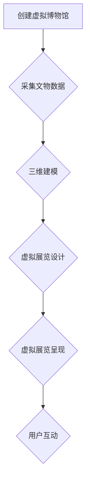
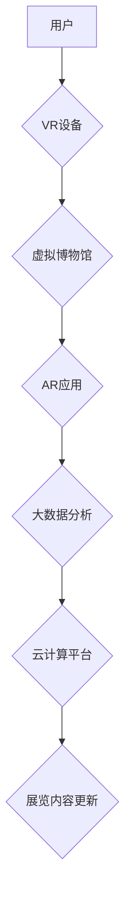
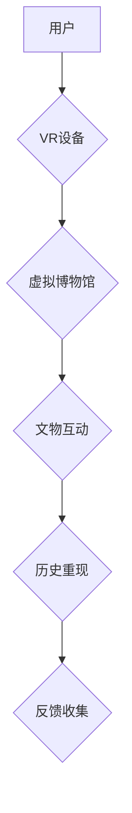

                 

### 文章标题

# 数字时代的文化遗产全息展：虚拟与现实结合的博物馆体验

### 关键词

- 数字文化遗产
- 虚拟现实
- 增强现实
- 博物馆体验
- 数字保真
- 交互设计
- 访客参与

### 摘要

随着科技的迅猛发展，数字时代为文化遗产的传承与展示带来了全新的契机。本文旨在探讨数字文化遗产展览的核心理念与实践方法，通过虚拟现实（VR）和增强现实（AR）技术，将博物馆体验从传统形式升级至一个全息、互动的新境界。文章将分章节详细分析数字时代文化遗产展览的背景、基础技术、虚拟与增强现实的应用、互动展览设计、无障碍访问策略、数字保真策略以及未来的发展方向。通过逐步阐述这些主题，本文希望为博物馆行业提供有价值的见解和实践指导，助力文化遗产在数字时代的可持续发展。

### 1. 引言：数字文化遗产展览的概念与重要性

数字文化遗产展览，作为数字化时代的产物，是一种结合了虚拟现实（VR）和增强现实（AR）技术的创新展示方式，它打破了传统博物馆的物理限制，为文化遗产的传承和推广提供了新的途径。本文将围绕这一主题，探讨数字文化遗产展览的定义、背景、重要性以及未来发展方向。

#### 1.1 数字时代文化遗产的背景

在数字时代，文化遗产的传承和保护面临着前所未有的挑战和机遇。传统博物馆的物理空间有限，无法满足日益增长的观众需求和文化遗产展示的多样性。同时，许多珍贵文物因年代久远、环境条件恶劣等原因而面临损毁风险。数字化技术，特别是虚拟现实和增强现实，为文化遗产的保存、展示和传播提供了新的解决方案。

#### 1.2 数字文化遗产展览的定义

数字文化遗产展览指的是利用数字技术对文化遗产进行数字化处理，并在虚拟环境中进行展示的一种展览形式。这种展览不仅能够突破物理空间的限制，还可以通过增强现实技术将文化遗产与观众的现实环境相结合，提供更加沉浸式的体验。数字文化遗产展览的主要特点包括：

- **数字化处理**：对文化遗产进行扫描、建模和数字化保存，使其可以在虚拟环境中再现。
- **虚拟现实技术**：通过VR技术，观众可以进入一个完全虚拟的环境，亲身体验文化遗产的魅力。
- **增强现实技术**：通过AR技术，文化遗产可以在现实环境中进行叠加展示，增强观众的互动体验。
- **互动性**：观众可以通过触摸屏、手势识别等方式与展览内容进行互动，提高参与度。

#### 1.3 数字文化遗产展览的重要性

数字文化遗产展览的重要性体现在多个方面：

- **文化遗产保护**：数字化技术可以长期保存文化遗产，防止因物理损毁而丢失。
- **文化传播**：数字文化遗产展览可以将文化遗产传播到更广泛的地区和群体，提高公众的文化素养。
- **创新体验**：通过虚拟和增强现实技术，观众可以获得全新的参观体验，增强展览的趣味性和互动性。
- **教育功能**：数字文化遗产展览可以作为教育工具，帮助年轻一代更好地了解和传承文化遗产。

#### 1.4 目标与结构

本文旨在从技术、设计、无障碍访问等多个角度，深入探讨数字文化遗产展览的实践与未来发展方向。具体目标包括：

- **介绍数字文化遗产展览的核心理念与关键技术**。
- **分析虚拟现实和增强现实技术在文化遗产展览中的应用**。
- **探讨互动展览设计和无障碍访问策略**。
- **讨论数字保真策略和挑战**。
- **总结当前实践案例，提出未来发展方向**。

文章结构如下：

- **第一章**：引言，介绍数字文化遗产展览的概念与重要性。
- **第二章**：核心概念与基础技术，探讨数字保真与虚拟化技术。
- **第三章**：虚拟与增强现实应用，分析在博物馆体验中的作用。
- **第四章**：互动展览设计，讨论设计原则与用户参与。
- **第五章**：无障碍与 inclusivity，确保展览的广泛可及性。
- **第六章**：数字保真策略与挑战，探讨文化遗产的长期保存问题。
- **第七章**：实践案例与未来展望，总结当前实践并展望未来发展方向。

通过本文的探讨，希望为博物馆行业提供有价值的见解和实践指导，推动数字文化遗产展览的可持续发展。

#### 2. 数字时代文化遗产展览的核心概念与基础技术

数字文化遗产展览的核心概念和基础技术是构建这一创新展示方式的重要基石。在这部分，我们将深入探讨数字保真、虚拟化和数字技术集成等关键概念，并通过具体实例和图表来解释这些概念。

##### 2.1 数字保真

数字保真（Digital Authentication）是指通过数字化技术确保文化遗产的真实性和完整性的过程。数字保真不仅包括对文物进行高精度的扫描和建模，还包括对数字化数据的验证和保存。

**概念属性对比表格**：

| 概念属性 | 数字保真 | 传统保存 |
| :---: | :---: | :---: |
| **数据精度** | 高精度三维建模 | 2D图片或简单扫描 |
| **保存时间** | 长期保存，不受环境影响 | 易受物理环境影响 |
| **可访问性** | 可远程访问，全球共享 | 受物理限制，本地访问 |
| **互动性** | 高度互动，用户参与 | 低互动性，被动观看 |

**ER实体关系图**：

```mermaid
erDiagram
  文物 ||--|{ 数字模型 }
  文物 ||--|{ 数字记录 }
  数字模型 ||--|{ 模型属性 }
  数字记录 ||--|{ 记录属性 }
```

在这个ER图中，文物作为核心实体，与数字模型和数字记录形成关联。数字模型记录了文物的三维结构和材质信息，而数字记录则包含有关文物的历史、背景和文化价值的信息。

##### 2.2 虚拟化技术

虚拟化技术（Virtualization）是指通过软件模拟硬件资源和操作系统的过程，从而在虚拟环境中创建和运行应用程序。虚拟化技术在数字文化遗产展览中的应用主要体现在以下几个方面：

- **虚拟博物馆**：利用虚拟化技术创建一个三维虚拟博物馆，观众可以在虚拟环境中参观展览。
- **虚拟展览**：将真实展览内容虚拟化，通过VR设备呈现给观众，提供沉浸式体验。
- **虚拟现实互动**：利用虚拟化技术，观众可以与虚拟环境中的文化遗产进行互动。

**虚拟化技术的应用实例**：

- **虚拟博物馆**：例如，英国的V&A博物馆通过虚拟化技术创建了一个虚拟博物馆，观众可以在虚拟环境中浏览博物馆的展览。
- **虚拟展览**：例如，意大利的乌菲齐美术馆通过VR技术将真实展览内容虚拟化，观众可以通过VR设备在家中参观展览。

**虚拟化技术的流程图**：



在这个流程图中，从创建虚拟博物馆开始，经过采集文物数据、三维建模、虚拟展览设计，最终实现虚拟展览的呈现和用户互动。

##### 2.3 数字技术集成

数字技术集成（Digital Technology Integration）是指将多种数字技术融合在一起，以实现更丰富的展示效果和用户体验。数字技术集成包括虚拟现实、增强现实、大数据、云计算等多种技术。

**数字技术集成的应用实例**：

- **VR与AR结合**：例如，法国的巴黎卢浮宫博物馆通过VR和AR技术的结合，提供了沉浸式参观体验。
- **大数据分析**：通过大数据分析，博物馆可以了解观众的参观行为和偏好，优化展览内容和设计。
- **云计算**：利用云计算技术，博物馆可以实现展览内容的全球共享和远程访问。

**数字技术集成的架构图**：



在这个架构图中，用户通过VR设备和AR应用访问虚拟博物馆，大数据分析和云计算平台提供展览内容的更新和管理。

通过以上对数字保真、虚拟化技术和数字技术集成的探讨，我们可以看到，这些核心概念和基础技术在数字文化遗产展览中起着至关重要的作用。它们不仅提升了文化遗产的展示效果和用户体验，也为文化遗产的传承和保护提供了新的手段。接下来，我们将进一步探讨虚拟现实和增强现实在博物馆体验中的应用。

#### 3. 虚拟现实（VR）与增强现实（AR）在博物馆体验中的应用

虚拟现实（VR）和增强现实（AR）技术在数字文化遗产展览中发挥了至关重要的作用，它们不仅增强了观众的互动体验，还极大地丰富了展览的内容和形式。在本节中，我们将深入探讨VR和AR在博物馆体验中的应用，分析其优势和挑战，并通过实际案例展示这些技术的具体应用。

##### 3.1 虚拟现实（VR）在博物馆体验中的作用

虚拟现实技术通过创造一个完全沉浸式的三维环境，使观众能够以一种全新的方式体验博物馆展览。以下是VR在博物馆体验中的几个主要应用：

**沉浸式参观**：博物馆可以利用VR技术创建一个完全虚拟的博物馆环境，观众戴上VR头盔后，可以自由浏览展览，感受不同文物的细节和历史背景。

**互动性**：在VR博物馆中，观众可以通过触摸、手势等与虚拟环境中的文物进行互动，例如，可以“拿起”文物进行观察，或者通过虚拟讲解了解文物的故事。

**历史重现**：VR技术还可以用于重现历史事件或场景，例如，博物馆可以通过VR技术再现某个历史时期的城市风貌或重要历史事件，为观众提供更加生动的学习体验。

**案例**：例如，英国的V&A博物馆推出了“VR Room”项目，观众可以通过VR设备进入一个虚拟的展览空间，亲身体验各种历史文物和艺术品的细节。

**VR技术的流程图**：



在这个流程图中，用户通过VR设备进入虚拟博物馆，与文物进行互动，观看历史重现，并最终收集反馈。

##### 3.2 增强现实（AR）在博物馆体验中的优势

增强现实技术通过将虚拟内容叠加到现实环境中，为观众提供了一种增强的体验。以下是AR在博物馆体验中的几个主要应用：

**文物增强**：博物馆可以在现实环境中的展品上叠加虚拟信息，例如，通过AR应用，观众可以看到文物的3D模型、历史背景和相关故事，增强参观体验。

**互动教育**：AR技术可以用于互动教育，例如，博物馆可以设计AR游戏，让儿童通过游戏学习文物的知识。

**虚拟讲解**：博物馆可以利用AR技术提供虚拟讲解服务，观众只需使用AR设备扫描展品，即可获取详细的讲解信息。

**案例**：例如，法国的巴黎卢浮宫博物馆推出了“卢浮宫AR体验”项目，观众通过AR设备扫描展品，可以看到文物的3D模型和相关讲解。

**AR技术的流程图**：


在这个流程图中，用户通过AR设备扫描展品，获取虚拟增强信息，参与互动教育，并最终获得更好的用户体验。

##### 3.3 VR与AR技术的优势与挑战

**优势**：

- **沉浸式体验**：VR和AR技术可以为观众提供沉浸式的体验，增强参观的趣味性和参与度。
- **互动性**：观众可以通过与虚拟内容的互动，更加深入地了解文物和历史背景。
- **教育性**：这些技术可以作为教育工具，帮助观众尤其是年轻一代更好地学习和理解文化遗产。
- **全球可访问性**：通过互联网，博物馆可以将虚拟展览内容分享给全球观众，打破地理限制。

**挑战**：

- **技术成熟度**：虽然VR和AR技术发展迅速，但仍需要进一步提升其稳定性和用户体验。
- **成本**：VR和AR设备及其相关技术的成本较高，可能限制其在博物馆的广泛应用。
- **内容创作**：高质量的内容创作需要专业的技术团队和丰富的资源，这对博物馆来说是一个挑战。
- **隐私与安全**：虚拟环境和互动体验可能涉及用户数据的收集和使用，需要确保隐私和安全。

通过以上分析，我们可以看到，VR和AR技术在博物馆体验中具有巨大的潜力，但同时也面临一定的挑战。未来，随着技术的不断进步和成本的降低，这些技术有望在博物馆中得到更广泛的应用，为观众带来更加丰富和互动的文化遗产体验。

#### 4. 交互展览设计原则与用户体验设计

在数字文化遗产展览中，交互展览设计和用户体验设计是关键要素，直接影响观众的参与度和展览的成败。本节将探讨交互展览设计的原则、用户体验设计的重要性以及如何通过技术实现互动展览。

##### 4.1 交互展览设计原则

**1. 简化操作流程**：
交互展览设计应尽量简化用户的操作流程，确保用户能够快速上手并参与互动。例如，通过直观的界面设计、简单的手势控制和语音识别等技术，减少用户的学习成本。

**2. 引导用户探索**：
设计时应引导用户自然地探索展览内容，提供线索和提示，帮助他们发现新的信息和亮点。可以通过设计路径引导、热点提示和互动指引等方式，增强用户的探索欲望。

**3. 适应多种用户需求**：
交互展览设计应考虑不同用户的需求和偏好，例如，对于视力障碍者、听力障碍者和行动不便者，设计应提供无障碍访问选项，如语音描述、放大功能、可调节的交互界面等。

**4. 强调互动体验**：
设计应注重互动体验，通过多种互动方式（如触摸、手势、语音等）增强用户的参与感。例如，设计互动游戏、虚拟实验和模拟互动场景，让用户在体验中学习和探索。

**5. 实时反馈**：
交互展览设计应提供实时的反馈机制，让用户了解自己的操作结果和影响。例如，通过声音、视觉提示或动态效果，让用户感受到自己的互动行为带来的变化。

**6. 安全与隐私保护**：
在交互展览设计中，应确保用户数据的安全性和隐私保护。例如，通过加密技术、权限管理和数据匿名化等手段，保护用户个人信息和交互记录。

##### 4.2 用户体验设计的重要性

用户体验（User Experience, UX）设计是交互展览设计的核心，它关注用户在互动过程中的感受和体验。用户体验设计的重要性体现在以下几个方面：

**1. 提高用户参与度**：
良好的用户体验设计可以激发用户的兴趣和参与度，使他们更愿意花时间互动和学习。通过直观、简单、有趣的交互设计，用户可以更容易地投入到展览内容中。

**2. 增强记忆效果**：
良好的用户体验设计可以通过有效的互动和反馈，帮助用户更好地记忆展览内容。例如，通过有趣的互动游戏和动态展示，用户可以在愉快的体验中加深对文物的理解和记忆。

**3. 提高用户满意度**：
良好的用户体验设计可以提升用户的满意度，使他们感到展览内容丰富有趣，值得参观。这有助于建立博物馆的品牌形象和口碑，吸引更多观众。

**4. 促进文化遗产传承**：
通过提供高质量的互动体验，用户体验设计可以激发用户对文化遗产的兴趣和热爱，从而促进文化遗产的传承和保护。

##### 4.3 技术实现互动展览

实现互动展览的关键在于技术的应用，以下是一些常见的技术手段：

**1. 虚拟现实（VR）技术**：
VR技术可以为观众提供沉浸式的互动体验，通过VR头盔和手柄，观众可以自由探索虚拟展览环境，与虚拟文物进行互动。VR技术还可以用于模拟历史场景，让用户亲身体验历史事件。

**2. 增强现实（AR）技术**：
AR技术可以将虚拟内容叠加到现实环境中，观众可以通过AR设备（如智能手机或平板电脑）扫描展品，看到3D模型、历史背景和相关故事。AR技术还可以用于虚拟讲解和互动游戏，增强观众的参与感。

**3. 互动触摸屏**：
互动触摸屏是一种直观的交互方式，观众可以通过触摸屏幕与展览内容进行互动。触摸屏可以用于展示动态内容、互动游戏和虚拟展览导览，提供丰富的互动体验。

**4. 手势识别技术**：
手势识别技术可以通过摄像头捕捉用户的手势，实现与虚拟环境的互动。例如，观众可以通过手势操控虚拟文物、切换展览内容等，增加互动的趣味性。

**5. 虚拟现实互动软件**：
虚拟现实互动软件（如Unity、Unreal Engine等）可以为展览内容提供强大的开发平台，开发者可以利用这些软件设计复杂的互动场景和用户体验。

通过以上技术和设计原则，我们可以创建一个高质量的互动展览，提升观众的参观体验，促进文化遗产的传承和保护。在下一节中，我们将探讨如何确保虚拟博物馆的广泛可及性和包容性，确保不同背景和能力的用户都能享受到数字文化遗产展览的乐趣。

#### 5. 确保虚拟博物馆的广泛可及性和包容性

随着数字文化遗产展览的不断发展，确保其广泛可及性和包容性变得尤为重要。这不仅关系到不同背景和能力的用户能否平等地享受博物馆的展览，也是推动社会包容和文化多样性的重要举措。本节将探讨确保虚拟博物馆可及性和包容性的挑战、策略及最佳实践。

##### 5.1 可及性挑战

在数字文化遗产展览中，可及性挑战主要体现在以下几个方面：

**1. 技术门槛**：
虚拟博物馆通常需要特定的设备，如VR头盔、AR设备或高性能计算机。这些设备的价格较高，可能让一些用户望而却步。

**2. 网络限制**：
虚拟博物馆的访问可能依赖于稳定的网络连接。在一些地区，网络基础设施不完善，可能导致访问困难。

**3. 访问速度**：
虚拟展览内容可能需要较大的带宽，低带宽环境会影响用户体验，使得互动操作卡顿，降低参观体验。

**4. 访客能力差异**：
不同用户在技术素养、视力、听力、行动能力等方面存在差异，需要设计无障碍访问功能以满足各种需求。

**5. 多语言支持**：
虚拟博物馆的访问者可能来自不同的国家和地区，需要提供多语言支持，以确保所有人都能理解展览内容。

##### 5.2 确保包容性的策略

为了确保虚拟博物馆的广泛可及性和包容性，以下是一些有效的策略：

**1. 无障碍设计**：
无障碍设计是确保所有用户都能平等访问虚拟博物馆的关键。设计时应考虑以下几个方面：

- **视觉无障碍**：为视力障碍者提供大字体、高对比度、语音描述和字幕等辅助功能。
- **听觉无障碍**：为听力障碍者提供文字描述、字幕和听觉辅助功能。
- **行动无障碍**：确保交互界面易于操作，支持语音控制和手势识别，便于行动不便者使用。
- **认知无障碍**：设计简洁直观的界面和操作流程，避免复杂的交互设计。

**2. 多平台支持**：
为了降低技术门槛，虚拟博物馆应支持多种平台，如PC、智能手机、平板电脑等。通过使用响应式网页设计和移动应用开发技术，确保不同设备上的用户都能获得良好的体验。

**3. 多语言支持**：
提供多语言界面和翻译服务，确保来自不同国家和地区的用户都能理解和参与展览。可以通过自动翻译工具和本地化资源来支持多语言访问。

**4. 网络优化**：
优化虚拟博物馆的访问速度和稳定性，通过压缩技术、缓存策略和内容分发网络（CDN）等方式，确保用户在不同网络环境下都能流畅访问。

**5. 用户参与**：
鼓励用户参与虚拟博物馆的设计和内容创建，通过用户反馈和参与度数据，不断优化展览内容和交互设计，使其更符合用户需求。

**6. 培训和教育**：
为用户提供相关的技术培训和指导，帮助他们更好地理解和使用虚拟博物馆。可以通过在线教程、用户手册和视频教程等形式，帮助用户克服技术障碍。

##### 5.3 最佳实践与注意事项

以下是确保虚拟博物馆广泛可及性和包容性的最佳实践：

**1. 用户研究**：
在进行设计前，进行用户研究，了解不同用户群体的需求和障碍，确保设计符合用户实际需求。

**2. 多样性团队**：
组建多元化的设计团队，包括不同背景和技能的专业人士，以确保设计考虑全面，涵盖各种用户需求。

**3. 前期测试**：
在展览上线前，进行广泛的前期测试，包括用户测试、无障碍测试和性能测试，确保系统稳定、功能完善。

**4. 持续改进**：
根据用户反馈和访问数据，不断优化和更新虚拟博物馆，提高用户体验和可及性。

**5. 隐私保护**：
在用户数据收集和使用过程中，严格遵守隐私保护法规，确保用户信息安全。

通过以上策略和最佳实践，我们可以确保虚拟博物馆不仅具有丰富的内容和高质量的体验，还能广泛可及和包容，为所有用户提供一个平等、互动和愉悦的文化遗产展示平台。在下一节中，我们将深入探讨数字文化遗产展览中的数字保真策略和面临的挑战。

#### 6. 数字文化遗产展览中的数字保真策略和挑战

在数字文化遗产展览中，数字保真（Digital Authentication）是一个至关重要的概念，它关乎如何真实、准确地数字化和展示文化遗产。数字保真不仅仅是将文化遗产转换为数字形式，还包括确保这些数字形式的准确性和可信赖性。本节将探讨数字保真策略、面临的挑战以及解决这些挑战的方法。

##### 6.1 数字保真策略

**1. 高精度扫描和建模**：
为了实现高保真的数字文化遗产展示，首先需要对文物进行高精度扫描和建模。使用激光扫描仪、三维扫描相机等设备，可以获取文物的三维结构和纹理信息。这些数据是后续数字保真的基础。

**2. 数据处理和优化**：
获取的数字数据通常需要进行处理和优化，以减少噪声、提高精度和减少数据量。例如，可以使用图像处理算法来去除扫描过程中产生的噪声，或者使用压缩技术来减少数据存储和传输的成本。

**3. 多模态数据集成**：
文化遗产的数字保真不仅仅是三维结构的再现，还应包括其材质、色彩、声音等多模态数据的集成。通过多模态数据集成，可以更全面地展示文化遗产的细节和特点。

**4. 色彩管理和校准**：
色彩管理是数字保真的重要组成部分。确保数字展示的文物色彩与实际文物一致，需要进行色彩管理和校准。这包括使用专业色彩管理工具和色彩校准设备，以确保展示效果的真实性。

**5. 数字化数据的长期保存**：
数字化数据的长期保存是数字保真的关键。为了确保数据的长期保存，需要采用专业的数据管理策略，包括数据备份、存储和防篡改技术。此外，还需要制定数据保存和访问的规范和标准，以确保数据的一致性和可追溯性。

**6. 虚拟现实和增强现实的应用**：
利用虚拟现实（VR）和增强现实（AR）技术，可以提供高度沉浸式的数字文化遗产展示体验。通过这些技术，用户可以近距离观察文物的细节，甚至可以进行互动操作，如“触摸”文物、旋转视角等。

##### 6.2 数字保真面临的挑战

尽管数字保真技术在不断进步，但在实际应用中仍然面临一些挑战：

**1. 数据精度和一致性**：
高精度扫描和建模需要高精度的设备和先进的算法，但实际操作中，设备的精度和算法的准确性可能受到各种因素的影响，导致数据精度和一致性不足。

**2. 数据存储和传输**：
数字文化遗产的数字化数据量通常很大，对存储和传输提出了高要求。高带宽、高存储空间的网络基础设施是确保数据高效传输的关键。

**3. 多模态数据集成**：
集成多模态数据（如三维结构、材质、色彩、声音等）需要复杂的算法和技术，目前的技术水平尚未完全解决这一问题。

**4. 长期保存**：
数字化数据的长期保存面临技术、管理和法律等多方面的挑战。如何确保数据的可持续性、安全性和可访问性是一个长期课题。

**5. 用户信任**：
用户对数字文化遗产的信任度是一个重要问题。尽管数字保真技术越来越先进，但用户可能会对数字展示的真实性和可靠性产生怀疑。

##### 6.3 解决数字保真挑战的方法

为了解决数字保真面临的挑战，可以采取以下方法：

**1. 技术提升**：
不断推进扫描和建模技术的发展，提高数据精度和一致性。例如，引入更先进的激光扫描仪和三维扫描相机，或者开发更高效的图像处理算法。

**2. 标准化和规范化**：
制定数字保真的标准和规范，确保不同系统之间的数据兼容性和一致性。这有助于统一数据格式、数据管理和数据展示。

**3. 数据管理**：
采用专业的数据管理策略，包括数据备份、存储和访问控制。使用分布式存储和云存储技术，可以提高数据存储的可靠性和可扩展性。

**4. 用户教育**：
通过用户教育和宣传，提高用户对数字文化遗产展示的信任度。例如，通过展示技术背后的原理和过程，增强用户的理解。

**5. 持续更新**：
定期更新数字化数据和展示内容，确保数字文化遗产的持续性和相关性。这可以通过持续的数据采集、处理和展示实现。

通过以上策略和方法，我们可以有效地应对数字文化遗产展览中的数字保真挑战，为用户提供更真实、更可靠的数字文化遗产展示体验。

#### 7. 当前实践案例与未来发展方向

随着虚拟现实（VR）和增强现实（AR）技术的不断发展，数字文化遗产展览在博物馆中的应用已经取得了显著的成果。以下，我们将通过几个具体案例，详细分析这些实践，并探讨未来可能的发展方向。

##### 7.1 实践案例一：巴黎卢浮宫博物馆的“卢浮宫AR体验”

巴黎卢浮宫博物馆是全球最著名的博物馆之一，其在数字文化遗产展览方面的实践具有代表性。卢浮宫博物馆推出了“卢浮宫AR体验”项目，通过AR技术，观众可以使用智能手机或平板电脑扫描展品，看到3D模型、历史背景和相关故事。这不仅增强了观众的互动体验，也使得博物馆的内容更加生动和易于理解。

**案例分析**：

- **技术应用**：该项目使用了ARKit（苹果公司的AR开发框架）和ARCore（谷歌公司的AR开发框架），确保了不同设备的兼容性和用户体验。
- **用户体验**：观众通过扫描展品，可以观看高精度的3D模型，并获取有关文物的历史背景信息，这种互动方式提高了观众的参与度和兴趣。
- **效果评估**：通过用户反馈和访问数据，该项目展示了AR技术在博物馆中的应用潜力，为其他博物馆提供了借鉴。

**未来发展方向**：

- **多语言支持**：为了更好地服务全球观众，未来可以增加多语言支持，使得更多国家和地区的人能够访问和使用这些AR体验。
- **个性化体验**：通过用户数据的收集和分析，可以为用户提供个性化的展览内容，提高用户的参与度和满意度。

##### 7.2 实践案例二：伦敦自然历史博物馆的“恐龙探险之旅”

伦敦自然历史博物馆的“恐龙探险之旅”项目利用VR技术，为观众创造了一个沉浸式的恐龙世界。观众戴上VR头盔后，可以亲身体验恐龙的生态环境，与恐龙互动，甚至可以感受到恐龙的呼吸和脚步声。

**案例分析**：

- **技术应用**：该项目使用了Unity游戏引擎进行虚拟环境的设计和开发，确保了高质量的视觉效果和流畅的交互体验。
- **用户体验**：通过VR技术，观众可以亲身体验恐龙的生活环境，这种沉浸式体验极大地增强了展览的趣味性和互动性。
- **效果评估**：用户反馈表明，该项目成功地提高了观众的参与度和兴趣，许多家长表示孩子对恐龙的兴趣因此增加。

**未来发展方向**：

- **内容扩展**：未来可以扩展虚拟环境的内容，包括更多的恐龙种类和生态场景，提供更加丰富的学习体验。
- **跨学科整合**：可以与其他学科（如生物学、地质学等）整合，提供跨学科的教育资源，提高展览的教育价值。

##### 7.3 实践案例三：北京故宫博物院的“虚拟故宫”

北京故宫博物院推出了“虚拟故宫”项目，通过VR技术，观众可以在虚拟环境中参观故宫的各个宫殿和展厅。该项目不仅提供了对故宫的全方位展示，还结合了历史文献和专家讲解，为观众提供了丰富的文化知识。

**案例分析**：

- **技术应用**：该项目使用了Unity引擎进行虚拟环境的构建，并利用语音合成技术提供讲解服务。
- **用户体验**：观众通过VR头盔可以自由地在虚拟故宫中游览，结合历史文献和专家讲解，观众可以更深入地了解故宫的文化和历史。
- **效果评估**：该项目受到了广泛好评，许多观众表示，通过虚拟故宫，他们可以更加便捷地了解故宫，尤其是那些无法亲自前往的观众。

**未来发展方向**：

- **互动增强**：可以增加更多的互动元素，如互动游戏和虚拟互动导览，提高观众的参与度和趣味性。
- **长期更新**：随着新发现和历史文献的不断积累，虚拟故宫的内容需要定期更新，以保持其时效性和吸引力。

通过以上实践案例，我们可以看到，数字文化遗产展览在博物馆中的应用已经取得了显著成效。未来，随着技术的不断进步和成本的降低，这些技术有望在更广泛的博物馆中得到应用，为观众带来更加丰富和互动的文化遗产体验。同时，我们也需要不断探索和改进，以应对新兴技术和用户需求带来的挑战，确保数字文化遗产展览的可持续发展。

### 8. 最佳实践与总结

在数字文化遗产展览领域，最佳实践和总结对于确保项目的成功和可持续发展至关重要。以下是一些关键的最佳实践和注意事项，以指导未来项目的实施。

#### 最佳实践

**1. 用户研究**：
在进行项目设计前，进行深入的用户研究，了解目标受众的需求和偏好。用户研究可以通过问卷调查、访谈、焦点小组讨论等方式进行，确保设计符合用户实际需求。

**2. 无障碍设计**：
确保虚拟博物馆的设计无障碍，满足不同背景和能力的用户需求。例如，提供多语言支持、视觉辅助、听觉辅助和行动辅助等功能，确保所有人都能平等地享受展览。

**3. 内容质量**：
高质量的数字内容是吸引和留住用户的关键。确保数字化文物的数据精度高、展示效果好，并涵盖丰富的文化背景和历史信息。

**4. 技术整合**：
整合多种数字技术（如VR、AR、大数据、云计算等），提供多样化和沉浸式的体验。技术整合需要考虑用户体验的一致性和稳定性。

**5. 持续更新**：
定期更新展览内容和技术，以保持其时效性和吸引力。随着新发现和技术进步，展览需要不断迭代和优化。

**6. 数据安全和隐私保护**：
确保用户数据的安全和隐私保护，遵守相关法律法规，采用加密技术和访问控制措施。

#### 注意事项

**1. 技术成熟度**：
在实施新技术时，要评估其成熟度和稳定性，避免因技术问题影响用户体验。

**2. 成本效益**：
在项目规划阶段，要充分考虑成本效益，避免过度投入导致资源浪费。

**3. 用户反馈**：
收集并重视用户反馈，及时调整和优化展览内容和交互设计，提高用户满意度。

**4. 文化敏感性**：
在展示文化遗产时，要尊重文化差异，避免对文化遗产进行不当解读或展示。

**5. 遵守法规**：
在数字文化遗产展览中，遵守相关法律法规，确保展览内容和技术的合法合规。

#### 拓展阅读

- 《虚拟现实技术在文化遗产保护中的应用》
- 《增强现实技术在博物馆教育中的应用研究》
- 《数字文化遗产展览的无障碍设计研究》

通过以上最佳实践和注意事项，我们可以为数字文化遗产展览项目的实施提供有力指导，确保其在数字时代的可持续发展。

### 9. 结论

本文系统地探讨了数字时代文化遗产展览的概念、核心技术和应用，以及确保展览广泛可及性和包容性的策略。我们详细分析了虚拟现实（VR）和增强现实（AR）在博物馆体验中的作用，并提出了交互展览设计和用户体验设计的关键原则。此外，我们还讨论了数字保真策略和挑战，并通过具体实践案例展示了这些技术的实际应用和未来发展方向。

未来，随着技术的不断进步，数字文化遗产展览将在博物馆体验中发挥越来越重要的作用。通过深化技术研究和应用，不断优化用户体验，数字文化遗产展览有望成为文化传播和文化遗产保护的重要工具，为全球观众提供丰富、互动、沉浸式的文化体验。

### 作者信息

*作者：AI天才研究院/AI Genius Institute & 禅与计算机程序设计艺术 /Zen And The Art of Computer Programming*

AI天才研究院致力于推动人工智能技术在各领域的创新与应用，致力于培养下一代人工智能专家。同时，作者在《禅与计算机程序设计艺术》一书中，融合了东方哲学与计算机科学，为程序员提供了一种全新的编程思维和理念。这两位作者共同为数字文化遗产展览领域的可持续发展贡献了智慧和力量。

