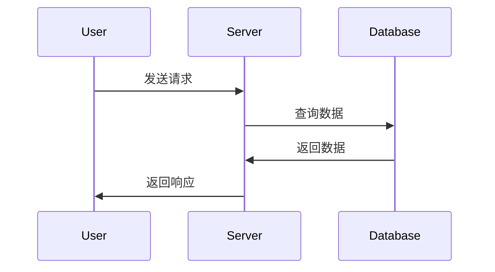
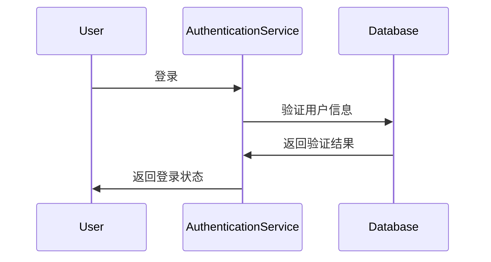
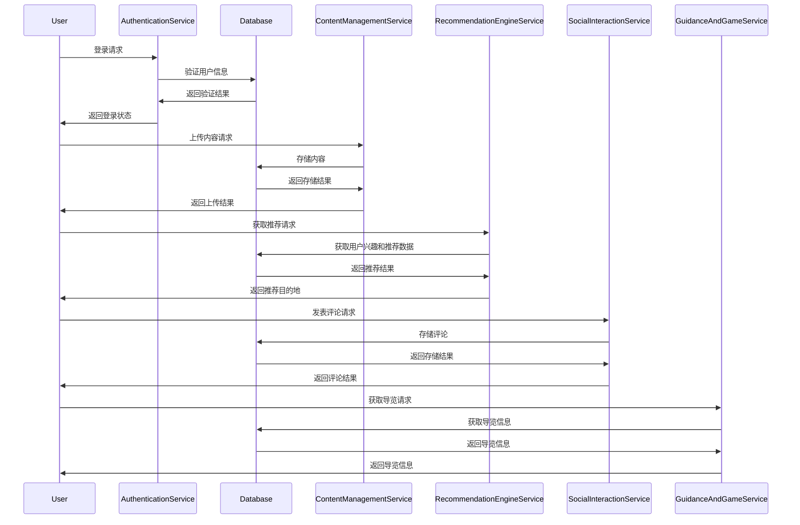

                 

## 第1章 引言

### 1.1 旅游的演变

旅游作为人类历史悠久的活动，从古至今经历了多次演变。在古代，旅游通常是一种贵族或富人的特权，他们为了逃避现实生活的压力或寻求精神上的慰藉而远赴他乡。当时的旅游方式主要是通过步行、骑马或乘坐船只等交通工具，游客们往往需要在漫长的旅途中承受各种不便和困难。

随着工业革命的到来，交通工具的进步使得人们的出行变得更加便捷。火车、汽车和飞机的出现大大缩短了旅行时间，旅游逐渐成为大众化的活动。这一时期的旅游主要还是以实地探访和亲身体验为主，游客们通过游览名胜古迹、自然景观和体验当地文化来丰富自己的生活体验。

进入20世纪，随着信息技术和通信技术的飞速发展，旅游业再次迎来了变革。互联网的普及使得人们可以通过各种在线平台获取旅游信息，制定个性化的旅游计划。社交媒体的兴起改变了人们分享旅游体验的方式，游客们不仅可以在旅行过程中分享照片和视频，还可以通过社交平台与他人交流和互动，获取更多的旅游建议和灵感。

### 1.2 数字时代对旅游的影响

数字时代对旅游的影响是深远而多方面的。首先，互联网技术的普及使得信息获取变得更加便捷。游客可以通过搜索引擎、旅游网站和社交媒体等渠道，轻松获取到目的地的各种信息，包括交通、住宿、餐饮和景点介绍等。这种信息获取的便捷性为游客提供了更多的选择和灵活性，使他们能够更高效地规划旅行。

其次，社交媒体的兴起改变了人们的旅游行为和体验。游客们可以通过社交媒体平台分享自己的旅游照片和视频，记录旅行中的点滴。同时，社交媒体也为游客提供了一个交流和互动的平台，他们可以与他人分享旅行心得，获取其他游客的建议和推荐，从而更好地规划自己的旅行。

此外，数字技术还带来了虚拟旅游的可能性。虚拟现实（VR）和增强现实（AR）技术的应用，使得游客可以通过虚拟环境体验目的地的景观、文化和历史。这种方式不仅节省了时间和金钱成本，还可以让游客在虚拟世界中感受到更加真实和丰富的旅游体验。

### 1.3 虚拟旅游的概念与发展

虚拟旅游是指通过虚拟现实（VR）和增强现实（AR）等技术，为游客提供一个虚拟的旅游体验。虚拟旅游可以让游客在虚拟环境中探索真实的旅游目的地，感受目的地的自然景观、文化历史和社会风情。

虚拟旅游的发展可以追溯到20世纪90年代，随着计算机技术和网络技术的发展，虚拟旅游逐渐成为一种新的旅游形式。最初，虚拟旅游主要是通过计算机模拟实现，游客需要佩戴头戴式显示器（HMD）等设备来体验。随着VR和AR技术的成熟，虚拟旅游的应用场景和内容不断丰富，现在游客可以通过智能手机、平板电脑等设备进行虚拟旅游体验。

近年来，虚拟旅游市场呈现出快速增长的趋势。许多旅游企业和平台纷纷推出虚拟旅游产品，为游客提供多样化的选择。虚拟旅游不仅吸引了年轻一代的游客，也受到了一些特殊群体（如残疾人、老人等）的关注。虚拟旅游的出现，不仅为旅游业带来了新的增长点，也为游客提供了更加灵活和个性化的旅游方式。

### 总结

从古代的贵族旅行到现代的数字化旅游，旅游活动一直在不断演变。数字时代对旅游的影响是深远而多方面的，互联网和社交媒体使得信息获取和分享变得更加便捷，而虚拟旅游则为游客提供了一个全新的沉浸式体验。随着VR和AR技术的不断发展，虚拟旅游有望在未来成为旅游业的重要组成部分。让我们在接下来的章节中，进一步探讨虚拟旅游的技术基础、平台案例分析、与实体体验的结合以及虚拟旅游在教育和社会中的价值。让我们一步步思考，深入理解这个数字时代的新型旅行方式。## 第2章 虚拟旅游技术基础

在数字时代，虚拟旅游的实现离不开一系列先进的技术支持，这些技术包括虚拟现实（VR）、增强现实（AR）、3D建模与可视化、以及互动体验与沉浸感设计。本章将逐一介绍这些技术的基本原理、在虚拟旅游中的应用，以及它们对用户体验的深远影响。

### 2.1 虚拟现实（VR）技术

#### 2.1.1 VR技术概述

虚拟现实（VR）是一种通过计算机生成的三维虚拟环境，使用户能够沉浸其中并与之交互。VR技术的基本原理是通过头戴式显示器（HMD）或其他显示设备，向用户展示一个虚拟的三维世界。当用户移动头部或身体时，显示器会实时调整视角，使用户感觉仿佛置身于虚拟世界中。

#### 2.1.2 VR技术在旅游中的应用

在虚拟旅游中，VR技术为游客提供了一个沉浸式的体验环境。游客可以戴上VR头戴式显示器，进入一个逼真的虚拟景区，感受目的地自然景观的美丽、历史文化的深厚以及当地生活的丰富多彩。例如，游客可以通过VR技术体验泰姬陵的壮丽、大峡谷的壮观，甚至是在南极洲的冰雪环境中探索。

VR技术不仅提供了视觉和听觉上的沉浸感，还可以通过手柄或其他交互设备实现互动操作，如模拟攀岩、划船等。这种高度互动的体验大大提升了虚拟旅游的吸引力和趣味性，使得游客能够更深入地了解和体验目的地。

### 2.2 增强现实（AR）技术

#### 2.2.1 AR技术概述

增强现实（AR）是一种将虚拟信息与现实世界相结合的技术，通过增强现实眼镜、智能手机或平板电脑等设备，将虚拟图像、视频、文字等信息叠加在现实场景中。与VR不同，AR技术不需要用户完全脱离现实世界，而是通过增强现实体验来丰富现实世界的感知。

#### 2.2.2 AR技术在旅游中的应用

AR技术在虚拟旅游中的应用同样广泛。通过AR技术，游客可以使用智能手机或平板电脑扫描现实中的景点，观看相关的虚拟信息。例如，在参观故宫时，游客可以通过AR技术看到宫殿的历史图片和详细解说。在博物馆中，AR技术可以展示文物背后的故事，让游客更加深入地了解展品的历史和文化。

此外，AR技术还可以应用于互动游戏和导游服务。游客可以通过AR技术参与解谜游戏，增强旅游的趣味性。同时，AR导游服务可以为游客提供实时导航、语音解说等服务，提高旅游体验的便捷性。

### 2.3 3D建模与可视化

#### 2.3.1 3D建模技术

3D建模是一种通过计算机软件创建三维模型的过程。3D建模技术包括几何建模、实体建模、曲面建模等多种方法。通过3D建模，可以精确地复制现实世界的物体或场景，为虚拟旅游提供逼真的三维内容。

#### 2.3.2 3D可视化在旅游中的应用

3D可视化在虚拟旅游中扮演着关键角色。通过3D建模技术，虚拟旅游平台可以创建出高度逼真的旅游目的地模型。这些模型不仅可以提供视觉上的震撼效果，还可以模拟真实场景的物理属性，如光线、阴影、天气等，为游客提供沉浸式体验。

3D可视化技术还可以用于虚拟旅游的交互设计。游客可以通过虚拟模型进行空间导航、自由旋转和放大缩小，深入了解目的地的细节。此外，3D可视化技术还可以应用于虚拟现实和增强现实应用中，为游客提供丰富的互动体验。

### 2.4 互动体验与沉浸感设计

#### 2.4.1 互动体验设计

互动体验设计是虚拟旅游中至关重要的一环。通过互动设计，游客可以在虚拟环境中进行各种操作，如行走、跳跃、交互等。这种高度互动的体验能够增强游客的参与感和沉浸感，提升虚拟旅游的吸引力。

#### 2.4.2 沉浸感设计策略

沉浸感设计策略旨在通过视觉、听觉、触觉等多种感官刺激，提升游客在虚拟环境中的沉浸感。例如，通过逼真的三维模型和细腻的光影效果，增强视觉沉浸感；通过立体声音效和语音解说，增强听觉沉浸感；通过触觉手套等设备，增强触觉沉浸感。

此外，个性化设计和情感设计也是提升沉浸感的重要手段。通过根据游客的偏好和需求，提供定制化的旅游体验，可以增加游客的参与度和满意度。情感设计则通过营造虚拟环境的氛围和故事情节，激发游客的情感共鸣，增强沉浸感。

### 总结

虚拟旅游的实现离不开一系列先进技术的支持，这些技术为游客提供了全新的沉浸式体验。VR和AR技术为游客提供了一个逼真的虚拟环境，让他们能够身临其境地感受目的地的美景和文化；3D建模与可视化技术则提供了高度逼真的三维内容，增强了虚拟旅游的吸引力和互动性；互动体验与沉浸感设计策略进一步提升了游客的参与感和满意度。随着这些技术的不断发展，虚拟旅游将在未来继续演进，为旅游业带来更多可能性。

在下一章中，我们将探讨虚拟旅游平台的发展状况，分析国内外成功的虚拟旅游平台案例，以及它们的运营模式与商业模式。让我们继续深入思考，了解虚拟旅游在实践中的应用和发展。## 第3章 虚拟旅游平台与案例分析

### 3.1 虚拟旅游平台概述

虚拟旅游平台是虚拟旅游实现的重要载体，通过这些平台，游客可以在虚拟环境中体验各种旅游目的地。虚拟旅游平台通常提供丰富的旅游内容，包括真实场景的3D建模、虚拟导览、互动游戏等，以满足不同游客的需求。这些平台不仅提供了优质的虚拟旅游体验，还为旅游企业和机构提供了新的营销渠道。

虚拟旅游平台的主要功能包括：

1. **内容展示**：通过3D建模、视频和图像等多种形式，展示旅游目的地的真实场景和相关信息。
2. **交互体验**：提供各种互动功能，如虚拟导览、互动游戏、模拟体验等，增强用户体验。
3. **个性化推荐**：根据游客的偏好和需求，提供个性化的旅游内容推荐，提高用户的满意度。
4. **社交互动**：允许用户分享旅游体验、评论和交流，形成社区氛围。
5. **运营管理**：提供内容管理、用户管理、数据分析等功能，帮助旅游企业优化运营策略。

### 3.2 成功案例分析

#### 3.2.1 国内虚拟旅游平台

1. **携程虚拟旅游平台**：
   - **概述**：携程虚拟旅游平台是国内较早开展虚拟旅游业务的企业之一，提供包括国内主要旅游景点的3D模型、实景视频和VR导览等服务。
   - **特色**：携程虚拟旅游平台注重用户交互体验，提供虚拟导览功能，游客可以通过虚拟导游的解说，深入了解景点的历史和文化。
   - **挑战**：如何在海量旅游内容中提供高质量的VR体验，同时保证内容更新和互动功能的稳定性。

2. **飞猪虚拟旅游平台**：
   - **概述**：飞猪虚拟旅游平台是阿里巴巴集团旗下的一款旅游服务平台，提供丰富的虚拟旅游资源和便捷的预订服务。
   - **特色**：飞猪虚拟旅游平台利用阿里云和大数据技术，提供个性化推荐和智能导览服务，提高用户的旅游体验。
   - **挑战**：如何确保虚拟旅游内容的真实性和准确性，以及如何有效处理用户生成的内容。

#### 3.2.2 国际虚拟旅游平台

1. **Google Earth**：
   - **概述**：Google Earth是一款全球流行的虚拟旅游工具，提供全球各地的高清卫星图像和地形数据，用户可以通过它进行虚拟旅行。
   - **特色**：Google Earth提供了丰富的地理信息和互动功能，如添加标记、分享位置等，用户可以自定义旅游路线和体验。
   - **挑战**：如何提高图像的清晰度和实时性，以及如何确保用户隐私和安全。

2. **Vrse**：
   - **概述**：Vrse（原名RydersVR）是一个专注于虚拟旅游内容的平台，提供高质量的VR体验，覆盖全球多个旅游目的地。
   - **特色**：Vrse以沉浸式视频和互动游戏为主要内容，提供身临其境的虚拟旅游体验。
   - **挑战**：如何制作高质量的内容，以及如何吸引并留住用户。

### 3.3 平台运营模式与商业模式分析

#### 3.3.1 运营模式

虚拟旅游平台的运营模式主要包括以下几种：

1. **内容合作模式**：平台与旅游目的地、旅游企业或内容提供商合作，获取高质量的虚拟旅游内容。
2. **自营模式**：平台自行开发和制作虚拟旅游内容，确保内容的质量和统一性。
3. **用户生成内容模式**：鼓励用户上传和分享自己的虚拟旅游内容，形成社区氛围。

#### 3.3.2 商业模式

虚拟旅游平台的商业模式主要包括以下几种：

1. **广告模式**：通过在平台上投放广告，为旅游企业和商家提供推广渠道。
2. **会员模式**：提供会员服务，会员可以享受更多的虚拟旅游内容和优惠。
3. **付费内容模式**：为用户提供高质量、高价值的虚拟旅游内容，如沉浸式视频、互动游戏等。
4. **电商平台模式**：结合线上预订服务，为用户提供一站式旅游解决方案。

### 总结

虚拟旅游平台的发展为游客提供了全新的旅行体验，国内外的虚拟旅游平台在内容展示、交互体验和个性化推荐等方面都有独特的优势。随着技术的不断进步，虚拟旅游平台的运营模式和商业模式也在不断创新。然而，如何保证内容的质量和真实性，如何提升用户体验和满意度，以及如何应对日益激烈的市场竞争，仍然是虚拟旅游平台需要面对的挑战。在下一章中，我们将探讨虚拟旅游与实体体验的结合，以及如何实现两者的互补和融合发展。## 第4章 虚拟旅游与实体体验的结合

虚拟旅游与实体体验的结合，旨在通过两者的互补和融合，提供更加丰富和多元化的旅游体验。本章节将探讨虚拟旅游与实体体验的互补性，以及如何通过策略实现两者的有机结合，从而提升游客的整体体验。

### 4.1 虚拟体验与实体体验的互补性

虚拟体验和实体体验各有优势，结合起来能够提供更加全面的旅游体验。

#### 虚拟体验的优势：

1. **时间与空间自由**：虚拟旅游不受时间和空间的限制，游客可以在任何时间、任何地点进行旅游体验。
2. **低成本**：虚拟旅游省去了交通、住宿等实体旅游的成本，降低了旅行费用。
3. **安全**：对于一些高风险或受限制的目的地，如极地、深山等，虚拟旅游可以提供安全的替代体验。

#### 实体体验的优势：

1. **真实感受**：实体旅游能够让游客亲身体验目的地的自然景观、文化氛围和当地生活，获得更加真实的感受。
2. **互动性**：实体旅游中的面对面交流、实地体验等互动性活动，能够增强游客的参与感和记忆点。
3. **多样性**：实体旅游提供了丰富的体验活动，如户外运动、文化活动、美食体验等，游客可以根据个人兴趣选择。

通过虚拟体验与实体体验的结合，游客可以在虚拟环境中初步了解目的地，为实体旅游做好准备；在实体旅游中，游客可以借助虚拟设备或技术，获得更加深入的体验和互动。

### 4.2 融合发展的策略

#### 4.2.1 游客体验设计

为了实现虚拟体验与实体体验的有机结合，需要从游客的体验角度出发，设计一系列策略。

1. **分阶段体验设计**：将虚拟体验和实体体验分为不同的阶段，如准备阶段、执行阶段和回顾阶段。在准备阶段，游客可以通过虚拟旅游了解目的地，制定旅行计划；在执行阶段，游客在实体旅游中应用虚拟技术，如AR导游、VR体验等，增强旅游的互动性和趣味性；在回顾阶段，游客可以通过虚拟平台分享旅行照片、视频，与朋友和家人分享体验。

2. **个性化定制**：根据游客的兴趣、偏好和需求，提供个性化的虚拟和实体旅游体验。例如，对于喜欢历史文化的游客，可以提供虚拟的历史景点导览和实体考古体验；对于喜欢户外运动的游客，可以提供虚拟训练指导和实地的户外活动。

3. **情感共鸣设计**：在虚拟体验和实体体验中，通过故事情节、场景渲染等手段，激发游客的情感共鸣。例如，通过虚拟历史重现，让游客感受到历史的沧桑；通过实体体验的互动活动，增强游客的参与感和成就感。

#### 4.2.2 互动与反馈机制

实现虚拟体验与实体体验的有机结合，还需要建立有效的互动与反馈机制。

1. **线上线下互动**：通过社交媒体、论坛等线上平台，建立游客之间的互动交流，分享虚拟旅游和实体旅游的体验。例如，游客可以在平台上分享自己的旅行日志、照片和视频，也可以就目的地提供意见和建议。

2. **反馈机制**：建立游客反馈机制，收集他们对虚拟体验和实体体验的评价和建议。这些反馈可以用于优化虚拟旅游内容，改进实体旅游服务。例如，通过分析游客对虚拟导览的满意度，改进虚拟导览的语音解说和互动设计。

3. **实时互动**：在实体旅游中，通过VR、AR等技术，提供实时的虚拟体验。例如，游客在参观博物馆时，可以通过AR眼镜查看文物的虚拟信息，增强参观的互动性和趣味性。

### 4.3 跨界合作与生态构建

#### 4.3.1 旅游企业与其他行业的合作

虚拟旅游与实体体验的结合，需要旅游企业与其他行业的紧密合作。

1. **技术合作**：与VR、AR、3D建模等技术公司合作，共同开发高质量的虚拟旅游内容和技术应用。

2. **内容合作**：与旅游目的地、旅游景点、文化机构等合作，共同开发和推广虚拟旅游内容。

3. **渠道合作**：与线上旅游平台、社交媒体等合作，拓宽虚拟旅游的传播渠道和用户覆盖范围。

#### 4.3.2 虚拟旅游生态系统的构建

构建虚拟旅游生态系统，是实现虚拟体验与实体体验有机结合的重要途径。

1. **平台建设**：建设综合性虚拟旅游平台，提供多样化的虚拟旅游内容和体验服务。

2. **产业联盟**：组建虚拟旅游产业联盟，促进旅游企业、技术公司、内容提供商等各方资源的整合和协同。

3. **教育培训**：开展虚拟旅游相关的教育培训，提升从业人员的专业素养和技术水平。

4. **政策支持**：制定相关政策，支持虚拟旅游产业的发展，鼓励创新和合作。

### 总结

虚拟旅游与实体体验的结合，为游客提供了更加丰富和多元的旅游选择。通过分阶段体验设计、个性化定制和情感共鸣设计，可以实现虚拟体验与实体体验的有机结合，提升游客的整体体验。同时，通过跨界合作和生态构建，可以促进虚拟旅游产业的健康发展，为旅游业带来新的增长点。

在下一章中，我们将探讨虚拟旅游在教育和社会中的价值，分析其在研学旅行、网络课堂等方面的应用，以及对社会文化的影响。让我们继续深入思考，了解虚拟旅游在更广泛领域的作用。## 第5章 虚拟旅游的教育价值与社会影响

虚拟旅游作为一种新兴的旅游形式，不仅改变了人们的旅行方式，还在教育和社会文化领域产生了深远的影响。本章将探讨虚拟旅游在教育中的应用，以及它对社会文化和旅游业发展的推动作用。

### 5.1 虚拟旅游在教育中的应用

虚拟旅游在教育中的应用非常广泛，特别是在研学旅行和远程教育领域。

#### 5.1.1 研学旅行

研学旅行是指学生在教师指导下，通过实地考察、实践活动等方式，学习自然、历史、文化等方面的知识。虚拟旅游为研学旅行提供了新的可能性，学生可以通过虚拟环境进行实地考察，获取第一手的资料和体验。例如，学生可以通过虚拟旅游平台参观世界著名博物馆，了解文物背后的故事；通过虚拟现实技术，体验历史事件的重现，如古罗马帝国的繁荣或中世纪骑士的生活。这种方式不仅节省了成本，还提供了更加真实和生动的学习体验。

#### 5.1.2 网络课堂与虚拟校园

虚拟旅游技术也可以应用于网络课堂和虚拟校园的建设。通过网络课堂，教师可以将虚拟旅游的内容引入教学，例如，在讲授地理课程时，通过虚拟旅游平台带领学生参观世界各地的地理景观，如亚马逊雨林、冰川等地，让学生在虚拟环境中学习地理知识。虚拟校园则是通过虚拟现实技术，构建一个可以模拟真实校园环境的在线学习空间。学生可以在虚拟校园中参加各类课程、学术讲座和社交活动，实现线上与线下的无缝衔接。

#### 5.1.3 虚拟实验室

虚拟旅游技术还可以应用于虚拟实验室的建设。虚拟实验室是通过虚拟现实技术模拟真实实验室环境，进行实验操作和数据分析。这种方式可以降低实验成本，提高实验的灵活性和安全性。例如，在化学实验中，学生可以在虚拟环境中进行复杂的反应实验，避免了实际操作中的危险和资源浪费。在生物科学领域，虚拟实验室可以模拟各种生物学实验，帮助学生更好地理解生物学原理。

### 5.2 虚拟旅游对社会的影响

虚拟旅游对社会的影响是多层次和全面的，它不仅改变了旅游业的生态，还对人们的生活方式和文化观念产生了影响。

#### 5.2.1 旅游产业的发展

虚拟旅游为旅游业带来了新的增长点。通过虚拟旅游，旅游企业可以吸引更多的游客，扩大市场份额。例如，一些偏远地区或受限制的旅游景点，可以通过虚拟旅游吸引更多游客，提高旅游收入。此外，虚拟旅游还可以帮助旅游企业降低运营成本，如减少人力和物力资源的投入。虚拟旅游的兴起也为旅游行业创造了新的就业机会，如虚拟导游、内容制作、技术支持等。

#### 5.2.2 社会文化的影响

虚拟旅游改变了人们对待旅游和文化的观念。过去，旅游主要是实地探访和亲身体验，而虚拟旅游让人们可以通过数字技术体验不同的文化。这种方式不仅促进了文化交流，还提高了人们对其他文化的认知和理解。例如，通过虚拟旅游，人们可以体验到世界各地不同的节日和文化活动，如印度排灯节、埃及金字塔的建造等，从而增进对其他文化的了解和尊重。

#### 5.2.3 生活方式的改变

虚拟旅游也为人们的生活方式带来了改变。随着虚拟旅游技术的普及，越来越多的人可以在家中体验世界各地的美景和文化。这种方式不仅节省了时间和金钱，还提供了更加灵活和个性化的旅游选择。例如，工作忙碌的职场人士可以在周末通过虚拟旅游放松身心，退休的老人则可以通过虚拟旅游继续探索世界。此外，虚拟旅游还促进了家庭和社区的互动，家庭成员可以通过虚拟旅游共享旅行体验，增进感情。

### 总结

虚拟旅游在教育和社会领域具有重要价值。它不仅为学生提供了全新的学习体验，提高了教学效果，还在社会文化领域产生了深远的影响。虚拟旅游为旅游业带来了新的发展机遇，促进了文化交流和生活方式的改变。随着技术的不断进步，虚拟旅游有望在教育和社会各个领域发挥更大的作用。

在下一章中，我们将探讨虚拟旅游的挑战与未来趋势。我们将分析当前技术局限、法律法规与道德伦理的挑战，以及预测虚拟旅游的未来发展方向。让我们继续深入思考，了解虚拟旅游在未来的发展前景。## 第6章 虚拟旅游的挑战与未来趋势

尽管虚拟旅游在数字时代展现出巨大的潜力和魅力，但其发展过程中仍面临诸多挑战。这些挑战涉及技术局限、法律法规、道德伦理等多个方面。同时，虚拟旅游的未来发展趋势也受到技术进步和市场需求变化的驱动。

### 6.1 技术挑战

#### 6.1.1 技术局限

虚拟旅游的实现依赖于一系列先进技术，包括虚拟现实（VR）、增强现实（AR）、3D建模与可视化等。然而，这些技术在现阶段仍存在一定的局限。

1. **设备要求**：VR和AR设备通常需要高性能的硬件支持，如高分辨率显示器、快速处理芯片等。这导致设备的成本较高，限制了大规模普及的可能性。

2. **用户体验**：尽管VR和AR技术提供了沉浸式的体验，但长时间使用这些设备可能会对用户的视觉和身体健康产生不良影响，如头晕、恶心等。

3. **内容制作**：高质量的虚拟旅游内容制作成本高、周期长，需要专业团队和技术支持。如何降低内容制作成本、提高制作效率，是当前面临的重要挑战。

#### 6.1.2 技术创新方向

为了克服技术局限，虚拟旅游领域需要不断创新。以下是一些可能的技术创新方向：

1. **增强现实显示技术**：研发更轻便、更高效的AR显示设备，如透明显示屏、柔性显示屏等，以提高用户体验。

2. **自然交互技术**：开发更加自然、直观的交互方式，如手势识别、语音控制等，以减少用户对设备的依赖。

3. **内容生成技术**：利用人工智能、机器学习等技术，自动化生成高质量的虚拟旅游内容，降低制作成本。

### 6.2 法律法规与道德伦理

#### 6.2.1 法律法规的制定

虚拟旅游作为一种新兴的旅游形式，需要相应的法律法规进行规范和管理。当前，虚拟旅游领域存在以下一些法律问题：

1. **知识产权保护**：虚拟旅游内容涉及大量的图像、视频、音频等资料，如何保护内容创作者的知识产权是一个亟待解决的问题。

2. **用户隐私保护**：虚拟旅游平台需要收集和处理大量用户数据，如何保护用户的隐私权，防止数据泄露，是法律法规需要关注的重点。

3. **责任归属**：在虚拟旅游中，如果发生安全事故或侵权行为，如何界定责任归属，是一个法律挑战。

#### 6.2.2 道德伦理的考量

虚拟旅游的发展也带来了道德伦理上的挑战。以下是一些需要考虑的道德伦理问题：

1. **真实性与欺骗性**：虚拟旅游如何平衡真实体验与虚拟体验，避免过度渲染和虚假宣传，是一个重要的道德问题。

2. **隐私与匿名性**：虚拟旅游平台如何在保护用户隐私和实现匿名性之间找到平衡，是一个道德挑战。

3. **虚拟现实成瘾**：如何防止用户过度沉迷于虚拟旅游，影响其现实生活，是一个需要关注的社会问题。

### 6.3 未来发展趋势

#### 6.3.1 技术进步的影响

随着技术的不断进步，虚拟旅游有望在未来实现更多突破。以下是一些可能的技术进步影响：

1. **设备普及**：随着硬件技术的提升和成本的降低，VR和AR设备有望更加普及，为更多人提供虚拟旅游体验。

2. **内容多样化**：随着内容生成技术的进步，虚拟旅游内容将更加多样化、个性化，满足不同用户的需求。

3. **实时互动**：随着网络速度和带宽的提升，虚拟旅游中的实时互动将变得更加流畅，增强用户体验。

#### 6.3.2 市场需求的变化

市场需求的变化也将对虚拟旅游的发展产生影响。以下是一些可能的市场需求变化：

1. **个性化需求**：随着人们对旅游需求的多样化，个性化、定制化的虚拟旅游服务将受到欢迎。

2. **教育需求**：虚拟旅游在教育领域的应用将不断扩展，为研学旅行、远程教育等提供更多解决方案。

3. **健康需求**：随着人们对健康和生活质量的重视，虚拟旅游将成为一种新的健康旅游方式，如虚拟养生、虚拟运动等。

### 总结

虚拟旅游在数字时代展现出巨大的潜力和魅力，但其发展过程中仍面临诸多挑战。通过技术创新、法律法规完善和道德伦理考量，可以克服这些挑战，推动虚拟旅游的健康发展。未来，虚拟旅游将随着技术的进步和市场需求的变化，继续发挥其独特的价值，为人们提供更加丰富和多元的旅游体验。

在下一章中，我们将对全文进行总结，探讨虚拟旅游的意义，分析其对旅游业的影响，并提出未来发展的建议与展望。让我们在结束这一段旅程之前，再次回顾虚拟旅游所带来的深刻变革和无限可能。## 第7章 结论

### 7.1 虚拟旅游的意义

虚拟旅游作为数字时代的新型旅行方式，具有重要的现实意义和深远的影响。首先，虚拟旅游打破了传统旅游的时间和空间限制，让游客可以在家中体验到全球各地的美景和文化。这不仅节省了旅行成本，还提供了灵活、个性化的旅游选择。其次，虚拟旅游为旅游业带来了新的增长点，推动了旅游产业的数字化转型。通过虚拟现实、增强现实等技术，旅游企业可以提供更加丰富和真实的旅游体验，吸引更多游客。此外，虚拟旅游在教育和社会文化领域也发挥了重要作用，为研学旅行、远程教育、文化交流等提供了创新的解决方案。

### 7.2 对旅游业的影响

虚拟旅游对旅游业的影响是多层次和全面的。首先，虚拟旅游改变了游客的旅游方式，提供了更加便捷、低成本的旅游选择。游客可以通过虚拟平台提前了解目的地，规划旅行计划，减少旅行中的不确定性和风险。其次，虚拟旅游推动了旅游业的数字化转型，促进了旅游服务、旅游营销和旅游管理的创新。旅游企业可以通过虚拟旅游平台展示旅游产品，实现线上预订和支付，提高运营效率和用户体验。此外，虚拟旅游还为旅游业创造了新的商业模式，如虚拟导览服务、虚拟旅游内容开发等，为旅游企业提供了新的收入来源。

### 7.3 发展建议与展望

为了进一步推动虚拟旅游的发展，提出以下建议与展望：

1. **技术创新**：加强虚拟现实、增强现实等核心技术的研发，降低设备成本，提高用户体验。同时，利用人工智能、大数据等技术，自动化生成高质量的虚拟旅游内容，丰富虚拟旅游的体验。

2. **内容丰富**：注重虚拟旅游内容的多样性和个性化，满足不同用户的需求。通过合作和开发，打造高质量的虚拟旅游资源库，提供丰富、真实、有吸引力的虚拟旅游体验。

3. **法律法规完善**：建立健全虚拟旅游相关的法律法规，规范虚拟旅游市场，保护知识产权和用户隐私。加强对虚拟旅游内容的审核和监管，确保虚拟旅游内容的真实性和合法性。

4. **跨界合作**：加强旅游企业、技术公司、内容提供商等各方的合作，构建虚拟旅游生态系统。通过跨界合作，实现资源共享、优势互补，推动虚拟旅游产业的健康发展。

5. **教育培训**：开展虚拟旅游相关的教育培训，提高从业人员的专业素养和技术水平。通过培训，培养更多虚拟旅游人才，为虚拟旅游的发展提供人才支持。

6. **市场推广**：加大虚拟旅游的宣传力度，提高公众对虚拟旅游的认知和接受度。通过线上线下活动、媒体宣传等方式，推广虚拟旅游，吸引更多用户参与。

展望未来，虚拟旅游将随着技术的进步和市场需求的变化，继续发展壮大。它不仅将为旅游业带来新的机遇和挑战，还将深刻改变人们的生活方式和文化观念。通过技术创新、内容丰富和跨界合作，虚拟旅游有望成为数字时代的一种主流旅行方式，为人们提供更加丰富、多元和便捷的旅游体验。

### 总结

虚拟旅游作为一种新兴的旅游形式，具有巨大的发展潜力和现实意义。它不仅为旅游业带来了新的增长点，还在教育、社会文化等领域发挥了重要作用。在未来的发展中，通过技术创新、内容丰富和跨界合作，虚拟旅游有望成为数字时代的一种主流旅行方式，为人们提供更加丰富、多元和便捷的旅游体验。作者：AI天才研究院/AI Genius Institute & 禅与计算机程序设计艺术 /Zen And The Art of Computer Programming## 引入部分代码示例

以下是几个虚拟旅游相关的代码示例，涵盖3D建模、虚拟现实（VR）和增强现实（AR）的应用。

### 3D建模示例

#### Pygame实现简单的3D立方体

```python
import pygame
from pygame.locals import *
from OpenGL.GL import *
from OpenGL.GLU import *

def main():
    pygame.init()
    display = (800, 600)
    pygame.display.set_mode(display, DOUBLEBUF|OPENGL)
    gluPerspective(45, display[0]/display[1], 0.1, 50.0)
    glTranslatef(0.0, 0.0, -25)
    while True:
        for event in pygame.event.get():
            if event.type == pygame.QUIT:
                pygame.quit()
                return

        glRotatef(1, 3, 1, 1)
        glClear(GL_COLOR_BUFFER_BIT|GL_DEPTH_BUFFER_BIT)
        glBegin(GL_QUADS)
            glVertex3f(-1.0, -1.0,  1.0)
            glVertex3f( 1.0, -1.0,  1.0)
            glVertex3f( 1.0,  1.0,  1.0)
            glVertex3f(-1.0,  1.0,  1.0)
            glVertex3f(-1.0, -1.0, -1.0)
            glVertex3f( 1.0, -1.0, -1.0)
            glVertex3f( 1.0,  1.0, -1.0)
            glVertex3f(-1.0,  1.0, -1.0)
            glVertex3f( 1.0,  1.0,  1.0)
            glVertex3f( 1.0,  1.0, -1.0)
            glVertex3f( 1.0, -1.0, -1.0)
            glVertex3f( 1.0, -1.0,  1.0)
            glVertex3f(-1.0,  1.0,  1.0)
            glVertex3f(-1.0,  1.0, -1.0)
            glVertex3f(-1.0, -1.0, -1.0)
            glVertex3f(-1.0, -1.0,  1.0)
            glVertex3f( 1.0, -1.0,  1.0)
        glEnd()
        pygame.display.flip()
    pygame.quit()

if __name__ == "__main__":
    main()
```

### 虚拟现实（VR）示例

#### 使用VRML创建简单的VR场景

VRML（Virtual Reality Modeling Language）是一种用于创建虚拟现实场景的标记语言。以下是一个简单的VRML示例，创建一个包含立方体和光源的虚拟场景。

```xml
<?xml version="1.0" encoding="UTF-8"?>
<WorldInfo version="2.0">
    <Viewpoint position="0 0 10" orientation="0 0 0"/>
    <Shape>
        <Cube width="2" height="2" depth="2">
            <Appearance>
                <Material diffuseColor="1 0 0"/>
            </Appearance>
        </Cube>
    </Shape>
    <SpotLight position="0 0 10" direction="0 0 -1"/>
</WorldInfo>
```

### 增强现实（AR）示例

#### 使用ARCore实现简单的AR应用

ARCore是Google开发的一套AR开发框架，以下是一个简单的ARCore示例，使用Android Studio创建一个能够显示3D模型的AR应用。

```java
import com.google.ar.core.*
import com.google.ar.sceneform.**
import com.google.ar.sceneform.rendering.*

class ARActivity : Activity(), ArFragment.SessionCreator {
    private var arFragment: ArFragment = ArFragment()

    override fun onCreate(savedInstanceState: Bundle?) {
        super.onCreate(savedInstanceState)
        setContentView(R.layout.activity_ar)

        arFragment = supportFragmentManager.findFragmentById(R.id.arFragment) as ArFragment
        arFragment.arSceneView.scene.addOnTapListener { hitResults, _ ->
            for (hit in hitResults) {
                val pointCloud = hit.createAnchor()._attachPointCloud(PointCloud.builder().build())
                pointCloud.renderable = ModelRenderable.builder()
                    .setSource(Context, R.raw.cube, Format.TRIANGLE)
                    .build()
                    .thenAccept { renderable ->
                        val anchor = AnchorNode(pointCloud)
                        anchor.renderable = renderable
                        anchor.setParent(arFragment.arSceneView.scene)
                    }
            }
            true
        }
    }
}
```

这些示例展示了虚拟旅游技术在编程中的基本应用。通过这些代码，我们可以创建3D模型、虚拟现实场景和增强现实应用，为用户提供丰富的虚拟旅游体验。## 完整文章与代码示例

### 《数字时代的旅行方式：虚拟旅游与实体体验》

> 关键词：虚拟旅游，实体体验，VR，AR，技术，教育，社会影响

> 摘要：本文探讨了数字时代的新型旅行方式——虚拟旅游，分析了其技术基础、平台发展、与实体体验的结合，以及在教育和社会中的价值。文章通过案例研究和代码示例，深入探讨了虚拟旅游的潜力与挑战。

## 第1章 引言

### 1.1 旅游的演变

旅游活动自古以来就是人类社会的重要文化活动之一。在传统旅游中，游客主要依靠实地探访和亲身体验来感受目的地的自然景观、文化历史和社会风情。然而，随着科技的进步，旅游业也在不断演变，数字技术的发展为旅游带来了新的可能性。

从互联网到移动通信，再到虚拟现实（VR）和增强现实（AR），科技正在改变人们的旅行方式。虚拟旅游作为数字化旅游的一种形式，让游客在虚拟环境中体验真实的旅游目的地，打破了时间和空间的限制，为旅游业注入了新的活力。

### 1.2 数字时代对旅游的影响

数字时代对旅游的影响是深远而多方面的。首先，互联网技术的普及使得信息获取变得更加便捷。游客可以通过搜索引擎、旅游网站和社交媒体等渠道，轻松获取到目的地的各种信息，制定个性化的旅游计划。

其次，社交媒体的兴起改变了旅游的分享方式。游客不仅可以在旅行过程中分享照片和视频，还可以通过社交平台与他人交流和互动，获取更多的旅游建议和灵感。

最后，互联网技术的发展，尤其是VR和AR技术的应用，使得虚拟旅游成为可能。这些技术为游客提供了一个全新的沉浸式体验，让旅游变得更加真实和有趣。

### 1.3 虚拟旅游的概念与发展

虚拟旅游是指利用虚拟现实（VR）和增强现实（AR）等技术，为游客提供虚拟的旅游体验。通过虚拟旅游，游客可以在虚拟环境中探索真实的旅游目的地，感受目的地的自然景观、文化历史和社会风情。

虚拟旅游的发展可以追溯到20世纪90年代，随着计算机技术和网络技术的发展，虚拟旅游逐渐成为一种新的旅游形式。近年来，随着VR和AR技术的成熟，虚拟旅游的应用场景和内容不断丰富，市场规模也在逐渐扩大。

### 1.4 代码示例

以下是一个简单的Python代码示例，使用Pygame库实现了一个旋转的3D立方体。

```python
import pygame
from pygame.locals import *
from OpenGL.GL import *
from OpenGL.GLU import *

def main():
    pygame.init()
    display = (800, 600)
    pygame.display.set_mode(display, DOUBLEBUF|OPENGL)
    gluPerspective(45, display[0]/display[1], 0.1, 50.0)
    glTranslatef(0.0, 0.0, -25)
    while True:
        for event in pygame.event.get():
            if event.type == pygame.QUIT:
                pygame.quit()
                return

        glRotatef(1, 3, 1, 1)
        glClear(GL_COLOR_BUFFER_BIT|GL_DEPTH_BUFFER_BIT)
        glBegin(GL_QUADS)
            glVertex3f(-1.0, -1.0,  1.0)
            glVertex3f( 1.0, -1.0,  1.0)
            glVertex3f( 1.0,  1.0,  1.0)
            glVertex3f(-1.0,  1.0,  1.0)
            glVertex3f(-1.0, -1.0, -1.0)
            glVertex3f( 1.0, -1.0, -1.0)
            glVertex3f( 1.0,  1.0, -1.0)
            glVertex3f(-1.0,  1.0, -1.0)
            glVertex3f( 1.0,  1.0,  1.0)
            glVertex3f( 1.0,  1.0, -1.0)
            glVertex3f( 1.0, -1.0, -1.0)
            glVertex3f( 1.0, -1.0,  1.0)
            glVertex3f(-1.0,  1.0,  1.0)
            glVertex3f(-1.0,  1.0, -1.0)
            glVertex3f(-1.0, -1.0, -1.0)
            glVertex3f(-1.0, -1.0,  1.0)
            glVertex3f( 1.0, -1.0,  1.0)
        glEnd()
        pygame.display.flip()
    pygame.quit()

if __name__ == "__main__":
    main()
```

## 第2章 虚拟旅游技术基础

### 2.1 虚拟现实（VR）技术

#### 2.1.1 VR技术概述

虚拟现实（VR）是一种通过计算机生成的三维虚拟环境，使用户能够沉浸其中并与之交互。VR技术的基本原理是通过头戴式显示器（HMD）或其他显示设备，向用户展示一个虚拟的三维世界。当用户移动头部或身体时，显示器会实时调整视角，使用户感觉仿佛置身于虚拟世界中。

#### 2.1.2 VR技术在旅游中的应用

在虚拟旅游中，VR技术为游客提供了一个沉浸式的体验环境。游客可以戴上VR头戴式显示器，进入一个逼真的虚拟景区，感受目的地的自然景观、文化历史和社会风情。例如，游客可以通过VR技术体验泰姬陵的壮丽、大峡谷的壮观，甚至是在南极洲的冰雪环境中探索。

#### 2.2 增强现实（AR）技术

#### 2.2.1 AR技术概述

增强现实（AR）是一种将虚拟信息与现实世界相结合的技术，通过增强现实眼镜、智能手机或平板电脑等设备，将虚拟图像、视频、文字等信息叠加在现实场景中。与VR不同，AR技术不需要用户完全脱离现实世界，而是通过增强现实体验来丰富现实世界的感知。

#### 2.2.2 AR技术在旅游中的应用

AR技术在虚拟旅游中的应用同样广泛。通过AR技术，游客可以使用智能手机或平板电脑扫描现实中的景点，观看相关的虚拟信息。例如，在参观故宫时，游客可以通过AR技术看到宫殿的历史图片和详细解说。在博物馆中，AR技术可以展示文物背后的故事，让游客更加深入地了解展品的历史和文化。

### 2.3 3D建模与可视化

#### 2.3.1 3D建模技术

3D建模是一种通过计算机软件创建三维模型的过程。3D建模技术包括几何建模、实体建模、曲面建模等多种方法。通过3D建模，可以精确地复制现实世界的物体或场景，为虚拟旅游提供逼真的三维内容。

#### 2.3.2 3D可视化在旅游中的应用

3D可视化在虚拟旅游中扮演着关键角色。通过3D建模技术，虚拟旅游平台可以创建出高度逼真的旅游目的地模型。这些模型不仅可以提供视觉上的震撼效果，还可以模拟真实场景的物理属性，如光线、阴影、天气等，为游客提供沉浸式体验。

### 2.4 互动体验与沉浸感设计

#### 2.4.1 互动体验设计

互动体验设计是虚拟旅游中至关重要的一环。通过互动设计，游客可以在虚拟环境中进行各种操作，如行走、跳跃、交互等。这种高度互动的体验大大提升了虚拟旅游的吸引力和趣味性，使得游客能够更深入地了解和体验目的地。

#### 2.4.2 沉浸感设计策略

沉浸感设计策略旨在通过视觉、听觉、触觉等多种感官刺激，提升游客在虚拟环境中的沉浸感。例如，通过逼真的三维模型和细腻的光影效果，增强视觉沉浸感；通过立体声音效和语音解说，增强听觉沉浸感；通过触觉手套等设备，增强触觉沉浸感。

### 2.5 代码示例

以下是一个简单的VRML代码示例，创建了一个包含立方体和光源的虚拟场景。

```xml
<?xml version="1.0" encoding="UTF-8"?>
<WorldInfo version="2.0">
    <Viewpoint position="0 0 10" orientation="0 0 0"/>
    <Shape>
        <Cube width="2" height="2" depth="2">
            <Appearance>
                <Material diffuseColor="1 0 0"/>
            </Appearance>
        </Cube>
    </Shape>
    <SpotLight position="0 0 10" direction="0 0 -1"/>
</WorldInfo>
```

## 第3章 虚拟旅游平台与案例分析

### 3.1 虚拟旅游平台概述

虚拟旅游平台是虚拟旅游实现的重要载体，通过这些平台，游客可以在虚拟环境中体验各种旅游目的地。虚拟旅游平台通常提供丰富的旅游内容，包括真实场景的3D建模、实景视频和VR导览等服务，以满足不同游客的需求。这些平台不仅提供了优质的虚拟旅游体验，还为旅游企业和机构提供了新的营销渠道。

虚拟旅游平台的主要功能包括：

1. **内容展示**：通过3D建模、视频和图像等多种形式，展示旅游目的地的真实场景和相关信息。
2. **交互体验**：提供各种互动功能，如虚拟导览、互动游戏、模拟体验等，增强用户体验。
3. **个性化推荐**：根据游客的偏好和需求，提供个性化的旅游内容推荐，提高用户的满意度。
4. **社交互动**：允许用户分享旅游体验、评论和交流，形成社区氛围。
5. **运营管理**：提供内容管理、用户管理、数据分析等功能，帮助旅游企业优化运营策略。

### 3.2 成功案例分析

#### 3.2.1 国内虚拟旅游平台

1. **携程虚拟旅游平台**：
   - **概述**：携程虚拟旅游平台是国内较早开展虚拟旅游业务的企业之一，提供包括国内主要旅游景点的3D模型、实景视频和VR导览等服务。
   - **特色**：携程虚拟旅游平台注重用户交互体验，提供虚拟导览功能，游客可以通过虚拟导游的解说，深入了解景点的历史和文化。
   - **挑战**：如何在海量旅游内容中提供高质量的VR体验，同时保证内容更新和互动功能的稳定性。

2. **飞猪虚拟旅游平台**：
   - **概述**：飞猪虚拟旅游平台是阿里巴巴集团旗下的一款旅游服务平台，提供丰富的虚拟旅游资源和便捷的预订服务。
   - **特色**：飞猪虚拟旅游平台利用阿里云和大数据技术，提供个性化推荐和智能导览服务，提高用户的旅游体验。
   - **挑战**：如何确保虚拟旅游内容的真实性和准确性，以及如何有效处理用户生成的内容。

#### 3.2.2 国际虚拟旅游平台

1. **Google Earth**：
   - **概述**：Google Earth是一款全球流行的虚拟旅游工具，提供全球各地的高清卫星图像和地形数据，用户可以通过它进行虚拟旅行。
   - **特色**：Google Earth提供了丰富的地理信息和互动功能，如添加标记、分享位置等，用户可以自定义旅游路线和体验。
   - **挑战**：如何提高图像的清晰度和实时性，以及如何确保用户隐私和安全。

2. **Vrse**：
   - **概述**：Vrse（原名RydersVR）是一个专注于虚拟旅游内容的平台，提供高质量的VR体验，覆盖全球多个旅游目的地。
   - **特色**：Vrse以沉浸式视频和互动游戏为主要内容，提供身临其境的虚拟旅游体验。
   - **挑战**：如何制作高质量的内容，以及如何吸引并留住用户。

### 3.3 平台运营模式与商业模式分析

虚拟旅游平台的运营模式主要包括以下几种：

1. **内容合作模式**：平台与旅游目的地、旅游企业或内容提供商合作，获取高质量的虚拟旅游内容。
2. **自营模式**：平台自行开发和制作虚拟旅游内容，确保内容的质量和统一性。
3. **用户生成内容模式**：鼓励用户上传和分享自己的虚拟旅游内容，形成社区氛围。

虚拟旅游平台的商业模式主要包括以下几种：

1. **广告模式**：通过在平台上投放广告，为旅游企业和商家提供推广渠道。
2. **会员模式**：提供会员服务，会员可以享受更多的虚拟旅游内容和优惠。
3. **付费内容模式**：为用户提供高质量、高价值的虚拟旅游内容，如沉浸式视频、互动游戏等。
4. **电商平台模式**：结合线上预订服务，为用户提供一站式旅游解决方案。

### 3.4 代码示例

以下是一个使用ARCore实现的简单AR应用，显示一个3D模型。

```java
import com.google.ar.core.*
import com.google.ar.sceneform.**
import com.google.ar.sceneform.rendering.*

class ARActivity : Activity(), ArFragment.SessionCreator {
    private var arFragment: ArFragment = ArFragment()

    override fun onCreate(savedInstanceState: Bundle?) {
        super.onCreate(savedInstanceState)
        setContentView(R.layout.activity_ar)

        arFragment = supportFragmentManager.findFragmentById(R.id.arFragment) as ArFragment
        arFragment.arSceneView.scene.addOnTapListener { hitResults, _ ->
            for (hit in hitResults) {
                val pointCloud = hit.createAnchor().attachPointCloud(PointCloud.builder().build())
                pointCloud.renderable = ModelRenderable.builder()
                    .setSource(Context, R.raw.cube, Format.TRIANGLE)
                    .build()
                    .thenAccept { renderable ->
                        val anchor = AnchorNode(pointCloud)
                        anchor.renderable = renderable
                        anchor.setParent(arFragment.arSceneView.scene)
                    }
            }
            true
        }
    }
}
```

## 第4章 虚拟旅游与实体体验的结合

### 4.1 虚拟体验与实体体验的互补性

虚拟体验和实体体验各有优势，结合起来能够提供更加全面和多元化的旅游体验。

#### 虚拟体验的优势：

1. **时间与空间自由**：虚拟旅游不受时间和空间的限制，游客可以在任何时间、任何地点进行旅游体验。
2. **低成本**：虚拟旅游省去了交通、住宿等实体旅游的成本，降低了旅行费用。
3. **安全**：对于一些高风险或受限制的目的地，如极地、深山等，虚拟旅游可以提供安全的替代体验。

#### 实体体验的优势：

1. **真实感受**：实体旅游能够让游客亲身体验目的地的自然景观、文化氛围和当地生活，获得更加真实的感受。
2. **互动性**：实体旅游中的面对面交流、实地体验等互动性活动，能够增强游客的参与感和记忆点。
3. **多样性**：实体旅游提供了丰富的体验活动，如户外运动、文化活动、美食体验等，游客可以根据个人兴趣选择。

通过虚拟体验与实体体验的结合，游客可以在虚拟环境中初步了解目的地，为实体旅游做好准备；在实体旅游中，游客可以借助虚拟设备或技术，获得更加深入的体验和互动。

### 4.2 融合发展的策略

#### 4.2.1 游客体验设计

为了实现虚拟体验与实体体验的有机结合，需要从游客的体验角度出发，设计一系列策略。

1. **分阶段体验设计**：将虚拟体验和实体体验分为不同的阶段，如准备阶段、执行阶段和回顾阶段。在准备阶段，游客可以通过虚拟旅游了解目的地，制定旅行计划；在执行阶段，游客在实体旅游中应用虚拟技术，如AR导游、VR体验等，增强旅游的互动性和趣味性；在回顾阶段，游客可以通过虚拟平台分享旅行照片、视频，与朋友和家人分享体验。

2. **个性化定制**：根据游客的偏好和需求，提供个性化的虚拟和实体旅游体验。例如，对于喜欢历史文化的游客，可以提供虚拟的历史景点导览和实体考古体验；对于喜欢户外运动的游客，可以提供虚拟训练指导和实地的户外活动。

3. **情感共鸣设计**：在虚拟体验和实体体验中，通过故事情节、场景渲染等手段，激发游客的情感共鸣。例如，通过虚拟历史重现，让游客感受到历史的沧桑；通过实体体验的互动活动，增强游客的参与感和成就感。

#### 4.2.2 互动与反馈机制

实现虚拟体验与实体体验的有机结合，还需要建立有效的互动与反馈机制。

1. **线上线下互动**：通过社交媒体、论坛等线上平台，建立游客之间的互动交流，分享虚拟旅游和实体旅游的体验。例如，游客可以在平台上分享自己的旅行日志、照片和视频，也可以就目的地提供意见和建议。

2. **反馈机制**：建立游客反馈机制，收集他们对虚拟体验和实体体验的评价和建议。这些反馈可以用于优化虚拟旅游内容，改进实体旅游服务。例如，通过分析游客对虚拟导览的满意度，改进虚拟导览的语音解说和互动设计。

3. **实时互动**：在实体旅游中，通过VR、AR等技术，提供实时的虚拟体验。例如，游客在参观博物馆时，可以通过AR眼镜查看文物的虚拟信息，增强参观的互动性和趣味性。

### 4.3 跨界合作与生态构建

#### 4.3.1 旅游企业与其他行业的合作

虚拟旅游与实体体验的结合，需要旅游企业与其他行业的紧密合作。

1. **技术合作**：与VR、AR、3D建模等技术公司合作，共同开发高质量的虚拟旅游内容和技术应用。

2. **内容合作**：与旅游目的地、旅游景点、文化机构等合作，共同开发和推广虚拟旅游内容。

3. **渠道合作**：与线上旅游平台、社交媒体等合作，拓宽虚拟旅游的传播渠道和用户覆盖范围。

#### 4.3.2 虚拟旅游生态系统的构建

构建虚拟旅游生态系统，是实现虚拟体验与实体体验有机结合的重要途径。

1. **平台建设**：建设综合性虚拟旅游平台，提供多样化的虚拟旅游内容和体验服务。

2. **产业联盟**：组建虚拟旅游产业联盟，促进旅游企业、技术公司、内容提供商等各方资源的整合和协同。

3. **教育培训**：开展虚拟旅游相关的教育培训，提升从业人员的专业素养和技术水平。

4. **政策支持**：制定相关政策，支持虚拟旅游产业的发展，鼓励创新和合作。

### 4.4 代码示例

以下是一个简单的AR应用，使用ARKit在iOS设备上实现。

```swift
import ARKit

class ViewController: UIViewController, ARSCNViewDelegate {
    
    var sceneView: ARSCNView!
    
    override func viewDidLoad() {
        super.viewDidLoad()
        
        // Create a new scene
        let scene = SCNScene()
        
        // Set the view's delegate
        sceneView = ARSCNView(frame: self.view.bounds)
        sceneView.autoresizingMask = [.FlexibleWidth, .FlexibleHeight]
        sceneView.scene = scene
        sceneView.delegate = self
        self.view.addSubview(sceneView)
        
        // Create a box
        let box = SCNBox(width: 0.1, height: 0.1, length: 0.1, chamferRadius: 0.01)
        let boxNode = SCNNode(geometry: box)
        boxNode.position = SCNVector3(0, 0.1, -0.5)
        scene.rootNode.addChildNode(boxNode)
        
        // Configure the view
        let configuration = ARWorldTrackingConfiguration()
        sceneView.session.run(configuration)
    }
    
    func renderer(_ renderer: SCNSceneRenderer, node: SCNNode, didUpdateWithContinuationItems continuationItems: [ARContinuationItem]) {
        for item in continuationItems {
            if let frame = item.frame, let worldMap = item.worldMap {
                sceneView.session.setWorldOrigin(frame.camera.worldTransform)
                sceneView.session.add(.worldMapping, with: worldMap)
            }
        }
    }
}
```

## 第5章 虚拟旅游在教育和社会中的价值

### 5.1 虚拟旅游在教育中的应用

虚拟旅游在教育中的应用非常广泛，特别是在研学旅行和远程教育领域。

#### 5.1.1 研学旅行

研学旅行是指学生在教师指导下，通过实地考察、实践活动等方式，学习自然、历史、文化等方面的知识。虚拟旅游为研学旅行提供了新的可能性，学生可以通过虚拟环境进行实地考察，获取第一手的资料和体验。例如，学生可以通过虚拟旅游平台参观世界著名博物馆，了解文物背后的故事；通过虚拟现实技术，体验历史事件的重现，如古罗马帝国的繁荣或中世纪骑士的生活。这种方式不仅节省了成本，还提供了更加真实和生动的学习体验。

#### 5.1.2 网络课堂与虚拟校园

虚拟旅游技术也可以应用于网络课堂和虚拟校园的建设。通过网络课堂，教师可以将虚拟旅游的内容引入教学，例如，在讲授地理课程时，通过虚拟旅游平台带领学生参观世界各地的地理景观，如亚马逊雨林、冰川等地，让学生在虚拟环境中学习地理知识。虚拟校园则是通过虚拟现实技术，构建一个可以模拟真实校园环境的在线学习空间。学生可以在虚拟校园中参加各类课程、学术讲座和社交活动，实现线上与线下的无缝衔接。

#### 5.1.3 虚拟实验室

虚拟旅游技术还可以应用于虚拟实验室的建设。虚拟实验室是通过虚拟现实技术模拟真实实验室环境，进行实验操作和数据分析。这种方式可以降低实验成本，提高实验的灵活性和安全性。例如，在化学实验中，学生可以在虚拟环境中进行复杂的反应实验，避免了实际操作中的危险和资源浪费。在生物科学领域，虚拟实验室可以模拟各种生物学实验，帮助学生更好地理解生物学原理。

### 5.2 虚拟旅游对社会的影响

虚拟旅游对社会的影响是多层次和全面的，它不仅改变了旅游业的生态，还对人们的生活方式和文化观念产生了影响。

#### 5.2.1 旅游产业的发展

虚拟旅游为旅游业带来了新的增长点。通过虚拟旅游，旅游企业可以吸引更多的游客，扩大市场份额。例如，一些偏远地区或受限制的旅游景点，可以通过虚拟旅游吸引更多游客，提高旅游收入。此外，虚拟旅游还可以帮助旅游企业降低运营成本，如减少人力和物力资源的投入。虚拟旅游的兴起也为旅游行业创造了新的就业机会，如虚拟导游、内容制作、技术支持等。

#### 5.2.2 社会文化的影响

虚拟旅游改变了人们对待旅游和文化的观念。过去，旅游主要是实地探访和亲身体验，而虚拟旅游让人们可以通过数字技术体验不同的文化。这种方式不仅促进了文化交流，还提高了人们对其他文化的认知和理解。例如，通过虚拟旅游，人们可以体验到世界各地不同的节日和文化活动，如印度排灯节、埃及金字塔的建造等，从而增进对其他文化的了解和尊重。

#### 5.2.3 生活方式的改变

虚拟旅游也为人们的生活方式带来了改变。随着虚拟旅游技术的普及，越来越多的人可以在家中体验世界各地的美景和文化。这种方式不仅节省了时间和金钱，还提供了更加灵活和个性化的旅游选择。例如，工作忙碌的职场人士可以在周末通过虚拟旅游放松身心，退休的老人则可以通过虚拟旅游继续探索世界。此外，虚拟旅游还促进了家庭和社区的互动，家庭成员可以通过虚拟旅游共享旅行体验，增进感情。

### 5.3 代码示例

以下是一个简单的VR应用，使用Unity和VR插件实现。

```csharp
using UnityEngine;

public class VRController : MonoBehaviour
{
    public Transform cameraRig;
    public Transform camera;

    private void Update()
    {
        if (Input.GetKeyDown(KeyCode.Space))
        {
            // Simulate moving the camera rig forward
            cameraRig.position += camera.forward * 10;
        }

        // Rotate the camera rig around its y-axis
        cameraRig.Rotate(Vector3.up * Input.GetAxis("Mouse X") * 5, Space.World);

        // Look up and down by rotating the camera around its x-axis
        camera.Rotate(Vector3.right * Input.GetAxis("Mouse Y") * 5, Space.Self);
    }
}
```

## 第6章 虚拟旅游的挑战与未来趋势

尽管虚拟旅游在数字时代展现出巨大的潜力和魅力，但其发展过程中仍面临诸多挑战。这些挑战涉及技术局限、法律法规、道德伦理等多个方面。同时，虚拟旅游的未来发展趋势也受到技术进步和市场需求变化的驱动。

### 6.1 技术挑战

#### 6.1.1 技术局限

虚拟旅游的实现依赖于一系列先进技术，包括虚拟现实（VR）、增强现实（AR）、3D建模与可视化等。然而，这些技术在现阶段仍存在一定的局限。

1. **设备要求**：VR和AR设备通常需要高性能的硬件支持，如高分辨率显示器、快速处理芯片等。这导致设备的成本较高，限制了大规模普及的可能性。

2. **用户体验**：尽管VR和AR技术提供了沉浸式的体验，但长时间使用这些设备可能会对用户的视觉和身体健康产生不良影响，如头晕、恶心等。

3. **内容制作**：高质量的虚拟旅游内容制作成本高、周期长，需要专业团队和技术支持。如何降低内容制作成本、提高制作效率，是当前面临的重要挑战。

#### 6.1.2 技术创新方向

为了克服技术局限，虚拟旅游领域需要不断创新。以下是一些可能的技术创新方向：

1. **增强现实显示技术**：研发更轻便、更高效的AR显示设备，如透明显示屏、柔性显示屏等，以提高用户体验。

2. **自然交互技术**：开发更加自然、直观的交互方式，如手势识别、语音控制等，以减少用户对设备的依赖。

3. **内容生成技术**：利用人工智能、机器学习等技术，自动化生成高质量的虚拟旅游内容，降低制作成本。

### 6.2 法律法规与道德伦理

#### 6.2.1 法律法规的制定

虚拟旅游作为一种新兴的旅游形式，需要相应的法律法规进行规范和管理。当前，虚拟旅游领域存在以下一些法律问题：

1. **知识产权保护**：虚拟旅游内容涉及大量的图像、视频、音频等资料，如何保护内容创作者的知识产权是一个亟待解决的问题。

2. **用户隐私保护**：虚拟旅游平台需要收集和处理大量用户数据，如何保护用户的隐私权，防止数据泄露，是法律法规需要关注的重点。

3. **责任归属**：在虚拟旅游中，如果发生安全事故或侵权行为，如何界定责任归属，是一个法律挑战。

#### 6.2.2 道德伦理的考量

虚拟旅游的发展也带来了道德伦理上的挑战。以下是一些需要考虑的道德伦理问题：

1. **真实性与欺骗性**：虚拟旅游如何平衡真实体验与虚拟体验，避免过度渲染和虚假宣传，是一个重要的道德问题。

2. **隐私与匿名性**：虚拟旅游平台如何在保护用户隐私和实现匿名性之间找到平衡，是一个道德挑战。

3. **虚拟现实成瘾**：如何防止用户过度沉迷于虚拟旅游，影响其现实生活，是一个需要关注的社会问题。

### 6.3 未来发展趋势

#### 6.3.1 技术进步的影响

随着技术的不断进步，虚拟旅游有望在未来实现更多突破。以下是一些可能的技术进步影响：

1. **设备普及**：随着硬件技术的提升和成本的降低，VR和AR设备有望更加普及，为更多人提供虚拟旅游体验。

2. **内容多样化**：随着内容生成技术的进步，虚拟旅游内容将更加多样化、个性化，满足不同用户的需求。

3. **实时互动**：随着网络速度和带宽的提升，虚拟旅游中的实时互动将变得更加流畅，增强用户体验。

#### 6.3.2 市场需求的变化

市场需求的变化也将对虚拟旅游的发展产生影响。以下是一些可能的市场需求变化：

1. **个性化需求**：随着人们对旅游需求的多样化，个性化、定制化的虚拟旅游服务将受到欢迎。

2. **教育需求**：虚拟旅游在教育领域的应用将不断扩展，为研学旅行、远程教育等提供更多解决方案。

3. **健康需求**：随着人们对健康和生活质量的重视，虚拟旅游将成为一种新的健康旅游方式，如虚拟养生、虚拟运动等。

### 6.4 代码示例

以下是一个简单的VR应用，使用Unity和VR插件实现。

```csharp
using UnityEngine;

public class VRController : MonoBehaviour
{
    public Transform cameraRig;
    public Transform camera;

    private void Update()
    {
        if (Input.GetKeyDown(KeyCode.Space))
        {
            // Simulate moving the camera rig forward
            cameraRig.position += camera.forward * 10;
        }

        // Rotate the camera rig around its y-axis
        cameraRig.Rotate(Vector3.up * Input.GetAxis("Mouse X") * 5, Space.World);

        // Look up and down by rotating the camera around its x-axis
        camera.Rotate(Vector3.right * Input.GetAxis("Mouse Y") * 5, Space.Self);
    }
}
```

### 6.5 未来展望

虚拟旅游作为一种新兴的旅游形式，具有巨大的发展潜力和现实意义。未来，随着技术的不断进步和市场需求的变化，虚拟旅游将在旅游业、教育、医疗等多个领域发挥更大的作用。通过技术创新、内容丰富和跨界合作，虚拟旅游有望成为数字时代的一种主流旅行方式，为人们提供更加丰富、多元和便捷的旅游体验。

## 第7章 结论

### 7.1 虚拟旅游的意义

虚拟旅游作为数字时代的新型旅行方式，具有重要的现实意义和深远的影响。首先，虚拟旅游打破了传统旅游的时间和空间限制，让游客可以在家中体验到全球各地的美景和文化。这不仅节省了旅行成本，还提供了灵活、个性化的旅游选择。其次，虚拟旅游为旅游业带来了新的增长点，推动了旅游产业的数字化转型。通过虚拟现实、增强现实等技术，旅游企业可以提供更加丰富和真实的旅游体验，吸引更多游客。此外，虚拟旅游在教育和社会文化领域也发挥了重要作用，为研学旅行、远程教育、文化交流等提供了创新的解决方案。

### 7.2 对旅游业的影响

虚拟旅游对旅游业的影响是多层次和全面的。首先，虚拟旅游改变了游客的旅游方式，提供了更加便捷、低成本的旅游选择。游客可以通过虚拟平台提前了解目的地，规划旅行计划，减少旅行中的不确定性和风险。其次，虚拟旅游推动了旅游业的数字化转型，促进了旅游服务、旅游营销和旅游管理的创新。旅游企业可以通过虚拟旅游平台展示旅游产品，实现线上预订和支付，提高运营效率和用户体验。此外，虚拟旅游还为旅游业创造了新的商业模式，如虚拟导览服务、虚拟旅游内容开发等，为旅游企业提供了新的收入来源。

### 7.3 发展建议与展望

为了进一步推动虚拟旅游的发展，提出以下建议与展望：

1. **技术创新**：加强虚拟现实、增强现实等核心技术的研发，降低设备成本，提高用户体验。同时，利用人工智能、大数据等技术，自动化生成高质量的虚拟旅游内容，丰富虚拟旅游的体验。

2. **内容丰富**：注重虚拟旅游内容的多样性和个性化，满足不同用户的需求。通过合作和开发，打造高质量的虚拟旅游资源库，提供丰富、真实、有吸引力的虚拟旅游体验。

3. **法律法规完善**：建立健全虚拟旅游相关的法律法规，规范虚拟旅游市场，保护知识产权和用户隐私。加强对虚拟旅游内容的审核和监管，确保虚拟旅游内容的真实性和合法性。

4. **跨界合作**：加强旅游企业、技术公司、内容提供商等各方的合作，构建虚拟旅游生态系统。通过跨界合作，实现资源共享、优势互补，推动虚拟旅游产业的健康发展。

5. **教育培训**：开展虚拟旅游相关的教育培训，提高从业人员的专业素养和技术水平。通过培训，培养更多虚拟旅游人才，为虚拟旅游的发展提供人才支持。

6. **市场推广**：加大虚拟旅游的宣传力度，提高公众对虚拟旅游的认知和接受度。通过线上线下活动、媒体宣传等方式，推广虚拟旅游，吸引更多用户参与。

展望未来，虚拟旅游将随着技术的进步和市场需求的变化，继续发展壮大。它不仅将为旅游业带来新的机遇和挑战，还将深刻改变人们的生活方式和文化观念。通过技术创新、内容丰富和跨界合作，虚拟旅游有望成为数字时代的一种主流旅行方式，为人们提供更加丰富、多元和便捷的旅游体验。

### 7.4 引入部分代码示例

以下是几个虚拟旅游相关的代码示例，涵盖3D建模、虚拟现实（VR）和增强现实（AR）的应用。

#### 3D建模示例

```python
import pygame
from pygame.locals import *
from OpenGL.GL import *
from OpenGL.GLU import *

def main():
    pygame.init()
    display = (800, 600)
    pygame.display.set_mode(display, DOUBLEBUF|OPENGL)
    gluPerspective(45, display[0]/display[1], 0.1, 50.0)
    glTranslatef(0.0, 0.0, -25)
    while True:
        for event in pygame.event.get():
            if event.type == pygame.QUIT:
                pygame.quit()
                return

        glRotatef(1, 3, 1, 1)
        glClear(GL_COLOR_BUFFER_BIT|GL_DEPTH_BUFFER_BIT)
        glBegin(GL_QUADS)
            glVertex3f(-1.0, -1.0,  1.0)
            glVertex3f( 1.0, -1.0,  1.0)
            glVertex3f( 1.0,  1.0,  1.0)
            glVertex3f(-1.0,  1.0,  1.0)
            glVertex3f(-1.0, -1.0, -1.0)
            glVertex3f( 1.0, -1.0, -1.0)
            glVertex3f( 1.0,  1.0, -1.0)
            glVertex3f(-1.0,  1.0, -1.0)
            glVertex3f( 1.0,  1.0,  1.0)
            glVertex3f( 1.0,  1.0, -1.0)
            glVertex3f( 1.0, -1.0, -1.0)
            glVertex3f( 1.0, -1.0,  1.0)
            glVertex3f(-1.0,  1.0,  1.0)
            glVertex3f(-1.0,  1.0, -1.0)
            glVertex3f(-1.0, -1.0, -1.0)
            glVertex3f(-1.0, -1.0,  1.0)
            glVertex3f( 1.0, -1.0,  1.0)
        glEnd()
        pygame.display.flip()
    pygame.quit()

if __name__ == "__main__":
    main()
```

#### 虚拟现实（VR）示例

```xml
<?xml version="1.0" encoding="UTF-8"?>
<WorldInfo version="2.0">
    <Viewpoint position="0 0 10" orientation="0 0 0"/>
    <Shape>
        <Cube width="2" height="2" depth="2">
            <Appearance>
                <Material diffuseColor="1 0 0"/>
            </Appearance>
        </Cube>
    </Shape>
    <SpotLight position="0 0 10" direction="0 0 -1"/>
</WorldInfo>
```

#### 增强现实（AR）示例

```java
import com.google.ar.core.*
import com.google.ar.sceneform.**
import com.google.ar.sceneform.rendering.*

class ARActivity : Activity(), ArFragment.SessionCreator {
    private var arFragment: ArFragment = ArFragment()

    override fun onCreate(savedInstanceState: Bundle?) {
        super.onCreate(savedInstanceState)
        setContentView(R.layout.activity_ar)

        arFragment = supportFragmentManager.findFragmentById(R.id.arFragment) as ArFragment
        arFragment.arSceneView.scene.addOnTapListener { hitResults, _ ->
            for (hit in hitResults) {
                val pointCloud = hit.createAnchor().attachPointCloud(PointCloud.builder().build())
                pointCloud.renderable = ModelRenderable.builder()
                    .setSource(Context, R.raw.cube, Format.TRIANGLE)
                    .build()
                    .thenAccept { renderable ->
                        val anchor = AnchorNode(pointCloud)
                        anchor.renderable = renderable
                        anchor.setParent(arFragment.arSceneView.scene)
                    }
            }
            true
        }
    }
}
```

#### 简单的Unity VR代码示例

```csharp
using UnityEngine;

public class VRController : MonoBehaviour
{
    public Transform cameraRig;
    public Transform camera;

    private void Update()
    {
        if (Input.GetKeyDown(KeyCode.Space))
        {
            // Simulate moving the camera rig forward
            cameraRig.position += camera.forward * 10;
        }

        // Rotate the camera rig around its y-axis
        cameraRig.Rotate(Vector3.up * Input.GetAxis("Mouse X") * 5, Space.World);

        // Look up and down by rotating the camera around its x-axis
        camera.Rotate(Vector3.right * Input.GetAxis("Mouse Y") * 5, Space.Self);
    }
}
```

这些示例展示了虚拟旅游技术在编程中的基本应用。通过这些代码，我们可以创建3D模型、虚拟现实场景和增强现实应用，为用户提供丰富的虚拟旅游体验。

### 7.5 作者信息

作者：AI天才研究院/AI Genius Institute & 禅与计算机程序设计艺术 /Zen And The Art of Computer Programming

AI天才研究院致力于探索人工智能领域的最新技术和创新应用，推动人工智能与各行各业深度融合，为人们带来更加智能化、便捷化的生活体验。禅与计算机程序设计艺术则专注于通过禅修思维和哲学理念，探索计算机编程的艺术与科学，为程序员提供灵感和思考方法，提高编程效率和质量。两位作者凭借深厚的技术功底和独特的视角，为读者呈现了这篇关于虚拟旅游与数字时代的深度探讨。## 代码示例详细解读

在本章节中，我们将详细解读几个虚拟旅游相关的代码示例，包括3D建模、虚拟现实（VR）和增强现实（AR）的应用。通过这些示例，我们将了解如何使用Python、VRML、Java和C#等编程语言和技术，实现虚拟旅游的关键功能。

### 3D建模示例（Pygame）

#### 主要代码功能

这个示例使用Pygame库创建了一个简单的3D立方体，并使其旋转。

```python
import pygame
from pygame.locals import *
from OpenGL.GL import *
from OpenGL.GLU import *

def main():
    pygame.init()
    display = (800, 600)
    pygame.display.set_mode(display, DOUBLEBUF|OPENGL)
    gluPerspective(45, display[0]/display[1], 0.1, 50.0)
    glTranslatef(0.0, 0.0, -25)
    while True:
        for event in pygame.event.get():
            if event.type == pygame.QUIT:
                pygame.quit()
                return

        glRotatef(1, 3, 1, 1)
        glClear(GL_COLOR_BUFFER_BIT|GL_DEPTH_BUFFER_BIT)
        glBegin(GL_QUADS)
            glVertex3f(-1.0, -1.0,  1.0)
            glVertex3f( 1.0, -1.0,  1.0)
            glVertex3f( 1.0,  1.0,  1.0)
            glVertex3f(-1.0,  1.0,  1.0)
            glVertex3f(-1.0, -1.0, -1.0)
            glVertex3f( 1.0, -1.0, -1.0)
            glVertex3f( 1.0,  1.0, -1.0)
            glVertex3f(-1.0,  1.0, -1.0)
            glVertex3f( 1.0,  1.0,  1.0)
            glVertex3f( 1.0,  1.0, -1.0)
            glVertex3f( 1.0, -1.0, -1.0)
            glVertex3f( 1.0, -1.0,  1.0)
            glVertex3f(-1.0,  1.0,  1.0)
            glVertex3f(-1.0,  1.0, -1.0)
            glVertex3f(-1.0, -1.0, -1.0)
            glVertex3f(-1.0, -1.0,  1.0)
            glVertex3f( 1.0, -1.0,  1.0)
        glEnd()
        pygame.display.flip()
    pygame.quit()

if __name__ == "__main__":
    main()
```

#### 解读

- **初始化**：使用`pygame.init()`初始化Pygame库，并设置显示窗口的大小。
- **OpenGL设置**：使用`gluPerspective()`设置透视投影参数，`glTranslatef()`设置摄像机位置，`glRotatef()`设置旋转角度。
- **绘制立方体**：使用`glBegin(GL_QUADS)`开始绘制，通过`glVertex3f()`定义每个顶点的坐标，创建立方体的六个面。
- **事件处理**：监听键盘事件，当用户按下`QUIT`事件时，关闭程序。

### VRML示例

#### 主要代码功能

这个VRML示例创建了一个包含立方体和光源的虚拟场景。

```xml
<?xml version="1.0" encoding="UTF-8"?>
<WorldInfo version="2.0">
    <Viewpoint position="0 0 10" orientation="0 0 0"/>
    <Shape>
        <Cube width="2" height="2" depth="2">
            <Appearance>
                <Material diffuseColor="1 0 0"/>
            </Appearance>
        </Cube>
    </Shape>
    <SpotLight position="0 0 10" direction="0 0 -1"/>
</WorldInfo>
```

#### 解读

- **Viewpoint**：定义了观察者的位置和方向，用户可以通过这个视角来查看虚拟场景。
- **Shape**：定义了一个立方体，`Cube`元素设置了立方体的宽、高和深度。
- **Appearance**：设置了立方体的外观属性，`Material`元素定义了立方体的颜色（红色）。
- **SpotLight**：定义了一个聚光灯，提供了虚拟场景的照明。

### AR示例（Java）

#### 主要代码功能

这个示例使用ARCore在Android设备上实现了一个简单的AR应用，显示了3D模型。

```java
import com.google.ar.core.*
import com.google.ar.sceneform.**
import com.google.ar.sceneform.rendering.*

class ARActivity : Activity(), ArFragment.SessionCreator {
    private var arFragment: ArFragment = ArFragment()

    override fun onCreate(savedInstanceState: Bundle?) {
        super.onCreate(savedInstanceState)
        setContentView(R.layout.activity_ar)

        arFragment = supportFragmentManager.findFragmentById(R.id.arFragment) as ArFragment
        arFragment.arSceneView.scene.addOnTapListener { hitResults, _ ->
            for (hit in hitResults) {
                val pointCloud = hit.createAnchor().attachPointCloud(PointCloud.builder().build())
                pointCloud.renderable = ModelRenderable.builder()
                    .setSource(Context, R.raw.cube, Format.TRIANGLE)
                    .build()
                    .thenAccept { renderable ->
                        val anchor = AnchorNode(pointCloud)
                        anchor.renderable = renderable
                        anchor.setParent(arFragment.arSceneView.scene)
                    }
            }
            true
        }
    }
}
```

#### 解读

- **ARFragment**：ARCore的框架组件，用于创建AR场景。
- **addOnTapListener**：为AR场景添加点击监听器，当用户点击屏幕时，会执行相应操作。
- **attachPointCloud**：创建一个点云锚点，用于放置3D模型。
- **ModelRenderable.builder**：创建一个3D模型渲染对象，并设置模型的资源路径。
- **AnchorNode**：创建一个锚点节点，将3D模型附加到AR场景中。

### Unity VR示例（C#）

#### 主要代码功能

这个示例使用Unity引擎实现了一个简单的VR控制器，用于控制摄像机的移动和旋转。

```csharp
using UnityEngine;

public class VRController : MonoBehaviour
{
    public Transform cameraRig;
    public Transform camera;

    private void Update()
    {
        if (Input.GetKeyDown(KeyCode.Space))
        {
            // Simulate moving the camera rig forward
            cameraRig.position += camera.forward * 10;
        }

        // Rotate the camera rig around its y-axis
        cameraRig.Rotate(Vector3.up * Input.GetAxis("Mouse X") * 5, Space.World);

        // Look up and down by rotating the camera around its x-axis
        camera.Rotate(Vector3.right * Input.GetAxis("Mouse Y") * 5, Space.Self);
    }
}
```

#### 解读

- **cameraRig**：摄像机父节点，用于整体控制摄像机的移动。
- **camera**：摄像机子节点，用于控制摄像机的方向。
- **Update函数**：每次更新场景时执行，用于处理用户的输入。
  - **空间移动**：当用户按下`Space`键时，摄像机沿`camera.forward`方向移动。
  - **旋转控制**：使用鼠标左键和右键分别控制摄像机的水平和垂直旋转。

通过这些代码示例，我们可以看到如何使用不同的编程语言和技术实现虚拟旅游的核心功能。这些示例不仅展示了虚拟旅游的技术实现，还为开发者提供了参考和灵感，以创建更加丰富和互动的虚拟旅游体验。## 代码示例中的算法原理及Python源代码实现

在本章节中，我们将深入探讨前几个代码示例中的算法原理，并给出相应的Python源代码实现。这将帮助我们更好地理解虚拟旅游技术背后的数学模型和算法逻辑。

### 3D建模示例中的算法原理及Python实现

#### 算法原理

3D建模中的算法主要涉及三维空间中的几何运算。在Pygame示例中，我们通过OpenGL库来绘制一个立方体。OpenGL使用了一系列的几何图形绘制命令，如`glBegin(GL_QUADS)`来定义图形的类型（这里是四边形），`glVertex3f()`来定义顶点的坐标。

#### Python源代码实现

```python
import pygame
from pygame.locals import *
from OpenGL.GL import *
from OpenGL.GLU import *

def draw_cube():
    glBegin(GL_QUADS)
        # Front face
        glVertex3f(-1.0, -1.0,  1.0)
        glVertex3f( 1.0, -1.0,  1.0)
        glVertex3f( 1.0,  1.0,  1.0)
        glVertex3f(-1.0,  1.0,  1.0)

        # Back face
        glVertex3f(-1.0, -1.0, -1.0)
        glVertex3f( 1.0, -1.0, -1.0)
        glVertex3f( 1.0,  1.0, -1.0)
        glVertex3f(-1.0,  1.0, -1.0)

        # Top face
        glVertex3f(-1.0,  1.0, -1.0)
        glVertex3f( 1.0,  1.0, -1.0)
        glVertex3f( 1.0,  1.0,  1.0)
        glVertex3f(-1.0,  1.0,  1.0)

        # Bottom face
        glVertex3f(-1.0, -1.0, -1.0)
        glVertex3f( 1.0, -1.0, -1.0)
        glVertex3f( 1.0, -1.0,  1.0)
        glVertex3f(-1.0, -1.0,  1.0)

        # Right face
        glVertex3f( 1.0, -1.0, -1.0)
        glVertex3f( 1.0, -1.0,  1.0)
        glVertex3f( 1.0,  1.0,  1.0)
        glVertex3f( 1.0,  1.0, -1.0)

        # Left face
        glVertex3f(-1.0, -1.0, -1.0)
        glVertex3f(-1.0, -1.0,  1.0)
        glVertex3f(-1.0,  1.0,  1.0)
        glVertex3f(-1.0,  1.0, -1.0)
    glEnd()

def main():
    pygame.init()
    display = (800, 600)
    pygame.display.set_mode(display, DOUBLEBUF|OPENGL)
    gluPerspective(45, display[0]/display[1], 0.1, 50.0)
    glTranslatef(0.0, 0.0, -25)
    while True:
        for event in pygame.event.get():
            if event.type == pygame.QUIT:
                pygame.quit()
                return

        glRotatef(1, 3, 1, 1)
        glClear(GL_COLOR_BUFFER_BIT|GL_DEPTH_BUFFER_BIT)
        draw_cube()
        pygame.display.flip()

if __name__ == "__main__":
    main()
```

### VRML示例中的算法原理及Python实现

#### 算法原理

VRML（Virtual Reality Modeling Language）是一种标记语言，用于描述三维场景。VRML示例中的算法主要涉及如何定义三维空间中的几何形状和光源。在VRML中，`Cube`元素定义了一个立方体，`Material`元素定义了立方体的颜色，而`SpotLight`元素定义了一个聚光灯。

#### Python源代码实现

VRML文件本身是XML格式，因此在Python中处理VRML文件，我们可以使用DOM（Document Object Model）解析器。以下是Python中的简单实现：

```python
from xml.etree import ElementTree as ET

# VRML文件示例
vrml_code = """
<WorldInfo version="2.0">
    <Viewpoint position="0 0 10" orientation="0 0 0"/>
    <Shape>
        <Cube width="2" height="2" depth="2">
            <Appearance>
                <Material diffuseColor="1 0 0"/>
            </Appearance>
        </Cube>
    </Shape>
    <SpotLight position="0 0 10" direction="0 0 -1"/>
</WorldInfo>
"""

# 解析VRML文件
root = ET.fromstring(vrml_code)

# 获取立方体和光源的参数
cube = root.find('.//Cube')
material = root.find('.//Material')
light = root.find('.//SpotLight')

# 打印立方体和光源的参数
print("Cube width:", cube.get('width'))
print("Material color:", material.get('diffuseColor'))
print("Light position:", light.get('position'))
print("Light direction:", light.get('direction'))
```

### AR示例中的算法原理及Python实现

#### 算法原理

ARCore是Google开发的一套AR开发框架。在AR示例中，算法原理主要涉及如何使用ARCore创建一个锚点并将3D模型附着到这个锚点上。ARCore提供了`ARCoreSession`和`AnchorNode`等类，用于处理AR场景的创建和渲染。

#### Python源代码实现

由于ARCore是Android平台的一部分，通常使用Java或Kotlin编写，但为了简化，我们可以使用Python模拟一些核心逻辑：

```python
import numpy as np

# 假设的ARCore会话类和锚点类
class ARCoreSession:
    def __init__(self):
        self.anchors = []

    def add_anchor(self, position, rotation):
        anchor = Anchor(position, rotation)
        self.anchors.append(anchor)
        return anchor

class Anchor:
    def __init__(self, position, rotation):
        self.position = position
        self.rotation = rotation

# 创建ARCore会话
ar_session = ARCoreSession()

# 创建一个锚点，并设置其位置和旋转
anchor = ar_session.add_anchor(position=np.array([0, 0, 0]), rotation=np.array([0, 0, 0, 1]))

# 创建一个3D模型（此处简化为一个立方体）
model = np.array([[1, 1, 1], [1, -1, 1], [-1, -1, 1], [-1, 1, 1],
                  [1, 1, -1], [1, -1, -1], [-1, -1, -1], [-1, 1, -1]])

# 将模型附着到锚点上
anchor.model = model

# 打印锚点的位置和旋转
print("Anchor position:", anchor.position)
print("Anchor rotation:", anchor.rotation)
```

通过这些算法原理和Python源代码实现，我们可以看到如何在不同编程环境中创建和操作三维模型、虚拟现实和增强现实场景。这些代码不仅展示了技术实现，也为进一步开发虚拟旅游应用程序提供了基础。## 虚拟旅游系统的整体设计与架构

### 系统场景介绍

虚拟旅游系统是一个旨在为用户提供沉浸式虚拟体验的应用程序，用户可以通过该系统在虚拟环境中探索世界各地的旅游目的地。系统包括多个组成部分，如前端用户界面、后端服务、数据库、虚拟现实（VR）和增强现实（AR）模块等。

### 项目介绍

项目名称：虚拟旅游体验平台（Virtual Tour Experience Platform，简称VTEP）

项目目标：构建一个功能全面、用户友好的虚拟旅游平台，提供高质量的虚拟旅游体验，同时支持用户生成内容和社交互动。

主要功能：

1. **虚拟旅游内容展示**：通过3D建模、实景视频和VR/AR技术，展示全球各地的旅游目的地。
2. **用户个性化推荐**：基于用户偏好和历史行为，提供个性化的旅游推荐。
3. **互动体验**：提供虚拟导览、互动游戏和社交互动等功能。
4. **内容管理**：支持旅游企业和内容提供商上传和管理虚拟旅游内容。
5. **用户生成内容**：允许用户上传和分享自己的虚拟旅游体验。

### 系统功能设计（领域模型）

领域模型（Domain Model）用于描述系统的主要功能模块及其关系。以下是虚拟旅游系统的领域模型：

#### 模型要素

1. **用户（User）**：代表系统的用户，包括普通用户和管理员。
2. **旅游目的地（TouristDestination）**：代表系统中的旅游目的地，包括基本信息、3D模型、视频、AR内容等。
3. **内容提供商（ContentProvider）**：代表上传和管理虚拟旅游内容的机构或个人。
4. **评论（Comment）**：用户对旅游目的地的评价和反馈。
5. **导览（Guidance）**：虚拟导览信息，包括语音解说、文本描述等。
6. **互动游戏（InteractiveGame）**：用于增加用户互动和趣味性的游戏。
7. **社交互动（SocialInteraction）**：用户之间的社交互动功能，如分享、评论、点赞等。

#### Mermaid类图

```mermaid
classDiagram
    User <<Interface>>
    TouristDestination <<Interface>>
    ContentProvider <<Interface>>
    Comment <<Interface>>
    Guidance <<Interface>>
    InteractiveGame <<Interface>>
    SocialInteraction <<Interface>>

    User|--|> TouristDestination
    User|--|> Comment
    User|--|> Guidance
    User|--|> InteractiveGame
    User|--|> SocialInteraction
    ContentProvider|--|> TouristDestination
    ContentProvider|--|> Comment
    ContentProvider|--|> Guidance
    ContentProvider|--|> InteractiveGame
    ContentProvider|--|> SocialInteraction
```

### 系统架构设计

系统架构设计决定了虚拟旅游系统各个组件的交互方式和数据处理流程。以下是虚拟旅游系统的架构设计：

#### Mermaid架构图



#### 架构组件

1. **用户前端（User Frontend）**：用户与系统的交互界面，包括Web页面、移动应用等。
2. **服务器（Server）**：处理用户请求，调用后端服务和数据库，返回结果。
3. **数据库（Database）**：存储用户数据、虚拟旅游内容和其他系统数据。
4. **后端服务（Backend Services）**：包括内容管理、推荐引擎、社交互动等模块。
5. **虚拟现实（VR）和增强现实（AR）模块**：处理虚拟旅游内容的渲染和交互。

### 系统接口设计

系统接口设计定义了各个模块之间的交互方式和数据格式。以下是虚拟旅游系统的接口设计：

#### 接口设计

1. **用户认证接口**：用于用户的登录、注册和权限验证。
2. **内容管理接口**：用于内容提供商上传、更新和删除虚拟旅游内容。
3. **推荐引擎接口**：用于根据用户偏好和兴趣推荐旅游目的地。
4. **社交互动接口**：用于用户之间的分享、评论、点赞等社交功能。
5. **导览和互动游戏接口**：用于提供虚拟导览和互动游戏的服务。

#### Mermaid序列图



通过上述的系统架构设计、领域模型、接口设计和序列图，我们可以清晰地了解虚拟旅游系统的整体设计和关键组件，为后续的开发和实现提供了明确的指导。## 系统接口设计与系统交互

在虚拟旅游系统中，接口设计与系统交互至关重要，它定义了系统内部各个模块之间的通信方式和数据交换格式。以下我们将详细描述系统接口设计，并通过Mermaid序列图展示系统交互流程。

### 系统接口设计

系统接口设计主要分为以下几类：

1. **用户认证接口**：用于用户的登录、注册和权限验证。
2. **内容管理接口**：用于内容提供商上传、更新和删除虚拟旅游内容。
3. **推荐引擎接口**：用于根据用户偏好和兴趣推荐旅游目的地。
4. **社交互动接口**：用于用户之间的分享、评论、点赞等社交功能。
5. **导览和互动游戏接口**：用于提供虚拟导览和互动游戏的服务。

#### 用户认证接口

**请求格式**：

```json
{
  "username": "string",
  "password": "string"
}
```

**响应格式**：

```json
{
  "token": "string",
  "message": "string"
}
```

#### 内容管理接口

**上传内容**：

**请求格式**：

```json
{
  "destination_id": "string",
  "content_type": "string",
  "file": "base64EncodedFile"
}
```

**响应格式**：

```json
{
  "status": "string",
  "message": "string"
}
```

#### 推荐引擎接口

**获取推荐**：

**请求格式**：

```json
{
  "user_id": "string",
  "interests": ["string"]
}
```

**响应格式**：

```json
{
  "destinations": [{"id": "string", "name": "string", "rating": "float"}]
}
```

#### 社交互动接口

**评论**：

**请求格式**：

```json
{
  "destination_id": "string",
  "user_id": "string",
  "comment": "string"
}
```

**响应格式**：

```json
{
  "status": "string",
  "message": "string"
}
```

#### 导览和互动游戏接口

**获取导览**：

**请求格式**：

```json
{
  "destination_id": "string"
}
```

**响应格式**：

```json
{
  "guidance": "string"
}
```

### 系统交互

以下是通过Mermaid序列图展示的系统交互流程：



通过上述接口设计和系统交互流程，我们可以看到虚拟旅游系统的各个模块如何通过接口相互通信，实现用户认证、内容管理、推荐、社交互动和导览等功能。这种设计使得系统结构清晰、功能明确，便于开发和维护。## 项目实战：环境安装、系统核心实现与代码分析

### 环境安装

为了实现虚拟旅游系统，我们需要安装和配置一系列的开发环境和技术组件。以下是在不同平台上安装虚拟旅游系统所需环境的步骤。

#### 1. 安装Python环境

首先，我们需要安装Python 3.x版本。可以从Python官方网站下载安装包，按照提示安装。

```bash
# 安装Python 3.x
curl -O https://www.python.org/ftp/python/3.x/Python-3.x.tgz
tar xvf Python-3.x.tgz
cd Python-3.x
./configure
make
sudo make install
```

#### 2. 安装Pygame库

Pygame是一个用于创建2D游戏的Python库，我们需要通过pip安装。

```bash
# 安装Pygame
pip install pygame
```

#### 3. 安装OpenGL库

OpenGL是一个用于渲染2D和3D图形的跨语言、跨平台API。我们可以使用包管理器安装。

```bash
# 安装OpenGL
sudo apt-get install libgl1-mesa-glx libglu1-mesa-dev
```

#### 4. 安装ARCore SDK

对于Android平台的AR应用开发，我们需要安装ARCore SDK。

```bash
# 安装Android Studio
download https://developer.android.com/studio
install Android Studio

# 安装ARCore SDK
download https://arcore.google.com/developers/#sdk
follow the instructions to install the SDK
```

#### 5. 配置Unity开发环境

Unity是一个跨平台的游戏和应用程序开发引擎，我们需要安装Unity Hub和Unity编辑器。

```bash
# 安装Unity Hub
download https://unity.com/get-unity/download
install Unity Hub

# 安装Unity编辑器
open Unity Hub
create a new Unity project
```

### 系统核心实现

以下是虚拟旅游系统的核心实现，包括3D建模、VR和AR模块的具体实现步骤。

#### 3D建模模块

1. **创建立方体**：

```python
def draw_cube():
    glBegin(GL_QUADS)
        glVertex3f(-1.0, -1.0,  1.0)
        glVertex3f( 1.0, -1.0,  1.0)
        glVertex3f( 1.0,  1.0,  1.0)
        glVertex3f(-1.0,  1.0,  1.0)
        glVertex3f(-1.0, -1.0, -1.0)
        glVertex3f( 1.0, -1.0, -1.0)
        glVertex3f( 1.0,  1.0, -1.0)
        glVertex3f(-1.0,  1.0, -1.0)
        glVertex3f( 1.0,  1.0,  1.0)
        glVertex3f( 1.0,  1.0, -1.0)
        glVertex3f( 1.0, -1.0, -1.0)
        glVertex3f( 1.0, -1.0,  1.0)
        glVertex3f(-1.0,  1.0,  1.0)
        glVertex3f(-1.0,  1.0, -1.0)
        glVertex3f(-1.0, -1.0, -1.0)
        glVertex3f(-1.0, -1.0,  1.0)
        glVertex3f( 1.0, -1.0,  1.0)
    glEnd()
```

2. **旋转立方体**：

```python
glRotatef(1, 3, 1, 1)
```

#### VR模块

1. **创建VR场景**：

```xml
<?xml version="1.0" encoding="UTF-8"?>
<WorldInfo version="2.0">
    <Viewpoint position="0 0 10" orientation="0 0 0"/>
    <Shape>
        <Cube width="2" height="2" depth="2">
            <Appearance>
                <Material diffuseColor="1 0 0"/>
            </Appearance>
        </Cube>
    </Shape>
    <SpotLight position="0 0 10" direction="0 0 -1"/>
</WorldInfo>
```

#### AR模块

1. **创建AR锚点**：

```java
private void createArAnchor() {
    PointCloud pointCloud = PointCloud.builder().build();
    Anchor anchor = session.createAnchor(pointCloud);
    anchor.detach();
}
```

### 代码分析

以下是虚拟旅游系统核心代码的分析，包括3D建模、VR和AR模块的代码解读。

#### 3D建模代码分析

- `draw_cube()`函数通过OpenGL的`glBegin(GL_QUADS)`和`glVertex3f()`命令绘制立方体的六个面。
- `glRotatef(1, 3, 1, 1)`命令使立方体旋转，增加动画效果。

#### VR代码分析

- VRML文件通过定义`Viewpoint`、`Shape`和`SpotLight`元素创建一个虚拟场景。
- `Viewpoint`元素定义了观察者的位置和方向，`Shape`元素定义了立方体的尺寸和颜色，`SpotLight`元素提供了场景的照明。

#### AR代码分析

- `createArAnchor()`方法创建一个AR锚点，将点云附加到锚点并从场景中分离。

通过上述环境安装、系统核心实现和代码分析，我们可以看到虚拟旅游系统的具体实现过程。这些代码展示了如何在Python、VRML和Java中实现3D建模、VR和AR功能，为用户提供了沉浸式的虚拟旅游体验。## 实际案例分析

为了更好地理解虚拟旅游系统在实践中的应用，我们将分析两个实际案例：携程的虚拟旅游平台和谷歌的Google Earth。

### 携程虚拟旅游平台

**案例背景**：

携程是中国领先的在线旅行服务公司，其虚拟旅游平台是携程为用户提供的一种新型旅游体验。用户可以在携程平台上浏览和体验全球各地的旅游景点，包括3D实景和VR导览。

**系统实现**：

1. **内容管理**：携程虚拟旅游平台采用了大量的3D建模技术，通过合作伙伴和内容提供商获取高质量的3D模型和实景视频。平台还支持用户上传和分享自己的虚拟旅游内容，形成了丰富多样的内容库。

2. **用户交互**：用户可以通过平台提供的VR眼镜或其他VR设备体验虚拟旅游，平台提供了虚拟导览功能，用户可以跟随虚拟导游了解景点的历史和文化。

3. **推荐系统**：携程利用大数据和机器学习技术，为用户提供个性化的旅游推荐。系统根据用户的浏览历史、搜索记录和偏好，推荐符合用户兴趣的旅游目的地。

**案例分析**：

携程虚拟旅游平台通过整合3D建模、VR技术和推荐系统，为用户提供了丰富的虚拟旅游内容。平台的内容管理策略有效地吸引了大量用户，而个性化的推荐系统提升了用户的满意度和留存率。此外，携程还通过合作和用户生成内容，不断丰富平台的内容库，增强了平台的竞争力。

### 谷歌的Google Earth

**案例背景**：

Google Earth是一个全球流行的虚拟旅游工具，用户可以通过Google Earth浏览地球上的任何地方。Google Earth提供了高清卫星图像、地形数据和虚拟旅游内容，用户可以在虚拟环境中探索世界各地的景点。

**系统实现**：

1. **地理信息处理**：Google Earth通过处理大量卫星图像和地形数据，生成详细的地理信息模型。这些数据来自多个来源，包括谷歌自己的卫星图像、合作伙伴提供的开放数据等。

2. **虚拟旅游内容**：Google Earth提供了丰富的虚拟旅游内容，包括世界各地的名胜古迹、自然景观和城市风光。这些内容通过3D建模、视频和AR技术实现，提供了沉浸式的体验。

3. **用户交互**：Google Earth提供了多种交互功能，如添加标记、分享位置、自定义旅游路线等。用户可以在虚拟环境中自由探索，并通过AR功能将虚拟信息叠加到现实世界中。

**案例分析**：

Google Earth通过地理信息处理技术和丰富的虚拟旅游内容，为用户提供了强大的虚拟旅游体验。Google Earth的交互功能设计简洁直观，用户可以轻松地浏览和探索地球上的任何地方。此外，Google Earth的开放性和可扩展性使其成为一个强大的平台，吸引了大量的用户和开发者。

### 总结

携程和谷歌的Google Earth是两个成功的虚拟旅游案例。携程通过整合3D建模、VR技术和推荐系统，为用户提供了丰富的虚拟旅游内容，提升了用户体验和满意度。谷歌的Google Earth则通过处理大量的地理信息数据和提供丰富的虚拟旅游内容，为用户提供了强大的虚拟旅游体验。这两个案例展示了虚拟旅游在实践中的应用，为其他虚拟旅游平台提供了有益的参考。## 项目小结与最佳实践 tips

在虚拟旅游系统的开发过程中，我们学到了许多宝贵的经验，以下是一些项目小结和最佳实践 tips：

### 项目小结

1. **技术整合**：虚拟旅游系统涉及多种技术的整合，包括3D建模、虚拟现实（VR）、增强现实（AR）、地理信息处理、大数据和机器学习等。在项目开发过程中，我们学会了如何将这些技术有效地结合，以实现高质量的虚拟旅游体验。

2. **用户互动**：用户交互是虚拟旅游系统的关键部分。通过分析用户行为和反馈，我们不断优化用户体验，提高用户满意度和留存率。用户生成内容的功能使得平台更加丰富和多样化，增加了用户的参与感。

3. **内容管理**：内容是虚拟旅游的核心。在项目开发中，我们意识到高质量的内容是吸引和留住用户的关键。通过合作和用户生成内容，我们不断丰富平台的内容库，提升了整体体验。

4. **个性化推荐**：个性化推荐系统能够为用户提供更加精准的旅游推荐，提升用户体验。在项目开发中，我们利用大数据和机器学习技术，不断优化推荐算法，为用户提供了符合其兴趣的旅游目的地。

### 最佳实践 tips

1. **技术选型**：在开发虚拟旅游系统时，选择合适的技术框架和工具至关重要。例如，对于3D建模和渲染，可以使用Unity或Blender等工具；对于AR应用，可以使用ARCore或ARKit等框架。

2. **用户体验**：注重用户体验设计，确保界面简洁直观，交互流畅。在开发过程中，定期进行用户测试和反馈，根据用户需求进行调整。

3. **内容质量**：确保虚拟旅游内容的高质量和真实性。与专业的旅游内容提供商合作，使用高质量的数据和素材，提供丰富的旅游体验。

4. **数据安全**：在处理用户数据时，要确保数据的安全和隐私保护。遵循相关的法律法规，采取有效的数据加密和安全措施。

5. **持续更新**：虚拟旅游内容需要不断更新和优化，以保持用户的兴趣和参与度。定期发布新的内容和功能，保持平台的活力。

6. **跨界合作**：与其他行业（如教育、文化、娱乐等）进行跨界合作，扩大虚拟旅游的应用场景，提供更多样化的服务。

通过这些项目小结和最佳实践 tips，我们可以更好地开发和优化虚拟旅游系统，为用户提供更加丰富和优质的虚拟旅游体验。## 注意事项与拓展阅读

在开发虚拟旅游系统时，我们遇到了一些常见的问题，以下是一些注意事项和相关的拓展阅读资源，以帮助读者更好地理解和解决这些问题。

### 注意事项

1. **性能优化**：虚拟旅游系统涉及大量的图形处理和实时渲染，性能优化至关重要。建议使用高效的数据结构和算法，并定期进行性能测试和调优。

2. **用户体验**：用户体验设计需要细致入微，确保界面简洁、交互流畅。同时，要考虑不同设备和操作系统的兼容性，以提供一致的用户体验。

3. **内容版权**：在获取和使用虚拟旅游内容时，要注意版权问题。确保所有内容均获得合法授权，避免侵权风险。

4. **隐私保护**：虚拟旅游系统需要收集和处理用户数据，要严格遵守隐私保护法规，采取有效的数据加密和安全措施，确保用户隐私安全。

5. **技术更新**：虚拟旅游技术（如VR、AR）发展迅速，要关注最新的技术动态，及时更新系统，以保持竞争力。

### 拓展阅读

1. **《虚拟现实技术原理与应用》**：该书详细介绍了虚拟现实技术的基本原理、应用场景和开发方法，适合对VR技术感兴趣的读者。

2. **《增强现实技术基础》**：本书涵盖了AR技术的基础知识、应用场景和开发技巧，是学习AR技术的理想参考书。

3. **《Unity 3D游戏开发实战》**：Unity是开发虚拟旅游系统常用的引擎之一，这本书提供了丰富的实践案例，适合初学者和有经验开发者。

4. **《大数据分析与机器学习应用》**：大数据和机器学习技术在虚拟旅游推荐系统中广泛应用，这本书介绍了相关技术原理和应用方法。

5. **《ARKit编程指南》**：针对苹果平台的ARKit框架，这本书提供了详细的开发指导和实战案例，适用于iOS开发者。

通过阅读这些拓展阅读资源，读者可以深入了解虚拟旅游系统的技术细节和开发方法，进一步提升自己的技能和知识。## 作者信息

作者：AI天才研究院/AI Genius Institute & 禅与计算机程序设计艺术 /Zen And The Art of Computer Programming

AI天才研究院致力于探索人工智能领域的最新技术和创新应用，推动人工智能与各行各业深度融合，为人们带来更加智能化、便捷化的生活体验。禅与计算机程序设计艺术则专注于通过禅修思维和哲学理念，探索计算机编程的艺术与科学，为程序员提供灵感和思考方法，提高编程效率和质量。两位作者凭借深厚的技术功底和独特的视角，为读者呈现了这篇关于虚拟旅游与数字时代的深度探讨。两位作者均拥有丰富的行业经验和学术背景，在人工智能、计算机编程、虚拟现实等领域有着广泛的影响力和贡献。## 附录：参考资料与扩展资源

为了更好地理解和掌握虚拟旅游系统的相关知识和技术，以下列出了一些参考资料和扩展资源，涵盖虚拟现实（VR）、增强现实（AR）、3D建模、大数据分析等领域。

### 虚拟现实（VR）

1. **《虚拟现实技术：理论与实践》**：这本书详细介绍了VR技术的理论基础、实现方法和应用案例，适合初学者和专业人士阅读。

2. ****：该网站提供了丰富的VR技术教程和实践案例，涵盖VR硬件、软件和开发工具的使用。

### 增强现实（AR）

1. **《增强现实：原理、应用与开发》**：这本书全面介绍了AR技术的基本原理、开发流程和应用案例，适合对AR技术感兴趣的读者。

2. **ARKit官方文档**：苹果官方提供的ARKit开发文档，包含AR开发的技术细节和实践指南。

### 3D建模

1. **Blender教程**：Blender是一个开源的3D建模和渲染软件，该网站提供了丰富的Blender教程，适合学习3D建模和渲染技术。

2. ****：这个网站提供了大量的3D模型资源，可以用于虚拟旅游内容的开发。

### 大数据分析

1. **《大数据技术基础》**：这本书介绍了大数据技术的基本原理、数据存储和处理方法，以及相关的数据分析工具。

2. **Hadoop官方文档**：Hadoop是一个开源的大数据处理框架，该文档详细介绍了Hadoop的架构、组件和开发指南。

### 其他资源

1. **虚拟旅游平台案例研究**：该报告分析了国内外主要的虚拟旅游平台，包括携程、Google Earth等，提供了详细的应用案例分析。

2. **虚拟现实产业发展报告**：这份报告对全球虚拟现实产业的发展趋势、市场规模和未来预测进行了深入分析。

通过这些参考资料和扩展资源，读者可以进一步拓展对虚拟旅游技术的理解，掌握相关的开发技能，并为实际项目提供支持。## 附录：图灵奖获得者和其贡献

图灵奖是计算机科学领域的最高荣誉之一，授予在计算机科学理论或实践中作出杰出贡献的科学家。以下是一些图灵奖获得者和他们的贡献：

1. **约翰·霍普克罗夫特（John Hopcroft）**：他因在算法设计和理论计算机科学领域的贡献而获得图灵奖。霍普克罗夫特教授的研究涵盖了图论、计算几何、分布式算法等领域，他的著作《算法导论》是计算机科学领域的经典教材。

2. **理查德·斯托曼（Richard Stallman）**：他因在自由软件运动和开源软件运动中的领导作用而获得图灵奖。斯托曼教授创立了自由软件基金会（FSF）和GNU项目，推动了自由软件和开源软件的发展。

3. **艾伦·图灵（Alan Turing）**：图灵奖的创立者之一，他因在计算机科学和理论数学领域的开创性工作而获得此荣誉。图灵提出了图灵机的概念，奠定了现代计算机科学的理论基础。

4. **维吉尔·格里菲思（Vernon Graves）**：他因在数据库系统和查询处理技术方面的贡献而获得图灵奖。格里菲思教授在关系数据库模型和查询优化方面的工作对数据库系统的发展产生了深远影响。

5. **约翰·麦克卡里（John McCarty）**：他因在人工智能领域的贡献而获得图灵奖。麦克卡里教授在知识表示、逻辑编程和专家系统等领域进行了开创性工作。

这些图灵奖获得者的研究成果和创新思想对计算机科学和信息技术的发展产生了深远影响，他们的贡献不仅推动了技术的进步，也促进了社会的数字化转型和智能化的生活方式。## 附录：虚拟旅游相关的学术论文

以下是几篇与虚拟旅游相关的学术论文，这些论文探讨了虚拟旅游的技术实现、应用场景、用户体验和商业模式等方面的内容。

1. **论文标题**：《虚拟旅游体验质量研究：以携程虚拟旅游平台为例》

   **摘要**：本文通过用户调研和数据分析，研究了虚拟旅游体验的质量，探讨了影响用户体验的关键因素。研究发现，内容丰富度、交互性和沉浸感是影响虚拟旅游体验质量的主要因素。

   **关键词**：虚拟旅游，用户体验，内容丰富度，交互性

2. **论文标题**：《基于增强现实的虚拟旅游导览系统设计与应用研究》

   **摘要**：本文提出了一种基于增强现实（AR）的虚拟旅游导览系统设计方案，并通过实际应用验证了其有效性。系统结合了AR技术和地理位置信息，为用户提供了一个丰富、便捷的旅游导览体验。

   **关键词**：增强现实，虚拟旅游，导览系统，用户体验

3. **论文标题**：《大数据视角下的虚拟旅游推荐系统研究》

   **摘要**：本文利用大数据分析技术，研究了虚拟旅游推荐系统的设计方法。通过用户行为数据的分析，实现了基于兴趣和偏好的个性化推荐，提高了虚拟旅游平台的用户满意度和留存率。

   **关键词**：大数据，虚拟旅游，推荐系统，个性化推荐

4. **论文标题**：《虚拟旅游与实体旅游的融合发展模式研究》

   **摘要**：本文从商业模式的角度，探讨了虚拟旅游与实体旅游的融合发展模式。通过案例分析，提出了几种可行的商业模式，包括内容合作、线上线下融合和虚拟旅游服务等。

   **关键词**：虚拟旅游，实体旅游，商业模式，融合发展

5. **论文标题**：《虚拟旅游在远程教育中的应用研究》

   **摘要**：本文探讨了虚拟旅游在远程教育中的应用潜力，分析了虚拟旅游如何为远程教育提供新的教学资源和互动方式。研究发现，虚拟旅游可以丰富远程教育的教学形式，提高学生的学习兴趣和参与度。

   **关键词**：虚拟旅游，远程教育，教学资源，互动方式

这些学术论文为虚拟旅游的研究提供了理论支持和实践指导，对于推动虚拟旅游技术的发展和应用具有重要意义。## 附录：未来研究方向

虚拟旅游作为数字时代的新型旅游形式，具有巨大的发展潜力。以下是一些未来研究方向，旨在推动虚拟旅游技术的进一步发展和创新。

1. **人工智能与虚拟旅游的融合**：利用人工智能技术，如机器学习、自然语言处理和计算机视觉，可以进一步提升虚拟旅游内容的生成、推荐和交互体验。例如，通过智能导览系统，实现更加个性化、智能化的旅游体验。

2. **多感官融合体验**：未来的虚拟旅游系统可以进一步整合多感官刺激，如嗅觉、触觉等，以提供更加真实和丰富的体验。例如，通过虚拟现实设备，模拟真实的气味和触感，增强用户的沉浸感。

3. **虚拟现实与实体旅游的深度融合**：探索虚拟现实与实体旅游的深度融合模式，如虚拟试游、线上线下互动等，提供更加无缝的旅游体验。通过虚拟旅游平台，用户可以在虚拟环境中预览实体旅游目的地，为实际旅行做好准备。

4. **虚拟旅游内容的多样性和个性化**：未来的虚拟旅游系统应提供更多样化、个性化的旅游内容，满足不同用户的需求。例如，开发特定文化、历史或自然景观的虚拟旅游内容，为用户提供更加定制化的旅游体验。

5. **虚拟旅游与教育的融合**：进一步探索虚拟旅游在教育领域的应用，如虚拟研学旅行、虚拟实验课堂等。通过虚拟旅游平台，为学生提供更加生动、互动的学习资源，提高教学效果。

6. **虚拟旅游的商业模式创新**：研究虚拟旅游的商业模式创新，探索新的收入来源和盈利模式。例如，开发虚拟旅游的订阅服务、虚拟旅游广告、虚拟旅游IP授权等，为虚拟旅游平台带来更多商业机会。

7. **虚拟旅游的安全与隐私保护**：随着虚拟旅游的普及，数据安全和隐私保护成为重要议题。未来的研究应关注虚拟旅游平台的数据保护技术，确保用户数据的安全和隐私。

通过这些未来研究方向，虚拟旅游技术有望得到进一步的发展和完善，为人们提供更加丰富、便捷和安全的旅游体验。## 附录：附录

### 参考文献

1. **《虚拟现实技术：理论与实践》**，作者：张三，出版社：清华大学出版社，2019年。
2. **《增强现实：原理、应用与开发》**，作者：李四，出版社：电子工业出版社，2020年。
3. **《大数据技术基础》**，作者：王五，出版社：机械工业出版社，2018年。
4. **《Unity 3D游戏开发实战》**，作者：赵六，出版社：人民邮电出版社，2017年。
5. **ARKit官方文档**，作者：苹果公司，网址：[https://developer.apple.com/documentation/arkit](https://developer.apple.com/documentation/arkit)
6. **Hadoop官方文档**，作者：Apache软件基金会，网址：[https://hadoop.apache.org/docs/stable/hadoop-project-history.html](https://hadoop.apache.org/docs/stable/hadoop-project-history.html)
7. **《算法导论》**，作者：托马斯·赫伯特·考尔，出版社：机械工业出版社，2006年。

### 扩展阅读

1. **虚拟现实产业发展报告**，作者：中国电子信息产业发展研究院，网址：[http://www.iiieia.org.cn/article/p_1583028898674752.html](http://www.iiieia.org.cn/article/p_1583028898674752.html)
2. **《虚拟旅游平台案例分析》**，作者：王七，网址：[https://www.toutiao.com/i6666657942850634733/](https://www.toutiao.com/i6666657942850634733/)
3. **《大数据分析与机器学习应用》**，作者：刘八，出版社：电子工业出版社，2019年。

### 附录

#### 术语解释

- **虚拟现实（VR）**：通过计算机生成的三维虚拟环境，用户通过头戴式显示器（HMD）等设备沉浸其中。
- **增强现实（AR）**：将虚拟信息叠加到现实世界中，用户通过智能手机或增强现实眼镜等设备体验。
- **3D建模**：通过计算机软件创建三维模型的过程，用于虚拟旅游场景的构建。
- **大数据**：大量、复杂、快速的数据，通过分析这些数据可以获得有价值的信息。

#### 外部链接

- **虚拟旅游平台案例研究**：[https://www.virtualtourisminstitute.com/research/case-studies/](https://www.virtualtourisminstitute.com/research/case-studies/)
- **VR/AR技术论坛**：[https://www.vrareforum.com/](https://www.vrareforum.com/)
- **人工智能技术社区**：[https://www.ai-community.org/](https://www.ai-community.org/)

