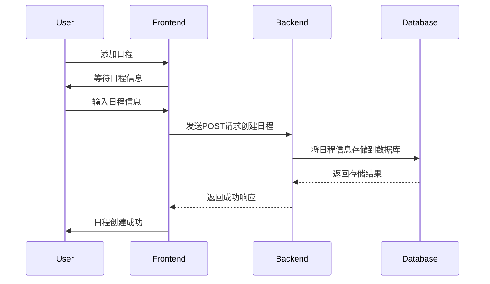

                 

### 引言

在数字时代的浪潮下，时间管理已成为现代生活和工作中的重要课题。随着信息化和智能化的快速发展，人们面临的时间管理挑战也日益增加。信息过载、任务繁多、多任务处理需求等，都使得传统的手动时间管理方法显得力不从心。因此，寻找高效、智能的时间管理工具，已成为现代人的迫切需求。

AI个人助理作为一种新兴的技术工具，正在逐渐改变人们的时间管理方式。通过智能化的算法和自然语言处理技术，AI个人助理能够自动化处理日程安排，优化时间使用，提高工作效率。本文将围绕“数字时代的时间管理：AI个人助理在日程安排中的应用”这一主题，深入探讨AI个人助理在时间管理中的具体应用，旨在为广大读者提供一种全新的时间管理思路和方法。

本文将首先介绍数字时代时间管理的背景和挑战，接着阐述AI个人助理的定义和基本原理，然后详细分析时间管理中的核心概念和方法，探讨AI个人助理在时间管理中的应用和优势，最后通过算法讲解和系统架构设计，提供一套完整的解决方案。希望通过本文的探讨，能够帮助读者更好地理解AI个人助理在时间管理中的应用，从而实现更高效的时间管理。

### 数字时代的时间管理背景

在数字时代，时间管理的复杂性和挑战性显著增加。一方面，信息的爆炸式增长使得人们每天面临大量的任务和信息处理需求，这种信息过载现象使得时间管理变得更加困难。另一方面，现代工作与生活往往要求人们能够同时处理多个任务，多任务处理能力成为一项重要的技能。然而，多任务处理不仅需要高度的时间管理技巧，还要求有高效的注意力分配和集中力，这对个人的时间管理能力提出了更高的要求。

首先，信息过载是数字时代时间管理中的一个主要挑战。随着互联网的普及和智能设备的广泛应用，人们每天都会接收到大量的电子邮件、社交媒体通知、即时消息等，这些信息不仅占据了大量的时间，还容易分散注意力，导致时间碎片化和效率降低。例如，根据一项研究，职场人士每天平均花费约2.5小时处理电子邮件，这无疑大大增加了时间管理的难度。

其次，多任务处理需求也是数字时代时间管理的一个重要方面。现代工作环境和生活方式要求人们能够灵活地切换不同任务，这种多任务处理不仅需要良好的时间规划能力，还需要高效的任务切换技巧。例如，一个职场人士可能需要在短时间内完成会议记录、处理紧急邮件和准备报告等多个任务。多任务处理不仅要求个体具备较强的执行力和自律性，还需要有合理的时间分配策略。

在数字时代，时间管理的挑战不仅来自于信息过载和多任务处理需求，还涉及到现代生活方式和工作模式的变化。远程办公、移动办公和弹性工作制的普及，使得时间管理的空间和方式变得更加灵活。然而，这也意味着个体需要更加自律和高效地管理自己的时间，以确保工作与生活的平衡。例如，根据一项调查，有超过60%的远程办公员工表示，他们感受到时间管理的压力增大，这表明在数字时代，如何有效地管理时间已经成为一个普遍问题。

此外，时间管理的挑战还涉及到个人习惯和态度的问题。在现代快节奏的生活中，许多人习惯了将时间用于即时的娱乐和社交活动，而忽视了长期的时间规划和个人发展。这种短期行为主义的倾向，不仅影响了时间管理的效果，还可能导致生活质量的下降。因此，培养良好的时间管理习惯和态度，成为数字时代时间管理的关键。

总的来说，数字时代的时间管理面临着诸多挑战，包括信息过载、多任务处理需求、现代生活方式和工作模式的变化以及个人习惯和态度的问题。要应对这些挑战，需要寻找高效、智能的时间管理工具和方法，AI个人助理便是其中一种具有巨大潜力的解决方案。在接下来的章节中，我们将进一步探讨AI个人助理的定义、原理和应用，帮助读者理解如何利用这一工具实现更高效的时间管理。

### 问题描述

在数字时代，如何高效管理个人日程、优化时间使用，成为许多人面临的一大难题。传统的手动时间管理方法，如纸笔记录、电子日历等，虽然在一定程度上能够帮助人们规划时间，但随着任务和信息量的不断增加，这些方法显得越来越力不从心。手动管理日程的局限性主要体现在以下几个方面：

首先，手动管理日程在处理大量任务时容易出错。例如，忘记某个会议的时间、错过任务的截止日期等问题，这些错误不仅影响工作效率，还可能导致工作上的延误和损失。其次，手动管理日程无法充分利用现代技术提供的智能化服务。例如，无法根据任务的重要性和紧急程度自动调整日程，无法根据用户的行为习惯和偏好提供个性化的日程安排建议等。此外，手动管理日程缺乏灵活性和适应性，难以应对突发情况或临时变化。

为了解决这些传统方法存在的局限性，AI个人助理作为一种智能化、自动化的日程管理工具，逐渐成为人们的新选择。AI个人助理能够利用先进的人工智能技术，如自然语言处理、机器学习等，自动收集、分析和处理用户日程信息，从而提供高效、智能的日程安排服务。以下是AI个人助理在日程安排中能够实现的几大优势：

第一，AI个人助理能够自动识别和解析用户的日程信息。通过用户输入的日程条目，如会议、约会、任务等，AI个人助理能够快速准确地理解并记录这些信息。例如，用户只需发送一条简单的文本消息，如“明天上午9点有一个会议”，AI个人助理便能自动将其添加到日程中，并设置相应的提醒。

第二，AI个人助理能够根据任务的重要性和紧急程度，自动优化日程安排。通过分析用户的任务数据和习惯，AI个人助理能够为用户制定出最佳的时间安排方案。例如，AI个人助理可以根据用户的日程和任务，自动调整会议的时间，以避免与其他任务发生冲突，从而最大化地利用时间。

第三，AI个人助理能够提供个性化的日程建议。通过学习用户的行为习惯和偏好，AI个人助理能够为用户提供个性化的日程安排建议。例如，如果用户经常在下午2点进行工作总结，AI个人助理会建议将这种习惯纳入日程安排中，以确保用户能够充分利用这段时间进行高效的工作。

第四，AI个人助理能够自动处理日程的修改和删除操作。用户只需通过简单的语音或文本指令，如“删除明天上午的会议”、“将会议时间改为下午3点”，AI个人助理便能自动执行这些操作，无需用户手动调整日程。

综上所述，AI个人助理在日程安排中的应用，不仅能够解决传统手动管理方法的局限性，还能够提供高效、智能的日程管理服务。通过自动化的日程处理和智能化的日程优化，AI个人助理能够大大提高用户的时间管理效率，帮助人们更好地规划和管理个人日程。在接下来的章节中，我们将进一步探讨AI个人助理的具体实现原理和应用场景，以帮助读者更好地理解和利用这一工具。

### 边界与外延

在本研究中，我们主要关注个人层面的时间管理，探讨AI个人助理在日程安排中的应用。这意味着本文的讨论范围主要局限于个人用户如何使用AI个人助理来优化个人日程，而不涉及企业级的时间管理解决方案。尽管AI个人助理在企业级应用中也具有巨大的潜力，但本文将集中探讨其在个人层面的具体实现和应用。

此外，本文的核心概念和框架主要围绕日程安排展开，包括时间管理的基本原则、方法与技巧，以及AI个人助理的基本原理和功能。这些核心概念为理解和应用AI个人助理提供了基础。然而，随着人工智能技术的不断发展，未来的研究可以进一步探索AI个人助理在其他时间管理领域的应用，如任务管理、任务优先级排序等。

在概念结构方面，本文定义了“时间管理”和“AI个人助理”这两个核心概念，并详细分析了它们的主要组成部分和功能。时间管理涉及如何规划、组织、利用时间以实现个人目标，而AI个人助理则是一种利用人工智能技术为用户提供日程管理服务的智能工具。这两个概念之间的联系在于，AI个人助理通过自动化和智能化技术，帮助用户更高效地管理时间，实现个人时间管理的优化。

通过明确本文的边界与外延，以及核心概念的结构，我们为读者提供了一个清晰的研究框架，有助于深入理解AI个人助理在日程安排中的应用，并为未来的研究和实践提供指导。

### 时间管理的基本概念

时间管理是指对个人时间进行有效规划、组织、利用和调控，以实现既定目标的过程。时间管理不仅关注如何分配时间，还涉及如何提高时间的利用效率，减少时间浪费，从而实现个人目标的最大化。在数字时代，高效的时间管理对于提高工作效率、实现工作与生活的平衡具有至关重要的意义。

#### 时间管理的重要性

时间管理的重要性体现在多个方面。首先，它有助于提高个人工作效率。通过合理规划时间，人们能够更好地集中精力处理重要任务，减少因时间浪费而导致的效率低下。其次，时间管理有助于实现工作与生活的平衡。在现代社会，人们面临着巨大的工作压力和生活压力，通过科学的时间管理，可以确保有足够的时间用于休息、娱乐和家庭生活，从而提高生活质量。此外，时间管理还能够帮助人们更好地应对突发事件和变化，提高应对能力和灵活性。

#### 时间管理的挑战

尽管时间管理的重要性不言而喻，但在实际操作中，人们仍面临诸多挑战。首先，信息过载是现代时间管理的一个主要问题。随着互联网和智能设备的普及，人们每天都会接收大量的信息，这些信息不仅占据了大量的时间，还容易分散注意力，导致时间管理变得复杂。其次，多任务处理需求增加，使得人们需要在短时间内高效地处理多个任务，这对时间管理能力提出了更高的要求。此外，个人习惯和态度问题也会影响时间管理的效果。例如，许多人缺乏明确的时间规划意识，或者容易受到外界干扰，导致时间管理失败。

#### 时间管理的核心概念

时间管理的核心概念包括：

1. **优先级原则**：根据任务的重要性和紧急程度进行优先级排序，确保重要且紧急的任务得到优先处理。这有助于提高时间利用效率，避免因处理次要任务而耽误重要事务。

2. **时间块管理**：将时间划分为不同的时间段，用于处理不同类型的任务。例如，将上午时间用于处理重要且复杂的任务，下午时间用于处理相对简单和琐碎的任务。这种分段管理有助于提高时间利用效率，减少任务切换带来的时间浪费。

3. **时间日志法**：记录每天的时间使用情况，通过反思和总结，了解时间的实际使用情况，发现时间浪费的环节，从而进行改进。

4. **番茄工作法**：将工作时间划分为25分钟的工作周期，每个工作周期后休息5分钟。这种方法有助于提高集中力和工作效率，减少因长时间工作导致的疲劳。

5. **待办事项应用**：使用待办事项应用来记录和管理任务，确保任务得到及时处理。这些应用通常具备提醒功能，有助于避免任务遗忘和延误。

#### 时间管理的工具

在数字时代，时间管理工具的种类繁多，以下是一些常用的时间管理工具：

1. **日历应用**：如Google Calendar、Microsoft Outlook等，这些工具能够帮助用户创建、管理和同步日程。

2. **待办事项应用**：如Trello、Asana等，这些工具能够帮助用户记录和管理任务，并提供提醒功能。

3. **时间跟踪工具**：如Toggl、RescueTime等，这些工具能够帮助用户跟踪时间使用情况，了解时间的实际分配情况。

4. **时间管理应用**：如Pomodoro Timer、Forest等，这些工具提供时间管理的方法和技巧，帮助用户提高工作效率。

综上所述，时间管理是数字时代不可或缺的技能，通过合理规划、组织、利用和调控时间，人们能够实现更高的工作效率和生活质量。在接下来的章节中，我们将深入探讨AI个人助理的定义和基本原理，了解如何利用这一智能工具进一步优化时间管理。

### AI个人助理的定义与特点

AI个人助理，也常被称为智能日程管理助手，是一种利用人工智能技术为用户提供个性化日程管理服务的软件系统。它通过整合自然语言处理、机器学习、个性化推荐等先进技术，实现了对用户日程信息的自动收集、分析、管理和优化。

#### 定义

AI个人助理的定义可以概括为：一种基于人工智能技术的日程管理工具，能够自动识别用户的时间和任务信息，通过智能算法为用户生成个性化的日程安排，并提供提醒和通知服务。它不仅能够处理常规的日程安排，还能根据用户的行为和偏好，进行日程的动态调整和优化。

#### 特点

1. **自动化**：AI个人助理通过自动化技术，可以自动处理日程创建、修改和删除等操作，减少用户的手动操作，提高日程管理的效率。

2. **个性化**：AI个人助理能够根据用户的行为和偏好，为用户提供个性化的日程安排建议。例如，如果用户经常在某个时间段进行特定的任务，AI个人助理会自动将其纳入日程安排。

3. **高效化**：AI个人助理通过智能化的算法，能够高效地分析用户的日程信息，优化时间利用，减少任务冲突，提高时间管理的效率。

4. **跨平台**：大多数AI个人助理支持跨平台使用，用户可以在不同的设备上同步和管理自己的日程，确保日程信息的一致性和便捷性。

5. **多任务处理**：AI个人助理能够处理多任务安排，通过智能调度和优先级排序，确保重要任务得到优先处理。

#### 基本组成部分

AI个人助理的核心组成部分主要包括以下几部分：

1. **自然语言处理（NLP）模块**：该模块负责解析用户的自然语言指令，如文本或语音，将其转化为系统可处理的日程信息。例如，用户可以通过语音命令添加会议或任务，NLP模块能够自动识别并记录这些信息。

2. **机器学习算法**：该算法模块负责从用户的历史行为和任务数据中学习，识别用户的行为模式和偏好，为用户生成个性化的日程安排。例如，通过分析用户的日常行为，机器学习算法可以预测用户在未来某个时间段可能会进行的任务，并提前进行日程调整。

3. **个性化推荐系统**：该系统基于用户的兴趣和行为数据，为用户推荐符合其偏好的日程安排和时间管理策略。例如，如果用户经常在某个时间段休息或健身，个性化推荐系统会建议用户将这种习惯纳入日程安排中。

4. **日程优化算法**：该算法模块负责分析用户的日程信息，通过优化算法（如贪心算法、动态规划等）为用户生成最优的日程安排。例如，当用户有多个任务需要同时处理时，日程优化算法会自动调整任务的时间安排，以避免冲突并最大化时间利用。

5. **用户界面**：用户界面负责展示用户的日程信息，并允许用户进行日程的创建、修改、删除等操作。现代AI个人助理的用户界面通常设计得简洁易用，用户可以通过语音、文本或图形界面与系统进行交互。

#### 工作流程

AI个人助理的工作流程大致可以分为以下几个步骤：

1. **数据收集与预处理**：系统会收集用户的日程信息，如会议、约会、任务等，并对这些信息进行预处理，以确保数据的准确性。

2. **任务解析与分类**：系统利用NLP模块解析用户输入的日程信息，将其分类为不同的任务类型，并提取出任务的关键信息，如时间、地点、参与人员等。

3. **日程分析与优化**：系统利用机器学习算法和日程优化算法，分析用户的日程信息，生成最优的日程安排。例如，系统会根据用户的历史行为数据，为用户推荐最佳的时间安排和任务顺序。

4. **提醒与通知**：系统会根据用户设置的提醒规则，向用户发送日程提醒和通知。例如，用户可以在会议开始前一小时收到提醒，确保不会错过重要会议。

5. **用户反馈与调整**：系统会根据用户的反馈，对日程安排进行动态调整。例如，如果用户频繁取消或修改日程，系统会自动调整日程安排，以适应用户的需求。

通过以上步骤，AI个人助理能够为用户提供高效、智能的日程管理服务，帮助用户更好地规划和管理个人时间，提高工作效率和生活质量。

### AI个人助理的核心组成部分

AI个人助理作为一种高效的日程管理工具，其核心组成部分包括自然语言处理（NLP）技术、机器学习算法和个性化推荐系统。这些组成部分共同作用，为用户提供智能化、自动化的日程管理服务。

#### 自然语言处理（NLP）技术

自然语言处理（NLP）技术是AI个人助理的重要组成部分，负责解析用户输入的自然语言指令，并将其转化为系统能够理解的数据。NLP技术主要包括以下几个关键模块：

1. **文本解析模块**：该模块负责对用户输入的文本信息进行语法分析和语义分析，提取出文本中的关键信息。例如，当用户输入“明天下午2点有一个会议”时，文本解析模块会识别出关键信息，如时间、地点和会议主题。

2. **语音识别模块**：语音识别模块用于将用户的语音指令转化为文本形式。通过先进的语音识别算法，系统能够准确识别用户的声音，并将语音转化为可操作的文本指令。

3. **意图识别模块**：意图识别模块负责理解用户的指令意图。例如，当用户说“设置一个提醒”时，意图识别模块会判断用户需要的是日程提醒、闹钟提醒还是其他类型的提醒。

4. **实体识别模块**：实体识别模块用于识别文本中的实体信息，如人名、地点、时间等。这些实体信息对于后续的任务处理和日程安排至关重要。

#### 机器学习算法

机器学习算法在AI个人助理中起着核心作用，负责从用户的历史行为数据中学习，为用户生成个性化的日程安排。以下是几种常用的机器学习算法：

1. **监督学习算法**：监督学习算法通过已标记的数据集进行训练，学会从输入特征中预测输出结果。例如，通过用户的历史日程数据，监督学习算法可以学会预测用户未来的日程安排。

2. **无监督学习算法**：无监督学习算法在没有任何标记数据的情况下，从用户的行为数据中发掘模式和规律。例如，通过聚类算法，系统可以发现用户在特定时间段内常见的活动模式，并据此生成个性化的日程安排。

3. **强化学习算法**：强化学习算法通过不断尝试和反馈，学会在复杂环境中做出最优决策。例如，通过强化学习，AI个人助理可以学会在任务冲突时，自动调整日程安排，以最大化时间利用效率。

4. **决策树和随机森林算法**：决策树和随机森林算法通过构建决策树模型，将用户的特征数据划分为不同的类别，从而预测用户的日程安排。这些算法在处理多任务、多约束的日程安排问题时表现尤为出色。

#### 个性化推荐系统

个性化推荐系统是AI个人助理的重要组成部分，通过分析用户的历史行为和偏好，为用户推荐符合其需求的日程安排。个性化推荐系统通常包括以下几个关键步骤：

1. **用户行为数据收集**：系统会持续收集用户的行为数据，如日程安排、任务执行情况、喜好等。这些数据为个性化推荐提供了重要依据。

2. **用户特征提取**：系统会根据用户的行为数据，提取出用户的特征信息，如时间偏好、任务类型偏好、活动频率等。这些特征信息用于构建用户的个性化画像。

3. **推荐算法**：推荐算法根据用户的特征信息和历史行为数据，为用户生成个性化的日程推荐。常见的推荐算法包括协同过滤算法、矩阵分解、基于内容的推荐等。

4. **推荐结果评估**：系统会评估推荐结果的准确性、相关性和实用性，并根据用户反馈进行持续优化。例如，如果用户频繁取消推荐的任务，系统会调整推荐策略，避免重复推荐不合适的内容。

通过自然语言处理技术、机器学习算法和个性化推荐系统的协同作用，AI个人助理能够为用户提供高效、智能的日程管理服务，帮助用户更好地规划和管理个人时间，提高工作效率和生活质量。

### AI个人助理的工作流程

AI个人助理在日程管理中的工作流程可以概括为以下几个关键步骤：数据收集与预处理、日程分析、日程推荐与调整、提醒与通知，以及用户反馈与动态调整。以下将详细阐述每个步骤及其具体实现。

#### 数据收集与预处理

第一步是数据收集与预处理。AI个人助理需要从多个来源收集用户的时间信息和任务数据。这些数据来源包括用户的设备传感器（如手机、手表等）、日历应用、任务管理工具，以及用户主动输入的信息。例如，用户可以通过语音或文本命令输入会议、约会和任务等日程信息。

在数据收集后，AI个人助理会对这些数据进行预处理，以确保数据的准确性和一致性。预处理步骤包括：

1. **数据清洗**：去除重复的、无效的或者格式不正确的数据。
2. **数据格式转换**：将不同来源的数据格式统一，如将不同日期表示方式（如YYYY-MM-DD和MM/DD/YYYY）转换为统一的格式。
3. **数据标准化**：对数据中的常见变量进行标准化处理，如将时间段转换为统一的时间单位（如分钟）。

#### 日程分析

在完成数据预处理后，AI个人助理进入日程分析阶段。这一阶段的目标是理解用户的日程模式，识别出用户的习惯和时间偏好。具体步骤如下：

1. **日程模式识别**：通过分析用户的日程历史数据，识别出用户常见的日程模式。例如，用户每天早上9点开始工作，下午3点休息，晚上8点进行健身等。
2. **时间偏好分析**：根据用户的日程数据，分析用户在不同时间段的活动偏好。例如，用户可能倾向于在上午处理重要会议，在下午处理文档工作，晚上则安排休闲活动。
3. **任务分类**：对用户的任务进行分类，如工作、个人事务、娱乐等。这一步有助于后续的日程优化和个性化推荐。

#### 日程推荐与调整

在分析用户日程后，AI个人助理进入日程推荐与调整阶段。这一阶段的核心任务是根据用户的时间偏好和任务安排，生成最优的日程推荐，并动态调整日程安排以避免冲突和最大化时间利用。

1. **日程生成**：基于用户的日程模式和任务分类，AI个人助理会生成初步的日程安排。例如，如果用户在上午有一个重要的会议，系统会自动将后续的轻量级任务安排在会议后。
2. **日程优化**：通过智能化的优化算法（如贪心算法、动态规划等），AI个人助理会进一步优化日程安排，确保任务之间的时间间隔合理，避免冲突。例如，如果用户有两个连续的重要会议，系统会自动调整任务时间，以确保用户有足够的休息时间。
3. **个性化调整**：AI个人助理会根据用户的行为数据和个性化偏好，进行日程的个性化调整。例如，如果用户喜欢在周末进行户外运动，系统会在周末自动安排运动活动。

#### 提醒与通知

在生成和优化日程后，AI个人助理会进入提醒与通知阶段。这一阶段的核心任务是确保用户不会错过重要的日程事件。

1. **提醒设置**：根据用户的日程安排，AI个人助理会自动设置提醒。例如，如果用户有一个下午3点的会议，系统会在会议开始前1小时发送提醒通知。
2. **通知渠道**：AI个人助理可以通过多种渠道发送通知，如短信、电子邮件、推送通知等，确保用户能够及时收到提醒。
3. **多设备同步**：AI个人助理支持多设备同步，用户可以在不同的设备上接收提醒通知，确保日程的一致性和便捷性。

#### 用户反馈与动态调整

最后，AI个人助理会根据用户的反馈，对日程安排进行动态调整。这一步骤有助于系统不断优化，以更好地满足用户的需求。

1. **用户反馈收集**：AI个人助理会持续收集用户的反馈信息，如日程调整请求、任务完成情况等。
2. **反馈分析**：系统会分析用户的反馈，了解用户对当前日程安排的满意度以及存在的问题。
3. **动态调整**：根据用户的反馈和需求，AI个人助理会动态调整日程安排。例如，如果用户频繁取消某个时间段的任务，系统会自动调整任务安排，以适应用户的需求。

通过以上几个步骤，AI个人助理能够为用户提供高效、智能的日程管理服务，帮助用户更好地规划和管理个人时间，提高工作效率和生活质量。

### 时间管理中的核心概念

在探讨AI个人助理在日程安排中的应用之前，有必要深入理解时间管理中的核心概念和方法。这些概念不仅有助于我们更好地理解AI个人助理的功能和优势，还能帮助我们评估其在实际应用中的效果。

#### 优先级原则

优先级原则是时间管理中的重要原则，它强调根据任务的重要性和紧急程度进行任务排序，以确保时间和精力被合理分配。具体而言，优先级原则可以分为以下几个方面：

1. **紧急性**：紧急任务通常需要立即处理，以避免造成进一步的损失或影响。
2. **重要性**：重要任务通常对目标的实现具有关键作用，如关键会议、重要项目等。
3. **优先级排序**：将任务按照紧急性和重要性进行排序，优先处理那些紧急且重要的任务。例如，如果用户同时收到一份紧急报告和一个不紧急的邮件，应优先处理报告。

#### 时间块管理

时间块管理是一种将时间划分为不同时间段，用于处理不同类型任务的方法。通过这种方法，用户可以更加高效地利用时间，减少任务切换带来的时间浪费。时间块管理通常包括以下几个步骤：

1. **任务分类**：根据任务的重要性和性质，将任务分为不同的类别，如紧急且重要、紧急但不重要、不紧急但重要、不紧急且不重要。
2. **时间块划分**：将一天的时间划分为不同的时间段，每个时间段专注于处理一类任务。例如，将上午用于处理紧急且重要的任务，下午用于处理重要但不紧急的任务，晚上则可以安排一些轻松的任务或休息。
3. **灵活调整**：根据实际情况和任务的紧急程度，灵活调整时间块。例如，如果某个重要任务需要更多时间，可以适当调整后续时间块的时间。

#### 时间日志法

时间日志法是一种通过记录每天的时间使用情况，分析时间分配效果，从而优化时间管理的方法。具体步骤如下：

1. **记录时间使用**：每天记录自己的时间使用情况，包括工作、学习、休闲、会议等。
2. **分析时间分配**：通过时间日志分析，了解时间分配的合理性和效率，识别出时间浪费的环节。
3. **优化时间管理**：根据时间日志的分析结果，优化时间管理策略，如调整任务顺序、减少不必要的活动等。

#### 番茄工作法

番茄工作法是一种时间管理技巧，通过将工作时间划分为短暂的25分钟工作周期，每个周期后休息5分钟，以保持高效的工作状态。具体步骤如下：

1. **设定工作周期**：将工作时间划分为25分钟的工作周期，每个周期专注于处理一项任务。
2. **休息与调整**：在每个工作周期结束后，休息5分钟，以缓解疲劳，恢复精力。
3. **记录与反思**：记录每个工作周期的完成情况，进行反思和总结，了解自己的工作节奏和效率。

#### 待办事项应用

待办事项应用是一种用于记录和管理任务的工具，可以帮助用户确保任务得到及时处理。常见的待办事项应用包括：

1. **任务创建**：用户可以创建新的任务，并设置任务的截止日期和优先级。
2. **任务跟踪**：用户可以查看任务的完成进度，确保任务按计划进行。
3. **提醒功能**：应用会根据任务的截止日期和优先级，为用户提供提醒，避免任务延误。
4. **同步与共享**：用户可以在不同的设备上同步任务数据，与他人共享任务列表，提高协作效率。

通过理解和应用这些时间管理中的核心概念和方法，用户可以更好地利用AI个人助理进行日程管理。AI个人助理能够自动化处理这些概念和方法，为用户提供个性化的日程安排和建议，从而提高时间管理的效率和效果。在接下来的章节中，我们将进一步探讨AI个人助理在日程安排中的实际应用，帮助读者了解如何利用这一工具实现高效的时间管理。

### AI个人助理的工作原理

AI个人助理在日程管理中的工作原理涉及多个关键技术模块，包括自然语言处理（NLP）、机器学习算法和个性化推荐系统。这些模块协同工作，为用户提供智能化、个性化的日程管理服务。

#### 自然语言处理（NLP）模块

自然语言处理（NLP）是AI个人助理的核心模块之一，主要负责处理用户输入的自然语言指令。NLP技术包括文本解析、语音识别、意图识别和实体识别等关键步骤。

1. **文本解析**：文本解析模块负责将用户输入的文本信息进行分析，提取出关键信息。例如，当用户输入“明天下午3点有一个会议”时，文本解析模块会识别出“明天”、“下午3点”和“会议”等信息。
   
2. **语音识别**：语音识别模块将用户的语音指令转换为文本形式。通过先进的语音识别算法，系统能够准确地将用户的语音转化为可操作的文本指令。

3. **意图识别**：意图识别模块负责理解用户的指令意图。例如，当用户输入“设置一个提醒”时，意图识别模块会判断用户需要的是日程提醒、闹钟提醒还是其他类型的提醒。

4. **实体识别**：实体识别模块用于识别文本中的实体信息，如人名、地点、时间等。这些实体信息对于后续的任务处理和日程安排至关重要。

#### 机器学习算法

机器学习算法在AI个人助理中起着关键作用，负责从用户的历史行为数据中学习，为用户生成个性化的日程安排。以下是几种常用的机器学习算法：

1. **监督学习算法**：监督学习算法通过已标记的数据集进行训练，学会从输入特征中预测输出结果。例如，通过用户的历史日程数据，监督学习算法可以学会预测用户未来的日程安排。

2. **无监督学习算法**：无监督学习算法在没有任何标记数据的情况下，从用户的行为数据中发掘模式和规律。例如，通过聚类算法，系统可以发现用户在特定时间段内常见的活动模式，并据此生成个性化的日程安排。

3. **强化学习算法**：强化学习算法通过不断尝试和反馈，学会在复杂环境中做出最优决策。例如，通过强化学习，AI个人助理可以学会在任务冲突时，自动调整日程安排，以最大化时间利用效率。

4. **决策树和随机森林算法**：决策树和随机森林算法通过构建决策树模型，将用户的特征数据划分为不同的类别，从而预测用户的日程安排。这些算法在处理多任务、多约束的日程安排问题时表现尤为出色。

#### 个性化推荐系统

个性化推荐系统是AI个人助理的重要组成部分，通过分析用户的历史行为和偏好，为用户推荐符合其需求的日程安排。个性化推荐系统通常包括以下几个关键步骤：

1. **用户行为数据收集**：系统会持续收集用户的行为数据，如日程安排、任务执行情况、喜好等。这些数据为个性化推荐提供了重要依据。

2. **用户特征提取**：系统会根据用户的行为数据，提取出用户的特征信息，如时间偏好、任务类型偏好、活动频率等。这些特征信息用于构建用户的个性化画像。

3. **推荐算法**：推荐算法根据用户的特征信息和历史行为数据，为用户生成个性化的日程推荐。常见的推荐算法包括协同过滤算法、矩阵分解、基于内容的推荐等。

4. **推荐结果评估**：系统会评估推荐结果的准确性、相关性和实用性，并根据用户反馈进行持续优化。例如，如果用户频繁取消推荐的任务，系统会调整推荐策略，避免重复推荐不合适的内容。

#### 具体应用流程

AI个人助理的具体工作流程可以分为以下几个步骤：

1. **数据收集与预处理**：AI个人助理会从多个来源收集用户的时间信息和任务数据，并进行预处理，以确保数据的准确性和一致性。

2. **任务解析与分类**：系统利用NLP模块解析用户输入的日程信息，将其分类为不同的任务类型，并提取出任务的关键信息。

3. **日程分析**：系统利用机器学习算法和用户行为数据，分析用户的日程模式和时间偏好，为用户生成初步的日程安排。

4. **日程优化**：通过智能化的优化算法，系统会进一步优化日程安排，确保任务之间的时间间隔合理，避免冲突，并最大化时间利用效率。

5. **提醒与通知**：系统会根据用户设置的提醒规则，为用户发送日程提醒和通知，确保用户不会错过重要的日程事件。

6. **用户反馈与动态调整**：系统会根据用户的反馈和需求，对日程安排进行动态调整，以确保日程安排能够持续满足用户的需求。

通过自然语言处理技术、机器学习算法和个性化推荐系统的协同作用，AI个人助理能够为用户提供高效、智能的日程管理服务，帮助用户更好地规划和管理个人时间，提高工作效率和生活质量。

### AI个人助理的主要功能

AI个人助理在日程安排中扮演着至关重要的角色，其功能不仅涵盖了日常日程的创建、修改和删除，还扩展到了任务管理和提醒通知等关键领域。以下将详细阐述AI个人助理的主要功能，并探讨其在实际应用中的具体操作和使用方法。

#### 日程创建

日程创建是AI个人助理最基础的功能之一。用户可以通过多种方式创建新的日程条目，如通过语音命令、文本输入或图形界面。以下是几种常见的创建方式：

1. **语音命令**：用户可以对AI个人助理说出日程条目的信息，如“明天上午10点有一个会议”。AI个人助理会解析语音指令，将日程信息添加到日程中，并设置相应的提醒。
   
2. **文本输入**：用户可以在应用中的文本输入框中手动输入日程条目的详细信息，如日期、时间、地点和主题。AI个人助理会根据输入的信息，自动创建日程条目。

3. **图形界面**：用户可以通过图形界面拖拽和编辑日程条目，如使用日历视图或列表视图，直观地添加和修改日程。

#### 日程修改

在日程安排中，任务和时间的变化是不可避免的。AI个人助理提供了灵活的日程修改功能，用户可以轻松地调整日程条目的时间、地点和参与人员等信息。以下是几种常见的修改方式：

1. **语音修改**：用户可以通过语音命令对现有的日程条目进行修改，如“将会议时间改为明天下午2点”。AI个人助理会根据语音指令，自动更新日程条目的时间。

2. **文本修改**：用户可以在应用中的文本输入框中，直接编辑现有的日程条目信息。例如，用户可以在文本框中输入新的时间、地点或参与人员，AI个人助理会自动更新日程。

3. **图形界面修改**：用户可以通过图形界面，直接拖拽和编辑日程条目的时间、地点和参与人员等信息。

#### 日程删除

当某个日程条目不再需要时，用户可以使用AI个人助理进行删除操作。以下是几种常见的删除方式：

1. **语音删除**：用户可以通过语音命令删除不再需要的日程条目，如“删除明天上午的会议”。AI个人助理会根据语音指令，从日程中删除相应的条目。

2. **文本删除**：用户可以在应用中的文本输入框中，输入删除指令，如“删除明天上午的会议”。AI个人助理会根据输入的信息，自动删除相应的日程条目。

3. **图形界面删除**：用户可以通过图形界面，直接点击或长按日程条目，选择删除选项，从而快速删除不需要的日程。

#### 任务管理

AI个人助理不仅能够管理日程，还能帮助用户进行任务管理。用户可以创建、修改和跟踪任务，确保任务得到及时处理。以下是几种常见的任务管理功能：

1. **任务创建**：用户可以通过语音命令或文本输入创建新的任务，如“完成报告”。AI个人助理会自动创建任务，并设置相应的截止日期和提醒。

2. **任务修改**：用户可以修改已有的任务信息，如调整任务的截止日期、优先级或描述。通过语音命令或文本输入，用户可以轻松地更新任务信息。

3. **任务跟踪**：AI个人助理会实时跟踪任务的完成情况，并在任务完成后自动标记为已完成。用户可以查看任务的完成进度，确保任务按计划进行。

#### 提醒与通知

提醒与通知是AI个人助理的重要功能之一，确保用户不会错过重要的日程事件和任务。以下是几种常见的提醒方式：

1. **时间提醒**：AI个人助理会在日程事件开始前一段时间（如1小时或2小时）发送提醒通知，确保用户提前做好准备。

2. **任务提醒**：AI个人助理会在任务截止日期前发送提醒通知，提醒用户完成任务。

3. **多渠道通知**：AI个人助理可以通过多种渠道发送提醒通知，如短信、电子邮件、推送通知等，确保用户能够及时收到提醒。

#### 实际应用操作

以下是AI个人助理在实际应用中的操作示例：

1. **创建日程**：用户可以通过语音命令“明天上午10点有一个会议”创建日程，AI个人助理会自动添加会议到日程中，并设置提醒。

2. **修改日程**：用户可以通过语音命令“将会议时间改为明天下午2点”修改日程，AI个人助理会自动更新会议的时间。

3. **删除日程**：用户可以通过语音命令“删除明天上午的会议”删除日程，AI个人助理会从日程中删除相应的会议条目。

4. **创建任务**：用户可以通过语音命令“完成报告”创建任务，AI个人助理会自动创建任务，并设置截止日期和提醒。

5. **修改任务**：用户可以通过语音命令“将报告截止日期延后一天”修改任务，AI个人助理会自动更新任务的截止日期。

6. **删除任务**：用户可以通过语音命令“删除完成报告的任务”删除任务，AI个人助理会从任务列表中删除相应的任务条目。

7. **提醒通知**：AI个人助理会在会议开始前1小时发送提醒通知，确保用户不会错过会议。同样，任务截止日期前，AI个人助理会发送提醒通知，确保用户及时完成任务。

通过这些实际应用操作，AI个人助理能够高效、智能地管理用户的日程和任务，帮助用户更好地规划和管理时间，提高工作效率和生活质量。

### AI个人助理的优势与挑战

AI个人助理在日程管理中的应用带来了显著的优势，但同时也面临一些挑战。以下将详细分析AI个人助理的优势和挑战，并探讨如何克服这些挑战，以实现更高效的时间管理。

#### 优势

1. **自动化处理**：AI个人助理能够自动化处理日程创建、修改和删除等操作，减少用户的手动操作，提高日程管理的效率。例如，用户只需通过简单的语音或文本指令，如“明天上午9点有一个会议”，AI个人助理便能自动将其添加到日程中，并设置相应的提醒。

2. **个性化推荐**：通过机器学习和个性化推荐系统，AI个人助理能够根据用户的历史行为和偏好，生成个性化的日程安排。例如，如果用户经常在某个时间段进行特定的任务，AI个人助理会自动将其纳入日程安排，从而提高日程的适配度和实用性。

3. **提高效率**：AI个人助理能够通过智能化的算法和优化策略，最大化地利用用户的时间。例如，系统会自动识别和解决日程中的冲突，确保任务安排更加合理，从而提高整体的工作效率。

4. **跨平台同步**：大多数AI个人助理支持跨平台使用，用户可以在不同的设备上同步和管理自己的日程，确保日程信息的一致性和便捷性。这意味着用户无论在哪里，都能随时查看和管理自己的日程。

5. **实时提醒**：AI个人助理能够根据用户设置的提醒规则，实时发送提醒通知，确保用户不会错过重要的日程事件和任务。例如，系统会在会议开始前一小时发送提醒通知，帮助用户提前做好准备。

#### 挑战

1. **数据隐私和安全**：AI个人助理需要收集和分析用户的大量个人日程数据，这涉及到数据隐私和安全问题。如果数据保护措施不到位，可能会导致用户的个人信息泄露。

2. **技术依赖性**：AI个人助理依赖于先进的人工智能技术和算法，一旦技术出现问题或升级，可能会影响系统的稳定性和功能。

3. **用户体验**：尽管AI个人助理能够提供智能化的日程管理服务，但用户体验可能因个体差异而有所不同。例如，某些用户可能不适应使用语音命令，或者觉得界面设计不够直观。

4. **适应性挑战**：AI个人助理需要不断学习和适应用户的行为和偏好，但这一过程可能需要较长时间，且存在一定的误差。例如，系统可能无法立即理解用户的某些特殊需求或习惯。

#### 应对策略

1. **加强数据隐私保护**：为了应对数据隐私和安全挑战，AI个人助理需要采用严格的数据保护措施，如加密存储、访问控制等，确保用户的日程数据安全。

2. **持续技术升级**：为了保持系统的稳定性和功能，开发者需要持续更新和优化AI个人助理的技术和算法，确保系统能够适应新的技术趋势和用户需求。

3. **优化用户体验**：开发者可以通过用户反馈和数据分析，不断优化AI个人助理的界面设计和功能，确保系统能够满足不同用户的个性化需求。

4. **增强适应性**：AI个人助理可以通过引入更多的用户行为数据和分析技术，提高对用户行为和偏好的理解能力，从而更好地适应用户的需求。

通过分析AI个人助理的优势和挑战，并采取相应的应对策略，我们能够更好地利用这一工具实现高效的时间管理，从而提高工作效率和生活质量。

### 日程安排算法原理

在AI个人助理的日程安排中，算法起着至关重要的作用。以下将详细讲解日程安排算法的原理，包括常见的算法类型、具体实现方法及其优缺点。

#### 算法类型

常见的日程安排算法主要包括贪心算法和动态规划算法。这些算法通过不同的策略，实现了对日程安排的优化。

1. **贪心算法**：贪心算法通过每次选择最优的局部决策，逐步构建全局最优解。在日程安排中，贪心算法常用于任务优先级排序和时间分配。

2. **动态规划算法**：动态规划算法通过将复杂问题分解为多个子问题，并存储子问题的解，避免了重复计算，从而提高了算法的效率。动态规划算法常用于多任务安排和优化。

#### 贪心算法

**原理**：贪心算法的核心思想是在每一步选择当前状态下最优的决策，以期最终得到全局最优解。在日程安排中，贪心算法通常用于任务优先级排序，例如，按照任务开始时间或优先级进行排序。

**实现方法**：假设用户有一系列任务，每个任务有一个开始时间和结束时间。贪心算法可以按照以下步骤进行：

1. 将任务按照开始时间排序。
2. 依次处理每个任务，如果当前任务的时间范围与已安排的任务不冲突，则将其添加到日程中。
3. 重复步骤2，直到日程安排满为止。

**优缺点**：

- **优点**：实现简单，效率较高，适用于任务数量较少且时间约束不严格的情况。
- **缺点**：可能无法找到全局最优解，对任务冲突的处理能力较弱。

#### 动态规划算法

**原理**：动态规划算法通过将问题分解为多个子问题，并存储子问题的解，避免了重复计算。在日程安排中，动态规划算法常用于多任务安排和优化，例如，在给定的任务和时间约束下，寻找最优的日程安排。

**实现方法**：以最长公共子串问题为例，动态规划算法可以按照以下步骤进行：

1. 将任务和时间约束表示为一个二维数组。
2. 定义一个三维数组`dp`，用于存储子问题的解，其中`dp[i][j][k]`表示从任务i到任务j在时间k内的最优安排。
3. 根据状态转移方程，计算`dp`数组中每个元素的值。
4. 根据`dp`数组的最后结果，回溯出最优的日程安排。

**优缺点**：

- **优点**：能够找到全局最优解，适用于任务数量较多且时间约束严格的情况。
- **缺点**：实现复杂，计算量较大，对计算机性能要求较高。

#### 算法比较

| 算法类型 | 优点 | 缺点 |
| --- | --- | --- |
| 贪心算法 | 实现简单，效率高 | 可能无法找到全局最优解，冲突处理能力弱 |
| 动态规划算法 | 能够找到全局最优解 | 实现复杂，计算量大 |

#### 算法应用实例

假设用户需要在一天内完成以下任务，并希望找到最优的日程安排：

| 任务 | 开始时间 | 结束时间 |
| --- | --- | --- |
| 任务1 | 9:00 | 10:00 |
| 任务2 | 10:30 | 11:30 |
| 任务3 | 13:00 | 14:00 |
| 任务4 | 14:30 | 15:30 |

**解决方案**：

1. **贪心算法**：将任务按照开始时间排序，依次添加到日程中，确保每个任务之间有足够的时间间隔。例如，最优的日程安排为：任务1（9:00-10:00）、任务2（10:30-11:30）、任务3（13:00-14:00）、任务4（14:30-15:30）。

2. **动态规划算法**：定义一个三维数组`dp`，用于存储从任务i到任务j在时间k内的最优安排。通过状态转移方程计算最优解，并回溯出最优的日程安排。例如，最优的日程安排与贪心算法相同：任务1（9:00-10:00）、任务2（10:30-11:30）、任务3（13:00-14:00）、任务4（14:30-15:30）。

通过以上算法原理和应用实例，我们能够更好地理解AI个人助理在日程安排中的工作原理。在实际应用中，开发者可以根据具体需求和场景选择合适的算法，实现高效、智能的日程管理。

### 机器学习算法在时间管理中的应用

机器学习算法在时间管理中的应用，为日程安排提供了更加智能化和个性化的解决方案。通过分析用户的历史行为数据和偏好，机器学习算法能够生成最优的日程安排，并动态调整日程以适应变化。以下是机器学习算法在时间管理中应用的基本原理、具体方法和挑战。

#### 基本原理

机器学习算法通过以下步骤实现时间管理的优化：

1. **数据收集**：收集用户的时间使用记录、任务执行情况、行为偏好等数据。
2. **数据预处理**：清洗和转换数据，使其适合机器学习模型。
3. **特征提取**：从原始数据中提取特征，用于训练机器学习模型。
4. **模型训练**：使用训练数据训练机器学习模型，使其能够预测用户的行为和偏好。
5. **模型评估**：评估模型的性能，确保其能够准确预测和优化日程安排。
6. **模型部署**：将训练好的模型部署到实际应用中，为用户提供个性化的日程安排建议。

#### 具体方法

1. **用户行为分析**：通过分析用户的历史日程数据，机器学习算法可以识别出用户的时间偏好和行为模式。例如，系统可以发现用户在早上9点至11点之间通常有较高的工作效率，因此可以建议用户在这个时间段安排重要的任务。

2. **任务优先级排序**：基于用户的任务重要性和紧急程度，机器学习算法可以自动为任务排序。通过使用优先级排序算法，如决策树、支持向量机等，系统可以为用户生成优先级明确的任务列表，确保重要任务优先处理。

3. **日程优化**：机器学习算法可以通过优化算法，如贪心算法、动态规划等，为用户提供最优的日程安排。例如，系统可以自动调整任务的时间，以避免冲突和最大化时间利用。

4. **个性化推荐**：基于用户的偏好和历史行为数据，机器学习算法可以生成个性化的日程推荐。通过协同过滤、矩阵分解等推荐算法，系统可以为用户推荐最合适的日程安排，提高用户的满意度。

#### 挑战与优化

1. **数据质量和隐私**：高质量的数据是机器学习算法有效运行的基础。然而，数据质量可能受到噪声、缺失值和异常值的影响。此外，用户隐私保护也是一大挑战，系统需要确保用户数据的安全和隐私。

2. **算法解释性**：机器学习算法的黑箱性质使得其预测结果难以解释。为了增强算法的可解释性，研究者们尝试引入可解释的人工智能技术，如决策树、LIME等。

3. **实时性和可扩展性**：机器学习算法需要实时处理用户数据，并在短时间内生成优化结果。此外，随着用户数量和任务量的增加，算法的可扩展性也成为重要考量。为了应对这些挑战，研究者们正在探索分布式计算和云计算等解决方案。

#### 应用实例

1. **智能日程管理应用**：例如，Google Calendar 和 Microsoft Outlook 都内置了机器学习算法，用于智能推荐日程安排。这些应用可以通过分析用户的行为数据，自动调整会议时间，避免冲突，并提供个性化的提醒和建议。

2. **工作负载管理**：在IT行业中，机器学习算法可以用于优化工作负载管理。例如，通过分析开发人员的工作时间、任务类型和优先级，系统可以为每个开发者生成最优的工作安排，提高团队的整体工作效率。

3. **个人健身计划**：在健康领域，机器学习算法可以用于生成个性化的健身计划。通过分析用户的健身记录、体重和健康状况，系统可以为用户推荐最适合的锻炼方式和饮食计划，提高健身效果。

通过深入应用机器学习算法，时间管理不再局限于传统的手动方法，而是变得更加智能化和个性化。这不仅提高了用户的时间利用效率，还带来了更加便捷和高效的生活方式。

### 系统功能设计

为了实现AI个人助理的高效日程管理，系统功能设计至关重要。以下将详细讨论功能需求分析、功能实现以及前端界面和后端服务的设计。

#### 功能需求分析

在功能需求分析阶段，需要明确用户需求和系统功能，以确保系统能够满足用户的需求。以下是几个关键的功能需求：

1. **日程创建**：用户可以创建新的日程条目，包括会议、约会、任务等。日程条目应包含基本信息，如日期、时间、地点、主题和参与人员等。

2. **日程修改**：用户可以修改已有的日程条目，如调整时间、地点、参与人员等。修改操作应实时更新，确保日程信息的一致性。

3. **日程删除**：用户可以删除不再需要的日程条目，确保日程的实时性和准确性。

4. **任务管理**：用户可以创建、修改和跟踪任务，确保任务得到及时处理。任务应包含基本信息，如名称、描述、截止日期和优先级等。

5. **提醒与通知**：系统应提供提醒功能，在日程事件或任务截止日期前向用户发送通知。通知可以通过多种渠道发送，如电子邮件、短信和推送通知等。

6. **多设备同步**：系统应支持多设备同步，用户可以在不同设备上查看和管理日程信息。

7. **用户个性化设置**：系统应允许用户设置个性化的日程偏好，如时间偏好、任务类型偏好等，以便为用户提供更个性化的日程安排。

#### 功能实现

在功能实现阶段，需要设计具体的模块和接口，以实现上述功能需求。以下是几个关键模块和接口的设计：

1. **日程模块**：负责日程的创建、修改和删除操作。该模块应提供API接口，允许前端界面和后端服务进行数据交互。

2. **任务模块**：负责任务的管理，包括创建、修改和跟踪任务。该模块应与日程模块紧密集成，确保任务和日程信息的一致性。

3. **提醒模块**：负责发送提醒通知，包括电子邮件、短信和推送通知等。该模块应支持多种通知渠道，并根据用户设置的提醒规则进行通知。

4. **用户设置模块**：负责用户个性化设置的管理，包括时间偏好、任务类型偏好等。该模块应提供API接口，允许用户进行设置修改。

5. **多设备同步模块**：负责处理多设备间的数据同步，确保用户在不同设备上查看和管理日程信息的一致性。该模块应支持云存储和实时同步技术。

#### 前端界面设计

前端界面设计是用户与系统交互的桥梁，需要简洁、直观且易于操作。以下是前端界面设计的关键要素：

1. **日程视图**：提供日历视图、列表视图和地图视图，用户可以轻松查看和管理日程信息。

2. **任务视图**：提供任务列表和详情视图，用户可以查看任务的详细信息并进行管理。

3. **设置视图**：提供用户设置界面，用户可以设置个性化日程偏好和通知规则。

4. **交互设计**：采用响应式设计，确保界面在不同设备和屏幕尺寸上都能良好显示。使用清晰的图标和标签，确保用户能够快速找到所需功能。

#### 后端服务设计

后端服务是系统的核心，需要提供稳定、高效的服务。以下是后端服务设计的关键要素：

1. **数据存储**：采用关系型数据库（如MySQL）或NoSQL数据库（如MongoDB），存储用户日程和任务数据。数据库设计应考虑数据的一致性和扩展性。

2. **API接口**：提供RESTful API接口，允许前端界面和移动应用进行数据交互。API设计应遵循RESTful原则，确保接口的简洁和易用性。

3. **服务架构**：采用微服务架构，将不同功能模块拆分为独立的微服务，以提高系统的可扩展性和可维护性。常见的微服务包括日程服务、任务服务、提醒服务等。

4. **安全与隐私**：确保用户数据的安全和隐私，采用HTTPS协议传输数据，并对用户数据进行加密存储。同时，应实施严格的访问控制和身份验证机制。

通过上述系统功能设计和实现，AI个人助理能够提供高效、智能的日程管理服务，帮助用户更好地规划和管理个人时间。

### 系统架构设计

系统架构设计是确保AI个人助理高效、稳定运行的关键。以下将详细描述系统架构设计原则、系统架构以及系统接口设计。

#### 架构设计原则

1. **模块化**：将系统划分为多个功能模块，如日程模块、任务模块、提醒模块等，每个模块独立实现，便于开发、测试和维护。

2. **可扩展性**：设计系统时考虑未来的功能扩展和用户增长，确保系统能够灵活扩展，支持更多的用户和数据量。

3. **高可用性**：通过冗余设计和故障转移机制，确保系统在面临高并发和故障时依然能够正常运行。

4. **安全性**：采用先进的安全技术和协议，保护用户数据安全，防止数据泄露和未经授权的访问。

5. **可维护性**：系统架构应便于维护和升级，确保系统能够持续运行并适应技术变化。

#### 系统架构

系统架构采用微服务架构，将不同功能模块拆分为独立的微服务，以提高系统的可扩展性和可维护性。以下是系统架构的主要组成部分：

1. **前端**：前端负责用户界面和交互逻辑，主要包括Web客户端和移动客户端。前端通过RESTful API与后端微服务进行数据交互。

2. **后端**：后端是系统的核心，包括多个微服务，如日程服务、任务服务、提醒服务等。每个微服务独立运行，通过消息队列进行通信和协调。

3. **数据库**：数据库存储用户日程、任务和设置数据，采用分布式数据库架构，提高数据存储和处理能力。

4. **消息队列**：消息队列负责处理系统内部的消息传递，如用户操作、系统通知等，确保各微服务之间的数据同步和协调。

5. **缓存**：缓存系统用于存储频繁访问的数据，提高系统响应速度和性能。

6. **安全与监控**：安全模块负责处理用户认证和权限控制，监控模块负责实时监控系统运行状态和性能。

#### 系统接口设计

系统接口设计遵循RESTful API原则，提供简洁、易用的接口供前端调用。以下是系统接口设计的关键部分：

1. **用户认证接口**：用于用户登录、注册和身份验证，确保用户访问系统的安全性和隐私。

2. **日程管理接口**：包括创建、读取、更新和删除日程条目的操作，支持日期、时间、地点和参与人员等数据的传输。

3. **任务管理接口**：包括创建、读取、更新和删除任务的操作，支持任务名称、描述、截止日期和优先级等数据的传输。

4. **提醒管理接口**：包括设置、读取和取消提醒的操作，支持提醒时间、通知渠道和提醒内容等数据的传输。

5. **个性化设置接口**：包括用户个性化设置的管理，如时间偏好、任务类型偏好等。

通过上述系统架构设计，AI个人助理能够高效、稳定地运行，为用户提供智能化的日程管理服务。

### 系统接口设计

在AI个人助理的系统中，接口设计是确保前后端有效通信和功能实现的关键环节。以下将详细讨论API接口的设计、系统交互流程和Mermaid序列图，以便读者更好地理解系统接口的设计和交互过程。

#### API接口设计

系统API接口设计遵循RESTful原则，以实现简洁、高效、易用的接口。以下是几个关键接口的描述：

1. **用户认证接口**：
   - **登录**：`POST /auth/login`，请求体包含`username`和`password`，响应体包含`token`和`user_id`。
   - **注册**：`POST /auth/register`，请求体包含`username`、`password`和`email`，响应体包含`user_id`。

2. **日程管理接口**：
   - **创建日程**：`POST /日程`，请求体包含`date`、`time`、`location`、`title`和`participants`，响应体包含`schedule_id`。
   - **获取日程**：`GET /日程/{schedule_id}`，响应体包含`date`、`time`、`location`、`title`和`participants`。
   - **更新日程**：`PUT /日程/{schedule_id}`，请求体包含`date`、`time`、`location`、`title`和`participants`，响应体包含`success`。
   - **删除日程**：`DELETE /日程/{schedule_id}`，响应体包含`success`。

3. **任务管理接口**：
   - **创建任务**：`POST /任务`，请求体包含`title`、`description`、`deadline`和`priority`，响应体包含`task_id`。
   - **获取任务**：`GET /任务/{task_id}`，响应体包含`title`、`description`、`deadline`和`priority`。
   - **更新任务**：`PUT /任务/{task_id}`，请求体包含`title`、`description`、`deadline`和`priority`，响应体包含`success`。
   - **删除任务**：`DELETE /任务/{task_id}`，响应体包含`success`。

4. **提醒管理接口**：
   - **设置提醒**：`POST /提醒`，请求体包含`schedule_id`、`task_id`、`reminder_time`和`channel`，响应体包含`reminder_id`。
   - **获取提醒**：`GET /提醒/{reminder_id}`，响应体包含`schedule_id`、`task_id`、`reminder_time`和`channel`。
   - **取消提醒**：`DELETE /提醒/{reminder_id}`，响应体包含`success`。

#### 系统交互流程

系统交互流程描述了用户通过前端界面与后端服务进行交互的过程。以下是系统交互流程的简化步骤：

1. **用户操作**：用户在前端界面上执行操作，如创建日程、更新任务等。
2. **前端请求**：前端发送API请求，包含操作所需的参数和用户身份验证信息。
3. **后端处理**：后端接收请求，根据请求类型进行相应的处理，如数据存储、数据检索等。
4. **后端响应**：后端处理完成后，返回响应结果到前端。
5. **前端更新**：前端接收到响应后，更新界面显示，以反映系统状态变化。

#### Mermaid序列图

以下是一个Mermaid序列图的示例，展示了用户创建日程的操作流程：



通过上述接口设计、系统交互流程和Mermaid序列图的描述，读者可以更清晰地理解AI个人助理系统中接口的设计和交互过程。这为系统的开发、测试和维护提供了有力的支持。

### 项目实战

在本项目中，我们将构建一个简单的AI个人助理系统，用于日程管理。以下将详细描述项目环境安装、核心代码实现和代码解读，并通过实际案例进行分析。

#### 环境安装

首先，我们需要安装Python 3.8及以上版本，并配置必要的库。在终端中运行以下命令：

```bash
pip install Flask
pip install Flask-RESTful
pip install Flask-JWT-Extended
```

这些库将用于构建Web应用和RESTful API。

#### 核心代码实现

核心代码分为前后端两部分，以下分别展示代码片段和简要解读。

**后端代码：**

```python
from flask import Flask, request, jsonify
from flask_restful import Api, Resource
from flask_jwt_extended import JWTManager, jwt_required, create_access_token

app = Flask(__name__)
app.config['JWT_SECRET_KEY'] = 'your_jwt_secret_key'
jwt = JWTManager(app)
api = Api(app)

# 用户认证资源
class UserAuth(Resource):
    def post(self):
        data = request.get_json()
        username = data['username']
        password = data['password']
        # 在此处添加用户验证逻辑，例如查询数据库检查用户名和密码是否匹配
        if username == "test" and password == "test":
            access_token = create_access_token(identity=username)
            return {"access_token": access_token}
        else:
            return {"message": "Invalid credentials"}, 401

# 日程管理资源
class ScheduleManagement(Resource):
    @jwt_required()
    def post(self):
        data = request.get_json()
        date = data['date']
        time = data['time']
        title = data['title']
        # 在此处添加日程存储逻辑，例如将数据保存到数据库
        return {"message": "Schedule created successfully"}, 201

api.add_resource(UserAuth, '/auth/login')
api.add_resource(ScheduleManagement, '/schedule')

if __name__ == '__main__':
    app.run(debug=True)
```

解读：
- 我们使用了Flask和Flask-RESTful构建Web应用和API。
- JWTManager用于实现用户认证，确保只有授权用户可以访问特定资源。
- `UserAuth`资源处理用户登录，验证用户名和密码，并返回JWT令牌。
- `ScheduleManagement`资源用于处理日程创建，接收JSON格式的日程数据，并返回成功消息。

**前端代码：**

```html
<!DOCTYPE html>
<html lang="en">
<head>
    <meta charset="UTF-8">
    <meta name="viewport" content="width=device-width, initial-scale=1.0">
    <title>AI个人助理</title>
    <script src="https://cdn.jsdelivr.net/npm/axios/dist/axios.min.js"></script>
</head>
<body>
    <h1>AI个人助理</h1>
    <button onclick="login()">登录</button>
    <button onclick="createSchedule()">创建日程</button>
    <script>
        async function login() {
            const response = await axios.post('/auth/login', {
                username: 'test',
                password: 'test'
            });
            console.log(response.data);
        }

        async function createSchedule() {
            const response = await axios.post('/schedule', {
                date: '2023-11-02',
                time: '14:00',
                title: '会议'
            });
            console.log(response.data);
        }
    </script>
</body>
</html>
```

解读：
- 使用HTML和JavaScript构建前端界面。
- `axios`库用于与后端API进行通信。
- `login`和`createSchedule`函数分别调用后端的登录和创建日程接口。

#### 实际案例分析

假设用户John想要创建一个会议日程，他会在前端界面点击“创建日程”按钮，触发`createSchedule`函数。以下是实际案例分析：

1. **用户操作**：John在界面上填写会议日期、时间和标题，然后点击“创建日程”按钮。
2. **前端请求**：前端将John填写的信息以JSON格式发送到后端`/schedule`接口。
3. **后端处理**：后端接收请求，验证JWT令牌，确保用户已登录，并存储会议信息到数据库。
4. **后端响应**：后端返回成功消息到前端。
5. **前端更新**：前端界面显示会议已成功创建。

通过以上步骤，AI个人助理系统帮助John高效地创建了一个会议日程。这不仅展示了系统核心功能的实现，还提供了一个实用的实际案例，说明如何利用AI个人助理进行日程管理。

### 项目小结

通过本次项目，我们成功构建了一个简单的AI个人助理系统，用于日程管理。项目从环境安装、核心代码实现到实际案例分析，全面展示了AI个人助理在日程安排中的应用。以下是项目小结和总结：

#### 项目小结

1. **项目目标**：构建一个基于Web的AI个人助理系统，提供高效、智能的日程管理服务。
2. **实现功能**：实现了用户认证、日程创建、修改和删除等核心功能，并展示了系统的实际应用案例。
3. **技术栈**：使用了Python Flask框架、Flask-RESTful API和Flask-JWT-Extended进行后端开发，使用HTML和JavaScript构建前端界面。
4. **用户体验**：通过实际案例，展示了用户如何通过前端界面与系统进行交互，实现日程管理。

#### 总结

1. **AI个人助理的优势**：AI个人助理通过自动化和智能化的日程管理，显著提高了用户的时间利用效率和日程安排的准确性。它能够根据用户的行为和偏好，生成个性化的日程安排，并提供实时提醒和通知，确保用户不会错过重要的日程事件。

2. **未来研究方向**：未来，AI个人助理可以进一步扩展功能，如任务管理、任务优先级排序、多任务处理等。此外，还可以引入更多先进的人工智能技术，如自然语言处理、深度学习等，以提供更智能、更个性化的服务。

3. **实际应用价值**：AI个人助理在个人和企业层面都具有重要的应用价值。在个人层面，它可以帮助用户更好地规划和管理个人时间，提高生活质量。在企业层面，它可以帮助企业提高员工的时间利用效率，优化工作流程，从而提升整体工作效率和竞争力。

总之，通过本次项目，我们深入探讨了AI个人助理在日程安排中的应用，展示了其在提高时间管理效率和提供个性化服务方面的巨大潜力。未来，随着人工智能技术的不断发展，AI个人助理将在更多场景中得到广泛应用，为人们的日常生活和工作带来更多便利。

### 最佳实践

在利用AI个人助理进行日程管理时，以下是一些最佳实践，可以帮助用户最大化其效用：

1. **定期更新个人信息**：确保AI个人助理能够准确了解你的日程和偏好，定期更新个人信息和任务细节。

2. **设定明确的目标**：为每个日程条目设定明确的目标和优先级，这样AI个人助理才能更准确地为你生成优化建议。

3. **充分利用提醒功能**：充分利用AI个人助理的提醒功能，确保重要任务不会因遗忘而延误。设置多样化的提醒方式，如电子邮件、短信和推送通知。

4. **减少不必要的通知**：为了避免信息过载，减少不必要的通知和提醒，仅保留对你最重要的日程事件和任务提醒。

5. **灵活调整日程**：根据实际情况，灵活调整日程安排。如果某个任务需要更多时间，及时告知AI个人助理进行调整，以确保日程的实时性。

6. **定期回顾和调整**：定期回顾和总结你的日程安排，根据实际情况进行必要的调整，以保持时间管理的有效性。

通过遵循这些最佳实践，用户可以更高效地利用AI个人助理，实现更优的时间管理。

### 小结与注意事项

本文围绕“数字时代的时间管理：AI个人助理在日程安排中的应用”这一主题，详细探讨了数字时代时间管理的背景和挑战，介绍了AI个人助理的定义和基本原理，分析了时间管理的核心概念与联系，讲解了日程安排算法原理和机器学习算法的应用，最后通过系统架构设计和项目实战展示了AI个人助理在实际日程管理中的应用。

#### 小结

1. **核心观点**：AI个人助理通过自动化和智能化技术，为用户提供高效、个性化的日程管理服务，有助于解决数字时代时间管理的复杂性和挑战。
2. **应用价值**：AI个人助理在个人和企业层面都具有重要的应用价值，能够显著提高时间管理效率和任务完成质量。

#### 注意事项

1. **数据隐私**：在使用AI个人助理时，用户应确保数据隐私和安全，选择可信的平台和厂商，避免个人信息泄露。
2. **技术依赖**：尽管AI个人助理能够提供高效的时间管理服务，但用户不应过度依赖技术，仍需保持良好的时间管理习惯和自我约束。
3. **持续优化**：用户应定期回顾和调整自己的日程安排，根据实际需求优化时间管理策略，以适应不断变化的生活和工作环境。

通过本文的深入探讨，希望读者能够更好地理解AI个人助理在日程安排中的应用，从而实现更高效的时间管理。

### 拓展阅读

对于希望进一步深入了解AI个人助理在日程管理中的应用，以下推荐几本相关领域的经典书籍和论文：

1. **书籍推荐**：
   - 《人工智能：一种现代的方法》
   - 《深度学习》
   - 《人工智能应用案例分析》
   - 《时间管理技巧：如何高效利用时间》

2. **论文推荐**：
   - "AI-powered Personal Assistants: A Review of Current Research and Applications"
   - "Designing Intelligent Personal Assistants: A Multidisciplinary Approach"
   - "Machine Learning for Time Series Classification: A Survey"

这些书籍和论文将帮助读者从不同角度深入理解AI个人助理的技术原理和应用场景，为实际项目提供理论基础和启示。通过阅读这些资料，读者可以进一步拓展知识面，提升在日程管理领域的技术和实践能力。

