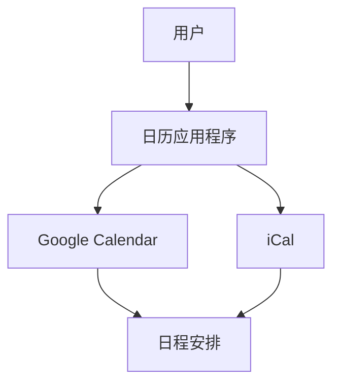
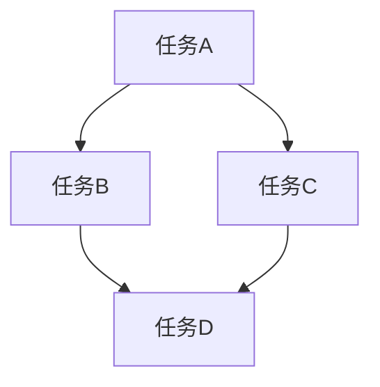
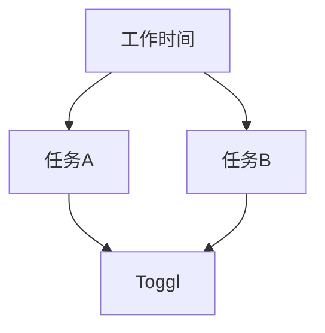
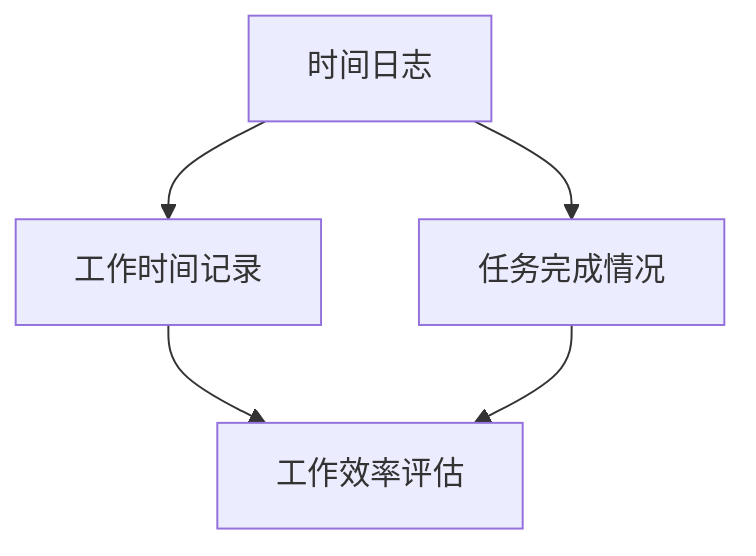
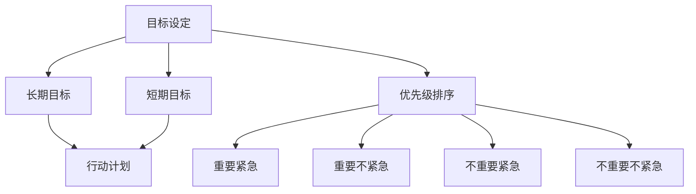
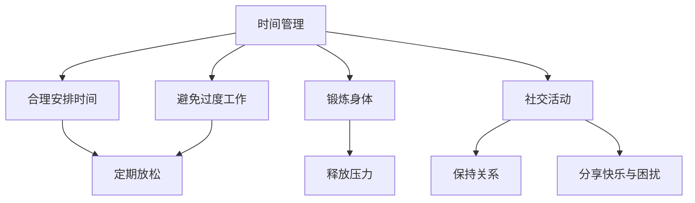

                 

### 数字时代的时间管理：效率工具与心理平衡

**关键词：数字时代，时间管理，效率工具，心理平衡**

**摘要：** 
在数字化时代，高效的时间管理成为了提高工作效率和个人成就感的关键。本文将探讨数字时代的时间管理策略，分析各种效率工具的优缺点，以及如何在快节奏的生活中保持心理平衡。通过理论讲解、案例分析以及实际应用技巧，帮助读者提升时间管理能力，实现工作与生活的平衡。

---

## 目录大纲

### 引言
- **1.1 问题背景与现状分析**
- **1.2 心理平衡的重要性**
- **1.3 书籍结构概述**

### 数字时代的时间管理工具
- **2.1 效率工具介绍**
- **2.2 工具的优缺点分析**

### 时间管理策略与方法
- **3.1 经典时间管理方法**
- **3.2 自我评估与规划**

### 心理平衡与时间管理
- **4.1 心理健康的重要性**
- **4.2 减少压力的策略**

### 实践案例
- **5.1 案例一：高效工作者的时间管理技巧**
- **5.2 案例二：心理平衡在时间管理中的应用**

### 最佳实践与技巧
- **6.1 最佳实践**
- **6.2 技巧分享**

### 总结与展望
- **7.1 总结**
- **7.2 展望**

### 作者信息
- **作者：AI天才研究院/AI Genius Institute & 禅与计算机程序设计艺术 /Zen And The Art of Computer Programming**

---

### 第1章 引言

**1.1 问题背景与现状分析**

在数字化时代，我们的工作和生活方式发生了巨大的变化。随着互联网、移动设备和云计算技术的普及，我们拥有了前所未有的工具和资源来管理时间和任务。然而，这种便利也带来了新的挑战。许多人发现自己被各种任务和应用包围，感到时间不够用，压力增大，甚至出现焦虑和倦怠。

根据一项针对全球职场人士的调查，超过70%的人表示他们的工作压力很大，其中超过50%的人认为时间管理是主要问题之一。同时，快节奏的生活使得人们很难保持心理平衡，导致工作效率下降，生活质量下降。

**1.2 心理平衡的重要性**

心理平衡是指个体在面对压力和挑战时，能够保持心态的平和和稳定。在数字时代，心理平衡对于时间管理至关重要。首先，心理平衡有助于提高注意力和专注力，使我们能够更有效地完成任务。其次，心理平衡有助于减少焦虑和压力，提高生活质量。最后，心理平衡有助于培养积极的心态和情绪，使我们更加乐观和自信。

**1.3 书籍结构概述**

本书旨在为读者提供全面的数字时代时间管理解决方案，包括效率工具的使用、心理平衡的培养以及实际案例的分析。具体来说，本书分为以下几个部分：

- 第1章：引言，介绍数字时代时间管理的背景和重要性。
- 第2章：数字时代的时间管理工具，分析常见的时间管理工具的优缺点。
- 第3章：时间管理策略与方法，介绍经典的时间管理方法和自我评估工具。
- 第4章：心理平衡与时间管理，探讨心理平衡对时间管理的影响和减压策略。
- 第5章：实践案例，通过具体案例展示时间管理和心理平衡的最佳实践。
- 第6章：最佳实践与技巧，分享实用的技巧和经验。
- 第7章：总结与展望，对全书内容进行总结，并展望未来的发展趋势。

通过这些章节的探讨，本书希望帮助读者提升时间管理能力，实现工作与生活的平衡，提高生活质量。

---

### 第2章 数字时代的时间管理工具

**2.1 效率工具介绍**

在数字时代，时间管理工具变得尤为重要。以下是一些常见的时间管理工具及其特点：

- **日历应用程序**：如Google Calendar、iCal等。这些工具可以帮助我们安排日程，设置提醒，确保不会错过重要的会议和任务。
- **待办事项列表**：如Trello、Asana等。这些工具可以帮助我们记录和管理任务，确保每个任务都有明确的负责人和时间节点。
- **时间跟踪应用**：如RescueTime、Toggl等。这些工具可以监控我们的工作时间，帮助我们了解时间使用情况，从而进行优化。

**2.2 工具的优缺点分析**

每种时间管理工具都有其独特的优缺点。以下是对一些常见工具的优缺点分析：

- **日历应用程序**：
  - 优点：方便、直观，支持多平台同步。
  - 缺点：对于复杂的任务和项目，可能不够详细。
- **待办事项列表**：
  - 优点：任务明确，可以分组管理。
  - 缺点：可能缺乏对时间的管理和监控。
- **时间跟踪应用**：
  - 优点：可以监控时间使用情况，帮助优化时间管理。
  - 缺点：可能需要额外的时间来设置和记录。

**2.2.1 日历应用程序**

**Mermaid示例**（用于系统架构设计）：

**2.2.2 待办事项列表**

**Mermaid示例**（用于任务管理）：

**2.2.3 时间跟踪应用**

**Mermaid示例**（用于时间监控）：

通过这些工具，我们可以更好地管理时间和任务，提高工作效率。然而，选择合适的工具并不仅仅是看其功能，还需要考虑个人的使用习惯和工作需求。

---

### 第3章 时间管理策略与方法

**3.1 经典时间管理方法**

在时间管理领域，有一些经典的方法被广泛使用，如GTD（Getting Things Done）和番茄工作法。

- **GTD（Getting Things Done）**：
  - 核心原理：通过收集、处理、组织、回顾和执行，将所有任务和想法转化为具体的行动步骤。
  - 步骤：收集（收集所有待办事项和想法），处理（处理每个收集到的任务），组织（将任务分类并分配优先级），回顾（定期回顾和更新待办事项），执行（按计划执行任务）。
- **番茄工作法**：
  - 核心原理：将工作时间分割为25分钟的工作块，每个工作块后休息5分钟。
  - 步骤：选择一个任务，设定番茄钟，工作25分钟后休息5分钟，每完成四个番茄钟后休息15-30分钟。

**3.2 自我评估与规划**

自我评估是时间管理的重要环节。通过自我评估，我们可以了解自己的时间使用习惯、效率水平和优劣势，从而进行有针对性的规划。

- **自我评估工具**：
  - **时间日志**：记录每天的时间使用情况，分析哪些活动消耗了最多的时间，是否有必要进行调整。
  - **工作日记**：记录每天的工作任务和完成情况，评估工作效率和任务分配的合理性。
- **规划方法**：
  - **目标设定**：明确自己的长期和短期目标，制定具体的行动计划和时间表。
  - **优先级排序**：根据目标和重要性，对任务进行优先级排序，确保重要且紧急的任务得到优先处理。
  - **时间块分配**：将每天的时间分为不同的块，分别用于不同的任务和活动，确保每个任务都有足够的时间完成。

**3.2.1 自我评估工具**

**Mermaid示例**（用于时间日志分析）：

**3.2.2 规划方法**

**Mermaid示例**（用于目标设定和优先级排序）：

通过自我评估和规划，我们可以更好地了解自己的时间和任务，从而进行更有效的管理。这不仅有助于提高工作效率，还能减轻压力，提高生活质量。

---

### 第4章 心理平衡与时间管理

**4.1 心理健康的重要性**

心理平衡是时间管理的核心。一个心理健康的人能够更好地应对压力，保持高效率，实现工作与生活的平衡。以下是一些心理健康的指标：

- **情绪稳定**：能够合理表达和处理情绪，不会因小事而过度激动或沮丧。
- **自我认知**：对自己有清晰的认识，了解自己的优势和劣势，能够自我激励。
- **人际交往**：与他人保持良好的关系，能够积极沟通和合作。
- **生活满意度**：对生活有积极的态度，能够从日常中找到乐趣和满足。

**4.2 减少压力的策略**

在快节奏的生活中，压力是无法避免的。然而，我们可以采取一些策略来减少压力，保持心理平衡。

- **时间管理**：合理安排时间，确保工作和休息的时间分配合理，避免过度工作。
- **自我放松**：通过冥想、瑜伽、听音乐等方式，放松身心，减轻压力。
- **锻炼身体**：定期进行体育锻炼，如跑步、游泳、健身等，有助于释放压力，提高心理素质。
- **社交活动**：与家人、朋友保持良好的社交关系，参与社交活动，分享快乐和困扰。

**4.2.1 减少压力策略**

**Mermaid示例**（用于策略分析）：

通过这些策略，我们可以有效地减少压力，保持心理平衡，从而更好地进行时间管理。

---

### 第5章 实践案例

**5.1 案例一：高效工作者的时间管理技巧**

张先生是一位互联网公司的项目经理，他擅长时间管理，能够高效地完成工作任务。以下是他的一些时间管理技巧：

- **每日晨间计划**：每天早晨，张先生会花10分钟时间制定当天的计划，包括重要任务、会议和休息时间。
- **番茄工作法**：他使用番茄工作法，将工作时间分割为25分钟的工作块，每个工作块后休息5分钟。
- **任务分解**：他将大型任务分解为小任务，确保每个任务都有明确的完成时间和负责人。

通过这些技巧，张先生能够高效地完成任务，保持工作与生活的平衡。

**5.2 案例二：心理平衡在时间管理中的应用**

李女士是一位全职妈妈，她需要兼顾家庭和工作。以下是她如何通过心理平衡来提高时间管理效率：

- **自我放松**：李女士每天晚上会花30分钟时间进行冥想和瑜伽，帮助自己放松身心。
- **时间分配**：她将每天的时间分为工作、家庭和个人时间，确保每个方面都有足够的关注。
- **积极沟通**：李女士与家人和朋友保持良好的沟通，分享自己的困扰和快乐。

通过这些策略，李女士能够更好地管理时间和任务，提高生活质量。

---

### 第6章 最佳实践与技巧

**6.1 最佳实践**

- **目标设定**：设定明确、具体、可衡量的目标，定期进行评估和调整。
- **优先级排序**：根据重要性和紧急性对任务进行排序，确保重要任务得到优先处理。
- **时间块分配**：将时间分为工作、休息、学习和娱乐等不同模块，确保时间分配合理。
- **定期回顾**：定期回顾时间管理方法和效果，根据实际情况进行调整。

**6.2 技巧分享**

- **使用日历应用程序**：使用日历应用程序来安排日程和设置提醒，确保不会错过重要事件。
- **任务分解**：将大型任务分解为小任务，确保每个任务都有明确的完成时间和负责人。
- **使用待办事项列表**：使用待办事项列表来记录和管理任务，确保任务不遗漏。
- **时间跟踪**：使用时间跟踪应用来监控时间使用情况，帮助自己了解时间消耗，进行优化。

通过最佳实践和技巧，我们可以更有效地管理时间和任务，提高工作效率，实现工作与生活的平衡。

---

### 第7章 总结与展望

**7.1 总结**

数字时代的时间管理是我们提高工作效率和个人成就感的关键。本文通过分析效率工具、时间管理策略和心理平衡的重要性，提供了全面的数字时代时间管理解决方案。通过实践案例和最佳实践技巧，读者可以更好地管理时间和任务，实现工作与生活的平衡。

**7.2 展望**

未来，随着技术的不断发展，时间管理工具和方法将变得更加智能化和个性化。同时，心理平衡的重要性也将日益凸显，我们将在工作中面临更多的挑战和压力。因此，持续学习和适应新的时间管理方法和心理平衡策略将是未来发展的关键。

---

### 作者信息

**作者：AI天才研究院/AI Genius Institute & 禅与计算机程序设计艺术 /Zen And The Art of Computer Programming**

