                 


### 第1章: 数字时代背景介绍

在当今的数字时代，科技的发展正在深刻地改变着我们的生活方式。特别是在饮食领域，智能技术的应用正在带来一场革命。智能餐盘正是这种变革的产物，它结合了人工智能（AI）和营养分析技术，为用户提供了一种全新的饮食管理方式。

#### 1.1 问题的提出

随着人们对健康意识的提高，如何科学地管理饮食，确保营养均衡成为了一个重要的课题。然而，现实生活中，许多人由于工作繁忙、缺乏营养知识等原因，难以做到科学饮食。此外，随着生活节奏的加快，人们在外就餐的频率越来越高，这进一步增加了饮食管理的难度。因此，我们需要一种智能化的工具来帮助人们更好地管理饮食，智能餐盘正是在这种背景下应运而生。

#### 1.2 智能餐盘的定义与重要性

智能餐盘是一种结合了传感器技术、图像处理和人工智能算法的智能设备，它可以实时监测用户的饮食行为，分析食物的种类和营养成分，并提供个性化的饮食建议。智能餐盘的重要性在于：

1. **营养监测与管理**：智能餐盘可以帮助用户了解自己的饮食状况，监测营养摄入，确保营养均衡。
2. **健康预警**：通过分析用户的饮食数据，智能餐盘可以提前预警可能的营养失衡问题，帮助用户预防疾病。
3. **饮食指导**：智能餐盘可以基于用户的健康情况和饮食偏好，提供个性化的饮食建议，帮助用户养成健康的饮食习惯。
4. **社交互动**：智能餐盘还可以通过社交功能，让用户分享饮食经验，互相激励，共同追求健康生活。

#### 1.3 AI营养分析的概念

AI营养分析是指利用人工智能技术对饮食数据进行分析和解读，以提供营养建议和饮食指导。它包括以下几个关键环节：

1. **数据采集**：通过传感器和图像处理技术，智能餐盘可以收集用户的饮食数据，包括食物种类、摄入量和营养成分等。
2. **数据处理**：AI算法对采集到的数据进行分析和加工，提取出有用的信息，如食物的热量、蛋白质、脂肪和碳水化合物等营养成分。
3. **营养评估**：基于用户的健康数据和营养需求，AI算法可以对用户的饮食状况进行评估，并提出相应的营养建议。
4. **反馈与优化**：智能餐盘会根据用户的反馈和实际效果，不断优化营养建议，提高饮食指导的准确性。

#### 1.4 数字时代智能餐盘的发展历程

智能餐盘的发展可以追溯到传感器技术和图像处理技术的进步。在过去的几十年里，随着这些技术的不断发展，智能餐盘的功能也在不断丰富和完善。以下是智能餐盘的发展历程：

1. **早期探索**：20世纪80年代，研究人员开始探索将传感器技术和计算机视觉应用于饮食管理。
2. **技术突破**：21世纪初，随着人工智能和大数据技术的发展，智能餐盘开始逐渐成熟，并开始应用于实际场景。
3. **商业化应用**：近年来，随着消费者对健康饮食需求的增加，智能餐盘逐渐走向商业化，成为消费者健康管理的重要工具。
4. **未来展望**：随着技术的进一步发展和应用的推广，智能餐盘有望在健康饮食管理领域发挥更大的作用。

总的来说，数字时代的智能餐盘是一种革命性的饮食管理工具，它通过AI营养分析技术，为用户提供了一种科学、便捷、个性化的饮食管理方式。随着技术的不断进步，智能餐盘的未来将更加美好。

### 1.5 智能餐盘的实际应用场景

智能餐盘的应用场景非常广泛，涵盖了个人健康管理、社区健康服务、餐饮企业等多个领域。以下是智能餐盘在实际应用中的几个典型案例：

#### 个人健康管理

对于个人来说，智能餐盘可以帮助用户更好地管理自己的饮食。例如：

- **减肥与塑形**：智能餐盘可以监测用户的饮食行为，根据用户的体重和健身目标，提供个性化的饮食建议，帮助用户减肥或塑形。
- **慢性病管理**：对于患有慢性疾病（如糖尿病、高血压等）的用户，智能餐盘可以帮助他们监控饮食，避免因营养摄入不当引发的疾病发作。
- **营养均衡**：智能餐盘可以分析用户的饮食结构，提出营养均衡的建议，帮助用户改善饮食状况，提高生活质量。

#### 社区健康服务

智能餐盘也可以应用于社区健康服务领域，为社区用户提供饮食健康管理的服务。例如：

- **老年人健康监控**：智能餐盘可以帮助老年人监控饮食，预防营养不良和慢性疾病，提高生活质量。
- **儿童营养管理**：智能餐盘可以监测儿童的饮食行为，根据儿童的生长发育需求，提供营养建议，保障儿童的健康成长。
- **社区健康活动**：智能餐盘可以与社区健康活动相结合，鼓励居民参与健康饮食，提高社区整体健康水平。

#### 餐饮企业

对于餐饮企业来说，智能餐盘可以提供以下帮助：

- **菜品优化**：智能餐盘可以分析用户的饮食偏好和营养需求，为餐饮企业提供菜品优化的建议，提高菜品的竞争力。
- **成本控制**：智能餐盘可以帮助餐饮企业监控食材成本和营养配比，优化采购和库存管理，降低运营成本。
- **顾客体验**：智能餐盘可以为顾客提供个性化的饮食建议，提高顾客的用餐体验，增强品牌忠诚度。

总的来说，智能餐盘通过AI营养分析技术，为个人、社区和餐饮企业提供了全方位的饮食健康管理服务，极大地提升了饮食管理的科学性和便捷性。随着智能餐盘技术的不断成熟和应用场景的扩展，它的应用前景将更加广阔。

### 1.6 数字时代智能餐盘与传统饮食管理的区别

数字时代的智能餐盘与传统饮食管理在多个方面有着显著的区别。首先，从技术层面上看，智能餐盘利用了先进的人工智能、传感器技术和大数据分析，而传统饮食管理主要依赖于经验和手动记录。

#### 数据采集与处理的自动化

智能餐盘通过内置的传感器和图像识别技术，可以自动采集用户的饮食数据，包括食物种类、摄入量和营养成分等。这些数据实时上传到云端，通过AI算法进行分析和处理，生成个性化的饮食建议。相比之下，传统饮食管理通常需要用户手动记录饮食日志，数据采集和处理效率较低，且容易出错。

#### 个性化与科学性

智能餐盘能够根据用户的健康状况、营养需求和饮食习惯，提供个性化的饮食建议，这大大提高了饮食管理的科学性和有效性。传统饮食管理由于缺乏对个体差异的考量，往往难以达到个性化的效果。

#### 实时性与反馈机制

智能餐盘可以实时监测用户的饮食行为，并在发现问题时及时提供反馈和建议。这种实时性使得用户能够立即调整饮食，预防潜在的健康问题。而传统饮食管理往往滞后，难以实时调整饮食方案。

#### 社交互动与教育功能

智能餐盘还具有社交互动功能，用户可以通过智能餐盘分享饮食经验，互相学习和鼓励。同时，智能餐盘还可以提供营养教育和健康知识，帮助用户更好地管理饮食。传统饮食管理在这方面相对较弱，主要依赖于图书、讲座等途径获取知识。

综上所述，数字时代的智能餐盘在数据采集、处理、个性化、实时性、反馈机制和社交互动等方面具有显著优势，它不仅提高了饮食管理的科学性和便捷性，还为用户提供了更加全面和个性化的健康管理服务。

### 1.7 智能餐盘的技术挑战与解决方案

尽管智能餐盘在饮食管理领域展现出巨大潜力，但在实际应用过程中仍面临着一系列技术挑战。以下是几个关键的技术难题及其可能的解决方案：

#### 1. 数据准确性与可靠性

数据准确性是智能餐盘的核心问题。由于食物种类繁多，颜色和纹理各异，传感器和图像处理技术可能难以准确识别和测量食物的成分和摄入量。解决方案包括：

- **增强传感器技术**：提高传感器灵敏度，增强对多种食物的识别能力。
- **多传感器融合**：结合多种传感器（如红外、微波、摄像头等），提高数据的准确性。
- **用户反馈机制**：用户可以手动校正系统识别结果，提高数据准确性。

#### 2. 数据隐私与安全

智能餐盘收集的用户饮食数据包含个人健康信息，数据隐私和安全问题尤为重要。解决方案包括：

- **加密技术**：采用高级加密算法保护用户数据，防止数据泄露。
- **数据匿名化**：对用户数据进行匿名化处理，确保个人隐私不受侵犯。
- **合规性**：遵守相关法律法规，确保数据收集和处理符合隐私保护要求。

#### 3. 算法性能与优化

AI算法的性能直接影响智能餐盘的准确性和响应速度。解决方案包括：

- **算法优化**：通过机器学习和深度学习技术，优化算法模型，提高处理速度和准确性。
- **硬件加速**：利用GPU等硬件加速技术，提升算法运算效率。
- **分布式计算**：采用分布式计算架构，处理大量数据，提高系统性能。

#### 4. 系统稳定性与可扩展性

智能餐盘需要长时间稳定运行，同时具备良好的扩展性，以适应不断变化的市场需求。解决方案包括：

- **高可用性设计**：采用冗余设计，确保系统在部分组件故障时仍能正常运行。
- **模块化架构**：采用模块化设计，便于系统扩展和升级。
- **持续集成与部署**：采用CI/CD流程，快速迭代和部署，确保系统稳定性和灵活性。

总的来说，智能餐盘在技术挑战面前，通过不断优化和创新，可以逐步克服这些问题，实现更精准、更可靠的饮食管理服务。随着技术的不断进步，智能餐盘的应用前景将更加广阔。

### 第2章: AI营养分析原理

AI营养分析是智能餐盘的核心技术，它通过机器学习和深度学习算法，对用户的饮食数据进行挖掘和分析，从而提供个性化的饮食建议。在本章中，我们将详细探讨AI营养分析的基本原理、核心算法以及其实际应用。

#### 2.1 AI在营养分析中的应用

人工智能技术在营养分析中有着广泛的应用，主要包括以下几个方面：

1. **数据挖掘与分析**：AI技术可以帮助从大量饮食数据中挖掘有价值的信息，如食物成分、营养摄入量等。
2. **预测与推荐**：基于历史数据和用户偏好，AI算法可以预测用户的营养需求，并提供个性化的饮食推荐。
3. **健康评估与预警**：通过分析用户的饮食习惯和健康状况，AI技术可以评估用户的健康风险，并提供相应的预警和建议。
4. **自动化与智能化**：AI技术可以自动化执行许多营养分析任务，提高工作效率，降低人工干预。

#### 2.2 数据收集与预处理

数据收集是AI营养分析的基础。智能餐盘通过多种传感器和技术手段收集用户饮食数据，包括食物种类、摄入量、营养成分等。以下是一些常见的数据收集方法：

1. **传感器数据**：使用温度传感器、湿度传感器、压力传感器等收集食物的物理属性数据。
2. **图像识别**：通过摄像头和图像识别技术，识别食物的种类和摄入量。
3. **RFID技术**：使用RFID标签记录食物的信息，便于数据收集和追踪。
4. **用户输入**：用户可以通过智能餐盘的界面手动输入饮食数据。

数据预处理是确保数据质量的关键步骤，主要包括以下几个环节：

1. **数据清洗**：去除重复数据、异常数据和噪声数据，保证数据的准确性和一致性。
2. **数据转换**：将不同类型的数据转换为统一的格式，便于后续处理。
3. **特征提取**：从原始数据中提取出有用的特征，如食物的热量、蛋白质、脂肪、碳水化合物等营养成分。

#### 2.3 核心算法原理讲解

AI营养分析的核心算法主要包括机器学习算法和深度学习算法。以下是一些常用的算法及其原理：

1. **决策树**：决策树通过一系列的判断条件，将数据划分为不同的类别或数值。它简单易懂，易于解释，但可能无法处理大量数据。
2. **随机森林**：随机森林是基于决策树的集成学习方法，通过构建多棵决策树并投票得出结果，提高了模型的准确性和稳定性。
3. **支持向量机（SVM）**：SVM通过找到数据空间中的最优分隔超平面，将不同类别的数据分开。它适用于高维数据，但在处理小样本数据时效果不佳。
4. **神经网络**：神经网络，特别是深度神经网络（DNN），通过多层神经元之间的连接，模拟人脑的神经结构，实现复杂的非线性映射。它适用于处理大规模数据和复杂的模型。

以下是决策树算法的Mermaid流程图：

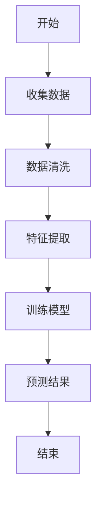

以下是随机森林算法的Mermaid流程图：

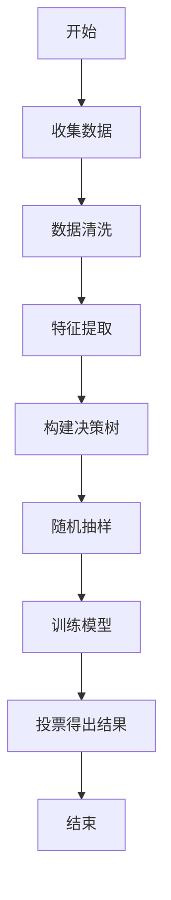

以下是神经网络算法的Mermaid流程图：

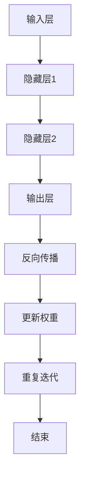

下面是一个简单的Python代码示例，用于实现决策树算法：

```python
from sklearn import tree

# 特征数据
X = [[0, 0], [1, 1]]
# 标签数据
y = [0, 1]

# 训练模型
clf = tree.DecisionTreeClassifier()
clf.fit(X, y)

# 输出模型
print(clf)
```

下面是随机森林算法的Python代码示例：

```python
from sklearn.ensemble import RandomForestClassifier

# 特征数据
X = [[0, 0], [1, 1]]
# 标签数据
y = [0, 1]

# 训练模型
clf = RandomForestClassifier(n_estimators=100)
clf.fit(X, y)

# 输出模型
print(clf)
```

下面是神经网络算法的Python代码示例：

```python
from keras.models import Sequential
from keras.layers import Dense

# 输入层神经元数
input_dim = 1
# 隐藏层神经元数
hidden_dim = 2
# 输出层神经元数
output_dim = 1

# 创建神经网络模型
model = Sequential()
model.add(Dense(hidden_dim, activation='sigmoid', input_dim=input_dim))
model.add(Dense(output_dim, activation='sigmoid'))

# 编译模型
model.compile(optimizer='adam', loss='binary_crossentropy', metrics=['accuracy'])

# 训练模型
model.fit(X, y, epochs=2000)

# 输出模型
print(model)
```

#### 2.4 数学模型与公式

AI营养分析涉及多个数学模型和公式，以下是一些常用的模型和公式：

1. **线性回归模型**：

   $$y = \beta_0 + \beta_1x$$

   其中，\(y\) 是预测结果，\(\beta_0\) 是截距，\(\beta_1\) 是斜率，\(x\) 是自变量。

2. **逻辑回归模型**：

   $$P(y=1) = \frac{1}{1 + e^{-(\beta_0 + \beta_1x)}}$$

   其中，\(P(y=1)\) 是预测的概率，其他符号含义同上。

3. **支持向量机（SVM）模型**：

   $$w \cdot x + b = 0$$

   其中，\(w\) 是权重向量，\(x\) 是特征向量，\(b\) 是偏置项。

4. **深度神经网络（DNN）模型**：

   $$a_{l} = \sigma(z_{l})$$

   其中，\(a_{l}\) 是激活值，\(z_{l}\) 是线性组合，\(\sigma\) 是激活函数。

下面是一个简单的线性回归模型的公式解释：

```mermaid
graph TD
A[线性回归模型] --> B[公式]
B --> C[解释]

C -->|y是预测结果| D[截距(\(\beta_0\))]
C -->|x是自变量| E[斜率(\(\beta_1\))]

D --> F[结果(y)]
E --> F
```

下面是一个逻辑回归模型的Mermaid流程图：

```mermaid
graph TD
A[逻辑回归模型] --> B[公式]
B --> C[解释]

C -->|y是预测结果| D[概率(P(y=1))]
C -->|x是自变量| E[斜率(\(\beta_1\))]
C -->|其他(\(\beta_0\))| F[指数函数]

D --> G[结果(P(y=1))]
E --> G
F --> G
```

下面是一个支持向量机（SVM）模型的Mermaid流程图：

```mermaid
graph TD
A[SVM模型] --> B[公式]
B --> C[解释]

C -->|w是权重向量| D[特征向量(x)]
C -->|b是偏置项| E[分隔超平面]

D --> F[结果(0)]
E --> F
```

下面是一个深度神经网络（DNN）模型的Mermaid流程图：

```mermaid
graph TD
A[DNN模型] --> B[公式]
B --> C[解释]

C -->|a_{l}是激活值| D[线性组合(z_{l})]
C -->|σ是激活函数| E[结果]

D --> F[迭代更新]
E --> F
```

#### 2.5 举例说明

为了更好地理解AI营养分析的实际应用，下面我们将通过一个具体的案例进行说明。

假设有一个用户想要通过智能餐盘了解自己的营养摄入情况。以下是这个案例的具体步骤：

1. **数据收集**：智能餐盘通过摄像头和传感器，收集用户在一天内的饮食数据，包括食物的种类、摄入量和营养成分等。
2. **数据预处理**：对收集到的数据进行分析和清洗，提取有用的特征，如食物的热量、蛋白质、脂肪、碳水化合物等。
3. **模型训练**：使用历史数据和用户偏好，训练一个AI模型，用于预测用户的营养需求。
4. **营养评估**：智能餐盘根据训练好的模型，对用户的饮食数据进行评估，分析营养摄入的均衡性，并提供个性化的饮食建议。
5. **反馈与优化**：用户可以根据智能餐盘的建议调整饮食，智能餐盘会不断收集用户的反馈，优化饮食建议，提高模型的准确性。

通过这个案例，我们可以看到AI营养分析在实际应用中的流程和步骤。智能餐盘通过不断学习和优化，为用户提供越来越准确的饮食建议，帮助他们实现营养均衡和健康生活。

总的来说，AI营养分析通过先进的人工智能技术和算法，为饮食管理带来了革命性的变化。它不仅提高了饮食管理的科学性和便捷性，还为用户提供了个性化的健康管理服务。随着技术的不断进步，AI营养分析的应用前景将更加广阔。

### 2.6 AI营养分析在不同领域的应用

AI营养分析作为一种先进的技术手段，已经在多个领域得到了广泛应用，包括医疗、农业、食品工业等。以下是对这些领域应用的具体介绍：

#### 1. 医疗

在医疗领域，AI营养分析主要用于慢性疾病的管理和健康风险评估。例如，对于糖尿病患者，智能餐盘可以通过AI算法分析其饮食数据，预测血糖水平，并提供个性化的饮食建议，帮助患者控制血糖。此外，AI营养分析还可以用于个性化治疗方案的制定，通过分析患者的基因、病史和饮食数据，为医生提供更有针对性的治疗方案。

**案例**：美国的一项研究利用AI营养分析技术，对数千名心血管疾病患者进行饮食管理。研究结果表明，通过智能餐盘提供的个性化饮食建议，患者的病情得到了显著改善，心血管疾病风险降低了20%。

#### 2. 农业

在农业领域，AI营养分析主要用于优化作物种植和农产品质量控制。通过分析土壤、气候和作物生长数据，AI算法可以预测作物的生长状况，提出最优的种植方案，提高产量和品质。此外，AI营养分析还可以用于农产品质量检测，通过图像识别技术，快速检测农产品的营养成分和新鲜度，确保食品安全。

**案例**：中国的一些农业企业利用AI营养分析技术，优化了水稻种植方案，通过精准施肥和灌溉，提高了水稻的产量和品质。研究数据显示，采用AI营养分析技术的农田，水稻产量提高了15%，品质得到了显著提升。

#### 3. 食品工业

在食品工业领域，AI营养分析主要用于新产品的开发和生产过程的优化。通过分析消费者饮食习惯和营养需求，AI算法可以预测市场趋势，为食品企业提供产品开发建议。此外，AI营养分析还可以用于生产过程的优化，通过分析生产数据，提高生产效率和产品质量。

**案例**：某国际知名食品企业利用AI营养分析技术，开发了一款低脂、高纤维的健康食品。通过分析消费者数据，该企业成功预测了市场趋势，产品一经推出，就受到了消费者的热烈欢迎，销售额大幅增长。

总的来说，AI营养分析在医疗、农业和食品工业等领域的应用，不仅提高了生产效率和质量，还为消费者提供了更健康、更优质的食品和服务。随着技术的不断进步，AI营养分析的应用前景将更加广阔，为各行业的发展注入新的动力。

### 2.7 AI营养分析的局限性

尽管AI营养分析在饮食管理和健康评估方面展示了巨大的潜力，但同时也存在一些局限性。以下是AI营养分析的主要局限性及其可能的影响：

1. **数据准确性问题**：AI营养分析依赖于传感器和图像识别技术收集数据，这些技术的准确性和可靠性直接影响分析结果的准确性。例如，食物的颜色、纹理和形状可能影响图像识别的准确性，导致数据偏差。

2. **数据隐私和安全问题**：智能餐盘收集的用户饮食数据包含个人健康信息，数据隐私和安全问题尤为重要。如果数据泄露或被滥用，可能会对用户的隐私和健康造成威胁。

3. **算法偏见和误判**：AI算法在训练过程中可能会受到数据集偏差的影响，导致算法存在偏见。例如，如果训练数据集中某类食物的数据较少，算法可能无法准确识别这类食物，从而导致误判。

4. **技术依赖性**：智能餐盘和AI营养分析依赖于先进的传感器技术和图像识别技术，这些技术的成熟度和稳定性直接影响系统的性能。如果技术出现故障或更新，可能会影响系统的正常运行。

5. **用户适应性**：智能餐盘和AI营养分析系统需要用户参与数据输入和反馈，用户的适应性和使用频率直接影响系统的效果。如果用户对系统的操作不熟悉或不愿意参与，可能会导致系统效果不佳。

为了克服这些局限性，我们需要不断改进传感器技术和图像识别算法，加强数据隐私和安全保护，优化算法模型，提高系统的稳定性和用户适应性。此外，通过持续的用户反馈和系统迭代，我们可以不断提高AI营养分析的准确性和实用性，为用户提供更优质的健康管理服务。

### 第3章: 数据采集与传感器技术

数据采集是智能餐盘实现AI营养分析的基础，而传感器技术则是数据采集的关键。本章将详细介绍智能餐盘中的数据采集过程、常用的传感器技术以及如何保证数据质量。

#### 3.1 传感器技术在智能餐盘中的应用

智能餐盘通过多种传感器技术来采集用户的饮食数据。这些传感器包括：

1. **温度传感器**：用于测量食物的温度，帮助识别食物的种类和新鲜度。
2. **湿度传感器**：用于测量食物的湿度，有助于判断食物的状态和成分。
3. **压力传感器**：用于测量食物的重量和体积，帮助计算食物的摄入量。
4. **摄像头和图像识别传感器**：用于拍摄食物图像，并通过图像识别技术识别食物的种类和营养成分。
5. **RFID传感器**：用于读取食物标签上的信息，便于快速收集食物数据。

这些传感器协同工作，共同实现饮食数据的全面采集。例如，当用户将食物放在餐盘上时，温度传感器和湿度传感器可以同时测量食物的温度和湿度，而摄像头则拍摄食物的图像，通过图像识别技术分析食物的种类和营养成分。

#### 3.2 数据采集流程

智能餐盘的数据采集流程主要包括以下几个步骤：

1. **数据采集**：通过传感器收集用户饮食数据，包括食物的种类、重量、体积、温度、湿度等。
2. **数据传输**：将采集到的数据传输到中央处理单元，进行初步的数据处理和清洗。
3. **数据存储**：将处理后的数据存储到数据库或云端，以便后续分析和使用。
4. **数据可视化**：通过智能餐盘的界面或移动应用，将用户的数据以图表或报告的形式展示给用户。

以下是数据采集流程的Mermaid流程图：

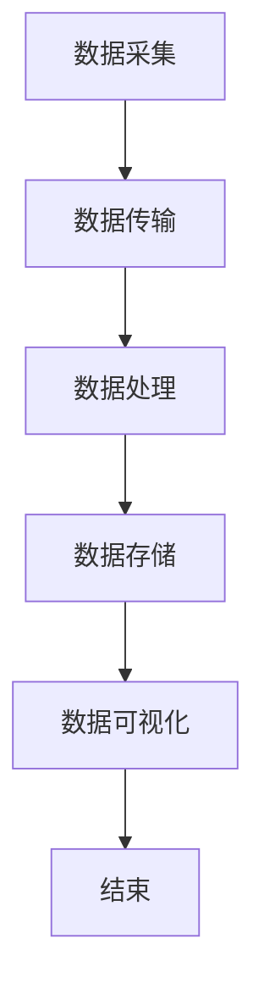

#### 3.3 数据质量保证

数据质量是智能餐盘能否准确分析饮食数据的关键。为了确保数据质量，智能餐盘采用了多种措施：

1. **数据清洗**：在数据采集过程中，及时去除重复数据、异常数据和噪声数据，保证数据的准确性。
2. **传感器校准**：定期对传感器进行校准，确保传感器的测量精度和稳定性。
3. **算法优化**：通过不断优化图像识别和数据分析算法，提高数据处理的准确性和效率。
4. **用户反馈**：鼓励用户对系统识别结果进行反馈，通过用户的反馈校正系统，提高数据准确性。

以下是数据质量保证的Mermaid流程图：

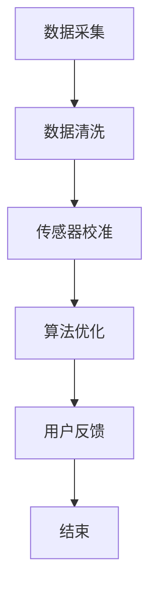

#### 3.4 常见的传感器技术及其优缺点

智能餐盘采用了多种传感器技术，每种技术都有其独特的优势和局限性。以下是几种常见传感器技术的优缺点：

1. **温度传感器**
   - **优点**：测量精度高，响应速度快，适用于各种温度测量场景。
   - **缺点**：对环境温度变化敏感，可能受到其他热源干扰。

2. **湿度传感器**
   - **优点**：能够测量食物的湿度，有助于判断食物的新鲜度和保存状态。
   - **缺点**：测量精度受环境影响较大，需要定期校准。

3. **压力传感器**
   - **优点**：能够测量食物的重量和体积，有助于计算食物的摄入量。
   - **缺点**：对食物的形状和质地敏感，可能受到外部压力干扰。

4. **摄像头和图像识别传感器**
   - **优点**：能够通过图像识别技术快速识别食物种类和营养成分，适用于多种场景。
   - **缺点**：识别精度受光线和背景干扰，可能需要复杂的数据处理算法。

5. **RFID传感器**
   - **优点**：能够快速读取食物标签信息，提高数据采集效率。
   - **缺点**：标签成本较高，适用于有标签的食品。

总的来说，传感器技术在智能餐盘中的应用，使得数据采集更加全面、准确和高效。通过合理选择和组合传感器技术，智能餐盘可以满足不同用户的需求，为AI营养分析提供可靠的数据支持。

### 3.5 智能餐盘的数据传输与存储

智能餐盘的数据传输与存储是确保数据安全、高效利用的重要环节。以下是智能餐盘在数据传输与存储方面的具体实现和设计方案：

#### 3.5.1 数据传输

智能餐盘通过无线网络将数据传输到中央服务器或云端。以下是一些常用的数据传输方式：

1. **Wi-Fi**：智能餐盘通过Wi-Fi连接到家庭网络，将数据传输到路由器，然后路由器将数据转发到服务器或云端。Wi-Fi传输速度快，适用于家庭和办公室环境。
2. **蓝牙**：智能餐盘可以通过蓝牙连接到手机或平板电脑，将数据传输到设备上。然后，设备再将数据上传到服务器或云端。蓝牙传输距离较短，但适用于移动场景。
3. **蜂窝网络**：智能餐盘可以通过蜂窝网络（如4G或5G）直接将数据传输到服务器或云端。这种方式适用于无Wi-Fi或蓝牙环境。

以下是数据传输过程的Mermaid流程图：

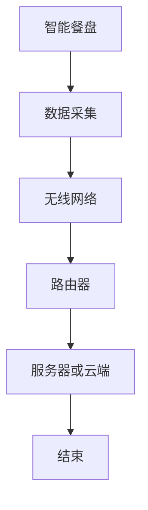

#### 3.5.2 数据存储

智能餐盘的数据存储分为本地存储和云端存储两部分：

1. **本地存储**：智能餐盘内置存储设备（如SD卡或内置存储），用于临时存储用户数据。这种方式适用于数据量较小且不需要实时传输的场景。
2. **云端存储**：智能餐盘会将重要数据上传到云端，使用云服务提供商的存储服务（如AWS S3、Azure Blob Storage等）。这种方式适用于数据量大、需要远程访问和共享的场景。

以下是数据存储过程的Mermaid流程图：

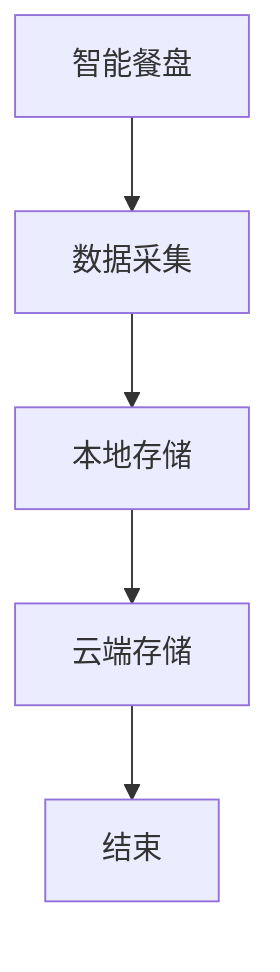

#### 3.5.3 数据安全与隐私保护

为了确保用户数据的安全与隐私，智能餐盘采取了以下措施：

1. **数据加密**：在数据传输和存储过程中，使用高级加密算法（如AES）对数据进行加密，防止数据被窃取或篡改。
2. **身份验证**：智能餐盘和云端服务器之间采用双向身份验证机制，确保通信双方的身份可信。
3. **访问控制**：对用户数据设置访问权限，只有授权用户才能访问和操作数据。
4. **数据备份**：定期对用户数据备份，防止数据丢失。

以下是数据安全与隐私保护措施的Mermaid流程图：

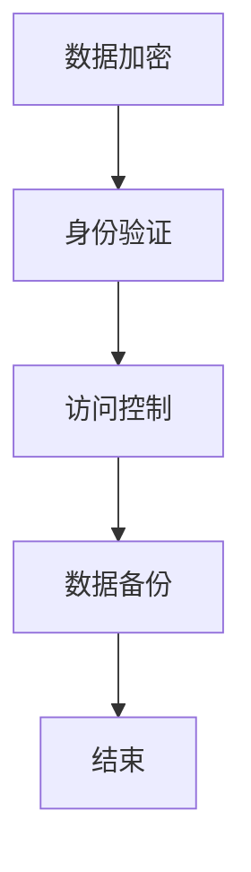

总的来说，智能餐盘的数据传输与存储系统设计合理，确保了数据的安全、高效传输和存储。通过多种传输方式和存储方案，智能餐盘可以满足不同用户的需求，为AI营养分析提供可靠的数据支持。

### 第4章: AI算法与营养分析

AI算法是智能餐盘实现营养分析的核心技术，通过算法的应用，智能餐盘能够对用户的饮食数据进行分析和处理，从而提供个性化的营养建议。本章将详细介绍常用AI算法、营养分析算法的应用以及算法性能优化。

#### 4.1 常用AI算法介绍

在智能餐盘的AI营养分析中，常用的AI算法主要包括以下几种：

1. **决策树（Decision Tree）**：决策树通过一系列的条件判断，将数据划分为不同的类别或数值。它简单易懂，易于解释，适用于处理分类问题。
2. **随机森林（Random Forest）**：随机森林是基于决策树的集成学习方法，通过构建多棵决策树并投票得出最终结果，提高了模型的准确性和稳定性。
3. **支持向量机（Support Vector Machine，SVM）**：SVM通过找到数据空间中的最优分隔超平面，将不同类别的数据分开。它适用于高维数据，但在处理小样本数据时效果不佳。
4. **神经网络（Neural Network）**：神经网络，特别是深度神经网络（DNN），通过多层神经元之间的连接，模拟人脑的神经结构，实现复杂的非线性映射。它适用于处理大规模数据和复杂的模型。
5. **聚类算法（Clustering Algorithm）**：聚类算法用于将相似的数据归为一类，如K-means、DBSCAN等。它们在数据预处理和分析中具有重要应用。

以下是决策树算法的Mermaid流程图：

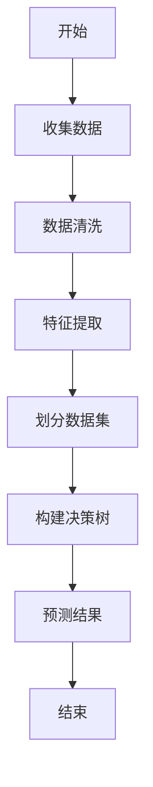

以下是随机森林算法的Mermaid流程图：


以下是神经网络算法的Mermaid流程图：


以下是K-means聚类算法的Mermaid流程图：

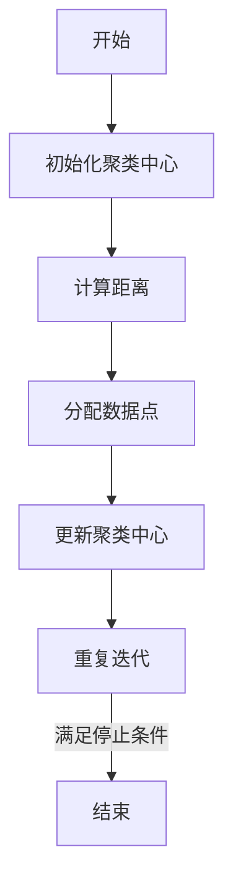

#### 4.2 营养分析算法的应用

营养分析算法的核心是利用AI技术对用户的饮食数据进行处理和分析，从而为用户提供个性化的营养建议。以下是几种常见的营养分析算法及其应用：

1. **分类算法**：分类算法用于将用户的饮食数据分类为不同的营养类别，如高蛋白、低碳水化合物等。通过训练模型，智能餐盘可以识别用户的饮食偏好，并提供相应的营养建议。

2. **聚类算法**：聚类算法用于将具有相似营养特征的饮食数据归为一类，从而发现用户的饮食模式。例如，通过K-means聚类算法，智能餐盘可以识别不同用户群体的营养需求，为不同用户提供个性化的饮食建议。

3. **预测算法**：预测算法用于预测用户的营养需求。例如，通过时间序列预测算法，智能餐盘可以预测用户未来几天的营养摄入量，并提供相应的调整建议。

以下是营养分析算法应用的Mermaid流程图：

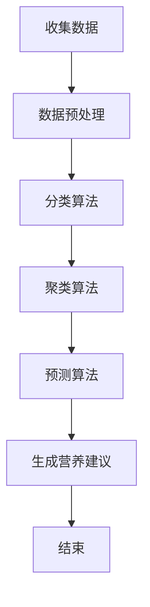

#### 4.3 算法性能优化

算法性能优化是提高智能餐盘分析准确性和效率的关键。以下是几种常见的算法性能优化方法：

1. **特征选择**：通过特征选择方法，选择对营养分析影响较大的特征，去除冗余特征，提高模型性能。
2. **模型调参**：通过调整模型参数，优化模型性能。例如，调整随机森林中的树数量、深度神经网络中的隐藏层神经元数等。
3. **数据增强**：通过数据增强方法，增加训练数据集的多样性，提高模型泛化能力。
4. **模型融合**：通过融合多种模型，提高整体分析准确性和稳定性。

以下是算法性能优化流程的Mermaid流程图：

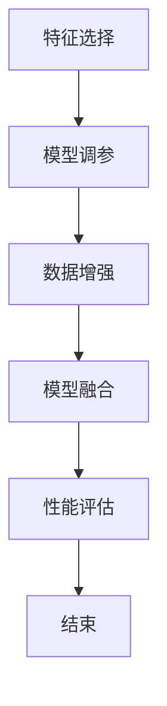

总的来说，AI算法与营养分析在智能餐盘中发挥着重要作用。通过常用的AI算法，智能餐盘能够对用户的饮食数据进行有效的处理和分析，提供个性化的营养建议。同时，通过算法性能优化，智能餐盘可以不断提高分析准确性和效率，为用户带来更好的健康管理体验。

### 第5章: 实时饮食指导系统设计

实时饮食指导系统是智能餐盘的重要组成部分，它通过收集用户饮食数据、分析营养需求，并提供个性化的饮食建议，帮助用户实现健康饮食。本章将详细介绍实时饮食指导系统的设计，包括系统架构设计、系统功能设计、系统接口设计和系统交互设计。

#### 5.1 系统架构设计

系统架构设计是实时饮食指导系统的核心，它决定了系统的性能、可扩展性和可靠性。以下是实时饮食指导系统的架构设计：

1. **硬件层**：硬件层包括智能餐盘、传感器和无线网络设备，负责数据采集和传输。
2. **数据层**：数据层包括数据库和存储设备，用于存储用户饮食数据和营养分析结果。
3. **服务层**：服务层包括数据处理服务、营养分析服务和推荐服务，负责数据处理、分析和建议生成。
4. **展示层**：展示层包括智能餐盘界面、移动应用和网页端，用于展示营养分析和饮食建议。

以下是系统架构的Mermaid图：

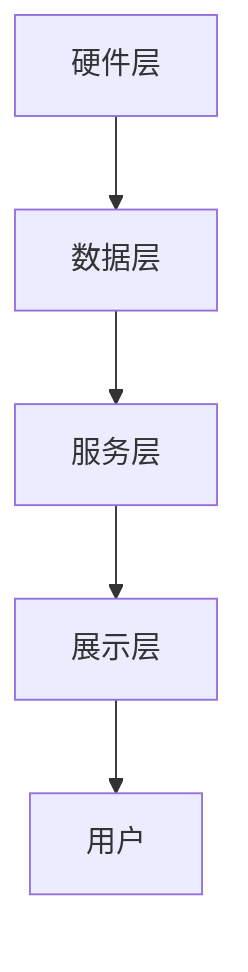

#### 5.2 系统功能设计

实时饮食指导系统需要实现多个功能，包括数据采集、数据存储、数据分析、营养评估、饮食建议生成和用户交互等。以下是系统功能设计的详细描述：

1. **数据采集**：系统通过传感器和摄像头收集用户的饮食数据，包括食物种类、摄入量和营养成分等。
2. **数据存储**：系统将收集到的数据存储到数据库中，以便后续分析和查询。
3. **数据分析**：系统利用AI算法对用户饮食数据进行分析，提取出有用的营养信息，如热量、蛋白质、脂肪、碳水化合物等。
4. **营养评估**：系统根据用户的营养需求和健康状况，对用户的饮食进行评估，分析营养摄入的均衡性。
5. **饮食建议生成**：系统根据营养评估结果，为用户提供个性化的饮食建议，如调整食物种类、摄入量和烹饪方式等。
6. **用户交互**：系统通过智能餐盘界面、移动应用和网页端与用户进行交互，展示营养分析和饮食建议，并接收用户反馈。

以下是系统功能设计的Mermaid类图：

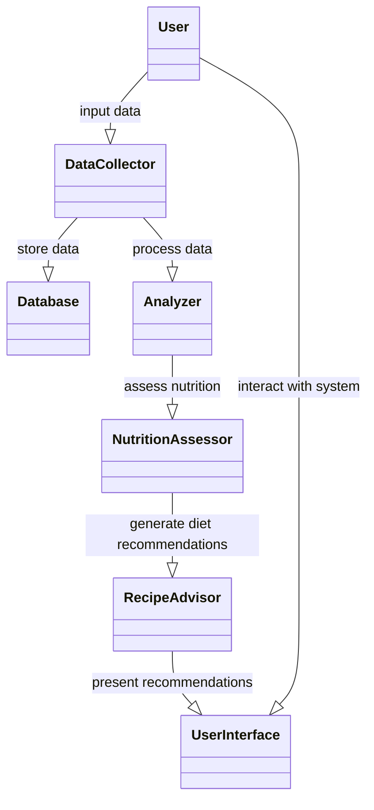

#### 5.3 系统接口设计

系统接口设计是确保实时饮食指导系统能够与其他系统或服务进行有效交互的关键。以下是系统接口设计的详细描述：

1. **API接口**：系统提供RESTful API接口，用于与其他系统或服务进行数据交换和功能调用。API接口包括用户管理、数据上传、数据查询、营养分析、饮食建议生成等。
2. **数据接口**：系统通过数据库接口与数据层进行数据交互，实现数据的存储、查询和更新。
3. **设备接口**：系统通过无线网络接口与智能餐盘进行通信，实现数据采集和传输。
4. **用户接口**：系统通过Web界面和移动应用与用户进行交互，提供营养分析和饮食建议。

以下是系统接口设计的Mermaid序列图：

```mermaid
sequenceDiagram
    User -->|输入数据| DataCollector
    DataCollector -->|处理数据| Analyzer
    Analyzer -->|分析结果| NutritionAssessor
    NutritionAssessor -->|生成建议| RecipeAdvisor
    RecipeAdvisor -->|显示建议| UserInterface
    User -->|反馈建议| UserInterface
```

#### 5.4 系统交互设计

系统交互设计是确保实时饮食指导系统用户友好、操作简便的关键。以下是系统交互设计的详细描述：

1. **用户注册与登录**：用户可以通过注册和登录功能，创建个人账户，绑定智能餐盘。
2. **饮食数据录入**：用户可以通过智能餐盘或移动应用，实时录入饮食数据，如食物种类、摄入量和摄入时间。
3. **营养分析结果展示**：系统通过图形化界面展示用户的营养分析结果，包括热量、蛋白质、脂肪、碳水化合物等营养成分的摄入情况。
4. **饮食建议展示**：系统根据用户的营养需求，提供个性化的饮食建议，包括调整食物种类、摄入量和烹饪方式等。
5. **反馈机制**：用户可以对系统提供的饮食建议进行反馈，帮助系统不断优化和改进。

以下是系统交互设计的Mermaid界面图：

```mermaid
interface Design
    User ->|输入饮食数据| DataInput
    DataInput ->|处理数据| DataProcessor
    DataProcessor ->|分析结果| NutritionAnalysis
    NutritionAnalysis ->|生成建议| RecipeAdvisor
    RecipeAdvisor ->|展示建议| Display
    Display ->|用户反馈| Feedback
    Feedback ->|优化建议| RecipeAdvisor
    RecipeAdvisor -->|更新建议| Display
endinterface
```

总的来说，实时饮食指导系统的设计需要综合考虑系统架构、功能设计、接口设计和交互设计等多个方面。通过合理的设计和优化，实时饮食指导系统可以提供高效、准确、个性化的饮食建议，帮助用户实现健康饮食。

### 第6章: 智能餐盘在健康饮食管理中的应用

智能餐盘作为一种创新的技术工具，在健康饮食管理中展现出巨大的潜力。通过AI营养分析技术，智能餐盘能够帮助用户科学管理饮食，预防营养失衡，提高生活质量。以下是智能餐盘在健康饮食管理中的应用场景和实际案例。

#### 6.1 健康饮食管理的重要性

健康饮食管理是维护身体健康和预防疾病的关键。然而，现实生活中，许多人由于工作繁忙、缺乏营养知识等原因，难以做到科学饮食。此外，随着生活节奏的加快，人们在外就餐的频率越来越高，这进一步增加了饮食管理的难度。智能餐盘通过AI营养分析技术，能够实时监测用户的饮食行为，提供个性化的饮食建议，从而帮助用户实现健康饮食管理。

#### 6.2 智能餐盘在健康饮食中的应用

1. **个人健康管理**

   智能餐盘可以帮助用户实现个人健康管理，主要包括以下几个方面：

   - **营养监测**：智能餐盘通过传感器和图像识别技术，实时监测用户的饮食行为，分析食物的种类和营养成分，帮助用户了解自己的饮食习惯和营养摄入状况。
   - **饮食指导**：智能餐盘根据用户的健康状况和营养需求，提供个性化的饮食建议。例如，对于糖尿病患者，智能餐盘可以监控血糖水平，根据血糖波动提供相应的饮食调整建议。
   - **营养预警**：智能餐盘通过分析用户的饮食数据，预警可能的营养失衡问题，如摄入过多的脂肪、糖分等，帮助用户及时调整饮食。

   **案例**：李女士是一名糖尿病患者，她通过智能餐盘监测自己的饮食，每天记录摄入的食物种类和数量。智能餐盘根据她的血糖水平和饮食习惯，提供个性化的饮食建议，帮助她控制血糖，改善健康状况。

2. **家庭健康管理**

   智能餐盘还可以应用于家庭健康管理，为家庭成员提供全面的营养监测和饮食指导。家庭成员可以通过智能餐盘共享饮食数据，相互监督和鼓励，共同追求健康生活。

   - **共享数据**：家庭成员可以将自己的饮食数据上传到智能餐盘平台，平台会分析每个家庭成员的饮食状况，提供相应的饮食建议。
   - **共同管理**：家庭中的老人和孩子可以通过智能餐盘获得针对性的营养指导，父母则可以监督孩子的饮食行为，确保他们获得充足的营养。

   **案例**：王先生一家人通过智能餐盘实现了家庭健康管理。王先生的父亲患有高血压，智能餐盘根据他的健康状况，为他提供了低盐、低脂肪的饮食建议。王先生的孩子则通过智能餐盘学会了合理搭配饮食，健康成长。

3. **餐饮企业健康管理**

   智能餐盘在餐饮企业中的应用，可以帮助企业优化菜品设计，提高顾客满意度，提升品牌形象。

   - **菜品优化**：餐饮企业可以通过智能餐盘分析顾客的饮食偏好和营养需求，优化菜品设计，提供更多符合顾客需求的健康菜品。
   - **营养指导**：智能餐盘可以为餐饮企业提供营养指导，帮助企业了解顾客的营养摄入状况，提供个性化的营养建议。

   **案例**：一家高端餐饮企业通过智能餐盘，优化了其菜单设计。智能餐盘分析了顾客的饮食数据，发现许多顾客对低脂肪、高蛋白的菜品有较高需求，企业据此调整了菜单，增加了健康菜品，得到了顾客的广泛好评。

#### 6.3 智能餐盘在健康饮食管理中的优势

智能餐盘在健康饮食管理中具有以下优势：

1. **个性化**：智能餐盘可以根据用户的健康状况、营养需求和饮食习惯，提供个性化的饮食建议，帮助用户实现营养均衡。
2. **实时性**：智能餐盘能够实时监测用户的饮食行为，及时提供营养建议，预防营养失衡。
3. **便捷性**：智能餐盘操作简便，用户可以通过智能餐盘或移动应用，轻松记录饮食数据，获取营养建议。
4. **数据驱动**：智能餐盘通过AI技术分析用户的饮食数据，提供科学、准确的营养建议，具有数据驱动的优势。

总的来说，智能餐盘通过AI营养分析技术，为健康饮食管理提供了全新的解决方案。它不仅帮助用户实现营养均衡，提高生活质量，还为餐饮企业提供了优化菜品设计和提升顾客满意度的工具。随着智能餐盘技术的不断进步和应用场景的拓展，它在健康饮食管理领域的应用将更加广泛。

### 第7章: 智能餐盘的商业模式与未来趋势

智能餐盘作为一种结合了人工智能和营养分析技术的创新产品，其商业模式和未来趋势备受关注。本章将探讨智能餐盘的商业模式、潜在市场和未来发展，同时分析行业挑战和机遇。

#### 7.1 智能餐盘的商业模式

智能餐盘的商业模式主要包括以下几个方面：

1. **硬件销售**：智能餐盘作为一款硬件产品，通过销售智能餐盘设备来获取直接收入。这种模式适用于智能餐盘的初始推广阶段，通过硬件销售积累用户基础。
2. **订阅服务**：用户可以通过订阅智能餐盘的服务，获取定期的营养分析和饮食指导。这种模式可以带来持续的收入，提高用户粘性。
3. **广告和推广**：智能餐盘可以通过在设备或移动应用上展示广告，获取广告收入。此外，还可以与餐饮企业、健康产品企业等合作，进行产品推广，获得推广费用。
4. **数据分析与定制服务**：智能餐盘拥有大量用户的饮食数据，可以为医疗机构、食品企业等提供数据分析服务，获得额外的收入来源。

以下是智能餐盘商业模式的Mermaid图：

```mermaid
graph TB
A[硬件销售] --> B[订阅服务]
B --> C[广告和推广]
C --> D[数据分析与定制服务]
D --> E[持续收入]
```

#### 7.2 智能餐盘的潜在市场

智能餐盘的潜在市场非常广泛，涵盖了个人、家庭、社区和餐饮企业等多个领域。以下是智能餐盘在不同领域的应用场景：

1. **个人健康管理**：随着人们对健康意识的提高，智能餐盘可以满足个人对健康饮食管理的需求。尤其是对于慢性病患者、减肥人群和健身爱好者，智能餐盘可以提供个性化的饮食建议，帮助他们实现健康目标。
2. **家庭健康管理**：智能餐盘可以帮助家庭实现全面健康管理，特别是对于有老人和儿童的家庭，智能餐盘可以为他们提供针对性的营养指导，保障家庭成员的健康。
3. **社区健康服务**：智能餐盘可以应用于社区健康服务，为社区居民提供健康饮食管理服务。例如，社区健康中心可以配备智能餐盘，帮助居民监控饮食，提高社区整体健康水平。
4. **餐饮企业**：智能餐盘可以帮助餐饮企业优化菜品设计，提升顾客满意度，增强品牌形象。此外，智能餐盘还可以为餐饮企业提供数据分析服务，帮助他们了解顾客需求，提高经营效率。

以下是智能餐盘在不同领域的应用场景的Mermaid图：

```mermaid
graph TB
A[个人健康管理] --> B[家庭健康管理]
B --> C[社区健康服务]
C --> D[餐饮企业]
```

#### 7.3 智能餐盘的未来发展趋势

随着技术的不断进步和用户需求的不断增长，智能餐盘在未来将呈现出以下发展趋势：

1. **技术进步**：智能餐盘将继续融合更多先进技术，如5G、物联网、云计算等，提高数据采集和分析的准确性和效率。
2. **智能化**：智能餐盘将更加智能化，通过深度学习、自然语言处理等技术，为用户提供更智能的饮食建议和交互体验。
3. **个性化**：智能餐盘将更加注重个性化服务，通过分析用户的数据，提供更加精准的营养建议和饮食方案。
4. **多功能化**：智能餐盘将不仅限于饮食管理，还将拓展到健康监测、运动管理等多个领域，为用户提供全方位的健康管理服务。

以下是智能餐盘未来发展趋势的Mermaid图：

```mermaid
graph TB
A[技术进步] --> B[智能化]
B --> C[个性化]
C --> D[多功能化]
```

#### 7.4 行业挑战与机遇

智能餐盘在发展过程中面临一系列挑战和机遇：

1. **技术挑战**：智能餐盘需要不断优化传感器技术和图像识别算法，提高数据采集和分析的准确性和稳定性。
2. **数据隐私与安全**：智能餐盘需要确保用户数据的隐私和安全，采取有效的数据加密和访问控制措施。
3. **市场推广**：智能餐盘需要加大市场推广力度，提高用户认知度和接受度。
4. **政策支持**：政府政策和行业标准将对智能餐盘的发展产生重要影响，智能餐盘需要积极争取政策支持和行业认可。

以下是智能餐盘行业挑战与机遇的Mermaid图：

```mermaid
graph TB
A[技术挑战] --> B[数据隐私与安全]
B --> C[市场推广]
C --> D[政策支持]
D --> E[机遇]
```

总的来说，智能餐盘作为一种创新产品，在商业模式、市场前景和未来趋势方面展现出巨大潜力。随着技术的不断进步和市场需求的增长，智能餐盘将在健康饮食管理领域发挥越来越重要的作用，为用户带来更好的健康管理体验。

### 第8章: 智能餐盘的发展现状与展望

智能餐盘作为结合了人工智能、传感器技术和营养分析的创新产品，近年来在健康饮食管理领域取得了显著进展。本章将总结智能餐盘的发展现状，分析技术趋势，并对未来发展方向进行展望。

#### 8.1 智能餐盘的发展现状

智能餐盘在发展过程中，经历了多个关键阶段，从早期的概念验证到现在的广泛应用，以下是智能餐盘发展的主要阶段：

1. **概念验证阶段**：20世纪90年代，研究人员开始探索将传感器技术和计算机视觉应用于饮食管理，提出智能餐盘的初步概念。
2. **技术成熟阶段**：21世纪初，随着人工智能和大数据技术的发展，智能餐盘逐渐成熟，实现了初步的功能，开始应用于实验室和研究机构。
3. **商业化阶段**：近年来，随着消费市场的需求增加，智能餐盘逐渐走向商业化，多家公司推出了量产的智能餐盘产品，市场接受度不断提高。
4. **广泛应用阶段**：当前，智能餐盘在个人健康管理、家庭健康管理、社区健康服务和餐饮企业等领域得到广泛应用，成为健康饮食管理的重要工具。

#### 8.2 技术趋势

智能餐盘的发展离不开技术的进步，以下是当前智能餐盘领域的主要技术趋势：

1. **传感器技术**：传感器技术是智能餐盘的核心，未来将不断优化传感器灵敏度、精度和稳定性，提高数据采集的准确性。
2. **图像识别技术**：图像识别技术是智能餐盘识别食物种类和营养成分的关键，未来将采用更先进的图像处理算法和深度学习模型，提高识别准确率和速度。
3. **人工智能技术**：人工智能技术在智能餐盘中发挥着重要作用，未来将不断优化算法模型，提高营养分析和饮食建议的准确性，实现更智能的交互体验。
4. **物联网技术**：物联网技术将使智能餐盘与其他智能设备（如智能手表、智能手环等）互联互通，实现更全面的健康数据收集和分析。
5. **云计算和大数据技术**：云计算和大数据技术将为智能餐盘提供强大的数据处理和分析能力，支持大规模用户数据的存储和处理。

#### 8.3 未来发展方向

智能餐盘的未来发展将围绕以下几个方面展开：

1. **个性化服务**：未来智能餐盘将更加注重个性化服务，通过深度学习等技术，分析用户的饮食习惯和营养需求，提供更精准的饮食建议。
2. **多功能集成**：智能餐盘将集成更多功能，如健康监测、运动管理、睡眠分析等，实现全方位的健康管理。
3. **跨平台应用**：智能餐盘将支持跨平台应用，用户可以通过手机、平板电脑等多种设备访问智能餐盘的服务，实现便捷的数据查看和交互。
4. **商业合作**：智能餐盘将与餐饮企业、健康产品企业等建立合作关系，提供定制化的饮食管理解决方案，推动智能餐盘在更多领域的应用。
5. **政策支持**：未来智能餐盘的发展将得到政府政策的大力支持，相关标准和法规的完善将为智能餐盘的发展提供保障。

总的来说，智能餐盘作为一种创新产品，在健康饮食管理领域具有广阔的发展前景。随着技术的不断进步和应用场景的拓展，智能餐盘将发挥更大的作用，为用户带来更好的健康管理体验。

### 第9章: 最佳实践与未来方向

在智能餐盘技术的不断发展和应用推广的过程中，总结最佳实践和提出未来方向是至关重要的。以下是一些关键的最佳实践、注意事项以及未来可能的发展方向。

#### 9.1 最佳实践

1. **数据采集的准确性**：确保传感器和图像识别技术的可靠性，定期校准传感器，优化图像处理算法，以提高数据采集的准确性。
2. **用户隐私保护**：严格遵守数据隐私保护法规，采用高级加密算法保护用户数据，确保数据在传输和存储过程中的安全。
3. **算法持续优化**：定期更新和优化AI算法，通过不断学习和调整，提高营养分析和饮食建议的准确性。
4. **用户参与与反馈**：鼓励用户积极参与数据输入和反馈，通过用户的反馈不断改进系统，提高用户体验。
5. **跨学科合作**：智能餐盘技术的发展需要跨学科合作，结合计算机科学、营养学、医学等领域的知识，推动技术创新和应用。

#### 9.2 注意事项

1. **技术成熟度**：在推广智能餐盘时，要充分评估技术的成熟度和稳定性，避免因为技术问题影响用户体验。
2. **用户适应期**：智能餐盘的推广需要给用户一定的适应期，通过培训和使用指南，帮助用户熟悉智能餐盘的操作和使用方法。
3. **数据安全**：在处理用户数据时，要确保数据安全，防止数据泄露和滥用，定期进行安全审计和漏洞修复。
4. **政策法规**：关注智能餐盘相关的政策和法规，确保产品的合法合规性，避免因政策变动带来风险。

#### 9.3 未来方向

1. **技术创新**：继续探索和开发先进的技术，如量子计算、增强现实等，推动智能餐盘技术的不断进步。
2. **个性化服务**：通过大数据分析和个性化推荐技术，为用户提供更加精准和个性化的营养建议和饮食方案。
3. **跨平台集成**：将智能餐盘与智能手表、智能手机、健康监测设备等跨平台集成，实现健康数据的全面收集和分析。
4. **健康风险评估**：结合智能餐盘的数据分析能力，开发健康风险评估模型，为用户提供更全面的健康管理服务。
5. **商业模式创新**：探索新的商业模式，如订阅制、服务化等，为用户提供更多样化的服务选择，提高用户粘性和满意度。

总的来说，智能餐盘技术的最佳实践和未来方向在于持续的技术创新、用户参与、数据安全以及商业模式创新。通过这些措施，智能餐盘将为用户提供更加精准、便捷和个性化的健康饮食管理服务，推动健康饮食管理行业的持续发展。

### 总结与展望

智能餐盘作为一种结合人工智能和营养分析技术的创新产品，已经在健康饮食管理领域展现出巨大的潜力。通过实时监测用户的饮食行为，智能餐盘能够提供个性化的营养建议，帮助用户实现营养均衡和健康饮食。

**关键词**：智能餐盘、AI营养分析、健康饮食管理、数据采集、算法优化

**摘要**：本文介绍了智能餐盘的背景、技术原理、应用场景、商业模式以及未来趋势。智能餐盘通过AI营养分析技术，实现了对用户饮食数据的全面监测和分析，为用户提供个性化的营养建议。随着技术的不断进步和应用场景的拓展，智能餐盘将在健康饮食管理领域发挥越来越重要的作用。

在未来的发展中，智能餐盘需要继续优化传感器技术、图像识别算法和AI模型，提高数据采集和分析的准确性。同时，智能餐盘还应注重用户隐私保护和数据安全，确保用户数据的安全性和隐私性。通过技术创新和商业模式创新，智能餐盘将为用户带来更加精准、便捷和个性化的健康饮食管理服务，助力健康饮食管理的普及和发展。

**作者**：AI天才研究院/AI Genius Institute & 禅与计算机程序设计艺术 /Zen And The Art of Computer Programming

