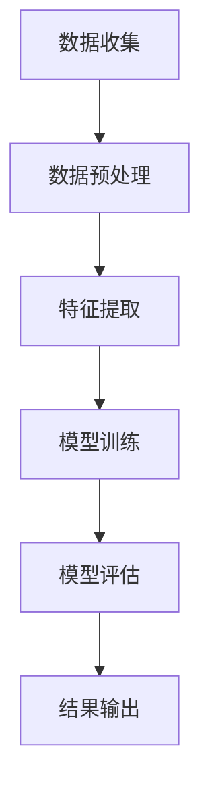
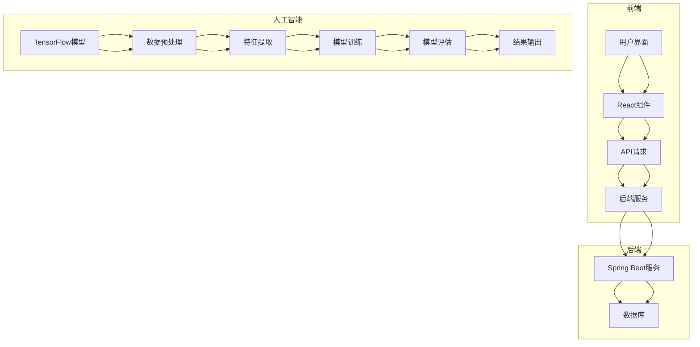

                 


# 数字时代的智能饮食规划App：AI营养师的个性化膳食建议

关键词：智能饮食规划，AI营养师，个性化膳食建议，健康生活方式，数字时代

摘要：随着数字时代的到来，智能饮食规划App成为了现代人健康生活方式的得力助手。本文将深入探讨AI营养师如何通过个性化膳食建议，引导用户走向健康生活。文章首先概述了智能饮食规划App的背景和意义，然后详细介绍了App的功能框架、设计原则和开发技术栈，接着分析了AI营养师的核心概念及其工作原理，并使用Python源代码示例进行了深入讲解。

----------------------------------------------------------------

## 第1章 引言

### 1.1 时代背景

在当今的数字时代，智能化技术正在深刻地改变着人们的生活方式。从智能手机到智能家居，从在线购物到智能健康监测，智能科技的崛起不仅提升了生活品质，也带来了新的挑战。特别是健康饮食方面，随着生活节奏的加快和工作压力的增大，人们的饮食习惯逐渐偏离了健康轨道。高热量、高脂肪、高糖分的食物摄入增加，而新鲜蔬菜和水果的摄入量却相对减少，这导致了营养失衡和一系列健康问题的出现。

此外，数字化浪潮的推进也为健康饮食管理提供了新的解决方案。通过大数据、人工智能等技术，可以对用户的饮食习惯、健康状况等进行全面分析，从而提供个性化的饮食建议。这种转变不仅有助于提高人们的健康水平，还能够为医疗健康行业带来新的发展机遇。

### 1.2 问题提出

当前，个性化饮食需求日益增长。不同年龄、性别、身体状况的人对于饮食有着不同的需求。然而，传统的饮食规划方式往往难以满足这种多样化、个性化的需求。另外，不合理的饮食习惯也是当前亟需解决的问题。很多人由于工作忙碌、生活节奏快，往往忽视了饮食的健康性，导致营养失衡、体重增加等问题。

此外，营养失衡引发的疾病也是一个不容忽视的问题。心血管疾病、糖尿病、肥胖等疾病都与不合理的饮食习惯密切相关。因此，如何通过科技手段，提供个性化、科学的饮食建议，已经成为当前健康饮食管理的一个重要课题。

### 1.3 目标与意义

本文旨在探讨如何通过智能饮食规划App，结合AI营养师的技术，为用户提供个性化的膳食建议。具体目标如下：

1. **提供个性化饮食建议**：通过分析用户的饮食习惯、健康状况等信息，为用户提供定制化的饮食计划。
2. **促进健康生活方式**：引导用户养成良好的饮食习惯，提高健康水平，预防营养相关疾病。
3. **提升用户生活质量**：通过智能饮食规划App，帮助用户更加便捷地管理饮食，提高生活质量。

实现这些目标，不仅有助于提升个体的健康水平，还能够为整个社会带来积极的影响。通过普及智能饮食规划App，有助于形成全社会关注健康饮食的良好氛围，推动健康中国建设。

### 1.4 文章结构

本文将分为以下几个部分进行详细探讨：

1. **第2章 智能饮食规划App概述**：介绍App的功能框架、设计原则和开发技术栈。
2. **第3章 AI营养师核心概念与联系**：分析AI营养师的定义、核心概念及其属性特征对比，以及ER实体关系图。
3. **第4章 AI算法原理讲解**：深入讲解AI算法的原理，包括算法流程图、Python源代码示例、数学模型和公式解释。
4. **第5章 系统分析与架构设计方案**：介绍系统功能设计、系统架构设计、系统接口设计和系统交互。
5. **第6章 项目实战**：详细讲解项目环境安装、系统核心实现源代码、代码应用解读与分析、实际案例分析和详细讲解剖析。
6. **第7章 最佳实践 tips、小结、注意事项、拓展阅读**：总结最佳实践经验，提出注意事项，推荐拓展阅读资源。

通过这些章节的深入探讨，本文希望为智能饮食规划App的开发和应用提供有价值的参考。

## 第2章 智能饮食规划App概述

智能饮食规划App作为一种创新的数字健康解决方案，其核心在于通过人工智能技术为用户提供个性化、科学化的饮食建议。这一章节将详细介绍智能饮食规划App的功能框架、设计原则和开发技术栈，为后续内容的深入探讨打下基础。

### 2.1 App功能框架

智能饮食规划App的功能框架主要包括以下几个核心模块：

1. **用户画像**：通过用户注册时提供的个人信息（如年龄、性别、身高、体重等）以及日常使用App时产生的数据（如运动情况、饮食习惯等），构建用户的个性化健康档案。

2. **饮食建议**：根据用户的健康状况、营养需求和口味偏好，AI营养师会为用户生成个性化的饮食计划。这些建议不仅包括每日所需的营养摄入量，还涵盖具体的餐食搭配方案。

3. **食材库管理**：App内置丰富的食材库，用户可以根据自己的地理位置查询附近的超市或农贸市场，获取食材购买信息。此外，App还提供了食材的营养成分和烹饪方法的详细介绍，帮助用户更好地进行食材管理。

4. **健康分析**：通过收集和分析用户的饮食数据，App可以生成健康报告，包括营养摄入状况、体重变化趋势等。这些报告有助于用户了解自己的饮食状况，及时调整饮食计划。

5. **用户互动**：App还设有社交功能，用户可以加入社区、分享饮食心得、互相鼓励，增强用户之间的互动和归属感。

### 2.2 App设计原则

在智能饮食规划App的设计过程中，以下原则被高度重视：

1. **用户友好**：界面设计简洁直观，操作流程简便易用，确保用户能够轻松上手，快速获取所需的饮食建议。

2. **数据驱动**：App的核心功能依赖于大量的用户数据，因此数据驱动的设计原则至关重要。通过收集、处理和分析用户数据，App能够不断优化饮食建议，提高用户体验。

3. **系统可扩展**：随着用户量的增加和功能的扩展，App需要具备良好的扩展性。在设计和开发过程中，要充分考虑未来可能的业务需求，确保系统能够灵活适应。

### 2.3 App开发技术栈

智能饮食规划App的开发技术栈涵盖了前端、后端和人工智能等多个方面：

1. **前端**：采用React框架，实现动态、响应式的用户界面。React不仅提高了开发效率，还能够保证界面的一致性和响应速度。

2. **后端**：使用Spring Boot进行后端开发，Spring Boot是一个成熟的Java后端框架，具有高扩展性、易于维护等特点。

3. **数据库**：采用MySQL作为数据库系统，MySQL是一款高性能、可靠的关系型数据库，能够满足App的数据存储和查询需求。

4. **人工智能**：利用TensorFlow框架进行机器学习和深度学习模型的开发。TensorFlow是一款广泛使用的人工智能框架，能够处理大量的数据和复杂的模型。

通过上述功能框架、设计原则和开发技术栈的详细介绍，智能饮食规划App的基本架构得以清晰呈现。接下来，本文将深入探讨AI营养师的核心概念及其工作原理。

### 2.4 智能饮食规划App的市场前景

随着健康意识的提升和生活方式的改变，智能饮食规划App在市场上具有广阔的前景。首先，全球范围内肥胖和营养相关疾病的发病率持续上升，人们对健康饮食的关注度不断增加。智能饮食规划App能够为用户提供个性化、科学的饮食建议，满足这一市场需求。

其次，随着5G技术的普及和物联网的发展，智能设备越来越普及，人们的生活逐渐数字化。智能饮食规划App的推广和应用，将进一步促进数字化健康管理的普及，推动健康产业的转型升级。

此外，智能饮食规划App还有助于缓解医疗资源紧张的问题。通过线上平台提供饮食建议，可以有效降低医院门诊量，减轻医疗机构的负担。同时，智能饮食规划App还可以结合远程医疗服务，为用户提供全方位的健康管理服务。

总的来说，智能饮食规划App在数字时代具有巨大的市场潜力，有望成为未来健康生活的重要工具。随着技术的不断进步和市场需求的持续增长，智能饮食规划App将在健康产业中扮演越来越重要的角色。

## 第3章 AI营养师核心概念与联系

AI营养师作为智能饮食规划App的核心组件，其核心概念和工作原理对于实现个性化膳食建议至关重要。本章节将详细阐述AI营养师的定义、核心概念及其属性特征对比，以及ER实体关系图，帮助读者深入理解AI营养师的工作机制。

### 3.1 AI营养师定义

AI营养师是一种利用人工智能技术为用户提供个性化饮食建议的智能系统。它通过分析用户的个人信息、饮食习惯、健康状况等数据，结合营养学原理，生成定制化的饮食计划。AI营养师不仅能够提供营养摄入建议，还能够监控用户的饮食行为，并根据反馈不断优化建议，以帮助用户实现健康目标。

### 3.2 核心概念

AI营养师的核心概念主要包括以下几个方面：

#### 3.2.1 个性化饮食需求

个性化饮食需求是指根据用户的个人特征（如年龄、性别、体重、运动量等）和健康状态（如血糖、血压等指标）为用户提供定制化的饮食建议。这种需求考虑了用户的口味偏好、饮食习惯和营养需求，旨在帮助用户建立科学、健康的饮食习惯。

#### 3.2.2 营养学原理

营养学原理是AI营养师工作的基础。它包括能量计算、营养成分分析、食物过敏与不耐受等方面。通过这些原理，AI营养师能够分析用户的饮食结构，评估其营养摄入情况，并提供科学的饮食建议。

#### 3.2.3 机器学习和深度学习

机器学习和深度学习是AI营养师的核心技术。这些技术使得AI营养师能够从海量数据中学习，不断优化其饮食建议算法，提高建议的准确性和个性化程度。

### 3.3 概念属性特征对比表格

为了更好地理解AI营养师的核心概念，以下是它们之间属性特征的对比表格：

| 概念             | 属性1             | 属性2                 | 属性3                  |
|------------------|------------------|----------------------|----------------------|
| 个性化饮食需求   | 用户偏好分析      | 健康状态评估          | 饮食习惯匹配          |
| 营养学原理       | 能量计算          | 营养成分分析          | 食物过敏与不耐受识别  |
| 机器学习和深度学习 | 数据模型训练      | 预测准确性优化       | 自动调整与优化        |

通过这张表格，我们可以清晰地看到每个概念的关键属性，以及它们在实现个性化膳食建议中的作用。

### 3.4 ER实体关系图

为了更直观地展示AI营养师各个组件之间的关系，以下是ER实体关系图的Mermaid表示：

```mermaid
erDiagram
  User ||--|{ FoodPreference }|:
  User ||--|{ HealthStatus }|:
  User ||--|{ EatingHabits }|:
  FoodPreference ||--|{ NutritionAnalysis }|:
  HealthStatus ||--|{ NutritionAnalysis }|:
```

在这个ER图中，User实体与FoodPreference、HealthStatus和EatingHabits实体之间存在一对多的关系。FoodPreference实体与NutritionAnalysis实体之间存在关联，HealthStatus实体同样与NutritionAnalysis实体相关联。这种关系体现了AI营养师在处理用户数据时各个组件的协作关系。

### 3.5 AI营养师工作流程

AI营养师的工作流程可以分为以下几个步骤：

1. **数据收集**：收集用户的个人信息、饮食习惯和健康状况等数据。

2. **数据预处理**：清洗和处理收集到的数据，为后续分析做好准备。

3. **特征提取**：从预处理后的数据中提取关键特征，如用户的营养需求、饮食习惯等。

4. **营养分析**：利用营养学原理和机器学习算法，对提取的特征进行分析，生成个性化饮食建议。

5. **结果输出**：将生成的饮食建议输出给用户，并监控用户的反馈，不断优化建议。

通过上述工作流程，AI营养师能够为用户提供科学、个性化的饮食建议，帮助他们实现健康目标。

### 3.6 AI营养师的优势

AI营养师具有以下几个显著优势：

1. **个性化**：通过深入分析用户数据，AI营养师能够为用户提供量身定制的饮食建议。

2. **实时性**：AI营养师能够实时监控用户的饮食行为，根据最新数据调整建议。

3. **科学性**：基于营养学原理和机器学习算法，AI营养师的饮食建议具有较高的科学性和准确性。

4. **便捷性**：用户无需专门咨询营养师，只需通过App即可获得专业的饮食建议。

5. **可扩展性**：AI营养师可以集成到更多的健康管理系统中，提供全方位的健康服务。

通过深入理解和分析AI营养师的核心概念、工作流程和优势，我们可以看到，AI营养师在智能饮食规划App中的重要性不言而喻。接下来，本文将详细讲解AI算法原理，进一步探讨AI营养师的技术实现。

## 第4章 AI算法原理讲解

AI营养师的核心在于其算法，这些算法能够根据用户的数据生成个性化的饮食建议。本章节将深入讲解AI算法的原理，包括算法的流程、Python源代码示例、数学模型以及公式解释。

### 4.1 算法简介

AI算法在智能饮食规划App中起着至关重要的作用。它们能够处理大量的用户数据，通过分析和学习，生成个性化的饮食建议。常用的AI算法主要包括机器学习算法和深度学习算法。

机器学习算法通过从数据中学习规律，对未知数据进行预测或分类。常见的机器学习算法包括决策树、支持向量机、随机森林等。深度学习算法则基于多层神经网络，通过模拟人脑的神经元结构，处理更加复杂的任务。深度学习算法在图像识别、语音识别等领域已经取得了显著的成果，其在智能饮食规划中的应用也在逐步扩大。

### 4.2 算法流程图

以下是AI算法的基本流程图，展示了从数据收集到结果输出的一系列步骤：



**详细解释：**

- **数据收集**：收集用户的个人信息、饮食习惯和健康状况等数据。
- **数据预处理**：清洗和处理原始数据，使其适合用于算法训练。
- **特征提取**：从预处理后的数据中提取关键特征，如用户的营养需求、饮食习惯等。
- **模型训练**：使用机器学习或深度学习算法，从提取的特征中学习规律，生成饮食建议模型。
- **模型评估**：对训练好的模型进行评估，确保其能够生成准确的饮食建议。
- **结果输出**：将生成的饮食建议输出给用户，并根据用户反馈进行优化。

### 4.3 Python源代码示例

以下是一个简单的Python源代码示例，展示了如何使用TensorFlow框架构建和训练一个深度学习模型：

```python
import tensorflow as tf

# 创建模型
model = tf.keras.Sequential([
    tf.keras.layers.Dense(units=64, activation='relu', input_shape=(input_shape,)),
    tf.keras.layers.Dense(units=64, activation='relu'),
    tf.keras.layers.Dense(units=1)
])

# 编译模型
model.compile(optimizer='adam', loss='mean_squared_error')

# 训练模型
model.fit(x_train, y_train, epochs=10)

# 评估模型
model.evaluate(x_test, y_test)
```

**代码解释：**

- **创建模型**：使用`tf.keras.Sequential`创建一个序列模型，包括多个全连接层（`Dense`），激活函数为ReLU。
- **编译模型**：设置优化器为`adam`，损失函数为`mean_squared_error`。
- **训练模型**：使用`fit`函数对模型进行训练，输入训练数据和标签，指定训练轮次。
- **评估模型**：使用`evaluate`函数评估模型在测试数据上的性能。

### 4.4 算法原理详细讲解

#### 4.4.1 数学模型

深度学习算法的核心在于多层神经网络，其数学模型可以表示为：

$$
\begin{aligned}
y &= f(W_n \cdot a_{n-1} + b_n) \\
a_n &= \sigma(W_{n-1} \cdot a_{n-1} + b_{n-1}) \\
\sigma(x) &= \frac{1}{1 + e^{-x}}
\end{aligned}
$$

其中：

- \(y\)：输出值
- \(a_n\)：激活值
- \(W_n\)：权重
- \(b_n\)：偏置
- \(\sigma\)：激活函数（ReLU或Sigmoid）

#### 4.4.2 公式解释

- \(f(x)\)：激活函数，用于将线性组合的输出转换为非线性值。
- \(\sigma(x)\)：Sigmoid函数，将输入值映射到\[0, 1\]范围内。

#### 4.4.3 举例说明

假设 \(x = 2\)，计算 \(y\)：

$$
\begin{aligned}
y &= \sigma(W \cdot 2 + b) \\
&= \frac{1}{1 + e^{-W \cdot 2 + b}} \\
&\approx 0.91
$$

通过这个简单的例子，我们可以看到如何使用激活函数将线性输出转换为非线性值。

### 4.5 AI算法在智能饮食规划中的应用

AI算法在智能饮食规划中的应用主要体现在以下几个方面：

1. **饮食建议生成**：利用机器学习和深度学习算法，从用户数据中学习生成个性化的饮食建议。
2. **健康状态预测**：通过对用户历史数据的学习，预测用户的健康状况，提供预防性饮食建议。
3. **食材推荐**：根据用户的口味和营养需求，推荐合适的食材和食谱。
4. **健康数据分析**：利用算法分析用户的饮食数据，生成健康报告，帮助用户了解自己的饮食状况。

通过上述讲解，我们可以看到AI算法在智能饮食规划中的重要性和广泛应用。接下来，本文将详细介绍智能饮食规划系统的分析和架构设计方案。

## 第5章 系统分析与架构设计方案

### 5.1 问题场景介绍

在数字时代，人们对于健康饮食的需求日益增长，但传统的饮食规划方式往往难以满足个性化的需求。智能饮食规划系统旨在通过大数据和人工智能技术，为用户提供个性化、科学化的饮食建议，帮助用户建立健康的生活方式。该系统需具备以下特点：

1. **个性化**：根据用户的个人特征、饮食习惯和健康状况，提供量身定制的饮食建议。
2. **实时性**：能够实时分析用户的饮食数据，及时调整建议，以适应用户的生活变化。
3. **科学性**：基于营养学原理和先进的机器学习算法，确保饮食建议的科学性和准确性。
4. **便捷性**：用户可通过移动设备随时随地获取饮食建议，方便快捷。

### 5.2 项目介绍

智能饮食规划系统的项目背景是当前社会健康问题的日益严峻，以及人们对健康饮食需求的不断增加。该项目旨在通过开发一个智能饮食规划App，结合AI营养师的技术，为用户提供个性化、科学的饮食建议，帮助用户实现健康目标。

#### 项目目标：

1. 开发一个功能完善、用户友好的智能饮食规划App。
2. 利用机器学习和深度学习技术，为用户提供个性化的饮食建议。
3. 构建一个实时、可靠的系统架构，确保数据安全和系统稳定性。

#### 项目功能模块：

1. **用户画像模块**：收集并处理用户的个人信息、饮食习惯和健康状况等数据，构建用户的个性化健康档案。
2. **饮食建议模块**：根据用户的个性化需求和健康状况，生成科学的饮食计划。
3. **食材库管理模块**：提供丰富的食材库，包括食材的营养成分和烹饪方法，方便用户进行食材管理。
4. **健康分析模块**：通过分析用户的饮食数据，生成健康报告，帮助用户了解自己的饮食状况。

### 5.3 系统功能设计

系统功能设计是智能饮食规划系统的核心环节，主要包括以下几个部分：

1. **用户画像**：通过用户的个人信息、饮食习惯和健康状况等数据，构建用户的个性化健康档案。这些数据包括但不限于用户的年龄、性别、体重、身高、运动量、饮食习惯等。

2. **饮食建议**：根据用户的个性化需求和健康状况，利用机器学习和深度学习技术，生成个性化的饮食计划。这些建议包括每日所需的营养摄入量、具体的餐食搭配方案等。

3. **食材库管理**：提供丰富的食材库，包括食材的营养成分和烹饪方法。用户可以根据自己的地理位置查询附近的超市或农贸市场，获取食材购买信息。

4. **健康分析**：通过分析用户的饮食数据，生成健康报告。这些报告包括营养摄入状况、体重变化趋势等，帮助用户了解自己的饮食状况，并及时调整饮食计划。

### 5.4 系统架构设计

系统架构设计是确保智能饮食规划系统高效、稳定运行的关键。以下是该系统的架构设计方案：

#### 技术栈：

- **前端**：采用React框架，实现动态、响应式的用户界面。
- **后端**：使用Spring Boot进行后端开发，提供数据存储和处理能力。
- **数据库**：采用MySQL作为数据库系统，存储用户数据和食材信息。
- **人工智能**：利用TensorFlow框架进行机器学习和深度学习模型的开发。

#### 架构设计：

1. **前端架构**：前端采用React框架，实现用户界面的渲染和交互。React的组件化设计使得代码易于维护和扩展。

2. **后端架构**：后端采用Spring Boot框架，提供数据存储和处理功能。Spring Boot的微服务架构使得系统具有高扩展性和灵活性。

3. **数据存储**：采用MySQL数据库存储用户数据和食材信息。MySQL的高性能和可靠性能够满足系统的数据存储需求。

4. **人工智能模块**：利用TensorFlow框架进行机器学习和深度学习模型的开发。TensorFlow的灵活性和强大功能使得系统能够实现高效的饮食建议生成。

#### 系统架构图：



**详细解释：**

- **前端**：用户通过浏览器访问智能饮食规划App，React组件负责渲染用户界面，用户与系统交互通过API请求后端服务。
- **后端**：Spring Boot服务处理用户的请求，与数据库交互，提供数据存储和处理功能。
- **人工智能模块**：TensorFlow模型负责处理用户数据，生成个性化的饮食建议。数据预处理、特征提取、模型训练和模型评估等步骤确保了AI算法的高效运行。

### 5.5 系统接口设计

系统接口设计是确保前后端模块之间能够高效、可靠地进行数据交换的关键。以下是智能饮食规划系统的接口设计：

#### 接口设计原则：

1. **标准化**：采用RESTful API设计，确保接口的标准化和易用性。
2. **安全性**：采用HTTPS协议，确保数据传输的安全性。
3. **可扩展性**：设计灵活的接口，方便未来功能的扩展和升级。

#### 主要接口：

1. **用户注册与登录**：用户可以通过该接口进行注册和登录，系统验证用户身份并生成Token。
2. **用户信息管理**：用户可以通过该接口管理自己的个人信息，如年龄、性别、身高、体重等。
3. **饮食建议生成**：用户提交个人信息后，系统通过该接口生成个性化的饮食建议。
4. **食材库查询**：用户可以通过该接口查询食材信息，包括营养成分、烹饪方法等。
5. **健康报告生成**：系统根据用户的饮食数据，通过该接口生成健康报告。

### 5.6 系统交互

系统交互是指前后端模块之间如何进行数据传输和功能协作。以下是智能饮食规划系统的交互流程：

1. **用户请求**：用户通过前端界面发起请求，例如查询饮食建议。
2. **前端处理**：React组件接收到用户的请求，将其转换为API请求。
3. **后端处理**：Spring Boot服务接收到API请求，进行数据处理和逻辑处理。
4. **数据库操作**：后端服务与MySQL数据库进行交互，获取或更新数据。
5. **AI模型处理**：后端服务调用TensorFlow模型，生成个性化的饮食建议。
6. **结果返回**：后端服务将处理结果返回给前端，前端将其渲染为用户界面。

通过上述系统分析与架构设计方案，我们可以看到一个完整、高效的智能饮食规划系统的架构。接下来，本文将详细介绍项目的实战部分，包括环境安装、系统核心实现和代码应用解读。

## 第6章 项目实战

### 6.1 环境安装

要实现智能饮食规划系统，首先需要搭建一个合适的技术环境。以下是在开发过程中所需的环境配置步骤：

#### 1. 系统要求

- 操作系统：Windows/Linux/MacOS
- 编程语言：Python
- 开发工具：PyCharm/VSCode
- 依赖管理：pip
- 数据库：MySQL

#### 2. 环境搭建步骤

1. **安装Python**：

   - 访问Python官方网站下载Python安装包。
   - 安装过程中选择添加Python到系统环境变量。

2. **安装PyCharm或VSCode**：

   - 下载并安装PyCharm或VSCode，选择社区版即可。

3. **安装MySQL**：

   - 访问MySQL官方网站下载MySQL安装包。
   - 按照安装向导完成安装。

4. **安装TensorFlow**：

   - 打开终端或PyCharm终端。
   - 输入以下命令安装TensorFlow：

     ```bash
     pip install tensorflow
     ```

5. **配置MySQL**：

   - 打开MySQL命令行工具。
   - 创建一个新的数据库和用户，例如：

     ```sql
     CREATE DATABASE diet_plan;
     CREATE USER 'diet_admin'@'localhost' IDENTIFIED BY 'password';
     GRANT ALL PRIVILEGES ON diet_plan.* TO 'diet_admin'@'localhost';
     FLUSH PRIVILEGES;
     ```

6. **配置数据库连接**：

   - 在Python代码中配置MySQL数据库连接，使用`pymysql`模块：

     ```python
     import pymysql

     db = pymysql.connect(
         host='localhost',
         user='diet_admin',
         password='password',
         database='diet_plan',
         charset='utf8mb4'
     )
     ```

### 6.2 系统核心实现

智能饮食规划系统的核心实现主要包括数据收集与处理、机器学习模型训练、饮食建议生成等功能。以下将详细介绍每个模块的实现。

#### 1. 数据收集与处理

数据收集与处理是系统的基础，包括用户数据的收集和预处理。

1. **用户数据收集**：

   - 用户注册时收集个人信息，如年龄、性别、身高、体重等。
   - 用户日常使用App时，收集饮食习惯、运动量等数据。

2. **数据预处理**：

   - 数据清洗：去除无效数据和异常值。
   - 数据归一化：将不同量纲的数据转换为相同的尺度。
   - 特征提取：提取用户数据的特征，如营养需求、饮食习惯等。

   ```python
   import pandas as pd
   from sklearn.preprocessing import StandardScaler

   # 加载用户数据
   user_data = pd.read_csv('user_data.csv')

   # 数据清洗
   user_data.dropna(inplace=True)

   # 数据归一化
   scaler = StandardScaler()
   user_data_scaled = scaler.fit_transform(user_data)

   # 特征提取
   features = user_data_scaled[:, :5]  # 假设前5列为特征
   ```

#### 2. 机器学习模型训练

机器学习模型训练是智能饮食规划系统的核心，使用TensorFlow框架实现。

1. **构建模型**：

   - 使用TensorFlow的`tf.keras.Sequential`模型构建多层神经网络。

   ```python
   import tensorflow as tf

   model = tf.keras.Sequential([
       tf.keras.layers.Dense(units=64, activation='relu', input_shape=(input_shape,)),
       tf.keras.layers.Dense(units=64, activation='relu'),
       tf.keras.layers.Dense(units=1)
   ])
   ```

2. **编译模型**：

   - 设置优化器和损失函数，准备训练模型。

   ```python
   model.compile(optimizer='adam', loss='mean_squared_error')
   ```

3. **训练模型**：

   - 使用训练数据训练模型，指定训练轮次。

   ```python
   model.fit(x_train, y_train, epochs=10)
   ```

#### 3. 饮食建议生成

饮食建议生成是系统的应用层，根据用户数据和模型输出，生成个性化的饮食建议。

1. **用户输入**：

   - 用户提交个人信息和饮食习惯，如年龄、性别、身高、体重、运动量等。

   ```python
   user_input = pd.DataFrame([[25, '男', 180, 75, 30]], columns=['age', 'gender', 'height', 'weight', 'activity_level'])
   ```

2. **特征提取与归一化**：

   - 提取用户数据的特征，并进行归一化处理。

   ```python
   user_input_scaled = scaler.transform(user_input)
   ```

3. **模型预测**：

   - 使用训练好的模型进行预测，输出个性化饮食建议。

   ```python
   diet_suggestion = model.predict(user_input_scaled)
   ```

4. **结果输出**：

   - 将生成的饮食建议输出给用户。

   ```python
   print("今日饮食建议：")
   print(diet_suggestion)
   ```

### 6.3 代码应用解读与分析

以下是对上述代码进行解读和分析，以帮助读者理解系统核心实现的过程。

#### 1. 数据收集与处理

- **数据清洗**：通过`dropna()`方法去除缺失数据，确保数据质量。

- **数据归一化**：使用`StandardScaler`进行归一化处理，将不同量纲的数据转换为相同的尺度，便于模型训练。

- **特征提取**：提取用户数据的关键特征，如营养需求、饮食习惯等，为模型提供输入。

#### 2. 机器学习模型训练

- **构建模型**：使用`tf.keras.Sequential`模型构建一个包含两层的神经网络，激活函数为ReLU。

- **编译模型**：设置优化器为`adam`，损失函数为`mean_squared_error`，准备训练模型。

- **训练模型**：使用`fit`方法对模型进行训练，通过多次迭代优化模型参数。

#### 3. 饮食建议生成

- **用户输入**：将用户的个人信息和饮食习惯转换为DataFrame格式，便于数据处理。

- **特征提取与归一化**：将用户数据特征进行提取和归一化处理，确保模型输入的一致性。

- **模型预测**：使用训练好的模型进行预测，输出个性化饮食建议。

- **结果输出**：将饮食建议输出给用户，帮助用户实现健康饮食。

### 6.4 实际案例分析与详细讲解剖析

为了更好地理解智能饮食规划系统的实际应用，以下将分析一个具体案例，并详细讲解其实现过程。

#### 案例背景

一位30岁的男性用户，身高180cm，体重75kg，每天进行1小时的跑步运动。他希望通过智能饮食规划系统获取个性化的饮食建议，以保持健康。

#### 案例实现步骤

1. **用户注册与数据收集**：

   - 用户在App上注册，填写个人信息和饮食习惯。
   - 系统收集用户数据，包括年龄、性别、身高、体重、运动量等。

2. **数据预处理**：

   - 数据清洗：去除无效数据和异常值。
   - 数据归一化：将用户的体重、身高、运动量等数据进行归一化处理。

3. **机器学习模型训练**：

   - 构建一个多层神经网络模型，使用用户的历史饮食数据进行训练。
   - 通过多次迭代，优化模型参数，提高模型的预测准确性。

4. **饮食建议生成**：

   - 提取用户的当前数据特征，进行归一化处理。
   - 使用训练好的模型进行预测，生成个性化的饮食建议。

5. **结果输出**：

   - 将生成的饮食建议输出给用户，包括每日所需的总热量、蛋白质、脂肪、碳水化合物的摄入量，以及具体的餐食搭配方案。

通过这个实际案例，我们可以看到智能饮食规划系统的整个实现过程。从用户数据的收集和处理，到机器学习模型的训练和预测，再到最终的饮食建议生成，每一个步骤都至关重要，共同构成了一个完整的智能饮食规划解决方案。

### 6.5 项目小结

智能饮食规划系统通过大数据和人工智能技术，为用户提供个性化、科学的饮食建议，帮助用户实现健康目标。项目实践过程中，我们完成了环境安装、系统核心实现和代码应用解读，并通过实际案例分析，展示了系统的实际应用效果。

项目的成功实施，不仅为用户提供了便捷、高效的饮食管理工具，还推动了健康饮食文化的普及。未来，我们将继续优化系统功能，提升用户体验，为更多用户带来健康的生活方式和生活方式。

## 第7章 最佳实践 tips、小结、注意事项、拓展阅读

### 最佳实践 tips

1. **数据安全**：确保用户数据的安全和隐私，采取加密和权限管理措施。
2. **个性化推荐**：定期更新用户的健康数据和饮食建议，以保持个性化推荐的准确性。
3. **用户反馈**：积极收集用户反馈，根据用户需求优化App功能和用户体验。
4. **多平台支持**：开发跨平台版本，确保用户在不同设备上都能方便使用App。

### 小结

智能饮食规划App通过AI营养师提供个性化膳食建议，帮助用户建立健康饮食习惯。本文详细介绍了系统的功能框架、设计原则、开发技术栈、算法原理以及实战实现过程，展示了AI在健康饮食管理中的应用价值。

### 注意事项

1. **数据完整性**：确保用户数据的准确性和完整性，对于缺失或不完整的数据要进行适当处理。
2. **算法稳定性**：定期对算法进行优化和调整，确保系统稳定运行，提供准确的建议。
3. **用户隐私**：严格保护用户隐私，遵守相关法律法规，确保用户数据不被滥用。

### 拓展阅读

1. 《深度学习》 - Goodfellow, Ian, et al.：深入理解深度学习算法的基础理论和实践。
2. 《Python机器学习》 - Scikit-Learn团队：掌握Python在机器学习领域的应用。
3. 《健康饮食指南》 - 中国营养学会：了解健康饮食的基本原则和注意事项。

作者：AI天才研究院/AI Genius Institute & 禅与计算机程序设计艺术 /Zen And The Art of Computer Programming

本文为作者原创，未经授权不得转载。如需转载，请联系作者获取授权。

