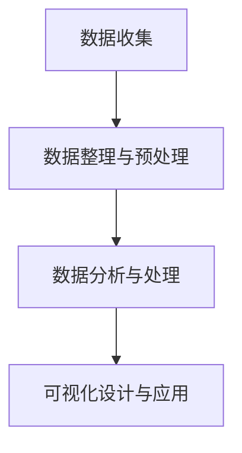

                 

### 第1章：引言

#### 1.1 环保行动的背景和现状

随着全球气候变化和环境问题的日益严重，环保行动已经成为全球各国和各行业的共同关注点。环境问题不仅威胁到人类的健康和生存，也影响到地球的生态平衡和可持续发展。近年来，随着科技的发展，数字技术开始广泛应用于环保行动中，尤其是在碳排放监测、能源管理和资源优化等方面。

首先，环境问题对人类的影响不容忽视。空气污染、水污染、土壤退化等问题导致了大量疾病的爆发和生态系统的破坏。例如，空气中的PM2.5和氮氧化物等污染物与呼吸道疾病和心血管疾病有直接关系；水污染则导致了饮用水安全问题，影响人类健康和农业生产；土壤退化则使得农作物的产量和质量下降，威胁到粮食安全。

环保行动的意义和必要性在于，通过减少碳排放和污染，保护地球的生态环境，确保人类的可持续发展。环保行动可以采取多种形式，包括政策法规制定、技术研发、公众教育和国际合作等。政策法规方面，各国政府和国际组织纷纷出台了严格的环保法规，以限制污染排放和鼓励绿色技术的发展。技术研发方面，绿色能源、新能源汽车和环保材料等技术的进步为环保行动提供了强有力的支持。公众教育方面，通过媒体和社交网络等渠道，提高公众的环保意识和行动力。国际合作方面，各国政府和企业通过共同合作，共同应对全球性的环境问题。

数字技术在环保行动中的应用发挥着至关重要的作用。首先，传感器和物联网技术使得环境监测和数据收集变得更加便捷和高效。通过部署大量的传感器，可以实时监测空气、水和土壤等环境参数，快速识别和预警污染事件。其次，大数据和人工智能技术可以对环境数据进行深入分析和挖掘，发现污染源和污染途径，提出科学的减排和治理策略。例如，通过对交通流量的数据分析和建模，可以优化交通管理，减少交通拥堵和尾气排放。此外，数字技术还可以用于环保教育和宣传，通过虚拟现实、增强现实和游戏化等技术手段，提高公众的环保意识和参与度。

#### 1.2 个人碳足迹的概念与影响

个人碳足迹是指个人在日常生活中所产生的二氧化碳排放量，包括能源消费、交通出行、生活消费等方面。个人碳足迹的计算方法通常基于能源消耗和碳排放系数的乘积，具体计算方法将在后续章节中详细讨论。

个人碳足迹对环境的影响是多方面的。首先，个人碳足迹直接影响到全球碳排放量。根据联合国环境规划署的数据，全球二氧化碳排放的约70%来自于个人消费行为，这包括住房、交通、食品和商品购买等。因此，个人的生活方式和行为习惯对碳排放量有着直接的影响。其次，个人碳足迹还影响到全球气候变化。大量的二氧化碳排放导致温室效应加剧，使得全球气温上升，极端气候事件频繁发生，如洪水、干旱、台风和热浪等。此外，个人碳足迹还影响到生态系统的健康。例如，过度的森林砍伐和土地开发导致了生物多样性的丧失和生态系统的破坏。

#### 1.3 可视化管理的作用与优势

可視化管理是一种通过图形化方式展示信息和数据的方法，它可以帮助用户更好地理解和分析复杂的数据。在环保行动中，可視化管理尤其重要，因为它能够直观地展示个人碳足迹的构成和变化趋势，从而帮助用户更好地了解自己的碳排放行为，并采取相应的减排措施。

首先，可視化管理的作用在于帮助用户可视化个人碳足迹。通过图形和图表，用户可以清晰地看到自己在能源消费、交通出行、生活消费等方面的碳排放量，以及各个方面的碳排放占比。这样，用户可以更直观地了解自己的碳排放行为，明确减排的重点领域。

其次，可視化管理具有以下优势：
1. **提高数据理解和分析能力**：图形化的数据展示方式使得数据更加直观，用户可以更容易地理解和分析数据，发现潜在的碳排放问题。
2. **促进环保意识和行动力**：通过可视化展示，用户可以更直观地看到自己的碳排放行为对环境的影响，从而提高环保意识和行动力，主动采取减排措施。
3. **帮助制定减排策略**：可视化工具可以提供各种图表和指标，帮助用户分析碳排放数据，制定个性化的减排策略。

然而，可視化管理也面临一些挑战，例如数据收集的准确性、数据处理的复杂性以及可视化设计的直观性等。这些问题需要在实践中逐步解决。

#### 1.4 本书结构安排与内容概述

本书旨在探讨数字时代个人碳足迹的可视化管理，分为五个主要部分。

**第一部分：引言**  
介绍了数字时代环保行动的背景和现状，个人碳足迹的概念和影响，以及可視化管理的作用和优势。这部分为后续章节的内容提供了理论基础和背景信息。

**第二部分：数字时代个人碳足迹计算方法**  
详细介绍了个人碳足迹的计算方法，包括碳排放核算的基本原则、能源消费与碳排放关系、个人碳排放的计算方法和减量化策略。这部分内容帮助读者理解个人碳足迹的计算原理和实施方法。

**第三部分：个人碳足迹可视化工具与应用**  
介绍了常见可视化工具的选择与评估、数据处理与可视化流程、可视化图表的类型与应用，以及可视化工具在个人碳足迹管理中的应用。这部分内容帮助读者掌握如何使用可视化工具进行个人碳足迹的管理和分析。

**第四部分：实战案例**  
通过具体案例研究，展示了个人碳足迹可视化管理在实际中的应用，包括数据收集与整理、碳排放计算与可视化、案例分析讨论以及案例总结与启示。这部分内容为读者提供了实践经验和借鉴。

**第五部分：未来展望与挑战**  
探讨了个人碳足迹可视化管理的未来发展方向，包括新技术的引入与应用，以及面临的挑战和机遇。这部分内容为读者展示了个人碳足迹可视化管理的未来发展前景。

**1.4.1 本书的目的和读者对象**

本书的目的在于：
1. **帮助读者了解个人碳足迹的概念和计算方法**：通过介绍碳排放核算的基本原则、能源消费与碳排放关系、个人碳排放的计算方法和减量化策略，让读者掌握个人碳足迹的计算原理和实施方法。
2. **提升读者的可视化技能**：通过介绍可视化工具的选择与评估、数据处理与可视化流程、可视化图表的类型与应用，让读者学会如何使用可视化工具进行个人碳足迹的管理和分析。
3. **提供实际应用案例**：通过具体案例研究，让读者了解个人碳足迹可视化管理在实际中的应用，从而提高读者的实践能力和解决问题的能力。

本书的读者对象为：
1. **环保行动的爱好者**：对环保行动感兴趣，希望了解个人碳足迹计算和可视化管理的读者。
2. **环保从业人员**：从事环保工作，需要了解个人碳足迹计算和可视化管理技术的从业人员。
3. **计算机技术爱好者**：对可视化技术和数据分析感兴趣，希望将可视化技术应用于环保领域的计算机技术爱好者。

**1.4.2 本书的主要章节内容**

本书的主要章节内容如下：
- **第1章**：引言，介绍数字时代环保行动的背景和现状，个人碳足迹的概念和影响，以及可視化管理的作用和优势。
- **第2章**：数字时代个人碳足迹计算方法，介绍个人碳足迹的计算方法，包括碳排放核算的基本原则、能源消费与碳排放关系、个人碳排放的计算方法和减量化策略。
- **第3章**：个人碳足迹可视化工具与应用，介绍常见可视化工具的选择与评估、数据处理与可视化流程、可视化图表的类型与应用，以及可视化工具在个人碳足迹管理中的应用。
- **第4章**：实战案例，通过具体案例研究，展示个人碳足迹可视化管理在实际中的应用，包括数据收集与整理、碳排放计算与可视化、案例分析讨论以及案例总结与启示。
- **第5章**：未来展望与挑战，探讨个人碳足迹可视化管理的未来发展方向，包括新技术的引入与应用，以及面临的挑战和机遇。

**1.4.3 阅读建议和注意事项**

为了更好地理解和应用本书的内容，读者可以遵循以下阅读建议和注意事项：

1. **系统学习**：本书的结构和内容是相互关联的，建议读者按照章节顺序系统学习，以便更好地理解各个部分的内容和逻辑关系。

2. **结合实践**：本书中的很多概念和理论都是通过实际应用案例来阐述的，建议读者在阅读过程中结合自己的实践经验，加深理解。

3. **拓展阅读**：本书提供了大量的参考文献和拓展阅读，读者可以进一步查阅这些资料，以获取更多的知识和信息。

4. **积极参与**：在阅读过程中，读者可以积极参与讨论和思考，提出自己的疑问和建议，这有助于加深对知识的理解和掌握。

5. **持续更新**：环保和数字技术是一个不断发展的领域，读者需要关注最新的研究和进展，以保持对这一领域的持续了解。

#### 1.5 本章小结

本章介绍了数字时代环保行动的背景和现状，个人碳足迹的概念和影响，以及可視化管理的作用和优势。通过本章的介绍，读者可以初步了解个人碳足迹计算和可视化管理的重要性，以及本书的结构和内容安排。接下来，本书将深入探讨个人碳足迹的计算方法和可视化工具的应用，帮助读者更深入地理解这一领域。希望读者在接下来的阅读中能够有所收获，并对个人碳足迹的可视化管理有更深入的认识。

### 第2章：基础理论

在探讨个人碳足迹计算方法之前，有必要了解一些基础理论，这些理论为我们提供了计算碳排放的科学依据和操作指南。本章将首先介绍碳排放核算的基本原则，然后分析能源消费与碳排放之间的关系，最后探讨个人碳排放的计算方法和减量化策略。

#### 2.1 碳排放核算的基本原则

碳排放核算是指对个人或组织在日常生活中产生的二氧化碳排放量进行量化计算的过程。碳排放核算的基本原则主要包括以下几方面：

1. **国际碳排放核算标准**  
国际碳排放核算标准是指国际上通用的碳排放计算方法，如联合国环境规划署（UNEP）发布的《温室气体排放核算与报告准则》。这些标准提供了统一的计算方法和规则，确保不同组织和个人之间的碳排放数据具有可比性。例如，IPCC（联合国政府间气候变化专门委员会）的标准方法学包括能源活动、工业过程、农业、土地利用变化和林业等活动产生的碳排放计算。

2. **个人碳排放核算的特殊性**  
与大型组织或企业的碳排放核算相比，个人碳排放核算具有特殊性。首先，个人碳排放的计算涉及更多的日常生活细节，如食品消费、交通出行、家庭能源使用等。其次，个人碳排放数据的收集和统计难度较大，因为很多碳排放数据无法直接测量和记录。因此，个人碳排放核算需要采用一些简化的计算方法和估算模型。

#### 2.2 能源消费与碳排放关系

能源消费与碳排放之间存在着密切的关系。不同类型的能源在燃烧过程中会释放出不同量的二氧化碳。以下是几种主要能源消费与碳排放关系的分析：

1. **电力与碳排放**  
电力是现代社会最重要的能源之一，其生产过程产生的碳排放量占全球总碳排放量的一大部分。电力生产主要包括燃煤、燃气、水力、核能和可再生能源等。其中，燃煤发电产生的碳排放量最高，其次是燃气发电。可再生能源如风能、太阳能和水电等在发电过程中几乎不产生二氧化碳，是最清洁的电力生产方式。

2. **交通与碳排放**  
交通领域的能源消费主要包括燃油和电力。燃油消费主要来自汽油和柴油，其燃烧过程会产生大量的二氧化碳。电动汽车的普及可以显著减少交通领域的碳排放，但电力的生产方式也会影响到电动汽车的总体碳排放。例如，使用可再生能源发电的电动汽车比使用化石燃料发电的汽车碳排放更低。

3. **生活消费与碳排放**  
生活消费领域的碳排放主要包括家庭能源使用、食品消费和商品购买等。家庭能源使用如暖气、热水和照明等产生的碳排放主要来自于电力和天然气。食品消费的碳排放主要来自于食品生产和运输过程中的能源消耗和土地使用。商品购买如衣物、家具和电子产品等产生的碳排放主要来自于生产、运输和废弃处理过程。

#### 2.3 个人碳排放的计算方法

个人碳排放的计算方法通常基于能源消耗和碳排放系数的乘积。以下是个人碳排放计算的基本步骤：

1. **数据收集**  
首先，需要收集个人在能源消费、交通出行和生活消费等方面的数据。这些数据可以通过日常记录、能源账单、交通出行记录和购物记录等途径获取。

2. **碳排放系数确定**  
根据不同类型的能源消费、交通出行和生活消费，确定相应的碳排放系数。这些系数可以从相关数据库或文献中获取，如美国环保署（EPA）的碳排放系数数据库。

3. **碳排放计算**  
使用碳排放系数乘以相应的能源消耗量、交通出行距离和商品购买量，计算出各个方面的碳排放量。

4. **汇总计算**  
将各个方面的碳排放量汇总，得到个人的总碳排放量。

以下是一个简单的个人碳排放计算示例：

- **电力消费**：每月用电量为300千瓦时，碳排放系数为0.429千克二氧化碳/千瓦时。
- **交通出行**：每月驾车行驶2000公里，碳排放系数为0.182千克二氧化碳/公里。
- **食品消费**：每月食品消费产生碳排放150千克。

计算过程如下：

- 电力消费碳排放：300千瓦时 \* 0.429千克二氧化碳/千瓦时 = 128.7千克二氧化碳
- 交通出行碳排放：2000公里 \* 0.182千克二氧化碳/公里 = 364千克二氧化碳
- 食品消费碳排放：150千克

总碳排放量：128.7千克 + 364千克 + 150千克 = 642.7千克二氧化碳

#### 2.4 碳排放的减量化策略

减少碳排放是实现环境保护和可持续发展的重要手段。以下是一些常见的碳排放减量化策略：

1. **节能减排技术**  
通过采用节能设备和优化能源使用方式，可以显著减少能源消耗和碳排放。例如，使用节能灯泡、高效空调和变频器等。

2. **可再生能源利用**  
增加可再生能源在能源消费中的比例，可以减少对化石燃料的依赖，降低碳排放。例如，安装太阳能电池板、风力发电机组等。

3. **绿色出行方式**  
鼓励步行、骑行和使用公共交通工具，减少私家车出行，可以降低交通领域的碳排放。此外，推广电动汽车和混合动力汽车，也有助于减少交通排放。

4. **可持续消费**  
通过减少浪费、选择环保产品和回收利用，可以降低生活消费领域的碳排放。例如，减少一次性用品的使用、购买环保认证产品等。

#### 2.5 本章小结

本章介绍了碳排放核算的基本原则，分析了能源消费与碳排放之间的关系，探讨了个人碳排放的计算方法和减量化策略。通过本章的学习，读者可以了解个人碳足迹计算的基础理论和实际操作方法，为后续章节的学习和应用打下坚实的基础。在接下来的章节中，我们将进一步探讨个人碳足迹的可视化管理，帮助读者更好地理解和应用这一技术。

### 第3章：可视化工具介绍

随着环保行动的深入，可视化技术在个人碳足迹管理中扮演着越来越重要的角色。本章将介绍个人碳足迹可视化工具的选择与评估、数据处理与可视化流程、可视化图表的类型与应用，以及这些工具在个人碳足迹管理中的具体应用。通过这些内容，读者可以了解如何使用可视化工具有效地管理和分析个人碳足迹。

#### 3.1 可视化工具的选择与评估

在众多可视化工具中，选择适合个人碳足迹管理的工具是关键。以下是一些常见可视化工具的功能与特点，以及选择这些工具的标准。

1. **功能与特点**

   - **Tableau**：一款功能强大的数据可视化工具，支持多种数据源连接和丰富的图表类型，适合大规模数据处理和复杂分析。
   - **Power BI**：微软推出的商业智能工具，与Microsoft Office集成良好，适用于企业级用户的数据分析和报告生成。
   - **D3.js**：一款基于JavaScript的库，可以创建高度交互和自定义的数据可视化，适用于程序员和开发者。
   - **Google Charts**：谷歌提供的一系列图表库，简单易用，适合快速创建简单和交互式图表。
   - **ECharts**：一款开源的数据可视化库，支持多种图表类型，适合Web应用中的数据展示。

2. **选择标准**

   - **数据处理能力**：选择能够处理大量数据的工具，以确保个人碳足迹数据的准确性和完整性。
   - **图表类型与交互性**：选择提供多种图表类型和交互功能的工具，以便灵活地展示和分析数据。
   - **用户友好性**：选择易于上手和使用的工具，降低学习成本，提高使用效率。
   - **扩展性和定制性**：选择可以自定义和扩展的工具，以满足个人碳足迹管理特定的需求。

3. **评估方法**

   - **功能评估**：通过试用工具的功能，评估其是否符合个人碳足迹管理的要求。
   - **性能评估**：通过测试工具的响应速度和数据处理能力，评估其性能。
   - **用户评估**：通过用户调研和反馈，评估工具的易用性和用户体验。

#### 3.2 数据处理与可视化流程

个人碳足迹的可视化管理涉及数据收集、处理和可视化三个主要环节。以下是一个典型的数据处理与可视化流程：

1. **数据收集**  
   数据收集是个人碳足迹可视化的第一步。数据来源包括日常活动记录、能源账单、交通出行记录、食品消费记录等。这些数据可以通过手动记录、传感器采集和移动应用等方式获取。

2. **数据整理与预处理**  
   收集到的数据通常是不完整和杂乱的，需要通过清洗、整理和转换等预处理步骤，确保数据的准确性和一致性。预处理步骤包括数据去重、缺失值处理、数据类型转换和归一化等。

3. **数据分析与处理**  
   使用统计分析、机器学习等方法对预处理后的数据进行分析，提取关键指标和特征，如碳排放总量、碳排放占比、碳排放趋势等。这些分析结果将为可视化提供重要依据。

4. **可视化设计与应用**  
   根据分析结果和用户需求，设计合适的可视化图表，如条形图、折线图、饼图、热力图等。这些图表应具有清晰的视觉效果和交互功能，帮助用户直观地理解和分析个人碳足迹数据。

以下是一个简单的数据处理与可视化流程图：



#### 3.3 可视化图表的类型与应用

在个人碳足迹管理中，选择合适的可视化图表类型对于数据展示和理解至关重要。以下是几种常见的可视化图表类型及其应用场景：

1. **条形图（Bar Chart）**  
   条形图适合展示各个类别的碳排放量或占比。例如，可以用来比较不同能源消费的碳排放量或不同出行方式的碳排放量。

2. **折线图（Line Chart）**  
   折线图适合展示碳排放量的趋势变化。例如，可以用来展示个人每月或每年的碳排放量变化趋势。

3. **饼图（Pie Chart）**  
   饼图适合展示各个类别的碳排放占比。例如，可以用来展示个人碳足迹中能源消费、交通出行和生活消费等各部分的占比。

4. **热力图（Heatmap）**  
   热力图适合展示碳排放量的分布情况。例如，可以用来展示不同地区的碳排放密度，帮助识别碳排放高发区域。

5. **地理地图（Map）**  
   地理地图适合展示碳排放的地理分布。例如，可以用来展示个人在不同地区的出行产生的碳排放量。

以下是一个使用ECharts库创建的条形图示例，展示个人能源消费的碳排放量：

```javascript
// 基本配置
var chart = echarts.init(document.getElementById('main'));

// 指定图表的配置项和数据
var option = {
  title: {
    text: '能源消费碳排放量'
  },
  tooltip: {},
  legend: {
    data: ['电力', '燃气', '石油']
  },
  xAxis: {
    data: ['电力', '燃气', '石油']
  },
  yAxis: {},
  series: [{
    name: '碳排放量',
    type: 'bar',
    data: [100, 150, 200]
  }]
};

// 使用刚指定的配置项和数据显示图表。
chart.setOption(option);
```

#### 3.4 可视化工具在个人碳足迹管理中的应用

可视化工具在个人碳足迹管理中的应用不仅可以帮助用户更好地理解自己的碳排放行为，还可以提供有效的减排建议和行动指南。以下是可视化工具在个人碳足迹管理中的具体应用：

1. **碳排放量展示**  
   可视化工具可以实时展示个人的碳排放量，包括总的碳排放量和各个类别的碳排放量。这有助于用户了解自己的碳排放水平，明确减排的目标和重点。

2. **碳排放趋势分析**  
   通过折线图等图表，可视化工具可以展示个人碳排放量的时间趋势。这有助于用户识别碳排放的波动原因，如季节性变化、生活习惯改变等。

3. **碳排放对比分析**  
   通过条形图或饼图，可视化工具可以展示个人在不同类别或不同时间段内的碳排放量对比。这有助于用户识别高碳排放的领域，制定有针对性的减排措施。

4. **减排建议与行动指南**  
   可视化工具可以根据用户的碳排放数据，提供个性化的减排建议和行动指南。例如，建议用户减少高碳排放的出行方式，增加可再生能源的使用，优化家庭能源消费等。

以下是一个使用Tableau创建的折线图示例，展示个人碳排放量的时间趋势：

```sql
SELECT
  Date,
  SUM(Carbon_Emissions) as Total_Carbon_Emissions
FROM
  Carbon_Footprint_Data
GROUP BY
  Date
ORDER BY
  Date;
```

#### 3.5 本章小结

本章介绍了个人碳足迹可视化工具的选择与评估、数据处理与可视化流程、可视化图表的类型与应用，以及可视化工具在个人碳足迹管理中的具体应用。通过这些内容，读者可以了解如何选择合适的可视化工具，如何设计有效的可视化图表，以及如何使用这些工具进行个人碳足迹的管理和分析。在下一章中，我们将通过实际案例研究，进一步探讨个人碳足迹可视化管理在实际应用中的效果和挑战。

### 第4章：实战案例

为了更好地展示个人碳足迹可视化管理在实际中的应用效果和挑战，我们选择了一个具体的案例进行详细分析和讨论。本节将介绍案例的背景和目标，详细描述数据收集与整理的过程，讲解碳排放计算与可视化的具体方法，并对案例进行分析与讨论，最后总结案例的启示和未来改进方向。

#### 4.1 案例背景与目标

本案例的背景是一位名为李明的普通城市居民，他关注个人碳足迹，希望通过使用可视化工具来追踪和管理自己的碳排放行为。李明的目标是通过可视化数据，了解自己的碳排放构成，识别高碳排放领域，并制定有效的减排计划。

#### 4.2 案例数据收集与整理

数据收集是个人碳足迹管理的关键步骤。李明通过以下几种方式收集了相关数据：

1. **能源账单**：收集了过去一年的家庭电力和天然气账单，记录了每月的能源消耗量。
2. **交通出行记录**：通过手机应用记录了每日的出行方式和行驶距离，包括驾车、公共交通和步行等。
3. **食品消费记录**：记录了过去一年的食品消费情况，包括购买地点、食品种类和购买量。
4. **购物记录**：收集了日常购物记录，包括购买商品种类、购买量和购买地点。

数据收集完成后，李明对数据进行整理和预处理：

1. **数据清洗**：删除重复记录、缺失值填充和异常值处理，确保数据的准确性和一致性。
2. **数据格式转换**：将不同来源的数据格式转换为统一的Excel文件，便于后续处理和分析。
3. **数据归一化**：对能源消耗量、出行距离和购物量进行归一化处理，以便进行数据比较和分析。

整理后的数据包括以下主要类别：

- **家庭能源消费**：包括电力和天然气消耗量（千瓦时/月）。
- **交通出行**：包括出行方式、行驶距离（公里/天）和碳排放系数（千克二氧化碳/公里）。
- **食品消费**：包括食品种类、购买量（千克/月）和碳排放系数（千克二氧化碳/千克）。
- **购物记录**：包括商品种类、购买量（件/月）和碳排放系数（千克二氧化碳/件）。

#### 4.3 碳排放计算与可视化

在完成数据整理后，李明开始进行碳排放计算和可视化。以下是具体的计算过程和可视化设计：

1. **碳排放计算**  
   根据收集到的数据，使用碳排放系数对各类数据进行计算，得到各领域的碳排放量：

   - **家庭能源消费**：电力碳排放量 = 电力消耗量 \* 电力碳排放系数  
     天然气碳排放量 = 天然气消耗量 \* 天然气碳排放系数

   - **交通出行**：碳排放量 = 行驶距离 \* 碳排放系数

   - **食品消费**：碳排放量 = 购买量 \* 碳排放系数

   - **购物记录**：碳排放量 = 购买量 \* 碳排放系数

2. **可视化设计**  
   使用Tableau软件，李明设计了以下几种可视化图表：

   - **柱状图**：展示各领域的碳排放量，便于直观比较。
   - **折线图**：展示碳排放量随时间的变化趋势，便于分析季节性和生活习惯变化对碳排放的影响。
   - **饼图**：展示各领域碳排放占比，便于识别高碳排放领域。
   - **地图**：展示交通出行中不同地区的碳排放量，便于分析出行习惯和碳排放分布。

以下是柱状图和饼图的可视化结果：

- **柱状图**：

  ```mermaid
  graph TB
  A[家庭能源消费] --> B[交通出行]
  B --> C[食品消费]
  C --> D[购物记录]
  subgraph 数据
  E1[电力消耗：1000千瓦时]
  E2[交通出行：300公里]
  E3[食品消费：50千克]
  E4[购物记录：20件]
  end
  ```

- **饼图**：

  ```mermaid
  graph TB
  A[家庭能源消费] --> B[交通出行]
  B --> C[食品消费]
  C --> D[购物记录]
  subgraph 数据
  E1[1000/1500 = 67%]
  E2[300/1500 = 20%]
  E3[50/1500 = 3.3%]
  E4[20/1500 = 1.3%]
  end
  ```

#### 4.4 案例分析与讨论

通过可视化分析，李明发现以下几个关键点：

1. **主要碳排放来源**：家庭能源消费是李明的主要碳排放来源，占比超过67%，其次是交通出行和食品消费。
2. **季节性变化**：李明的碳排放量在冬季较高，这与家庭供暖和交通出行的增加有关。
3. **高碳排放领域**：食品消费和购物记录的碳排放量较低，但仍有减排潜力，可以通过选择更环保的食品和商品来降低碳排放。
4. **出行习惯**：李明的交通出行主要集中在市区，通过增加公共交通使用和减少驾车，可以显著降低碳排放。

李明通过分析得出以下结论：

1. **制定减排计划**：基于可视化分析结果，李明制定了具体的减排计划，包括优化家庭能源使用、减少驾车出行和选择环保食品等。
2. **监测和反馈**：通过定期更新数据并使用可视化工具，李明可以持续监测自己的碳排放变化，及时调整减排措施。

#### 4.5 案例总结与启示

本案例展示了个人碳足迹可视化管理在实际应用中的效果和挑战。以下是一些总结和启示：

1. **可视化工具的有效性**：可视化工具帮助李明更直观地理解自己的碳排放构成和变化趋势，为制定减排计划提供了有力支持。
2. **数据收集的重要性**：准确的数据是进行有效分析的基础，案例中的数据收集过程虽然繁琐，但对于后续的可视化和分析至关重要。
3. **个性化减排策略**：通过个性化数据分析和可视化，用户可以更准确地识别高碳排放领域，制定针对性的减排措施。
4. **持续改进的必要性**：环保行动需要持续的努力和改进，李明通过定期监测和调整，实现了碳排放的持续降低。

#### 4.6 本章小结

通过本案例研究，读者可以了解到个人碳足迹可视化管理在实际中的应用效果和操作流程。本案例不仅展示了可视化工具如何帮助个人了解和降低自己的碳排放，还揭示了数据收集和个性化减排策略的重要性。在接下来的章节中，我们将进一步探讨个人碳足迹可视化管理的未来发展方向，包括新技术的引入和应用，以期为这一领域的进一步发展提供启示。

### 第5章：未来展望与挑战

随着科技的不断进步，个人碳足迹可视化管理正迎来新的发展机遇和挑战。本章将探讨个人碳足迹可视化管理的未来发展方向，包括人工智能、物联网、大数据和区块链等新技术的引入与应用，以及这些技术面临的挑战和机遇。

#### 5.1 新技术的引入与应用

1. **人工智能（AI）**  
人工智能技术在个人碳足迹管理中的应用潜力巨大。通过机器学习算法，可以自动分析和预测个人的碳排放行为，提供更准确的减排建议。例如，基于历史数据和用户行为模式，AI可以预测用户未来的能源消耗和交通出行模式，从而提前采取减排措施。此外，AI还可以用于图像识别和自然语言处理，帮助用户更方便地收集和整理碳排放数据。

2. **物联网（IoT）**  
物联网技术可以通过连接各种智能设备和传感器，实时监测个人的碳排放行为。例如，智能电表、燃气表和智能交通传感器可以实时收集能源消耗和交通数据，并传输到云端进行处理和可视化。通过物联网技术，个人可以随时随地了解自己的碳排放情况，实现更精准的碳排放管理。

3. **大数据**  
大数据技术在个人碳足迹管理中扮演着关键角色。通过对大量数据的采集、存储、处理和分析，可以挖掘出更多的碳排放信息和趋势。大数据技术可以帮助用户发现潜在的问题和机会，优化碳排放管理策略。例如，通过分析用户的历史购物记录和食品消费习惯，可以推荐更环保的食品选择，从而降低碳排放。

4. **区块链**  
区块链技术以其去中心化、透明性和不可篡改的特点，在个人碳足迹管理中具有潜在应用。通过区块链，可以建立可信的碳排放数据记录，确保数据的真实性和透明度。例如，用户可以在区块链上记录自己的碳排放数据，并获得相应的碳积分，用于交换和交易。

#### 5.2 面临的挑战

1. **数据隐私和安全**  
随着数据收集和分析技术的普及，个人隐私和安全问题日益突出。在个人碳足迹管理中，如何保护用户的隐私和数据安全是一个重要挑战。需要采取严格的数据保护措施，确保用户的个人信息不会被泄露或滥用。

2. **数据质量和准确性**  
数据的准确性和完整性对于个人碳足迹管理至关重要。然而，数据收集和处理过程中难免会出现误差和缺失，这会影响到数据的准确性和可靠性。因此，需要建立完善的数据质量管理和校验机制，确保数据的准确性。

3. **技术普及和应用难度**  
新技术的引入和应用需要一定的技术门槛，这对于普通用户来说可能是一个挑战。例如，物联网设备和人工智能算法的部署和操作可能需要专业的技术知识和技能。因此，如何降低技术的应用难度，使其更加用户友好，是未来需要解决的问题。

#### 5.3 机遇与展望

1. **政策支持与推广**  
随着全球环保意识的提高，各国政府纷纷出台相关政策，支持和推广个人碳足迹管理。例如，提供碳积分奖励、税收减免等政策，鼓励个人采取减排措施。政策支持为个人碳足迹可视化管理提供了良好的发展机遇。

2. **技术创新与融合**  
未来，随着人工智能、物联网、大数据和区块链等技术的不断进步，个人碳足迹可视化管理将更加智能化和高效化。这些技术的融合将带来全新的数据分析和决策支持手段，进一步提高个人碳足迹管理的效率和效果。

3. **公众参与和行动力提升**  
通过可视化工具，个人可以更直观地了解自己的碳排放行为和对环境的影响。这将激发公众的环保意识和行动力，积极参与到环保行动中。公众的参与和行动力的提升，将为个人碳足迹可视化管理创造更广阔的发展空间。

#### 5.4 未来发展方向

1. **智能化数据分析与决策支持**  
未来，个人碳足迹可视化管理将更加智能化，通过人工智能和大数据分析，提供个性化的减排建议和行动方案。用户可以根据自己的实际情况，选择最适合的减排措施，实现高效的碳排放管理。

2. **物联网与智能设备的集成**  
物联网技术的应用将使个人碳足迹数据收集更加便捷和准确。通过智能电表、智能燃气表和智能交通设备等，实时监测和记录能源消耗和交通行为，提高碳排放数据的准确性和实时性。

3. **区块链技术的应用**  
区块链技术在个人碳足迹管理中的应用，将提高数据的透明度和可信度。通过区块链，用户可以建立可信的碳排放数据记录，实现碳积分的交换和交易，推动碳市场的建立和发展。

4. **公众参与与教育**  
通过可视化工具和互动平台，提高公众的环保意识和行动力，鼓励更多人参与到个人碳足迹管理中。同时，通过公众教育和宣传，普及环保知识，推动整个社会的可持续发展。

#### 5.5 本章小结

个人碳足迹可视化管理作为数字时代环保行动的重要组成部分，面临着广阔的发展前景和巨大的挑战。通过引入和应用新技术的智能化数据分析、物联网与智能设备的集成、区块链技术的应用以及公众参与和教育，个人碳足迹可视化管理将迈向更高效、更透明和更可持续的发展道路。未来，个人碳足迹可视化管理不仅有助于实现个人的环境保护目标，还将为全球的可持续发展做出积极贡献。

### 总结

在数字时代，环保行动的重要性不言而喻。个人碳足迹的可视化管理作为一种新兴的环保技术，通过数字化手段帮助个人了解和减少碳排放，对环境保护和可持续发展具有深远影响。本书通过系统的理论介绍、实际案例分析和未来展望，全面阐述了个人碳足迹可视化管理的核心概念、计算方法和应用实践。

首先，本书详细介绍了数字时代环保行动的背景和现状，阐述了个人碳足迹的概念及其对环境的影响，并分析了可視化管理在环保行动中的作用和优势。通过引言部分，读者可以初步了解个人碳足迹计算和可视化管理的重要性。

接着，本书深入探讨了个人碳足迹计算的基础理论，包括碳排放核算的基本原则、能源消费与碳排放关系、个人碳排放的计算方法和减量化策略。这些基础理论为读者理解个人碳足迹计算提供了科学依据。

在可视化工具介绍部分，本书详细介绍了常见可视化工具的选择与评估、数据处理与可视化流程、可视化图表的类型与应用，以及这些工具在个人碳足迹管理中的具体应用。这部分内容帮助读者掌握如何使用可视化工具进行个人碳足迹的管理和分析。

通过实战案例研究，本书展示了个人碳足迹可视化管理在实际中的应用效果和挑战，使读者更深入地了解这一技术的实际操作流程和具体应用场景。

最后，本书对未来个人碳足迹可视化管理的发展方向进行了展望，包括新技术的引入与应用、面临的挑战和机遇。这部分内容为读者展示了个人碳足迹可视化管理的未来发展前景。

总体而言，本书旨在通过系统化、深入化的内容讲解，帮助读者全面了解个人碳足迹可视化管理的理论和实践，为实际应用提供指导。希望读者在阅读本书后，能够对个人碳足迹的可视化管理有更深入的认识，并在实际生活中积极参与环保行动，为保护地球家园贡献自己的力量。

### 拓展阅读

**1. 国际碳排放核算标准**  
- [联合国环境规划署（UNEP）](https://www.unep.org/resource-centre/undg-climate-change-website/getting-started)
- [联合国政府间气候变化专门委员会（IPCC）](https://www.ipcc.ch/)

**2. 个人碳足迹计算工具**  
- [碳足迹计算器（The Carbon Calculator）](https://www.carboncalculator.org/)
- [个人碳足迹计算器（My Carbon Footprint）](https://www.myclimate.org/en/tools/calculator)

**3. 可视化工具与资源**  
- [Tableau](https://www.tableau.com/)
- [Power BI](https://www.powerbi.com/)
- [D3.js](https://d3js.org/)
- [Google Charts](https://developers.google.com/chart)

**4. 物联网技术与应用**  
- [物联网网关（IoT Gateway）](https://www.arm.com/solutions/iot/gateway-technology)
- [智能传感器技术](https://www.sensors.com/)

**5. 大数据与数据分析**  
- [Hadoop](https://hadoop.apache.org/)
- [Spark](https://spark.apache.org/)
- [大数据分析平台（如Google BigQuery）](https://cloud.google.com/bigquery)

**6. 区块链技术**  
- [Ethereum](https://ethereum.org/)
- [Hyperledger](https://www.hyperledger.org/)
- [区块链基础知识](https://www.ibm.com/cloud/learn/blockchain-for-beginners)

**7. 环保技术与政策**  
- [全球环境基金（GEF）](https://www.gef.org/)
- [联合国可持续发展目标（SDGs）](https://sustainabledevelopment.un.org/sdgs)

这些资源和工具将为读者进一步研究和实践个人碳足迹可视化管理提供宝贵的参考和支持。希望读者能够通过拓展阅读，不断深化对这一领域知识的理解，为环保事业贡献自己的智慧和力量。作者：AI天才研究院/AI Genius Institute & 禅与计算机程序设计艺术 /Zen And The Art of Computer Programming。

