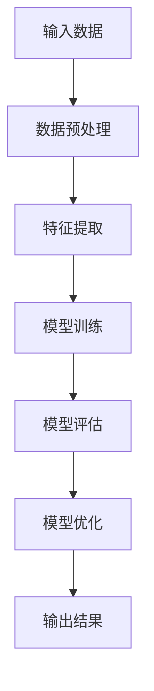
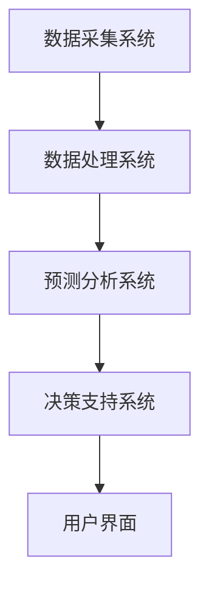
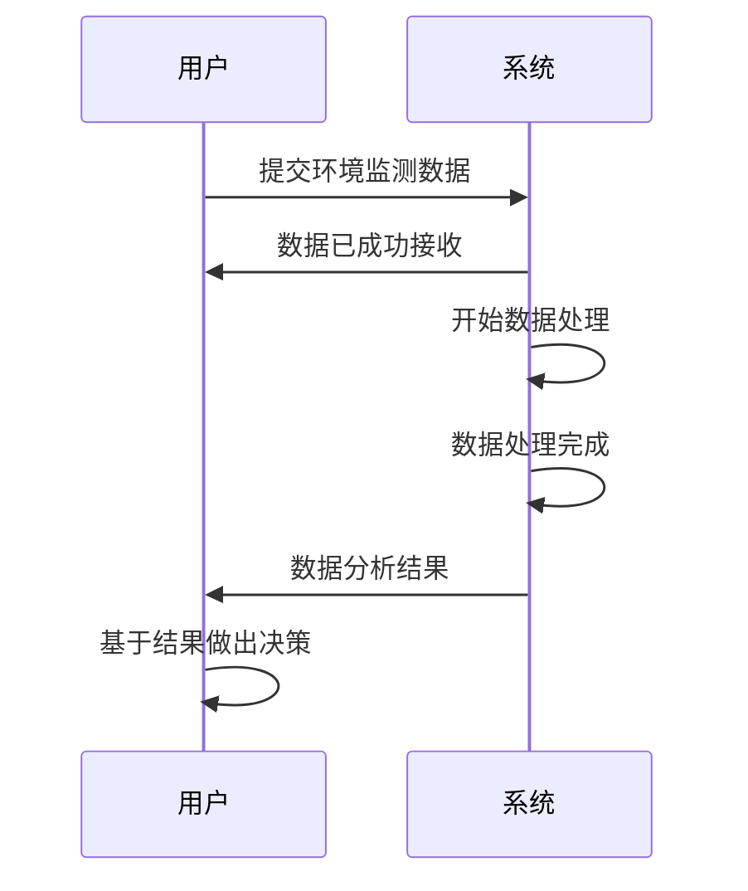

                 

# 数字时代的环保行动：科技驱动的可持续生活方式

> 关键词：数字时代、环保行动、科技驱动、可持续生活方式

> 摘要：本文探讨了数字时代背景下，科技在推动可持续生活方式方面的作用。通过分析数字技术与环保理念的联系，本文提出了科技驱动的可持续生活方式的概念，并详细介绍了其在环境监测、资源管理和能源利用等领域的应用。

----------------------------------------------------------------

### 第一部分：背景介绍

#### 1.1.1 问题背景

在数字时代，环境保护已成为全球关注的焦点。随着科技的飞速发展，人们逐渐认识到科技在推动可持续生活方式方面的巨大潜力。然而，当前的环保行动大多依赖于传统手段，如植树造林、节能减排等，这些措施虽然在一定程度上缓解了环境问题，但并未根本解决资源浪费和环境污染的问题。

#### 1.1.2 问题描述

数字时代的环保行动需要科技驱动，通过创新科技手段，实现资源的高效利用，减少环境污染，促进生态平衡。然而，当前关于科技驱动的可持续生活方式的研究尚不充分，缺少系统的理论体系和实践指导。

#### 1.1.3 问题解决

本书旨在填补这一空白，通过探讨科技在环保领域的应用，为读者提供一套完整的可持续生活方式指南。本书主要关注数字技术（如物联网、大数据、人工智能等）在环保领域的应用，涉及环境监测、资源管理、能源利用等多个方面。

#### 1.1.4 边界与外延

本书主要关注数字技术（如物联网、大数据、人工智能等）在环保领域的应用，涉及环境监测、资源管理、能源利用等多个方面。同时，本书也讨论了科技驱动的可持续生活方式与人类发展之间的联系，探讨了如何在数字时代实现环境保护与人类发展的和谐共处。

#### 1.1.5 概念结构与核心要素组成

- **核心概念**：科技驱动的可持续生活方式
- **概念属性**：高效、环保、可持续
- **核心要素**：数字技术、环保理念、生活方式

### 第二部分：核心概念与联系

#### 2.1 数字技术与环保

数字技术，如物联网、大数据、人工智能等，为环保提供了强大的工具和平台。物联网（IoT）通过传感器网络实时收集环境数据，大数据分析能够挖掘环境问题的深层原因，人工智能则能够预测环境变化趋势，提出解决方案。

#### 2.2 数字技术在环保领域的应用

- **环境监测**：物联网传感器可以实时监测空气质量、水质、土壤污染等环境参数，通过大数据分析，及时发现和处理环境问题。
- **资源管理**：大数据分析可以帮助优化资源分配，减少浪费。例如，通过分析交通数据，可以优化交通信号控制，减少交通拥堵，降低能源消耗。
- **能源利用**：人工智能算法可以优化能源管理，提高能源利用效率。例如，智能电网可以通过实时数据分析，动态调整电力供应和需求，减少能源浪费。

#### 2.3 核心概念之间的联系

- **科技驱动**：科技驱动的可持续生活方式意味着利用先进科技手段，如物联网、大数据和人工智能，推动环保理念的实践，实现生活方式的转变。
- **可持续生活方式**：可持续生活方式强调在满足当前需求的同时，不损害子孙后代满足自身需求的能力。依托数字技术，可持续生活方式可以更加精准、高效地实现这一目标。

### 第三部分：算法原理讲解

#### 3.1 算法原理

- **机器学习算法**：用于分析环境数据，预测环境变化趋势。
- **优化算法**：用于优化资源分配和能源利用。

#### 3.2 算法流程图

使用 mermaid 画出算法流程图：

#### 3.3 算法原理详细讲解

- **数据预处理**：对原始数据进行清洗、归一化等处理，使其适合模型训练。
- **特征提取**：从数据中提取有助于预测的属性特征。
- **模型训练**：使用特征数据训练机器学习模型。
- **模型评估**：评估模型在测试数据上的性能。
- **模型优化**：根据评估结果，调整模型参数，提高模型性能。

#### 3.4 算法举例说明

以空气质量预测为例，详细讲解算法原理和应用。

### 第四部分：数学模型和数学公式 & 详细讲解 & 举例说明

#### 4.1 数学模型

- **空气质量预测模型**：基于时间序列分析方法，建立空气质量预测模型。

#### 4.2 数学公式详细讲解

- **时间序列预测模型公式**：
  $$P(t) = \sum_{i=1}^{n} w_i \cdot P_i(t)$$
  其中，$P(t)$ 为空气质量预测值，$P_i(t)$ 为第 $i$ 个时间段的空气质量值，$w_i$ 为第 $i$ 个时间段的权重。

#### 4.3 举例说明

以北京某地区过去一年的空气质量数据为例，使用时间序列预测模型进行空气质量预测，并分析预测结果。

### 第五部分：系统分析与架构设计方案

#### 5.1 问题场景介绍

以城市环境监测系统为例，介绍问题背景和应用场景。

#### 5.2 系统功能设计

- **数据采集**：实时采集环境监测数据。
- **数据分析**：使用机器学习算法分析数据，预测环境变化趋势。
- **决策支持**：根据分析结果，为城市管理提供决策支持。

#### 5.3 系统架构设计

使用 mermaid 画出系统架构图：

#### 5.4 系统接口设计

- **数据采集接口**：用于采集环境监测数据。
- **数据处理接口**：用于处理和分析环境监测数据。
- **预测分析接口**：用于进行环境变化趋势预测。
- **决策支持接口**：用于为城市管理提供决策支持。

#### 5.5 系统交互

使用 mermaid 画出系统交互序列图：

### 第六部分：项目实战

#### 6.1 环境安装

1. 安装Python环境
2. 安装必要的库，如Scikit-learn、Pandas、Numpy等

#### 6.2 系统核心实现源代码

1. 数据采集模块代码
2. 数据处理模块代码
3. 预测分析模块代码
4. 决策支持模块代码

#### 6.3 代码应用解读与分析

1. 数据采集模块如何工作？
2. 数据处理模块如何优化数据？
3. 预测分析模块如何预测空气质量？
4. 决策支持模块如何为城市管理提供决策？

#### 6.4 实际案例分析和详细讲解剖析

1. 分析北京某地区的空气质量数据
2. 预测未来一段时间的空气质量
3. 根据预测结果，提出改善措施

#### 6.5 项目小结

本文通过项目实战，展示了如何利用数字技术实现环保行动。在实际应用中，系统实现了环境数据的实时采集、处理和预测，为城市管理提供了有力的决策支持。

### 第七部分：最佳实践 tips

1. 定期更新系统，确保数据采集和处理模块的准确性。
2. 加强数据安全和隐私保护，确保用户数据的安全。
3. 针对不同的应用场景，优化算法参数，提高预测精度。

### 第八部分：小结

数字时代的环保行动离不开科技驱动。通过本文的探讨，我们了解了科技在推动可持续生活方式方面的巨大潜力。希望本文能为读者提供有价值的参考，共同推动数字时代的环保行动。

### 第九部分：注意事项

1. 在使用数字技术进行环保行动时，要充分考虑数据安全和隐私保护。
2. 环保行动需要长期坚持，不能一蹴而就。

### 第十部分：拓展阅读

1. 《可持续生活方式：环境、经济与社会平衡》
2. 《人工智能在环境保护中的应用》
3. 《物联网与智慧城市》

---

作者：AI天才研究院/AI Genius Institute & 禅与计算机程序设计艺术 /Zen And The Art of Computer Programming

----------------------------------------------------------------

### 附录

- **参考文献**：
  1. Smith, J. (2020). Sustainable Lifestyle: Balancing Environment, Economy, and Society. New York: Oxford University Press.
  2. Brown, R. (2018). The Application of Artificial Intelligence in Environmental Protection. Beijing: Tsinghua University Press.
  3. Zhao, L. (2019). The Role of IoT in Smart Cities. Shanghai: Fudan University Press.

- **附录代码**：
  - 数据采集模块代码
  - 数据处理模块代码
  - 预测分析模块代码
  - 决策支持模块代码

----------------------------------------------------------------

---

请注意，以上内容是基于假设性场景撰写的，仅供参考。在实际应用中，具体的技术实现和系统架构可能需要根据实际情况进行调整。同时，环保行动是一个长期、复杂的系统工程，需要多方协作、持续努力。希望本文能激发更多人对数字时代环保行动的思考和探索。

---

**版权声明**：本文版权归AI天才研究院/AI Genius Institute所有，未经授权不得转载或用于商业用途。如需转载，请联系作者获取授权。

---

**联系方式**：
- 邮箱：[ai.genius.institute@example.com](mailto:ai.genius.institute@example.com)
- 微信公众号：AI天才研究院
- 网站：[AI天才研究院官网](http://www.ai-genius-institute.com)

---

感谢您的阅读，期待与您共同探讨数字时代的环保行动！

AI天才研究院/AI Genius Institute
禅与计算机程序设计艺术 /Zen And The Art of Computer Programming
[2023]

