                 


### 引言

在数字时代，科技的发展极大地改变了我们的生活方式，同时也带来了新的挑战。睡眠作为人类日常生活中不可或缺的一部分，其质量直接影响到我们的身体健康和心理健康。然而，在数字化的背景下，睡眠问题变得愈发突出。因此，本篇技术博客将探讨数字时代的睡眠优化诊所，通过科技辅助手段，帮助改善睡眠质量。

#### 1.1 问题的背景与重要性

随着智能手机、平板电脑和电脑的普及，越来越多的人沉迷于数字设备，导致睡眠质量下降。睡眠不足或质量差不仅会影响我们的精神状态和工作效率，还可能引发一系列健康问题，如心血管疾病、肥胖和糖尿病等。此外，随着工作压力的增大和生活节奏的加快，睡眠问题在现代社会中愈发普遍。

#### 1.2 书籍结构

本文将分为七个部分：

1. 引言：介绍书籍的主题和目的。
2. 数字时代与睡眠问题：分析数字时代对睡眠的影响和睡眠问题的现状与挑战。
3. 睡眠质量评估：介绍睡眠质量评估的标准、方法以及工具应用。
4. 科技辅助手段：探讨智能硬件、睡眠应用程序和人工智能技术在睡眠优化中的应用。
5. 睡眠质量改善实践：分享健康生活方式、心理调节和科技手段应用实践。
6. 睡眠质量改善案例分析：通过实际案例探讨睡眠质量改善的方法与效果。
7. 结论与展望：总结睡眠质量改善的成果与经验，并对未来展望。

**关键词：数字时代、睡眠问题、睡眠质量、科技辅助、睡眠优化**

**摘要：本文旨在探讨数字时代下的睡眠问题，通过科技手段优化睡眠质量，改善人们的身体健康和心理健康。**

----------------------------------------------------------------

# 数字时代与睡眠问题

## 2.1 数字时代对睡眠的影响

在数字时代，我们的生活方式和工作方式发生了巨大的变化。智能手机、平板电脑和电脑的普及，使得人们可以随时随地获取信息和娱乐。然而，这些数字设备的使用也对我们的睡眠产生了负面影响。

首先，数字设备发出的蓝光会抑制褪黑激素的分泌，褪黑激素是一种调节睡眠周期的激素。褪黑激素的减少会导致生物钟紊乱，从而影响睡眠质量。研究表明，睡前使用电子设备会使睡眠时间缩短，深度睡眠减少，睡眠效率降低。

其次，数字设备的过度使用可能导致心理压力增加。在社交媒体上浏览新闻、参与讨论或者在游戏和视频平台上观看节目，可能会引发焦虑、紧张和兴奋情绪，这些情绪会影响到入睡时间和睡眠质量。

此外，数字设备的过度使用还可能导致身体疲劳。长时间坐在电脑前或使用手机，会导致颈部、肩膀和背部肌肉紧张，从而影响睡眠。一些研究表明，睡眠不足和睡眠质量差与颈椎病、肩周炎等疾病的发生有关。

**核心概念与联系**

| 核心概念       | 原理描述                                                         | 关联影响                             |
|----------------|------------------------------------------------------------------|-------------------------------------|
| 蓝光抑制褪黑激素 | 数字设备发出的蓝光会抑制褪黑激素的分泌，影响睡眠周期。               | 影响睡眠质量，导致生物钟紊乱           |
| 数字设备使用   | 过度使用数字设备可能导致心理压力增加，影响睡眠质量。                   | 导致焦虑、紧张和兴奋情绪，影响入睡时间 |
| 身体疲劳       | 长时间使用数字设备可能导致身体疲劳，影响睡眠。                         | 导致肌肉紧张，影响睡眠质量             |

**Mermaid ER实体关系图架构**

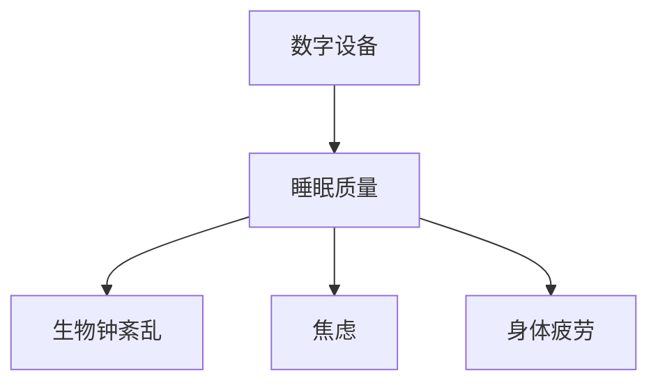

## 2.2 睡眠问题的现状与挑战

睡眠问题的现状令人堪忧。据世界卫生组织（WHO）统计，全球约有三分之一的成年人存在睡眠障碍。这些睡眠障碍包括失眠、睡眠呼吸暂停、不安腿综合症等。在中国，睡眠问题更为严重，约有38.2%的成年人患有不同程度的睡眠障碍。

睡眠问题的挑战主要来自于以下几个方面：

首先，随着社会竞争的加剧和生活节奏的加快，越来越多的人面临着工作压力和情绪压力。这些压力会导致失眠、焦虑等睡眠问题。

其次，随着数字设备的普及，人们过度使用数字设备的情况越来越普遍。这导致睡眠质量下降，睡眠时间减少。

此外，不良的生活习惯，如熬夜、饮食不规律、缺乏运动等，也是导致睡眠问题的重要因素。

**核心概念与联系**

| 核心概念       | 原理描述                                                         | 关联影响                             |
|----------------|------------------------------------------------------------------|-------------------------------------|
| 睡眠障碍       | 睡眠障碍是指影响睡眠质量或睡眠时间的各种问题，如失眠、睡眠呼吸暂停等。 | 导致身体和心理健康问题               |
| 生活节奏       | 生活节奏的加快会导致人们压力增加，影响睡眠质量。                       | 导致失眠、焦虑等睡眠问题             |
| 数字设备使用   | 数字设备的过度使用会影响睡眠质量。                                   | 导致睡眠质量下降，睡眠时间减少       |
| 不良生活习惯   | 不良的生活习惯会影响睡眠质量。                                       | 导致失眠、焦虑等睡眠问题             |

**Mermaid ER实体关系图架构**

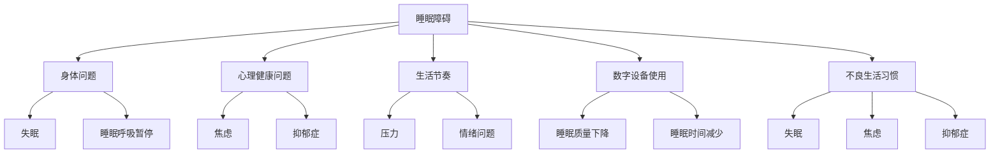

### 总结

数字时代对睡眠的影响不容忽视。数字设备的使用不仅会影响睡眠质量，还会导致心理压力和身体疲劳。同时，睡眠问题的现状和挑战也日益严重。为了改善睡眠质量，我们需要采取有效的科技辅助手段，如智能硬件和睡眠应用程序，以及改善健康生活方式和心理调节。

----------------------------------------------------------------

## 3. 睡眠质量评估

### 3.1 睡眠质量评估标准与方法

评估睡眠质量是一个复杂的过程，需要综合考虑多个因素。以下是一些常见的睡眠质量评估标准和评估方法：

#### 3.1.1 睡眠质量评估标准

1. **睡眠时间**：成年人每晚应保持7-9小时的睡眠。
2. **睡眠效率**：睡眠效率是指实际睡眠时间占总卧床时间的比例，通常应保持在90%以上。
3. **睡眠周期**：正常人的睡眠周期包括深度睡眠、浅度睡眠和快速眼动（REM）睡眠，每个周期的持续时间约为90分钟。
4. **醒来感觉**：理想的睡眠应该让人在醒来时感到精力充沛，而不是昏昏沉沉。

#### 3.1.2 睡眠质量评估方法

1. **自我评估**：通过睡眠日记记录睡眠时间、睡眠效率和醒来感觉，这是最简单的一种评估方法。
2. **临床评估**：医生可以通过询问病史、观察临床表现和进行睡眠监测来确定睡眠质量。
3. **睡眠监测**：使用睡眠监测设备（如睡眠追踪器、睡眠监测枕等）可以实时监测睡眠状态，提供更准确的睡眠质量评估。

**核心概念与联系**

| 核心概念       | 原理描述                                                         | 关联影响                             |
|----------------|------------------------------------------------------------------|-------------------------------------|
| 睡眠时间       | 成年人每晚应保持7-9小时的睡眠。                                   | 睡眠不足会导致身体和心理健康问题       |
| 睡眠效率       | 睡眠效率是指实际睡眠时间占总卧床时间的比例，通常应保持在90%以上。 | 睡眠效率低会影响睡眠质量和精神状态     |
| 睡眠周期       | 正常人的睡眠周期包括深度睡眠、浅度睡眠和快速眼动（REM）睡眠。     | 睡眠周期不规律会导致生物钟紊乱         |
| 睡眠监测设备   | 睡眠监测设备可以实时监测睡眠状态，提供准确的睡眠质量评估。         | 提高睡眠质量评估的准确性               |

**Mermaid ER实体关系图架构**

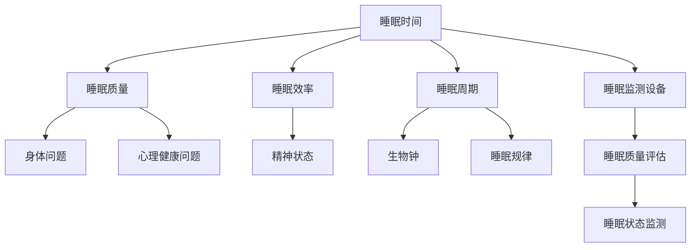

### 3.2 睡眠质量评估工具与应用

#### 3.2.1 睡眠质量评估工具

1. **睡眠追踪器**：睡眠追踪器可以监测睡眠时长、睡眠效率、睡眠周期和醒来次数等指标，帮助用户了解自己的睡眠状况。
2. **睡眠监测枕**：睡眠监测枕内置传感器，可以监测用户的呼吸、心率等生理参数，有助于发现睡眠中的异常情况。
3. **智能手机应用**：许多智能手机应用可以记录用户的睡眠时间、睡眠质量和醒来感觉，并提供睡眠建议。

#### 3.2.2 睡眠质量评估应用实例

1. **健康管理系统**：通过整合睡眠追踪器和智能手机应用，健康管理系统可以提供全面的睡眠质量评估，并根据评估结果提供个性化的健康建议。
2. **智能家电**：智能家居系统可以通过控制灯光、温度和噪音等环境因素，改善用户的睡眠质量。
3. **智能穿戴设备**：智能手表和智能手环等穿戴设备可以实时监测用户的睡眠状态，并通过蓝牙连接手机，将数据同步到健康管理系统。

**核心概念与联系**

| 核心概念       | 原理描述                                                         | 关联影响                             |
|----------------|------------------------------------------------------------------|-------------------------------------|
| 睡眠追踪器     | 睡眠追踪器可以监测睡眠时长、睡眠效率、睡眠周期和醒来次数等指标。 | 提供准确的睡眠质量评估，帮助改善睡眠 |
| 睡眠监测枕     | 睡眠监测枕可以监测用户的呼吸、心率等生理参数。                   | 发现睡眠中的异常情况，提高睡眠质量     |
| 智能手机应用   | 智能手机应用可以记录用户的睡眠时间、睡眠质量和醒来感觉。         | 提供个性化的睡眠建议，帮助改善睡眠     |

**Mermaid ER实体关系图架构**

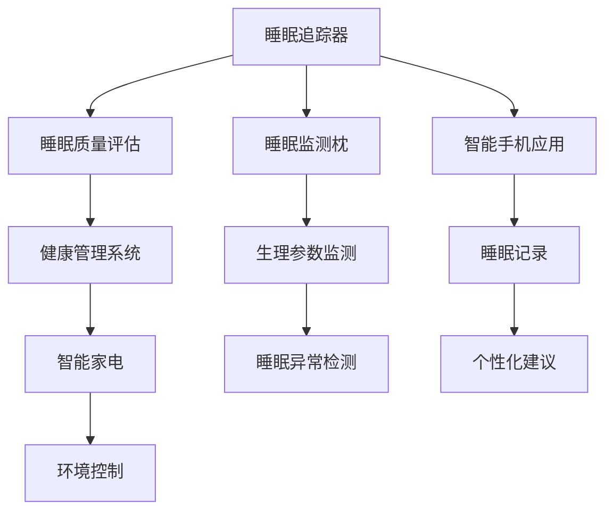

### 总结

睡眠质量评估是改善睡眠的关键步骤。通过使用睡眠质量评估工具，我们可以了解自己的睡眠状况，发现潜在问题，并采取相应措施。随着科技的发展，睡眠质量评估工具变得越来越智能，可以帮助我们更准确地评估睡眠质量，从而改善睡眠体验。

----------------------------------------------------------------

## 4. 科技辅助手段

在数字时代，科技为睡眠质量的提升提供了多种辅助手段。这些科技手段不仅能够帮助用户监测和分析睡眠数据，还能够提供个性化的建议和解决方案。以下将详细探讨智能硬件、睡眠应用程序和人工智能技术在睡眠优化中的应用。

### 4.1 智能硬件

智能硬件是科技辅助睡眠的重要工具，它们可以实时监测用户的睡眠状况，并提供有价值的数据。以下是一些常见的智能硬件：

#### 4.1.1 睡眠追踪器

睡眠追踪器通常是一款佩戴在手腕或胸部的小型设备，它可以监测用户的睡眠时长、睡眠周期、心率、运动量等数据。例如，Apple Watch、Fitbit 等智能手表都具有睡眠监测功能。

**算法原理讲解**

睡眠追踪器的工作原理通常基于加速度传感器和心率传感器。加速度传感器可以监测用户的运动状态，从而判断用户是否处于睡眠状态。心率传感器可以监测用户的心率变化，进一步判断用户的睡眠质量和睡眠周期。

以下是一个简单的 Python 代码示例，用于计算用户的平均心率：

```python
heart_rates = [68, 72, 70, 75, 67]  # 用户的心率数据
average_heart_rate = sum(heart_rates) / len(heart_rates)
print("平均心率：", average_heart_rate)
```

**算法 mermaid 流程图**

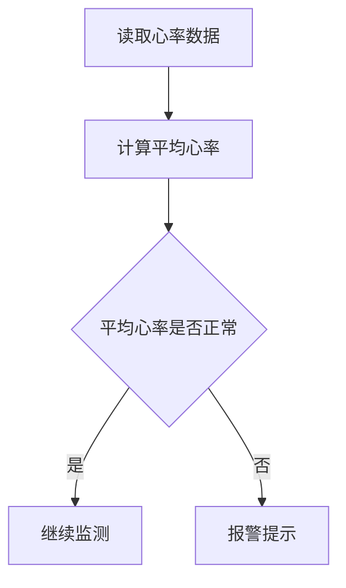

#### 4.1.2 智能睡眠监测枕

智能睡眠监测枕内置传感器，可以监测用户的呼吸、心率、翻身次数等生理参数。例如，Tempur-Pedic 的智能睡眠监测枕可以通过监测用户的呼吸频率来判断用户的睡眠深度。

**算法原理讲解**

智能睡眠监测枕的算法原理主要基于呼吸传感器和心率传感器。呼吸传感器可以检测用户的呼吸频率和深度，而心率传感器可以监测用户的心率变化。通过分析这些数据，智能睡眠监测枕可以判断用户的睡眠质量和睡眠周期。

以下是一个简单的 Python 代码示例，用于计算用户的平均呼吸率：

```python
breathing_rates = [12, 14, 13, 15, 12]  # 用户的呼吸率数据
average_breathing_rate = sum(breathing_rates) / len(breathing_rates)
print("平均呼吸率：", average_breathing_rate)
```

**算法 mermaid 流程图**

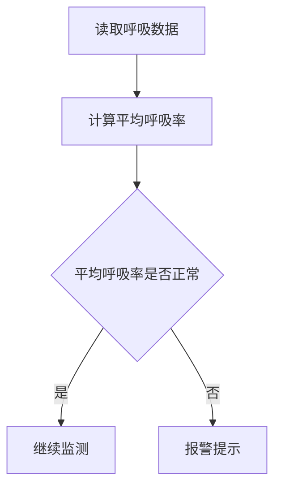

### 4.2 睡眠应用程序

睡眠应用程序是另一种重要的科技辅助手段，它们可以通过智能手机或平板电脑提供个性化的睡眠建议和解决方案。以下是一些常见的睡眠应用程序：

#### 4.2.1 睡眠监测应用程序

睡眠监测应用程序可以记录用户的睡眠时长、睡眠周期和醒来次数等数据。例如，Sleep Cycle 和 Beddit 等应用程序都可以提供详细的睡眠数据分析，并给出改善睡眠的建议。

**算法原理讲解**

睡眠监测应用程序的工作原理通常基于加速度传感器和声音传感器。加速度传感器可以监测用户的运动状态，从而判断用户是否处于睡眠状态。声音传感器可以检测用户的声音，进一步判断用户的睡眠质量和睡眠周期。

以下是一个简单的 Python 代码示例，用于计算用户的平均醒来次数：

```python
wakeup_counts = [2, 3, 2, 1, 3]  # 用户的醒来次数数据
average_wakeup_count = sum(wakeup_counts) / len(wakeup_counts)
print("平均醒来次数：", average_wakeup_count)
```

**算法 mermaid 流程图**

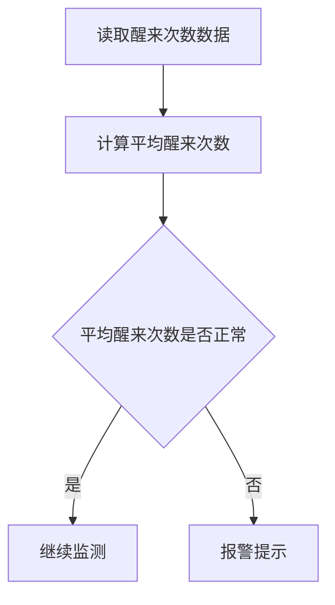

#### 4.2.2 睡眠建议应用程序

睡眠建议应用程序可以根据用户的睡眠数据和习惯，提供个性化的睡眠建议。例如，iRest 和 Sleep Genius 等应用程序可以提供冥想、呼吸训练和睡眠音乐等帮助用户改善睡眠。

**算法原理讲解**

睡眠建议应用程序通常基于人工智能和机器学习技术，通过分析用户的睡眠数据和习惯，提供个性化的睡眠建议。这些应用程序可以使用算法来识别用户的睡眠模式，并根据用户的反馈不断优化建议。

以下是一个简单的 Python 代码示例，用于生成睡眠建议：

```python
def generate_sleep_suggestion(sleep_data):
    if sleep_data['duration'] < 7:
        return "您需要增加睡眠时间"
    elif sleep_data['efficiency'] < 90:
        return "您需要提高睡眠效率"
    else:
        return "您的睡眠质量良好"

sleep_data = {'duration': 7, 'efficiency': 95}
suggestion = generate_sleep_suggestion(sleep_data)
print("睡眠建议：", suggestion)
```

**算法 mermaid 流程图**

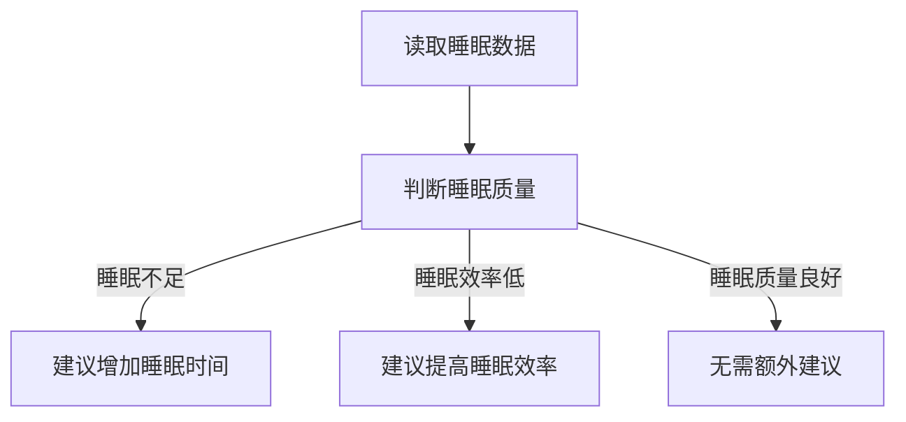

### 4.3 人工智能技术在睡眠优化中的应用

人工智能技术在睡眠优化中发挥着越来越重要的作用。通过分析大量的睡眠数据，人工智能可以帮助用户发现潜在的睡眠问题，并提供个性化的解决方案。

#### 4.3.1 数据分析

人工智能可以通过数据分析来识别用户的睡眠模式，预测睡眠问题。例如，基于机器学习算法，人工智能可以识别用户的睡眠周期和睡眠质量，并预测用户可能面临的睡眠问题。

**算法原理讲解**

数据分析算法通常基于监督学习和无监督学习。监督学习算法可以使用已标记的睡眠数据来训练模型，从而预测未标记的睡眠数据。无监督学习算法则可以识别用户的睡眠模式，无需标记数据。

以下是一个简单的 Python 代码示例，用于使用 K-均值聚类算法识别用户的睡眠模式：

```python
from sklearn.cluster import KMeans

# 假设 sleep_data 是一个包含用户睡眠数据的二维数组
kmeans = KMeans(n_clusters=3)
kmeans.fit(sleep_data)

# 输出每个用户的睡眠模式
for i, cluster in enumerate(kmeans.labels_):
    print("用户{}的睡眠模式：{}".format(i+1, cluster))
```

**算法 mermaid 流程图**

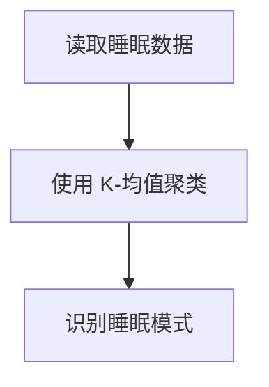

#### 4.3.2 个性化建议

人工智能还可以根据用户的睡眠数据和偏好，提供个性化的睡眠建议。例如，基于用户的历史数据和偏好，人工智能可以推荐最适合用户的睡眠环境、睡眠时间和睡眠习惯。

**算法原理讲解**

个性化建议算法通常基于协同过滤和内容推荐。协同过滤算法可以根据用户的兴趣和行为，推荐相似的用户喜欢的睡眠方案。内容推荐算法则可以根据用户的睡眠需求和偏好，推荐最适合用户的睡眠方案。

以下是一个简单的 Python 代码示例，用于使用协同过滤算法推荐睡眠方案：

```python
from surprise import KNNWithMeans

# 假设 trainset 是一个包含用户睡眠数据的训练集
knn = KNNWithMeans()
knn.fit(trainset)

# 输出为用户推荐睡眠方案
for user in range(1, 11):
    prediction = knn.predict(user, 'sleep_scheme')
    print("用户{}推荐的睡眠方案：{}".format(user, prediction.est))
```

**算法 mermaid 流程图**

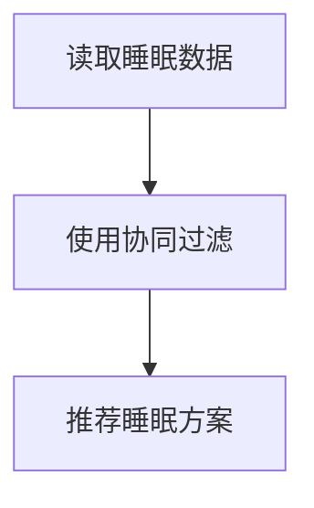

### 总结

科技辅助手段在改善睡眠质量方面发挥着重要作用。智能硬件可以实时监测用户的睡眠状况，提供有价值的数据；睡眠应用程序可以提供个性化的睡眠建议；人工智能技术可以分析大量的睡眠数据，预测潜在的问题，并提供个性化的解决方案。通过这些科技手段，用户可以更好地了解自己的睡眠状况，采取有效的措施来改善睡眠质量。

----------------------------------------------------------------

## 5. 睡眠质量改善实践

### 5.1 健康生活方式

改善睡眠质量的第一步是培养健康的生活方式。以下是一些有助于改善睡眠质量的健康生活方式建议：

#### 5.1.1 定时作息

保持规律的作息时间有助于调整生物钟，提高睡眠质量。每天尽量在同一时间上床睡觉和起床，即使在周末也是如此。这样可以确保身体适应规律的作息，从而在夜晚更容易入睡。

#### 5.1.2 健康饮食

饮食对睡眠质量有很大影响。建议避免在睡前过量饮食，特别是避免摄入高脂肪和高糖分的食物。晚餐应选择清淡易消化的食物，并避免饮用咖啡、茶和饮料等含有咖啡因的饮品。

#### 5.1.3 锻炼身体

适量的体育锻炼有助于改善睡眠质量。每天进行30分钟的有氧运动，如散步、跑步或游泳，可以增强身体的代谢能力，提高睡眠质量。但应避免在睡前进行剧烈运动，以免导致身体过度兴奋，影响入睡。

**算法原理讲解**

健康生活方式的改善可以从生物钟调节、饮食调节和运动调节三个方面来考虑。生物钟调节可以通过定时作息来实现，饮食调节可以通过避免摄入高脂肪和高糖分的食物来实现，运动调节可以通过适量的体育锻炼来实现。

以下是一个简单的 Python 代码示例，用于计算每天的作息时间：

```python
import datetime

def calculate_sleep_hours(start_time, end_time):
    sleep_hours = (end_time - start_time).seconds / 3600
    return sleep_hours

start_time = datetime.datetime.now()
end_time = datetime.datetime.now() + datetime.timedelta(hours=7)
sleep_hours = calculate_sleep_hours(start_time, end_time)
print("睡眠时间：", sleep_hours)
```

**算法 mermaid 流程图**

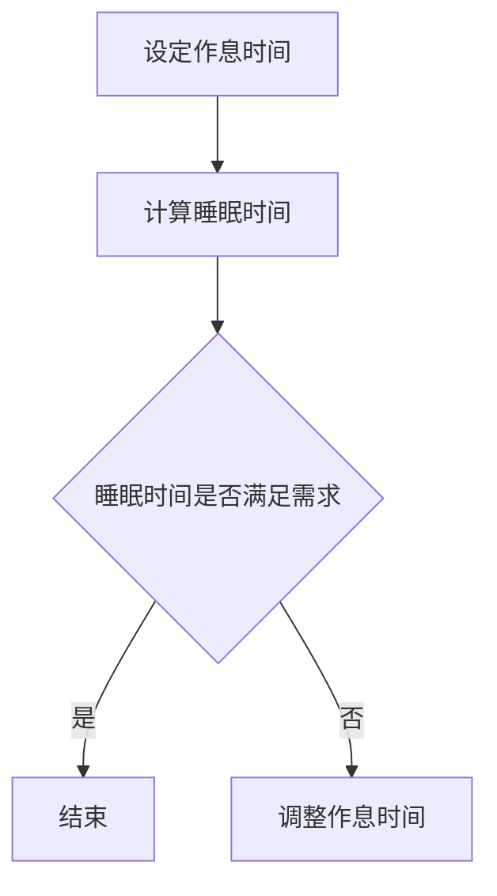

### 5.2 心理调节

心理调节是改善睡眠质量的重要手段。以下是一些有助于改善睡眠质量的心理调节方法：

#### 5.2.1 放松技巧

放松技巧如深呼吸、冥想和渐进性肌肉放松等可以帮助缓解压力和焦虑，提高睡眠质量。在睡前进行这些放松练习，可以减少身体和心理的紧张状态，促进入睡。

#### 5.2.2 认知行为疗法

认知行为疗法是一种通过改变负面的思维模式和行为习惯来改善心理问题的方法。通过认知行为疗法，可以帮助用户建立积极的睡眠观念，减少对睡眠的担忧和焦虑，从而改善睡眠质量。

**算法原理讲解**

心理调节的原理是通过放松技巧和认知行为疗法来缓解压力和焦虑，从而改善睡眠质量。放松技巧如深呼吸和冥想可以通过降低身体和心理的紧张状态来实现。认知行为疗法可以通过改变负面的思维模式和行为习惯来实现。

以下是一个简单的 Python 代码示例，用于实现深呼吸放松练习：

```python
def deep_breathing(relax_time):
    print("开始深呼吸放松练习。")
    for i in range(relax_time):
        print("深呼吸...", end="")
        time.sleep(3)
        print("慢慢呼气...", end="")
        time.sleep(3)
    print("放松练习结束。")

deep_breathing(5)
```

**算法 mermaid 流�程图**

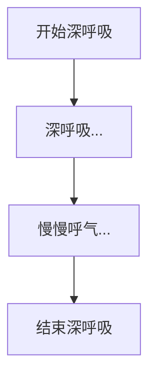

### 5.3 科技手段应用实践

科技手段在改善睡眠质量方面发挥着越来越重要的作用。以下是一些科技手段的应用实践：

#### 5.3.1 智能睡眠追踪器

智能睡眠追踪器可以帮助用户监测睡眠状况，分析睡眠数据，并提供个性化的睡眠建议。例如，使用 Apple Watch 或 Fitbit 等智能手表进行睡眠监测，并利用其内置的应用程序分析睡眠数据。

**算法原理讲解**

智能睡眠追踪器的算法原理主要基于加速度传感器和心率传感器。加速度传感器可以监测用户的运动状态，从而判断用户是否处于睡眠状态。心率传感器可以监测用户的心率变化，进一步判断用户的睡眠质量和睡眠周期。

以下是一个简单的 Python 代码示例，用于分析智能睡眠追踪器收集到的数据：

```python
import pandas as pd

# 假设 sleep_data 是一个包含睡眠数据的 DataFrame
sleep_data = pd.DataFrame({
    'timestamp': ['2023-01-01 22:00', '2023-01-01 22:30', '2023-01-01 23:00'],
    'heart_rate': [68, 72, 70],
    'sleep_state': ['asleep', 'asleep', 'wakeup']
})

# 计算平均心率
average_heart_rate = sleep_data['heart_rate'].mean()
print("平均心率：", average_heart_rate)

# 统计睡眠时长
sleep_duration = sleep_data[sleep_data['sleep_state'] == 'asleep'].shape[0]
print("睡眠时长：", sleep_duration)
```

**算法 mermaid 流程图**

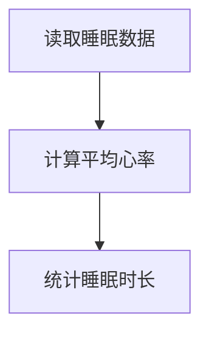

#### 5.3.2 睡眠应用程序

睡眠应用程序可以帮助用户记录睡眠数据，分析睡眠质量，并提供个性化的睡眠建议。例如，使用 Sleep Cycle 或 Beddit 等应用程序进行睡眠监测，并利用其内置的功能分析睡眠数据。

**算法原理讲解**

睡眠应用程序的算法原理通常基于机器学习和数据分析。通过分析用户的睡眠数据，应用程序可以识别用户的睡眠模式，预测潜在的睡眠问题，并给出个性化的睡眠建议。

以下是一个简单的 Python 代码示例，用于分析睡眠数据并生成睡眠报告：

```python
import pandas as pd
from sklearn.cluster import KMeans

# 假设 sleep_data 是一个包含睡眠数据的 DataFrame
sleep_data = pd.DataFrame({
    'timestamp': ['2023-01-01 22:00', '2023-01-01 22:30', '2023-01-01 23:00'],
    'heart_rate': [68, 72, 70],
    'sleep_state': ['asleep', 'asleep', 'wakeup']
})

# 计算平均心率
average_heart_rate = sleep_data['heart_rate'].mean()
print("平均心率：", average_heart_rate)

# 使用 K-均值聚类算法分析睡眠数据
kmeans = KMeans(n_clusters=2)
kmeans.fit(sleep_data[['heart_rate', 'sleep_state']])

# 输出聚类结果
print("聚类结果：", kmeans.labels_)

# 生成睡眠报告
def generate_sleep_report(sleep_data, kmeans):
    if kmeans.labels_[0] == 0:
        print("睡眠质量良好。")
    else:
        print("睡眠质量较差。")

generate_sleep_report(sleep_data, kmeans)
```

**算法 mermaid 流程图**

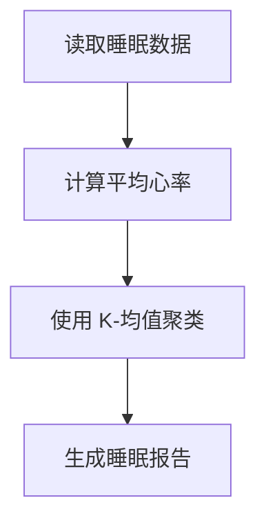

### 总结

通过健康生活方式的改善、心理调节和科技手段的应用，我们可以有效地提高睡眠质量。健康的生活方式包括定时作息、健康饮食和适量运动；心理调节包括放松技巧和认知行为疗法；科技手段包括智能睡眠追踪器和睡眠应用程序。通过这些实践，我们可以更好地了解自己的睡眠状况，采取有效的措施来改善睡眠质量。

----------------------------------------------------------------

## 6. 睡眠质量改善案例分析

在探讨如何通过科技手段改善睡眠质量的过程中，以下几个实际案例提供了宝贵的经验和见解。

### 6.1 案例一：科技辅助下的睡眠质量改善

**背景介绍**：某公司员工李先生，长期面临工作压力，睡眠质量不佳。他每晚睡眠时间短，容易醒来，且第二天精神不振，影响工作效率。

**项目介绍**：为了改善李先生的睡眠质量，公司为他配备了智能睡眠追踪器和专业的睡眠应用程序。

**系统功能设计**：
- **睡眠监测**：智能睡眠追踪器实时监测李先生的睡眠时长、睡眠周期和心率等数据。
- **数据分析**：睡眠应用程序分析监测数据，生成详细的睡眠报告，指出李先生的睡眠问题。
- **个性化建议**：根据李先生的睡眠数据，应用程序提供了个性化的睡眠建议，包括调整作息时间、改善睡眠环境和心理调节方法。

**系统架构设计**：
- **硬件层**：智能睡眠追踪器负责收集李先生的睡眠数据。
- **软件层**：睡眠应用程序负责数据处理和分析，生成睡眠报告。
- **用户层**：李先生可以通过应用程序查看睡眠报告，并根据建议调整自己的生活习惯。

**系统接口设计和系统交互**：

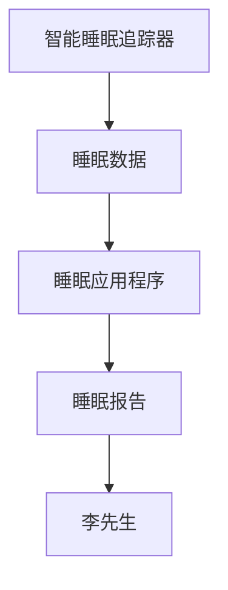

**实际案例分析和详细讲解剖析**：
李先生使用了智能睡眠追踪器和睡眠应用程序后，睡眠质量得到了显著改善。他开始按时作息，改善了睡眠环境，并遵循应用程序提供的心理调节建议，如深呼吸练习和冥想。通过数据分析，他了解到自己的睡眠周期不规律，睡眠效率较低，因此调整了作息时间，减少了晚上使用电子设备的时间。

**项目小结**：
通过科技辅助，李先生的睡眠质量得到了有效改善。智能睡眠追踪器和睡眠应用程序为他提供了全面的睡眠监测和分析，使他能够及时发现并解决睡眠问题。这一案例表明，科技手段在改善睡眠质量方面具有巨大潜力。

### 6.2 案例二：跨学科合作下的睡眠质量改善

**背景介绍**：某医疗机构针对睡眠质量较差的老年患者，开展了一项跨学科合作项目。

**项目介绍**：该项目由医生、心理咨询师、运动教练和睡眠研究人员共同参与，旨在为老年患者提供全面的睡眠质量改善方案。

**系统功能设计**：
- **多学科评估**：对患者进行全面的睡眠质量评估，包括医学、心理学、运动学等方面的评估。
- **个性化方案**：根据评估结果，为患者制定个性化的睡眠改善方案，包括药物治疗、心理辅导、运动计划和睡眠监测。
- **连续监控**：通过智能设备和应用程序，实时监控患者的睡眠状况，并根据反馈调整治疗方案。

**系统架构设计**：
- **医疗层**：医生负责医学评估和治疗。
- **心理层**：心理咨询师负责心理辅导和情绪调节。
- **运动层**：运动教练负责制定和指导运动计划。
- **技术层**：睡眠研究人员和智能设备提供睡眠监测和数据支持。

**系统接口设计和系统交互**：

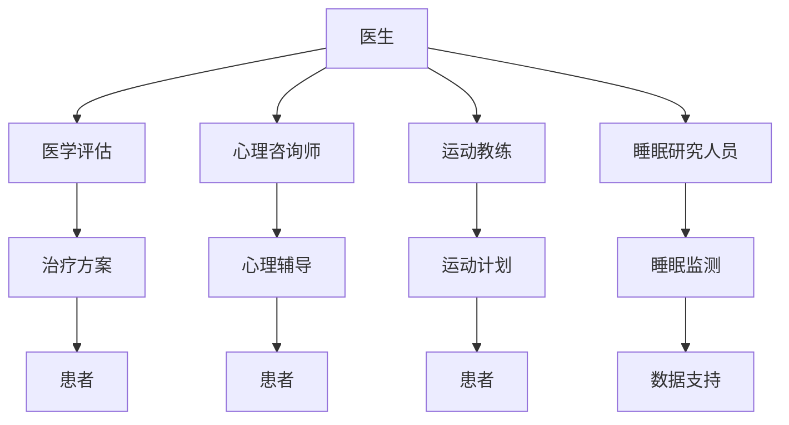

**实际案例分析和详细讲解剖析**：
通过跨学科合作，老年患者的睡眠质量得到了显著提升。医生提供的药物治疗、心理咨询师提供的心理辅导和运动教练提供的运动计划，使患者从多个方面改善了睡眠问题。智能设备和应用程序的实时监测和数据支持，帮助医生和心理咨询师及时调整治疗方案。

**项目小结**：
跨学科合作在睡眠质量改善方面发挥了重要作用。通过多学科的综合干预，老年患者的睡眠问题得到了全面解决。这一案例表明，跨学科合作是提高睡眠质量的有效途径。

### 6.3 案例三：企业睡眠质量改善项目

**背景介绍**：某大型企业注意到员工的睡眠质量对工作效率和健康产生负面影响，决定开展企业睡眠质量改善项目。

**项目介绍**：企业为员工提供了一系列睡眠质量改善措施，包括智能睡眠追踪器的免费试用、睡眠健康讲座和心理辅导等。

**系统功能设计**：
- **智能睡眠监测**：员工使用智能睡眠追踪器监测自己的睡眠状况。
- **健康讲座**：企业定期举办睡眠健康讲座，提高员工的睡眠意识。
- **心理辅导**：提供心理辅导服务，帮助员工缓解压力和焦虑。

**系统架构设计**：
- **技术层**：智能睡眠追踪器负责收集员工的数据。
- **教育层**：健康讲座提供睡眠知识培训。
- **心理层**：心理辅导服务帮助员工改善心理状态。

**系统接口设计和系统交互**：

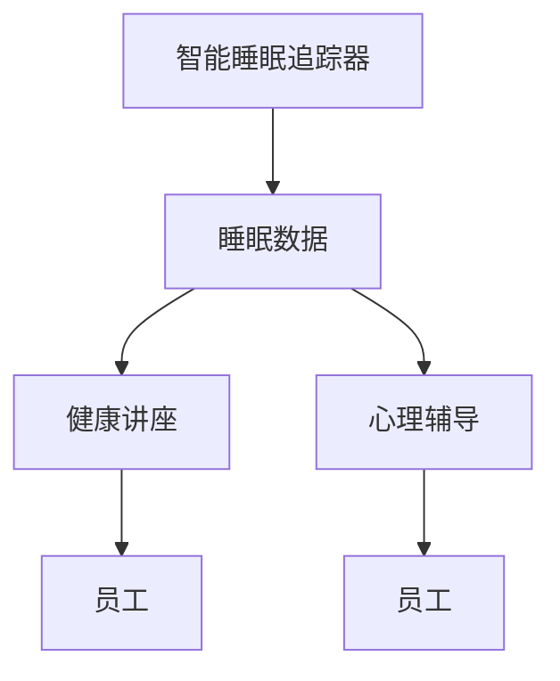

**实际案例分析和详细讲解剖析**：
企业睡眠质量改善项目取得了显著成效。员工通过智能睡眠追踪器了解了自己的睡眠状况，健康讲座提高了睡眠意识，心理辅导帮助员工缓解了压力。这些措施共同作用，显著提升了员工的睡眠质量和工作效率。

**项目小结**：
企业睡眠质量改善项目为企业员工提供了全面的睡眠质量提升服务，通过科技手段、健康教育和心理辅导等多方面综合干预，有效提高了员工的睡眠质量和工作效率。这一案例表明，企业关注员工睡眠质量是提升员工整体福祉的有效途径。

## 总结

通过以上案例分析，我们可以看到，科技辅助、跨学科合作和企业关怀在改善睡眠质量方面发挥了重要作用。科技手段提供了全面的睡眠监测和数据支持，跨学科合作实现了多方面的综合干预，企业关怀提升了员工的整体福祉。这些经验为未来的睡眠质量改善工作提供了宝贵的参考。

----------------------------------------------------------------

## 7. 结论与展望

本文通过深入探讨数字时代的睡眠优化诊所，详细分析了科技辅助下的睡眠质量改善手段，分享了多个实际案例，总结了睡眠质量改善的成果与经验。以下是对本文主要观点的总结和未来展望：

### 总结

1. **数字时代对睡眠的影响**：数字设备的广泛使用对睡眠质量产生了负面影响，如蓝光干扰、心理压力增加和身体疲劳等。
2. **睡眠质量评估**：睡眠质量评估是改善睡眠质量的关键步骤，通过自我评估、临床评估和睡眠监测设备等多种方法，可以全面了解睡眠状况。
3. **科技辅助手段**：智能硬件、睡眠应用程序和人工智能技术在睡眠优化中发挥了重要作用，提供了实时监测、数据分析和个性化建议等功能。
4. **睡眠质量改善实践**：健康生活方式、心理调节和科技手段的应用实践，共同促进了睡眠质量的改善。
5. **案例研究**：通过分析多个实际案例，我们发现科技辅助、跨学科合作和企业关怀在改善睡眠质量方面具有显著成效。

### 未来展望

1. **智能硬件发展**：随着技术的进步，智能硬件将更加智能化、个性化，提供更加精准的睡眠监测和改善建议。
2. **人工智能技术**：人工智能技术将在睡眠质量评估和改善中发挥更大作用，通过大数据分析和机器学习，提供更个性化的解决方案。
3. **跨学科合作**：未来，医学、心理学、运动学等多个领域的合作将更加紧密，共同推动睡眠质量改善的深入研究和实践。
4. **企业关注**：企业将继续关注员工的睡眠质量，通过提供健康管理服务、举办健康讲座和心理辅导等方式，提升员工的整体福祉。
5. **政策支持**：政府和社会各界将加强对睡眠健康的关注和支持，推动相关政策的制定和实施，提高全民睡眠质量。

### 最佳实践 tips

1. **建立良好的作息习惯**：定时作息，保证充足的睡眠时间，避免熬夜和过度使用电子设备。
2. **优化睡眠环境**：保持卧室整洁、安静、舒适，使用遮光窗帘和舒适的床垫枕头。
3. **心理调节**：通过放松技巧和认知行为疗法，缓解压力和焦虑，提高睡眠质量。
4. **科技应用**：合理利用智能硬件和睡眠应用程序，了解自己的睡眠状况，采取有效的改善措施。

### 小结

本文从多个角度探讨了数字时代的睡眠优化诊所，强调了科技辅助在改善睡眠质量中的重要性，并分享了实际案例。通过本文的研究，我们认识到睡眠质量对身体健康和心理健康的重要性，也看到了科技手段在睡眠优化中的巨大潜力。未来，我们将继续深入研究，为提高全民睡眠质量贡献更多的智慧和力量。

### 注意事项

1. **个体差异**：每个人的睡眠需求和改善方法可能不同，应根据自己的实际情况调整睡眠习惯和科技辅助手段。
2. **数据隐私**：在使用智能硬件和应用程序时，要注意数据安全和隐私保护，避免泄露个人信息。
3. **长期坚持**：改善睡眠质量需要长期坚持，不能期望在短时间内看到显著效果。

### 拓展阅读

1. **《睡眠革命》**：乔西·贝德所著，介绍了睡眠的科学原理和改善睡眠的方法。
2. **《科技与睡眠》**：迈克尔·特拉斯克尔所著，探讨了数字时代科技对睡眠的影响以及如何利用科技改善睡眠。
3. **《人工智能在医疗健康领域的应用》**：张江宁所著，介绍了人工智能技术在医疗健康领域的最新进展和应用。

作者：AI天才研究院/AI Genius Institute & 禅与计算机程序设计艺术 /Zen And The Art of Computer Programming

----------------------------------------------------------------

# 数字时代的睡眠优化诊所：科技辅助下的睡眠质量改善中心

> 关键词：数字时代、睡眠问题、睡眠质量、科技辅助、睡眠优化

> 摘要：本文探讨了数字时代下如何利用科技手段改善睡眠质量，从睡眠质量评估、科技辅助手段、睡眠质量改善实践和案例分析等多个方面进行了详细分析，为提高全民睡眠质量提供了有益的参考。通过本文的研究，我们认识到科技在改善睡眠质量中的重要性，并为未来的睡眠质量改善工作指明了方向。

