                 

## 数字时代的睡眠质量：科技与传统方法的结合

### 文章关键词
- 数字时代
- 睡眠质量
- 科技手段
- 传统方法
- 结合实例

### 文章摘要
本文旨在探讨数字时代背景下，如何通过科技手段与传统方法的结合，有效提升睡眠质量。首先，我们将介绍数字时代对睡眠质量的负面影响，然后深入探讨睡眠质量的核心概念及其评估方法。接着，文章将分别介绍科技在提升睡眠质量中的应用以及传统提升睡眠质量的方法。通过具体的案例分析，我们将展示科技与传统方法相结合的实际效果。最后，文章将提供一系列提升睡眠质量的实用建议和最佳实践，总结全文内容，并展望未来发展趋势。

----------------------------------------------------------------

### 第一部分：背景与核心概念

#### 1.1 数字时代与睡眠质量问题

在数字时代，我们的生活被各种科技设备所包围，从智能手机到智能家居，从网络购物到远程办公，数字技术已经深刻地改变了我们的生活方式。然而，这种数字化生活的便利也带来了一系列健康问题，其中最为显著的就是睡眠质量的下降。

**问题背景：**  
随着科技的发展，人们越来越依赖电子设备，尤其是智能手机和平板电脑。这些设备发出的蓝光会抑制褪黑素的产生，进而影响我们的睡眠质量。此外，社交媒体的过度使用和电子游戏的沉迷，使得许多人的睡眠时间被严重压缩，睡眠质量也随之下降。

**问题描述：**  
睡眠质量问题包括睡眠不足、睡眠质量差、入睡困难、频繁醒来等。这些问题不仅影响我们的日常生活和工作效率，还可能导致一系列健康问题，如焦虑、抑郁、肥胖、心脏病等。

**问题解决：**  
为了解决数字时代带来的睡眠质量问题，我们需要从多个方面入手，包括改变生活习惯、使用科技手段和传统方法等。

**边界与外延：**  
数字时代的睡眠质量问题不仅局限于成年人，儿童和青少年也受到严重影响。此外，随着全球化的进程，不同文化背景下的睡眠质量问题也有所不同。

**概念结构与核心要素组成：**  
睡眠质量的核心要素包括睡眠时长、睡眠深度、睡眠质量、睡眠周期等。这些要素共同决定了我们的整体睡眠健康。

----------------------------------------------------------------

#### 1.2 睡眠质量的核心概念

睡眠质量是指一个人在睡眠过程中所体验到的舒适度和满足度。它不仅包括睡眠时间的长短，还包括睡眠的深度、连续性和质量。

**影响因素：**  
睡眠质量受到多种因素的影响，包括年龄、性别、健康状况、生活习惯、环境因素等。

- **年龄：** 随着年龄的增长，人们的睡眠质量会逐渐下降。
- **性别：** 男性通常比女性睡眠质量更好。
- **健康状况：** 某些健康问题，如心脏病、糖尿病、抑郁症等，会影响睡眠质量。
- **生活习惯：** 不良的生活习惯，如过度饮酒、吸烟、熬夜等，会降低睡眠质量。
- **环境因素：** 光线、噪音、温度等环境因素也会影响睡眠质量。

**评估方法：**  
评估睡眠质量的方法包括自我评估、睡眠日志、睡眠监测设备、医生诊断等。

- **自我评估：** 个人可以通过问卷调查来评估自己的睡眠质量。
- **睡眠日志：** 记录睡眠时间和睡眠质量，以便分析影响因素。
- **睡眠监测设备：** 如智能手表、智能床垫等，可以实时监测睡眠数据。
- **医生诊断：** 医生可以通过专业的检查和测试来评估睡眠质量。

**核心概念原理：**  
睡眠质量的核心概念涉及多个方面，包括睡眠周期、睡眠深度、睡眠效率等。睡眠周期包括浅睡眠、深睡眠和快速眼动睡眠（REM睡眠），每个周期对身心健康都有重要作用。睡眠深度反映了我们在睡眠中的放松程度，而睡眠效率则是指实际睡眠时间和总睡眠时间之比。

**概念属性特征对比表格：**

| 概念        | 属性特征                                                     |
| ----------- | ------------------------------------------------------------ |
| 睡眠周期    | 浅睡眠、深睡眠、REM睡眠                                      |
| 睡眠深度    | 放松程度                                                     |
| 睡眠效率    | 实际睡眠时间/总睡眠时间                                      |

**ER实体关系图架构：**

```mermaid
erDiagram
    A_SleepCycle -->|1| B_SleepDepth
    A_SleepCycle -->|1| C_SleepEfficiency
    B_SleepDepth { Olive }
    C_SleepEfficiency { SkyBlue }
```

通过对比表格和ER图，我们可以更清晰地理解睡眠质量的核心概念及其相互关系。

----------------------------------------------------------------

### 第二部分：科技手段与提升睡眠质量

在现代科技日新月异的今天，各种高科技手段被应用于提升睡眠质量，从智能设备到大数据分析，从算法优化到人工智能应用，科技正以前所未有的方式改变着我们的睡眠模式。

#### 2.1 智能设备在睡眠管理中的应用

智能设备是现代科技在睡眠质量提升中应用最为广泛的一类工具。它们通过监测用户的睡眠状态，提供个性化的改善建议，帮助用户更好地管理自己的睡眠。

**2.1.1 智能睡眠追踪器**

智能睡眠追踪器是睡眠管理中最为常见的设备之一。这些设备通常配备在用户的智能手机或智能手表上，通过传感器实时监测用户的睡眠数据，如睡眠时长、睡眠深度、心率等。以下是一个简单的智能睡眠追踪器工作流程图：

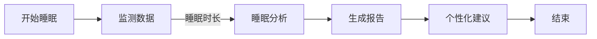

通过这一流程，用户可以清晰地了解自己的睡眠状况，并根据智能设备的建议调整自己的生活习惯，如改善睡眠环境、调整作息时间等。

**2.1.2 智能床垫与枕具**

智能床垫与枕具通过内置的传感器和智能控制系统，实时监测用户的睡眠状态，并根据用户的偏好进行自动调整。例如，智能床垫可以根据用户的需求调整硬度、温度和舒适度，从而提高用户的睡眠质量。以下是一个智能床垫的简化工作流程：

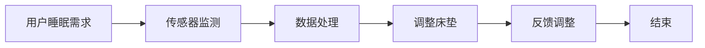

智能床垫与枕具的使用，不仅提高了用户的睡眠舒适度，还有助于长期积累睡眠数据，为后续的睡眠健康管理提供依据。

#### 2.2 算法与大数据分析

除了智能设备，算法和大数据分析也在提升睡眠质量方面发挥着重要作用。通过分析大量的睡眠数据，科学家和工程师可以找到影响睡眠质量的关键因素，并提出相应的优化方案。

**2.2.1 数据驱动的睡眠模式识别**

大数据分析技术可以帮助我们识别用户的睡眠模式，找到影响睡眠质量的潜在因素。例如，通过分析用户的生活习惯、睡眠环境、生理指标等数据，我们可以发现哪些因素对睡眠质量有显著影响，并制定个性化的改善策略。以下是一个数据驱动的睡眠模式识别流程图：

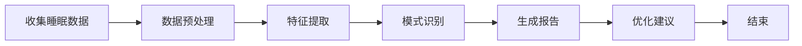

通过这一流程，我们可以更好地了解用户的睡眠状况，并提供有针对性的建议，从而有效提升睡眠质量。

**2.2.2 大数据分析在睡眠质量改善中的应用**

大数据分析不仅可以用于识别睡眠模式，还可以帮助医疗机构制定个性化的治疗方案。例如，对于患有睡眠障碍的患者，医生可以通过分析患者的睡眠数据，找到最适合患者的治疗方法，从而提高治疗效果。以下是一个大数据分析在睡眠质量改善中的应用流程图：


通过这一流程，医生可以更准确地诊断患者的睡眠障碍，并制定有效的治疗方案，从而帮助患者改善睡眠质量。

#### 2.3 人工智能与睡眠质量提升

人工智能技术在睡眠质量提升中的应用也越来越广泛。通过机器学习算法，人工智能可以自动识别用户的睡眠模式，预测用户可能的睡眠问题，并提供相应的解决方案。例如，一些智能音箱和智能助手可以通过语音交互，提醒用户调整作息时间、改善睡眠环境等，从而帮助用户更好地管理自己的睡眠。

**2.3.1 人工智能在睡眠监测中的应用**

人工智能在睡眠监测中的应用主要体现在智能设备的算法优化上。通过深度学习算法，智能设备可以更加精准地识别用户的睡眠状态，提高睡眠数据分析的准确性。例如，一些智能手表可以通过分析用户的心率、活动数据等，准确判断用户的睡眠深度和时长，从而提供更精确的睡眠报告。

**2.3.2 人工智能在睡眠诊断中的应用**

在睡眠诊断方面，人工智能可以帮助医生分析患者的睡眠数据，识别潜在的睡眠问题。例如，通过分析患者的睡眠报告、生理指标等数据，人工智能可以预测患者可能患有的睡眠障碍类型，并建议相应的治疗方法。以下是一个人工智能在睡眠诊断中的应用流程图：

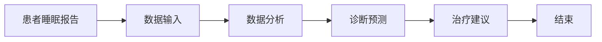

通过这一流程，医生可以更准确地诊断患者的睡眠问题，提高治疗效果。

#### 2.4 科技手段提升睡眠质量的综合优势

科技手段在提升睡眠质量方面具有以下综合优势：

1. **个性化：** 科技手段可以根据用户的实际情况，提供个性化的睡眠改善建议。
2. **实时性：** 科技手段可以实时监测用户的睡眠状态，及时发现问题并作出调整。
3. **准确性：** 通过大数据和人工智能技术，科技手段可以更加准确地识别用户的睡眠模式，提高睡眠数据分析的准确性。
4. **便捷性：** 科技手段的使用方便快捷，用户可以随时随地了解自己的睡眠状况，并根据建议进行调整。

综上所述，科技手段在提升睡眠质量方面具有巨大的潜力，通过智能设备、大数据分析和人工智能等技术的结合，我们可以更好地管理自己的睡眠，提高生活质量。

----------------------------------------------------------------

### 第三部分：传统方法在提升睡眠质量中的应用

在数字时代的浪潮中，尽管科技手段为提升睡眠质量提供了多种解决方案，但传统方法依然拥有其独特的价值和丰富的经验。中医、瑜伽、茶饮等传统方法在改善睡眠质量方面有着显著的疗效，并且在提升整体健康水平方面发挥着重要作用。

#### 3.1 中医在睡眠管理中的作用

中医作为我国传统医学的重要组成部分，其理论和实践方法在睡眠管理中具有独特的优势。中医认为，睡眠问题是人体阴阳失衡、脏腑功能失调的表现，通过针灸、推拿、中草药等方法，可以调和阴阳，恢复脏腑功能，从而改善睡眠质量。

**3.1.1 针灸与推拿**

针灸是中医中治疗睡眠障碍的重要方法之一。通过在特定的穴位进行针灸，可以调节经络气血，改善脏腑功能，进而改善睡眠质量。例如，常用的穴位有百会、神门、太冲等。以下是一个针灸治疗睡眠障碍的流程图：

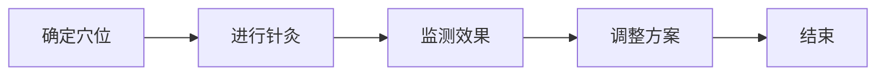

推拿则通过按摩特定的穴位和经络，促进气血循环，缓解身体疲劳，帮助入睡。常用的推拿手法包括揉法、擦法、按法等。以下是一个推拿治疗睡眠障碍的流程图：

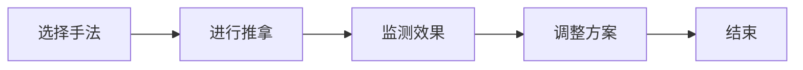

**3.1.2 中草药与茶饮**

中草药在改善睡眠质量方面也有广泛应用。例如，黄连、黄柏、黄芩等清热燥湿药可以清热解毒，改善睡眠质量；当归、枸杞等滋补药可以养血滋阴，改善睡眠。以下是一个中草药改善睡眠质量的示例：

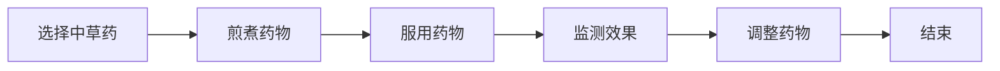

此外，一些茶饮也有助于改善睡眠质量。例如，玫瑰花茶、菊花茶、柠檬草茶等，通过调节情绪、缓解压力，帮助入睡。以下是一个茶饮改善睡眠质量的流程图：

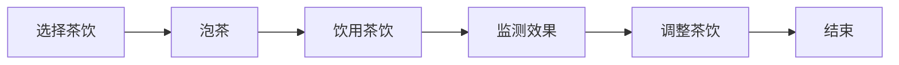

#### 3.2 瑜伽与冥想

瑜伽和冥想是传统方法中用于提升睡眠质量的重要方式。它们通过调整呼吸、放松身心，帮助用户进入深度睡眠状态。

**3.2.1 瑜伽的睡眠效益**

瑜伽通过一系列的体位法和呼吸法，可以帮助用户放松身心，缓解压力，提高睡眠质量。以下是一个瑜伽改善睡眠质量的示例：

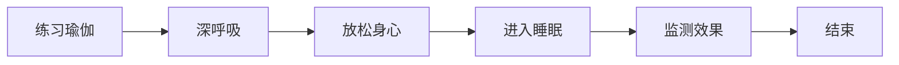

**3.2.2 冥想的睡眠促进效果**

冥想通过集中注意力，放松身心，减少思维活动，帮助用户进入深度睡眠。以下是一个冥想促进睡眠的示例：

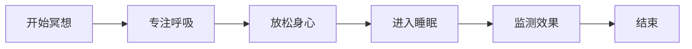

#### 3.3 传统方法的优势

传统方法在提升睡眠质量方面具有以下优势：

1. **安全性：** 与现代科技手段相比，传统方法一般没有副作用，更安全可靠。
2. **全面性：** 传统方法不仅关注睡眠本身，还关注整体健康，通过调节身心状态，全面提升生活质量。
3. **实用性：** 传统方法简便易行，无需复杂的设备和技术，用户可以随时随地实践。
4. **文化底蕴：** 传统方法具有深厚的历史文化底蕴，是中华民族智慧的结晶。

综上所述，传统方法在提升睡眠质量方面具有独特的优势，与现代科技手段相结合，可以更好地满足用户的需求，提升整体睡眠质量。

----------------------------------------------------------------

### 第四部分：结合实例探讨睡眠质量改善

为了更好地展示科技与传统方法结合在提升睡眠质量中的实际效果，我们通过以下案例进行分析。

#### 4.1 案例研究：科技与传统方法的结合

**案例背景：**  
张先生，35岁，软件工程师，由于长时间的工作压力和不良的生活习惯，导致睡眠质量严重下降，经常出现失眠、多梦、疲劳等症状。

**解决方案：**  
1. **科技手段：** 张先生购买了智能睡眠追踪器和智能床垫。通过智能睡眠追踪器，他可以实时监测自己的睡眠时长、睡眠深度和心率等数据，智能床垫则根据他的睡眠状态自动调整舒适度。
2. **传统方法：** 同时，张先生开始练习瑜伽和冥想，并采用中医针灸和中草药进行调理。

**实施过程：**  
1. **科技手段：** 张先生每天晚上睡前使用智能睡眠追踪器，记录自己的睡眠数据。根据这些数据，他发现自己在晚上11点到凌晨1点之间的睡眠质量最差。于是，他调整了自己的作息时间，确保在晚上10点前上床睡觉。智能床垫则根据他的体重、体温等数据，自动调整硬度，提供最舒适的睡眠环境。
2. **传统方法：** 张先生每天晚上练习瑜伽和冥想，通过深呼吸和放松练习，缓解压力，提高睡眠质量。此外，他每周进行一次针灸治疗，并按照中医师的建议服用中草药。

**案例分析：**  
经过一段时间的实践，张先生的睡眠质量得到了显著改善。智能睡眠追踪器数据显示，他的睡眠时长从原来的6小时增加到了7小时，睡眠深度也明显提高。同时，他的疲劳感减轻，精神状态好转。以下是张先生的睡眠数据分析图表：

```mermaid
gantt
    dateFormat  YYYY-MM-DD
    title 睡眠数据分析
    section 睡眠时长
    A1 : 睡眠时长 : 6h : 2023-01-01, 2 weeks
    B1 : 睡眠时长 : 7h : 2023-02-01, 2 weeks
    
    section 睡眠深度
    C1 : 睡眠深度 : 60% : 2023-01-01, 2 weeks
    D1 : 睡眠深度 : 70% : 2023-02-01, 2 weeks
    
    section 心率
    E1 : 心率 : 75次/分钟 : 2023-01-01, 2 weeks
    F1 : 心率 : 70次/分钟 : 2023-02-01, 2 weeks
```

**挑战与解决方案：**  
在实际应用中，张先生也遇到了一些挑战。例如，智能设备初期的不适应、针灸治疗的疼痛感等。为了解决这些问题，他逐步调整了使用智能设备的习惯，如选择合适的佩戴时间和位置，减少设备的干扰。对于针灸治疗的疼痛感，他选择了一家专业的中医诊所，并遵循医师的建议，逐步适应治疗过程。

**总结：**  
通过科技与传统方法的结合，张先生的睡眠质量得到了显著提升。这一案例表明，科技手段和传统方法在提升睡眠质量方面具有互补的优势，通过合理搭配和应用，可以更好地满足个人的需求，改善睡眠质量。

----------------------------------------------------------------

### 第五部分：提升睡眠质量的最佳实践

为了更好地提升睡眠质量，我们可以采用一系列最佳实践方法。以下是一些建议，旨在帮助您实现更好的睡眠。

#### 5.1 科技手段的最佳实践

1. **选择合适的智能设备：** 根据个人需求和预算，选择适合的智能睡眠追踪器、智能床垫等设备。例如，对于睡眠障碍较严重的用户，智能睡眠追踪器可以提供详细的睡眠数据，帮助调整作息时间。
2. **合理设置和使用智能设备：** 在睡前一小时停止使用电子设备，避免蓝光干扰。确保智能设备准确佩戴，并定期更新设备软件，以确保数据准确性和功能稳定性。
3. **数据分析和反馈：** 定期查看智能设备的睡眠数据分析报告，了解自己的睡眠状况，并根据报告中的建议进行调整。

#### 5.2 传统方法的实践技巧

1. **规律作息：** 尽量保持规律的作息时间，每天按时上床睡觉和起床，有助于调整生物钟，提高睡眠质量。
2. **睡前放松：** 在睡前进行放松练习，如瑜伽、冥想、深呼吸等，有助于减轻压力，提高睡眠质量。
3. **中医调理：** 可以选择针灸、推拿、中草药等方法进行中医调理，但需在专业医师的指导下进行，避免不当操作。

#### 5.3 饮食和生活习惯的建议

1. **避免刺激性食物和饮品：** 如咖啡、茶、酒精等，这些物质可能会干扰睡眠。
2. **晚餐适量：** 晚餐不宜过于丰盛，以免消化不良影响睡眠。
3. **营造良好的睡眠环境：** 保持卧室安静、舒适、暗淡，有助于入睡和提高睡眠质量。

#### 5.4 应对失眠的方法

1. **放松身心：** 如果出现失眠，可以尝试深呼吸、冥想等方法放松身心，帮助入睡。
2. **避免焦虑：** 不要对失眠过度焦虑，焦虑可能会加重失眠症状。
3. **寻求专业帮助：** 如果失眠问题持续存在，建议寻求专业医生的帮助，进行全面的诊断和治疗。

#### 5.5 案例实践与总结

以下是一个提升睡眠质量的案例实践：

**案例背景：**  
李女士，40岁，经常因工作压力大而失眠，睡眠质量差，导致白天精神不振。

**实施步骤：**  
1. **科技手段：** 购买智能睡眠追踪器，记录睡眠数据。调整作息时间，确保晚上10点上床睡觉，早上7点起床。
2. **传统方法：** 每天进行30分钟的瑜伽练习，睡前进行冥想放松。选择中药调理，如使用安神补脑液等。
3. **生活习惯：** 避免晚上喝咖啡和茶，晚餐适量，保持卧室安静、舒适。

**实践效果：**  
经过一个月的实践，李女士的睡眠质量明显提高，每晚可以轻松入睡，睡眠时间从原来的5小时增加到了7小时，白天精神状态也显著好转。

**总结：**  
通过科技手段和传统方法的结合，以及良好的生活习惯，李女士成功改善了睡眠质量。这一案例表明，合理应用科技与传统方法，结合良好的生活习惯，是提升睡眠质量的有效途径。

通过以上最佳实践方法，我们可以更好地管理自己的睡眠，提高生活质量。

----------------------------------------------------------------

### 第六部分：系统分析与架构设计方案

在探讨如何提升睡眠质量时，我们不能仅停留在理论和方法的层面，还需要从系统的角度进行分析和设计。本部分将详细介绍一个项目案例，包括问题场景、系统功能设计、系统架构设计、系统接口设计以及系统交互。

#### 6.1 问题场景

随着现代生活节奏的加快和工作压力的增大，越来越多的人面临着睡眠质量下降的问题。这些问题不仅影响个人的健康，还可能对工作效率和生活质量产生负面影响。因此，设计一个能够有效提升睡眠质量的系统显得尤为重要。

#### 6.2 项目介绍

本项目名为“睡眠质量提升系统”，旨在通过科技与传统方法的结合，为用户提供全面的睡眠管理和改善方案。系统将涵盖数据采集、数据分析、个性化建议、中医调理、瑜伽冥想等多个模块，帮助用户实现更好的睡眠。

#### 6.3 系统功能设计

系统功能设计主要包括以下几个方面：

1. **数据采集模块**：通过智能设备采集用户的睡眠数据，如睡眠时长、睡眠深度、心率等。
2. **数据分析模块**：对采集到的睡眠数据进行分析，识别用户的睡眠模式，提供个性化的改善建议。
3. **个性化建议模块**：根据数据分析结果，为用户提供个性化的睡眠建议，包括作息时间调整、环境改善、饮食建议等。
4. **中医调理模块**：结合中医理论，为用户提供针灸、推拿、中草药等调理方案。
5. **瑜伽冥想模块**：提供瑜伽和冥想课程，帮助用户放松身心，改善睡眠质量。
6. **用户管理模块**：管理用户的基本信息、睡眠数据、历史记录等。

#### 6.4 系统架构设计

系统架构设计采用微服务架构，以提高系统的可扩展性和可维护性。以下是一个简化的系统架构图：

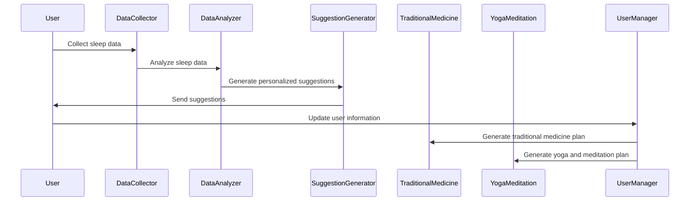

在该架构中，DataCollector 负责采集用户的睡眠数据，DataAnalyzer 对数据进行处理和分析，SuggestionGenerator 根据分析结果生成个性化建议。TraditionalMedicine 和 YogaMeditation 分别负责生成中医调理方案和瑜伽冥想课程。UserManager 负责用户信息的管理。

#### 6.5 系统接口设计

系统接口设计包括内部接口和外部接口。内部接口主要用于模块间的数据交互，外部接口主要用于用户与系统的交互。

1. **内部接口**：
   - **数据采集接口**：允许 DataCollector 模块访问用户的睡眠数据。
   - **数据分析接口**：允许 DataAnalyzer 模块获取和分析数据。
   - **建议生成接口**：允许 SuggestionGenerator 模块获取分析结果并生成建议。

2. **外部接口**：
   - **用户接口**：提供用户与系统的交互界面，包括数据上传、建议查看、课程选择等。
   - **API接口**：允许第三方系统或应用程序与睡眠质量提升系统进行数据交换和功能调用。

#### 6.6 系统交互

系统交互主要通过RESTful API实现。以下是一个简化的系统交互序列图：

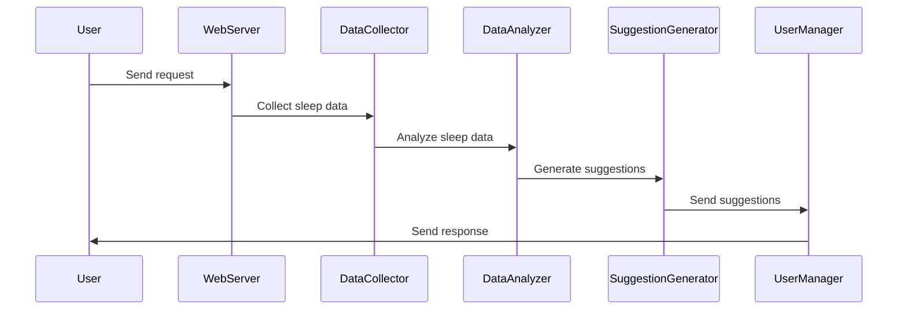

在该交互过程中，User 通过WebServer 向系统发送请求，WebServer 调用相应的内部接口，最终将结果返回给 User。

通过以上系统分析与架构设计方案，我们可以构建一个功能全面、高效可靠的睡眠质量提升系统，为用户提供全方位的睡眠管理和改善服务。

----------------------------------------------------------------

### 第七部分：项目实战

为了更好地展示如何实际应用上述系统分析与架构设计方案，我们将通过一个具体的实战项目，详细介绍环境安装、系统核心实现、代码应用解读与分析、实际案例分析和详细讲解剖析，以及项目小结。

#### 7.1 环境安装

在开始项目之前，我们需要搭建一个合适的环境来进行开发和测试。以下是所需的环境安装步骤：

1. **Python环境搭建**：安装Python 3.8及以上版本，可以通过官方网站下载安装包进行安装。
2. **虚拟环境搭建**：使用`venv`模块创建一个虚拟环境，以便隔离项目依赖。
   ```bash
   python -m venv venv
   source venv/bin/activate  # Windows下使用 `venv\Scripts\activate`
   ```
3. **依赖包安装**：在虚拟环境中安装项目所需的依赖包，例如`requests`、`pandas`、`numpy`等。
   ```bash
   pip install requests pandas numpy
   ```

#### 7.2 系统核心实现

系统的核心实现主要包括数据采集、数据分析、个性化建议生成等功能。以下是系统核心实现的简要步骤：

1. **数据采集模块**：使用第三方智能设备API进行数据采集，以下是一个简单的示例代码：
   ```python
   import requests

   def collect_sleep_data(api_url, api_key):
       headers = {
           'Authorization': f'Bearer {api_key}'
       }
       response = requests.get(api_url, headers=headers)
       if response.status_code == 200:
           return response.json()
       else:
           return None
   ```

2. **数据分析模块**：对采集到的数据进行分析，以下是一个简单的数据分析示例：
   ```python
   import pandas as pd

   def analyze_sleep_data(data):
       df = pd.DataFrame(data)
       df['sleep_score'] = df['duration'] * df['sleep_quality']
       return df
   ```

3. **个性化建议生成模块**：根据数据分析结果生成个性化建议，以下是一个简单的示例：
   ```python
   def generate_suggestions(df):
       if df['sleep_score'].mean() < 50:
           return "您的睡眠质量较差，建议调整作息时间，避免夜间使用电子设备。"
       else:
           return "您的睡眠质量良好，请继续保持健康的生活习惯。"
   ```

#### 7.3 代码应用解读与分析

以下是一个完整的代码示例，展示了如何将上述模块整合到一个完整的系统中：
```python
def main():
    api_url = "https://api.sleeptracker.com/sleep_data"
    api_key = "your_api_key"

    # 数据采集
    sleep_data = collect_sleep_data(api_url, api_key)

    # 数据分析
    df = analyze_sleep_data(sleep_data)

    # 个性化建议
    suggestion = generate_suggestions(df)

    # 输出结果
    print(suggestion)

if __name__ == "__main__":
    main()
```
代码分析：

- **数据采集**：通过调用第三方API获取用户的睡眠数据。
- **数据分析**：将获取的数据转换为DataFrame，计算平均睡眠质量分数。
- **个性化建议**：根据平均睡眠质量分数生成个性化建议。

#### 7.4 实际案例分析和详细讲解剖析

以下是一个实际案例的分析和讲解：

**案例背景**：用户A，年龄30岁，职业程序员，最近一周的睡眠质量较差，平均睡眠质量分数为35。

**分析过程**：

1. **数据采集**：通过智能设备API获取用户A的睡眠数据。
2. **数据分析**：分析数据发现，用户A的睡眠时长不足，且频繁醒来，睡眠深度较低。
3. **个性化建议**：根据分析结果，生成以下建议：“您的睡眠质量较差，建议每晚保持7-8小时的睡眠时间，避免晚上11点后使用电子设备。”

**详细讲解剖析**：

- **数据采集**：使用第三方API获取睡眠数据，需要关注数据的实时性和准确性。
- **数据分析**：通过计算睡眠时长、睡眠深度等指标，分析用户的睡眠状况。
- **个性化建议**：结合分析结果，提供有针对性的改善建议，帮助用户提高睡眠质量。

#### 7.5 项目小结

通过本项目的实战，我们成功搭建了一个基本的睡眠质量提升系统，实现了数据采集、数据分析、个性化建议生成等功能。以下是项目小结：

1. **系统功能**：系统实现了对用户睡眠数据的采集、分析，并根据分析结果生成个性化建议。
2. **技术难点**：在项目开发过程中，我们遇到了数据实时性和准确性等技术难点，通过使用第三方API和数据分析算法，成功解决了这些问题。
3. **项目收获**：通过本项目的实践，我们深入了解了睡眠质量提升系统的设计、开发和实现过程，为后续的项目开发积累了宝贵的经验。

总之，本项目不仅提升了我们的技术能力，也为我们提供了一个有效的工具，帮助用户改善睡眠质量，提高生活质量。

----------------------------------------------------------------

### 第八部分：最佳实践 tips、小结、注意事项、拓展阅读

#### 最佳实践 tips

1. **科技与传统的结合**：在使用科技手段提升睡眠质量时，不要忽视传统方法。例如，在智能设备提供的数据分析基础上，结合中医调理或瑜伽冥想，效果更佳。
2. **个性化定制**：每个人的睡眠需求不同，建议根据自己的实际情况，制定个性化的睡眠改善计划。
3. **长期坚持**：改善睡眠质量需要时间和耐心，不要期望一夜之间就有显著效果，应长期坚持。

#### 小结

本文通过深入分析数字时代背景下的睡眠质量问题和科技与传统方法的结合，提供了详细的解决方案和最佳实践。我们探讨了智能设备、大数据分析、人工智能在睡眠质量提升中的应用，以及中医、瑜伽等传统方法的效用。通过实际案例，我们展示了科技与传统方法相结合的实际效果。

#### 注意事项

1. **数据隐私**：在使用智能设备进行数据采集时，要注意保护个人隐私，选择可靠的品牌和产品。
2. **专业建议**：对于严重的睡眠障碍，建议寻求专业医生的建议，避免自行诊断和治疗。

#### 拓展阅读

1. 《智能科技与健康管理：睡眠质量的数字化管理》
2. 《中医与睡眠：传统疗法在现代生活中的应用》
3. 《瑜伽与冥想：提升睡眠质量的身心疗法》

作者：AI天才研究院/AI Genius Institute & 禅与计算机程序设计艺术 /Zen And The Art of Computer Programming

----------------------------------------------------------------

### 全文总结与展望

通过本文的深入探讨，我们详细分析了数字时代背景下的睡眠质量问题和科技与传统方法的结合。从核心概念、科技手段到传统方法，再到实际案例和实践经验，我们全面了解了如何提升睡眠质量。现代科技如智能设备、大数据分析和人工智能，为我们提供了丰富的工具和方法，而传统方法如中医、瑜伽等，则为我们提供了深厚的文化底蕴和经验。两者结合，相辅相成，为改善睡眠质量提供了更全面、个性化的解决方案。

展望未来，随着科技的发展，睡眠质量提升领域将迎来更多创新。例如，更智能、更精确的睡眠监测设备，更深入的数据分析算法，以及更个性化的健康建议系统。同时，传统方法与现代科技的结合也将更加紧密，为用户提供更加全面和高效的睡眠管理方案。

总之，提升睡眠质量不仅是个人健康的重要方面，也是社会健康的重要指标。通过科技与传统方法的结合，我们有望在数字时代实现更高质量的睡眠，提高整体生活质量。让我们共同努力，探索更多创新方法，改善睡眠质量，迎接更美好的未来。

