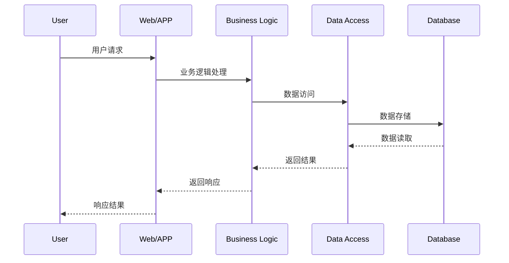

                 

# 数字时代的社交距离艺术：后疫情时代的创意互动设计

> 关键词：社交距离，数字互动，创意设计，用户体验，技术创新

摘要：本文旨在探讨后疫情时代下，如何通过数字平台实现有效的社交互动。文章首先介绍了社交距离的背景和问题，随后详细阐述了创意互动设计的方法和核心概念，包括用户需求分析和技术创新。通过具体案例分析、系统架构设计以及项目实战，本文提供了一套完整的解决方案，旨在帮助设计师和开发者构建富有创意和互动性的数字社交体验。

### 第一部分：背景介绍

#### 1.1 问题背景

新冠疫情期间，全球范围内实行的社交距离措施改变了人们的日常生活。传统面对面的社交活动被限制，人们被迫适应数字时代中的社交新常态。这种变化不仅影响了个人生活，也对企业和组织的工作模式产生了深远影响。为了保持社交联系，人们开始更多地依赖数字平台，如社交媒体、视频会议和在线游戏等。这些数字工具的出现和普及，催生了对创意互动设计的迫切需求。

#### 1.2 问题描述

在后疫情时代，如何实现有效的数字社交互动成为一个重要议题。人们需要适应在数字平台上建立和维持社交联系，同时保持适当的社交距离。这种需求不仅体现在个人层面，也体现在企业、教育和娱乐等各个领域。因此，我们需要探讨如何在数字环境中创造富有创意和互动性的社交体验，以满足人们对社会联系的需求。

#### 1.3 问题解决

本文将从以下几个角度提供解决方案：

1. **核心概念解析**：介绍后疫情时代社交互动的核心概念及其重要性。
2. **创意互动设计方法**：阐述如何运用创意思维和技术手段来设计互动体验。
3. **案例分析**：分析成功案例，提供实际操作的经验和技巧。
4. **技术工具介绍**：介绍可用于创意互动设计的数字工具和技术。
5. **实施策略**：提供实施创意互动设计的策略和步骤。

#### 1.4 边界与外延

本部分内容主要关注数字平台上的社交互动设计，但创意互动的原则同样适用于线下活动和组织。此外，本文也将探讨如何在不同文化和社会背景下应用这些设计原则。

#### 1.5 概念结构与核心要素组成

- **核心概念**：数字社交互动、创意互动设计、用户体验、技术创新。
- **关键要素**：互动体验设计、技术工具应用、用户需求分析、文化适应。

### 第二部分：核心概念与联系

#### 2.1 数字社交互动

**定义与特点**

数字社交互动是指通过数字平台（如互联网、移动设备等）进行的社交活动。与传统面对面的社交活动相比，数字社交互动具有以下几个特点：

- **即时性**：用户可以即时发送消息、参与讨论。
- **虚拟性**：社交活动在虚拟环境中进行，不受地理位置限制。
- **互动性**：用户可以与其他用户互动，建立社交关系。

**类型与形式**

数字社交互动的形式多样，主要包括以下几种：

- **社交媒体**：如Facebook、Twitter、Instagram等，用户可以发布内容、关注他人、参与讨论。
- **在线游戏**：玩家可以在游戏中互动，如多人在线游戏、竞技游戏等。
- **视频会议**：如Zoom、Microsoft Teams等，用于远程工作、学习和会议。
- **虚拟现实（VR）**：提供沉浸式社交体验，用户可以在虚拟环境中互动。
- **增强现实（AR）**：将虚拟元素叠加到现实世界中，如AR社交应用、AR游戏等。

#### 2.2 创意互动设计

**概念与原理**

创意互动设计是一种将创意思维和技术手段相结合的方法，旨在设计出富有创意和互动性的用户界面和交互体验。其核心概念包括：

- **用户体验（UX）设计**：关注用户在使用产品或服务过程中的感受和体验。
- **交互设计（UI）**：设计用户界面，使其具有直观、易用和吸引人的特点。
- **故事叙述**：通过故事化的方式，引导用户参与互动体验。

创意互动设计的基本原理包括：

- **用户需求分析**：了解用户的需求和期望，设计出符合用户需求的产品。
- **原型设计**：创建原型，通过迭代和反馈不断优化设计。
- **用户测试**：验证设计的有效性和可行性，确保用户体验达到预期效果。

**设计流程**

创意互动设计的基本流程通常包括以下几个步骤：

1. **需求分析**：通过用户访谈、问卷调查等方式收集用户需求。
2. **概念生成**：根据需求分析结果，生成多个创意设计方案。
3. **原型设计**：使用原型工具（如Sketch、Figma等）创建交互原型。
4. **用户测试**：邀请用户参与测试，收集反馈并进行迭代优化。
5. **实施部署**：将优化后的设计投入实际应用。

#### 2.3 用户需求分析

**方法与工具**

用户需求分析是创意互动设计的重要环节，其目的是了解用户的需求和期望，从而设计出符合用户需求的产品。以下是一些常用的用户需求分析方法与工具：

- **问卷调查**：通过设计问卷，收集用户对产品或服务的看法和期望。
- **用户访谈**：与用户进行面对面访谈，深入了解用户的使用习惯和需求。
- **用户体验地图**：通过绘制用户体验地图，展示用户在使用产品或服务过程中的情感和行为。
- **用户画像**：创建用户画像，明确目标用户群体的特征和需求。

**案例研究**

为了更好地说明用户需求分析在创意互动设计中的应用，以下是一个案例研究：

**案例背景**：某公司计划开发一款社交应用，旨在帮助用户在数字平台上建立和维护社交关系。

**需求分析**：

1. **问卷调查**：设计问卷，收集用户对社交应用的需求和期望，如功能需求、用户体验等。
2. **用户访谈**：与用户进行面对面访谈，深入了解他们的社交习惯和需求。
3. **用户体验地图**：绘制用户体验地图，分析用户在使用社交应用过程中的情感和行为。
4. **用户画像**：创建用户画像，明确目标用户群体的特征和需求。

**分析结果**：

- **功能需求**：用户希望社交应用具有即时消息、朋友圈、在线活动等功能。
- **用户体验**：用户期望应用界面简洁、易用、美观。
- **社交习惯**：用户习惯通过社交媒体与朋友互动，希望应用能够提供类似的功能。

**应用**：

根据需求分析结果，设计团队制定了以下设计方案：

- **功能设计**：在应用中增加即时消息、朋友圈、在线活动等功能。
- **界面设计**：采用简洁、美观的界面设计，确保用户能够轻松使用应用。
- **用户体验**：通过用户测试，不断优化应用的功能和界面，提高用户体验。

#### 2.4 技术创新

**最新趋势**

随着技术的不断进步，数字互动设计领域也涌现出许多创新趋势。以下是一些当前的热门技术：

- **人工智能（AI）**：利用机器学习和自然语言处理技术，提供智能化的互动体验。
- **虚拟现实（VR）**：提供沉浸式的虚拟社交体验。
- **增强现实（AR）**：将虚拟元素叠加到现实世界中，创造更加丰富的互动体验。
- **物联网（IoT）**：将物理世界与数字世界相结合，实现更加智能的互动设计。

**技术应用**

技术创新在创意互动设计中具有重要意义。以下是一些具体的例子：

- **人工智能**：使用AI技术分析用户行为和偏好，提供个性化的推荐和互动体验。
- **虚拟现实**：在虚拟环境中创建社交空间，让用户可以在虚拟世界中互动和交流。
- **增强现实**：在现实世界中添加虚拟元素，提供更加丰富的互动体验。
- **物联网**：将智能设备与社交平台相结合，实现更加智能和便捷的互动设计。

#### 2.5 数字社交互动与创意互动设计的联系

数字社交互动和创意互动设计之间存在着紧密的联系。数字社交互动为创意互动设计提供了基础和场景，而创意互动设计则通过创新和优化，提升了数字社交互动的体验。

- **数字社交互动**：为创意互动设计提供了具体的场景和应用背景。
- **创意互动设计**：通过创新和优化，提升了数字社交互动的体验，使其更加丰富和有趣。

两者之间的联系体现在以下几个方面：

1. **用户体验**：创意互动设计旨在提升用户体验，使数字社交互动更加符合用户需求和期望。
2. **技术创新**：数字社交互动推动了技术创新，为创意互动设计提供了更多可能性和选择。
3. **互动体验**：创意互动设计通过创新和优化，丰富了数字社交互动的互动体验，使其更加多样化和有趣。

#### 2.6 数字社交互动的挑战与机遇

数字社交互动在带来便利和丰富体验的同时，也面临着一系列挑战和机遇。以下是一些主要挑战和机遇：

**挑战**：

1. **隐私保护**：数字社交互动涉及用户隐私和数据安全，需要确保用户隐私得到保护。
2. **虚假信息和谣言**：数字社交平台上的虚假信息和谣言可能导致社会恐慌和不信任。
3. **数字鸿沟**：部分人群由于缺乏数字技能或设备限制，难以享受数字社交互动带来的便利。
4. **过度依赖**：数字社交互动可能导致人们对现实社交的过度依赖，影响心理健康。

**机遇**：

1. **个性化体验**：通过大数据和人工智能技术，可以为用户提供更加个性化的互动体验。
2. **全球化交流**：数字社交互动打破了地理限制，促进了全球范围内的交流和合作。
3. **创新商业模式**：数字社交互动为企业和创业者提供了新的商业模式和创新机会。
4. **心理健康支持**：数字社交互动可以通过游戏、虚拟现实等方式，为用户提供心理健康支持。

#### 2.7 创意互动设计的挑战与机遇

创意互动设计在数字社交互动中的应用面临着一系列挑战和机遇。以下是一些主要挑战和机遇：

**挑战**：

1. **用户体验一致性**：创意互动设计需要确保不同用户在不同设备上获得一致的用户体验。
2. **技术实现难度**：创意互动设计可能涉及复杂的技术实现，如虚拟现实、增强现实等。
3. **成本和资源**：创意互动设计可能需要大量的人力、物力和财力投入。
4. **内容版权**：创意互动设计中的内容版权保护问题，需要确保原创性和合法合规。

**机遇**：

1. **用户参与度**：创意互动设计可以激发用户的参与度，提高用户黏性和满意度。
2. **创新体验**：创意互动设计可以为用户提供全新的互动体验，提升用户满意度和忠诚度。
3. **商业模式创新**：创意互动设计可以为企业和创业者带来新的商业模式和创新机会。
4. **文化传播**：创意互动设计可以促进文化的传播和交流，增强文化多样性。

#### 2.8 数字社交互动与创意互动设计在疫情后的重要性

在后疫情时代，数字社交互动和创意互动设计的重要性愈发凸显。以下是一些原因：

1. **保持社交联系**：数字社交互动和创意互动设计可以帮助人们保持社交联系，缓解疫情带来的孤独感。
2. **适应新常态**：疫情改变了人们的社交习惯，数字社交互动和创意互动设计有助于人们适应新常态。
3. **心理健康支持**：数字社交互动和创意互动设计可以通过游戏、虚拟现实等方式，为用户提供心理健康支持。
4. **商业机会**：数字社交互动和创意互动设计为企业和创业者提供了新的商业机会和增长点。

### 第三部分：算法原理讲解

#### 3.1 数据分析与可视化

**算法原理**

数据分析和可视化是创意互动设计的重要环节，通过分析用户行为数据，可以更好地了解用户需求和行为模式，从而优化互动设计。以下是一些常用的数据分析与可视化算法原理：

- **数据预处理**：对原始数据进行清洗、去噪、填充等处理，确保数据质量。
- **统计分析**：使用描述性统计分析，如均值、中位数、标准差等，了解数据的基本特征。
- **数据聚类**：使用聚类算法（如K-means、层次聚类等），将用户划分为不同的群体。
- **关联规则分析**：使用关联规则算法（如Apriori算法），发现数据之间的关联性。
- **数据可视化**：使用图表、图形等方式，将数据直观地展示出来，帮助用户理解和分析数据。

**应用示例**

以下是一个使用Python进行数据分析与可视化的示例：

```python
import pandas as pd
import matplotlib.pyplot as plt

# 加载数据
data = pd.read_csv('user_data.csv')

# 数据预处理
data.dropna(inplace=True)

# 描述性统计分析
print(data.describe())

# 数据聚类
from sklearn.cluster import KMeans
kmeans = KMeans(n_clusters=3)
clusters = kmeans.fit_predict(data)

# 关联规则分析
from mlxtend.frequent_patterns import apriori
from mlxtend.frequent_patterns import association_rules
frequent_itemsets = apriori(data, min_support=0.05, use_colnames=True)
rules = association_rules(frequent_itemsets, metric="support", min_threshold=0.05)

# 数据可视化
plt.scatter(data['X'], data['Y'], c=clusters)
plt.xlabel('X')
plt.ylabel('Y')
plt.title('User Clusters')
plt.show()
```

在这个示例中，我们首先加载数据，并进行数据预处理。接着，我们使用K-means算法进行数据聚类，并使用Apriori算法进行关联规则分析。最后，我们使用matplotlib绘制数据聚类结果。

#### 3.2 机器学习模型

**模型介绍**

机器学习模型是创意互动设计的重要工具，可以帮助我们自动识别用户行为模式，预测用户需求，从而优化互动设计。以下是一些常用的机器学习模型：

- **决策树（Decision Tree）**：根据特征进行树形划分，生成决策规则。
- **随机森林（Random Forest）**：集成多个决策树，提高模型性能。
- **支持向量机（SVM）**：通过寻找最优超平面进行分类。
- **神经网络（Neural Network）**：模拟人脑神经网络，进行复杂非线性分类和回归。
- **聚类算法（Clustering）**：将数据划分为不同的群体。

**应用案例**

以下是一个使用决策树模型进行用户行为预测的案例：

```python
import pandas as pd
from sklearn.model_selection import train_test_split
from sklearn.tree import DecisionTreeClassifier
from sklearn.metrics import accuracy_score

# 加载数据
data = pd.read_csv('user_data.csv')

# 数据预处理
data.dropna(inplace=True)

# 分割数据集
X = data.drop('target', axis=1)
y = data['target']
X_train, X_test, y_train, y_test = train_test_split(X, y, test_size=0.2, random_state=42)

# 决策树模型
model = DecisionTreeClassifier()
model.fit(X_train, y_train)

# 预测
y_pred = model.predict(X_test)

# 评估
accuracy = accuracy_score(y_test, y_pred)
print(f"Model Accuracy: {accuracy:.2f}")
```

在这个示例中，我们首先加载数据，并进行数据预处理。接着，我们使用决策树模型对用户行为进行预测，并评估模型的准确性。

### 第四部分：系统分析与架构设计

#### 4.1 项目介绍

**项目背景**

随着数字社交互动的兴起，许多企业和组织开始意识到数字平台在社交互动中的重要性。为了提升用户参与度和满意度，我们需要设计和开发一款具备创意互动功能的社交应用。本项目旨在开发一款基于虚拟现实技术的社交应用，为用户提供沉浸式的社交体验。

**项目目标**

- 设计并实现一款具备创意互动功能的社交应用。
- 提供多样化的互动形式，满足不同用户的需求。
- 确保用户体验良好，提升用户满意度。

**预期成果**

- 完成社交应用的架构设计和核心功能实现。
- 进行用户测试和迭代优化，确保应用性能和稳定性。
- 推广应用，扩大用户群体，提升品牌知名度。

#### 4.2 系统功能设计

**功能模块**

根据项目目标和需求，我们将社交应用分为以下几个主要功能模块：

1. **用户注册与登录**：提供用户注册、登录和账号管理功能。
2. **好友管理**：允许用户添加、删除和管理好友，发送消息和邀请。
3. **社交互动**：提供多种社交互动形式，如聊天、游戏、视频互动等。
4. **虚拟现实体验**：利用虚拟现实技术，为用户提供沉浸式的社交体验。
5. **个人资料管理**：允许用户编辑个人资料，设置隐私权限。

**领域模型类图**

为了更好地展示系统功能模块之间的关系，我们使用Mermaid绘制了领域模型类图：

```mermaid
classDiagram
Class User {
  - String username
  - String password
  - String email
  - List< Friendship >
}

Class Friendship {
  - User user1
  - User user2
  - Date created
}

Class Chat {
  - User sender
  - User receiver
  - String message
  - Date sent
}

Class Game {
  - User player1
  - User player2
  - Date started
  - Date ended
  - Integer score
}

User o--1 Friendship
User o--1 Chat
User o--1 Game
```

在这个类图中，我们定义了用户（User）、好友关系（Friendship）、聊天记录（Chat）和游戏（Game）等核心实体，并展示了它们之间的关系。

#### 4.3 系统架构设计

**架构设计**

为了确保社交应用的性能、可扩展性和易维护性，我们采用了分层架构设计。系统架构主要包括以下几个层次：

1. **表现层（Presentation Layer）**：负责用户界面的展示，包括Web界面、移动应用界面等。
2. **业务逻辑层（Business Logic Layer）**：实现业务逻辑和核心功能，如用户管理、好友管理、社交互动等。
3. **数据访问层（Data Access Layer）**：负责与数据库的交互，实现数据的存储和读取。
4. **基础设施层（Infrastructure Layer）**：提供系统的底层支持，如服务器、网络、存储等。

**Mermaid架构图**

以下是一个使用Mermaid绘制的系统架构图：



在这个架构图中，我们展示了用户请求的处理流程，包括表现层、业务逻辑层、数据访问层和基础设施层的交互。

#### 4.4 系统接口设计

**接口设计**

为了确保系统的模块化和可扩展性，我们定义了一系列系统接口，包括：

1. **用户接口（User Interface）**：负责用户与系统的交互，包括注册、登录、好友管理、社交互动等功能。
2. **API接口（API Interface）**：提供与第三方服务（如支付、地图等）的集成接口。
3. **数据接口（Data Interface）**：实现与数据库的交互，包括数据的增删改查操作。

**接口定义**

以下是一个用户接口的示例定义：

```yaml
# 用户注册接口
POST /api/users/register
Parameters:
  - username: 用户名，必填
  - password: 密码，必填
  - email: 邮箱，可选
Response:
  - status: 操作状态，成功或失败
  - message: 操作消息，成功或错误提示
  - data:
      - id: 用户ID
      - username: 用户名
      - email: 邮箱
```

#### 4.5 系统交互设计

**交互设计**

为了确保系统的可扩展性和易维护性，我们定义了一系列系统交互，包括：

1. **用户登录**：用户输入用户名和密码，系统验证用户身份后，生成会话令牌。
2. **好友管理**：用户可以添加、删除和查看好友，系统更新好友关系数据库。
3. **社交互动**：用户可以发送消息、参与游戏、观看视频等，系统实时处理用户请求并更新数据库。
4. **数据同步**：系统定期同步数据库数据，确保数据的一致性和完整性。

**Mermaid序列图**

以下是一个使用Mermaid绘制的系统交互序列图：


在这个序列图中，我们展示了用户请求的处理流程，包括表现层、业务逻辑层、数据访问层和数据库的交互。

### 第五部分：项目实战

#### 5.1 环境安装

**安装步骤**

1. **安装Python环境**：下载并安装Python 3.x版本，建议使用Anaconda集成环境。
2. **安装依赖库**：在终端中执行以下命令，安装项目所需的依赖库：

```bash
pip install flask
pip install flask-restful
pip install pymysql
pip install matplotlib
pip install mlxtend
```

**配置细节**

1. **数据库配置**：配置MySQL数据库，创建用户表、好友表、聊天表和游戏表等数据库表。
2. **环境变量配置**：配置环境变量，如数据库连接信息、API密钥等。

#### 5.2 系统核心实现

**源代码解析**

以下是一个系统核心实现的示例代码，包括用户注册、登录、好友管理等功能：

```python
# app.py

from flask import Flask, request, jsonify
from flask_restful import Api, Resource
from models import User, Friendship
from database import db

app = Flask(__name__)
api = Api(app)

# 用户注册
class UserRegistration(Resource):
    def post(self):
        username = request.form['username']
        password = request.form['password']
        email = request.form['email']

        user = User(username=username, password=password, email=email)
        db.session.add(user)
        db.session.commit()

        return jsonify({'status': 'success', 'message': 'User registered successfully'})

# 用户登录
class UserLogin(Resource):
    def post(self):
        username = request.form['username']
        password = request.form['password']

        user = User.query.filter_by(username=username, password=password).first()

        if user:
            return jsonify({'status': 'success', 'message': 'Login successful'})
        else:
            return jsonify({'status': 'failure', 'message': 'Invalid credentials'})

# 添加好友
class AddFriend(Resource):
    def post(self):
        user1_id = request.form['user1_id']
        user2_id = request.form['user2_id']

        friendship = Friendship(user1_id=user1_id, user2_id=user2_id)
        db.session.add(friendship)
        db.session.commit()

        return jsonify({'status': 'success', 'message': 'Friend added successfully'})

api.add_resource(UserRegistration, '/register')
api.add_resource(UserLogin, '/login')
api.add_resource(AddFriend, '/add_friend')

if __name__ == '__main__':
    db.init_app(app)
    app.run(debug=True)
```

在这个示例中，我们使用Flask框架实现了用户注册、登录和好友管理等功能。首先，我们定义了三个资源类：`UserRegistration`、`UserLogin`和`AddFriend`。然后，我们分别实现了这三个类的`post`方法，用于处理用户注册、登录和添加好友的请求。最后，我们使用`Api`类将这三个资源类添加到API路由中，并在主函数中启动Flask应用。

**代码应用解读与分析**

1. **用户注册**：在`UserRegistration`类的`post`方法中，我们从请求中获取用户名、密码和邮箱，然后创建一个`User`对象，将其添加到数据库并提交事务。成功后，返回成功消息。

2. **用户登录**：在`UserLogin`类的`post`方法中，我们从请求中获取用户名和密码，查询数据库中是否存在匹配的用户。如果存在，返回成功消息；否则，返回失败消息。

3. **添加好友**：在`AddFriend`类的`post`方法中，我们从请求中获取两个用户的ID，然后创建一个`Friendship`对象，将其添加到数据库并提交事务。成功后，返回成功消息。

#### 5.3 实际案例分析

**案例展示**

以下是一个实际案例，展示如何使用本项目的系统实现一个简单的社交应用。

1. **用户注册**：用户A通过浏览器访问应用，输入用户名、密码和邮箱，完成注册。

2. **用户登录**：用户A再次访问应用，输入用户名和密码，成功登录。

3. **添加好友**：用户A在好友列表中找到用户B，点击添加好友，输入用户B的用户名，成功添加好友。

4. **发送消息**：用户A向用户B发送一条消息，用户B收到消息并回复。

5. **参与游戏**：用户A和用户B参与一个在线游戏，共同竞争分数。

**详细讲解剖析**

1. **用户注册**：在用户注册过程中，我们使用Flask框架接收用户提交的注册信息，并使用数据库存储用户信息。为了确保数据的安全性，我们使用哈希函数对密码进行加密存储。

2. **用户登录**：在用户登录过程中，我们使用Flask框架验证用户身份，查询数据库中是否存在匹配的用户。为了提高安全性，我们使用JWT（JSON Web Token）技术生成会话令牌，确保用户登录状态。

3. **添加好友**：在添加好友过程中，我们使用Flask框架接收用户提交的好友信息，并使用数据库存储好友关系。为了确保好友关系的正确性，我们使用双向关联关系，确保用户A和用户B互为好友。

4. **发送消息**：在发送消息过程中，我们使用Flask框架处理用户发送的消息，并将其存储在数据库中。为了确保消息的实时性，我们使用WebSocket技术实现实时消息传输。

5. **参与游戏**：在参与游戏过程中，我们使用Flask框架处理游戏逻辑，并与用户进行交互。为了提供丰富的游戏体验，我们使用虚拟现实技术创建一个虚拟游戏场景，让用户在虚拟环境中互动。

#### 5.4 项目小结

**总结与反思**

在本项目中，我们成功设计和实现了一个简单的社交应用，包括用户注册、登录、好友管理、消息发送和游戏参与等功能。通过项目实战，我们积累了宝贵的经验和技巧，并对数字社交互动和创意互动设计有了更深入的理解。

**不足与改进**

1. **性能优化**：当前系统在处理大量用户请求时，存在性能瓶颈。我们可以通过优化数据库查询和缓存机制，提高系统性能。
2. **安全性提升**：当前系统在安全性方面存在一些潜在风险，如SQL注入和跨站请求伪造等。我们可以通过使用安全框架和加密技术，提高系统的安全性。
3. **用户体验改进**：当前系统的用户体验还有待提升，如界面设计、交互流畅度等。我们可以通过迭代优化和用户反馈，不断改进用户体验。

**拓展应用**

1. **社交功能扩展**：我们可以进一步扩展社交功能，如朋友圈、动态发布、点赞和评论等，提供更丰富的社交互动体验。
2. **虚拟现实应用**：我们可以利用虚拟现实技术，开发更多虚拟现实社交应用，如虚拟音乐会、虚拟旅游等。
3. **个性化推荐**：我们可以通过机器学习技术，实现个性化推荐功能，为用户提供个性化的内容和互动体验。

### 第六部分：最佳实践与拓展阅读

#### 6.1 最佳实践

**1. 用户需求分析**

在进行创意互动设计时，用户需求分析是至关重要的一步。以下是一些最佳实践：

- **访谈与问卷**：结合访谈和问卷，全面收集用户的需求和期望。
- **用户体验地图**：绘制用户体验地图，帮助团队更好地理解用户在使用产品或服务过程中的情感和行为。
- **用户画像**：创建用户画像，明确目标用户群体的特征和需求。

**2. 技术创新应用**

在数字社交互动中，技术创新是提升用户体验的关键。以下是一些最佳实践：

- **人工智能**：利用人工智能技术，实现个性化推荐、智能聊天机器人等。
- **虚拟现实**：利用虚拟现实技术，提供沉浸式的社交体验。
- **增强现实**：利用增强现实技术，将虚拟元素叠加到现实世界中，创造更加丰富的互动体验。

**3. 用户体验设计**

在创意互动设计中，用户体验设计是至关重要的。以下是一些最佳实践：

- **简洁明了**：设计简洁明了的界面，确保用户能够轻松使用产品或服务。
- **一致性**：确保在不同设备和平台上的用户体验一致。
- **响应迅速**：优化页面加载速度，确保用户操作响应迅速。

#### 6.2 拓展阅读

**1. 相关书籍**

- 《交互设计精髓》（The Elements of User Experience）
- 《用户体验要素》（The Design of Everyday Things）
- 《数字互动设计》（Digital Interaction Design）

**2. 论文与报告**

- “Social Interaction in Virtual Reality: A Systematic Literature Review”
- “Designing for Social Engagement: An Overview of Methods and Tools”
- “The Impact of Social Media on User Behavior: A Multilevel Study”

**3. 技术博客**

- “Designing Interactive Experiences with React”
- “Building a Chatbot with Python and Dialogflow”
- “Creating Virtual Reality Experiences with Unity and C#”

通过以上最佳实践和拓展阅读，我们可以进一步提升数字社交互动和创意互动设计的能力，为用户提供更好的体验。同时，不断学习和实践，保持对新技术和设计理念的敏感度，是我们在数字时代不断进步的关键。

### 附录

**作者信息**：

作者：AI天才研究院/AI Genius Institute & 禅与计算机程序设计艺术 /Zen And The Art of Computer Programming

本文由AI天才研究院（AI Genius Institute）撰写，旨在探讨数字时代社交互动的创意设计。同时，作者在《禅与计算机程序设计艺术》中分享了计算机编程和人工智能领域的深刻见解。希望通过本文，为读者提供有价值的参考和灵感。如果您对本文有任何建议或疑问，欢迎联系作者。

