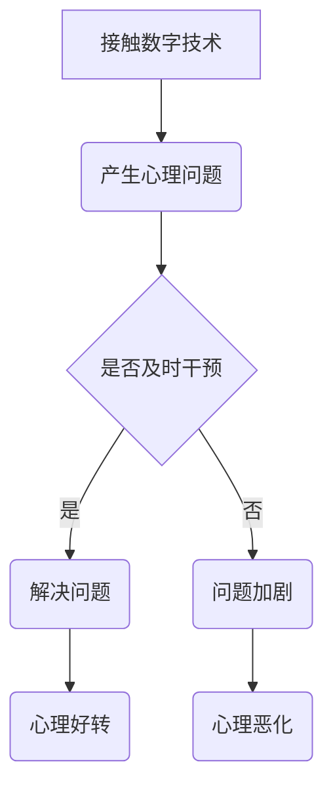
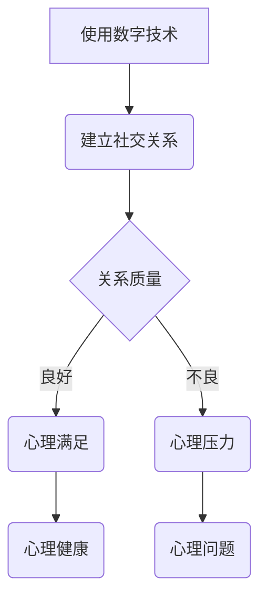
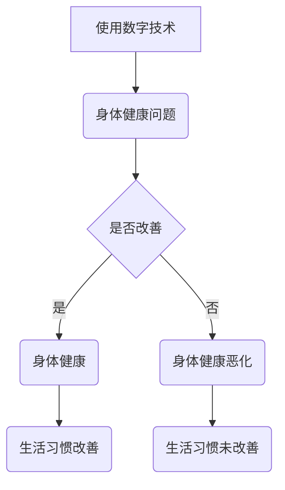

                 

# 数字时代的童年：科技对儿童发展的影响

> 关键词：数字技术，儿童发展，学习，心理健康，社交，身体健康

> 摘要：本文深入探讨了数字技术对儿童发展的多方面影响，包括学习、心理、社交和身体健康。通过分析数字技术的核心概念原理、概念属性特征对比、实体关系图和流程图，我们旨在为家长、教育工作者和政策制定者提供有价值的见解，以帮助儿童在数字时代健康成长。

### 第1章: 数字时代的童年概述

#### 1.1 问题背景

随着科技的快速发展，数字技术已经成为现代社会的重要组成部分。儿童作为未来的主人翁，从小接触到的数字技术种类越来越多，这既带来了便利，也带来了挑战。互联网、手机、平板电脑、游戏机等数字设备已经成为儿童日常生活中不可或缺的一部分。这些技术不仅改变了儿童的学习方式，也对他们的心理健康、社交能力和身体健康产生了深远的影响。因此，探讨数字技术对儿童发展的影响具有重要意义。

#### 1.2 问题描述

数字技术的普及对儿童产生了深远的影响，但具体的影响效果如何？哪些方面需要关注？如何确保儿童在数字时代的健康成长？这些问题需要我们深入探讨。首先，数字技术是否能够提高儿童的学习效率？其次，长时间接触数字技术是否会对儿童的心理健康产生负面影响？再次，数字技术是否有助于儿童拓展社交圈，还是反而导致社交能力下降？最后，数字技术对儿童的身体健康是否也存在潜在威胁？这些问题都是我们需要关注和解决的。

#### 1.3 问题解决

通过研究现有的相关文献，结合实际案例，我们可以分析数字技术对儿童发展的具体影响，从而提出相应的解决方案。首先，我们需要认识到数字技术既有积极的影响，也存在一定的负面影响。因此，家长和教育工作者需要合理引导儿童使用数字技术，确保其健康成长。具体来说，我们可以从以下几个方面入手：

1. **优化学习环境**：利用数字技术提供丰富的学习资源，提高儿童的学习效率。例如，使用在线课程、电子书和教育软件等。
2. **关注心理健康**：合理规划儿童使用数字技术的时间，避免长时间接触可能导致的心理问题。同时，加强心理教育和干预，帮助儿童应对数字时代的挑战。
3. **促进社交能力**：通过数字技术，帮助儿童拓展社交圈，培养良好的社交能力。同时，引导儿童理性看待虚拟社交，避免沉迷于网络。
4. **维护身体健康**：鼓励儿童进行户外活动和体育锻炼，减少长时间使用数字技术。同时，关注视力保护和健康饮食。

#### 1.4 边界与外延

数字技术包括但不限于互联网、手机、平板电脑、游戏机等。儿童发展包括学习、心理、社交、身体健康等方面。本章节主要关注数字技术对儿童发展的影响，而不涉及其他领域。

#### 1.5 概念结构与核心要素组成

- 数字技术：互联网、手机、平板电脑、游戏机等。
- 儿童发展：学习、心理、社交、身体健康。
- 影响因素：时间、内容、互动方式等。

### 第2章: 数字技术对儿童学习的影响

#### 2.1 核心概念原理

数字技术可以提供丰富的学习资源，如在线课程、电子书、教育软件等，这有助于提高儿童的学习效率。此外，数字技术还可以实现个性化学习，根据儿童的兴趣和能力提供定制化的学习内容，从而更好地满足他们的学习需求。

#### 2.2 概念属性特征对比表格

| 特征 | 传统学习 | 数字学习 |
| --- | --- | --- |
| 资源 | 有限 | 丰富 |
| 时间 | 固定 | 自由 |
| 方式 | 单向 | 互动 |

#### 2.3 ER实体关系图架构

```mermaid
erDiagram
  课程 ||--|{ 学生 }| 完成课程
  课程 ||--|{ 教师 }| 教授课程
  学生 ||--|{ 学习 }| 进行学习
  学生 ||--|{ 作业 }| 提交作业
  教师 ||--|{ 作业 }| 审阅作业
```

#### 2.4 数字学习案例

以在线课程为例，我们可以看到数字技术如何改变儿童的学习方式。例如，某个儿童通过在线平台学习编程课程，课程内容丰富且互动性强，可以根据自己的进度进行学习。这不仅提高了学习效率，也培养了儿童的自主学习能力。

```python
class Course:
    def __init__(self, name, teacher, students):
        self.name = name
        self.teacher = teacher
        self.students = students

    def enroll(self, student):
        self.students.append(student)

    def teach(self):
        for student in self.students:
            student.learn()

class Student:
    def __init__(self, name):
        self.name = name

    def learn(self):
        print(f"{self.name} is learning.")

course = Course("Programming", "Teacher", [])
student = Student("Alice")
course.enroll(student)
course.teach()
```

#### 2.5 教育专家观点

根据教育专家的观点，数字技术可以提高儿童的学习兴趣和主动性，但同时也需要家长和教育工作者合理引导，避免过度依赖数字技术。此外，数字技术不应替代传统教学方式，而应与传统教学相结合，形成一种新型的教学模式。

### 第3章: 数字技术对儿童心理的影响

#### 3.1 核心概念原理

长时间接触数字技术可能导致儿童心理问题，如焦虑、抑郁、注意力不集中等。这是因为数字技术的虚拟性和即时性可能会让儿童过度沉迷，导致他们对现实世界的关注减少，从而影响心理健康。

#### 3.2 概念属性特征对比表格

| 特征 | 传统活动 | 数字活动 |
| --- | --- | --- |
| 时间 | 规则 | 自由 |
| 内容 | 实际 | 虚拟 |
| 影响力 | 较小 | 较大 |

#### 3.3 Mermaid流程图



#### 3.4 心理专家建议

根据心理专家的建议，家长和教育工作者应该关注儿童使用数字技术的时间，合理规划他们的生活。此外，应加强心理教育和干预，帮助儿童学会自我调节，以应对数字时代带来的心理挑战。

### 第4章: 数字技术对儿童社交的影响

#### 4.1 核心概念原理

数字技术为儿童提供了新的社交方式，如社交媒体、在线游戏等，这有助于拓展社交圈，但也可能带来负面影响。例如，过度沉迷于虚拟社交可能会影响儿童的现实社交能力，导致孤独感增加。

#### 4.2 概念属性特征对比表格

| 特征 | 传统社交 | 数字社交 |
| --- | --- | --- |
| 方式 | 实际 | 虚拟 |
| 时间 | 有限 | 较长 |
| 影响力 | 较大 | 较小 |

#### 4.3 Mermaid流程图



#### 4.4 社交案例

以社交媒体为例，某个儿童在社交媒体上结识了新的朋友，这有助于他们拓展社交圈。然而，如果他们过度沉迷于虚拟社交，可能会忽视现实生活中的朋友和亲人，导致社交能力下降。

```python
class SocialMedia:
    def __init__(self, users):
        self.users = users

    def add_friend(self, user1, user2):
        user1.friends.append(user2)
        user2.friends.append(user1)

class User:
    def __init__(self, name):
        self.name = name
        self.friends = []

user1 = User("Alice")
user2 = User("Bob")
social_media = SocialMedia([user1, user2])
social_media.add_friend(user1, user2)
print(f"{user1.name} has {len(user1.friends)} friends.")
```

#### 4.5 社交专家建议

根据社交专家的建议，家长和教育工作者应引导儿童理性看待虚拟社交，鼓励他们积极参与现实社交活动，培养良好的社交能力。此外，应关注儿童在虚拟社交中的行为，避免他们受到不良影响。

### 第5章: 数字技术对儿童身体健康的影响

#### 5.1 核心概念原理

长时间使用数字技术可能导致儿童身体健康问题，如视力下降、肥胖等。这是因为数字技术往往伴随着长时间坐在电子设备前，缺乏运动和户外活动。

#### 5.2 概念属性特征对比表格

| 特征 | 传统活动 | 数字活动 |
| --- | --- | --- |
| 时间 | 规则 | 自由 |
| 影响力 | 较小 | 较大 |

#### 5.3 Mermaid流程图



#### 5.4 健康案例

以视力问题为例，某个儿童因为长时间使用手机，导致视力下降。通过改变生活习惯，如定期休息、做眼保健操和使用护眼软件，他们的视力得到了改善。

```python
class EyeHealth:
    def __init__(self, vision):
        self.vision = vision

    def improve(self):
        self.vision += 1

class Child:
    def __init__(self, name, eye_health):
        self.name = name
        self.eye_health = eye_health

child = Child("Alice", EyeHealth(5))
child.eye_health.improve()
print(f"{child.name}'s vision is now {child.eye_health.vision}.")

```

#### 5.5 健康专家建议

根据健康专家的建议，家长和教育工作者应鼓励儿童进行户外活动和体育锻炼，减少长时间使用数字技术。此外，应关注儿童的视力保护和健康饮食，以维护他们的身体健康。

### 第6章: 应对策略

#### 6.1 家长角色

家长在儿童数字时代的发展中扮演着至关重要的角色。首先，家长应合理规划儿童使用数字技术的时间，避免过度沉迷。其次，家长应与儿童建立良好的沟通，了解他们的数字生活，引导他们理性看待虚拟世界。此外，家长还应关注儿童的心理健康，及时发现并解决潜在问题。

#### 6.2 教育工作者角色

教育工作者应充分利用数字技术，创新教育模式，提高教学效果。同时，他们还应关注儿童的心理健康，通过心理教育和干预，帮助儿童应对数字时代的挑战。此外，教育工作者还应引导学生理性使用数字技术，培养他们的数字素养。

#### 6.3 政策制定者角色

政策制定者应制定相关政策和法规，规范儿童使用数字技术。例如，限制儿童使用手机和游戏机的时间，推广健康数字生活方式。此外，政策制定者还应加强数字素养教育，提高家长和教育工作者对数字技术的认识，以更好地保护儿童健康成长。

### 小结

数字技术对儿童发展产生了深远的影响，既有积极的一面，也存在一定的负面影响。家长、教育工作者和政策制定者应共同努力，合理引导儿童使用数字技术，确保他们在数字时代健康成长。

### 注意事项

1. **合理规划时间**：避免儿童长时间使用数字技术，确保他们有足够的时间进行户外活动和体育锻炼。
2. **培养数字素养**：教育儿童理性使用数字技术，避免沉迷于虚拟世界。
3. **关注心理健康**：及时发现并解决儿童的心理问题，确保他们的心理健康。
4. **健康生活习惯**：鼓励儿童进行户外活动和体育锻炼，保持良好的生活习惯。

### 拓展阅读

1. **《数字时代的童年》**：本书详细探讨了数字技术对儿童发展的影响，为家长、教育工作者和政策制定者提供了宝贵的参考。
2. **《儿童心理学》**：本书介绍了儿童心理发展的基本理论和方法，有助于我们更好地理解儿童在数字时代的行为和心理变化。
3. **《数字素养教育》**：本书探讨了数字素养教育的理论和实践，为培养儿童的数字素养提供了指导。

### 作者

作者：AI天才研究院/AI Genius Institute & 禅与计算机程序设计艺术 /Zen And The Art of Computer Programming。本文旨在为家长、教育工作者和政策制定者提供关于数字技术对儿童发展影响的见解，以帮助儿童在数字时代健康成长。

