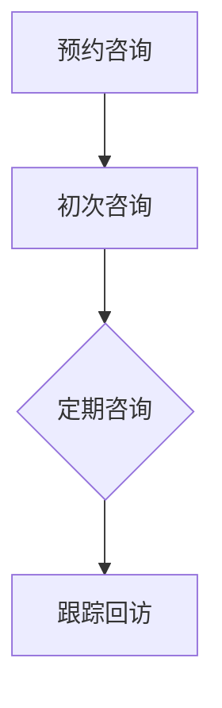

                 

## 文章标题

### 关键词

- 数字时代
- 精神健康
- 在线心理咨询
- 普及趋势
- 技术基础
- 法律法规
- 推广策略

### 摘要

本文旨在探讨数字时代下精神健康的现状和挑战，重点分析在线心理咨询的普及程度及其技术基础、应用模式、法律法规和推广策略。通过对比在线心理咨询与传统心理咨询的差异，探讨其在隐私保护和专业服务质量方面的挑战与机遇。此外，文章还将介绍人工智能在心理健康服务中的应用，以及在线心理咨询在全球范围内的法律法规与伦理规范。最后，本文将展望在线心理咨询的未来发展趋势，并探讨其对社会文化和心理健康观念的影响。

### 引言与背景

随着互联网和数字技术的迅猛发展，我们的生活和工作已经日益数字化。这种数字化进程带来了许多便利，例如远程办公、在线教育、电子商务等。然而，与此同时，它也引发了一系列新的心理健康问题。根据世界卫生组织（WHO）的数据，全球约有3亿至4亿人患有某种形式的抑郁或焦虑症状，这些症状在很大程度上与在线生活紧密相关。

首先，让我们来看一下问题背景。在数字时代，人们的生活节奏加快，工作压力增大，同时社交网络的使用也日益频繁。这些因素共同作用，可能导致精神健康问题。例如，社交媒体的过度使用可能导致焦虑和抑郁，在线工作可能带来职业倦怠，网络暴力和欺凌也可能对心理健康造成负面影响。

接下来，我们讨论一下问题描述。在线心理咨询的普及对于缓解这些心理健康问题具有重要意义。然而，目前在线心理咨询仍面临一些挑战。首先，咨询资源的不足是一个显著问题。许多心理咨询师无法满足日益增长的需求，尤其是在偏远地区和经济不发达地区。其次，隐私保护问题也备受关注。在线心理咨询需要处理大量的敏感个人信息，如病历、聊天记录等，如何确保这些信息的安全和隐私成为一个亟待解决的问题。最后，用户接受度也是一个挑战。尽管在线心理咨询具有便捷性和私密性，但仍有很多人对其效果和安全性持怀疑态度，这限制了其普及率。

为了解决上述问题，本文将分为以下几个部分进行探讨。首先，我们将分析数字时代的精神健康现状，包括全球精神健康问题的概述和在线心理咨询的普及趋势。接着，我们将探讨在线心理咨询的技术基础，介绍人工智能和自然语言处理技术在心理健康服务中的应用。然后，我们将详细讨论在线心理咨询的应用模式，包括个体心理咨询和团体心理咨询。随后，我们将分析在线心理咨询的法律法规与伦理，介绍国际和中国在保护用户隐私和规范行业方面的法律法规和伦理规范。最后，我们将探讨在线心理咨询的推广策略，分享市场推广策略和实践经验，并展望未来发展趋势。希望通过本文的探讨，为数字时代的精神健康问题提供一些有益的思考和建议。

#### 1.1 问题背景

在探讨数字时代的精神健康问题时，我们必须首先理解数字技术如何影响了我们的生活方式和心理健康。随着互联网的普及和智能手机的广泛使用，我们的日常活动越来越依赖于数字平台。这不仅改变了我们的社交方式，也改变了我们处理压力和心理问题的途径。例如，社交媒体和即时通讯工具提供了便捷的交流渠道，但同时也可能导致社交孤立和过度依赖。在线工作使人们能够更加灵活地安排工作和生活，但也可能带来职业倦怠和工作与生活的界限模糊。此外，网络暴力和欺凌行为在数字时代变得更加普遍，对心理健康构成新的威胁。

全球精神疾病发病率不断上升，这一趋势与数字时代的特征密切相关。世界卫生组织（WHO）的数据显示，精神障碍已成为全球范围内的主要健康问题之一。焦虑症、抑郁症和其他心理健康问题不仅影响个体的生活质量，还会对社会的整体健康和经济产生负面影响。例如，抑郁症的患病率在过去几十年中显著增加，尤其是在青少年和成年人中。焦虑症也是一个日益严重的问题，特别是在面临不确定性和压力的情况下。

心理健康服务的需求在数字时代也发生了显著变化。随着人们对心理健康问题的认识和关注程度不断提高，越来越多的人寻求专业的心理健康服务。然而，传统的心理咨询模式在覆盖范围和可及性方面存在一定的局限性。传统的心理咨询通常需要面对面进行，这限制了心理咨询师的服务能力和用户的便捷性。此外，许多人可能因为地理位置、时间安排或经济原因无法获得心理咨询服务。

在线心理咨询作为一种新兴的服务模式，正逐渐受到人们的青睐。它具有许多独特的优势，如便捷性、私密性和可及性。用户可以随时随地通过互联网进行咨询，无需担心地理位置和时间的限制。此外，在线咨询提供了一个相对私密的环境，用户可以更自在地表达自己的情感和问题。这种灵活性使得在线心理咨询成为解决心理健康问题的一个有效途径。

然而，在线心理咨询也面临一些挑战。首先，隐私保护问题是一个关键挑战。在线心理咨询涉及大量的个人敏感信息，如病历记录、聊天记录等。这些信息的泄露可能会导致隐私侵犯和其他安全问题。其次，专业服务质量也是一个重要的挑战。在线心理咨询需要具备专业知识和技能的心理咨询师，以确保咨询的质量和效果。如何筛选和培训心理咨询师，以及如何确保他们提供的服务符合专业标准，是当前在线心理咨询领域需要解决的重要问题。

总的来说，数字时代的精神健康问题是一个复杂且多维的议题，需要从多个角度进行探讨和解决。在线心理咨询的普及不仅提供了新的解决途径，也带来了一系列新的挑战。通过本文的分析和探讨，我们希望能够为数字时代的精神健康问题提供一些有益的思考和建议。

#### 1.2 问题描述

在线心理咨询的普及对于缓解数字时代的精神健康问题具有重要意义，但在其实际应用过程中仍面临诸多挑战。首先，咨询资源的不足是一个显著问题。由于心理健康服务的专业性和复杂性，能够提供在线心理咨询的心理咨询师数量有限。尤其是在偏远地区和经济不发达地区，心理咨询师的数量更加稀缺，这直接影响了在线心理咨询的普及程度。此外，心理咨询师的工作时间和精力也有限，难以满足日益增长的需求。因此，如何扩大心理咨询师的队伍，提高他们的工作效率，是当前在线心理咨询领域亟待解决的一个关键问题。

其次，隐私保护问题是另一个重大的挑战。在线心理咨询涉及大量的个人敏感信息，如病历记录、聊天记录等。这些信息一旦泄露，不仅可能导致用户的隐私侵犯，还可能引发一系列的安全风险。为了保障用户的隐私，在线心理咨询平台需要采取一系列严格的加密和匿名化技术，确保用户数据在传输和存储过程中的安全。此外，平台还需要建立完善的数据管理和安全制度，防止内部人员和黑客的恶意攻击。然而，目前许多在线心理咨询平台在隐私保护方面仍然存在漏洞，需要进一步提升技术和管理水平。

用户接受度不高是第三个挑战。尽管在线心理咨询具有便捷性和私密性，但仍有很多人对其效果和安全性持怀疑态度。部分用户担心在线咨询的隐私保护问题，担心自己的个人信息被泄露。此外，一些用户对在线咨询的效果表示怀疑，认为面对面的交流更为有效。因此，如何提高用户的接受度和信任度，是推动在线心理咨询普及的重要课题。平台可以通过提供透明的服务流程、展示专业资质和心理咨询师的案例，以及加强用户教育和宣传，来逐步消除用户的疑虑。

为了解决上述问题，需要从多个方面进行综合施策。首先，应加大心理咨询师的培养和引进力度，通过多种途径提高心理咨询师的素质和数量。例如，可以与高校和医疗机构合作，开展心理咨询师的培训项目，提高心理咨询师的职业素养和技能水平。其次，平台应加强隐私保护技术，确保用户数据的保密性和安全性。这包括采用先进的加密技术、建立完善的数据安全管理制度，以及定期进行安全审计和漏洞修复。最后，应通过多种渠道提高用户的信任度和接受度，例如提供优质的咨询服务、开展用户调研和反馈机制，以及通过科普宣传和教育活动，增强公众对在线心理咨询的认知和信任。

综上所述，尽管在线心理咨询在缓解数字时代精神健康问题方面具有巨大的潜力，但仍然面临资源不足、隐私保护和用户接受度等挑战。通过多方面的努力和改进，我们有望逐步克服这些问题，推动在线心理咨询的普及和发展，为公众提供更加高效、安全和便捷的心理健康服务。

#### 1.3 问题解决

为了应对数字时代精神健康问题以及在线心理咨询普及过程中面临的挑战，我们需要采取一系列综合措施，从多个角度进行深入探讨和解决。以下是我们提出的主要策略和措施：

首先，扩大心理咨询师的培养和引进。随着心理健康服务需求的不断增加，需要大量具备专业知识和技能的心理咨询师。为此，我们可以通过以下几种方式来实现：

- **校企合作**：与高校合作，设立心理咨询师培训课程，培养更多具备专业技能的心理咨询师。
- **职业认证**：建立心理咨询师的职业认证制度，确保新入行咨询师具备必要的资质。
- **继续教育**：为在职心理咨询师提供继续教育机会，提升他们的专业水平和技能。

其次，加强隐私保护技术。在线心理咨询涉及大量敏感个人信息，隐私保护至关重要。以下措施可以帮助提升隐私保护水平：

- **加密技术**：采用先进的加密技术，确保用户数据在传输和存储过程中的安全。
- **匿名化技术**：在数据分析和研究过程中，使用匿名化技术，防止用户身份泄露。
- **数据安全制度**：建立完善的数据安全管理机制，包括数据备份、访问控制和安全审计。

第三，提高用户接受度和信任度。为了推广在线心理咨询，需要采取以下策略：

- **透明服务流程**：公开咨询服务流程，让用户了解从预约到咨询再到回访的每个环节。
- **展示专业资质**：在平台显著位置展示心理咨询师的资质和经验，增强用户的信任感。
- **用户教育和宣传**：通过科普文章、讲座和宣传活动，提高公众对在线心理咨询的认知和信任。

此外，政策支持和行业监管也是必不可少的。政府可以出台相关政策和法规，规范在线心理咨询行业，保障用户的权益。例如：

- **隐私保护法规**：制定严格的数据隐私保护法规，确保在线心理咨询过程中的用户隐私不受侵犯。
- **行业规范**：建立行业规范和伦理准则，确保心理咨询师提供专业、高效的服务。

通过以上综合措施，我们有望逐步解决数字时代精神健康问题以及在线心理咨询普及过程中面临的挑战，推动在线心理咨询的健康发展，为公众提供更加优质、便捷、安全的心理健康服务。

#### 1.4 边界与外延

尽管本文重点关注在线心理咨询的普及与推广，但精神健康问题涉及的领域广泛，不仅限于技术层面，还涵盖了心理健康服务、人工智能技术、医疗制度、社会文化等多个方面。

首先，心理健康服务是一个复杂的体系，包括心理评估、诊断、治疗、康复等环节。在线心理咨询只是其中的一部分，它需要与传统心理健康服务相结合，形成完整的心理健康服务体系。

其次，人工智能技术在心理健康服务中的应用也是本文的一个重要讨论点。除了自然语言处理和机器学习算法，人工智能还可以通过虚拟现实（VR）、增强现实（AR）等技术提供更加互动和沉浸式的心理咨询体验。

医疗制度方面，在线心理咨询的普及需要医疗体系的支持和配合。例如，医疗机构可以与在线心理咨询平台合作，提供综合性的心理健康服务，同时通过政策支持，鼓励医生和心理咨询师参与在线心理咨询工作。

社会文化的影响也是一个不可忽视的因素。心理健康观念的变化、公众对心理咨询的接受度、社会对心理健康问题的关注度等，都会对在线心理咨询的普及产生重要影响。

最后，概念结构与核心要素组成部分为本文提供了一个理论基础。通过分析在线心理咨询的核心概念，如在线心理咨询、数字心理健康、心理健康服务模式，以及相关的概念属性特征对比表格和ER实体关系图架构，我们能够更清晰地理解这一领域的复杂性和多样性。

#### 1.5 概念结构与核心要素组成

在探讨数字时代的精神健康和在线心理咨询时，理解核心概念及其相互关系是非常重要的。以下是对几个关键概念及其属性特征和关系的详细分析。

### 核心概念

1. **在线心理咨询**：指通过互联网提供心理咨询服务，包括个体和团体咨询、在线心理治疗等多种形式。
2. **数字心理健康**：利用数字技术进行心理健康监测、评估和治疗，包括心理健康应用程序、在线心理测试、远程诊断等。
3. **心理健康服务模式**：指心理健康服务的提供方式，包括传统的面对面咨询、电话咨询和在线咨询等。

### 概念属性特征对比表格

| 概念         | 特征 |
| ------------ | ---- |
| 在线心理咨询 | 方便性、私密性、可及性 |
| 数字心理健康 | 个性定制、实时反馈、可扩展性 |
| 心理健康服务模式 | 专业性、多样性、互动性 |

通过这个对比表格，我们可以看出各个概念在不同方面的特征和优势。

### ER实体关系图架构

为了更直观地展示各个概念之间的关系，我们可以使用ER（实体关系）图来描述用户、咨询师、心理健康数据等实体及其相互关系。

```mermaid
erDiagram
  用户 ||--|{ 咨询师 }|
  用户 ||--|{ 心理健康数据 }|
  咨询师 ||--|{ 咨询记录 }|
  咨询师 ||--|{ 服务评价 }|
  心理健康数据 ||--|{ 数据分析 }|
```

在ER图中，用户与咨询师之间存在双向关系，表示用户可以请求咨询，咨询师可以为用户提供服务。用户还与心理健康数据相关联，表示用户生成和存储心理健康相关数据。咨询师则与咨询记录和服务评价相关，表示咨询师记录用户的咨询过程和用户对服务的评价。心理健康数据与数据分析相关，表示对用户数据的分析可以帮助提升心理咨询的效果。

### 核心概念解释

- **在线心理咨询**：在线心理咨询是通过互联网提供的心理咨询服务，其核心在于提供便利和私密性。用户可以通过在线平台预约心理咨询师，进行文字、语音或视频沟通，讨论个人心理健康问题。这种模式的优势在于用户可以随时随地获取服务，不必担心地理位置和时间限制。
  
- **数字心理健康**：数字心理健康利用数字技术进行心理健康监测、评估和治疗。它包括心理健康应用程序，如焦虑和抑郁自测工具，在线心理测试，以及远程诊断。数字心理健康的核心在于利用数据分析和人工智能技术，为用户提供个性化和定制化的心理健康服务。

- **心理健康服务模式**：心理健康服务模式是指心理健康服务的提供方式。传统的心理健康服务模式主要依赖于面对面咨询，而随着技术的发展，电话咨询、在线咨询等新兴模式逐渐兴起。心理健康服务模式的选择取决于用户的实际需求和技术条件。

通过上述分析，我们可以看出，在线心理咨询、数字心理健康和心理健康服务模式是数字时代精神健康领域的重要组成部分，它们相互关联，共同为用户提供全面、高效、便捷的心理健康服务。

### 第2章：数字时代的精神健康现状

#### 2.1 全球精神健康问题概述

在数字时代，全球精神健康问题呈现出复杂且多样化的特点。根据世界卫生组织（WHO）的数据，精神疾病已成为全球范围内的主要健康问题之一，其发病率逐年上升。具体来说，焦虑症、抑郁症、精神分裂症和其他严重精神障碍在全球范围内普遍存在，并且对人们的日常生活和社会功能产生了严重的影响。

首先，让我们来看一下精神疾病发病率的现状。根据WHO的报告，全球约有4.5亿人患有某种形式的精神障碍，其中焦虑症和抑郁症的患病率最高。焦虑症影响着全球约3.5亿人，抑郁症则影响着约3亿人。这些精神障碍不仅影响个体的身心健康，还会对家庭和社会带来沉重的负担。例如，抑郁症患者常常会出现情绪低落、失眠、食欲不振等症状，这些症状可能导致工作效率下降，甚至出现自杀倾向。

其次，心理健康服务的需求在数字时代日益增长。随着人们对心理健康问题的认识和关注程度不断提高，越来越多的人开始寻求专业的心理健康服务。传统的心理健康服务模式通常依赖于面对面咨询，但这种方式在覆盖范围和可及性方面存在一定的局限性。尤其是在偏远地区和经济不发达地区，心理健康服务的可及性更低。数字时代为心理健康服务带来了新的机遇，通过在线心理咨询平台，人们可以随时随地获取专业的心理健康服务，极大地提高了服务的覆盖范围和可及性。

在线心理咨询的普及趋势也显而易见。根据市场研究机构的数据，全球在线心理咨询市场的规模在过去几年中快速增长。尤其是在疫情期间，由于面对面咨询受到限制，在线心理咨询的需求激增。许多国家和地区都推出了在线心理咨询服务，以应对心理健康问题的挑战。例如，美国、欧洲和澳大利亚等国家都在政策层面鼓励和推广在线心理咨询，为公众提供更多的心理健康资源。

在线心理咨询的普及不仅改变了心理健康服务的模式，也带来了新的挑战和机遇。一方面，在线心理咨询提供了便捷性和私密性，使得更多人能够获得心理健康服务。另一方面，隐私保护和专业服务质量仍然是需要解决的问题。如何确保用户数据的隐私和安全，以及如何提升心理咨询的专业性和效果，是当前在线心理咨询领域需要重点关注的议题。

综上所述，数字时代的精神健康现状令人担忧，但同时也为心理健康服务带来了新的机遇。通过在线心理咨询的普及，我们可以更广泛地覆盖和满足公众的心理健康需求，但同时也需要解决隐私保护和专业服务质量等挑战。只有这样，我们才能充分发挥数字技术在心理健康服务中的作用，为全球公众提供更加高效、安全和便捷的心理健康支持。

#### 2.2 在线心理咨询的普及趋势

在线心理咨询的普及趋势在近年来尤为显著，尤其是在数字技术迅猛发展的背景下，其应用范围和用户基数不断扩展。首先，从使用率的角度来看，越来越多的人选择在线心理咨询作为解决心理问题的首选途径。根据市场调研数据，全球在线心理咨询用户数量在过去五年中呈现出稳定增长的趋势。尤其是在疫情期间，由于面对面咨询受到限制，在线心理咨询的使用率显著上升。例如，在美国，2020年的在线心理咨询使用率比2019年增长了近50%。

其次，在线心理咨询的优势使其受到广泛欢迎。这些优势主要包括便捷性、私密性和可及性。首先，便捷性方面，在线心理咨询不受地理位置和时间限制，用户可以在任何时间、任何地点通过互联网进行咨询。这种灵活性极大地满足了那些由于生活和工作压力无法定期进行面对面咨询的用户需求。其次，私密性方面，在线咨询提供了一个相对私密的环境，用户可以在不受外界干扰的情况下，更自在地表达自己的情感和问题。这对于许多担心隐私泄露或不愿意公开谈论个人问题的用户来说，是一个重要的吸引力。最后，可及性方面，在线心理咨询降低了心理咨询服务的门槛，使得更多偏远地区和经济不发达地区的人们能够享受到专业的心理健康服务。

尽管在线心理咨询具有显著的普及趋势和优势，但其在实际应用中仍面临一些挑战。首先，隐私保护问题是用户普遍关注的问题。由于在线心理咨询涉及大量的个人敏感信息，如病历记录、聊天记录等，如何确保这些信息的安全和隐私成为一个重要议题。为了解决这一问题，许多在线心理咨询平台采用了先进的加密技术和严格的数据管理制度，但仍需进一步提升技术和管理水平，确保用户数据的安全。

其次，专业服务质量也是一个重要的挑战。在线心理咨询需要具备专业知识和技能的心理咨询师，以确保咨询的质量和效果。如何筛选和培训心理咨询师，以及如何确保他们提供的服务符合专业标准，是当前在线心理咨询领域需要解决的关键问题。一些平台已经建立了心理咨询师的认证和培训体系，但仍然需要进一步完善和推广。

最后，用户接受度不高的现象也限制了在线心理咨询的普及。尽管在线心理咨询具有许多优势，但仍有很多人对其效果和安全性持怀疑态度。部分用户担心在线咨询的隐私保护问题，担心自己的个人信息被泄露。此外，一些用户对在线咨询的效果表示怀疑，认为面对面的交流更为有效。因此，如何提高用户的接受度和信任度，是推动在线心理咨询普及的重要课题。

总的来说，在线心理咨询的普及趋势显著，但其发展仍面临隐私保护、专业服务质量和用户接受度等挑战。通过不断改进技术、完善管理和加强用户教育，我们可以逐步克服这些问题，推动在线心理咨询的健康发展，为更多需要心理健康服务的人群提供支持和帮助。

#### 2.3 在线心理咨询的挑战与机遇

在线心理咨询作为一种新兴的心理健康服务模式，既面临诸多挑战，也蕴含着巨大的机遇。以下是几个关键挑战及其对应的机遇分析。

**1. 隐私保护问题**

挑战：在线心理咨询涉及大量的个人敏感信息，如病历记录、聊天记录等。这些信息的泄露不仅可能导致用户的隐私侵犯，还可能引发一系列的安全风险。用户对隐私保护的担忧是限制在线心理咨询普及的一个重要因素。

机遇：随着加密技术和数据保护技术的发展，隐私保护水平有望逐步提升。例如，采用端到端的加密技术可以确保数据在传输过程中的安全性。此外，平台可以建立完善的数据安全管理制度，包括数据备份、访问控制和安全审计，从而降低隐私泄露的风险。

**2. 专业服务质量**

挑战：在线心理咨询需要具备专业知识和技能的心理咨询师，以确保咨询的质量和效果。然而，目前心理咨询师的资质和培训水平参差不齐，如何确保在线咨询的专业性成为一大挑战。

机遇：通过建立严格的认证和培训体系，可以有效提升心理咨询师的专业水平。例如，与高校和医疗机构合作，开展心理咨询师的系统培训项目，确保新入行咨询师具备必要的资质。此外，平台可以引入质量控制和用户反馈机制，通过持续监督和评估，提升整体服务水准。

**3. 用户接受度**

挑战：尽管在线心理咨询具有许多优势，但仍有很多人对其效果和安全性持怀疑态度。用户接受度不高是限制其普及的另一个重要因素。

机遇：通过提高用户教育和宣传力度，可以逐步消除用户的疑虑。平台可以提供透明的服务流程、展示专业资质和心理咨询师的案例，增强用户的信任感。此外，通过用户调研和反馈机制，了解用户的实际需求和意见，不断优化和提升服务质量。

**4. 服务资源分配不均**

挑战：在许多地区，尤其是偏远和经济不发达地区，心理咨询资源严重不足，这限制了在线心理咨询的普及。

机遇：通过互联网技术的普及和应用，可以打破地域限制，实现心理健康服务的资源均衡分配。例如，平台可以与偏远地区的医疗机构合作，提供远程心理咨询服务，从而提升这些地区的心理健康服务可及性。

**5. 技术支持不足**

挑战：在线心理咨询平台的技术支持不足，可能导致系统稳定性、数据安全和用户体验等方面的问题。

机遇：加强技术投入和研发，提升平台的技术水平和服务质量。例如，引入先进的自然语言处理和机器学习算法，提升心理咨询的智能化水平。同时，平台可以建立24/7的技术支持团队，及时解决用户遇到的问题。

综上所述，在线心理咨询在数字时代既面临挑战，也充满机遇。通过不断改进技术、完善管理和加强用户教育，我们有望克服这些挑战，推动在线心理咨询的健康发展，为更多需要心理健康服务的人群提供支持和帮助。

### 第3章：在线心理咨询的技术基础

随着互联网和数字技术的发展，在线心理咨询逐渐成为心理健康服务的重要形式。在这一章中，我们将探讨在线心理咨询的技术基础，特别是人工智能在心理健康服务中的应用以及数据隐私保护技术。

#### 3.1 人工智能在心理健康服务中的应用

人工智能（AI）在心理健康服务中的应用已经成为了一个热门话题。AI技术，尤其是自然语言处理（NLP）和机器学习算法，为在线心理咨询提供了强大的支持。

**自然语言处理（NLP）**：NLP技术能够理解和生成人类语言，这对心理咨询具有重要意义。例如，通过NLP技术，心理咨询平台可以实时分析用户的聊天记录，识别出潜在的心理健康问题。例如，一个使用NLP的在线咨询系统可以检测到用户是否在对话中频繁使用抑郁或焦虑相关的词汇，从而提醒心理咨询师进行重点关注。此外，NLP还可以帮助自动生成个性化的心理评估问卷，提高评估的准确性和效率。

**机器学习算法**：机器学习算法在心理健康服务中的应用也非常广泛。例如，通过监督学习和无监督学习算法，AI系统可以识别出心理问题的趋势和模式。监督学习算法可以用于分类问题，例如将用户的聊天记录分类为“正常”、“抑郁”或“焦虑”等。无监督学习算法则可以用于聚类分析，发现用户群体中的相似性和差异。这些算法的应用不仅提高了心理咨询的精确性，还帮助心理咨询师更有效地诊断和治疗心理问题。

**案例研究**：某些在线心理咨询平台已经开始集成AI技术，以提高服务的质量和效率。例如，一款名为“Talkspace”的在线心理咨询平台使用AI技术来匹配用户和心理咨询师。该平台利用机器学习算法分析用户的个人信息和咨询记录，为用户提供最匹配的心理咨询师。这种个性化的服务不仅提高了用户满意度，还提高了心理咨询的效率。

**挑战与解决方案**：尽管AI技术在心理健康服务中具有巨大潜力，但仍然面临一些挑战。首先，算法的准确性和可靠性是一个关键问题。为了提高算法的准确性，平台需要大量高质量的训练数据，并且不断优化算法模型。其次，用户隐私保护也是一个重要的挑战。为了确保用户隐私，平台需要采用先进的加密技术和严格的数据管理制度。最后，AI技术的普及还需要心理咨询师的接受和合作，他们需要了解并适应AI技术在实际咨询中的应用。

**未来展望**：随着AI技术的不断进步，未来在线心理咨询平台将更加智能化和个性化。AI技术不仅可以提高心理咨询的精确性和效率，还可以为用户提供更多的个性化建议和支持。例如，AI系统可以基于用户的行为数据和心理状况，提供实时的心理健康预警和干预建议。此外，虚拟心理咨询师（虚拟人）的开发也将是一个重要方向，通过AI技术，虚拟心理咨询师可以模拟真实心理咨询师的行为和语言，为用户提供更加逼真的咨询体验。

#### 3.2 数据隐私保护技术

在线心理咨询涉及大量的个人敏感信息，如病历记录、聊天记录等。这些信息的泄露不仅可能对用户造成隐私侵犯，还可能引发一系列的法律和安全问题。因此，数据隐私保护技术在在线心理咨询中至关重要。

**加密技术**：加密技术是保护数据隐私的基本手段。在线心理咨询平台通常采用端到端的加密技术，确保数据在传输过程中的安全性。例如，平台可以使用HTTPS协议来加密用户的数据传输，防止数据在传输过程中被截获或篡改。此外，平台还可以采用高级加密标准（AES）等加密算法，对存储在服务器上的数据进行加密，确保数据的安全。

**匿名化技术**：匿名化技术是在数据分析和研究过程中保护用户隐私的重要方法。通过匿名化技术，平台可以在不暴露用户身份的情况下，对用户数据进行分析和研究。例如，平台可以使用数据去标识化技术，删除或替换数据中的个人身份信息，从而确保用户数据的匿名性。

**数据安全管理制度**：在线心理咨询平台需要建立完善的数据安全管理制度，确保用户数据的安全和隐私。这包括数据备份、访问控制、安全审计等多个方面。平台应定期进行安全审计和漏洞修复，确保系统的安全性和稳定性。

**用户隐私保护协议**：平台应制定明确的用户隐私保护协议，明确用户数据的收集、使用和共享规则。用户在注册和使用平台时，应明确了解自己的隐私权利和平台的隐私保护政策。通过透明的隐私保护协议，平台可以增强用户的信任感和安全感。

**案例研究**：某些在线心理咨询平台在数据隐私保护方面已经取得了显著成效。例如，一款名为“BetterHelp”的在线心理咨询平台采用了严格的数据隐私保护措施，包括端到端的加密技术、匿名化技术和完善的数据安全管理制度。此外，平台还制定了详细的用户隐私保护协议，明确告知用户其隐私权利和平台的隐私保护政策。这些措施有效地提升了用户的信任度和满意度。

**挑战与解决方案**：尽管在线心理咨询平台在数据隐私保护方面已经采取了一系列措施，但仍面临一些挑战。首先，数据安全威胁日益增加，平台需要不断更新和优化安全措施，以应对新的安全威胁。其次，用户隐私保护意识的提高也对平台提出了更高的要求。平台需要不断加强用户教育和宣传，提高用户对隐私保护的认识和重视。最后，隐私保护法规的不断完善也对平台提出了新的挑战。平台需要密切关注法规变化，确保其隐私保护措施符合相关法律法规。

综上所述，在线心理咨询的技术基础涵盖了人工智能和自然语言处理技术，以及数据隐私保护技术。通过不断改进和优化这些技术，我们可以为用户提供更加安全、高效和便捷的心理健康服务。同时，平台需要不断加强数据隐私保护，确保用户数据的安全和隐私，提升用户的信任度和满意度。

### 第4章：在线心理咨询的应用模式与案例

#### 4.1 在线个体心理咨询

在线个体心理咨询是当前最常见的一种在线心理咨询模式，它通过互联网为用户提供个性化的心理辅导和治疗服务。以下将详细探讨在线个体心理咨询的服务流程、流程图和案例分析。

**服务流程：**

1. **预约咨询**：用户可以通过在线心理咨询平台预约心理咨询师。平台通常提供多种预约方式，如在线预约、电话预约等。用户可以根据个人需求选择合适的咨询时间和咨询师。
   
2. **初次咨询**：在初次咨询中，心理咨询师会与用户进行初步沟通，了解用户的心理状况和需求。这一阶段的主要目标是建立信任关系，为后续的咨询奠定基础。

3. **定期咨询**：在初次咨询后，用户会与心理咨询师进行定期的在线咨询。每次咨询的时间长度和频率根据用户的需求和咨询师的安排而定。在线咨询可以采用文字、语音或视频等多种形式，用户可以根据个人偏好选择合适的沟通方式。

4. **跟踪回访**：为了确保咨询效果，心理咨询师会进行跟踪回访。通过回访，心理咨询师可以了解用户的进展情况，提供进一步的建议和指导。

**流程图：**



**案例分析：**

李先生是一名35岁的白领，由于工作压力和家庭问题，他感到情绪低落和焦虑。通过在线心理咨询平台，他预约了一名专业的心理咨询师。在初次咨询中，心理咨询师了解了李先生的具体情况，并与他建立了信任关系。在随后的定期咨询中，心理咨询师采用了认知行为疗法（CBT）帮助李先生改变负面思维模式，提高情绪调节能力。通过三个月的咨询，李先生的情绪明显改善，工作压力和家庭问题也得到了有效缓解。

**总结：**在线个体心理咨询为用户提供了便捷、私密和个性化的心理辅导服务。通过科学的心理咨询流程和专业的心理治疗方法，用户可以在舒适的环境中解决心理问题，提升心理健康水平。

#### 4.2 在线团体心理咨询

在线团体心理咨询是一种通过互联网为多个用户提供共同心理支持和互动的平台。与个体心理咨询相比，团体心理咨询具有一些独特的优势，如成本效益高、社会支持网络强等。以下将详细探讨在线团体心理咨询的模式、优势和实践案例。

**模式介绍：**

1. **主题选择**：在线团体心理咨询通常围绕某一特定的主题或问题展开，如焦虑管理、压力缓解、情绪调节等。心理咨询师会根据用户的需求和反馈，选择合适的主题。

2. **时间安排**：团体心理咨询通常在固定的每周时间进行，每次持续一小时左右。心理咨询师会提前通知用户，并在咨询期间全程引导和主持讨论。

3. **互动形式**：在线团体心理咨询可以采用文字、语音或视频等多种互动形式。用户可以在讨论区发表观点，参与小组讨论，或通过视频会议进行面对面的互动。

**优势：**

1. **成本效益高**：在线团体心理咨询通常费用较低，用户可以以更经济的方式获得专业心理健康服务。

2. **社会支持网络强**：团体心理咨询提供了一个相互支持的环境，用户可以在小组中分享经验、获得鼓励和反馈，增强社会支持感。

3. **多样化的视角**：团体心理咨询允许用户从不同背景和经历的人那里获得多样化的视角和建议，有助于更全面地理解和应对心理问题。

**实践案例：**

某在线心理咨询平台推出了一项名为“焦虑管理小组”的在线团体心理咨询项目。该项目每周一次，持续六周，由一位专业的心理咨询师主持。项目主题是帮助用户识别和管理焦虑情绪，提高情绪调节能力。参与项目的用户来自不同的背景，包括学生、职场人士和退休老人。在每次小组讨论中，心理咨询师会引导用户分享自己的焦虑经历，并介绍一系列应对焦虑的策略和方法。通过六周的持续参与，用户纷纷表示焦虑感显著减轻，情绪调节能力得到了提升。

**总结：**在线团体心理咨询为用户提供了一种低成本、高效能的心理健康支持模式。通过主题明确的讨论和专业的心理咨询师引导，用户可以在互动中共同成长，增强心理韧性和社会支持感。

### 第5章：在线心理咨询的法律法规与伦理

#### 5.1 国际法律法规概述

在全球范围内，各国都在努力制定和实施法律法规，以确保在线心理咨询的合法性和用户的隐私安全。以下是对一些主要国际法律法规的概述，以及它们在保护用户隐私和规范行业方面的作用。

**欧盟通用数据保护条例（GDPR）**：GDPR是欧盟在2018年实施的一项重要数据保护法规，旨在加强个人数据的保护。该条例对在线心理咨询平台具有重大影响，特别是涉及用户数据收集、处理和存储方面。GDPR规定，在线心理咨询平台必须获得用户的明确同意才能收集和处理其个人信息，并必须采取适当的技术和组织措施来保护用户数据的安全。此外，GDPR要求平台在数据泄露事件发生后72小时内通知相关监管机构，确保用户权益得到及时保护。

**美国健康保险便携性和责任法案（HIPAA）**：HIPAA是美国的一项重要医疗隐私法规，旨在保护患者的医疗信息。虽然HIPAA主要适用于医疗机构，但许多在线心理咨询平台也遵循该法规的要求，以确保用户的医疗信息得到充分保护。HIPAA要求在线心理咨询平台采取严格的措施，如加密技术、访问控制和员工培训等，确保用户数据的安全和隐私。同时，HIPAA还规定了用户对自身医疗信息的访问权和申诉权，增强了用户的数据隐私保护意识。

**澳大利亚隐私法（Privacy Act）**：澳大利亚隐私法是澳大利亚的数据保护法律，适用于所有政府机构和私人企业。该法规定，在线心理咨询平台在收集、使用和披露用户个人信息时必须遵守一系列原则，包括通知原则、使用限制原则、数据质量原则和安全原则。在线心理咨询平台必须确保用户在知情的情况下提供个人信息，并且这些信息仅用于特定的目的。此外，隐私法还规定了用户的数据访问权和申诉权，确保用户可以了解并控制自己的个人信息。

**英国数据保护法案（DPA）**：英国数据保护法案是在GDPR之前生效的一项重要数据保护法律，其许多规定与GDPR相似。DPA要求在线心理咨询平台采取适当的技术和管理措施，保护用户的数据安全。该法案还规定了用户的数据隐私权，包括访问权、更正权和删除权。在线心理咨询平台必须确保用户可以轻松地访问、更正和删除其个人信息，以增强用户的隐私保护。

#### 5.2 中国的法律法规与伦理规范

在中国，随着在线心理咨询的普及，国家相关部门也逐步出台了相关法律法规和伦理规范，以保障用户权益和规范行业发展。

**个人信息保护法（PIPL）**：个人信息保护法是中国最新的数据保护法律，于2021年11月1日起正式实施。该法明确规定，任何组织、个人收集、使用、加工、传输个人信息时，必须遵循合法、正当、必要的原则，并采取必要措施确保个人信息的安全。在线心理咨询平台必须严格遵守PIPL的规定，确保用户个人信息得到充分保护。PIPL还规定了用户的个人信息权利，包括知情权、访问权、更正权和删除权，用户可以随时查询、更正和删除自己的个人信息。

**医疗健康信息保护条例**：医疗健康信息保护条例是中国关于医疗信息保护的重要法规，适用于在线心理咨询平台。该条例要求在线心理咨询平台在处理用户医疗信息时，必须采取严格的安全措施，确保信息不被泄露或滥用。在线心理咨询平台需要建立完善的信息安全管理制度，包括数据加密、访问控制和定期安全审计等。此外，平台还应明确告知用户其医疗信息的收集和使用目的，并获得用户的明确同意。

**心理咨询师职业道德规范**：中国心理咨询师协会制定了《心理咨询师职业道德规范》，旨在规范心理咨询师的行为。该规范要求心理咨询师在提供在线心理咨询时，必须遵守伦理准则，确保用户隐私和安全。心理咨询师应尊重用户的知情权和选择权，明确告知用户咨询的内容和范围，并在咨询过程中保持专业和客观。同时，心理咨询师还应严格保护用户的信息，确保其不被泄露或滥用。

**总结**：国际和中国在保护在线心理咨询用户隐私和规范行业发展方面，已经出台了多项法律法规和伦理规范。这些法律法规和规范为在线心理咨询提供了重要的法律保障，促进了行业的健康发展。在线心理咨询平台和心理咨询师应严格遵守相关法规和规范，确保用户隐私和安全，提升服务质量，为公众提供更加安全、可靠的心理健康服务。

### 第6章：在线心理咨询的推广策略与实践

#### 6.1 市场推广策略

在线心理咨询作为一种新兴的心理健康服务模式，其推广策略至关重要。以下是几个关键的市场推广策略，以及如何通过这些策略提升品牌的知名度和影响力。

**1. 品牌建设**

品牌建设是提升在线心理咨询平台知名度的基础。一个强有力的品牌可以增加用户对平台的信任感和认可度。以下是一些具体的品牌建设策略：

- **品牌定位**：明确在线心理咨询平台的定位和目标用户群体。例如，平台可以专注于提供焦虑管理、压力缓解或抑郁治疗等专业领域，以吸引特定的用户群体。
- **品牌形象设计**：设计一个简洁、专业且易于识别的品牌形象，包括标志、色彩和口号等。这些元素需要体现平台的价值观和服务特点，增强品牌的影响力。
- **品牌故事**：创建一个感人的品牌故事，讲述平台如何创立、发展及其在心理健康服务领域的使命和愿景。这种故事化的营销手段可以提升用户的情感共鸣，增强品牌的亲和力。

**2. 营销策略**

有效的营销策略可以帮助在线心理咨询平台在竞争激烈的市场中脱颖而出。以下是几个关键营销策略：

- **内容营销**：通过发布高质量的内容，如心理健康知识文章、案例分析、专家访谈等，吸引潜在用户的关注。内容营销不仅可以提升品牌知名度，还可以建立平台在心理健康领域的权威性。
- **社交媒体营销**：利用社交媒体平台（如微博、微信、Facebook、Twitter等）进行推广。通过定期发布有价值的内容、互动和广告，吸引潜在用户的关注，并建立与用户的持续互动。
- **合作伙伴关系**：与医疗机构、学校、企业等建立合作伙伴关系，通过这些渠道推广在线心理咨询服务。合作伙伴可以提供平台推广的渠道和支持，同时平台也可以为合作伙伴提供专业心理健康服务，实现双赢。

**3. 用户体验优化**

用户体验是影响用户留存和口碑的重要因素。以下是几个提升用户体验的策略：

- **简洁明了的界面**：设计一个直观、易于操作的界面，使用户能够快速找到所需的服务和信息。简洁的界面可以提高用户的满意度，减少用户在平台上的操作难度。
- **个性化服务**：通过分析用户的行为和需求，提供个性化的服务推荐。例如，根据用户的咨询记录和偏好，推荐合适的心理咨询师和咨询服务，提升用户的满意度和信任度。
- **快速响应**：建立快速响应的客户服务系统，确保用户在遇到问题时能够及时得到帮助。高效的客户服务可以提升用户的满意度，增加用户对平台的信任。

**4. 数据分析**

数据分析是优化市场推广策略和提升用户体验的关键手段。以下是数据分析在推广策略中的应用：

- **用户行为分析**：通过分析用户的行为数据，如访问量、页面停留时间、转化率等，了解用户对平台的需求和偏好，从而优化营销策略和用户体验。
- **市场趋势分析**：分析市场趋势和竞争对手的表现，了解行业的发展方向和机遇，为平台的战略决策提供数据支持。
- **效果评估**：通过数据监测和评估营销活动的效果，如广告点击率、用户转化率等，及时调整和优化推广策略，提高市场推广的ROI。

**总结**：通过品牌建设、营销策略、用户体验优化和数据分析等多方面的综合措施，在线心理咨询平台可以有效地提升品牌知名度和用户满意度，推动平台的健康发展和市场的进一步拓展。

#### 6.2 实践经验分享

在推广在线心理咨询的过程中，许多平台积累了丰富的实践经验，以下将分享一些成功案例和推广过程中遇到的挑战及解决方案。

**成功案例1：平台A的市场拓展策略**

平台A通过一系列有针对性的市场拓展策略，成功吸引了大量用户。首先，他们在社交媒体平台上开展了广泛的内容营销，发布关于心理健康知识的文章和视频，吸引了大量关注。其次，他们与知名医疗机构合作，提供高质量的心理健康服务，提高了平台的公信力和用户信任度。此外，平台A还利用数据分析工具，分析用户行为和需求，提供个性化的推荐，提高了用户满意度和转化率。这些策略使得平台A在短时间内实现了用户数量的显著增长。

**成功案例2：平台B的用户教育策略**

平台B认识到用户对在线心理咨询的接受度不高，因此他们采取了一系列用户教育策略。首先，他们在平台上开设了心理健康知识专栏，通过发布系统的心理健康课程，帮助用户了解心理问题及其解决方法。其次，平台B邀请了知名心理咨询师进行在线讲座和答疑，增加了用户的互动体验。这些用户教育策略有效地提高了用户对在线心理咨询的认知和信任，推动了平台用户数量的增长。

**挑战1：隐私保护问题**

在线心理咨询涉及大量敏感个人信息，隐私保护问题是平台面临的一个主要挑战。为了解决这一问题，平台A采用了多项隐私保护措施。首先，他们采用了先进的加密技术，确保用户数据在传输和存储过程中的安全。其次，平台A建立了严格的数据安全管理制度，包括数据备份、访问控制和定期安全审计。此外，平台A还制定了详细的隐私保护政策，明确告知用户其隐私权利和平台的隐私保护措施，增强了用户的信任感。

**挑战2：专业服务质量**

在线心理咨询的专业服务质量直接影响用户的满意度。为了确保服务质量，平台B建立了严格的咨询师认证和培训体系。他们与知名高校和医疗机构合作，开展心理咨询师的培训项目，确保咨询师具备专业资质和技能。同时，平台B引入了用户反馈机制，通过用户的反馈和评价，对咨询师的服务进行监督和评估，不断提升服务质量和用户满意度。

**总结**：通过成功案例和解决方案的分享，我们可以看到，在线心理咨询平台在推广过程中需要采取多样化的策略，从品牌建设、用户教育到隐私保护和专业服务质量，各个方面都需要精心设计和执行。只有在综合解决这些挑战的基础上，平台才能实现可持续发展，为用户提供优质的心理健康服务。

### 第7章：未来展望与趋势

#### 7.1 技术发展趋势

随着技术的不断进步，在线心理咨询领域的未来发展趋势呈现出多元化、智能化和个性化的特点。以下是几个关键的技术发展方向及其对在线心理咨询的可能影响。

**1. 人工智能的进一步发展**

人工智能（AI）在心理健康服务中的应用将继续深化。未来，AI技术将更加智能化，不仅能够进行自然语言处理和情感分析，还能通过深度学习和大数据分析，提供更加精准的心理健康评估和个性化建议。例如，通过分析大量的用户数据，AI系统可以预测用户的心理健康风险，提前进行干预和指导。此外，AI虚拟咨询师（虚拟人）的发展也将为在线心理咨询带来新的可能性，用户可以通过与虚拟咨询师进行互动，获得类似于人类心理咨询师的服务体验。

**2. 虚拟现实（VR）的应用**

虚拟现实（VR）技术为在线心理咨询提供了新的互动方式和沉浸式体验。未来，VR技术可以用于模拟心理治疗场景，如暴露疗法和认知行为疗法（CBT）。通过VR技术，用户可以在一个安全、可控的虚拟环境中进行心理治疗，减少外界干扰，提高治疗效果。例如，患有社交恐惧症的用户可以在虚拟社交场景中进行练习，逐渐克服恐惧。此外，VR还可以用于心理咨询师的培训，通过模拟不同的咨询场景，提高心理咨询师的专业技能。

**3. 区块链技术的应用**

区块链技术在数据隐私保护和安全性方面具有巨大潜力。未来，在线心理咨询平台可以采用区块链技术来确保用户数据的不可篡改性和匿名性。通过区块链，用户的数据可以被加密存储，并且只有授权方可以访问，从而有效防止数据泄露和滥用。此外，区块链技术还可以用于建立可信的咨询记录和评价系统，确保用户和心理咨询师的权益得到保障。

**4. 5G技术的普及**

5G技术的普及将为在线心理咨询提供更高速、低延迟的网络环境，使得高清视频和实时互动成为可能。未来，用户可以通过5G网络进行高质量的在线视频咨询，获得更加流畅和互动性强的咨询体验。此外，5G技术还可以支持大规模分布式心理咨询平台的建设，使得更多心理咨询师可以同时为不同地区的用户提供服务，提高心理咨询的覆盖范围和效率。

**总结**：技术发展趋势将继续推动在线心理咨询的智能化、个性化和多样化发展。通过人工智能、虚拟现实、区块链和5G等技术的应用，在线心理咨询将变得更加高效、安全且贴近用户需求，为更多人提供高质量的心理健康服务。

#### 7.2 社会文化影响

在线心理咨询的普及不仅是一种技术进步，更是社会文化观念的变革。随着互联网的深入渗透，心理健康观念逐渐从边缘走向中心，成为公众关注的焦点。以下是数字时代心理健康观念的变化以及如何构建更加完善的心理健康支持系统。

**心理健康观念的变化**

1. **心理健康意识的提高**：在过去，许多人认为心理健康问题是一种“弱者”的表现，难以启齿。然而，随着心理健康知识的普及和心理健康问题的广泛讨论，越来越多的人开始认识到心理健康问题的重要性，并逐渐摆脱对心理疾病的偏见和歧视。

2. **心理健康服务需求的增长**：随着心理健康意识的提高，人们对心理健康服务的需求也在不断增长。越来越多的人愿意寻求专业心理健康服务，以解决焦虑、抑郁、压力等心理问题。这推动了心理健康服务市场的发展和多样化。

3. **自我管理和自我疗愈的兴起**：数字时代，自我管理和自我疗愈工具（如心理应用程序、在线课程等）逐渐受到欢迎。用户可以通过这些工具进行自我监测、学习和干预，提高心理健康水平。这种趋势表明，公众对心理健康问题的主动管理意识在增强。

**构建完善的心理健康支持系统**

1. **政策支持**：政府应出台相关政策，鼓励和规范心理健康服务的发展。例如，制定心理健康服务标准、提供财政补贴、建立心理健康服务体系等。政策支持可以为心理健康服务提供稳定的制度保障。

2. **教育培训**：通过教育和培训，提高公众对心理健康问题的认识和应对能力。学校、社区和企业等机构可以开展心理健康教育活动，提供心理健康知识普及和心理健康技能培训，帮助公众更好地管理心理健康。

3. **心理健康服务资源整合**：整合心理健康服务资源，提高服务质量和可及性。例如，通过建立心理健康服务中心，整合心理咨询、心理治疗、心理测评等多种服务，为公众提供一站式的心理健康支持。

4. **在线心理咨询平台的规范**：加强对在线心理咨询平台的监管，确保其服务质量和安全。平台应建立完善的隐私保护机制，加强心理咨询师的培训和认证，提升整体服务水平和用户满意度。

5. **社区支持网络的建立**：建立社区支持网络，提供心理健康支持和互助平台。社区可以组织心理健康讲座、小组讨论等活动，增强居民的心理健康意识和支持能力。

**总结**：数字时代，心理健康观念的变化和在线心理咨询的普及为构建更加完善的心理健康支持系统提供了契机。通过政策支持、教育培训、资源整合和社区支持网络等多方面的努力，我们可以逐步建立一个全面、高效和可持续的心理健康支持系统，为公众提供更加优质的心理健康服务。

### 总结

本文系统地探讨了数字时代的精神健康问题及在线心理咨询的普及现状、技术基础、应用模式、法律法规与伦理、推广策略以及未来展望。通过分析我们发现，数字时代的心理健康问题日益严峻，焦虑、抑郁等心理疾病对个体和社会造成了巨大影响。在线心理咨询作为一种新兴的心理健康服务模式，具有便捷性、私密性和可及性的优势，但其普及仍面临隐私保护、专业服务质量和用户接受度等挑战。

首先，通过扩大心理咨询师的培养和引进，提升心理咨询师的职业素养和数量，可以解决咨询资源不足的问题。其次，加强数据隐私保护技术，采用先进的加密和匿名化技术，建立完善的数据安全管理制度，是确保用户数据安全的关键。此外，通过提高用户教育和宣传力度，增强用户的信任度和接受度，也是推广在线心理咨询的重要策略。

未来，随着人工智能、虚拟现实、区块链和5G等技术的不断发展，在线心理咨询将变得更加智能化、个性化和多样化。通过这些技术的应用，在线心理咨询有望提供更加精准、高效和沉浸式的心理健康服务。同时，我们也应关注心理健康观念的变化，通过政策支持、教育培训和社区支持网络等手段，构建更加完善的心理健康支持系统。

总之，在线心理咨询在数字时代具有重要的现实意义和发展潜力。通过多方面的努力和改进，我们有望克服当前面临的挑战，推动在线心理咨询的健康发展，为公众提供更加优质、安全、便捷的心理健康服务。这不仅有助于缓解心理健康问题，还能提升整体社会健康水平，为构建和谐美好的社会贡献力量。

### 注意事项

在推动在线心理咨询的普及和发展过程中，需要注意以下几个关键方面：

1. **隐私保护**：在线心理咨询涉及大量敏感个人信息，平台必须采取严格的加密和匿名化技术，确保用户数据的安全和隐私。平台还应制定明确的隐私保护政策，并定期进行安全审计，以防止数据泄露和滥用。

2. **专业服务质量**：确保心理咨询师具备专业资质和技能是提升在线心理咨询质量的关键。平台需要建立严格的咨询师认证和培训体系，通过定期培训和评估，提高心理咨询师的业务水平。

3. **用户接受度**：提高用户对在线心理咨询的接受度和信任度是推广的重要任务。平台应通过透明化的服务流程、展示专业资质和用户反馈，增强用户的信任感。同时，通过用户教育和宣传活动，提高公众对在线心理咨询的认知和认可。

4. **跨部门合作**：心理健康服务是一个复杂的系统，涉及医疗、教育、社会等多个领域。建立跨部门的合作机制，整合各方资源，共同推进在线心理咨询的发展，是提升服务质量和覆盖范围的重要手段。

5. **法律法规遵守**：遵守相关法律法规是平台运营的基本要求。平台应密切关注国内外法律法规的变化，确保其业务符合法律规定，避免法律风险。

通过关注上述注意事项，我们可以有效提升在线心理咨询的服务质量和用户满意度，推动其健康、可持续发展。

### 拓展阅读

为了更深入地了解在线心理咨询的各个方面，以下是一些建议的拓展阅读材料：

1. **学术文章**：
   - 《在线心理咨询的隐私保护技术与应用研究》
   - 《人工智能在心理健康服务中的应用与挑战》
   - 《在线团体心理咨询模式及其效果评估》

2. **书籍**：
   - 《数字时代的心理健康：在线心理咨询的变革与未来》
   - 《虚拟现实在心理咨询中的应用》
   - 《心理健康服务模式的创新与发展》

3. **研究报告**：
   - 世界卫生组织（WHO）发布的《全球精神健康报告》
   - 国际咨询联盟（ICF）发布的《全球在线心理咨询报告》
   - 美国心理学会（APA）发布的《心理健康服务发展趋势报告》

4. **在线资源和平台**：
   - 知乎、豆瓣等社交媒体平台上的心理健康相关话题讨论
   - 心理健康网站，如BetterHelp、Talkspace等，提供在线咨询和心理健康资源
   - 学术期刊和论坛，如Psychology Today、Journal of Medical Internet Research等

通过阅读这些拓展材料，读者可以进一步了解在线心理咨询的最新研究进展、技术应用和实际案例，为深入研究和实践提供有价值的参考。

