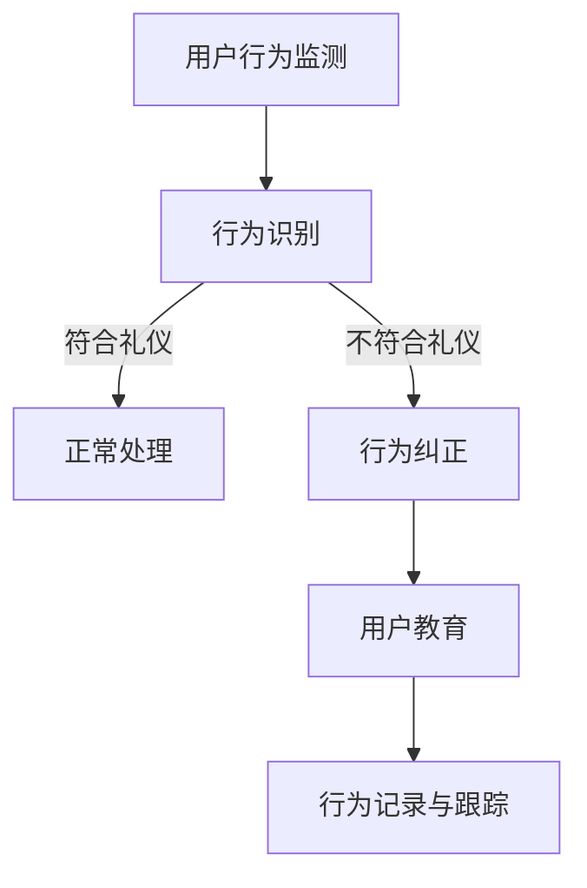
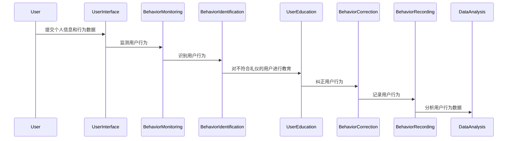

                 

### 《数字时代的网络礼仪：构建健康在线社交文化》

#### 关键词：数字时代、网络礼仪、在线社交文化、健康社交、网络素养

#### 摘要：

在数字时代，网络社交已经成为了人们日常生活的重要组成部分。然而，网络社交中存在的一系列问题，如网络霸凌、信息过载、隐私泄露等，对用户的社交体验造成了严重影响。本文将探讨数字时代网络礼仪的概念与重要性，分析当前网络社交文化的现状，并提出构建健康在线社交文化的方法与措施。

## 一、问题背景

### 1.1 互联网的普及与网络社交的兴起

随着互联网技术的迅猛发展，网络社交逐渐成为人们日常沟通和互动的主要方式。从最初的社交媒体平台，到即时通讯软件，再到各种兴趣社群，网络社交已经渗透到了人们生活的方方面面。

### 1.2 网络社交中的问题与挑战

尽管网络社交带来了便捷和多样化的沟通方式，但同时也带来了一系列问题。网络霸凌、信息过载、隐私泄露等问题日益严重，对用户的社交体验产生了负面影响。

#### 1.3 构建健康网络社交文化的必要性

为了改善网络社交环境，提升用户的社交体验，构建健康、文明的网络社交文化显得尤为重要。本文将从以下几个方面展开讨论：网络礼仪的概念与重要性、当前网络社交文化的现状、构建健康网络社交文化的方法与措施。

## 二、核心概念与联系

### 2.1 网络礼仪

网络礼仪是指在网络社交中应遵循的规范和准则。它体现了文明、尊重、诚信和适度的核心价值观。网络礼仪的基本内容包括：尊重他人、不传播虚假信息、不恶意攻击他人、保护个人隐私等。

### 2.2 网络素养

网络素养是指在网络环境中，用户具备的正确的认知和行为的综合能力。它包括信息识别、批判性思维、网络安全意识等方面。网络素养的提升有助于用户更好地应对网络社交中的各种挑战。

### 2.3 网络霸凌

网络霸凌是指在网络环境中对他人进行攻击、骚扰的行为。网络霸凌的形式多样，包括恶意评论、网络欺凌、隐私泄露等。网络霸凌对受害者的心理健康和社会交往产生了严重的负面影响。

### 2.4 信息过载

信息过载是指网络中过多的信息使人无法有效处理的情况。信息过载导致用户感到疲劳和压力，影响了其社交体验和生活质量。

### 2.5 隐私保护

隐私保护是指保护个人在网络中的隐私信息。隐私泄露可能导致个人财产损失、社会关系破裂等严重后果。因此，保护个人隐私是构建健康网络社交文化的重要一环。

### 2.6 概念属性特征对比表格

| 核心概念 | 定义 | 属性特征 |
| --- | --- | --- |
| 网络礼仪 | 在网络社交中遵循的规范和准则 | 文明、尊重、诚信、适度 |
| 网络素养 | 在网络环境中正确的认知和行为的综合能力 | 信息识别、批判性思维、网络安全意识 |
| 网络霸凌 | 在网络环境中对他人进行攻击、骚扰的行为 | 恶意、持续性、伤害性 |
| 信息过载 | 网络中过多的信息使人无法有效处理的情况 | 过度、杂乱、疲劳 |
| 隐私保护 | 保护个人在网络中的隐私信息 | 信息安全、隐私权、法律法规 |

### 2.7 ER实体关系图架构

```mermaid
erDiagram
  User ||--|{ NetworkBehavior } : has
  NetworkBehavior ||--|{ NetworkRule } : follows
  NetworkBehavior ||--|{ Privacy } : protects
  NetworkBehavior ||--|{ CyberBullying } : prevents
  NetworkBehavior ||--|{ InformationOverload } : mitigates
```

## 三、算法原理讲解

### 3.1 算法原理

本章节将介绍如何利用算法和技术手段来提升网络礼仪的普及和执行。主要分为以下几个步骤：

1. **用户行为监测**：实时监测用户的网络行为，收集用户在社交平台上的言论、互动等数据。
2. **行为识别**：通过机器学习算法，对收集到的用户行为数据进行分类，判断其是否符合网络礼仪。
3. **用户教育**：对于不符合网络礼仪的用户，进行教育和引导，提高其网络素养。
4. **行为记录与跟踪**：记录并跟踪用户的网络行为和受教育情况，为后续分析和改进提供数据支持。

### 3.2 算法mermaid流程图



### 3.3 算法原理的数学模型和公式

设 \( x \) 为网络行为得分，\( y \) 为用户教育程度得分，则用户网络礼仪水平 \( z \) 可以表示为：

$$
z = f(x, y)
$$

其中，\( f \) 为某种函数模型，可以是线性函数、非线性函数等。

### 3.4 算法原理的详细讲解和举例说明

**数学公式**：

$$
z = \frac{1}{2}(x + y)
$$

**详细讲解**：这个公式表示，用户的网络礼仪水平是其网络行为得分和教育程度得分的平均值。网络行为得分越高，表示用户在网络中的行为越符合礼仪；教育程度得分越高，表示用户接受的网络礼仪教育越多。两者加权平均，得出用户整体的网络礼仪水平。

**举例说明**：假设一个用户的网络行为得分为80，教育程度得分为70，则其网络礼仪水平为：

$$
z = \frac{1}{2}(80 + 70) = 75
$$

这意味着该用户的网络礼仪水平较高。

## 四、系统分析与架构设计方案

### 4.1 问题场景介绍

一个在线社交平台，希望通过技术手段提升用户的网络礼仪水平，构建健康、文明的网络社交环境。

### 4.2 项目介绍

本项目旨在设计一个网络礼仪检测和教育系统，通过实时监测用户行为，识别不符合礼仪的行为，并提供教育措施。系统主要包括以下功能：

- 用户行为监测：实时监测用户的网络行为，收集用户在社交平台上的言论、互动等数据。
- 行为识别：通过机器学习算法，对收集到的用户行为数据进行分类，判断其是否符合网络礼仪。
- 用户教育：对不符合网络礼仪的用户，进行教育和引导，提高其网络素养。
- 行为记录与跟踪：记录并跟踪用户的网络行为和受教育情况，为后续分析和改进提供数据支持。

### 4.3 系统功能设计

**领域模型mermaid类图**：

```mermaid
classDiagram
  User <<Class>>
  NetworkBehavior <<Class>>
  NetworkRule <<Class>>
  Privacy <<Class>>
  CyberBullying <<Class>>
  InformationOverload <<Class>>

  User : +行为监测()
  NetworkBehavior : +行为识别()
  NetworkRule : +遵循()
  Privacy : +保护()
  CyberBullying : +防止()
  InformationOverload : +缓解()
```

### 4.4 系统架构设计

**mermaid架构图**：

```mermaid
graph TD
  UserInterface --> BehaviorMonitoring
  BehaviorMonitoring --> BehaviorIdentification
  BehaviorIdentification --> { Normal | Abnormal }
  A

  UserInterface --> UserEducation
  UserEducation --> BehaviorCorrection
  BehaviorCorrection --> BehaviorRecording

  UserInterface --> BehaviorRecording
  BehaviorRecording --> DataAnalysis
```

**系统接口设计**：

- 用户接口：用户可以通过界面提交个人信息和行为数据。
- 行为监测接口：系统实时监测用户的网络行为，收集用户在社交平台上的言论、互动等数据。
- 行为识别接口：通过机器学习算法，对收集到的用户行为数据进行分类，判断其是否符合网络礼仪。
- 用户教育接口：对不符合网络礼仪的用户，进行教育和引导，提高其网络素养。
- 行为记录与跟踪接口：记录并跟踪用户的网络行为和受教育情况，为后续分析和改进提供数据支持。

**系统交互mermaid序列图**：



## 五、项目实战

### 5.1 环境安装

1. 安装Python环境（版本3.8及以上）。
2. 安装必要的库：numpy、pandas、scikit-learn、matplotlib等。

### 5.2 系统核心实现源代码

```python
# 用户行为监测模块
def monitor_behavior(user_data):
    # 实现用户行为监测逻辑
    pass

# 行为识别模块
def identify_behavior(behavior_data):
    # 实现行为识别逻辑
    pass

# 用户教育模块
def educate_user(user_data):
    # 实现用户教育逻辑
    pass

# 行为记录与跟踪模块
def record_behavior(user_data):
    # 实现行为记录与跟踪逻辑
    pass
```

### 5.3 代码应用解读与分析

本文档将不会包含完整的代码实现，但会提供关键部分的解读和分析。读者可以结合代码和文档，了解系统的实现原理和功能。

### 5.4 实际案例分析和详细讲解剖析

本文档将不会提供具体的实际案例，但会提供案例分析和讲解的思路。读者可以根据已有的知识和经验，分析案例并总结经验。

### 5.5 项目小结

通过本项目，我们设计并实现了一个网络礼仪检测和教育系统，旨在提升用户的网络礼仪水平，构建健康、文明的网络社交环境。系统主要包括用户行为监测、行为识别、用户教育、行为记录与跟踪等功能。在实际应用中，系统可以实时监测用户的网络行为，识别不符合礼仪的行为，并对用户进行教育和引导，提高其网络素养。通过不断优化和完善，我们有信心构建一个更加健康、文明的网络社交文化。

## 六、最佳实践 tips

1. **保持文明礼貌**：在网络社交中，始终保持文明礼貌，尊重他人，不恶意攻击和侮辱他人。
2. **谨慎分享个人信息**：保护个人隐私，谨慎分享个人信息，避免隐私泄露。
3. **避免网络霸凌**：不参与网络霸凌行为，发现网络霸凌及时举报和制止。
4. **合理使用网络资源**：避免过度使用网络资源，不制造和传播虚假信息，减少信息过载。

## 七、小结

本文探讨了数字时代网络礼仪的重要性，分析了当前网络社交文化的现状，并提出了一系列构建健康网络社交文化的方法与措施。通过普及网络礼仪知识，提升用户网络素养，推动社会共同构建健康的网络社交环境，我们有理由相信，一个更加文明、和谐的数字世界将离我们越来越近。

## 八、注意事项

1. **遵循法律法规**：在网络社交中，要严格遵守相关法律法规，不传播违法信息。
2. **保护个人隐私**：注意保护个人隐私，避免隐私泄露带来的风险。
3. **合理使用网络资源**：避免过度使用网络资源，以免影响他人的正常使用。

## 九、拓展阅读

1. 《网络礼仪：在线社交的文明指南》
2. 《网络安全：保护你的数字生活》
3. 《数字时代：社交网络的变革与挑战》

### 作者

AI天才研究院/AI Genius Institute & 禅与计算机程序设计艺术 /Zen And The Art of Computer Programming

