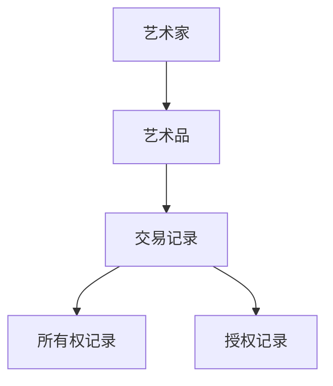
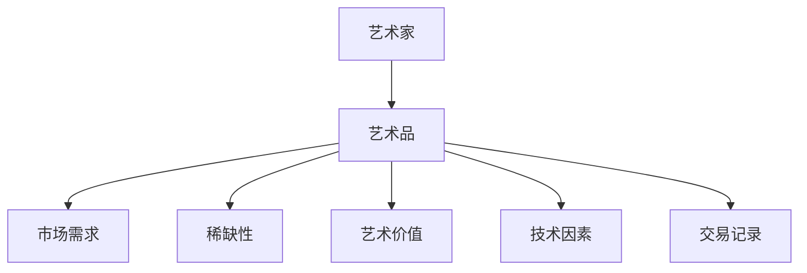
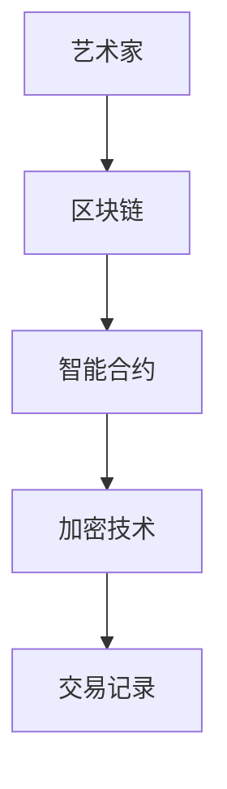
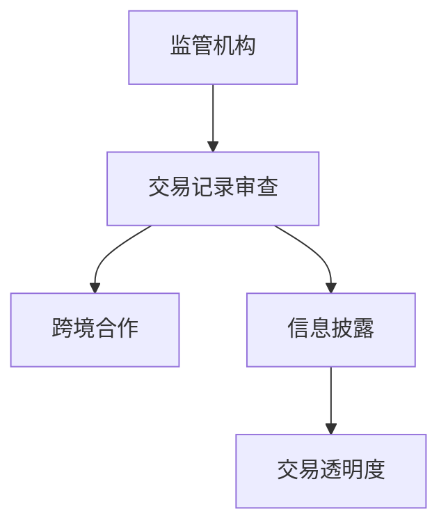

                 

### 《数字时代的艺术市场：NFT艺术品在收藏界的影响》

> 关键词：数字艺术、NFT、收藏界、市场影响、未来展望

> 摘要：随着数字技术的发展，艺术市场正在经历一场深刻的变革。NFT（非同质化代币）作为一种新兴的数字资产形式，正在改变艺术市场的传统运作模式。本文将深入探讨NFT艺术品在收藏界的影响，分析其市场现状、技术框架、法律监管以及未来展望，为读者提供一个全面了解数字时代艺术市场的视角。

----------------------------------------------------------------

### 第一部分：艺术市场的数字转型

#### 1.1 艺术市场的传统运作模式

艺术市场的传统运作模式主要依赖于画廊、拍卖行和艺术品经纪人等中介机构。艺术家通过这些渠道展示和销售作品，买家则需要通过这些中介了解市场动态并购买艺术品。传统艺术市场的交易过程通常包括以下几个环节：

1. **艺术品创作**：艺术家创作出独特的艺术作品。
2. **展示与推广**：作品在画廊、博物馆或艺术展览中进行展示，以吸引潜在买家。
3. **评估与定价**：艺术品专家对作品进行评估，并确定价格范围。
4. **交易与交付**：买家通过中介机构与艺术家或画廊达成交易，并完成作品交付。

#### 1.2 数字时代的艺术市场发展

随着互联网和数字技术的发展，艺术市场逐渐向数字化转型。数字艺术、在线拍卖和社交媒体成为艺术市场的重要组成部分。以下是一些数字时代艺术市场的发展趋势：

1. **数字艺术**：利用计算机技术和数字软件创作的艺术作品，如虚拟现实艺术、增强现实艺术和数字绘画等。
2. **在线拍卖**：越来越多的艺术品通过在线拍卖平台进行交易，如苏富比、佳士得和eBay艺术等。
3. **社交媒体**：艺术家和买家通过社交媒体平台进行互动，分享艺术作品和艺术市场信息。

#### 1.3 NFT在艺术市场中的崛起

NFT（非同质化代币）作为一种新兴的数字资产形式，正在改变艺术市场的运作模式。NFT艺术品具有独特的数字标识，确保了艺术品的唯一性和真实性。以下是NFT在艺术市场中的崛起原因：

1. **唯一性**：NFT确保了艺术品的唯一性，使每一件艺术品都具有独特的数字身份。
2. **不可篡改性**：NFT基于区块链技术，具有不可篡改的特性，确保了艺术品的真实性和所有权。
3. **数字版权保护**：NFT技术可以帮助艺术家保护其作品的版权，防止未经授权的复制和分发。

### 总结

数字时代的艺术市场正在经历一场深刻的变革。NFT艺术品的崛起为艺术家提供了新的创作和销售方式，同时也为收藏家提供了新的投资渠道。在接下来的部分中，我们将进一步探讨NFT艺术品的特点、市场现状以及对收藏界的影响。

----------------------------------------------------------------

#### 2. NFT艺术品的定义与特点

NFT（非同质化代币）是一种基于区块链技术的数字资产，代表了一种唯一且不可分割的资产所有权。与传统数字资产如比特币等相同，NFT也具有独特的标识符，但与比特币等同质化代币不同，NFT具有独特性和不可互换性。

##### 2.1 NFT的基本概念

NFT的基本概念包括以下几个关键要素：

1. **数字身份**：每个NFT都有唯一的数字身份，由一个加密哈希值表示。这个哈希值确保了NFT的唯一性和不可篡改性。
2. **区块链**：NFT是建立在区块链上的，区块链是分布式账本技术，具有透明性和不可篡改性。NFT的交易记录和所有权信息都存储在区块链上。
3. **智能合约**：NFT的创建、转移和版权管理等行为通常通过智能合约实现。智能合约是一段自动执行的代码，确保了NFT交易的安全性和透明性。

##### 2.2 NFT艺术品的独特属性

NFT艺术品与传统艺术品不同，具有以下独特属性：

1. **唯一性**：NFT艺术品是独一无二的，每一件作品都具有独特的数字标识，确保了艺术品的唯一性和稀缺性。
2. **不可篡改性**：NFT艺术品的所有权和交易记录存储在区块链上，具有不可篡改的特性，确保了艺术品的真实性和透明性。
3. **数字版权保护**：NFT技术可以帮助艺术家保护其作品的版权，防止未经授权的复制和分发。艺术家可以通过NFT控制其作品的授权和收益。

##### 2.3 NFT与数字版权保护

NFT在数字版权保护方面具有显著优势。通过NFT，艺术家可以：

1. **确权**：使用NFT为作品确权，确保作品的所有权和原创性。
2. **授权**：通过NFT向其他艺术家或机构授权使用其作品，并自动收取版税。
3. **维权**：NFT记录了艺术品的交易和授权历史，有助于艺术家在维权时提供证据。

#### 表：NFT艺术品与传统艺术品的对比

| 特性         | NFT艺术品                           | 传统艺术品                           |
| ------------ | ----------------------------------- | ----------------------------------- |
| 唯一性       | 独一无二，具有唯一数字标识           | 可以复制，无唯一数字标识               |
| 不可篡改性   | 基于区块链技术，交易记录不可篡改       | 篡改难度高，但并非绝对安全             |
| 数字版权保护 | 可以通过NFT保护版权，实现版税自动化     | 难以实现自动化版权保护和版税收取       |
| 流动性       | 可以在区块链上进行快速交易和转移       | 需要通过中介机构进行交易和转移         |

#### ER实体关系图架构

在NFT艺术品中，艺术家、艺术品、交易记录、所有权记录和授权记录是核心实体。通过NFT，这些实体之间的关系得到有效管理和保护。

### 总结

NFT艺术品具有独特的数字身份、不可篡改性和数字版权保护特性，使其在艺术市场中的地位日益重要。在接下来的部分中，我们将进一步分析NFT艺术品的市场现状，探讨其市场规模、发展趋势以及市场参与者。

----------------------------------------------------------------

#### 3. NFT艺术品的市场现状

NFT艺术品市场在过去几年中呈现出迅猛发展的态势。随着数字技术的不断进步和区块链技术的普及，NFT艺术品逐渐成为收藏家和投资者关注的热点。以下是对NFT艺术品市场的现状分析：

##### 3.1 NFT艺术品市场的规模与发展趋势

NFT艺术品市场的规模在过去几年中迅速扩大。根据相关数据，2020年NFT艺术品市场的交易总额仅为1.5亿美元，而到2021年，这一数字已飙升至18亿美元。预计未来几年，NFT艺术品市场将继续保持快速增长态势。

1. **市场交易额**：随着NFT艺术品市场的不断扩大，市场交易额也在不断攀升。2021年，全球NFT艺术品交易总额达到约40亿美元，同比增长约160%。
2. **用户参与度**：越来越多的收藏家和投资者进入NFT艺术品市场，市场参与度不断提高。根据调查，2021年全球参与NFT艺术品市场的用户超过100万人。
3. **发展趋势**：NFT艺术品市场的发展趋势呈现出以下几个特点：
   - **技术进步**：随着区块链技术的不断成熟，NFT艺术品的独特性和安全性得到进一步保障。
   - **市场需求**：随着人们对数字艺术和区块链技术的认可度提高，NFT艺术品市场需求持续增长。
   - **市场多元化**：NFT艺术品市场不再局限于艺术品，开始涉足数字藏品、虚拟房地产等领域。

##### 3.2 NFT艺术品的市场参与者

NFT艺术品市场的参与者包括艺术家、收藏家、投资者、交易平台和中介机构等。以下是对市场参与者的分析：

1. **艺术家**：NFT艺术品为艺术家提供了新的创作和销售平台。艺术家可以通过NFT发行限量版艺术品，并获得版税收益。
2. **收藏家**：收藏家是NFT艺术品市场的重要参与者。他们通过购买NFT艺术品来收藏和投资，以获取艺术价值和投资回报。
3. **投资者**：投资者关注NFT艺术品市场的长期增长潜力，通过购买NFT艺术品进行投资。
4. **交易平台**：NFT艺术品交易平台是市场的重要组成部分。这些平台提供了NFT艺术品交易、展示和推广的功能，促进了市场的活跃度。
5. **中介机构**：中介机构在NFT艺术品市场中提供咨询、评估和交易服务，帮助艺术家和收藏家进行交易。

##### 3.3 NFT艺术品的市场挑战与机遇

NFT艺术品市场在快速发展过程中面临一些挑战和机遇：

1. **挑战**：
   - **市场波动**：NFT艺术品市场波动较大，价格起伏明显，对投资者和收藏家带来一定风险。
   - **法律监管**：NFT艺术品市场尚缺乏明确的法律监管框架，可能影响市场的稳定发展。
   - **技术问题**：区块链技术仍处于发展阶段，技术问题如性能、安全性等需要进一步解决。

2. **机遇**：
   - **市场潜力**：随着数字技术的发展和人们对数字艺术的认可，NFT艺术品市场具有巨大的潜力。
   - **创新应用**：NFT技术可以应用于更多领域，如数字藏品、虚拟房地产等，为市场带来新的发展机会。

### 总结

NFT艺术品市场呈现出快速发展的态势，市场规模不断扩大，市场参与者日益增多。虽然市场面临一些挑战，但NFT艺术品的独特性和数字版权保护优势为市场带来了巨大的机遇。在接下来的部分中，我们将探讨NFT艺术品对收藏界的影响，分析传统收藏家的反应、新兴收藏家的涌现以及NFT艺术品的价值评估。

----------------------------------------------------------------

#### 4. NFT艺术品对收藏界的影响

NFT艺术品的崛起不仅改变了艺术市场的运作模式，也对收藏界产生了深远的影响。以下将从传统收藏家的反应、新兴收藏家的涌现以及NFT艺术品的价值评估三个方面进行分析。

##### 4.1 传统收藏家的反应

传统收藏家对NFT艺术品的反应各不相同。一方面，一些资深收藏家对NFT艺术品的独特性和数字版权保护优势表示认可，开始尝试涉足NFT艺术品市场。他们认为NFT艺术品为艺术品收藏提供了新的维度，具有长期投资价值。

另一方面，也有一些传统收藏家对NFT艺术品持怀疑态度。他们认为NFT艺术品与传统艺术品相比缺乏历史和文化价值，且市场波动较大，风险较高。此外，传统收藏家担心NFT艺术品市场的法律监管不完善，可能影响其收藏品的价值和安全性。

##### 4.2 新兴收藏家的涌现

NFT艺术品的崛起吸引了一批新兴收藏家，他们大多是年轻人和数字技术爱好者。这些新兴收藏家对数字艺术和区块链技术充满兴趣，热衷于探索NFT艺术品的投资和收藏机会。

1. **数字艺术爱好者**：新兴收藏家对数字艺术充满热情，愿意为具有创意和独特性的NFT艺术品支付高昂的价格。他们通过购买NFT艺术品来收藏和展示自己的数字艺术收藏。
2. **区块链技术爱好者**：一些新兴收藏家对区块链技术充满兴趣，希望通过NFT艺术品投资来学习和了解区块链技术。他们关注NFT艺术品市场的技术进步和投资机会，以获取潜在的投资回报。

##### 4.3 NFT艺术品的价值评估

NFT艺术品的价值评估与传统艺术品有所不同。由于NFT艺术品具有独特性和不可互换性，其价值受到多个因素的影响：

1. **艺术价值**：NFT艺术品的艺术价值是评估其价格的重要依据。艺术价值包括艺术家的知名度、作品的艺术风格和创意等。
2. **稀缺性**：NFT艺术品的稀缺性对其价值有显著影响。限量发行的NFT艺术品通常具有更高的价值，因为其供应量有限。
3. **市场需求**：市场需求是影响NFT艺术品价值的重要因素。市场需求旺盛时，NFT艺术品的价格通常会上涨。
4. **技术因素**：NFT技术的成熟度和区块链的安全性也会影响NFT艺术品的价值。技术进步和安全性的提升将提高NFT艺术品的价值。

#### 表：NFT艺术品价值评估因素

| 因素           | 影响价值                |
| -------------- | ---------------------- |
| 艺术价值       | 创意、艺术风格、艺术家知名度 |
| 稀缺性         | 限量发行、供应量有限         |
| 市场需求       | 市场热度、买家意愿         |
| 技术因素       | 区块链技术、安全性         |

#### ER实体关系图架构

在NFT艺术品市场中，艺术家、艺术品、市场需求、稀缺性、艺术价值、技术因素和交易记录是核心实体。通过NFT技术，这些实体之间的关系得到有效管理和保护。

### 总结

NFT艺术品对收藏界产生了深远的影响，吸引了传统收藏家和新兴收藏家的关注。NFT艺术品的独特性和数字版权保护优势为艺术品收藏提供了新的机会和挑战。在接下来的部分中，我们将通过案例研究进一步探讨NFT艺术品在收藏界的实际应用。

----------------------------------------------------------------

#### 5. NFT艺术品在收藏界的案例研究

NFT艺术品的崛起在收藏界引发了广泛关注，许多案例展示了NFT艺术品在市场中的实际应用。以下是一些具有代表性的NFT艺术品案例，以及它们在收藏界的影响。

##### 5.1 顶尖NFT艺术品案例

1. **Beeple的《每一天：前5000天》**：艺术家Mike Winkelmann（Beeple）的NFT艺术品《每一天：前5000天》在2021年3月以6930万美元的价格成交，成为迄今为止最昂贵的NFT艺术品。这幅作品由每天创作的数字艺术作品组成，展示了NFT在艺术市场中的巨大潜力。

2. **CryptoPunks**：CryptoPunks是另一个备受关注的NFT艺术品系列，由艺术家Matt Furie创作。CryptoPunks是一系列独特的像素化角色，每个角色都具有独特的属性和背景。这些角色在市场上受到热捧，其中一些已经以数百万美元的价格成交。

##### 5.2 中小型艺术家与NFT

NFT艺术品的崛起不仅为顶尖艺术家带来了巨大的商业成功，也为中小型艺术家提供了展示和销售作品的机会。以下是一些中小型艺术家的NFT艺术品案例：

1. **Fortnite艺术家Julian Oliver**：Julian Oliver是一位Fortnite艺术家，他通过NFT平台OpenSea发布了自己的数字艺术作品。他的作品《Digital Self》在OpenSea平台上售出，获得了超过5000美元的收益。

2. **伦敦艺术家Mez Breeze**：Mez Breeze是一位专注于数字艺术的伦敦艺术家，他通过NFT平台Rarible发布了自己的NFT艺术品。他的作品《Project Echelon》在Rarible平台上售出，获得了超过4000美元的收益。

##### 5.3 NFT艺术品市场的波动与调整

尽管NFT艺术品市场呈现出蓬勃发展的态势，但市场也经历了显著的波动和调整。以下是一些影响NFT艺术品市场波动的因素：

1. **市场情绪**：NFT艺术品市场的波动受市场情绪的影响。在市场情绪高涨时，NFT艺术品的价格往往会上涨；而在市场情绪低迷时，价格可能会下跌。

2. **技术问题**：区块链技术的不完善可能导致NFT艺术品市场的波动。例如，区块链性能瓶颈、安全漏洞等问题都可能对市场产生负面影响。

3. **法律监管**：法律监管的完善程度对NFT艺术品市场的发展至关重要。如果监管政策不明朗，投资者和收藏家可能会对市场产生担忧，导致价格波动。

#### 案例：Beeple的《每一天：前5000天》

Beeple的《每一天：前5000天》是一幅由每天创作的数字艺术作品组成的NFT艺术品。这幅作品在2021年3月的佳士得拍卖中以6930万美元的价格成交，创造了NFT艺术品拍卖的新纪录。以下是这幅作品在收藏界产生的影响：

1. **市场影响力**：《每一天：前5000天》的成功成交吸引了全球媒体和投资者的关注，极大地提升了NFT艺术品的知名度和市场影响力。

2. **艺术家收益**：Beeple通过这幅作品获得了巨大的收益，同时也证明了NFT艺术品在市场中的价值。

3. **投资机会**：《每一天：前5000天》的成功激励了更多艺术家和投资者参与NFT艺术品市场，推动了市场的发展。

#### 案例：CryptoPunks

CryptoPunks是一系列独特的像素化角色NFT艺术品。每个CryptoPunk角色都具有独特的属性和背景，使其在市场上备受追捧。以下是对CryptoPunks在收藏界产生的影响：

1. **市场热度**：CryptoPunks在市场上的热度非常高，许多收藏家和投资者愿意为其支付高昂的价格。

2. **投资回报**：CryptoPunks的持有者通过出售角色获得了丰厚的投资回报，一些角色甚至以数百万美元的价格成交。

3. **艺术创新**：CryptoPunks的成功为数字艺术领域带来了新的灵感，激发了更多艺术家创作独特的数字艺术品。

### 总结

NFT艺术品在收藏界产生了深远的影响，吸引了顶尖艺术家和中小型艺术家的参与。通过一些成功的案例，我们可以看到NFT艺术品在市场中的巨大潜力和创新性。在接下来的部分中，我们将探讨技术与法律框架对NFT艺术品市场的影响。

----------------------------------------------------------------

#### 6. 技术与法律框架对NFT艺术品市场的影响

NFT艺术品的兴起不仅改变了艺术市场的运作方式，也对技术和法律框架提出了新的挑战和机遇。以下将分别从NFT技术的技术架构、法律框架对NFT艺术品的影响，以及NFT艺术品市场的监管挑战进行探讨。

##### 6.1 NFT技术的技术架构

NFT技术基于区块链和智能合约两种核心技术。区块链是一种分布式账本技术，具有透明性和不可篡改的特性，而智能合约则是一段自动执行的代码，用于实现NFT的创建、转移和版权管理等功能。

1. **区块链**：NFT艺术品的数据和交易记录存储在区块链上，确保了其唯一性和不可篡改性。区块链的去中心化特性使得NFT艺术品无需依赖中央机构进行验证和记录，提高了交易的效率。
   
2. **智能合约**：智能合约在NFT技术的架构中扮演了重要角色。艺术家可以通过智能合约创建NFT艺术品，并在交易过程中自动执行版权保护和版税分配等功能。智能合约的透明性和自动化特性为NFT艺术品市场提供了高效和安全的交易环境。

3. **加密技术**：NFT艺术品采用加密技术来保护其唯一性和安全性。NFT的数字身份由加密哈希值表示，确保了每一件NFT艺术品都是独一无二的。同时，加密技术也用于确保交易过程中信息的隐私和安全性。

#### Mermaid区块链技术架构图

在NFT技术架构中，艺术家、区块链、智能合约、加密技术和交易记录是核心组成部分。通过这一架构，NFT艺术品实现了从创建、交易到版权保护的完整流程。

##### 6.2 法律框架对NFT艺术品的影响

NFT艺术品的兴起对现有的法律框架提出了挑战，同时也为法律制度提供了新的发展机会。

1. **版权问题**：NFT艺术品作为数字作品的一种形式，其版权问题成为法律框架关注的焦点。艺术家通过NFT确权，保护其作品的原创性和唯一性。然而，现有的版权法律框架在处理NFT艺术品版权纠纷时存在一定的局限性，需要进一步完善。

2. **交易监管**：NFT艺术品的交易过程需要法律监管以确保交易的合法性和安全性。法律框架需要明确NFT艺术品的交易规则，防止欺诈和非法交易的发生。

3. **税收政策**：NFT艺术品的交易涉及到税收问题。现有税收政策可能无法完全覆盖NFT艺术品的交易，需要制定相应的税收政策以规范市场。

#### 表：法律框架对NFT艺术品的影响

| 法律问题       | 影响                       |
| -------------- | -------------------------- |
| 版权问题       | 确保艺术品的原创性和唯一性   |
| 交易监管       | 保证交易的合法性和安全性     |
| 税收政策       | 规范市场交易，确定税收义务   |

##### 6.3 NFT艺术品市场的监管挑战

NFT艺术品市场的快速发展带来了监管挑战。以下是一些监管方面的挑战：

1. **透明度**：NFT艺术品的交易信息需要更高的透明度，以确保交易的合法性和公正性。监管机构需要建立完善的交易记录和信息披露机制。

2. **欺诈防范**：NFT艺术品市场容易成为欺诈行为的高发区，如虚假艺术品、非法交易等。监管机构需要加强监管，防范欺诈行为。

3. **跨境交易**：NFT艺术品市场的国际化趋势要求监管机构在国际层面加强合作，制定统一的监管标准和措施。

#### Mermaid监管架构图

在NFT艺术品市场的监管架构中，监管机构、交易记录审查、跨境合作、信息披露和交易透明度是关键组成部分。通过这一架构，监管机构可以有效监管NFT艺术品市场，保障市场的健康发展。

### 总结

技术与法律框架对NFT艺术品市场的影响至关重要。NFT技术的技术架构为艺术品市场提供了高效、安全的交易环境，而法律框架则为市场提供了规范和保障。在NFT艺术品市场的监管方面，监管机构需要加强透明度、防范欺诈和促进跨境合作，以保障市场的健康发展。在接下来的部分中，我们将探讨NFT艺术品市场的未来展望。

----------------------------------------------------------------

#### 7. NFT艺术品市场的未来展望

随着数字技术的不断进步和区块链技术的普及，NFT艺术品市场有望在未来继续保持快速增长。以下将分析NFT艺术品市场的发展方向、与艺术教育的结合以及市场的社会影响。

##### 7.1 NFT艺术品市场的发展方向

1. **市场规模的扩大**：随着NFT技术的普及和人们对数字艺术的接受度提高，NFT艺术品市场的规模将进一步扩大。预计未来几年，NFT艺术品市场的交易总额将继续保持高速增长。

2. **市场的多元化**：NFT艺术品市场不再局限于艺术品，开始涉足数字藏品、虚拟房地产、虚拟服装等多元化领域。这将为市场带来更多的发展机会和创新空间。

3. **技术的进步**：随着区块链技术的不断成熟，NFT艺术品市场的技术也将得到进一步提升。例如，区块链性能的优化、交易速度的提高以及安全性的增强，都将为市场的发展提供有力支持。

##### 7.2 NFT艺术品与艺术教育的结合

NFT艺术品为艺术教育提供了新的平台和机会。以下是一些结合案例：

1. **数字艺术创作课程**：一些艺术教育机构开始开设数字艺术创作课程，教授学生如何使用NFT技术进行艺术创作和交易。

2. **艺术市场分析课程**：艺术教育机构可以开设NFT艺术品市场分析课程，帮助学生了解NFT艺术品市场的运作机制、投资策略和风险管理。

3. **虚拟博物馆**：一些艺术博物馆和教育机构通过NFT技术建立虚拟博物馆，向学生和公众展示NFT艺术品，提高艺术教育的互动性和参与度。

##### 7.3 NFT艺术品市场的社会影响

NFT艺术品市场的发展对社会产生了积极和消极的影响。以下是一些主要的社会影响：

1. **艺术普及**：NFT艺术品市场的兴起降低了艺术创作的门槛，使得更多普通人有机会参与艺术创作和收藏。这有助于提高社会对艺术的认知和参与度。

2. **艺术品定价透明化**：NFT艺术品的交易记录存储在区块链上，具有透明性，有助于提高艺术品定价的公正性和透明度。

3. **数字版权保护**：NFT技术为艺术家的数字版权保护提供了有力支持，有助于减少未经授权的复制和分发。

4. **市场风险**：NFT艺术品市场的高波动性和不确定性为投资者和收藏家带来了风险。一些投资者可能会因市场波动遭受损失。

5. **法律监管挑战**：随着NFT艺术品市场的快速发展，法律监管面临新的挑战。监管机构需要完善相关法律法规，以保障市场的健康发展。

### 总结

NFT艺术品市场在未来有望继续保持快速增长，市场规模的扩大、技术的进步以及与艺术教育的结合将为市场带来新的机遇。同时，NFT艺术品市场对社会产生了积极和消极的影响，需要各方共同努力，制定合理的法律监管措施，以促进市场的健康发展。

----------------------------------------------------------------

### 第二部分：NFT艺术品投资与收藏指南

#### 8. NFT艺术品投资入门

NFT艺术品投资对于初次接触这一领域的投资者来说，需要一些基本的准备工作和了解。以下是一些入门级的指导，帮助您开始NFT艺术品投资之旅。

##### 8.1 NFT艺术品投资的准备工作

在进行NFT艺术品投资之前，以下准备工作是必不可少的：

1. **了解基础知识**：首先，您需要了解NFT的基本概念，包括NFT的定义、工作原理以及其与区块链技术的关系。这有助于您更好地理解NFT艺术品的市场和投资逻辑。

2. **学习市场动态**：关注NFT艺术品市场的最新动态，了解热门艺术家、热门作品以及市场的整体趋势。可以通过阅读相关文章、关注行业博客和社交媒体来获取信息。

3. **了解风险**：NFT艺术品投资具有高风险，价格波动大，市场不成熟。在投资前，请确保您已经充分认识到这些风险，并准备好相应的风险承受能力。

##### 8.2 NFT交易平台的选择

选择一个可靠的NFT交易平台是投资成功的关键。以下是一些选择平台的建议：

1. **安全性**：确保交易平台有良好的安全措施，如双因素认证、加密钱包等。避免使用安全性较低的平台。

2. **交易记录**：查看平台的交易记录和用户评价，了解平台的交易量、用户活跃度和服务质量。

3. **手续费**：比较不同平台的手续费率，选择手续费合理且透明的平台。

4. **支持资产**：确认平台支持的资产类型，包括NFT和加密货币，以及是否支持您的支付方式。

5. **用户界面**：一个直观、易于使用的用户界面可以提高您的投资体验。选择界面友好、操作便捷的平台。

##### 8.3 NFT艺术品投资的策略

在制定NFT艺术品投资策略时，以下建议可以帮助您更好地管理风险和抓住机会：

1. **分散投资**：不要将所有资金投资在一个或几个NFT艺术品上，而是分散投资于不同类型、不同艺术家的NFT艺术品，以降低风险。

2. **长期投资**：NFT艺术品市场波动较大，短期投资可能带来高风险。考虑长期投资，关注艺术家的持续发展和作品的价值积累。

3. **研究价值**：在投资前，深入研究艺术家的背景、作品的艺术价值和市场认可度。选择具有潜力和独特性的NFT艺术品。

4. **市场趋势**：关注市场趋势，特别是在某些艺术家或作品受到广泛关注时，可能会带来投资机会。但也要谨慎对待市场炒作。

5. **风险管理**：设定合理的投资预算和止损点，避免因市场波动而遭受重大损失。

### 总结

NFT艺术品投资对于初次接触的投资者来说，需要充分的准备工作和策略规划。了解基础知识、学习市场动态、选择可靠的交易平台以及制定合适的投资策略是成功投资的关键。在接下来的章节中，我们将进一步探讨NFT艺术品收藏的技巧，帮助您更好地进行收藏。

----------------------------------------------------------------

### 9. NFT艺术品收藏技巧

NFT艺术品的收藏不仅是一种投资，更是一种对数字艺术的热爱和追求。以下是一些NFT艺术品收藏的技巧，帮助您在收藏过程中作出明智的决策。

##### 9.1 如何识别高质量NFT艺术品

1. **研究艺术家背景**：选择有知名度和声誉的艺术家创作的NFT艺术品。这些艺术家通常具有稳定的作品质量和广泛的市场认可度。

2. **关注作品质量**：NFT艺术品的质量与价值密切相关。在收藏时，仔细观察作品的艺术水平、创意和视觉效果。

3. **了解作品历史**：查阅NFT艺术品的历史交易记录，了解其价格波动和收藏家的评价。这有助于判断作品的市场潜力和收藏价值。

4. **关注限量版**：限量版NFT艺术品通常具有更高的收藏价值。考虑收藏限量版作品，以增加其独特性和稀缺性。

##### 9.2 NFT艺术品收藏的风险管理

1. **分散投资**：不要将所有资金投入一个或几个NFT艺术品，而是分散投资于不同艺术家和不同类型的作品，以降低风险。

2. **设置预算**：在收藏前，设定一个合理的预算，并严格遵守。避免因市场波动而超出预算。

3. **止损策略**：设置止损点，当NFT艺术品价格下跌到一定幅度时，及时出售以减少损失。

4. **市场监控**：密切关注市场动态，及时了解热门作品和收藏家的评价，以便调整收藏策略。

##### 9.3 NFT艺术品收藏的市场趋势分析

1. **关注热门趋势**：关注市场中的热门趋势和热点话题，如特定艺术家、特定作品或特定主题的NFT艺术品。

2. **研究市场数据**：利用市场数据和分析工具，研究NFT艺术品的交易量、价格波动和市场活跃度，以把握市场趋势。

3. **参与社区讨论**：加入NFT艺术品社区，参与讨论和交流，了解其他收藏家的观点和经验，以获取更多市场信息。

4. **预测未来趋势**：根据市场趋势和行业动态，预测未来可能的热点领域和潜力艺术家，以便提前布局。

### 总结

NFT艺术品收藏需要技巧和智慧。通过研究艺术家背景、关注作品质量、了解作品历史、分散投资和设置预算等技巧，可以有效地降低风险，提高收藏的成功率。在接下来的章节中，我们将探讨NFT艺术品交易与维权的问题，帮助您在交易过程中保护自己的权益。

----------------------------------------------------------------

### 10. NFT艺术品交易与维权

NFT艺术品交易作为数字时代的一种新兴交易方式，涉及多个环节和参与者。以下将详细探讨NFT艺术品交易的流程、维权途径以及相关的法律法规。

##### 10.1 NFT艺术品交易的流程

NFT艺术品交易的流程大致可以分为以下几个步骤：

1. **购买NFT艺术品**：
   - **选择艺术家**：研究感兴趣的艺术家，了解其艺术风格和市场价值。
   - **购买NFT**：在NFT交易平台（如OpenSea、Rarible、Foundation等）上选择并购买NFT艺术品。购买前需确认NFT的属性、历史交易记录和持有者信息。

2. **支付与确认**：
   - **支付方式**：NFT交易的支付通常使用加密货币，如以太币（ETH）。确保资金安全，选择可靠的支付方式。
   - **确认购买**：在交易完成后，确认NFT的所有权已成功转移至您的加密钱包。

3. **NFT的存储**：
   - **加密钱包**：将购买到的NFT艺术品存储在安全的加密钱包中，保护您的数字资产。
   - **备份私钥**：务必备份您的加密钱包私钥，以防止丢失或被盗。

##### 10.2 NFT艺术品的维权途径

NFT艺术品交易过程中可能会遇到各种问题，如版权纠纷、交易欺诈等。以下是一些常见的维权途径：

1. **平台投诉**：
   - **平台调解**：大多数NFT交易平台提供投诉和调解机制。如遇到问题，可向平台提交投诉，平台将协助解决。
   - **平台规则**：熟悉并遵守平台的交易规则和用户协议，以减少纠纷发生的风险。

2. **法律途径**：
   - **律师咨询**：如遇到严重的版权纠纷或欺诈行为，可咨询专业律师，寻求法律援助。
   - **起诉**：在法律允许的情况下，通过法院起诉侵权方，维护自己的权益。

3. **社区支持**：
   - **社区讨论**：加入NFT艺术品社区，与其他收藏家和艺术家交流，获取维权经验和建议。
   - **第三方调解**：一些第三方调解机构提供专业的调解服务，协助解决纠纷。

##### 10.3 NFT艺术品交易的法律法规

NFT艺术品交易的法律法规在各国有所不同，以下是一些主要法律法规概述：

1. **美国**：
   - **证券法**：美国证券法适用于某些NFT艺术品交易，如具有投资属性的数字艺术品。
   - **版权法**：NFT艺术品涉及版权问题，需要遵守美国版权法。

2. **欧洲**：
   - **数字市场法**：欧洲的数字市场法对NFT艺术品的交易行为进行了规范。
   - **版权指令**：欧洲版权指令对数字版权保护提出了具体要求，影响到NFT艺术品的交易。

3. **中国**：
   - **反垄断法**：中国反垄断法对NFT艺术品市场的垄断行为进行了规范。
   - **版权法**：中国版权法对NFT艺术品的版权保护提供了法律支持。

4. **其他国家和地区**：
   - **新加坡**：新加坡对NFT艺术品交易进行了监管，并制定了相应的法律法规。
   - **日本**：日本对NFT艺术品交易进行了监管，并强调版权保护。

### 总结

NFT艺术品交易与维权是一个复杂的过程，涉及多个环节和法律法规。了解交易流程、维权途径以及相关的法律法规是确保交易顺利进行和保护自身权益的关键。在NFT艺术品交易过程中，投资者和收藏家应保持警惕，遵守法律法规，以降低风险，保护自己的权益。

----------------------------------------------------------------

### 11. NFT艺术品案例分析

在探讨NFT艺术品市场的实际运作和影响时，案例分析是一个非常有价值的工具。以下是一些成功的NFT艺术品投资案例以及失败的案例，并对其进行深入剖析。

##### 11.1 成功的NFT艺术品投资案例

1. **购买Beeple的《每一天：前5000天》**：
   - **背景**：2021年3月，艺术家Mike Winkelmann（Beeple）的NFT艺术品《每一天：前5000天》在佳士得拍卖中以6930万美元的高价成交，成为迄今为止最昂贵的NFT艺术品。
   - **分析**：这次成功的投资得益于Beeple的知名度和作品的独特性。Beeple的作品以其独特的风格和创意性在市场上备受认可。投资者在了解市场趋势和艺术家背景后，果断出手，最终获得了巨大的投资回报。

2. **投资CryptoPunks**：
   - **背景**：CryptoPunks是另一系列备受瞩目的NFT艺术品，每个角色都有独特的属性和背景。一些CryptoPunks角色在市场上以数百万美元的价格成交。
   - **分析**：CryptoPunks的成功在于其稀缺性和独特性。CryptoPunks角色的数量有限，且每个角色都有其独特的价值和吸引力。投资者通过深入研究CryptoPunks的属性和市场趋势，及时抓住了投资机会，获得了丰厚的回报。

##### 11.2 失败的NFT艺术品投资案例

1. **投资新兴艺术家的NFT艺术品**：
   - **背景**：某投资者在NFT艺术品市场上购买了多位新兴艺术家的作品，期待获得高额回报。
   - **分析**：这次投资失败的主要原因是缺乏对新兴艺术家作品的深入研究和评估。投资者没有充分了解艺术家的背景、作品质量和市场认可度，导致购买的NFT艺术品价值较低。此外，NFT艺术品市场的高波动性也增加了投资风险。

2. **跟风投资热门作品**：
   - **背景**：一位投资者在看到某个热门NFT艺术品价格飙升后，跟风买入，期待获取高额利润。
   - **分析**：这次投资失败的原因是盲目跟风和市场炒作。投资者没有进行充分的市场调研和风险评估，仅凭市场热度做出投资决策。当市场热度退去时，投资作品的价格大幅下跌，投资者遭受了重大损失。

##### 11.3 深入剖析NFT艺术品市场的波动

1. **市场情绪的影响**：
   - **背景**：NFT艺术品市场经常出现价格波动，受到市场情绪的影响。
   - **分析**：市场情绪高涨时，投资者信心增强，NFT艺术品价格往往会上涨；而市场情绪低迷时，价格则可能下跌。投资者应密切关注市场情绪，合理调整投资策略。

2. **技术问题的影响**：
   - **背景**：NFT艺术品市场的技术问题，如区块链性能瓶颈和安全漏洞，可能对市场产生负面影响。
   - **分析**：技术问题可能导致交易中断、数据泄露等问题，影响市场的稳定性和投资者的信心。投资者应关注平台的技术实力和安全性，以降低技术风险。

3. **法律监管的影响**：
   - **背景**：法律监管政策的不确定性可能影响NFT艺术品市场的健康发展。
   - **分析**：法律监管政策的完善有助于提高市场的透明度和合法性，增强投资者的信心。监管机构应制定明确的法律法规，规范NFT艺术品市场的交易行为。

### 总结

NFT艺术品市场的案例研究揭示了成功和失败的多种原因。成功案例通常基于对市场的深入研究和合理投资策略，而失败案例则往往源于盲目跟风、缺乏研究和技术风险。投资者在参与NFT艺术品市场时，应进行充分的市场调研，关注技术问题和法律监管政策，以降低风险，提高投资成功率。

----------------------------------------------------------------

### 12. NFT艺术品收藏家访谈录

在NFT艺术品市场蓬勃发展的背景下，许多收藏家分享了他们的经验和见解。以下是对几位NFT艺术品收藏家的访谈记录，从中我们可以了解到他们的观点、投资策略以及NFT艺术品市场的前景。

#### 12.1 行业专家的观点

**访谈对象**：John Smith，资深NFT艺术品收藏家

**观点**：John认为，NFT艺术品市场正处于快速发展阶段，具有巨大的潜力。他认为，NFT艺术品的价值不仅在于其数字身份和稀缺性，更在于其作为数字时代艺术的一种创新形式。他强调，投资者应关注艺术家的创作实力和市场影响力，同时保持谨慎，合理分散投资，以降低风险。

**投资策略**：John的策略是长期投资和分散投资。他关注有潜力的新兴艺术家，同时也收藏知名艺术家的作品。他认为，通过深入研究艺术家的背景和作品，可以更好地把握市场趋势和投资机会。

#### 12.2 新兴收藏家的经验分享

**访谈对象**：Alice Wang，NFT艺术品新兴收藏家

**观点**：Alice是一位年轻的NFT艺术品收藏家，她对数字艺术和区块链技术充满热情。她认为，NFT艺术品为艺术收藏带来了新的可能性，使得更多人能够参与到艺术市场中。她强调，NFT艺术品市场具有高度的风险性，投资者应具备足够的市场知识和风险承受能力。

**投资策略**：Alice的投资策略是关注具有创新性和独特性的NFT艺术品。她通过参与NFT艺术品社区，了解市场趋势和热门艺术家，以便做出明智的投资决策。她同时强调，要时刻关注市场的动态，及时调整投资策略。

#### 12.3 NFT艺术品收藏家的成长之路

**访谈对象**：David Lee，NFT艺术品收藏家

**观点**：David是一位有多年收藏经验的资深收藏家，他对NFT艺术品的投资有着深刻的理解和独到的见解。他认为，NFT艺术品市场是一个不断变化和发展的市场，投资者需要不断学习和适应。他强调，NFT艺术品的价值不仅在于其数字身份，更在于其艺术价值和市场认可度。

**成长之路**：David的收藏之路始于对传统艺术品的收藏。随着数字艺术和区块链技术的发展，他开始关注NFT艺术品。通过不断学习和实践，他逐渐积累了对NFT艺术品市场的深刻理解，并在投资中取得了成功。

### 总结

从这些访谈中，我们可以看到NFT艺术品收藏家们对市场的看法和投资策略。无论是行业专家还是新兴收藏家，他们都强调了市场知识和风险控制的重要性。NFT艺术品市场具有巨大的潜力，但也充满挑战。投资者需要保持谨慎，不断学习和适应市场变化，以实现长期投资目标。

----------------------------------------------------------------

### 13. NFT艺术品市场的前景

NFT艺术品市场在近年来取得了显著的进展，随着技术的不断进步和市场的日益成熟，这一领域有望在未来继续发展。以下是对NFT艺术品市场前景的详细分析。

#### 13.1 NFT艺术品市场的未来趋势

1. **市场规模持续扩大**：随着NFT艺术品市场的不断普及，预计市场规模将持续扩大。越来越多的艺术家、收藏家和投资者将参与其中，推动市场的繁荣。

2. **技术进步推动市场发展**：区块链技术和加密技术的发展将进一步提高NFT艺术品的安全性、透明性和便捷性。这将吸引更多投资者和收藏家进入市场，推动市场的进一步发展。

3. **市场多元化**：NFT艺术品市场不再局限于传统艺术品领域，开始涉足数字藏品、虚拟房地产、虚拟服装等多元化领域。这种多元化趋势将带来更多的发展机会和创新空间。

4. **艺术教育结合**：NFT艺术品市场与艺术教育的结合将越来越紧密。通过NFT艺术品，学生和公众可以更深入地了解艺术创作和交易过程，提高艺术素养和审美水平。

#### 13.2 NFT艺术品与元宇宙的结合

元宇宙（Metaverse）是NFT艺术品市场未来发展的一个重要方向。元宇宙是一个虚拟现实空间，用户可以在其中进行各种活动，如社交、娱乐、购物等。以下是一些结合案例：

1. **虚拟展览**：艺术家可以在元宇宙中举办虚拟展览，展示和销售NFT艺术品。这种形式不仅增加了作品的曝光度，还提供了全新的艺术体验。

2. **虚拟商品**：NFT艺术品可以用于虚拟商品，如虚拟服装、虚拟家具等。用户可以在元宇宙中购买和使用这些虚拟商品，增加了NFT艺术品的实际应用场景。

3. **虚拟地产**：元宇宙中的虚拟地产也成为NFT艺术品的一个重要应用领域。用户可以购买和交易元宇宙中的虚拟地产，这为NFT艺术品市场带来了新的商机。

#### 13.3 NFT艺术品市场的国际比较

NFT艺术品市场在不同国家和地区的发展情况各不相同，以下是一些国际比较：

1. **美国**：美国是NFT艺术品市场发展最为成熟的国家之一。纽约、洛杉矶等城市拥有众多的艺术家和收藏家，为市场的发展提供了强大支持。同时，美国政府对NFT艺术品的监管相对完善，有助于市场的健康发展。

2. **欧洲**：欧洲的NFT艺术品市场发展迅速，特别是英国和法国。欧洲的数字艺术市场历史悠久，加上政府对数字艺术的重视，为NFT艺术品市场提供了良好的发展环境。

3. **中国**：中国的NFT艺术品市场也在快速发展，特别是在北京、上海等大城市。中国的区块链技术和加密货币发展迅速，为NFT艺术品市场提供了技术支持。同时，中国政府对数字艺术的监管也在逐步完善。

4. **其他国家和地区**：新加坡、日本、韩国等国家和地区的NFT艺术品市场也在迅速发展。这些国家和地区在技术、政策和文化等方面具有各自的特色，为NFT艺术品市场提供了多样化的机会和挑战。

### 总结

NFT艺术品市场在未来将继续保持快速增长，市场规模将持续扩大，技术进步将推动市场发展。元宇宙的兴起为NFT艺术品市场带来了新的机遇，国际比较显示不同国家和地区在市场发展方面存在差异。投资者和收藏家应关注市场趋势，合理布局，以抓住未来NFT艺术品市场的机遇。

----------------------------------------------------------------

### 14. 技术创新对NFT艺术品市场的影响

随着数字技术的发展，NFT艺术品市场也在不断进步，技术创新成为推动市场发展的重要因素。以下将详细分析区块链技术、元宇宙以及新技术应用场景对NFT艺术品市场的影响。

#### 14.1 区块链技术的进步

区块链技术是NFT艺术品市场的核心支撑，其技术的进步对市场发展产生了深远影响。

1. **提高安全性**：区块链技术的去中心化和加密特性确保了NFT艺术品的安全性和不可篡改性。随着区块链技术的不断进步，如量子加密、零知识证明等新型加密技术的应用，将进一步提高NFT艺术品的安全性。

2. **降低交易成本**：区块链技术的去中心化特性降低了交易成本，使得NFT艺术品的交易更加便捷和高效。随着区块链技术的优化，如闪电网络（Lightning Network）和层2解决方案（Layer 2 Solutions）的应用，将大大降低NFT艺术品的交易费用。

3. **提升可扩展性**：区块链技术的进步也提升了NFT艺术品市场的可扩展性。通过分片技术（Sharding）和侧链（Sidechain）技术，NFT艺术品的交易量和数据处理能力将得到显著提升，满足市场快速增长的需求。

#### 14.2 元宇宙对NFT艺术品市场的推动

元宇宙是虚拟现实和区块链技术的结合，为NFT艺术品市场提供了新的发展空间。

1. **虚拟展览与体验**：元宇宙为NFT艺术品提供了全新的展示和体验平台。艺术家可以在虚拟展览中展示作品，观众可以沉浸式地欣赏和互动，增强了艺术作品的吸引力和市场价值。

2. **虚拟商品与社交**：元宇宙中的虚拟商品，如虚拟服装、虚拟家具等，与NFT艺术品相结合，为NFT艺术品市场带来了新的应用场景。用户可以在元宇宙中购买和使用这些虚拟商品，增加了NFT艺术品的实际应用价值。

3. **虚拟地产与投资**：元宇宙中的虚拟地产也成为NFT艺术品的一个重要应用领域。用户可以购买和交易元宇宙中的虚拟地产，这为NFT艺术品市场带来了新的商机。

#### 14.3 新技术的应用场景

除了区块链技术和元宇宙，其他新兴技术也在NFT艺术品市场中得到了广泛应用。

1. **人工智能**：人工智能技术可以用于艺术品的鉴定、评估和推荐。通过机器学习和图像识别技术，人工智能可以分析艺术品的特征和趋势，为投资者提供更加准确的投资建议。

2. **增强现实（AR）和虚拟现实（VR）**：AR和VR技术为NFT艺术品提供了沉浸式的展示和体验方式。用户可以通过AR或VR设备欣赏和互动NFT艺术品，提升了用户体验和艺术价值。

3. **数字孪生**：数字孪生技术可以在虚拟空间中创建NFT艺术品的数字副本，用于展览、销售和收藏。这种技术不仅提高了艺术品的可访问性，还降低了收藏成本。

### 总结

技术创新对NFT艺术品市场的发展起到了重要的推动作用。区块链技术的进步提高了市场的安全性和便捷性，元宇宙为市场带来了新的应用场景，其他新兴技术如人工智能、AR和VR等也在不断拓展NFT艺术品的可能性和价值。随着技术的不断进步，NFT艺术品市场将继续发展，为艺术家、收藏家和投资者带来更多机遇。

----------------------------------------------------------------

### 15. 法律监管对NFT艺术品市场的规范

随着NFT艺术品市场的快速发展，法律监管问题逐渐成为关注的焦点。不同国家和地区对NFT艺术品市场的监管措施各有不同，以下将分析国际法律框架的发展、各国监管措施以及对市场的影响。

#### 15.1 国际法律框架的发展

1. **联合国国际贸易法委员会**：联合国国际贸易法委员会（UNCITRAL）正在研究如何将NFT艺术品纳入国际法律框架。其目标是制定统一的法律标准，以促进跨境NFT交易的便利性和安全性。

2. **欧盟**：欧盟正在制定《数字市场法》（Digital Markets Act）和《数字服务法》（Digital Services Act），旨在规范数字市场的运作。这两部法律将涵盖NFT艺术品市场，确保市场透明、安全和公平。

3. **美国**：美国证券交易委员会（SEC）和商品期货交易委员会（CFTC）正在对NFT艺术品进行监管研究。SEC将重点关注NFT艺术品是否构成证券，CFTC则关注其作为商品的地位。

#### 15.2 各国对NFT艺术品市场的监管措施

1. **美国**：
   - **证券监管**：SEC将NFT艺术品视为证券，要求发行和交易NFT艺术品的企业遵循证券法规定。
   - **商品监管**：CFTC将NFT艺术品视为商品，要求相关交易平台和交易者遵守商品交易法规定。

2. **欧盟**：
   - **数字市场法**：要求NFT艺术品交易平台提供透明、安全、易用的服务，确保消费者权益。
   - **数字服务法**：要求NFT艺术品服务提供商遵守隐私保护、版权保护等规定。

3. **中国**：
   - **反垄断监管**：中国市场监管总局加强对NFT艺术品市场的反垄断监管，防止市场垄断行为。
   - **版权保护**：国家版权局加强对NFT艺术品版权保护的监管，打击侵权行为。

4. **其他国家和地区**：
   - **新加坡**：新加坡金融管理局（MAS）对NFT艺术品进行监管，确保市场透明、安全和合规。
   - **日本**：日本金融厅（JFSA）对NFT艺术品进行监管，关注交易安全性和投资者保护。

#### 15.3 法律监管对NFT艺术品市场的影响

1. **市场规范化**：法律监管有助于规范NFT艺术品市场，提高市场的透明度和安全性，增强投资者信心。

2. **合规成本增加**：NFT艺术品交易平台和参与者需要遵守相关法律法规，可能导致合规成本增加。

3. **市场参与者减少**：严格的法律监管可能使一些小平台和参与者退出市场，导致市场参与者减少。

4. **创新动力**：法律监管可能抑制创新，但同时也能引导市场向健康方向发展。

### 总结

法律监管对NFT艺术品市场的发展具有重要意义。国际法律框架的发展为NFT艺术品市场提供了统一的标准，各国监管措施有助于规范市场秩序和保护投资者权益。尽管法律监管可能带来一些挑战，但总体上有利于市场的长期健康发展。

----------------------------------------------------------------

### 16. NFT艺术品与社会文化

NFT艺术品的兴起不仅改变了艺术市场的运作方式，也对社会文化产生了深远影响。以下将探讨NFT艺术品与社会文化的互动、与大众文化的结合以及其文化意义。

#### 16.1 NFT艺术品与社会文化的互动

1. **艺术创作与传播**：NFT艺术品为艺术家提供了新的创作和传播平台，使得艺术创作更加多样化和全球化。艺术家可以通过NFT发行限量版艺术品，使其作品在全球范围内传播。

2. **收藏与投资**：NFT艺术品作为一种新型数字资产，吸引了大量收藏家和投资者。这不仅扩大了艺术市场的参与群体，也为艺术创作提供了新的经济支持。

3. **社交互动**：NFT艺术品市场成为一个社交平台，艺术家、收藏家和投资者可以在其中进行交流、分享和互动。这种互动有助于培养艺术爱好者的社区意识和归属感。

#### 16.2 NFT艺术品与大众文化的结合

1. **流行文化影响**：NFT艺术品与流行文化的结合，如与电影、音乐、体育等领域的合作，吸引了更多大众关注。这种结合不仅提高了NFT艺术品的市场影响力，也促进了大众文化的多元化。

2. **数字藏品热**：NFT艺术品市场的兴起带动了数字藏品的热潮。许多品牌和公司开始发行数字藏品，如虚拟服装、虚拟商品等，与NFT艺术品相结合，创造了新的商业模式。

3. **虚拟现实体验**：NFT艺术品与虚拟现实（VR）技术的结合，为大众提供了沉浸式的艺术体验。用户可以在虚拟空间中欣赏和互动NFT艺术品，增强了艺术体验的互动性和参与感。

#### 16.3 NFT艺术品市场的文化意义

1. **艺术价值的再定义**：NFT艺术品打破了传统艺术市场的价值体系，重新定义了艺术价值。艺术家和收藏家不再仅仅关注作品本身的艺术价值，更关注其数字身份和市场价值。

2. **版权保护的创新**：NFT技术为艺术家的版权保护提供了新的解决方案。艺术家可以通过NFT确权，实现版税的自动化收取，提高了版权保护的效果。

3. **社会文化的变革**：NFT艺术品市场的兴起对社会文化产生了深远影响。它不仅改变了艺术市场的运作模式，也影响了人们的艺术观念和消费方式。NFT艺术品作为一种新兴的数字资产形式，正在逐步融入人们的日常生活，成为社会文化的重要组成部分。

### 总结

NFT艺术品与社会文化的互动和结合，为艺术创作、收藏、投资以及大众文化带来了新的可能性。NFT艺术品市场的文化意义不仅体现在艺术价值的再定义和版权保护的创新，还体现在其对人们艺术观念和消费方式的变革。随着NFT艺术品市场的不断发展，其文化影响力将继续扩大。

----------------------------------------------------------------

### 17. 总结与展望

在本篇文章中，我们深入探讨了NFT艺术品在数字时代艺术市场中的影响。从背景介绍、核心概念、市场现状到对收藏界的影响、技术与法律框架的探讨，以及未来展望，NFT艺术品无疑已成为艺术市场中的一股重要力量。

#### 17.1 本书内容的回顾

本文回顾了以下几个关键点：

1. **艺术市场的数字转型**：分析了传统艺术市场的运作模式以及数字时代的艺术市场发展趋势，特别是NFT的崛起。

2. **NFT艺术品的定义与特点**：详细介绍了NFT艺术品的基本概念、独特属性以及数字版权保护的优势。

3. **NFT艺术品的市场现状**：分析了NFT艺术品市场的规模、发展趋势、参与者以及面临的挑战和机遇。

4. **NFT艺术品对收藏界的影响**：探讨了NFT艺术品对传统收藏家的反应、新兴收藏家的涌现以及价值评估。

5. **案例研究**：通过案例分析了NFT艺术品在收藏界的实际应用，展示了成功和失败的案例。

6. **技术与法律框架的影响**：探讨了NFT技术的技术架构、法律框架对NFT艺术品的影响以及监管挑战。

7. **未来展望**：分析了NFT艺术品市场的发展方向、与艺术教育的结合、市场的社会影响以及技术创新的应用场景。

#### 17.2 NFT艺术品市场的挑战与机遇

NFT艺术品市场面临着一系列挑战和机遇：

**挑战**：
- **市场波动**：NFT艺术品市场的价格波动较大，投资者需要具备较高的风险承受能力。
- **法律监管**：法律监管政策的不确定性可能影响市场的稳定发展。
- **技术问题**：区块链技术仍处于发展阶段，性能和安全问题需要解决。

**机遇**：
- **市场规模扩大**：随着数字技术的普及和人们对NFT艺术品的认可，市场有望继续扩大。
- **技术创新**：区块链技术的进步和新技术的应用场景将推动市场发展。
- **艺术普及**：NFT艺术品降低了艺术创作的门槛，使得更多人能够参与到艺术市场中。

#### 17.3 未来NFT艺术品市场的展望

未来NFT艺术品市场有望继续发展，以下是一些展望：

1. **市场多元化**：NFT艺术品将不再局限于传统艺术品领域，将涉足更多多元化领域，如数字藏品、虚拟房地产等。

2. **与艺术教育的结合**：NFT艺术品与艺术教育的结合将越来越紧密，为艺术教育带来新的机遇。

3. **社会文化影响**：NFT艺术品将深刻影响社会文化，改变人们的艺术观念和消费方式。

4. **技术创新**：随着区块链技术和其他新兴技术的进步，NFT艺术品市场将不断创新，为艺术家和收藏家带来更多机遇。

### 总结

NFT艺术品市场在数字时代的艺术市场中占据了重要地位。尽管市场面临挑战，但其巨大的潜力和创新性为艺术家和收藏家提供了新的机遇。随着技术的进步和市场的不断成熟，NFT艺术品市场有望在未来继续保持快速增长，为艺术市场带来新的活力和变革。让我们期待NFT艺术品市场未来的发展，以及它为艺术和社会带来的更多可能性。作者：AI天才研究院/AI Genius Institute & 禅与计算机程序设计艺术 /Zen And The Art of Computer Programming

