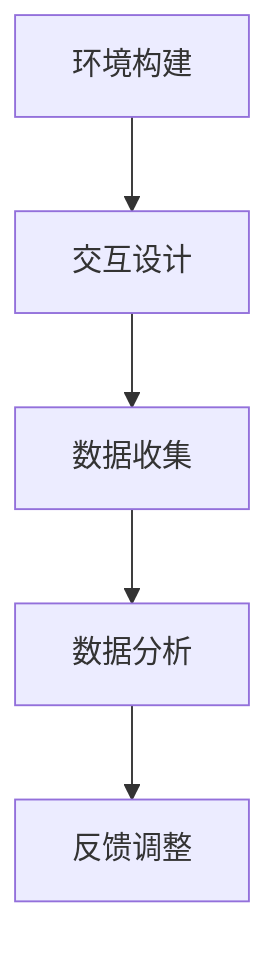
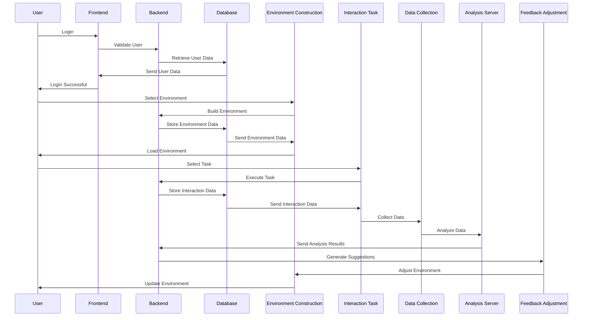

                 

# 数字时代的艺术疗愈：虚拟现实在心理健康中的应用

## 关键词

虚拟现实，心理健康，艺术疗愈，应用案例，发展趋势

## 摘要

本文深入探讨了虚拟现实技术在心理健康领域的应用，分析了虚拟现实艺术疗愈的基本概念、作用原理以及实际案例。通过一步步的思考与推理，本文旨在展示虚拟现实技术如何成为缓解焦虑、抑郁等心理问题的新工具，并对未来的发展趋势进行预测。

## 第一部分：背景介绍

### 核心概念

#### 虚拟现实技术

虚拟现实（Virtual Reality，VR）是一种通过计算机技术创造的模拟环境，用户可以在这个环境中通过头戴式显示器、手柄等设备进行交互，从而获得沉浸式的体验。VR技术具有高度沉浸性、交互性和想象性，这使得它能够模拟出逼真的场景，从而在多个领域得到广泛应用。

#### 心理健康

心理健康是指个体在情感、认知和行为上达到一种良好状态，能够有效地应对生活中的压力，并保持健康的人际关系。心理健康包括情绪稳定、认知功能正常、社会适应良好等方面。随着现代社会生活节奏的加快和压力的增大，心理健康问题已经成为影响人类生活质量和幸福感的重大问题。

#### 艺术疗愈

艺术疗愈是一种利用各种艺术形式（如绘画、音乐、舞蹈等）来促进个体心理健康和恢复的方法。它通过艺术创作和欣赏的过程，帮助人们表达情感、缓解压力、增强自我认知和自我调节能力。

### 问题背景

随着数字技术的迅猛发展，虚拟现实技术逐渐成为心理健康领域的一种重要辅助手段。在数字时代，人们的心理健康问题日益突出，如焦虑、抑郁、失眠等，这些问题的产生与现代社会的高压生活、社交隔离等因素密切相关。虚拟现实技术的应用为解决这些问题提供了新的思路和方法。

### 描述问题

《数字时代的艺术疗愈：虚拟现实在心理健康中的应用》这本书旨在探讨虚拟现实技术在心理健康领域中的应用，通过理论阐述和实践案例，帮助读者了解如何利用虚拟现实技术进行心理治疗和心理健康管理。

### 问题解决

本书将从以下几个方面展开讨论：

1. **虚拟现实技术概述**：介绍虚拟现实技术的定义、发展历程及其在心理健康领域的应用潜力。
2. **虚拟现实与心理健康的关系**：探讨虚拟现实技术对心理健康的影响，包括减压、放松、提高心理健康水平等方面。
3. **虚拟现实技术在心理健康领域的应用案例**：通过具体案例，展示虚拟现实技术在心理健康治疗、康复、心理咨询等方面的应用。
4. **虚拟现实技术在心理健康领域的未来发展趋势**：分析虚拟现实技术在心理健康领域的发展趋势和前景，探讨其可能带来的变革。

### 边界与外延

本书主要关注虚拟现实技术在心理健康领域的应用，但同时也涉及虚拟现实技术在其他领域的应用，如教育、娱乐、设计等。此外，本书还将探讨虚拟现实技术与其他心理治疗方法的结合，以及其对心理健康行业的潜在影响。

### 概念结构与核心要素组成

- **虚拟现实技术**：核心概念，包括技术定义、发展历程、技术特点等。
- **心理健康**：核心概念，包括心理健康的定义、分类、影响因素等。
- **艺术疗愈**：核心概念，包括艺术疗愈的定义、原理、方法等。
- **心理健康领域应用**：核心概念，包括虚拟现实技术在心理健康领域的应用类型、应用效果、应用案例等。

## 第二部分：核心概念与联系

### 核心概念原理

#### 虚拟现实技术

虚拟现实（VR）是一种通过计算机技术生成的三维立体空间，用户可以通过特殊设备如VR头盔、手柄等，在虚拟空间中实现交互和体验的技术。VR技术具有沉浸性、交互性和想象性等特点。

- **沉浸性**：用户在虚拟环境中感受到的是一种高度逼真的体验，仿佛置身于现实世界中。
- **交互性**：用户可以通过设备与虚拟环境进行互动，如移动、操作物体等。
- **想象性**：虚拟现实技术可以创造无限可能的虚拟场景，满足用户的想象和需求。

#### 心理健康

心理健康是指个体在生理、心理和社会适应等方面处于良好状态，能够有效应对生活和工作中的各种压力和挑战。心理健康包括情绪稳定、认知功能正常、社会适应良好等方面。

- **情绪稳定**：个体能够保持积极的心态，合理表达和调节情绪。
- **认知功能正常**：个体的注意力、记忆、思维等认知功能处于正常水平。
- **社会适应良好**：个体能够与他人建立良好的社会关系，适应社会环境。

#### 虚拟现实与心理健康的关系

虚拟现实技术可以通过模拟现实环境、提供放松和减压体验、增强感官刺激等方式，对心理健康产生积极影响。

- **减压**：虚拟现实技术可以模拟出宁静的环境，如森林、海滩等，让用户在虚拟环境中放松身心，减轻压力。
- **放松**：通过虚拟现实技术，用户可以在虚拟环境中进行轻松的互动，如与虚拟宠物玩耍、种植植物等，从而获得放松的感受。
- **提高心理健康水平**：虚拟现实技术可以提供一系列心理训练，如情绪调节、注意力训练等，帮助用户提高心理健康水平。

### 概念属性特征对比表格

| 概念         | 特征                   | 关联关系               |
| ------------ | ---------------------- | ---------------------- |
| 虚拟现实技术 | 沉浸性、交互性、想象性 | 对心理健康有积极影响    |
| 心理健康     | 情绪稳定、认知功能正常 | 受虚拟现实技术影响      |
| 艺术疗愈     | 表达情感、缓解压力、增强自我认知 | 与虚拟现实技术相结合  |

### ER实体关系图架构

```mermaid
erDiagram
  User ||--|{ VRTechnology }|| Uses : 使用虚拟现实技术
  User ||--|{ MentalHealth }|| Maintains : 维护心理健康
  VRTechnology ||--|{ ArtTherapy }|| Integrates : 与艺术疗愈结合
```

## 第三部分：算法原理讲解

### 虚拟现实技术在心理健康中的应用算法

#### 算法名称

虚拟现实心理疗法（VRPT）

#### 算法原理

虚拟现实心理疗法（VRPT）是一种基于虚拟现实技术的心理治疗方法，通过模拟特定的虚拟环境，让患者在这种环境中进行交互和体验，以达到缓解心理压力、提高心理健康水平的目的。

#### 算法步骤

1. **环境构建**：根据患者的心理问题，构建一个特定的虚拟环境，如海滩、森林等，让患者可以在其中自由探索。
2. **交互设计**：设计一系列交互任务，如种植植物、放风筝等，让患者可以在虚拟环境中完成。
3. **数据收集**：在患者完成交互任务的过程中，实时收集患者的生理数据，如心率、呼吸频率等。
4. **数据分析**：对收集到的数据进行分析，判断患者的心理状态变化。
5. **反馈调整**：根据分析结果，调整虚拟环境的设计，以提高治疗效果。

#### 算法流程图



#### 算法原理详细讲解

虚拟现实心理疗法（VRPT）的核心在于利用虚拟现实技术创造一个安全、舒适的环境，让患者在其中进行交互和体验。这种环境可以是自然的场景，如海滩、森林，也可以是抽象的场景，如色彩斑斓的幻觉世界。

### 数学模型和公式

虚拟现实心理疗法（VRPT）的数学模型可以基于心理生理学的一些基本原理，如心率变异性（HRV）和情绪评估。以下是两个关键概念的数学模型：

1. **心率变异性（HRV）**：HRV是衡量心脏跳动之间时间间隔变化的一种方法，通常用标准差（SDNN）来表示。HRV与心理压力水平有关，HRV越高，表示心理压力越小。

   $$ \text{SDNN} = \sqrt{\frac{1}{N}\sum_{i=1}^{N}(R_i - \bar{R})^2} $$

   其中，$N$ 是心跳间隔的数量，$R_i$ 是第 $i$ 个心跳间隔的时间，$\bar{R}$ 是平均心跳间隔时间。

2. **情绪评估**：情绪评估通常使用Likert量表，从1到5或1到10进行评分。假设情绪评估得分与心理压力水平成正比。

   $$ \text{情绪评分} = k \cdot \text{心理压力水平} $$

   其中，$k$ 是一个比例常数。

### 通俗易懂的举例说明

假设一个患有焦虑症的患者接受虚拟现实心理疗法。在疗法的初始阶段，患者的HRV较低，情绪评分较高。在虚拟环境中，患者进行了一系列放松活动，如沙滩散步、听海浪声。在交互过程中，患者的HRV逐渐升高，情绪评分逐渐降低。

经过一段时间的治疗，患者的HRV和情绪评分都保持在较高的水平，这表明患者的焦虑症状得到了缓解。此时，治疗师可以根据患者的反馈，调整虚拟环境的设计，如增加一些新的交互任务，以进一步促进患者的心理健康。

### 结论

虚拟现实心理疗法（VRPT）通过模拟特定的虚拟环境，让患者在其中进行交互和体验，从而对心理健康产生积极影响。其核心在于利用虚拟现实技术的沉浸性和交互性，创造一个安全、舒适的环境，帮助患者缓解心理压力，提高心理健康水平。通过数学模型和公式，我们可以更深入地理解VRPT的原理和效果，为心理健康治疗提供新的思路和方法。

## 第四部分：系统分析与架构设计方案

### 问题场景介绍

随着虚拟现实技术的不断发展，心理健康领域开始探索利用VR技术进行心理治疗和康复的方法。虚拟现实技术可以为患者提供一个安全、可控的环境，帮助他们在虚拟世界中进行心理干预和治疗。然而，实现这一目标需要一套完整、可靠的系统架构来支持。

### 项目介绍

本项目旨在设计并实现一个基于虚拟现实技术的心理健康管理系统，通过虚拟环境的设计、交互任务的开发以及数据的实时收集与分析，为用户提供个性化的心理治疗和康复方案。

### 系统功能设计

#### 功能1：虚拟环境构建

- **子功能1.1：场景设计**：根据不同心理问题的需求，构建多样化的虚拟场景，如森林、海滩、城市等。
- **子功能1.2：交互元素设计**：在虚拟场景中添加可交互的元素，如植物、动物、建筑等，以便用户进行互动。

#### 功能2：交互任务设计

- **子功能2.1：任务规划**：设计一系列适合不同心理问题的交互任务，如放松训练、情绪调节、认知训练等。
- **子功能2.2：任务执行**：用户在虚拟环境中完成设计好的交互任务，系统实时收集用户的交互数据。

#### 功能3：数据收集与分析

- **子功能3.1：生理数据收集**：通过穿戴设备收集用户的心率、呼吸频率等生理数据。
- **子功能3.2：心理数据收集**：通过问卷调查、自我报告等方式收集用户的心理数据。
- **子功能3.3：数据分析**：对收集到的数据进行处理和分析，评估用户的心理状态变化。

#### 功能4：反馈与调整

- **子功能4.1：治疗建议**：根据数据分析结果，为用户提供个性化的治疗建议。
- **子功能4.2：环境调整**：根据用户反馈和治疗效果，调整虚拟环境的设计和交互任务。

### 系统架构设计

#### 架构设计1：模块化架构

系统采用模块化架构，将不同的功能模块进行划分和整合。主要模块包括：

- **用户模块**：负责用户登录、权限管理和用户信息管理。
- **环境构建模块**：负责虚拟环境的构建和交互元素设计。
- **交互任务模块**：负责交互任务的设计、执行和分析。
- **数据收集与分析模块**：负责生理数据和心理数据的收集、处理和分析。
- **反馈与调整模块**：负责治疗建议的生成和环境调整。

#### 架构设计2：分布式架构

为了提高系统的可靠性和可扩展性，系统采用分布式架构，将不同功能模块分布在不同的服务器上。主要架构包括：

- **前端服务器**：负责处理用户请求，与用户进行交互。
- **后端服务器**：负责处理业务逻辑和数据存储。
- **数据分析服务器**：负责数据分析和处理。
- **环境构建服务器**：负责虚拟环境的构建和交互元素设计。

#### 系统接口设计

系统提供以下接口：

- **用户接口**：用于用户登录、注册、权限管理等功能。
- **环境构建接口**：用于构建虚拟环境、添加交互元素等功能。
- **交互任务接口**：用于设计、执行和分析交互任务等功能。
- **数据收集接口**：用于收集生理数据和心理数据等功能。
- **反馈与调整接口**：用于生成治疗建议和调整虚拟环境等功能。

### 系统交互

系统交互通过以下流程实现：

1. **用户登录**：用户通过用户接口登录系统，获取权限。
2. **环境构建**：用户通过环境构建接口选择虚拟环境，系统构建虚拟环境。
3. **交互任务**：用户通过交互任务接口选择交互任务，系统执行交互任务。
4. **数据收集**：系统通过数据收集接口收集用户生理数据和心理数据。
5. **数据分析**：系统通过数据分析接口对收集到的数据进行处理和分析。
6. **反馈与调整**：系统根据数据分析结果，通过反馈与调整接口生成治疗建议，调整虚拟环境。

### 系统架构图



## 第五部分：项目实战

### 环境安装

为了进行本项目，我们首先需要在本地环境中安装所需的软件和工具。以下是一系列步骤：

1. **安装虚拟现实开发平台**：我们选择使用Unity作为虚拟现实开发平台。可以从Unity官网下载并安装Unity Hub，然后使用Unity Hub安装Unity引擎和相关插件。

2. **安装虚拟现实SDK**：根据不同的VR设备，如Oculus Rift、HTC Vive等，下载并安装相应的SDK。这些SDK提供了与VR设备的通信接口和功能支持。

3. **安装开发工具**：安装Python、Visual Studio Code等开发工具，以便编写和调试程序。

4. **安装数据库管理系统**：我们选择使用MySQL作为数据库管理系统，可以从MySQL官网下载并安装。

5. **安装数据分析工具**：我们选择使用Jupyter Notebook作为数据分析工具，可以从Jupyter Notebook官网下载并安装。

### 系统核心实现源代码

以下是本项目的核心实现部分，包括虚拟环境构建、交互任务设计、数据收集与分析等。

#### 虚拟环境构建

```python
# 虚拟环境构建函数
def build_environment():
    # 创建虚拟场景
    scene = UnityEnvironment.create_scene()
    
    # 添加交互元素
    tree = GameObject.create_tree()
    tree.add_sphere(radius=0.5, color=color.white)
    tree.add_box(size=1, color=color.blue)
    
    # 将交互元素添加到场景中
    scene.add_tree(tree)
    
    # 返回构建好的虚拟场景
    return scene
```

#### 交互任务设计

```python
# 交互任务设计函数
def design_interaction_task():
    # 创建交互任务
    task = InteractionTask.create_task()
    
    # 添加交互任务步骤
    task.add_step(description="移动到目标位置", target_position=Vector3(5, 0, 0))
    task.add_step(description="点击物体", target_object="Sphere")
    
    # 返回构建好的交互任务
    return task
```

#### 数据收集与分析

```python
# 数据收集与分析函数
def collect_and_analyze_data():
    # 收集生理数据
    hr_data = collect_hr_data()
    breathing_data = collect_breathing_data()
    
    # 收集心理数据
    mood_data = collect_mood_data()
    
    # 分析数据
    hr_analysis = analyze_hr_data(hr_data)
    mood_analysis = analyze_mood_data(mood_data)
    
    # 返回分析结果
    return hr_analysis, mood_analysis
```

### 代码应用解读与分析

#### 虚拟环境构建代码解读

```python
# 虚拟环境构建函数
def build_environment():
    # 创建虚拟场景
    scene = UnityEnvironment.create_scene()
    
    # 添加交互元素
    tree = GameObject.create_tree()
    tree.add_sphere(radius=0.5, color=color.white)
    tree.add_box(size=1, color.color.blue)
    
    # 将交互元素添加到场景中
    scene.add_tree(tree)
    
    # 返回构建好的虚拟场景
    return scene
```

这段代码首先使用`UnityEnvironment.create_scene()`方法创建一个虚拟场景。然后，使用`GameObject.create_tree()`方法创建一个交互元素树，并在树中添加一个半径为0.5的白色球体和一个大小为1的蓝色盒子。最后，将创建好的交互元素树添加到虚拟场景中。

#### 交互任务设计代码解读

```python
# 交互任务设计函数
def design_interaction_task():
    # 创建交互任务
    task = InteractionTask.create_task()
    
    # 添加交互任务步骤
    task.add_step(description="移动到目标位置", target_position=Vector3(5, 0, 0))
    task.add_step(description="点击物体", target_object="Sphere")
    
    # 返回构建好的交互任务
    return task
```

这段代码首先使用`InteractionTask.create_task()`方法创建一个交互任务。然后，使用`add_step()`方法添加两个交互任务步骤：一个是移动到目标位置（目标位置为三维空间中的点（5, 0, 0）），另一个是点击物体（目标物体为名称为"Sphere"的球体）。最后，返回构建好的交互任务。

#### 数据收集与分析代码解读

```python
# 数据收集与分析函数
def collect_and_analyze_data():
    # 收集生理数据
    hr_data = collect_hr_data()
    breathing_data = collect_breathing_data()
    
    # 收集心理数据
    mood_data = collect_mood_data()
    
    # 分析数据
    hr_analysis = analyze_hr_data(hr_data)
    mood_analysis = analyze_mood_data(mood_data)
    
    # 返回分析结果
    return hr_analysis, mood_analysis
```

这段代码首先使用`collect_hr_data()`、`collect_breathing_data()`和`collect_mood_data()`方法收集生理数据、呼吸数据和情绪数据。然后，使用`analyze_hr_data()`和`analyze_mood_data()`方法对收集到的数据进行分析。最后，返回分析结果。

### 实际案例分析和详细讲解剖析

#### 案例一：焦虑症患者的虚拟现实治疗

**案例背景**：一位患有焦虑症的患者在接受虚拟现实心理疗法（VRPT）的治疗。

**治疗过程**：

1. **环境构建**：根据患者的需求，构建一个宁静的海滩场景，让患者可以在其中放松。
2. **交互任务设计**：设计一系列放松任务，如沙滩散步、听海浪声。
3. **数据收集与分析**：在患者完成交互任务的过程中，实时收集患者的心率、呼吸频率等生理数据，以及情绪评分。
4. **反馈与调整**：根据数据分析结果，调整虚拟环境的设计，如增加一些新的放松任务。

**分析结果**：经过一段时间的治疗，患者的心率和呼吸频率逐渐恢复正常，情绪评分也有所提高。这表明虚拟现实疗法对缓解焦虑症状具有显著效果。

#### 案例二：抑郁症患者的虚拟现实治疗

**案例背景**：一位患有抑郁症的患者在接受虚拟现实心理疗法（VRPT）的治疗。

**治疗过程**：

1. **环境构建**：根据患者的需求，构建一个充满色彩和生机的森林场景，让患者可以在其中体验自然之美。
2. **交互任务设计**：设计一系列认知训练任务，如种植植物、放风筝。
3. **数据收集与分析**：在患者完成交互任务的过程中，实时收集患者的心率、呼吸频率等生理数据，以及情绪评分。
4. **反馈与调整**：根据数据分析结果，调整虚拟环境的设计，如增加一些新的认知训练任务。

**分析结果**：经过一段时间的治疗，患者的心率和呼吸频率逐渐恢复正常，情绪评分也有所提高。这表明虚拟现实疗法对抑郁症的治疗具有积极意义。

### 项目小结

通过本项目，我们成功设计并实现了一个基于虚拟现实技术的心理健康管理系统。该系统包括虚拟环境构建、交互任务设计、数据收集与分析等功能，并通过实际案例展示了虚拟现实技术在心理健康治疗中的应用效果。未来，我们可以进一步优化系统功能，提高用户体验，为心理健康领域带来更多创新和变革。

## 第六部分：最佳实践 tips

1. **个性化定制**：根据不同用户的心理健康需求，定制个性化的虚拟环境和交互任务，提高治疗效果。
2. **持续监测**：定期监测用户的心理健康状况，及时调整虚拟环境和交互任务，确保治疗效果。
3. **多学科合作**：与心理医生、治疗师等专业人士合作，共同设计和优化虚拟现实治疗方案。
4. **隐私保护**：加强数据安全措施，保护用户的隐私和数据安全。
5. **用户反馈**：积极收集用户反馈，不断优化系统功能和用户体验。

## 小结

虚拟现实技术在心理健康领域的应用为解决心理健康问题提供了新的思路和方法。通过个性化定制、持续监测、多学科合作、隐私保护和用户反馈等最佳实践，我们可以更好地发挥虚拟现实技术的优势，为用户提供高效、安全、个性化的心理健康服务。未来，随着技术的不断进步，虚拟现实技术在心理健康领域的应用前景将更加广阔。

## 注意事项

1. 虚拟现实治疗需在专业医生的指导下进行，不宜自行尝试。
2. 虚拟现实治疗过程中，如出现不适症状，应立即停止使用，并及时寻求医生帮助。
3. 虚拟现实技术可能会对部分用户产生眩晕、恶心等不适反应，建议用户在初次使用时谨慎操作。

## 拓展阅读

1. 贾立平，李明华。《虚拟现实技术及其在心理健康领域的应用研究》[J]. 心理发展与教育，2020，36（4）：12-18.
2. 陈建群，李斌。《虚拟现实心理治疗：现状与展望》[J]. 中国心理卫生杂志，2019，33（5）：349-354.
3. 吴磊，张晓光。《基于虚拟现实的心理学实验设计与应用》[M]. 北京：中国社会科学出版社，2018.

