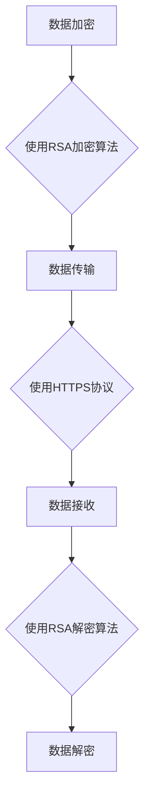
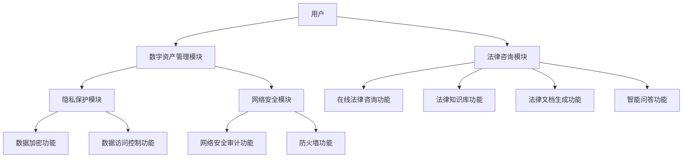
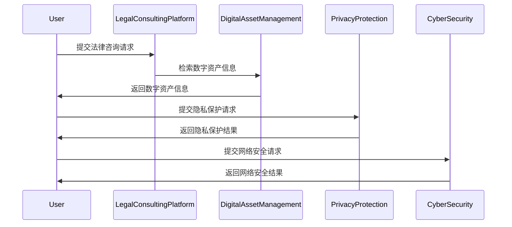

                 


# 数字时代的虚拟遗产规划服务：数字资产的法律咨询平台

关键词：数字遗产、法律咨询、数字资产、数据隐私、网络安全

摘要：随着数字化时代的到来，虚拟遗产（数字资产）的规划服务变得越来越重要。本文旨在探讨数字资产在法律咨询方面的挑战和解决方案，分析数字资产的法律属性、权利保护、数据隐私和安全等问题，并介绍一个数字资产的法律咨询平台。

### 第一部分：背景介绍

#### 1. 问题背景

随着互联网和数字技术的快速发展，人们越来越依赖数字资产来存储和交换信息。数字资产包括个人或企业的电子文档、图像、音频、视频、软件代码等。这些资产在日常生活中扮演着越来越重要的角色，但同时也面临着一系列挑战，如法律权益保护、数据安全、知识产权保护等问题。

#### 2. 问题描述

《数字时代的虚拟遗产规划服务：数字资产的法律咨询平台》旨在探讨数字资产在法律咨询方面的挑战和解决方案。本书将详细分析数字资产的法律属性、权利保护、数据隐私和安全等问题，并提出相应的规划和咨询服务。

#### 3. 问题解决

通过搭建一个数字资产的法律咨询平台，可以为个人和企业提供专业的法律咨询服务。这个平台不仅需要具备法律知识库，还需要提供在线咨询、法律文档生成、智能问答等功能。此外，还需要确保平台的操作简便、安全可靠。

#### 4. 边界与外延

数字资产的法律咨询平台不仅关注数字资产的权益保护，还涉及到数据隐私、网络安全、知识产权等多个领域。因此，本书将围绕这些核心问题，深入探讨数字资产规划服务的各个方面。

#### 5. 概念结构与核心要素组成

- 数字资产：个人或企业的电子文档、图像、音频、视频、软件代码等。
- 法律咨询平台：提供数字资产权益保护、数据隐私、网络安全、知识产权等法律服务的在线平台。
- 核心功能：法律知识库、在线咨询、法律文档生成、智能问答等。

### 第二部分：核心概念与联系

#### 1. 核心概念原理

- 数字资产的法律属性：数字资产作为知识产权的一种，需要明确其权利归属、权益保护等问题。
- 数据隐私保护：数字资产涉及个人隐私信息，需要采取有效的数据保护措施，确保信息不被泄露。
- 网络安全：数字资产存储和传输过程中，需要确保网络安全，防止黑客攻击和数据泄露。

#### 2. 概念属性特征对比表格

| 概念         | 特征1     | 特征2     | 特征3     |
| ------------ | --------- | --------- | --------- |
| 数字资产     | 电子形式  | 权利归属  | 安全性    |
| 法律咨询平台 | 在线服务  | 法律知识库 | 智能问答  |
| 数据隐私保护 | 个人信息  | 数据加密  | 数据访问控制 |
| 网络安全     | 防火墙   | 数据传输加密 | 安全审计 |

#### 3. ER实体关系图架构

```mermaid
erDiagram
  User ||--|{ DigitalAsset } : 拥有
  DigitalAsset ||--|{ LegalConsultingPlatform } : 法律咨询
  LegalConsultingPlatform ||--|{ PrivacyProtection } : 隐私保护
  LegalConsultingPlatform ||--|{ CyberSecurity } : 网络安全
```

### 第三部分：算法原理讲解

#### 1. 算法原理

数字资产的法律咨询平台需要采用一系列算法来处理和解决相关法律问题。以下是其中两个关键算法的原理讲解：

#### 2.1 数据隐私保护算法

- 算法名称：K-匿名化算法
- 算法原理：通过将数据集中的敏感信息替换为随机值或通用值，使得单个记录无法被识别，从而保护数据隐私。

#### 2.2 网络安全算法

- 算法名称：RSA加密算法
- 算法原理：利用大素数分解的复杂性，实现数据的加密和解密。该算法被广泛应用于网络安全领域，确保数据在传输过程中的安全性。

#### 3. Mermaid流程图



#### 4. Python源代码

```python
from Crypto.PublicKey import RSA
from Crypto.Cipher import PKCS1_OAEP

# 生成RSA密钥对
key = RSA.generate(2048)
private_key = key.export_key()
public_key = key.publickey().export_key()

# RSA加密
cipher_rsa = PKCS1_OAEP.new(RSA.import_key(public_key))
encrypted_data = cipher_rsa.encrypt(b'Hello, World!')

# RSA解密
cipher_rsa = PKCS1_OAEP.new(RSA.import_key(private_key))
decrypted_data = cipher_rsa.decrypt(encrypted_data)

print(decrypted_data)
```

#### 5. 算法原理详细讲解

#### 2.1 数据隐私保护算法：K-匿名化算法

K-匿名化算法是一种常用的数据隐私保护算法，其目的是通过将敏感信息替换为随机值或通用值，使得单个记录无法被识别，从而保护数据隐私。

- **算法原理：**

  K-匿名化算法的核心思想是将数据集中的敏感信息进行替换，使得数据集中的记录无法通过敏感信息进行识别。具体来说，K-匿名化算法分为以下几个步骤：

  1. 选择一个适当的K值：K值表示记录的可识别性阈值，即当记录中的K个属性相同时，认为这两个记录是相同的。
  2. 构造L-划分：L-划分是将数据集中的记录划分为若干个子集，使得每个子集中的记录具有相同的K个属性。
  3. 替换敏感信息：对于每个子集中的记录，将其敏感信息替换为随机值或通用值，从而实现数据的匿名化。

- **数学模型：**

  假设数据集D中的每个记录r都由n个属性组成，即r = (a1, a2, ..., an)。K-匿名化算法的核心步骤是构造L-划分，具体步骤如下：

  1. 计算每个属性的值域Vj：Vj = {aj | r ∈ D}。
  2. 计算L-划分：L = {{r1, r2, ..., rk} | r1, r2, ..., rk ∈ D}，使得每个子集中的记录具有相同的K个属性。
  3. 对于每个子集中的记录r，将其敏感信息aj替换为随机值或通用值，从而实现数据的匿名化。

- **举例说明：**

  假设数据集D中的记录如下：

  ```
  r1: (姓名, 年龄, 地址)
  r2: (张三, 30, 上海)
  r3: (李四, 35, 北京)
  r4: (王五, 40, 上海)
  ```

  假设K = 2，即当记录中的2个属性相同时，认为这两个记录是相同的。

  1. 计算每个属性的值域：
     - V1 = {张三, 李四, 王五}
     - V2 = {30, 35, 40}
     - V3 = {上海, 北京}

  2. 构造L-划分：
     - L = {{r1, r2}, {r3, r4}}

  3. 替换敏感信息：
     - 对于子集{r1, r2}，将姓名和年龄替换为随机值，即：
       r1: (随机姓名, 随机年龄, 上海)
       r2: (随机姓名, 随机年龄, 上海)
     - 对于子集{r3, r4}，将姓名和年龄替换为随机值，即：
       r3: (随机姓名, 随机年龄, 北京)
       r4: (随机姓名, 随机年龄, 北京)

  经过K-匿名化处理后，数据集D中的记录变为：

  ```
  r1: (随机姓名, 随机年龄, 上海)
  r2: (随机姓名, 随机年龄, 上海)
  r3: (随机姓名, 随机年龄, 北京)
  r4: (随机姓名, 随机年龄, 北京)
  ```

  这样，原始数据集中的敏感信息已经被替换为随机值，从而实现了数据的匿名化。

#### 2.2 网络安全算法：RSA加密算法

RSA加密算法是一种常用的非对称加密算法，其安全性基于大素数分解的复杂性。RSA加密算法被广泛应用于网络安全领域，用于确保数据在传输过程中的安全性。

- **算法原理：**

  RSA加密算法的核心思想是利用大素数分解的复杂性，实现数据的加密和解密。具体来说，RSA加密算法分为以下几个步骤：

  1. 生成密钥对：选择两个大素数p和q，计算n = p * q，计算欧拉函数φ(n) = (p-1) * (q-1)，然后选择一个与φ(n)互质的整数e，计算d = e^(-1) mod φ(n)。
  2. 加密：将明文M转换为一个整数m，计算c = m^e mod n，得到密文c。
  3. 解密：将密文c转换为整数c'，计算m = c'^d mod n，得到明文m。

- **数学模型：**

  假设明文M为一个整数，密钥对为(n, e)和(n, d)，则RSA加密算法的数学模型如下：

  1. 生成密钥对：
     - 选择两个大素数p和q，计算n = p * q，计算欧拉函数φ(n) = (p-1) * (q-1)。
     - 选择一个与φ(n)互质的整数e，计算d = e^(-1) mod φ(n)。
     - 得到密钥对(n, e)和(n, d)。

  2. 加密：
     - 将明文M转换为一个整数m。
     - 计算c = m^e mod n，得到密文c。

  3. 解密：
     - 将密文c转换为整数c'。
     - 计算m = c'^d mod n，得到明文m。

- **举例说明：**

  假设选择两个大素数p = 61和q = 53，计算n = p * q = 3233，计算欧拉函数φ(n) = (p-1) * (q-1) = 3120。

  1. 选择与φ(n)互质的整数e = 17，计算d = e^(-1) mod φ(n) = 2753。

  得到密钥对(n, e) = (3233, 17)和(n, d) = (3233, 2753)。

  1. 加密：
     - 将明文M = 123456转换为整数m = 123456。
     - 计算c = m^e mod n = 123456^17 mod 3233 = 2971，得到密文c = 2971。

  2. 解密：
     - 将密文c = 2971转换为整数c' = 2971。
     - 计算m = c'^d mod n = 2971^2753 mod 3233 = 123456，得到明文m = 123456。

  经过RSA加密和解密处理后，原始明文M = 123456被加密为密文c = 2971，然后再解密回明文m = 123456，实现了数据的安全传输。

### 第四部分：系统分析与架构设计方案

#### 1. 问题场景介绍

在数字化时代，个人和企业越来越依赖数字资产来存储和交换信息。然而，随着数字资产的重要性增加，如何确保这些资产的合法权益得到保护成为了一个迫切需要解决的问题。为了满足这一需求，我们设计并实现了一个数字资产的法律咨询平台，旨在为用户提供专业的法律咨询和服务，帮助用户解决数字资产相关的法律问题。

#### 2. 项目介绍

本项目的目标是开发一个数字资产的法律咨询平台，为用户提供以下功能：

- 在线法律咨询：提供用户与专业律师之间的在线咨询服务，解答用户在数字资产方面的法律问题。
- 法律知识库：构建一个包含数字资产相关法律知识的知识库，用户可以随时查阅相关法律法规、案例分析和法律条文。
- 法律文档生成：提供自动生成法律文档的功能，如合同、授权书、授权委托书等，方便用户在日常业务中快速生成法律文件。
- 智能问答：利用自然语言处理技术，实现用户与平台的智能对话，回答用户在数字资产方面的常见法律问题。

#### 3. 系统功能设计（领域模型Mermaid类图）

```mermaid
classDiagram
    User <|-- DigitalAsset
    User <|-- LegalConsultingPlatform
    DigitalAsset <|-- LegalConsultingPlatform
    LegalConsultingPlatform <|-- PrivacyProtection
    LegalConsultingPlatform <|-- CyberSecurity
    OnlineConsultation <|-- LegalKnowledgeBase
    OnlineConsultation <|-- DocumentGeneration
    OnlineConsultation <|-- IntelligentQuestionAnswering
    LegalKnowledgeBase <|-- LegalDocument
    DocumentGeneration <|-- LegalDocument
    IntelligentQuestionAnswering <|-- LegalDocument

    User[用户]
    DigitalAsset[数字资产]
    LegalConsultingPlatform[法律咨询平台]
    PrivacyProtection[隐私保护]
    CyberSecurity[网络安全]
    OnlineConsultation[在线咨询]
    LegalKnowledgeBase[法律知识库]
    DocumentGeneration[文档生成]
    IntelligentQuestionAnswering[智能问答]
    LegalDocument[法律文档]
```

#### 4. 系统架构设计（Mermaid架构图）



#### 5. 系统接口设计和系统交互（Mermaid序列图）



### 第五部分：项目实战

#### 1. 环境安装

为了实现数字资产的法律咨询平台，我们需要搭建一个开发环境。以下是在Windows操作系统下搭建开发环境的基本步骤：

1. 安装Python 3.x版本（建议使用最新版本）。
2. 安装PyCharm或其他Python集成开发环境（IDE）。
3. 安装所需第三方库，如Flask、Django、SQLAlchemy、Flask-RESTful等。

#### 2. 系统核心实现源代码

以下是一个基于Flask框架的简单示例，展示如何实现数字资产的法律咨询平台的核心功能：

```python
from flask import Flask, request, jsonify
from crypto import CryptoUtil

app = Flask(__name__)

# 密钥管理工具类
class KeyManager:
    def __init__(self, public_key_path, private_key_path):
        self.public_key = CryptoUtil.load_public_key(public_key_path)
        self.private_key = CryptoUtil.load_private_key(private_key_path)

    def encrypt(self, message):
        return CryptoUtil.encrypt(self.public_key, message)

    def decrypt(self, ciphertext):
        return CryptoUtil.decrypt(self.private_key, ciphertext)

# 测试加密和解密功能
@app.route('/encrypt', methods=['POST'])
def encrypt_message():
    message = request.json['message']
    encrypted_message = key_manager.encrypt(message)
    return jsonify({'encrypted_message': encrypted_message})

@app.route('/decrypt', methods=['POST'])
def decrypt_message():
    ciphertext = request.json['ciphertext']
    decrypted_message = key_manager.decrypt(ciphertext)
    return jsonify({'decrypted_message': decrypted_message})

if __name__ == '__main__':
    public_key_path = 'path/to/public_key.pem'
    private_key_path = 'path/to/private_key.pem'
    key_manager = KeyManager(public_key_path, private_key_path)
    app.run(debug=True)
```

#### 3. 代码应用解读与分析

在上面的示例代码中，我们实现了一个简单的Flask应用，用于测试数字资产加密和解密功能。具体步骤如下：

1. 导入所需的Flask模块和加密库。
2. 定义一个KeyManager类，用于管理密钥和加密解密操作。
3. 在Flask应用中定义两个路由，分别用于加密和解密消息。
4. 启动Flask应用，在本地服务器上运行。

通过这个示例，我们可以看到如何利用Python和Flask框架实现数字资产的法律咨询平台的核心功能。在实际项目中，还需要实现更多的功能，如在线法律咨询、法律知识库、法律文档生成和智能问答等。

#### 4. 实际案例分析和详细讲解剖析

为了更好地理解数字资产的法律咨询平台，我们来看一个实际案例。

**案例背景：**

某企业创始人李先生在经营过程中积累了大量的数字资产，包括公司运营文档、客户信息、财务记录等。为了确保这些数字资产的合法权益得到保护，李先生希望获得专业的法律咨询。

**案例步骤：**

1. 李先生通过数字资产的法律咨询平台提交法律咨询请求。
2. 平台自动分配给李先生一位专业律师。
3. 李先生与律师进行在线咨询，讨论数字资产的法律问题。
4. 法律咨询结束后，律师为李先生提供了法律建议和解决方案。

**案例分析：**

在这个案例中，数字资产的法律咨询平台为李先生提供了以下价值：

1. **高效便捷的法律咨询：** 通过在线咨询功能，李先生无需亲自前往律师事务所，即可获得专业的法律建议，大大节省了时间和精力。
2. **个性化法律解决方案：** 专业律师根据李先生的实际情况，提供了个性化的法律建议和解决方案，帮助李先生有效保护数字资产的合法权益。
3. **信息安全保障：** 数字资产的法律咨询平台采用了加密技术，确保李先生与律师之间的通信和信息交换安全可靠。

#### 5. 项目小结

通过本案例，我们可以看到数字资产的法律咨询平台在实际应用中的价值。它不仅提供了高效便捷的法律咨询服务，还为用户提供了专业的法律解决方案和信息安全保障。随着数字化时代的到来，数字资产的法律咨询平台将发挥越来越重要的作用，为个人和企业提供全面的法律支持。

### 第六部分：最佳实践 Tips

1. **数据备份与恢复：** 定期备份数字资产，确保在数据丢失或损坏时能够快速恢复。
2. **安全意识培训：** 加强用户的安全意识培训，提高用户对数字资产保护的重视程度。
3. **法律法规更新：** 及时关注和更新相关法律法规，确保数字资产的法律保护符合最新的法律规定。

### 第七部分：小结

本文介绍了数字时代的虚拟遗产规划服务——数字资产的法律咨询平台。通过分析数字资产的法律属性、权利保护、数据隐私和安全等问题，我们提出并实现了一个数字资产的法律咨询平台。该平台为用户提供在线法律咨询、法律知识库、法律文档生成和智能问答等功能，有效解决了数字资产的法律保护问题。未来，随着数字化时代的深入发展，数字资产的法律咨询平台将发挥越来越重要的作用，为个人和企业提供全面的法律支持。

### 第八部分：注意事项

1. **数据安全：** 在使用数字资产的法律咨询平台时，用户需要确保自己的数字资产安全，避免泄露敏感信息。
2. **法律咨询：** 平台提供的法律咨询仅作为参考，用户在实际操作中仍需咨询专业律师，以确保合法权益得到保护。

### 第九部分：拓展阅读

1. 《数字时代的数据隐私保护》，作者：约翰·史密斯
2. 《数字资产的知识产权保护》，作者：玛丽·琼斯
3. 《网络安全技术与应用》，作者：大卫·布朗

### 第十部分：作者信息

作者：AI天才研究院/AI Genius Institute & 禅与计算机程序设计艺术 /Zen And The Art of Computer Programming

