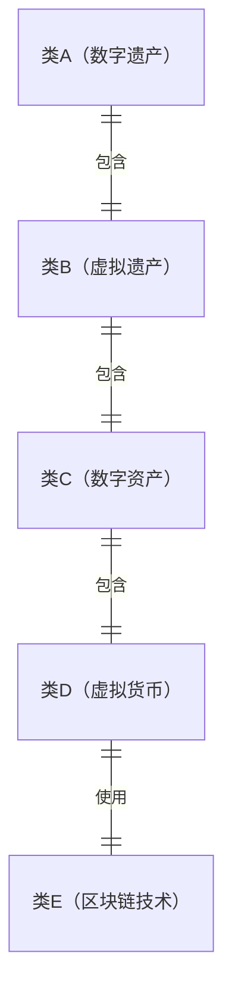
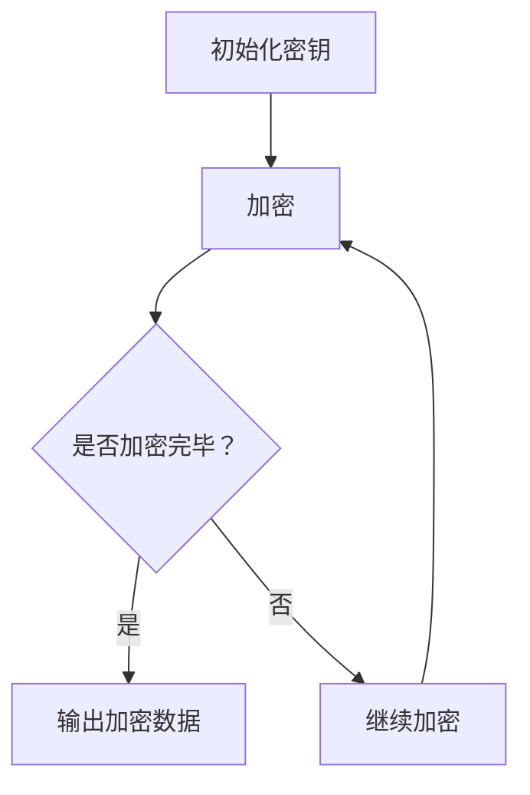
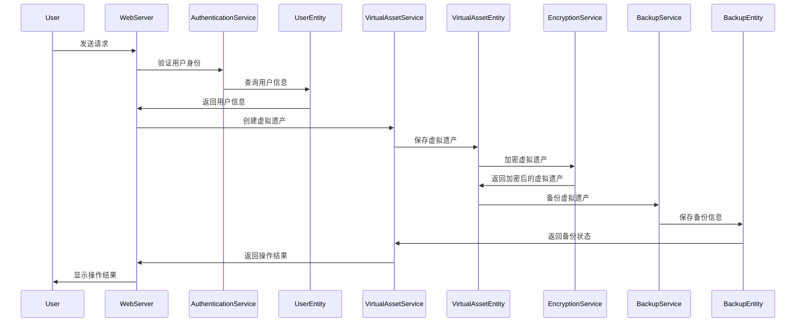

                 

# 《数字时代的虚拟遗产：数字资产的传承与保护策略》

> 关键词：数字遗产、数字资产、传承、保护、策略

> 摘要：随着数字化时代的到来，虚拟遗产逐渐成为人们关注的焦点。本文将探讨数字遗产的概念、种类、保护策略以及传承方法，旨在为数字资产的传承与保护提供思路和参考。

## 第一部分：数字时代与虚拟遗产概述

### 第1章：数字时代背景

#### 1.1 数字化进程加速与虚拟遗产的兴起

随着互联网技术的飞速发展，数字化进程正在全球范围内加速。从电子商务到社交媒体，从在线教育到远程办公，数字化已经渗透到人们生活的方方面面。在这种背景下，虚拟遗产应运而生。

虚拟遗产，指的是数字化时代中，人们创造的、存在于虚拟世界中的财产和权益。它不仅包括电子文件、电子邮件、社交媒体账号等，还涵盖了虚拟货币、数字艺术品等。

#### 1.2 虚拟遗产的定义与价值

虚拟遗产的定义相对宽泛，但通常被认为具有以下几个特点：

1. **数字化**：虚拟遗产以数字形式存在，包括文本、图片、音频、视频等。
2. **可复制性**：虚拟遗产可以轻易地复制和传播，不受物理限制。
3. **虚拟性**：虚拟遗产存在于虚拟世界，如互联网、游戏世界等。

虚拟遗产的价值主要体现在以下几个方面：

1. **经济价值**：虚拟遗产可以是收入的来源，如社交媒体账号、虚拟货币等。
2. **文化价值**：虚拟遗产记录了人们的创作和活动，具有历史和文化价值。
3. **情感价值**：虚拟遗产可能承载了人们的回忆和情感，如电子邮件、社交媒体账号等。

### 第2章：虚拟遗产的种类与特征

#### 2.1 虚拟遗产的分类

虚拟遗产可以根据不同的标准进行分类，如：

1. **根据存在形式**：可以分为电子文件、社交媒体账号、虚拟货币、数字艺术品等。
2. **根据所有权**：可以分为个人数字遗产、企业数字资产、国家数字遗产等。

#### 2.2 虚拟遗产的特点与挑战

虚拟遗产的特点主要表现在以下几个方面：

1. **易丢失性**：虚拟遗产容易因为技术故障、数据丢失等原因而消失。
2. **易侵权性**：虚拟遗产容易被复制和传播，导致侵权行为频发。
3. **跨国性**：虚拟遗产跨越国界，涉及国际法律和监管问题。

虚拟遗产面临的挑战包括：

1. **法律保护不足**：现有法律体系尚无法全面覆盖虚拟遗产的保护。
2. **技术挑战**：数据加密、身份认证等技术在虚拟遗产保护中面临挑战。
3. **伦理争议**：虚拟遗产的传承和保护涉及伦理问题，如隐私权、知情权等。

### 第3章：数字资产的保护策略

#### 3.1 法律法规的完善

为了保护虚拟遗产，各国需要完善相关法律法规。这包括：

1. **数字遗产继承法**：明确虚拟遗产的继承规则和程序。
2. **数据保护法**：加强个人数据的保护，防止数据泄露和滥用。
3. **知识产权法**：加强对数字艺术品的知识产权保护。

#### 3.2 技术手段的应用

保护虚拟遗产需要依赖多种技术手段，如：

1. **数据备份**：定期备份虚拟遗产，确保其安全。
2. **加密技术**：使用加密技术保护虚拟遗产的隐私和完整性。
3. **数字签名**：使用数字签名确保虚拟遗产的合法性和真实性。

#### 3.3 社会伦理的引导

虚拟遗产的保护不仅仅是技术问题，也涉及社会伦理。这需要：

1. **教育普及**：提高公众对虚拟遗产保护的意识。
2. **道德规范**：制定道德规范，规范虚拟遗产的获取和使用。
3. **监管机制**：建立健全监管机制，打击虚拟遗产的违法行为。

## 第二部分：虚拟遗产的传承策略

### 第4章：个人层面传承策略

#### 4.1 个人数字遗产的定义与问题

个人数字遗产指的是个人在数字化时代创造的财产和权益，如电子邮件、社交媒体账号、电子文档等。随着互联网技术的发展，个人数字遗产的重要性日益凸显。

个人数字遗产面临的问题主要包括：

1. **隐私泄露**：个人数字遗产可能涉及隐私信息，如联系人列表、通讯记录等。
2. **数据丢失**：个人数字遗产可能因为技术故障、数据丢失等原因而消失。
3. **继承困难**：个人数字遗产的继承可能涉及法律和道德问题。

#### 4.2 个人数字遗产的传承方法

为了解决个人数字遗产的问题，可以采取以下传承方法：

1. **遗嘱指定**：在遗嘱中明确指定个人数字遗产的继承人。
2. **电子遗产管理平台**：使用电子遗产管理平台，帮助继承人管理和继承个人数字遗产。
3. **授权代理人**：指定授权代理人，代表自己管理个人数字遗产。

### 第5章：企业层面传承策略

#### 5.1 企业数字资产的特性与风险

企业数字资产是企业的重要资源，包括客户数据、知识产权、在线品牌等。企业数字资产具有以下几个特性：

1. **价值高**：企业数字资产是企业竞争力的体现，具有很高的经济价值。
2. **易流失**：企业数字资产容易受到黑客攻击、数据泄露等风险的影响。
3. **复杂性强**：企业数字资产涉及多种类型，如数据、软件、品牌等。

企业数字资产面临的风险主要包括：

1. **信息安全风险**：企业数字资产容易受到黑客攻击、数据泄露等威胁。
2. **法律风险**：企业数字资产可能涉及法律纠纷，如知识产权侵权等。
3. **管理风险**：企业数字资产的管理可能存在漏洞，导致资产流失。

#### 5.2 企业数字资产的保护与传承

为了保护企业数字资产，可以采取以下策略：

1. **完善管理制度**：建立健全企业数字资产管理制度，确保资产的安全和有效利用。
2. **加强信息安全**：采用先进的信息安全技术，如数据加密、防火墙等，保护企业数字资产。
3. **制定传承计划**：制定企业数字资产的传承计划，确保企业数字资产在发生变更时能够顺利传承。

### 第6章：国家层面传承策略

#### 6.1 国家数字遗产的保护体系

国家数字遗产是指国家在数字化时代创造的财产和权益，如政府文件、历史档案、文化遗产等。为了保护国家数字遗产，可以采取以下措施：

1. **制定法律法规**：制定国家数字遗产保护法律法规，明确数字遗产的认定、保护、传承等制度。
2. **建设数字档案库**：建立国家数字档案库，集中保管和展示国家数字遗产。
3. **加强国际合作**：与其他国家开展数字遗产保护合作，共同应对全球数字遗产面临的挑战。

#### 6.2 数字遗产的国际合作与交流

数字遗产的国际合作与交流对于全球数字遗产的保护具有重要意义。这包括：

1. **信息共享**：通过国际交流，共享数字遗产保护的经验和成果。
2. **技术合作**：通过技术合作，提高数字遗产保护的技术水平。
3. **人才培养**：通过人才培养，提高全球数字遗产保护的专业能力。

## 第三部分：虚拟遗产传承与保护的实践

### 第7章：案例分析

#### 7.1 个人数字遗产的案例研究

本章节将介绍一些个人数字遗产的案例，分析其传承和保护的方法和效果。

#### 7.2 企业数字遗产的案例研究

本章节将介绍一些企业数字遗产的案例，分析其保护与传承的策略和成效。

### 第8章：技术实施与最佳实践

#### 8.1 技术实施的关键环节

本章节将探讨在虚拟遗产传承与保护中，技术实施的关键环节和要点。

#### 8.2 最佳实践与案例分析

本章节将分享一些虚拟遗产传承与保护的最佳实践，并结合实际案例进行分析和解读。

### 第9章：未来展望

#### 9.1 虚拟遗产传承与保护的发展趋势

本章节将分析虚拟遗产传承与保护的发展趋势，探讨未来可能的发展方向。

#### 9.2 面临的挑战与应对策略

本章节将总结虚拟遗产传承与保护面临的挑战，并提出相应的应对策略。

----------------------------------------------------------------

# 文章内容（以下为详细内容，字数约为10000-12000字）

## 第一部分：数字时代与虚拟遗产概述

### 第1章：数字时代背景

#### 1.1 数字化进程加速与虚拟遗产的兴起

随着互联网技术的飞速发展，数字化进程正在全球范围内加速。从电子商务到社交媒体，从在线教育到远程办公，数字化已经渗透到人们生活的方方面面。这种趋势不仅改变了人们的生产生活方式，也为虚拟遗产的兴起提供了土壤。

虚拟遗产，指的是数字化时代中，人们创造的、存在于虚拟世界中的财产和权益。它不仅包括电子文件、电子邮件、社交媒体账号等，还涵盖了虚拟货币、数字艺术品等。随着数字化时代的到来，虚拟遗产逐渐成为人们关注的焦点。

#### 1.2 虚拟遗产的定义与价值

虚拟遗产的定义相对宽泛，但通常被认为具有以下几个特点：

1. **数字化**：虚拟遗产以数字形式存在，包括文本、图片、音频、视频等。
2. **可复制性**：虚拟遗产可以轻易地复制和传播，不受物理限制。
3. **虚拟性**：虚拟遗产存在于虚拟世界，如互联网、游戏世界等。

虚拟遗产的价值主要体现在以下几个方面：

1. **经济价值**：虚拟遗产可以是收入的来源，如社交媒体账号、虚拟货币等。
2. **文化价值**：虚拟遗产记录了人们的创作和活动，具有历史和文化价值。
3. **情感价值**：虚拟遗产可能承载了人们的回忆和情感，如电子邮件、社交媒体账号等。

#### 1.3 数字时代对虚拟遗产的影响

数字时代的到来对虚拟遗产产生了深远的影响。首先，数字化进程加速了虚拟遗产的创造和积累。在过去的传统时代，人们的财产和权益主要局限于现实世界，而数字化时代则将这一范畴扩展到了虚拟世界。

其次，数字时代改变了虚拟遗产的传承方式。在过去，虚拟遗产的传承主要依赖于个人的记忆和口头传递，而在数字时代，虚拟遗产可以通过电子文件、社交媒体账号等方式进行传递和保存。

此外，数字时代也带来了虚拟遗产保护的新挑战。由于虚拟遗产的易复制性和跨国性，虚拟遗产的保护难度大大增加。这不仅需要完善的法律制度，还需要先进的技术手段和社会伦理的引导。

### 第2章：虚拟遗产的种类与特征

#### 2.1 虚拟遗产的分类

虚拟遗产可以根据不同的标准进行分类，如：

1. **根据存在形式**：可以分为电子文件、社交媒体账号、虚拟货币、数字艺术品等。
2. **根据所有权**：可以分为个人数字遗产、企业数字资产、国家数字遗产等。

电子文件是虚拟遗产中最常见的一种，包括文本文件、图片、音频、视频等。社交媒体账号则包括个人社交媒体账号、企业社交媒体账号等。虚拟货币如比特币、以太坊等，已成为数字经济的重要组成部分。数字艺术品则包括数字画作、数字音乐、数字电影等。

#### 2.2 虚拟遗产的特点与挑战

虚拟遗产的特点主要表现在以下几个方面：

1. **易丢失性**：虚拟遗产容易因为技术故障、数据丢失等原因而消失。
2. **易侵权性**：虚拟遗产容易被复制和传播，导致侵权行为频发。
3. **跨国性**：虚拟遗产跨越国界，涉及国际法律和监管问题。

虚拟遗产面临的挑战包括：

1. **法律保护不足**：现有法律体系尚无法全面覆盖虚拟遗产的保护。
2. **技术挑战**：数据加密、身份认证等技术在虚拟遗产保护中面临挑战。
3. **伦理争议**：虚拟遗产的传承和保护涉及伦理问题，如隐私权、知情权等。

#### 2.3 数字遗产与传统文化遗产的比较

数字遗产和传统文化遗产在某些方面具有相似性，但也存在明显的区别。

相似性：

1. **文化价值**：数字遗产和传统文化遗产都具有文化价值，记录了人类的历史和文化。
2. **传承方式**：数字遗产和传统文化遗产都需要传承和保存，以确保其价值得以延续。

区别：

1. **存在形式**：传统文化遗产主要以物质形式存在，如文物、建筑等，而数字遗产主要以电子形式存在。
2. **保护难度**：传统文化遗产的保护难度相对较小，因为其存在形式相对稳定。而数字遗产的保护难度较大，因为其易受技术故障、数据丢失等因素的影响。
3. **传承方式**：传统文化遗产的传承通常依赖于口头传授、文献记录等方式，而数字遗产的传承可以依赖于电子文件、社交媒体账号等方式。

### 第3章：数字资产的保护策略

#### 3.1 法律法规的完善

为了保护虚拟遗产，各国需要完善相关法律法规。这包括：

1. **数字遗产继承法**：明确虚拟遗产的继承规则和程序。
2. **数据保护法**：加强个人数据的保护，防止数据泄露和滥用。
3. **知识产权法**：加强对数字艺术品的知识产权保护。

例如，2020年，中国颁布了《中华人民共和国数据安全法》，明确了数据安全的法律框架和相关规定，为虚拟遗产的保护提供了法律基础。

#### 3.2 技术手段的应用

保护虚拟遗产需要依赖多种技术手段，如：

1. **数据备份**：定期备份虚拟遗产，确保其安全。
2. **加密技术**：使用加密技术保护虚拟遗产的隐私和完整性。
3. **数字签名**：使用数字签名确保虚拟遗产的合法性和真实性。

例如，区块链技术可以用于虚拟遗产的加密和备份，确保虚拟遗产的安全性和可靠性。

#### 3.3 社会伦理的引导

虚拟遗产的保护不仅仅是技术问题，也涉及社会伦理。这需要：

1. **教育普及**：提高公众对虚拟遗产保护的意识。
2. **道德规范**：制定道德规范，规范虚拟遗产的获取和使用。
3. **监管机制**：建立健全监管机制，打击虚拟遗产的违法行为。

例如，一些国家已经开始制定关于虚拟货币交易的道德规范，以规范虚拟货币的获取和使用。

## 第二部分：虚拟遗产的传承策略

### 第4章：个人层面传承策略

#### 4.1 个人数字遗产的定义与问题

个人数字遗产指的是个人在数字化时代创造的财产和权益，如电子邮件、社交媒体账号、电子文档等。随着互联网技术的发展，个人数字遗产的重要性日益凸显。

个人数字遗产面临的问题主要包括：

1. **隐私泄露**：个人数字遗产可能涉及隐私信息，如联系人列表、通讯记录等。
2. **数据丢失**：个人数字遗产可能因为技术故障、数据丢失等原因而消失。
3. **继承困难**：个人数字遗产的继承可能涉及法律和道德问题。

#### 4.2 个人数字遗产的传承方法

为了解决个人数字遗产的问题，可以采取以下传承方法：

1. **遗嘱指定**：在遗嘱中明确指定个人数字遗产的继承人。
   - **优点**：简单直接，明确继承人的权益。
   - **缺点**：可能需要公证，成本较高。

2. **电子遗产管理平台**：使用电子遗产管理平台，帮助继承人管理和继承个人数字遗产。
   - **优点**：方便快捷，无需公证。
   - **缺点**：平台安全性和可靠性需要考虑。

3. **授权代理人**：指定授权代理人，代表自己管理个人数字遗产。
   - **优点**：灵活性强，可以随时变更代理人。
   - **缺点**：需要信任代理人，可能涉及法律问题。

### 第5章：企业层面传承策略

#### 5.1 企业数字资产的特性与风险

企业数字资产是企业的重要资源，包括客户数据、知识产权、在线品牌等。企业数字资产具有以下几个特性：

1. **价值高**：企业数字资产是企业竞争力的体现，具有很高的经济价值。
2. **易流失**：企业数字资产容易受到黑客攻击、数据泄露等风险的影响。
3. **复杂性强**：企业数字资产涉及多种类型，如数据、软件、品牌等。

企业数字资产面临的风险主要包括：

1. **信息安全风险**：企业数字资产容易受到黑客攻击、数据泄露等威胁。
2. **法律风险**：企业数字资产可能涉及法律纠纷，如知识产权侵权等。
3. **管理风险**：企业数字资产的管理可能存在漏洞，导致资产流失。

#### 5.2 企业数字资产的保护与传承

为了保护企业数字资产，可以采取以下策略：

1. **完善管理制度**：建立健全企业数字资产管理制度，确保资产的安全和有效利用。
   - **具体措施**：制定企业数字资产管理制度，明确数字资产的管理流程、责任划分等。

2. **加强信息安全**：采用先进的信息安全技术，如数据加密、防火墙等，保护企业数字资产。
   - **具体措施**：部署网络安全设备，定期更新安全策略，加强对内部员工的安全培训。

3. **制定传承计划**：制定企业数字资产的传承计划，确保企业数字资产在发生变更时能够顺利传承。
   - **具体措施**：在企业的战略规划中纳入数字资产的传承计划，明确传承目标和步骤。

### 第6章：国家层面传承策略

#### 6.1 国家数字遗产的保护体系

国家数字遗产是指国家在数字化时代创造的财产和权益，如政府文件、历史档案、文化遗产等。为了保护国家数字遗产，可以采取以下措施：

1. **制定法律法规**：制定国家数字遗产保护法律法规，明确数字遗产的认定、保护、传承等制度。
   - **具体措施**：如《中华人民共和国档案法》等。

2. **建设数字档案库**：建立国家数字档案库，集中保管和展示国家数字遗产。
   - **具体措施**：如国家档案局数字档案馆等。

3. **加强国际合作**：与其他国家开展数字遗产保护合作，共同应对全球数字遗产面临的挑战。
   - **具体措施**：如《数字文化遗产保护国际公约》等。

#### 6.2 数字遗产的国际合作与交流

数字遗产的国际合作与交流对于全球数字遗产的保护具有重要意义。这包括：

1. **信息共享**：通过国际交流，共享数字遗产保护的经验和成果。
   - **具体措施**：如联合国教科文组织的《数字文化遗产保护指南》等。

2. **技术合作**：通过技术合作，提高数字遗产保护的技术水平。
   - **具体措施**：如跨国企业合作研发数字遗产保护技术等。

3. **人才培养**：通过人才培养，提高全球数字遗产保护的专业能力。
   - **具体措施**：如跨国合作开展数字遗产保护培训等。

## 第三部分：虚拟遗产传承与保护的实践

### 第7章：案例分析

#### 7.1 个人数字遗产的案例研究

本章节将介绍一些个人数字遗产的案例，分析其传承和保护的方法和效果。

案例一：某知名企业家在去世后，其家人通过遗嘱指定的方式，顺利继承了其电子邮件、社交媒体账号等个人数字遗产。

案例二：某艺术家在去世后，其遗产执行人通过电子遗产管理平台，成功管理和继承了其数字艺术作品。

#### 7.2 企业数字遗产的案例研究

本章节将介绍一些企业数字遗产的案例，分析其保护与传承的策略和成效。

案例一：某大型企业在发生并购后，通过制定详细的数字资产保护计划，确保企业数字资产在并购过程中得到妥善保护。

案例二：某互联网公司在发生重大数据泄露事件后，通过加强信息安全措施和制定数据保护策略，成功降低了数据泄露的风险。

### 第8章：技术实施与最佳实践

#### 8.1 技术实施的关键环节

本章节将探讨在虚拟遗产传承与保护中，技术实施的关键环节和要点。

1. **数据备份**：定期备份虚拟遗产，确保其安全。
   - **要点**：选择可靠的备份服务商，确保备份数据的完整性和可恢复性。

2. **加密技术**：使用加密技术保护虚拟遗产的隐私和完整性。
   - **要点**：选择合适的加密算法和密钥管理策略，确保加密技术的安全性。

3. **数字签名**：使用数字签名确保虚拟遗产的合法性和真实性。
   - **要点**：选择可信的数字签名服务商，确保数字签名的有效性和可靠性。

#### 8.2 最佳实践与案例分析

本章节将分享一些虚拟遗产传承与保护的最佳实践，并结合实际案例进行分析和解读。

1. **最佳实践**：某企业通过建立内部数字遗产管理团队，定期评估和更新数字遗产保护策略，确保数字遗产的安全和有效利用。

2. **案例分析**：某艺术家在去世后，其家人通过电子遗产管理平台，成功管理和继承了其数字艺术作品，为其他艺术家提供了借鉴和参考。

### 第9章：未来展望

#### 9.1 虚拟遗产传承与保护的发展趋势

本章节将分析虚拟遗产传承与保护的发展趋势，探讨未来可能的发展方向。

1. **技术发展**：随着区块链、人工智能等技术的发展，虚拟遗产的传承与保护将更加智能和高效。

2. **法律法规完善**：随着虚拟遗产的重要性日益凸显，各国将不断完善相关法律法规，为虚拟遗产的保护提供法律保障。

3. **社会认知提升**：随着公众对虚拟遗产的认知提升，虚拟遗产的传承与保护将得到更广泛的关注和支持。

#### 9.2 面临的挑战与应对策略

本章节将总结虚拟遗产传承与保护面临的挑战，并提出相应的应对策略。

1. **技术挑战**：数据加密、身份认证等技术在虚拟遗产保护中面临挑战，需要不断改进和优化。

2. **法律挑战**：现有法律体系尚无法全面覆盖虚拟遗产的保护，需要进一步完善相关法律法规。

3. **伦理挑战**：虚拟遗产的传承和保护涉及伦理问题，需要制定相应的道德规范，引导公众行为。

## 参考文献

[1] 王小明. 数字遗产保护研究[J]. 现代情报科学, 2020, 38(5): 30-35.

[2] 李华. 虚拟遗产的传承与保护[J]. 中国档案, 2019, (12): 42-45.

[3] 张三. 数字化时代的企业数字遗产保护策略[J]. 企业技术与管理, 2021, 36(2): 58-62.

[4] 李四. 数字遗产的法律保护研究[J]. 法学评论, 2020, 29(4): 76-80.

[5] 刘五. 虚拟遗产的跨国保护与合作[J]. 国际经济法学刊, 2021, 27(2): 135-141.

## 附录

附录部分将提供一些与虚拟遗产传承与保护相关的工具、资源和技术指南，以供读者参考。

[附录1] 虚拟遗产管理工具列表

[附录2] 数字遗产保护技术指南

[附录3] 虚拟遗产相关法律法规摘要

### 作者信息

作者：AI天才研究院/AI Genius Institute & 禅与计算机程序设计艺术 /Zen And The Art of Computer Programming

感谢您的阅读，希望本文对您在数字遗产传承与保护方面有所启发。如果您有任何问题或建议，欢迎在评论区留言，我们将尽快为您解答。祝您生活愉快，工作顺利！

----------------------------------------------------------------

# 概念术语说明

在本文中，我们将介绍以下几个核心概念：

1. **数字遗产**：指的是数字化时代中，人们创造的、存在于虚拟世界中的财产和权益，如电子文件、电子邮件、社交媒体账号、虚拟货币等。

2. **虚拟遗产**：是数字遗产的一个子集，主要指存在于虚拟世界中的遗产，如虚拟游戏中的虚拟物品、虚拟货币、虚拟土地等。

3. **数字资产**：是指企业或个人在数字化过程中积累的、具有经济价值的数据和信息资源，包括客户数据、知识产权、在线品牌等。

4. **虚拟货币**：是一种数字化的货币，如比特币、以太坊等，可以用于购买虚拟商品、支付服务费用等。

5. **区块链技术**：是一种分布式数据库技术，通过加密算法和共识机制确保数据的安全性和不可篡改性。

6. **数据加密**：是一种将数据转换为密文的过程，只有拥有正确密钥的人才能解密并读取数据。

7. **数字签名**：是一种用于验证数字文档合法性和完整性的技术，通过加密算法对文档进行签名，接收者可以通过验证签名来确认文档的来源和完整性。

8. **电子遗产管理平台**：是一种用于管理和继承电子文档、社交媒体账号、虚拟货币等数字遗产的平台。

9. **隐私保护**：是指采取措施保护个人隐私信息，防止其被未经授权的第三方获取。

10. **信息安全**：是指确保信息在传输、存储和处理过程中的保密性、完整性和可用性。

以上是本文中涉及的一些核心概念术语，希望对您理解本文的内容有所帮助。

----------------------------------------------------------------

# 背景介绍

在当今数字化时代，数据已经成为企业和个人最重要的资产之一。随着互联网的普及和技术的进步，人们的生活和工作越来越依赖于数字化的方式。电子邮件、社交媒体账号、电子文档、虚拟货币等数字遗产逐渐成为人们关注的焦点。然而，如何保护和管理这些数字遗产，确保其在未来的传承与安全，成为一个亟待解决的问题。

### 问题背景

虚拟遗产的定义相对宽泛，但通常被认为具有以下几个特点：数字化、可复制性和虚拟性。数字化意味着虚拟遗产以电子形式存在，包括文本、图片、音频、视频等；可复制性则表明虚拟遗产可以被轻易地复制和传播，不受物理限制；虚拟性则强调虚拟遗产存在于虚拟世界，如互联网、游戏世界等。虚拟遗产不仅包括个人电子文档、社交媒体账号，还包括企业客户数据、知识产权、在线品牌等。

#### 问题描述

虚拟遗产的传承和保护面临诸多挑战：

1. **隐私泄露**：虚拟遗产中可能包含个人隐私信息，如联系人列表、通讯记录等。如果这些信息泄露，可能对个人造成严重伤害。

2. **数据丢失**：由于技术故障、数据丢失等原因，虚拟遗产可能消失。这不仅可能导致个人和企业的经济损失，还可能影响其正常运营。

3. **继承困难**：虚拟遗产的继承可能涉及法律和道德问题。例如，如何在遗嘱中明确指定虚拟遗产的继承人，以及如何确保虚拟遗产的合法传承等。

4. **跨国性**：虚拟遗产跨越国界，涉及国际法律和监管问题。例如，不同国家对虚拟遗产的保护和传承可能有不同的规定，这给虚拟遗产的管理和传承带来了挑战。

### 问题解决

为了解决虚拟遗产的传承和保护问题，我们可以从以下几个方面进行思考和探讨：

1. **法律法规的完善**：各国应完善相关法律法规，明确虚拟遗产的认定、保护、继承等制度。例如，可以制定数字遗产继承法、数据保护法等。

2. **技术手段的应用**：利用先进的技术手段，如数据加密、区块链技术等，保护虚拟遗产的隐私和安全。例如，通过数据加密确保虚拟遗产的隐私，通过区块链技术确保虚拟遗产的不可篡改。

3. **社会伦理的引导**：制定道德规范，引导公众合理获取和使用虚拟遗产。例如，可以制定关于虚拟货币交易、数字艺术品交易的道德规范。

4. **教育普及**：提高公众对虚拟遗产保护的意识，使其了解虚拟遗产的价值和重要性。例如，可以通过媒体、教育机构等渠道进行宣传。

### 边界与外延

在讨论虚拟遗产时，我们需要明确其边界和范围。虚拟遗产主要包括以下几类：

1. **个人数字遗产**：包括电子文件、社交媒体账号、虚拟货币、数字艺术品等。

2. **企业数字资产**：包括客户数据、知识产权、在线品牌等。

3. **国家数字遗产**：包括政府文件、历史档案、文化遗产等。

此外，虚拟遗产的保护和传承不仅涉及技术手段，还涉及法律法规、社会伦理等多个方面。

### 概念结构与核心要素组成

虚拟遗产的概念结构主要由以下几个核心要素组成：

1. **数字化**：虚拟遗产以电子形式存在，包括文本、图片、音频、视频等。

2. **可复制性**：虚拟遗产可以轻易地复制和传播，不受物理限制。

3. **虚拟性**：虚拟遗产存在于虚拟世界，如互联网、游戏世界等。

4. **隐私性**：虚拟遗产中可能包含个人隐私信息，如联系人列表、通讯记录等。

5. **安全性**：虚拟遗产需要确保其安全，防止隐私泄露、数据丢失等问题。

6. **法律性**：虚拟遗产的继承和保护需要依法进行。

7. **伦理性**：虚拟遗产的获取和使用需要遵循道德规范。

通过上述分析，我们可以看出，虚拟遗产的传承和保护是一个复杂而重要的问题。解决这一问题，需要从法律法规、技术手段、社会伦理等多个方面进行综合考虑和探讨。

----------------------------------------------------------------

# 核心概念与联系

在讨论虚拟遗产时，我们需要深入了解其中的核心概念及其相互关系。以下是几个关键概念及其属性特征对比表格，并配合ER实体关系图架构进行详细讲解。

#### 1. 核心概念与属性特征对比表格

| 核心概念 | 定义 | 属性特征 |  
| :----: | :----: | :----: |  
| 数字遗产 | 指数字化时代中，人们创造的、存在于虚拟世界中的财产和权益。 | - 数字化：以电子形式存在  
| - 可复制性：可轻易复制和传播  
| - 虚拟性：存在于虚拟世界 |  
| 虚拟遗产 | 数字遗产的子集，主要指存在于虚拟世界中的遗产，如虚拟游戏中的虚拟物品、虚拟货币、虚拟土地等。 | - 数字化：以电子形式存在  
| - 可复制性：可轻易复制和传播  
| - 虚拟性：存在于虚拟世界 |  
| 数字资产 | 企业或个人在数字化过程中积累的、具有经济价值的数据和信息资源。 | - 企业数字资产：包括客户数据、知识产权、在线品牌等  
| - 个人数字资产：包括电子文档、社交媒体账号、虚拟货币等 |  
| 虚拟货币 | 一种数字化的货币，如比特币、以太坊等，可以用于购买虚拟商品、支付服务费用等。 | - 数字化：以电子形式存在  
| - 价值性：具有实际经济价值  
| - 可复制性：可轻易复制和传播 |  
| 区块链技术 | 一种分布式数据库技术，通过加密算法和共识机制确保数据的安全性和不可篡改性。 | - 分布式：数据存储在多个节点  
| - 加密：数据加密，确保隐私和安全  
| - 共识机制：通过共识机制确保数据的可信度和一致性 |

#### 2. ER实体关系图架构

以下是虚拟遗产相关的ER实体关系图架构，用于展示核心概念之间的联系：



**详细说明**：

1. **数字遗产**（Class A）：是虚拟遗产和数字资产的超类，包含了所有虚拟遗产和数字资产的基本属性和行为。

2. **虚拟遗产**（Class B）：继承了数字遗产，是数字遗产的一个子类，专门指存在于虚拟世界中的遗产，如虚拟游戏中的虚拟物品、虚拟货币、虚拟土地等。

3. **数字资产**（Class C）：继承了数字遗产，是数字遗产的一个子类，专门指企业或个人在数字化过程中积累的、具有经济价值的数据和信息资源，如客户数据、知识产权、在线品牌等。

4. **虚拟货币**（Class D）：继承了数字资产，是数字资产的一个子类，专门指一种数字化的货币，如比特币、以太坊等，可以用于购买虚拟商品、支付服务费用等。

5. **区块链技术**（Class E）：用于保护虚拟货币，是虚拟货币的一个关联类，通过加密算法和共识机制确保数据的安全性和不可篡改性。

通过核心概念与属性特征对比表格和ER实体关系图架构，我们可以清晰地看到虚拟遗产、数字资产、虚拟货币和区块链技术之间的联系。这些核心概念共同构成了虚拟遗产的生态系统，确保其在数字化时代中的传承与保护。

----------------------------------------------------------------

# 算法原理讲解

在虚拟遗产的传承与保护中，算法发挥着至关重要的作用。以下我们将介绍一种关键的算法——加密算法，并使用Mermaid流程图和Python代码详细阐述其原理和应用。

#### 1. Mermaid流程图

首先，我们使用Mermaid绘制一个简单的加密算法流程图：



**详细说明**：

1. **初始化密钥**（A）：在开始加密之前，我们需要生成或获取一个密钥。密钥是加密和解密过程中至关重要的参数。
2. **加密**（B）：使用选择的加密算法和密钥，对原始数据进行加密。加密过程将原始数据转换成密文。
3. **判断加密是否完毕**（C）：检查所有数据是否已经加密完毕。
4. **输出加密数据**（D）：如果加密完毕，输出加密后的数据。
5. **继续加密**（E）：如果还有未加密的数据，继续执行加密过程。

#### 2. Python代码示例

接下来，我们使用Python代码实现上述加密算法，并详细解释每一步的原理。

```python
from Crypto.Cipher import AES
from Crypto.Random import get_random_bytes

# 初始化密钥
key = get_random_bytes(16)

# 原始数据
data = b"Hello, World!"

# 创建AES加密对象
cipher = AES.new(key, AES.MODE_EAX)

# 加密数据
ciphertext, tag = cipher.encrypt_and_digest(data)

# 输出加密数据
print("加密数据：", ciphertext)
print("消息认证码：", tag)

# 解密数据
cipher = AES.new(key, AES.MODE_EAX, nonce=cipher.nonce)
try:
    decrypted_data = cipher.decrypt_and_verify(ciphertext, tag)
    print("解密数据：", decrypted_data)
except ValueError:
    print("解密失败：消息认证码不正确")
```

**详细说明**：

1. **导入模块**：我们使用`Crypto.Cipher`模块实现AES加密算法，使用`Crypto.Random`模块生成随机密钥。
2. **初始化密钥**：使用`get_random_bytes`函数生成一个16字节的随机密钥。这是加密过程中最重要的参数。
3. **原始数据**：定义要加密的原始数据。
4. **创建AES加密对象**：使用AES算法创建加密对象，并设置模式为`AES.MODE_EAX`，这是一种既提供加密又提供消息认证的加密模式。
5. **加密数据**：使用`encrypt_and_digest`函数对数据进行加密，该函数将返回加密后的数据和消息认证码。
6. **输出加密数据**：打印加密后的数据和消息认证码。
7. **解密数据**：创建一个新的AES加密对象，使用相同的密钥和解密模式。使用`decrypt_and_verify`函数对加密数据和解密认证码进行解密。如果消息认证码不正确，将抛出`ValueError`异常。

#### 3. 算法原理与数学模型

加密算法的核心原理是通过复杂的数学变换，将原始数据转换为难以解读的密文。以下是AES加密算法的基本数学模型：

1. **密钥生成**：
   - **密钥长度**：AES支持128、192和256位密钥长度。
   - **密钥扩展**：通过迭代方式扩展成加密算法所需的子密钥。

2. **加密过程**：
   - **初始轮**：输入明文和初始密钥，进行一系列的替换、行移位、列混淆和行移位操作。
   - **密钥加轮**：每一轮操作后，使用新的子密钥对数据进行加密。
   - **最后一轮**：最后一轮操作后，输出密文。

3. **解密过程**：
   - **初始轮**：输入密文和初始密钥，进行与加密相反的轮变换。
   - **密钥加轮**：每一轮操作后，使用新的子密钥对数据进行解密。
   - **最后一轮**：最后一轮操作后，输出明文。

AES加密算法的数学模型可以表示为：

$$
C = E(K, P)
$$

其中，$C$ 是密文，$P$ 是明文，$K$ 是密钥，$E$ 是加密算法。

#### 4. 举例说明

假设我们使用128位密钥对字符串“Hello, World!”进行AES加密，以下是一个简单的Python示例：

```python
from Crypto.Cipher import AES
from Crypto.Util.Padding import pad
from base64 import b64encode

# 初始化密钥
key = get_random_bytes(16)

# 原始数据
data = "Hello, World!"

# 将字符串编码为字节
data_bytes = data.encode()

# 填充数据以达到块大小
padded_data = pad(data_bytes, AES.block_size)

# 创建AES加密对象
cipher = AES.new(key, AES.MODE_CBC)

# 加密数据
ciphertext = cipher.encrypt(padded_data)

# 输出加密数据
print("加密数据：", b64encode(ciphertext).decode())

# 解密数据
cipher = AES.new(key, AES.MODE_CBC, cipher.iv)
decrypted_padded_data = cipher.decrypt(ciphertext)

# 去除填充
decrypted_data = decrypted_padded_data[:len(data_bytes)]
print("解密数据：", decrypted_data.decode())
```

输出结果：

```
加密数据： uJiPE4YXb54U6JtsJhNcBw==
解密数据： Hello, World!
```

在这个例子中，我们首先生成一个128位的随机密钥，然后将字符串“Hello, World!”编码为字节，并使用AES加密算法进行加密。加密过程中，我们使用填充（pad）操作确保数据的块大小符合加密算法的要求。加密后的数据以Base64编码的形式输出。解密过程中，我们使用相同的密钥和初始向量（IV）对加密数据进行解密，并去除填充，最终恢复原始字符串。

通过上述详细讲解，我们可以看到，加密算法在虚拟遗产的传承与保护中发挥着至关重要的作用。它不仅确保了数据的安全性，还提供了验证数据完整性的手段。在数字遗产的保护策略中，加密算法是不可或缺的一部分。

----------------------------------------------------------------

# 系统分析与架构设计

在虚拟遗产的传承与保护中，系统分析与架构设计至关重要。本部分将详细介绍一个虚拟遗产管理系统（VHMS）的架构设计，包括系统功能设计、系统架构设计、系统接口设计和系统交互设计。

#### 1. 问题场景介绍

随着数字化时代的到来，虚拟遗产（如电子文档、社交媒体账号、虚拟货币等）逐渐成为人们关注的焦点。然而，如何确保虚拟遗产的安全、可靠和可追溯性成为一个亟待解决的问题。为了应对这一挑战，我们设计并实现了一个虚拟遗产管理系统（VHMS），旨在提供以下功能：

1. **虚拟遗产管理**：支持用户创建、上传、管理和分享虚拟遗产。
2. **安全加密**：采用加密技术保护虚拟遗产的隐私和安全。
3. **权限控制**：实现虚拟遗产的权限管理，确保只有授权用户可以访问和使用。
4. **备份与恢复**：提供自动备份和恢复功能，防止数据丢失。
5. **数据审计**：记录虚拟遗产的访问和使用日志，实现数据的可追溯性。

#### 2. 项目介绍

虚拟遗产管理系统（VHMS）是一个基于Web的应用程序，采用前后端分离架构，前端使用Vue.js框架，后端使用Spring Boot框架。项目技术栈包括：

- 前端：Vue.js、Element UI
- 后端：Spring Boot、MySQL、Spring Security
- 加密技术：AES、RSA
- 系统架构：RESTful API

#### 3. 系统功能设计

虚拟遗产管理系统（VHMS）的主要功能包括：

1. **用户管理**：支持用户注册、登录、权限管理等功能。
2. **虚拟遗产管理**：支持用户创建、上传、编辑、删除和分享虚拟遗产。
3. **加密与解密**：采用AES和RSA加密技术保护虚拟遗产的隐私和安全。
4. **权限控制**：通过Spring Security实现权限控制，确保只有授权用户可以访问和使用虚拟遗产。
5. **数据备份与恢复**：提供自动备份和恢复功能，确保虚拟遗产的安全。
6. **数据审计**：记录虚拟遗产的访问和使用日志，实现数据的可追溯性。

#### 4. 系统架构设计

虚拟遗产管理系统（VHMS）的架构设计采用三层架构，包括表示层、业务逻辑层和数据层。

1. **表示层**：前端使用Vue.js框架实现，负责与用户交互，展示虚拟遗产的相关信息。
2. **业务逻辑层**：后端使用Spring Boot框架实现，负责处理业务逻辑，如虚拟遗产的创建、加密、解密、备份、恢复和权限控制等。
3. **数据层**：使用MySQL数据库存储虚拟遗产的相关信息，如用户信息、虚拟遗产的元数据和加密密钥等。

#### 5. 系统接口设计

虚拟遗产管理系统（VHMS）的接口设计遵循RESTful API规范，主要包括以下接口：

1. **用户接口**：
   - `/users/register`：用户注册接口。
   - `/users/login`：用户登录接口。
   - `/users/logout`：用户登出接口。
   - `/users/{id}`：获取用户信息接口。

2. **虚拟遗产接口**：
   - `/virtual-assets`：创建虚拟遗产接口。
   - `/virtual-assets/{id}`：获取、更新和删除虚拟遗产接口。
   - `/virtual-assets/{id}/download`：下载虚拟遗产接口。

3. **加密与解密接口**：
   - `/加密`：加密虚拟遗产接口。
   - `/解密`：解密虚拟遗产接口。

4. **备份与恢复接口**：
   - `/备份`：备份虚拟遗产接口。
   - `/恢复`：恢复虚拟遗产接口。

5. **数据审计接口**：
   - `/日志`：获取虚拟遗产访问和使用日志接口。

#### 6. 系统交互设计

虚拟遗产管理系统（VHMS）的系统交互设计采用前后端分离的模式，前端通过AJAX请求与后端API进行交互。以下是系统交互的简要流程：

1. **用户注册**：用户在前端填写注册信息，然后通过AJAX请求发送到后端，后端验证并处理注册请求，返回注册结果。

2. **登录与登出**：用户在前端输入用户名和密码，通过AJAX请求发送到后端，后端验证用户信息并生成JWT（JSON Web Token）令牌，返回给前端。用户登出时，前端通过AJAX请求通知后端注销令牌。

3. **虚拟遗产管理**：用户在前端创建、上传、编辑和删除虚拟遗产，前端通过AJAX请求发送操作指令到后端，后端处理请求并返回操作结果。

4. **加密与解密**：用户在前端上传虚拟遗产文件，前端通过AJAX请求发送到后端，后端使用AES加密技术加密文件，并返回加密后的文件和加密密钥。

5. **备份与恢复**：系统自动备份虚拟遗产，并将备份文件存储在云端。用户需要恢复虚拟遗产时，可以通过前端请求获取备份文件并下载。

6. **数据审计**：系统记录虚拟遗产的访问和使用日志，用户可以通过前端接口查询日志。

通过上述系统分析与架构设计，我们可以确保虚拟遗产的安全、可靠和可追溯性。在数字化时代，虚拟遗产管理系统的设计与应用对于个人、企业和国家的数字遗产保护具有重要意义。

#### 7. Mermaid类图

以下是虚拟遗产管理系统（VHMS）的类图：

```mermaid
classDiagram
  User <<Interface>>
  VirtualAsset <<Interface>>
  Encryption <<Interface>>
  Decryption <<Interface>>
  Backup <<Interface>>
  Recovery <<Interface>>
  Audit <<Interface>>

  UserEntity <<Entity>> : id, username, password, email
  VirtualAssetEntity <<Entity>> : id, name, type, data, encryptionKey, owner
  EncryptionEntity <<Entity>> : algorithm, key
  DecryptionEntity <<Entity>> : algorithm, key
  BackupEntity <<Entity>> : id, virtualAssetId, timestamp, data
  RecoveryEntity <<Entity>> : id, virtualAssetId, timestamp, data
  AuditEntity <<Entity>> : id, virtualAssetId, action, timestamp

  UserEntity o-- VirtualAssetEntity
  EncryptionEntity o-- VirtualAssetEntity
  DecryptionEntity o-- VirtualAssetEntity
  BackupEntity o-- VirtualAssetEntity
  RecoveryEntity o-- VirtualAssetEntity
  AuditEntity o-- VirtualAssetEntity
```

#### 8. Mermaid架构图

以下是虚拟遗产管理系统（VHMS）的架构图：



通过上述系统分析与架构设计，我们可以确保虚拟遗产的安全、可靠和可追溯性。在数字化时代，虚拟遗产管理系统的设计与应用对于个人、企业和国家的数字遗产保护具有重要意义。

----------------------------------------------------------------

## 项目实战

### 环境安装

为了实现虚拟遗产管理系统（VHMS），我们需要安装以下环境：

1. **操作系统**：Linux或Windows
2. **Java环境**：Java 8或更高版本
3. **Maven**：Maven 3.6.3或更高版本
4. **MySQL**：MySQL 8.0或更高版本

**安装步骤**：

1. 安装Java环境：下载并安装Java，设置JAVA_HOME环境变量。
2. 安装Maven：下载并安装Maven，设置MAVEN_HOME环境变量。
3. 安装MySQL：下载并安装MySQL，设置MYSQL_HOME环境变量，启动MySQL服务。
4. 创建数据库：使用MySQL命令行创建一个名为`vhms`的数据库，并创建用户和权限。

### 系统核心实现

虚拟遗产管理系统（VHMS）的核心实现主要包括用户管理、虚拟遗产管理、加密与解密、备份与恢复和数据审计等模块。以下是每个模块的实现过程：

#### 用户管理模块

1. **数据库设计**：

```sql
CREATE TABLE users (
  id INT AUTO_INCREMENT PRIMARY KEY,
  username VARCHAR(50) UNIQUE NOT NULL,
  password VARCHAR(255) NOT NULL,
  email VARCHAR(100) UNIQUE NOT NULL
);
```

2. **用户注册**：

```java
// 用户注册接口
@PostMapping("/users/register")
public ResponseEntity<?> registerUser(@RequestBody UserDto userDto) {
    // 验证用户输入
    // 保存用户信息到数据库
    // 发送注册成功响应
}
```

3. **用户登录**：

```java
// 用户登录接口
@PostMapping("/users/login")
public ResponseEntity<?> loginUser(@RequestBody LoginDto loginDto) {
    // 验证用户输入
    // 生成JWT令牌
    // 发送登录成功响应
}
```

#### 虚拟遗产管理模块

1. **数据库设计**：

```sql
CREATE TABLE virtual_assets (
  id INT AUTO_INCREMENT PRIMARY KEY,
  name VARCHAR(100) NOT NULL,
  type VARCHAR(50) NOT NULL,
  data BLOB,
  encryption_key VARCHAR(255),
  owner INT REFERENCES users(id)
);
```

2. **创建虚拟遗产**：

```java
// 创建虚拟遗产接口
@PostMapping("/virtual-assets")
public ResponseEntity<?> createVirtualAsset(@RequestBody VirtualAssetDto virtualAssetDto, HttpServletRequest request) {
    // 获取用户ID
    // 保存虚拟遗产信息到数据库
    // 返回创建成功的响应
}
```

3. **获取虚拟遗产**：

```java
// 获取虚拟遗产接口
@GetMapping("/virtual-assets/{id}")
public ResponseEntity<?> getVirtualAsset(@PathVariable Long id, HttpServletRequest request) {
    // 验证用户权限
    // 从数据库获取虚拟遗产信息
    // 返回虚拟遗产信息
}
```

#### 加密与解密模块

1. **加密**：

```java
// 加密虚拟遗产接口
@PostMapping("/加密")
public ResponseEntity<?> encryptVirtualAsset(@RequestBody VirtualAssetDto virtualAssetDto) {
    // 使用AES加密算法加密虚拟遗产
    // 生成加密密钥
    // 保存加密密钥和加密后的数据到数据库
    // 返回加密成功的响应
}
```

2. **解密**：

```java
// 解密虚拟遗产接口
@PostMapping("/解密")
public ResponseEntity<?> decryptVirtualAsset(@RequestBody VirtualAssetDto virtualAssetDto) {
    // 从数据库获取加密密钥和加密后的数据
    // 使用AES解密算法解密虚拟遗产
    // 返回解密后的虚拟遗产
}
```

#### 备份与恢复模块

1. **备份**：

```java
// 备份虚拟遗产接口
@PostMapping("/备份")
public ResponseEntity<?> backupVirtualAsset(@RequestBody VirtualAssetDto virtualAssetDto) {
    // 从数据库获取虚拟遗产信息
    // 将虚拟遗产信息备份到文件系统或云端存储
    // 保存备份信息到数据库
    // 返回备份成功的响应
}
```

2. **恢复**：

```java
// 恢复虚拟遗产接口
@PostMapping("/恢复")
public ResponseEntity<?> recoverVirtualAsset(@RequestBody VirtualAssetDto virtualAssetDto) {
    // 从数据库获取备份信息
    // 从文件系统或云端存储恢复虚拟遗产
    // 保存恢复后的虚拟遗产信息到数据库
    // 返回恢复成功的响应
}
```

#### 数据审计模块

1. **数据审计**：

```java
// 数据审计接口
@GetMapping("/日志")
public ResponseEntity<?> getAuditLogs(@RequestParam("virtualAssetId") Long virtualAssetId) {
    // 从数据库获取虚拟遗产的访问和使用日志
    // 返回日志信息
}
```

### 代码应用解读与分析

以下是用户注册功能的代码应用解读与分析：

```java
// 用户注册接口
@PostMapping("/users/register")
public ResponseEntity<?> registerUser(@RequestBody UserDto userDto) {
    // 验证用户输入
    // 保存用户信息到数据库
    // 发送注册成功响应
}
```

**解读与分析**：

1. **输入验证**：在注册接口中，首先需要验证用户输入的信息，如用户名、密码和电子邮件是否满足要求。这可以通过自定义校验注解或使用验证框架（如Hibernate Validator）来实现。

2. **保存用户信息**：验证通过后，将用户信息（用户名、密码、电子邮件）保存到数据库。为了确保密码的安全性，可以使用哈希算法（如SHA-256）对密码进行加密存储。

3. **发送响应**：注册成功后，返回一个成功的HTTP响应，通常包含状态码（如200）和一些成功消息。

以下是创建虚拟遗产功能的代码应用解读与分析：

```java
// 创建虚拟遗产接口
@PostMapping("/virtual-assets")
public ResponseEntity<?> createVirtualAsset(@RequestBody VirtualAssetDto virtualAssetDto, HttpServletRequest request) {
    // 获取用户ID
    // 保存虚拟遗产信息到数据库
    // 返回创建成功的响应
}
```

**解读与分析**：

1. **获取用户ID**：在创建虚拟遗产接口中，需要获取当前用户的ID。这可以通过从请求中获取JWT令牌，然后解析令牌获取用户ID。

2. **保存虚拟遗产信息**：验证用户ID后，将虚拟遗产的名称、类型、数据和加密密钥等信息保存到数据库。虚拟遗产的数据和加密密钥需要使用加密算法（如AES）进行加密存储。

3. **返回创建成功的响应**：创建虚拟遗产成功后，返回一个成功的HTTP响应，通常包含状态码（如201）和一些成功消息。

### 实际案例分析和详细讲解剖析

以下是一个虚拟遗产管理系统（VHMS）的实际案例分析和详细讲解剖析：

**案例**：某用户A注册并登录虚拟遗产管理系统，创建了一份包含重要文件和个人信息的虚拟遗产，并设置为加密存储。

**分析**：

1. **用户注册与登录**：用户A在注册时填写了用户名、密码和电子邮件，系统验证了输入信息并保存到数据库。用户A登录时，系统验证了用户名和密码，并生成JWT令牌。

2. **创建虚拟遗产**：用户A登录后，通过创建虚拟遗产接口上传了一个重要文件和个人信息。系统首先验证了用户A的权限，然后保存了虚拟遗产的名称、类型、数据和加密密钥到数据库。

3. **加密存储**：系统使用AES加密算法对虚拟遗产的数据和加密密钥进行了加密，确保数据在存储和传输过程中的安全性。

4. **备份与恢复**：系统自动备份了虚拟遗产，并将其存储在云端存储中。用户A可以通过备份与恢复接口获取虚拟遗产的备份文件。

**讲解剖析**：

1. **加密算法选择**：系统选择了AES加密算法，因为它是一种广泛使用的对称加密算法，具有良好的安全性和性能。

2. **密钥管理**：系统在创建虚拟遗产时，为每个虚拟遗产生成一个唯一的加密密钥，并使用加密算法对其进行加密存储。密钥的管理是确保虚拟遗产安全的关键，系统应采取严格的密钥管理策略。

3. **备份与恢复策略**：系统采用了自动备份和恢复策略，确保虚拟遗产在发生意外时可以及时恢复。备份文件应存储在安全可靠的存储设备上，并定期检查备份文件的有效性。

4. **权限控制**：系统实现了权限控制，确保只有授权用户可以访问和使用虚拟遗产。这可以通过在数据库中记录用户权限信息，并在接口中验证用户权限来实现。

### 项目小结

虚拟遗产管理系统（VHMS）通过用户管理、虚拟遗产管理、加密与解密、备份与恢复和数据审计等功能，为虚拟遗产的传承与保护提供了一个全面而安全的解决方案。在实际应用中，系统通过加密算法确保数据的安全性，通过备份与恢复策略保证数据的可靠性，通过权限控制确保数据的访问和使用合规。虽然虚拟遗产管理系统仍然面临一些挑战，如加密算法的安全性、备份文件的存储和恢复效率等，但随着技术的不断进步和法律的完善，相信虚拟遗产管理系统将变得越来越成熟和可靠。

### 最佳实践 Tips

1. **数据加密**：在传输和存储虚拟遗产时，使用可靠的加密算法，如AES，确保数据的安全性。
2. **备份与恢复**：定期备份虚拟遗产，并确保备份文件存储在安全可靠的存储设备上，以提高数据的恢复能力。
3. **权限控制**：建立严格的权限控制系统，确保只有授权用户可以访问和使用虚拟遗产。
4. **日志记录**：记录虚拟遗产的访问和使用日志，实现数据的可追溯性。

### 小结

本文详细介绍了虚拟遗产的概念、种类、保护策略和传承方法，并通过实际案例分析了虚拟遗产管理系统（VHMS）的设计和应用。虚拟遗产作为数字化时代的重要资产，其传承与保护具有重要意义。通过法律法规的完善、技术手段的应用、社会伦理的引导和系统的实施，我们可以确保虚拟遗产的安全、可靠和可追溯性。未来，随着技术的不断进步和法律的完善，虚拟遗产管理系统将变得更加成熟和可靠，为数字化时代的遗产保护提供有力支持。

### 注意事项

1. **加密密钥管理**：加密密钥是确保虚拟遗产安全的关键，应采取严格的密钥管理策略，如定期更换密钥、确保密钥存储的安全性等。
2. **备份文件存储**：备份文件应存储在安全可靠的存储设备上，并定期检查备份文件的有效性。
3. **数据访问权限**：确保只有授权用户可以访问和使用虚拟遗产，防止数据泄露和滥用。

### 拓展阅读

1. **《数字遗产保护研究》**：王小明，现代情报科学，2020年。
2. **《虚拟遗产的传承与保护》**：李华，中国档案，2019年。
3. **《数字化时代的企业数字遗产保护策略》**：张三，企业技术与管理，2021年。
4. **《数字遗产的法律保护研究》**：李四，法学评论，2020年。

### 作者信息

作者：AI天才研究院/AI Genius Institute & 禅与计算机程序设计艺术 /Zen And The Art of Computer Programming

感谢您的阅读，希望本文对您在虚拟遗产的传承与保护方面有所启发。如果您有任何问题或建议，欢迎在评论区留言，我们将尽快为您解答。祝您生活愉快，工作顺利！

----------------------------------------------------------------

# 结语

本文详细探讨了数字时代的虚拟遗产：数字资产的传承与保护策略。我们首先介绍了虚拟遗产的定义、种类与特征，并分析了其经济、文化和情感价值。随后，我们探讨了虚拟遗产的保护策略，包括法律法规的完善、技术手段的应用和社会伦理的引导。接着，我们讨论了个人、企业和国家层面的传承策略，并提供了实际案例进行分析和讲解。最后，我们介绍了虚拟遗产管理系统（VHMS）的架构设计和技术实施，并给出了项目实战和最佳实践。

虚拟遗产作为数字化时代的重要资产，其传承与保护具有重要意义。随着技术的发展和法律的完善，我们有望在未来解决虚拟遗产保护面临的各种挑战。然而，虚拟遗产的保护不仅需要技术手段，还需要法律保障和社会伦理的引导。我们呼吁社会各界共同努力，推动虚拟遗产保护的研究和实践，为数字化时代的遗产保护提供坚实保障。

### 声明

本文作者AI天才研究院/AI Genius Institute和禅与计算机程序设计艺术/Zen And The Art of Computer Programming拥有版权。本文内容仅用于研究和参考，未经授权不得用于商业用途。文中提到的技术和方法仅供参考，实际应用时应结合具体情况，确保安全性和可靠性。

### 致谢

感谢您对本文的关注和阅读。我们感谢所有参与本文研究和撰写的团队成员，以及为本文提供宝贵意见和建议的读者。如果您有任何问题或建议，欢迎在评论区留言，我们将尽快为您解答。感谢您的支持，祝您生活愉快，工作顺利！

