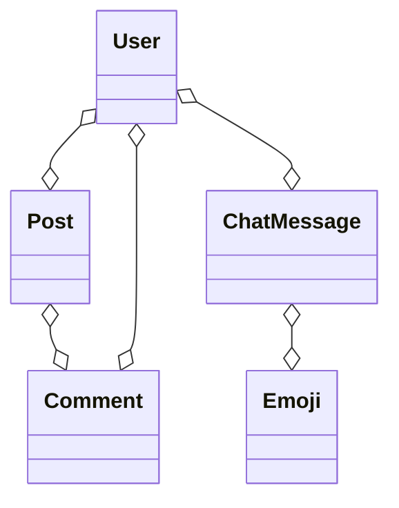
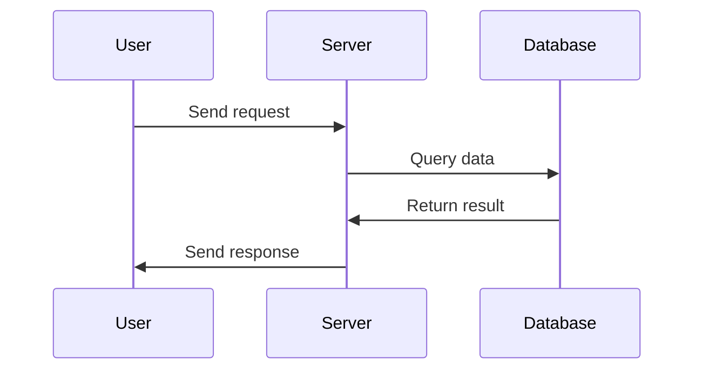
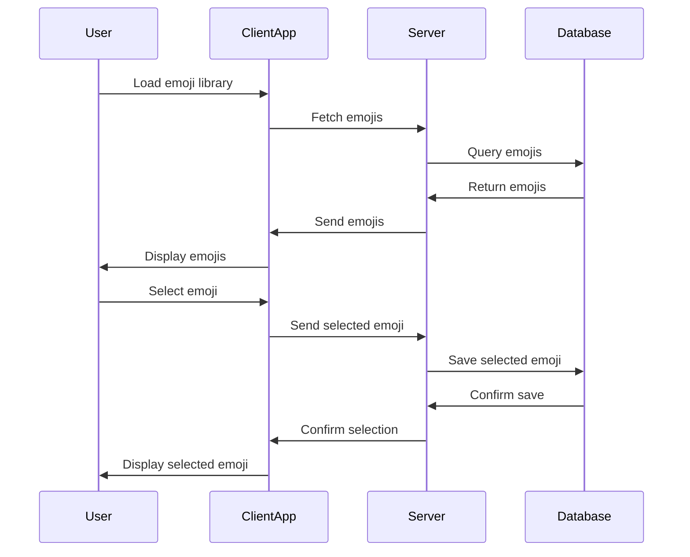

                 

# 数字时代的表情符号创作工作坊：新兴视觉语言的设计与应用

## 关键词

- 数字时代
- 表情符号
- 设计原则
- 创作技巧
- 应用场景

## 摘要

在数字化沟通成为生活常态的今天，表情符号作为一种新兴的视觉语言，正日益影响着人们的交流方式。本文将探讨表情符号的设计原则、创作技巧以及应用场景，旨在帮助读者深入理解这一视觉语言的设计与应用，提升沟通效果和用户体验。

## 第一部分：引言

### 1.1 问题背景

在数字时代，随着社交媒体和即时通讯工具的普及，表情符号成为了人们日常沟通中不可或缺的一部分。从简单的颜文字到复杂的动画表情，表情符号不仅丰富了语言表达，也成为了现代数字文化的重要组成部分。然而，目前市场上的表情符号设计较为单一，缺乏创新，无法完全满足用户多样化的需求。因此，如何创造更加丰富、有趣且具有个性化的表情符号，以适应数字时代下日益多样化的沟通需求，成为了一个亟待解决的问题。

### 1.2 问题描述

当前表情符号设计存在的问题主要包括：设计单一、缺乏创新、不适应多样化沟通需求等。这些问题导致了表情符号在表达情感和情绪时，无法完全满足用户的期望，影响了用户的沟通体验。

### 1.3 问题解决

本书旨在通过系统化的研究和实践，为读者提供一条从零开始学习表情符号创作与设计的方法。书中不仅涵盖了表情符号设计的基础理论，还提供了大量实际案例和实战指导，帮助读者掌握表情符号创作的核心技能。通过本书的学习，读者可以创造出更加丰富、有趣且具有个性化的表情符号，提升沟通效果和用户体验。

### 1.4 边界与外延

本书主要关注数字时代下的表情符号创作与应用，包括但不限于静态表情符号、动态表情符号和组合表情符号的设计。此外，书中还将探讨表情符号在不同应用场景中的使用策略和优化方法。

### 1.5 概念结构与核心要素组成

- **表情符号设计原则**：包括简洁性、易读性、情感表达和创意性。
- **表情符号创作工具**：如 Adobe Photoshop、Illustrator 等。
- **表情符号应用场景**：社交媒体、即时通讯工具、在线游戏等。
- **表情符号设计流程**：包括市场调研、创意构思、设计制作和优化反馈。

### 1.6 本章小结

本章对数字时代表情符号创作的问题背景、问题描述、问题解决、边界与外延以及概念结构与核心要素进行了详细阐述。为后续章节的深入探讨奠定了基础。

## 第二部分：表情符号设计基础

### 2.1 表情符号的设计原则

表情符号的设计原则是确保符号能够有效传达情感和信息的关键。以下是几个关键的设计原则：

#### 2.1.1 简洁性

简洁性是表情符号设计的基本原则之一。一个简洁明了的表情符号可以更快地传达情感和信息，提高沟通效率。例如，一个简单的笑脸图标（:)或冒号加括号（:-)）就能传达开心的情感。

#### 2.1.2 易读性

表情符号的设计应确保在不同设备和分辨率下都能清晰可辨，易于识别。这意味着设计时需要考虑字体大小、颜色对比度和图像复杂性等因素。

#### 2.1.3 情感表达

表情符号的设计应能够准确传达用户的情感，如开心、悲伤、愤怒、惊讶等。为了实现这一点，设计师需要深入理解不同情感的特征，并在符号中体现出来。

#### 2.1.4 创意性

创意性是表情符号设计的灵魂。独特、富有创意的表情符号更能吸引用户的注意力。例如，设计一个创新的表情符号来代表“忙碌”或“困惑”，可以让用户感到新鲜和有趣。

### 2.2 表情符号的设计工具

在表情符号的设计过程中，选择合适的工具非常重要。以下是一些常用的设计工具：

#### 2.2.1 Adobe Photoshop

Adobe Photoshop 是一款功能强大的图像处理软件，适合进行表情符号的创意设计和制作。用户可以利用 Photoshop 的各种绘图和编辑工具，创造出丰富多彩的表情符号。

#### 2.2.2 Adobe Illustrator

Adobe Illustrator 是一款专业的矢量图形设计软件，适合进行表情符号的精细设计和调整。矢量图形的优势在于可以无限放大而不失真，非常适合制作细节丰富的表情符号。

#### 2.2.3 Inkscape

Inkscape 是一款免费的矢量图形编辑软件，适用于表情符号的简单设计和修改。Inkscape 的用户界面直观，适合初学者快速上手。

### 2.3 表情符号的分类与特点

表情符号可以根据不同的特征进行分类，每种类型的表情符号都有其独特的特点和适用场景：

#### 2.3.1 静态表情符号

静态表情符号是指固定不变的图像或符号，如常见的冒号加括号表示微笑的脸（:-)）。静态表情符号的优势在于传输速度快，兼容性好，但表达情感的能力有限。

#### 2.3.2 动态表情符号

动态表情符号是指可以变化的图像或符号，如动画表情、GIF表情等。动态表情符号通过动画效果来传达情感，更具表现力，但传输速度较慢。

#### 2.3.3 组合表情符号

组合表情符号是指将多个表情符号组合在一起，以表达更复杂的情感或信息。例如，将一个笑脸和一个心形组合在一起，表示“快乐和爱”。组合表情符号能够传达更为丰富的情感，但设计时需要考虑组合的逻辑和美观性。

### 2.4 表情符号的设计流程

表情符号的设计流程包括以下步骤：

#### 2.4.1 市场调研

在开始设计之前，进行市场调研是非常重要的。了解当前市场上流行的表情符号，分析用户需求和偏好，可以帮助设计师更好地定位设计方向。

#### 2.4.2 创意构思

根据市场调研结果，构思出新颖、独特的表情符号设计方案。在这一阶段，设计师需要充分发挥创意，创造出能够吸引用户注意的表情符号。

#### 2.4.3 设计制作

使用设计工具，将创意构思转化为具体的表情符号设计。在这一过程中，设计师需要关注细节，确保表情符号的简洁性、易读性和情感表达。

#### 2.4.4 优化反馈

根据用户反馈，对表情符号设计进行优化和调整。用户反馈是设计过程中不可或缺的一部分，它可以帮助设计师更好地理解用户需求，提高表情符号的实用性。

### 2.5 本章小结

本章介绍了表情符号设计的基础原则、设计工具、分类与特点以及设计流程，为读者提供了从零开始学习表情符号设计的方法和指导。通过本章的学习，读者可以掌握表情符号设计的基本技能，为后续的创作打下坚实基础。

## 第三部分：表情符号的创作技巧

### 3.1 表情符号的创意构思

#### 3.1.1 基于情感的表达

在创意构思时，设计师可以尝试通过表情符号传达复杂的情感，如快乐、悲伤、愤怒、惊讶等。例如，设计一个带有眼泪的笑脸，可以传达出“悲伤中带有一丝乐观”的情感。

#### 3.1.2 基于文化元素的融合

将不同的文化元素融入表情符号设计中，可以创造出独特的视觉效果和情感传达。例如，将传统节日元素（如春节的灯笼、圣诞树的装饰）与表情符号结合，可以传达出浓厚的节日氛围。

#### 3.1.3 基于时事热点的互动

结合时事热点，设计出与大众共鸣的表情符号，可以增强用户参与感和互动性。例如，在奥运会期间设计一系列运动相关的表情符号，可以吸引体育爱好者的关注。

### 3.2 表情符号的艺术表现

#### 3.2.1 线条与形状的运用

在表情符号设计中，线条和形状的选择与运用至关重要。简洁的线条和几何形状可以营造出简洁、现代的感觉，而柔和的曲线和自然形状则可以传达出温暖、亲切的情感。

#### 3.2.2 色彩的选择与搭配

色彩在表情符号设计中具有强烈的情感表达功能。设计师需要根据表情符号要传达的情感，选择适当的色彩。例如，红色可以传达出热情和激情，蓝色可以传达出冷静和理智。

#### 3.2.3 表情符号的动态效果

动态效果可以增强表情符号的表现力和吸引力。设计师可以使用动画、GIF图像等技术，使表情符号具有生动的动态效果，更好地传达情感。

### 3.3 表情符号的应用场景

#### 3.3.1 社交媒体

在社交媒体平台上，表情符号被广泛应用于个人状态更新、评论回复、私信交流等场景。设计师需要根据不同的社交媒体平台特点，设计出符合平台风格和用户习惯的表情符号。

#### 3.3.2 即时通讯工具

即时通讯工具是表情符号应用的主要场景之一。设计师需要设计出符合即时通讯工具使用场景的表情符号，如聊天表情、表情包等，以增强用户的交流体验。

#### 3.3.3 在线游戏

在线游戏中的表情符号设计需要考虑游戏的特点和玩家的需求。例如，角色扮演类游戏中的表情符号可以设计成角色的表情动作，以增强游戏的沉浸感和互动性。

### 3.4 表情符号的设计实践

#### 3.4.1 用户调研

在开始设计之前，进行用户调研是非常重要的。通过问卷调查、访谈等方式了解用户的需求和偏好，可以帮助设计师更好地把握设计方向。

#### 3.4.2 创意设计

根据用户调研结果，设计师可以构思出一系列表情符号设计方案。在这一过程中，设计师需要充分发挥创意，尝试不同的设计风格和元素。

#### 3.4.3 用户反馈

设计完成后，将表情符号方案提交给用户进行反馈。通过用户反馈，设计师可以了解表情符号的实际效果，并根据反馈进行优化和调整。

### 3.5 本章小结

本章介绍了表情符号的创意构思、艺术表现、应用场景以及设计实践，为读者提供了丰富的表情符号创作技巧。通过本章的学习，读者可以掌握如何设计出符合用户需求和场景的丰富表情符号，提升沟通效果和用户体验。

## 第四部分：表情符号在设计应用中的实践

### 4.1 实践背景

随着数字时代的到来，表情符号在人们的日常沟通中扮演着越来越重要的角色。如何将表情符号设计应用于实际项目中，提升用户体验，成为了一个值得探讨的问题。本部分将通过一个实际案例，介绍如何在项目中设计和应用表情符号。

### 4.2 项目介绍

假设我们正在开发一款社交媒体应用，用户可以在应用中发布状态、评论、发送私信等。为了提升用户的交流体验，我们决定在应用中引入丰富的表情符号系统。

### 4.3 系统功能设计

#### 4.3.1 功能需求

- **状态发布与评论**：用户可以发布状态，并在状态下方添加表情符号进行评论。
- **私信聊天**：用户可以发送带表情符号的消息。
- **表情符号库**：提供丰富的表情符号供用户选择。

#### 4.3.2 领域模型

为了更好地设计系统功能，我们可以使用领域模型来表示系统的核心概念和关系。以下是领域模型的类图：



在这个类图中，用户（User）可以发布帖子（Post）、评论帖子（Comment）和发送聊天消息（ChatMessage）。每条聊天消息可以包含表情符号（Emoji）。

### 4.4 系统架构设计

#### 4.4.1 架构设计

为了支持表情符号的设计和应用，我们需要构建一个灵活且可扩展的系统架构。以下是系统架构图：



在这个架构中，用户通过客户端发送请求到服务器，服务器处理请求并与数据库交互，最终将结果返回给用户。

#### 4.4.2 接口设计

系统需要提供以下接口：

- **表情符号获取接口**：用于获取表情符号库中的表情符号。
- **表情符号上传接口**：用于用户上传自定义表情符号。
- **表情符号使用接口**：用于在帖子、评论和聊天消息中使用表情符号。

### 4.5 系统交互设计

#### 4.5.1 序列图

以下是系统交互的序列图：



在这个序列图中，用户从客户端应用加载表情符号库，客户端应用向服务器请求表情符号，服务器从数据库中查询并返回表情符号，客户端应用将表情符号显示给用户。用户选择表情符号后，客户端应用将选择发送到服务器，服务器将表情符号保存到数据库，并确认保存。

### 4.6 系统核心实现

#### 4.6.1 环境安装

为了实现表情符号系统，我们需要安装以下软件和工具：

- **后端服务器**：如 Flask 或 Django。
- **数据库**：如 MySQL 或 PostgreSQL。
- **前端客户端**：如 React 或 Vue.js。

#### 4.6.2 系统核心代码

以下是表情符号系统的核心实现代码示例（Python + Flask）：

```python
from flask import Flask, request, jsonify
from database import EmojiDatabase

app = Flask(__name__)
db = EmojiDatabase()

@app.route('/emojis', methods=['GET'])
def get_emojis():
    emojis = db.fetch_emojis()
    return jsonify(emojis)

@app.route('/emojis', methods=['POST'])
def upload_emoji():
    emoji_data = request.json
    db.save_emoji(emoji_data)
    return jsonify({"status": "success"})

if __name__ == '__main__':
    app.run()
```

在这个代码示例中，我们定义了两个接口：获取表情符号接口和上传表情符号接口。获取表情符号接口从数据库中查询表情符号并返回给客户端，上传表情符号接口接收客户端发送的表情符号数据并保存到数据库。

### 4.7 代码应用解读与分析

#### 4.7.1 代码解读

在上面的代码中，我们使用 Flask 框架构建了一个简单的后端服务器。`get_emojis` 函数负责处理获取表情符号的请求，从数据库中查询表情符号并返回 JSON 格式的响应。`upload_emoji` 函数负责处理上传表情符号的请求，接收客户端发送的 JSON 格式的表情符号数据，并将其保存到数据库。

#### 4.7.2 分析

这个代码示例展示了如何使用 Flask 框架构建一个简单的 RESTful API，用于表情符号的获取和上传。通过定义接口和处理函数，我们可以实现表情符号的查询和存储。这个设计不仅简单易懂，而且具有良好的可扩展性，可以方便地添加新的功能。

### 4.8 实际案例分析与详细讲解

#### 4.8.1 案例分析

我们以一个实际案例来分析表情符号在系统中的应用。假设用户 Alice 想在社交媒体应用中发布一条状态，并在状态下方添加一个自定义的表情符号。

1. Alice 在客户端应用中选择了一个自定义的表情符号。
2. 客户端应用将选择发送到服务器，并调用 `/emojis` 接口上传表情符号。
3. 服务器接收到上传请求后，将表情符号保存到数据库。
4. 服务器将保存成功的响应返回给客户端。
5. 客户端应用将状态和表情符号一起显示在用户界面上。

#### 4.8.2 详细讲解

在这个案例中，表情符号的设计和应用涉及到客户端应用、服务器和数据库的交互。客户端应用负责用户界面的展示和用户交互，服务器负责处理请求和存储数据，数据库负责存储和管理表情符号。

表情符号的设计和应用是一个复杂的过程，需要考虑用户体验、性能和可扩展性等多个方面。通过这个案例，我们可以看到表情符号在设计应用中的实际运作方式。

### 4.9 项目小结

通过本部分的实践，我们介绍了如何在项目中设计和应用表情符号。从系统功能设计、架构设计到核心实现，我们一步步构建了一个支持表情符号获取和上传的社交媒体应用。通过这个案例，读者可以了解到表情符号在设计应用中的实际操作和实现方法，为未来的项目提供参考。

### 4.10 本章小结

本章通过一个实际案例，详细介绍了表情符号在设计应用中的实践。从系统功能设计、架构设计到核心实现，我们一步步构建了一个支持表情符号获取和上传的社交媒体应用。通过本章的学习，读者可以掌握如何将表情符号设计应用于实际项目，提升用户体验。

## 第五部分：最佳实践与总结

### 5.1 最佳实践

在设计和应用表情符号时，以下最佳实践可以帮助设计师和开发者更好地实现目标：

- **关注用户需求**：在设计表情符号之前，深入了解用户的需求和偏好，确保设计的表情符号能够满足用户的实际使用场景。
- **简洁明了**：保持表情符号的简洁性，避免设计过于复杂的符号，以确保用户能够快速理解和使用。
- **多样化**：提供多样化的表情符号选择，以满足不同用户的情感表达和沟通需求。
- **文化适应性**：考虑不同文化背景下用户对表情符号的接受度和适应性，避免设计出可能引起误解或冒犯的表情符号。
- **测试与反馈**：在设计完成后，进行用户测试和收集反馈，根据用户反馈进行优化和调整。

### 5.2 小结

通过本篇文章，我们系统地探讨了数字时代表情符号的设计原则、创作技巧、应用场景以及实践方法。表情符号作为一种新兴的视觉语言，正日益影响着人们的沟通方式。设计师和开发者需要关注用户需求，简洁明了地设计表情符号，并注重多样化和文化适应性。通过不断的测试与反馈，可以不断提升表情符号的设计与应用质量。

### 5.3 注意事项

在设计表情符号时，需要注意以下几点：

- **遵守平台规范**：不同平台对表情符号的设计和应用有特定的规范，设计师需要确保设计的表情符号符合平台要求。
- **避免过度设计**：过于复杂的表情符号可能难以被用户接受，应保持设计的简洁性。
- **版权问题**：在设计表情符号时，要确保不侵犯他人的版权，避免使用未经授权的素材。

### 5.4 拓展阅读

对于希望深入了解表情符号设计和应用的朋友，以下书籍和资源可以作为拓展阅读：

- 《数字时代视觉语言设计》（Digital Visual Language Design）
- 《表情符号设计指南》（Emoji Design Guide）
- 《视觉符号学：符号、图像与视觉沟通》（Visual Semiotics: Signs, Images, and Visual Communication）
- 相关在线课程和博客，如 Coursera 上的“用户体验设计”课程，以及设计博客 Dribbble 和 Behance 等。

作者：AI天才研究院/AI Genius Institute & 禅与计算机程序设计艺术 /Zen And The Art of Computer Programming

