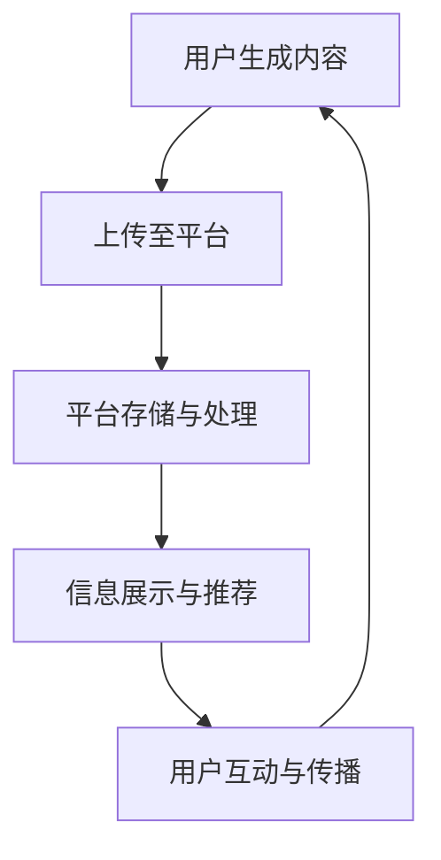
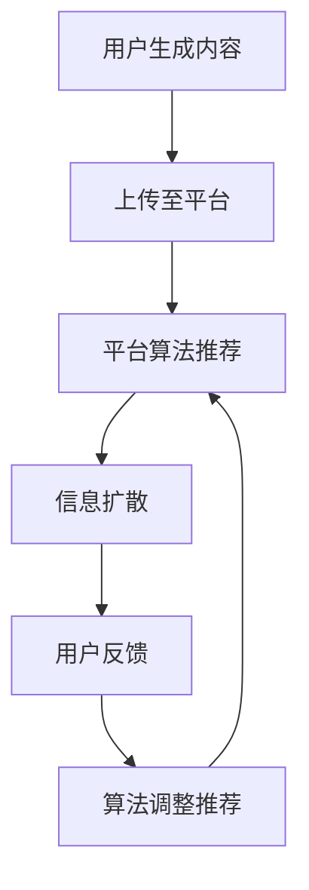
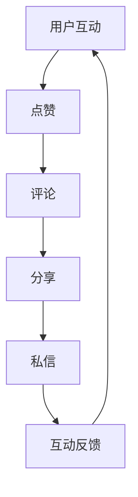

                 

### 让我们一步一步深入思考：数字时代的记忆构建

#### 引言

在数字时代，社交媒体已成为我们生活中不可或缺的一部分。它们不仅改变了我们的沟通方式，还深刻地影响着我们的记忆构建。这一转变不仅仅是一种技术上的进步，更是对人类认知方式的重新定义。随着社交媒体的广泛应用，我们开始重新思考如何记录、保存和回忆过去的经历。

本文将探讨社交媒体在数字时代如何塑造我们的记忆。我们将从以下几个方面入手：

1. **社交媒体的定义与特点**：首先，我们需要明确什么是社交媒体，以及它们的基本特征是什么。
2. **记忆构建的基本理论**：接着，我们将回顾记忆的基本概念和理论，以便更好地理解社交媒体如何影响我们的记忆。
3. **社交媒体的运作机制**：然后，我们将探讨社交媒体的运作原理，包括信息传播和社交互动。
4. **社交媒体对个人记忆的影响**：我们将分析社交媒体如何改变我们的个人记忆，以及这种改变的积极和消极影响。
5. **社交媒体对集体记忆的影响**：接下来，我们将探讨社交媒体如何影响集体记忆的构建与传承。
6. **社交媒体与历史记录**：我们还将讨论社交媒体与历史记录的关系，以及社交媒体时代的历史学研究。
7. **社交媒体的未来发展趋势**：最后，我们将探讨社交媒体的未来发展趋势，并思考这些趋势可能带来的影响。

通过这样的分析，我们希望能够深入理解社交媒体在数字时代如何塑造我们的记忆，以及这一现象对个人和社会的深远影响。

#### 社交媒体的定义与特点

社交媒体（Social Media）指的是一种在线平台，允许用户创建、分享、交换和讨论信息。其核心特征在于用户生成内容（UGC）和社交互动。以下是社交媒体的一些基本特点：

1. **用户生成内容**：社交媒体平台上的信息大多由用户自己创建，这使得内容丰富多样，涵盖了从日常生活到专业领域的各种话题。
2. **互动性**：社交媒体鼓励用户之间的互动，如点赞、评论、分享等，这种互动不仅增强了用户参与度，也促进了信息的传播和讨论。
3. **可访问性**：社交媒体平台的门槛低，用户可以随时随地访问，这使得信息传播的范围和速度大大增加。
4. **即时性**：信息在社交媒体上的传播几乎是实时的，这使得用户可以迅速获取最新的信息。
5. **个性化**：通过算法推荐，社交媒体能够根据用户的兴趣和行为提供个性化的内容，从而提高用户体验。
6. **去中心化**：与传统的媒体形式不同，社交媒体上的信息来源是分散的，没有一个中央权威来控制信息的流动。

为了更直观地理解这些特点，我们可以使用Mermaid流程图来展示社交媒体的基本运作流程：

在这个流程图中，用户生成内容后上传至平台，平台对内容进行存储和处理，然后根据用户的兴趣进行推荐，用户在浏览和互动过程中再次生成内容，形成了一个闭环。

**核心概念与联系**

1. **用户生成内容（UGC）**：UGC是社交媒体的核心特征，它指的是用户自己创建并分享的内容。这种模式与传统的媒体内容生成方式（如专业记者或编辑）有很大的不同。
2. **社交互动**：社交互动是社交媒体的另一个关键特征，它包括用户之间的点赞、评论、分享等行为。这些互动不仅增强了用户粘性，也促进了信息的传播和讨论。
3. **算法推荐**：算法推荐是社交媒体平台用来提高用户体验的一种技术。通过分析用户的兴趣和行为，算法能够推荐用户可能感兴趣的内容，从而提高用户的满意度和活跃度。

以下是一个核心概念对比表格，展示了社交媒体与传统媒体的一些区别：

| 特征 | 社交媒体 | 传统媒体 |
| --- | --- | --- |
| 信息来源 | 用户生成 | 专业媒体 |
| 互动性 | 高 | 低 |
| 可访问性 | 广泛 | 受限 |
| 即时性 | 高 | 低 |
| 个性化 | 高 | 低 |
| 去中心化 | 高 | 低 |

通过这些特点和核心概念的分析，我们可以看到社交媒体在数字时代如何改变了我们的信息获取和交流方式。接下来，我们将进一步探讨记忆构建的基本理论，以帮助我们理解社交媒体如何影响我们的记忆。

#### 记忆构建的基本理论

记忆是人类认知过程中至关重要的一部分，它使我们能够存储、保留和回忆过去的经验和信息。理解记忆的构建机制对于探讨社交媒体如何影响我们的记忆至关重要。

**记忆的概念**

记忆是一个复杂的过程，包括编码、存储和检索三个主要阶段。编码是指将新信息转化为大脑可以处理和存储的形式；存储是指将编码后的信息在脑中保存一段时间；检索是指从记忆中提取信息。

1. **短期记忆（工作记忆）**：短期记忆是一种短暂的存储系统，能够存储大约7±2条信息，持续几秒至几分钟。短期记忆是我们进行复杂认知任务的基础。
2. **长期记忆**：长期记忆是一种持久的存储系统，可以存储大量的信息，并保持数小时至数十年。长期记忆分为两种：情景记忆和语义记忆。
   - **情景记忆**：指的是对特定事件或经历的回忆，如童年经历或重要事件。
   - **语义记忆**：指的是对知识、事实和概念的记忆，如数学公式或历史事件。

**记忆构建的理论基础**

1. **信息加工理论**：该理论认为记忆是通过一系列认知过程实现的，包括注意、编码、存储和检索。注意是信息加工的第一步，它决定了哪些信息将被编码。编码是将信息转化为脑内可存储的形式。存储是信息在脑内保存的过程，而检索是从记忆中提取信息。

2. **图式理论**：图式理论认为，记忆是通过建立和调整认知图式来实现的。图式是一种复杂的认知结构，它将相关信息组织在一起，形成一个有意义的整体。通过不断地使用和调整图式，我们能够更好地记忆和回忆信息。

3. **激活理论**：激活理论认为，记忆是通过神经网络的活动模式来编码和存储的。当需要回忆信息时，相关神经元会被激活，从而触发记忆的检索。这一理论强调了神经网络在记忆中的作用，并为理解社交媒体如何影响记忆提供了新的视角。

**社交媒体与记忆构建的关系**

社交媒体在记忆构建中发挥着重要的作用。一方面，社交媒体为我们提供了大量的信息和互动机会，这些信息可以进入我们的记忆并被存储。另一方面，社交媒体的某些特性可能影响我们的记忆构建，包括：

1. **信息的即时性**：社交媒体上的信息通常是即时的，这使得我们能够迅速获取和更新信息。然而，这种即时性也可能导致我们缺乏深入思考和加工时间，从而影响信息的长期存储。
2. **信息的重复性**：社交媒体上的信息经常重复出现，这可能会增强我们对信息的记忆。然而，过多的重复也可能导致信息过载，使我们难以区分重要和不重要的信息。
3. **社交互动**：社交媒体鼓励用户之间的互动，如点赞、评论和分享。这些互动不仅增强了用户的参与度，也可能影响我们的记忆。例如，与他人讨论和分享信息可以加深我们对这些信息的记忆。

通过理解记忆的基本概念和理论，我们可以更好地理解社交媒体如何影响我们的记忆构建。接下来，我们将探讨社交媒体的运作机制，以进一步揭示它是如何影响我们的记忆的。

#### 社交媒体的运作机制

社交媒体的成功离不开其独特的运作机制，这些机制不仅促进了信息的快速传播，还增强了用户的参与度和互动性。理解这些机制有助于我们深入探讨社交媒体如何影响我们的记忆。

**信息传播机制**

社交媒体的信息传播机制可以分为以下几个阶段：

1. **用户生成内容（UGC）**：用户在社交媒体平台上发布各种形式的内容，如文字、图片、视频和音频。这些内容可以是原创的，也可以是引用或改编的。

2. **平台算法推荐**：社交媒体平台使用复杂的算法来推荐用户可能感兴趣的内容。这些算法通常基于用户的兴趣、行为和历史数据。推荐的目的是提高用户的参与度和满意度。

3. **信息扩散**：一旦内容被推荐，它会在用户的社交网络中扩散。用户可以浏览、点赞、评论和分享这些内容，从而进一步扩大其传播范围。

4. **反馈循环**：用户对内容的反馈（如点赞、评论和分享）会进一步影响算法的推荐，形成一个反馈循环。这种反馈循环不仅增强了用户的参与度，还影响了信息的传播路径。

为了更直观地展示信息传播机制，我们可以使用Mermaid流程图来描述：

**社交互动机制**

社交互动是社交媒体的另一个核心机制，它包括用户之间的各种互动行为，如点赞、评论、分享和私信。这些互动不仅增强了用户的参与度，还促进了信息的传播和讨论。

1. **点赞**：用户可以通过点赞来表达对内容的喜爱或认同。点赞行为不仅增加了内容的可见度，还可能触发算法推荐，从而扩大其传播范围。

2. **评论**：评论是用户之间直接交流的一种方式。通过评论，用户可以表达自己的观点、提出问题或进行讨论。评论有助于内容的深度讨论，也可能促进新信息的产生。

3. **分享**：用户可以将内容分享到其他社交媒体平台或发送给朋友。分享行为不仅增加了内容的传播范围，还可能吸引新用户参与。

4. **私信**：私信是一种私下交流的方式，用户可以通过私信与朋友或其他用户进行一对一的交流。私信有助于建立更紧密的社交关系，也可能影响用户的互动行为。

为了更直观地展示社交互动机制，我们可以使用Mermaid流程图来描述：

**技术支持**

社交媒体平台依赖多种技术来实现其运作机制，其中最重要的是数据挖掘和机器学习。

1. **数据挖掘**：数据挖掘是使用计算机算法从大量数据中提取有用信息和知识的过程。在社交媒体中，数据挖掘用于分析用户行为、兴趣和偏好，从而优化推荐算法和提高用户体验。

2. **机器学习**：机器学习是一种人工智能技术，它使计算机系统能够从数据中学习并做出预测。在社交媒体中，机器学习用于个性化推荐、内容过滤和用户行为分析。

通过数据挖掘和机器学习，社交媒体平台能够更好地理解用户需求，提供个性化的服务，并提高用户的参与度和满意度。

**影响记忆的因素**

社交媒体的运作机制对记忆构建产生了多方面的影响：

1. **信息的即时性**：社交媒体上的信息通常是即时的，这可能会影响我们的记忆加工过程。即时性可能使我们在没有足够时间进行深入思考和加工的情况下接收信息，从而影响长期记忆的存储。

2. **信息的重复性**：社交媒体上的信息经常重复出现，这可能会增强我们对信息的记忆。然而，过多的重复也可能导致信息过载，使我们难以区分重要和不重要的信息。

3. **社交互动**：社交互动不仅增强了用户的参与度，也可能影响我们的记忆。例如，与他人讨论和分享信息可以加深我们对这些信息的记忆。然而，过多的社交互动也可能分散我们的注意力，影响我们对重要信息的记忆。

通过分析社交媒体的运作机制，我们可以更好地理解它是如何影响我们的记忆的。接下来，我们将探讨社交媒体对个人记忆的具体影响。

#### 社交媒体对个人记忆的塑造

社交媒体不仅改变了我们的信息获取和交流方式，还对个人记忆产生了深远的影响。社交媒体在个人记忆中的角色是多方面的，包括信息的存储、回忆和重构。

**社交媒体如何改变我们的记忆**

1. **信息的即时获取与记忆加工时间不足**：社交媒体上的信息通常是即时的，我们经常在不需要深入加工的情况下接收大量信息。这种即时性可能使我们的记忆加工时间不足，导致信息无法充分编码和存储。根据记忆加工理论，深入加工是信息进入长期记忆的关键步骤。社交媒体的即时性可能削弱了这一过程，从而影响我们的记忆存储。

2. **信息的重复性**：社交媒体上的信息经常重复出现，这可能会增强我们对信息的记忆。然而，过多的重复也可能导致信息过载，使我们难以区分重要和不重要的信息。根据激活理论，信息的重复可以提高记忆的强度，但过度的重复可能导致信息的冗余，从而干扰我们对关键信息的记忆。

3. **社交互动**：社交媒体鼓励用户之间的互动，如点赞、评论和分享。这些互动不仅增强了用户的参与度，也可能影响我们的记忆。与他人讨论和分享信息可以加深我们对这些信息的记忆。然而，过多的社交互动也可能分散我们的注意力，影响我们对重要信息的记忆。

**积极影响**

1. **增强记忆的可访问性**：社交媒体为我们提供了一个便捷的渠道，可以随时访问和回顾过去的信息。这种便利性可能会增强我们对信息的回忆能力，使我们能够更轻松地回忆起重要的经历和知识。

2. **促进信息共享与协作**：社交媒体鼓励用户分享和传播信息，这不仅可以扩大信息的影响范围，还可以促进知识共享和协作。例如，在学习过程中，学生可以通过社交媒体平台分享笔记和资源，从而加深对学习内容的记忆和理解。

3. **增强记忆的丰富性和多样性**：社交媒体上的信息形式多样，包括文字、图片、视频和音频。这种多样性可以丰富我们的记忆体验，使信息以多种方式被编码和存储，从而提高记忆的强度和持久性。

**消极影响**

1. **信息过载与遗忘**：社交媒体上的信息量巨大，我们可能难以处理和记住所有信息。这种现象称为信息过载。根据信息加工理论，当我们需要处理大量信息时，记忆资源可能会被过度消耗，导致遗忘。

2. **碎片化记忆**：社交媒体上的信息通常是碎片化的，缺乏系统性和整体性。这种碎片化记忆可能使我们的记忆难以整合和重构，从而影响我们对复杂信息的理解和回忆。

3. **记忆重构的挑战**：社交媒体上的信息可能会被用户编辑、篡改或误解。这种信息重构可能影响我们对过去事件的记忆，使我们难以准确回忆历史事件。

**实际案例分析**

以下是一个实际案例，展示了社交媒体如何影响个人记忆：

**案例**：一位学生在使用社交媒体平台学习时，经常使用图片和视频来记录课堂笔记。这种方式不仅增强了她对学习内容的记忆，还使她能够随时回顾和复习笔记。然而，她也发现，由于社交媒体上的信息量巨大，她有时会难以区分哪些信息是重要的，哪些是无关紧要的，这导致她的记忆受到干扰。

**结论**：社交媒体在个人记忆中扮演着复杂的角色。它既为我们提供了便捷的信息存储和回忆工具，又可能对记忆产生负面影响。理解这些影响有助于我们更好地利用社交媒体来提升记忆效能。

#### 社交媒体对集体记忆的构建与传承

社交媒体不仅对个人记忆产生深远影响，也在集体记忆的构建与传承中发挥着重要作用。集体记忆是指一个社会或文化群体共同拥有的记忆，它涵盖了历史事件、传统习俗和文化价值观。社交媒体通过其独特的互动性和传播机制，为集体记忆的构建与传承提供了新的平台和方式。

**集体记忆的概念**

集体记忆（Collective Memory）是指一个社会或文化群体共同拥有的记忆，它通过历史事件、文化传统和个人经历等方式传承下来。集体记忆不仅是过去事件的记录，更是文化身份和认同感的重要来源。它通过语言、仪式、艺术和其他文化表现形式来传递和保存。

**社交媒体对集体记忆的塑造**

1. **信息共享与传播**：社交媒体平台如Twitter、Facebook和Instagram等，为用户提供了便捷的信息共享和传播渠道。用户可以分享历史事件、文化习俗和传统故事，从而促进集体记忆的传播。通过社交媒体，这些信息可以迅速传播到广泛的受众，甚至跨越国界和文化差异。

2. **社交互动与参与**：社交媒体鼓励用户之间的互动，如点赞、评论和分享。这些互动不仅增强了用户的参与度，也促进了集体记忆的讨论和传承。例如，用户可以通过评论和分享来讨论历史事件，表达对文化传统的看法，从而加深对集体记忆的理解。

3. **记忆重构与传承**：社交媒体上的信息可以被用户编辑、修改和重构。这种记忆重构不仅影响了信息的准确性，也改变了集体记忆的传承方式。用户可以根据自己的观点和经验来重新解读历史事件和文化传统，从而影响集体记忆的塑造。例如，社交媒体上的历史事件描述可能因用户的立场和观点而有所不同，这种差异可能会影响集体记忆的形成。

**社交媒体在集体记忆传承中的作用**

1. **文化传承**：社交媒体为文化传承提供了新的途径。通过社交媒体，用户可以分享传统艺术、手工艺和民间故事，从而保护和传承文化遗产。例如，一些社交媒体平台上的用户分享传统音乐、舞蹈和手工艺品，吸引更多人关注和了解这些文化传统。

2. **历史记录与保存**：社交媒体平台成为历史记录和保存的重要工具。用户可以实时记录和分享历史事件，如政治抗议、社会运动和文化庆典。这些记录不仅为历史研究提供了宝贵的数据，也有助于集体记忆的保存和传承。

3. **教育传播**：社交媒体在教育传播中发挥着重要作用。教师和学生可以通过社交媒体分享学习资源和历史知识，促进学生对历史事件和文化传统的理解。例如，历史教师可以通过社交媒体平台分享历史图片、文献和视频，使学生更直观地了解历史。

**案例研究**

以下是一个社交媒体在集体记忆传承中的实际案例：

**案例**：在2019年香港抗议运动期间，社交媒体平台如Facebook和Instagram成为用户记录和分享抗议活动的重要渠道。用户通过上传照片、视频和文字描述，实时记录了抗议活动的场景和事件发展。这些记录不仅为历史研究提供了宝贵的数据，也帮助了其他国家和地区的人们了解香港的抗议运动，从而加深了对这一事件的集体记忆。

**结论**：社交媒体在集体记忆的构建与传承中扮演着重要角色。它不仅为信息共享和传播提供了新的平台，也改变了集体记忆的传承方式。通过社交媒体，集体记忆可以更广泛地传播和保存，同时也带来了新的挑战，如信息的准确性和重构问题。理解这些影响有助于我们更好地利用社交媒体来保护和传承集体记忆。

#### 社交媒体与历史记录

社交媒体已经成为历史记录的重要工具，它不仅改变了历史记录的方式，也影响了历史的真实性和解读。随着社交媒体的普及，越来越多的人参与到历史记录的过程中，这既为历史研究提供了丰富的数据资源，也带来了一系列挑战。

**社交媒体对历史记录的影响**

1. **实时记录与传播**：社交媒体平台如Twitter、Instagram和YouTube等，允许用户实时记录和分享历史事件。这些平台的即时性和广泛传播性，使得历史事件可以在发生后立即被记录和传播。例如，2011年的“阿拉伯之春”运动期间，社交媒体成为了抗议者记录和传播信息的重要渠道，使得全球观众能够实时了解事件的进展。

2. **草根记录者**：社交媒体使得普通民众也能够成为历史记录者。过去，历史记录主要依赖于专业历史学家和记者，而社交媒体则打破了这一限制，使得每个人都可以成为历史的见证者和记录者。这种草根记录者的崛起，丰富了历史记录的视角和内容，但也带来了记录准确性和可靠性的问题。

3. **数据的海量性**：社交媒体平台每天生成和共享的海量数据，为历史研究提供了丰富的信息资源。这些数据不仅包括文本，还包括图片、视频和音频等多媒体形式。历史学家可以利用这些数据来研究社会文化变迁、政治运动和日常生活的细节。

**历史记录对社交媒体的反思**

1. **信息的真实性和可靠性**：社交媒体上的历史记录虽然丰富，但也存在真实性和可靠性问题。由于社交媒体的匿名性和用户编辑的灵活性，记录的信息可能存在误导性或夸大其词的情况。历史学家在使用这些数据时，需要仔细甄别和验证，以确保信息的准确性。

2. **记忆重构与误解**：社交媒体上的历史记录可能被用户根据自己的观点和经验进行重构和解读。这种重构可能影响历史记录的真实性和客观性，导致集体记忆的偏差和误解。例如，社交媒体上的信息可能根据不同的政治立场和社会背景，对同一历史事件做出不同的解读。

3. **记忆的碎片化**：社交媒体上的历史记录往往是碎片化的，缺乏系统性和整体性。这种碎片化记忆可能使历史事件难以被完整和准确地理解。历史学家需要在研究过程中，将这些碎片化的信息进行整合和解读，以恢复历史事件的完整图景。

**社交媒体时代的历史学研究**

1. **数据挖掘与分析**：历史学家可以利用数据挖掘技术，从社交媒体数据中提取有价值的信息。例如，通过对Twitter数据的分析，可以研究社会舆论的变迁、公共事件的传播路径和用户的行为模式。

2. **多源数据的整合**：历史学家需要整合来自社交媒体和其他传统媒体的数据，以获得更全面和准确的历史记录。这种多源数据的整合，有助于弥补社交媒体数据在真实性、可靠性方面的不足。

3. **用户视角的研究**：历史学家可以研究社交媒体用户对历史事件的看法和解读，以了解不同群体对历史的认知和记忆。这种用户视角的研究，有助于揭示社交媒体对集体记忆的塑造和影响。

**案例研究**

以下是一个社交媒体对历史记录产生影响的实际案例：

**案例**：在2017年美国弗吉尼亚州夏洛茨维尔市的白人至上主义示威事件中，社交媒体平台如Twitter和YouTube成为了记录和传播事件的重要渠道。示威者和旁观者通过上传照片、视频和文字描述，实时记录了事件的发展和冲突的现场。这些社交媒体记录不仅为历史研究提供了宝贵的数据，也引发了关于社交媒体在历史记录中角色的讨论。

**结论**：社交媒体对历史记录产生了深远的影响。它不仅改变了历史记录的方式，也为历史研究提供了丰富的数据资源。然而，社交媒体上的历史记录也存在真实性和可靠性问题，历史学家在使用这些数据时需要谨慎甄别。通过数据挖掘、多源数据整合和用户视角的研究，历史学家可以更好地理解社交媒体对历史记录和集体记忆的影响。

#### 社交媒体时代的史学研究

在社交媒体时代，史学研究面临着前所未有的机遇和挑战。社交媒体平台不仅为历史研究提供了丰富的数据资源，也改变了历史研究的路径和方式。

**社交媒体对史学研究的挑战**

1. **数据真实性**：社交媒体上的历史记录可能存在真实性和可靠性问题。由于匿名性和用户编辑的灵活性，记录的信息可能存在误导性或夸大其词的情况。历史学家在使用这些数据时，需要仔细甄别和验证，以确保信息的准确性。

2. **记忆重构**：社交媒体上的历史记录可能根据不同的政治立场和社会背景，对同一历史事件做出不同的解读。这种记忆重构可能影响历史记录的真实性和客观性，导致集体记忆的偏差和误解。

3. **碎片化记忆**：社交媒体上的历史记录往往是碎片化的，缺乏系统性和整体性。这种碎片化记忆可能使历史事件难以被完整和准确地理解。历史学家需要在研究过程中，将这些碎片化的信息进行整合和解读，以恢复历史事件的完整图景。

**社交媒体对史学研究的机遇**

1. **数据丰富性**：社交媒体平台每天生成和共享的海量数据，为历史研究提供了丰富的信息资源。这些数据不仅包括文本，还包括图片、视频和音频等多媒体形式。历史学家可以利用这些数据来研究社会文化变迁、政治运动和日常生活的细节。

2. **实时记录与传播**：社交媒体平台的即时性和广泛传播性，使得历史事件可以在发生后立即被记录和传播。历史学家可以实时获取和利用这些信息，从而更快速地了解事件的发展和影响。

3. **用户视角研究**：历史学家可以研究社交媒体用户对历史事件的看法和解读，以了解不同群体对历史的认知和记忆。这种用户视角的研究，有助于揭示社交媒体对集体记忆的塑造和影响。

**社交媒体时代的历史学研究方法**

1. **数据挖掘与分析**：历史学家可以利用数据挖掘技术，从社交媒体数据中提取有价值的信息。例如，通过对Twitter数据的分析，可以研究社会舆论的变迁、公共事件的传播路径和用户的行为模式。

2. **多源数据的整合**：历史学家需要整合来自社交媒体和其他传统媒体的数据，以获得更全面和准确的历史记录。这种多源数据的整合，有助于弥补社交媒体数据在真实性、可靠性方面的不足。

3. **用户行为研究**：历史学家可以研究社交媒体用户的行为和互动，以了解他们对历史事件的兴趣和态度。这种研究有助于揭示社交媒体如何影响公众对历史的认知和理解。

**案例研究**

以下是一个社交媒体对史学研究产生影响的实际案例：

**案例**：2011年的“阿拉伯之春”运动期间，社交媒体平台如Twitter和Facebook成为了记录和传播事件的重要渠道。历史学家可以利用这些平台的公开数据，研究运动的发展过程、参与者的行为模式和公众舆论的变迁。这些数据不仅为研究提供了丰富的信息，也改变了传统历史研究的方法和路径。

**结论**：社交媒体为史学研究带来了丰富的机遇和挑战。历史学家需要利用数据挖掘、多源数据整合和用户行为研究等方法，来应对社交媒体数据在真实性、可靠性和碎片化方面的挑战。通过这些方法，历史学家可以更好地理解社交媒体对历史记录和集体记忆的影响，从而推动史学研究的发展。

#### 社交媒体的未来发展趋势

随着技术的不断进步，社交媒体也在不断进化，其未来发展趋势将对个人和社会产生深远影响。以下是几个关键的趋势：

**技术进步对社交媒体的影响**

1. **人工智能与机器学习**：人工智能和机器学习技术的进步将使社交媒体平台能够更精准地推荐内容，提高用户体验。例如，通过分析用户的兴趣和行为，算法可以预测用户可能感兴趣的内容，从而实现个性化推荐。此外，人工智能还可以用于自动化内容审核和用户行为分析，提高社交媒体的运营效率。

2. **虚拟现实与增强现实**：虚拟现实（VR）和增强现实（AR）技术的应用将使社交媒体平台提供更加沉浸式的体验。用户可以通过VR和AR技术，参与虚拟活动、观看360度视频，甚至虚拟旅行。这种技术将使社交媒体不仅是一个信息交流平台，更是一个体验和互动的平台。

3. **数据隐私与安全**：随着用户对数据隐私和安全性的关注日益增加，社交媒体平台需要采取更严格的措施来保护用户数据。这可能包括引入更先进的数据加密技术和隐私保护协议，以防止数据泄露和滥用。

**社交媒体的未来发展趋势**

1. **社交电商**：社交媒体平台正逐渐融合电子商务功能，使用户可以在社交环境中购物。这种趋势将改变人们的购物习惯，使购物变得更加便捷和社交化。

2. **去中心化社交媒体**：去中心化社交媒体（如Mastodon）正逐渐兴起，以应对中心化社交媒体平台对内容的控制和对用户数据的滥用。去中心化社交媒体通过分布式网络结构，提供更加开放和透明的平台，吸引了许多对隐私和数据主权关注用户的关注。

3. **社区驱动的内容**：社交媒体平台将更加注重社区建设和用户生成内容。通过鼓励用户参与社区讨论和内容创作，平台可以增强用户粘性，提高用户满意度。

**社交媒体对社会的影响**

1. **信息传播的变革**：社交媒体的即时性和广泛传播性，使得信息传播的速度和范围大大增加。这既有助于信息的快速传播和共享，也可能导致信息过载和虚假信息的传播。社交媒体平台需要加强信息审核和内容监管，以保障信息的真实性。

2. **社交互动的变革**：社交媒体改变了人们的社交互动方式，使社交更加虚拟化和多样化。虽然这增加了人们的社交机会，但也可能导致现实生活中的社交减少。此外，社交媒体上的社交互动也可能带来新的心理健康问题，如社交焦虑和依赖。

3. **文化传承的变革**：社交媒体为文化传承提供了新的平台和方式。通过社交媒体，传统文化和习俗可以更广泛地传播和保存。然而，社交媒体也可能导致文化的同质化和全球化，使本土文化面临消失的风险。

**结论**：社交媒体的未来发展趋势将受到技术进步、用户需求和社会变革的多重影响。通过不断创新和调整，社交媒体将不断演变，对社会和个人产生深远的影响。

#### 结论与反思

通过对社交媒体与记忆构建的深入探讨，我们可以看到，社交媒体在数字时代扮演了不可或缺的角色。它不仅改变了我们的信息获取和交流方式，还深刻地影响着我们的记忆构建。以下是对本文核心观点的总结：

1. **社交媒体的定义与特点**：社交媒体是通过用户生成内容和社交互动来实现信息共享和传播的平台。其核心特点包括用户生成内容、互动性、即时性和个性化。

2. **记忆构建的基本理论**：记忆是通过编码、存储和检索三个阶段实现的。社交媒体的即时性和信息重复性可能影响记忆的编码和存储，同时也可能通过社交互动增强记忆。

3. **社交媒体的运作机制**：社交媒体通过信息传播和社交互动机制，促进了信息的快速传播和深度讨论。技术支持，如数据挖掘和机器学习，进一步提升了社交媒体的运营效率。

4. **社交媒体对个人记忆的影响**：社交媒体在个人记忆中既有积极影响，如增强信息的可访问性和丰富性，也有消极影响，如信息过载和碎片化记忆。

5. **社交媒体对集体记忆的影响**：社交媒体为集体记忆的构建与传承提供了新的平台和方式，但也可能影响信息的真实性和重构。

6. **社交媒体与历史记录**：社交媒体成为历史记录的重要工具，但也面临数据真实性和记忆重构的挑战。历史学家需要谨慎利用这些数据。

7. **社交媒体的未来发展趋势**：随着技术进步，社交媒体将继续演变，对社会和个人产生深远影响。

**反思与建议**

1. **隐私与安全**：社交媒体在提供便捷服务的同时，也可能侵犯用户隐私。用户应提高对隐私保护的认识，合理设置隐私权限。

2. **信息真实性**：用户应提高对信息的辨别能力，避免被虚假信息误导。

3. **平衡线上与线下互动**：虽然社交媒体提供了丰富的社交机会，但不应完全依赖虚拟互动，而应保持线下社交的平衡。

4. **历史记录的审慎使用**：历史学家在利用社交媒体数据时应保持审慎，确保数据的真实性和可靠性。

通过本文的讨论，我们不仅深入理解了社交媒体与记忆构建的关系，也对这一现象对个人和社会的深远影响有了更清晰的认识。未来，随着技术的不断进步，社交媒体将继续演变，对我们生活的方方面面产生深远的影响。

#### 作者信息

**作者：AI天才研究院/AI Genius Institute & 禅与计算机程序设计艺术 /Zen And The Art of Computer Programming**

