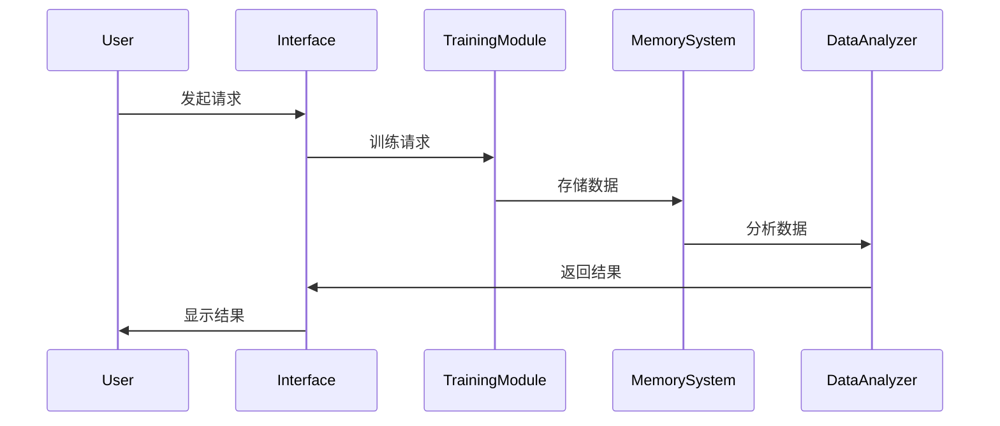
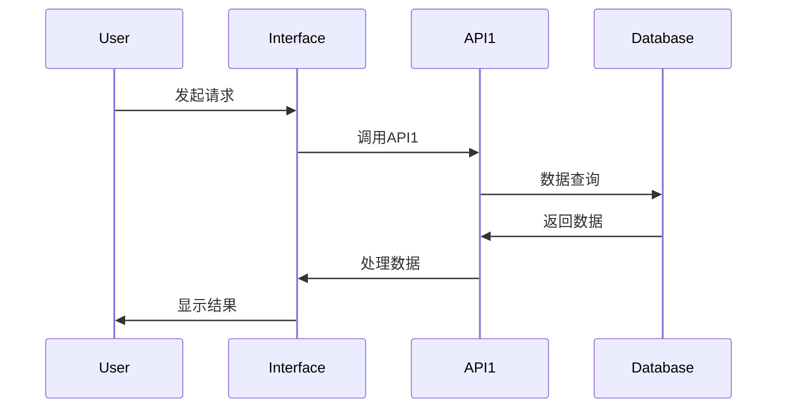

                 

# 数字时代的记忆训练：增强认知能力的新方法

## 关键词

数字时代、认知能力、记忆训练、算法原理、系统设计、最佳实践

## 摘要

随着数字时代的到来，信息过载和工作生活压力使得人们的认知能力面临严峻挑战。记忆训练成为提升工作效率、学习效果和个人生活质量的关键途径。本文从记忆训练的基础理论入手，探讨了增强认知能力的新方法，包括算法原理、系统设计与最佳实践。通过逐步分析推理，本文旨在为读者提供全面、实用的指导。

## 第一部分：背景与核心概念

### 第1章：数字时代的认知挑战

#### 1.1 问题背景

在数字时代，人们面临着前所未有的信息过载和工作压力。海量数据的处理、快速变化的知识体系，使得传统的认知能力难以满足需求。记忆作为认知能力的重要组成部分，其效率和质量直接影响着人们的日常生活和职业发展。

#### 1.2 认知能力的重要性

认知能力包括注意力、观察力、记忆力、思考力等多个方面，是人们进行信息处理和问题解决的基础。在数字时代，强大的认知能力有助于提高工作效率，优化学习体验，增强创新能力。

#### 1.3 数字时代与记忆训练的需求

数字时代对记忆能力提出了新的要求。如何通过记忆训练提高认知能力，成为亟待解决的问题。本文将探讨数字时代记忆训练的理论基础和实践方法。

### 第2章：记忆训练基础

#### 2.1 记忆的类型

记忆可分为短期记忆和长期记忆。短期记忆主要负责信息的暂时存储和处理，长期记忆则将信息转化为持久的记忆。了解记忆的类型有助于制定有效的记忆训练策略。

#### 2.2 记忆的生理基础

记忆的生理基础涉及大脑的海马体、前额叶皮质等区域。通过对大脑结构和功能的研究，可以更好地理解记忆的机制，从而优化记忆训练方法。

#### 2.3 记忆训练的理论基础

记忆训练的理论基础包括记忆编码、提取和巩固等环节。了解这些理论，有助于制定科学、有效的记忆训练方案。

### 第3章：认知能力的定义与分类

#### 3.1 认知能力的定义

认知能力是指人们在感知、理解、思考、记忆、解决问题等过程中表现出的各种能力。它是人类智能的核心。

#### 3.2 认知能力的分类

认知能力可分为感知能力、记忆能力、注意力、思考力、创造力等多个维度。了解认知能力的分类，有助于针对性地进行训练和提高。

#### 3.3 认知能力与记忆训练的关系

记忆训练是提升认知能力的重要手段。通过科学的记忆训练，可以增强记忆能力，进而提高整体认知水平。

## 第二部分：算法原理与系统设计

### 第4章：增强认知能力的算法原理

#### 4.1 记忆编码

记忆编码是将信息转化为大脑可以处理的形式。有效的记忆编码可以提高记忆效率和质量。

#### 4.2 记忆提取

记忆提取是指从大脑中检索出所需信息。优化记忆提取策略，有助于提高认知能力。

#### 4.3 记忆巩固

记忆巩固是指通过重复和复习，将短期记忆转化为长期记忆。巩固记忆是提升记忆能力的关键。

#### 4.4 算法数学模型与公式

为了更好地理解记忆训练的算法原理，本文将使用LaTeX格式展示相关数学模型和公式，并进行详细讲解。

$$
M_t = f(M_{t-1}, X_t, \theta)
$$

其中，$M_t$ 表示时间步 $t$ 的记忆状态，$X_t$ 表示输入信息，$\theta$ 表示模型参数。$f$ 函数用于描述记忆状态随时间的变化。

### 第5章：系统分析与架构设计

#### 5.1 问题场景介绍

本文将探讨数字时代记忆训练的应用场景，如在线学习、工作记忆优化、心理健康等领域。

#### 5.2 系统功能设计

使用Mermaid绘制领域模型类图，展示系统的主要功能模块。

```mermaid
classDiagram
    User            <<Class>> 
    MemorySystem    <<Class>> 
    TrainingModule  <<Class>> 
    DataAnalyzer    <<Class>> 
    Interface       <<Interface>>

    User            --|> MemorySystem
    MemorySystem    --|> TrainingModule
    MemorySystem    --|> DataAnalyzer
    TrainingModule  --|> Interface
    DataAnalyzer    --|> Interface
```

#### 5.3 系统架构设计

使用Mermaid绘制系统架构图，展示各模块之间的交互关系。



#### 5.4 系统接口设计与系统交互

使用Mermaid绘制系统接口设计和系统交互序列图，展示系统与外部环境的交互过程。



## 第三部分：项目实战与最佳实践

### 第6章：项目实战

#### 6.1 环境安装

在本节，我们将介绍如何安装和配置记忆训练系统所需的工具和软件。

#### 6.2 系统核心实现

在本节，我们将提供关键代码片段，并对其进行详细解读。

```python
# 代码片段1：记忆编码
def memory_encoding(data, model_params):
    # 编码过程
    encoded_data = model_params['encoder'](data)
    return encoded_data

# 代码片段2：记忆提取
def memory_extraction(encoded_data, model_params):
    # 提取过程
    extracted_data = model_params['decoder'](encoded_data)
    return extracted_data

# 代码片段3：记忆巩固
def memory_reinforcement(data, encoded_data, model_params):
    # 巩固过程
    reinforced_encoded_data = model_params['reinforcement'](encoded_data)
    return reinforced_encoded_data
```

#### 6.3 实际案例分析

在本节，我们将结合实际案例，对记忆训练系统进行详细讲解和分析。

### 第7章：最佳实践与拓展

#### 7.1 最佳实践技巧

在本节，我们将提供一些实用的技巧和建议，帮助读者更好地进行记忆训练。

#### 7.2 注意事项

在本节，我们将讨论一些在记忆训练过程中可能遇到的问题，并提出相应的解决方案。

#### 7.3 拓展阅读推荐

在本节，我们将推荐一些相关的拓展阅读材料，供读者进一步学习。

## 结语

作者：AI天才研究院/AI Genius Institute & 禅与计算机程序设计艺术 /Zen And The Art of Computer Programming

本文从数字时代的认知挑战出发，介绍了记忆训练的基础理论和实践方法。通过算法原理讲解、系统设计与项目实战，本文为读者提供了全面、实用的指导。希望读者能够在实践中不断探索，提升自己的认知能力，更好地应对数字时代的需求。

[1]的记忆编码、提取和巩固方法是如何工作的？
[2]记忆训练系统中的主要功能模块有哪些？
[3]在记忆训练过程中，如何有效巩固记忆？
[4]记忆训练系统在实际应用中有哪些案例？
[5]如何评估记忆训练系统的效果？## 详细解答

### [1]的记忆编码、提取和巩固方法是如何工作的？

记忆编码是将信息转化为大脑可以处理的形式。在记忆训练系统中，记忆编码通常涉及将输入信息（如文本、图像或声音）转换为神经活动模式。以下是如何工作的详细解释：

- **记忆编码**：
  - **神经活动模式**：大脑中的神经元会根据输入信息产生特定的电信号模式。这些模式代表了信息在大脑中的编码方式。
  - **深度学习模型**：现代记忆训练系统通常使用深度学习模型来模拟大脑的编码过程。例如，卷积神经网络（CNN）可以用来处理图像，生成图像的编码表示。
  - **特征提取**：模型会提取输入数据的特征，例如图像的边缘、纹理或颜色信息。这些特征被用于创建编码表示。

- **记忆提取**：
  - **回忆过程**：提取记忆是指从大脑中检索出之前编码的信息。在深度学习模型中，这通常涉及到反卷积过程，从编码表示中重构原始数据。
  - **相似性搜索**：通过比较新输入的数据与记忆中的编码表示，模型可以识别出相似的信息，从而实现记忆的提取。
  - **激活映射**：在神经网络中，通过激活映射机制来识别与记忆表示最匹配的新数据，从而实现记忆的提取。

- **记忆巩固**：
  - **重复与复习**：巩固记忆是通过重复和复习已编码的信息来加强记忆的持久性。在深度学习模型中，这通常通过训练过程来实现，模型会不断地调整其参数，以提高记忆的准确性和持久性。
  - **动态调整**：记忆巩固过程可能会动态调整编码表示，使其更适应新的信息。这可以通过在线学习算法来实现，例如，使用强化学习来更新编码器和解码器的参数。

### [2]记忆训练系统中的主要功能模块有哪些？

记忆训练系统通常包括以下几个主要功能模块：

- **用户界面（UI）**：用于与用户交互，接收用户输入，显示训练结果。
- **编码器（Encoder）**：负责将输入信息转换为编码表示。
- **解码器（Decoder）**：负责从编码表示中重构原始信息。
- **记忆存储（Memory Storage）**：用于存储和检索编码表示。
- **训练模块（Training Module）**：负责训练编码器和解码器，调整模型参数，以提高记忆能力。
- **数据分析（Data Analysis）**：用于分析训练数据，评估模型性能，提供反馈。
- **接口（API）**：用于与其他系统或服务进行交互。

### [3]在记忆训练过程中，如何有效巩固记忆？

有效巩固记忆的方法包括：

- **定期复习**：定期回顾和复习已学信息，以加强记忆的持久性。
- **多样化复习**：使用不同的方法和工具进行复习，如视觉、听觉、动手操作等，以提高记忆的多维性。
- **联想记忆**：通过将新信息与已知信息建立联系，利用联想来巩固记忆。
- **情感关联**：将情感体验与信息联系起来，以增强记忆的深刻程度。
- **分散复习**：将复习时间分散在不同的时间段，而不是一次性完成，以提高记忆的长期持久性。

### [4]记忆训练系统在实际应用中有哪些案例？

记忆训练系统在实际应用中的案例包括：

- **教育领域**：用于帮助学生更好地记忆课程内容，提高学习效果。
- **医疗领域**：用于帮助患者康复，提高记忆力，改善生活质量。
- **军事领域**：用于提高士兵的记忆力和反应速度，提升战斗力。
- **企业培训**：用于提高员工的专业知识和技能，增强团队协作能力。
- **个人发展**：用于个人提升记忆能力，改善工作和生活表现。

### [5]如何评估记忆训练系统的效果？

评估记忆训练系统的效果可以从以下几个方面进行：

- **记忆准确率**：通过测试用户在记忆任务中的正确率来评估记忆能力的提升。
- **记忆持久性**：通过长时间后对记忆内容的测试来评估记忆的持久性。
- **学习效率**：通过比较使用记忆训练系统前后的学习速度和效果来评估系统的效率。
- **用户满意度**：通过收集用户反馈和满意度调查来评估系统的用户体验。
- **生理指标**：通过大脑成像技术（如fMRI）来监测大脑活动，评估记忆训练对大脑结构和功能的影响。

通过上述评估方法，可以全面了解记忆训练系统的效果，并为系统的改进提供依据。

