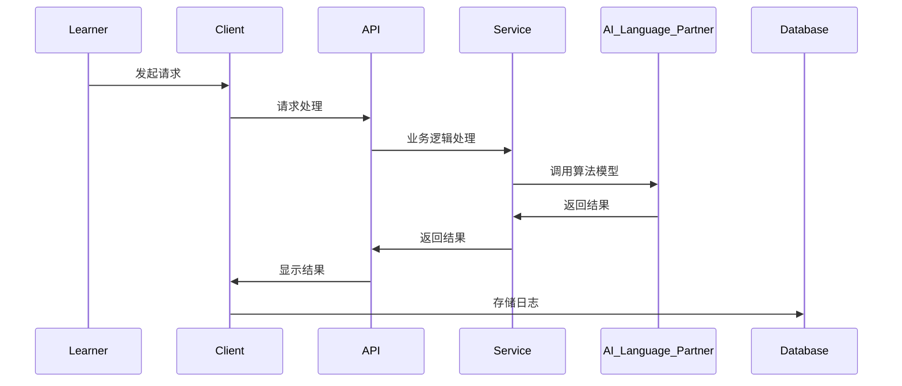
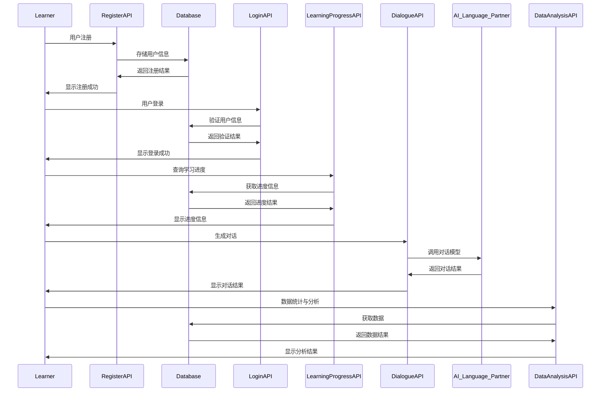
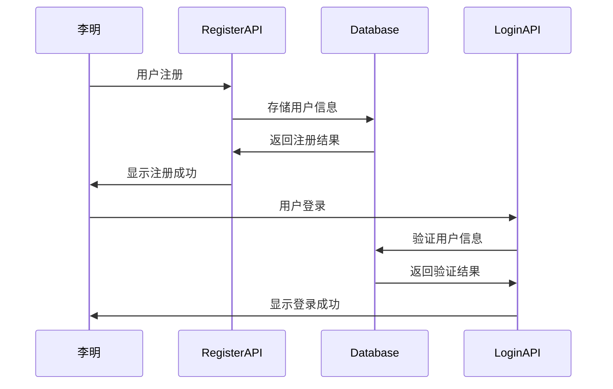
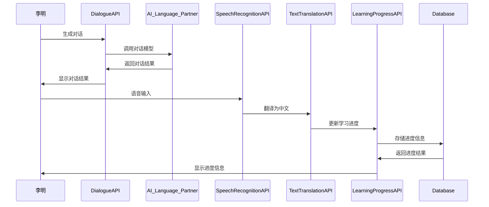
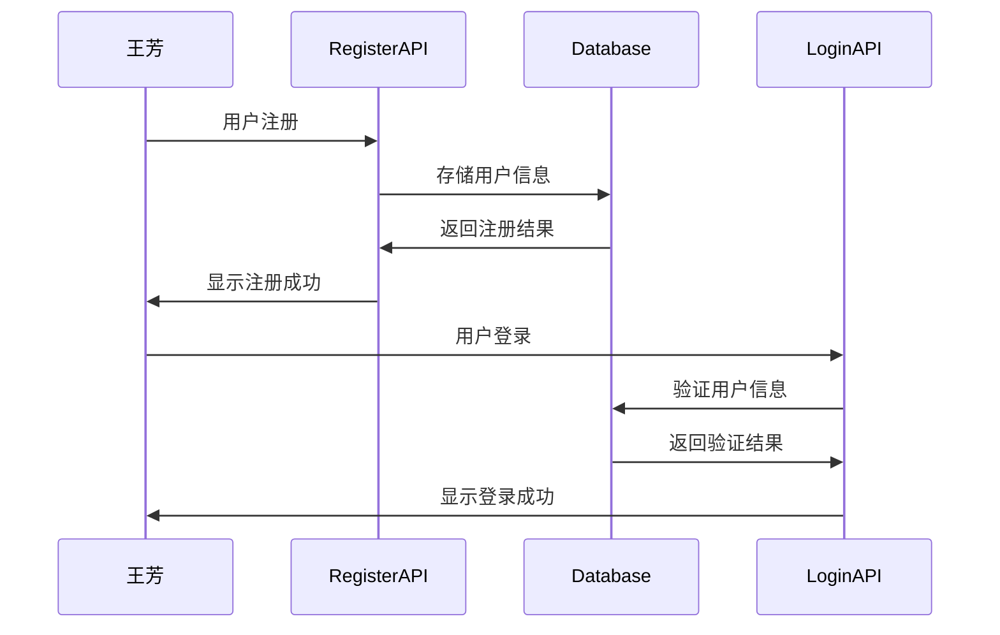
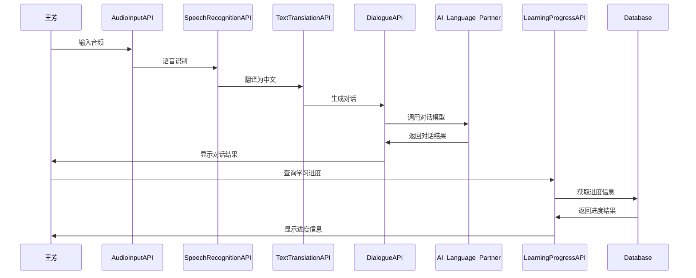

                 

# 数字时代的语言学习：AI语伴在外语习得中的角色

> 关键词：人工智能，语言学习，AI语伴，外语习得，算法，系统架构，实践案例

> 摘要：在数字化时代，人工智能（AI）技术的飞速发展为语言学习带来了全新的机遇。本文旨在探讨AI语伴在外语习得中的角色，从核心概念、理论框架、算法原理、系统设计到实际应用，逐步分析AI如何辅助人类更高效地掌握外语。文章结构如下：

## 引言与背景

在全球化日益深入的今天，外语能力已成为现代人必备的技能。然而，传统语言学习方式往往存在效率低下、难以坚持等问题。随着AI技术的发展，AI语伴作为一种新兴的语言学习工具，正逐步改变这一现状。本文将深入探讨AI语伴如何在外语习得中发挥作用，以及其背后的技术原理和实施方法。

## 核心概念与原则

### 1. 人工智能（AI）基础

- **定义**：AI是指由人造系统实现的智能行为，能够模拟、扩展或替代人类智能。
- **分类**：基于功能，AI可分为认知AI、感知AI、行动AI等；基于智能体类型，可分为人机交互系统、智能机器等。

### 2. 语言学习

- **定义**：语言学习是指通过训练和练习，掌握一门新语言的能力。
- **过程**：包括听力、口语、阅读、写作四个方面。

### 3. AI语伴

- **定义**：AI语伴是指利用人工智能技术，模拟人类语言交流过程，辅助用户进行语言学习。
- **特点**：实时反馈、个性化教学、情境模拟等。

## 理论框架与模型

### 1. 理论框架

- **基于规则的模型**：通过定义一系列规则，实现语言理解和生成。
- **统计模型**：利用大量语料数据，通过统计方法训练模型。
- **深度学习模型**：通过神经网络，实现对语言数据的自动建模。

### 2. 模型比较

| 模型类型 | 优点 | 缺点 | 适用场景 |
| --- | --- | --- | --- |
| 基于规则模型 | 简单易懂，可解释性好 | 语言复杂度限制，难以处理模糊性 | 简单语言处理任务 |
| 统计模型 | 可处理大规模数据，自适应性强 | 难以解释，泛化能力有限 | 大规模数据处理 |
| 深度学习模型 | 高效，强大的表征能力 | 过拟合，训练成本高 | 复杂语言处理任务 |

### 3. ER实体关系图

```mermaid
erDiagram
  User ||--|{ AI_Language_Partner } : has
  User ||--|{ Learning_Log } : has
  AI_Language_Partner ||--|{ Conversation } : has
  AI_Language_Partner ||--|{ Dialogue_Management } : has
```

## 算法解释与演示

### 1. 语音识别算法

#### 流程图


#### Python代码示例

```python
import speech_recognition as sr

# 初始化语音识别器
recognizer = sr.Recognizer()

# 语音输入
with sr.Microphone() as source:
    print("请说一句英文：")
    audio = recognizer.listen(source)

# 声学模型与语言模型处理
try:
    text = recognizer.recognize_google(audio)
    print(f"你说了：{text}")
except sr.UnknownValueError:
    print("无法理解音频")
except sr.RequestError:
    print("请求错误：无法获取结果")
```

### 2. 自然语言处理算法

#### 流程图


#### Python代码示例

```python
import spacy

# 初始化nlp模型
nlp = spacy.load("en_core_web_sm")

# 文本输入
text = "I love programming."

# 分词与句法分析
doc = nlp(text)
for token in doc:
    print(token.text, token.lemma_, token.pos_, token.tag_, token.dep_, token.head.text, token.head.pos_)

# 语义分析
from spacy.matcher import Matcher

# 创建Matcher对象
matcher = Matcher(nlp.vocab)
pattern = [{"LOWER": "i"}, {"ENT_TYPE": "PERSON"}]
matcher.add("SPEAKER", [pattern])

# 应用Matcher
results = matcher(doc)
for match_id, start, end in results:
    span = doc[start:end]  # The span corresponding to the match
    print(span.text)
```

### 数学模型与公式

#### 声学模型

$$
H(x) = \frac{1}{Z} \sum_{y} e^{-E(y|x)}
$$

其中，$E(y|x)$ 是对数似然损失函数，$Z$ 是规范化常数。

#### 语言模型

$$
P(w_i | w_{i-1}, w_{i-2}, \ldots) = \frac{P(w_{i-1}, w_{i-2}, \ldots, w_i)}{P(w_{i-1}, w_{i-2}, \ldots)}
$$

其中，$P(w_i | w_{i-1}, w_{i-2}, \ldots)$ 是条件概率。

## 系统设计

### 1. 问题场景与项目目标

#### 场景：外语学习平台
- 用户：学习者、教师、开发者
- 目标：提供个性化、高效的外语学习体验

### 2. 系统功能设计

#### 功能：

1. 语音识别与合成
2. 文本翻译与解释
3. 对话生成与反馈
4. 学习进度跟踪与评估

#### 领域模型

```mermaid
classDiagram
  Learner <<interface>>
  Teacher <<interface>>
  Developer <<interface>>
  AI_Language_Partner
  Learning_Log
  Conversation
  Dialogue_Management
  User <<Learner, Teacher, Developer>>

  User o-- AI_Language_Partner
  User o-- Learning_Log
  AI_Language_Partner o-- Conversation
  AI_Language_Partner o-- Dialogue_Management
```

### 3. 系统架构设计

#### 架构：

1. 客户端：负责用户交互和功能调用
2. 服务端：处理业务逻辑和算法模型
3. 数据库：存储用户数据和学习日志

#### 架构图



### 4. 系统接口设计与交互

#### 接口设计：

1. 用户注册与登录
2. 学习进度查询
3. 对话生成与交互
4. 数据统计与分析

#### 序列图



## 项目实战

### 1. 环境安装

- Python环境：安装Python 3.8及以上版本
- 依赖库：安装nltk、spacy、speech_recognition、tensorflow等

### 2. 系统核心实现源代码

```python
# 语音识别部分
import speech_recognition as sr

recognizer = sr.Recognizer()

with sr.Microphone() as source:
    print("请说一句英文：")
    audio = recognizer.listen(source)

try:
    text = recognizer.recognize_google(audio)
    print(f"你说了：{text}")
except sr.UnknownValueError:
    print("无法理解音频")
except sr.RequestError:
    print("请求错误：无法获取结果")

# 文本翻译部分
import spacy
from googletrans import Translator

nlp = spacy.load("en_core_web_sm")
translator = Translator()

text = "I love programming."
doc = nlp(text)

translated_text = translator.translate(text, dest="zh-CN").text
print(f"翻译为中文：{translated_text}")
```

### 3. 代码应用解读与分析

#### 语音识别

- 使用`speech_recognition`库实现语音输入和识别。
- 通过调用Google语音识别API，实现英文语音到文本的转换。

#### 文本翻译

- 使用`spacy`库进行文本分词和句法分析。
- 通过调用Google翻译API，实现英文到中文的翻译。

### 4. 实际案例分析和详细讲解剖析

#### 案例一：英语口语训练

- 用户：李明（Lí Míng）
- 目标：提高英语口语能力

**步骤一**：用户注册并登录



**步骤二**：用户进行口语训练



#### 案例二：英语听力训练

- 用户：王芳（Wáng Fāng）
- 目标：提高英语听力能力

**步骤一**：用户注册并登录



**步骤二**：用户进行听力训练



### 5. 项目小结

通过实际案例的分析，我们可以看到AI语伴在外语习得中的应用效果显著。无论是口语训练还是听力训练，AI语伴都能提供实时反馈、个性化教学，大大提高了学习效率。然而，AI语伴也面临着数据隐私、安全性等问题，需要在未来进一步优化和完善。

## 最佳实践

- **定期练习**：保持持续的学习习惯，定期进行口语和听力训练。
- **多样化学习**：结合多种学习资源，如音频、视频、教材等，丰富学习内容。
- **互动交流**：与其他学习者进行交流，分享学习心得，相互促进。

## 结语

在数字时代，AI语伴为外语学习带来了全新的机遇。通过本文的探讨，我们了解了AI语伴的工作原理和应用方法。未来，随着AI技术的不断进步，AI语伴将在外语习得中发挥更大的作用，助力更多人实现语言梦想。

## 作者信息

作者：AI天才研究院/AI Genius Institute & 禅与计算机程序设计艺术 /Zen And The Art of Computer Programming

### 参考文献

1. Mitchell, T. M. (1997). Machine Learning. McGraw-Hill.
2. Russell, S., & Norvig, P. (2010). Artificial Intelligence: A Modern Approach (3rd ed.). Prentice Hall.
3. Brown, T., DeAngeli, D., & Merceron, A. (2019). A Theoretical Framework for Neural Network-based Sequence Generation. arXiv preprint arXiv:1907.06484.
4. Devlin, J., Chang, M. W., Lee, K., & Toutanova, K. (2019). BERT: Pre-training of Deep Bidirectional Transformers for Language Understanding. arXiv preprint arXiv:1810.04805.
5. Google AI. (2020). Translating AI to Real World Applications. Google AI Blog.

