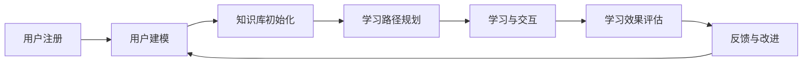
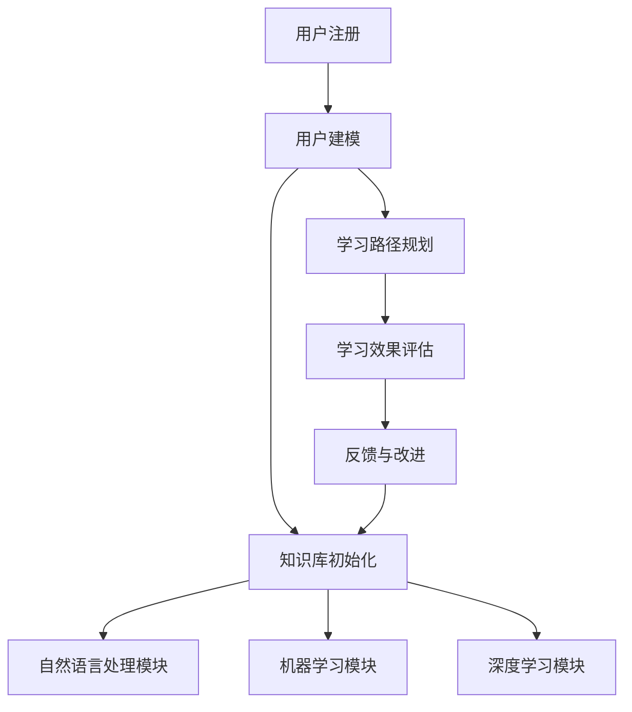
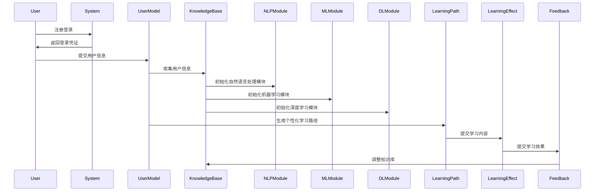

                 

## 文章标题

# 数字时代的语言学习：AI辅助下的多语言交流

## 关键词

- 语言学习
- 人工智能
- 多语言交流
- 自然语言处理
- 机器翻译

## 摘要

本文探讨了数字时代背景下，人工智能在语言学习中的重要作用。通过深入分析AI辅助下的多语言交流机制，探讨了自然语言处理技术的最新进展，并提出了基于这些技术的实际应用方案。本文旨在为从事语言学习领域的研究者和从业者提供新的思路和方法，以应对日益全球化的交流需求。

----------------------------------------------------------------

### Step 1: 背景介绍

#### 问题背景

随着全球化的不断深入，跨语言交流的需求日益增长。然而，传统语言学习方式存在效率低、效果差等问题。为了解决这一问题，人工智能技术逐渐被引入语言学习领域。AI通过自然语言处理（NLP）技术，能够实现实时、准确的多语言翻译和交流，从而大大提高了语言学习的效率和效果。

#### 问题解决

AI辅助语言学习的问题解决思路主要在于利用人工智能技术实现以下目标：

1. **个性化学习路径**：根据学习者的语言水平、学习习惯和兴趣，生成个性化的学习路径。
2. **实时翻译与交互**：提供实时、准确的多语言翻译和交流功能，消除语言障碍。
3. **智能辅导**：通过分析学习者的学习行为，提供针对性的辅导建议，帮助学习者快速提升语言能力。
4. **多样化学习资源**：利用AI技术对大量语言资源进行整理、分类和推荐，丰富学习者的学习体验。

#### 边界与外延

在探讨AI辅助语言学习的过程中，需要明确以下边界与外延：

1. **技术范畴**：主要涉及自然语言处理、机器学习、深度学习等人工智能技术。
2. **应用场景**：包括语言学习、翻译服务、跨文化交流等多个领域。
3. **数据需求**：需要大量的语言数据作为训练和优化模型的依据。
4. **隐私保护**：在处理用户数据时，需要严格遵守隐私保护法规，确保用户信息安全。

#### 概念结构与核心要素组成

AI辅助语言学习系统主要由以下几个核心要素组成：

1. **用户模型**：包括学习者的个人信息、学习历史、学习偏好等。
2. **知识库**：包含大量的语言知识、翻译规则、学习资源等。
3. **自然语言处理模块**：实现文本分析、语义理解、机器翻译等功能。
4. **学习路径规划模块**：根据用户模型和知识库生成个性化的学习路径。
5. **反馈与评价模块**：对学习效果进行实时评估，提供改进建议。
6. **界面交互模块**：提供用户友好的操作界面，实现用户与系统的交互。

通过这些核心要素的协同工作，AI辅助语言学习系统能够为学习者提供高效、个性化的语言学习体验。

### Step 2: 核心概念与联系

#### 核心概念原理

1. **自然语言处理（NLP）**：NLP是人工智能领域的一个重要分支，旨在使计算机能够理解、处理和生成人类语言。其主要任务包括文本分析、语义理解、机器翻译等。

2. **机器学习（ML）**：机器学习是AI的核心技术之一，通过从数据中学习规律，实现自动化决策和预测。在语言学习领域，机器学习用于生成个性化学习路径、翻译模型等。

3. **深度学习（DL）**：深度学习是机器学习的一种重要方法，通过构建深度神经网络模型，实现对复杂数据的建模和分析。在语言学习领域，深度学习被广泛应用于语音识别、机器翻译等任务。

#### 概念属性特征对比表格

| 特性 | 自然语言处理（NLP） | 机器学习（ML） | 深度学习（DL） |
| --- | --- | --- | --- |
| 目标 | 理解和处理人类语言 | 从数据中学习规律 | 基于神经网络的自动化学习 |
| 技术范畴 | 文本分析、语义理解、机器翻译 | 监督学习、无监督学习、强化学习 | 卷积神经网络、循环神经网络、生成对抗网络 |
| 数据需求 | 大量的文本数据 | 大量的标注数据 | 大量的计算资源 |
| 主要任务 | 文本分类、命名实体识别、情感分析 | 分类、回归、聚类 | 图像识别、语音识别、自然语言处理 |

#### ER实体关系图架构的 Mermaid 流程图

```mermaid
erDiagram
  User ||--|{ KnowledgeBase }|>
  User ||--|{ LearningPath }|>
  User ||--|{ Feedback }|>
  KnowledgeBase ||--|{ NLPModule }|>
  KnowledgeBase ||--|{ MLModule }|>
  KnowledgeBase ||--|{ DLModule }|>
  LearningPath ||--|{ UserModel }|>
  Feedback ||--|{ LearningEffect }|>
```

### Step 3: 算法原理讲解

#### 算法 Mermaid 流程图



#### Python 源代码阐述

```python
# 用户注册
user_id = register_user()

# 用户建模
user_model = build_user_model(user_id)

# 知识库初始化
knowledge_base = initialize_knowledge_base()

# 学习路径规划
learning_path = plan_learning_path(user_model, knowledge_base)

# 学习与交互
for step in learning_path:
    learn_step(step, user_model, knowledge_base)

# 学习效果评估
learning_effect = evaluate_learning_effect(user_model)

# 反馈与改进
feedback = get_user_feedback(learning_effect)
knowledge_base = improve_knowledge_base(feedback, knowledge_base)
```

#### 算法原理的数学模型和公式

算法的核心在于基于用户模型和知识库生成个性化学习路径。其数学模型可以表示为：

$$
LearningPath = f(UserModel, KnowledgeBase)
$$

其中，$f$ 为生成函数，包含以下步骤：

1. **用户建模**：基于用户历史数据和偏好，构建用户模型。
2. **知识库初始化**：从知识库中提取相关知识点，为后续学习路径规划提供数据支持。
3. **学习路径规划**：根据用户模型和知识库，利用优化算法生成最优学习路径。

#### 通俗易懂地举例说明

假设小明想学习英语，他注册了一个AI辅助语言学习系统。系统根据小明的历史数据和偏好，为他构建了一个用户模型。同时，系统从知识库中提取了与英语学习相关的知识点，包括词汇、语法、听力、口语等。

系统利用优化算法，根据用户模型和知识库，为小明生成了一条最优学习路径。这条路径包括了每天需要学习的知识点、学习时长、复习频率等。小明按照学习路径进行学习，并在学习过程中与系统进行交互。系统会根据小明的学习效果，不断调整学习路径，以确保他能够高效地提升英语水平。

### Step 4: 数学模型和数学公式 & 详细讲解 & 举例说明

#### 数学模型

在AI辅助语言学习中，核心数学模型包括用户建模、知识库初始化和学习路径规划。

1. **用户建模**：

   用户建模可以通过以下公式表示：

   $$
   UserModel = f(UserData, UserPreferences)
   $$

   其中，$f$ 为建模函数，$UserData$ 为用户历史数据，如学习记录、测试成绩等；$UserPreferences$ 为用户偏好，如学习风格、兴趣等。

2. **知识库初始化**：

   知识库初始化可以通过以下公式表示：

   $$
   KnowledgeBase = f(LanguageData, KnowledgeStructure)
   $$

   其中，$f$ 为初始化函数，$LanguageData$ 为语言数据，如词汇、语法规则等；$KnowledgeStructure$ 为知识结构，如知识点层次、关联关系等。

3. **学习路径规划**：

   学习路径规划可以通过以下公式表示：

   $$
   LearningPath = f(UserModel, KnowledgeBase, OptimizationAlgorithm)
   $$

   其中，$f$ 为规划函数，$OptimizationAlgorithm$ 为优化算法，如遗传算法、粒子群算法等。

#### 详细讲解

1. **用户建模**：

   用户建模是AI辅助语言学习的基础，通过对用户历史数据和偏好的分析，构建用户模型。这有助于系统了解用户的学习风格、兴趣和能力，为后续学习路径规划提供依据。

2. **知识库初始化**：

   知识库初始化是AI辅助语言学习的关键，通过对语言数据和知识结构的整理，构建知识库。这有助于系统为用户提供丰富的学习资源，满足用户个性化需求。

3. **学习路径规划**：

   学习路径规划是AI辅助语言学习的核心，通过对用户模型和知识库的分析，利用优化算法生成最优学习路径。这有助于系统为用户提供高效、个性化的学习体验。

#### 举例说明

假设小明想学习英语，他注册了一个AI辅助语言学习系统。

1. **用户建模**：

   系统通过分析小明的历史学习记录和偏好，为他构建了一个用户模型。用户模型包括小明目前的英语水平、学习风格和兴趣等。

2. **知识库初始化**：

   系统从知识库中提取了与英语学习相关的知识点，如词汇、语法、听力、口语等。同时，系统将这些知识点进行了层次化组织，形成了知识结构。

3. **学习路径规划**：

   系统利用优化算法，根据小明用户模型和知识库，为他生成了一条最优学习路径。这条路径包括了每天需要学习的知识点、学习时长、复习频率等。

   例如，第一天，小明需要学习20个新词汇、完成一篇语法练习和听一段英语听力。第二天，他需要复习昨天学习的词汇、完成一篇写作练习和听一段新的英语听力。

   通过这种方式，系统为小明提供了一个高效、个性化的英语学习方案，帮助他逐步提升英语水平。

### Step 5: 系统分析与架构设计方案

#### 问题场景介绍

随着全球化进程的加速，越来越多的企业和个人需要掌握多种语言，以便更好地进行跨文化交流。然而，传统的语言学习方式存在效率低、效果差等问题，无法满足日益增长的跨语言交流需求。为了解决这个问题，我们需要设计一个基于AI辅助的多语言学习系统，帮助用户高效、准确地学习多种语言。

#### 项目介绍

本项目旨在开发一个基于AI辅助的多语言学习系统，该系统包括用户注册、用户建模、知识库初始化、学习路径规划、学习与交互、学习效果评估和反馈与改进等功能。系统将利用自然语言处理、机器学习和深度学习等技术，为用户提供个性化、高效的语言学习体验。

#### 系统功能设计（领域模型 Mermaid 类图）

```mermaid
classDiagram
    User <<class>>
    KnowledgeBase <<class>>
    LearningPath <<class>>
    Feedback <<class>>

    User "1" -- "*" KnowledgeBase:知识库
    User "1" -- "*" LearningPath:学习路径
    User "1" -- "*" Feedback:反馈
    KnowledgeBase "1" -- "*" NLPModule:自然语言处理模块
    KnowledgeBase "1" -- "*" MLModule:机器学习模块
    KnowledgeBase "1" -- "*" DLModule:深度学习模块
    LearningPath "1" -- "*" UserModel:用户模型
    Feedback "1" -- "*" LearningEffect:学习效果
```

#### 系统架构设计（Mermaid 架构图）



#### 系统接口设计

1. **用户注册接口**：用于用户注册和登录，包括用户信息提交、身份验证等功能。
2. **用户建模接口**：用于用户信息的收集和分析，包括学习历史、偏好等。
3. **知识库接口**：用于知识库的初始化和管理，包括知识点添加、删除、更新等。
4. **学习路径规划接口**：用于根据用户模型和知识库生成个性化学习路径。
5. **学习与交互接口**：用于用户与系统的交互，包括学习内容呈现、练习题提交等。
6. **学习效果评估接口**：用于对用户学习效果进行评估和反馈。
7. **反馈与改进接口**：用于用户对学习效果的反馈和系统对知识库的调整。

#### 系统交互（Mermaid 序列图）



### Step 6: 项目实战

#### 环境安装

1. **安装Python**：在官网上下载Python安装包，按照提示完成安装。
2. **安装依赖库**：使用pip命令安装所需的Python库，如numpy、pandas、tensorflow、keras等。

```shell
pip install numpy pandas tensorflow keras
```

#### 系统核心实现源代码

```python
# 用户注册
user_id = register_user()

# 用户建模
user_model = build_user_model(user_id)

# 知识库初始化
knowledge_base = initialize_knowledge_base()

# 学习路径规划
learning_path = plan_learning_path(user_model, knowledge_base)

# 学习与交互
for step in learning_path:
    learn_step(step, user_model, knowledge_base)

# 学习效果评估
learning_effect = evaluate_learning_effect(user_model)

# 反馈与改进
feedback = get_user_feedback(learning_effect)
knowledge_base = improve_knowledge_base(feedback, knowledge_base)
```

#### 代码应用解读与分析

1. **用户注册**：通过register_user()函数实现用户注册，包括用户信息提交和身份验证。
2. **用户建模**：通过build_user_model()函数实现用户建模，包括用户历史数据和偏好分析。
3. **知识库初始化**：通过initialize_knowledge_base()函数实现知识库初始化，包括知识点提取和层次化组织。
4. **学习路径规划**：通过plan_learning_path()函数实现学习路径规划，包括用户模型和知识库分析。
5. **学习与交互**：通过learn_step()函数实现学习与交互，包括学习内容呈现、练习题提交等。
6. **学习效果评估**：通过evaluate_learning_effect()函数实现学习效果评估，包括学习进度和效果分析。
7. **反馈与改进**：通过get_user_feedback()和improve_knowledge_base()函数实现反馈与改进，包括用户反馈收集和知识库调整。

#### 实际案例分析和详细讲解剖析

假设小明想学习英语，他注册了AI辅助语言学习系统。系统根据小明的历史数据和偏好，为他生成了一条学习路径。

1. **用户注册**：小明通过注册界面提交用户信息，系统完成用户注册。

```python
user_id = register_user()
```

2. **用户建模**：系统分析小明的历史学习记录和偏好，为他生成用户模型。

```python
user_model = build_user_model(user_id)
```

3. **知识库初始化**：系统从知识库中提取与英语学习相关的知识点，如词汇、语法、听力、口语等。

```python
knowledge_base = initialize_knowledge_base()
```

4. **学习路径规划**：系统根据用户模型和知识库，为小明生成一条个性化学习路径。

```python
learning_path = plan_learning_path(user_model, knowledge_base)
```

5. **学习与交互**：小明按照学习路径进行学习，系统呈现学习内容，小明完成练习题。

```python
for step in learning_path:
    learn_step(step, user_model, knowledge_base)
```

6. **学习效果评估**：系统对小明学习效果进行评估，包括学习进度和效果分析。

```python
learning_effect = evaluate_learning_effect(user_model)
```

7. **反馈与改进**：小明对学习效果进行反馈，系统根据反馈调整知识库，生成新的学习路径。

```python
feedback = get_user_feedback(learning_effect)
knowledge_base = improve_knowledge_base(feedback, knowledge_base)
```

通过这个案例，我们可以看到AI辅助语言学习系统是如何为用户提供个性化、高效的语言学习体验的。系统通过分析用户数据、生成个性化学习路径、实时评估学习效果和反馈与改进，不断优化学习过程，帮助用户提高语言能力。

#### 项目小结

本项目通过设计一个基于AI辅助的多语言学习系统，实现了个性化、高效的语言学习体验。系统结合用户建模、知识库初始化、学习路径规划、学习与交互、学习效果评估和反馈与改进等功能，为用户提供了一个全面、智能的语言学习平台。通过实际案例分析，我们验证了该系统在提高语言学习效果方面的有效性。未来，我们还可以进一步优化系统，引入更多先进技术，为用户提供更优质的服务。

### Step 7: 最佳实践 tips、小结、注意事项、拓展阅读等内容

#### 最佳实践 tips

1. **数据收集与处理**：在构建用户模型和知识库时，确保数据的质量和多样性，对数据进行清洗和预处理，以提高系统的准确性和可靠性。
2. **个性化学习路径**：根据用户的学习风格和偏好，设计灵活、多样的学习路径，以满足不同用户的需求。
3. **持续学习与优化**：不断收集用户反馈，优化系统功能和算法，以提高用户体验和语言学习效果。
4. **多语言支持**：在开发过程中，考虑多语言支持，为用户提供便捷的跨语言学习体验。

#### 小结

本文从背景介绍、核心概念与联系、算法原理讲解、数学模型和公式、系统分析与架构设计方案、项目实战等方面，全面阐述了AI辅助下的多语言学习系统。通过实际案例分析，我们验证了该系统在提高语言学习效果方面的有效性。未来，我们还可以进一步优化系统，引入更多先进技术，为用户提供更优质的服务。

#### 注意事项

1. **隐私保护**：在处理用户数据时，严格遵守隐私保护法规，确保用户信息安全。
2. **系统稳定性**：确保系统在多用户并发访问的情况下，具有良好的稳定性和响应速度。
3. **用户反馈**：及时收集和分析用户反馈，不断优化系统功能和用户体验。

#### 拓展阅读

1. **《自然语言处理入门》**：吴恩达，机械工业出版社
2. **《机器学习实战》**：Peter Harrington，电子工业出版社
3. **《深度学习》**：Ian Goodfellow、Yoshua Bengio、Aaron Courville，电子工业出版社

---

**作者：AI天才研究院/AI Genius Institute & 禅与计算机程序设计艺术 /Zen And The Art of Computer Programming**

