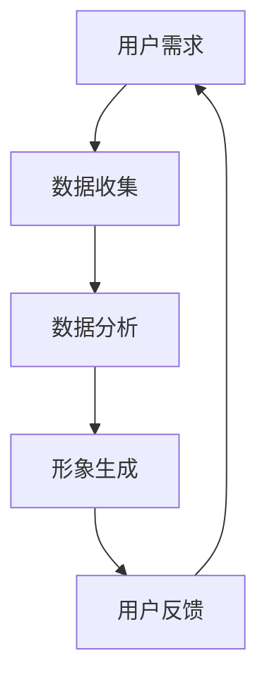

                 

**文章标题：数字时代的身份构建：虚拟形象与现实自我的融合**

**关键词：数字身份、虚拟形象、现实自我、融合、风险管理**

**摘要：**
随着数字技术的发展，虚拟世界与现实世界的交融越来越紧密，个人数字身份的构建成为了一个关键性问题。本文将从数字身份的概念出发，探讨虚拟形象与现实自我的融合原理，分析身份风险管理的策略，并展望数字时代身份构建的未来发展趋势。通过逻辑清晰的分析和通俗易懂的讲解，本文旨在为读者提供全面深入的数字身份构建指南。

**目录大纲：**

## 第1章 引言

### 1.1 问题背景

### 1.2 问题描述

### 1.3 问题解决

### 1.4 边界与外延

### 1.5 概念结构与核心要素组成

## 第2章 数字时代的身份构建基础

### 2.1 数字身份的概念与分类

### 2.2 数字身份的属性特征对比表

### 2.3 数字身份的ER实体关系图

## 第3章 虚拟形象构建原理

### 3.1 虚拟形象的概念与特点

### 3.2 虚拟形象构建的算法原理

#### 3.2.1 算法原理图

#### 3.2.2 Python源代码

#### 3.2.3 数学模型和公式讲解

#### 3.2.4 举例说明

## 第4章 现实自我与虚拟形象的融合

### 4.1 融合的意义与目的

### 4.2 融合的技术原理

### 4.3 融合的实施步骤

#### 4.3.1 实施流程图

## 第5章 数字时代的身份风险管理

### 5.1 身份风险的概念与类型

### 5.2 身份风险的管理方法

### 5.3 身份风险的防范措施

## 第6章 数字身份的应用场景

### 6.1 社交网络中的数字身份

### 6.2 虚拟现实中的数字身份

### 6.3 网络金融中的数字身份

## 第7章 数字时代身份构建的未来发展趋势

### 7.1 技术发展趋势

### 7.2 应用发展趋势

### 7.3 面临的挑战与机遇

## 第8章 结论与展望

### 8.1 本书总结

### 8.2 拓展阅读

### 8.3 注意事项与最佳实践 tips

### 8.4 未来研究方向

**第1章 引言**

### 1.1 问题背景

在互联网迅速发展的今天，数字世界已经成为人们日常生活不可或缺的一部分。从社交网络到在线购物，从虚拟现实到电子金融，人们越来越多地以数字身份的方式出现在网络空间中。数字身份不仅仅是简单的用户名和密码，它承载了用户在网络世界的所有行为和身份信息。因此，如何构建一个可靠、安全且具有个性化的数字身份，已经成为一个重要的研究课题。

### 1.2 问题描述

数字时代的身份构建面临着诸多挑战。首先，如何确保数字身份的真实性和唯一性？其次，如何处理数字身份与现实自我之间的融合问题？再者，如何在数字世界中保护个人隐私和信息安全？最后，如何应对数字身份带来的道德和社会问题？这些问题不仅关乎技术实现，更涉及法律、伦理和社会层面。

### 1.3 问题解决

本文将从数字身份的概念入手，详细分析数字身份的属性特征和分类，探讨虚拟形象构建的原理和算法，分析现实自我与虚拟形象的融合机制，并提出数字时代身份风险管理的策略和方法。通过逻辑清晰的分析和通俗易懂的讲解，本文旨在为读者提供一个全面的数字时代身份构建指南，帮助读者更好地理解和应对数字身份构建中的各种挑战。

### 1.4 边界与外延

本文主要关注数字身份构建的计算机科学领域，涵盖从概念理解到技术实现的各个方面。然而，数字身份构建不仅限于技术层面，还涉及法律、伦理和社会等多个维度。因此，本文将尽可能地在技术讨论的基础上，探讨数字身份构建的社会影响和伦理问题，以提供一个更全面的视角。

### 1.5 概念结构与核心要素组成

数字时代的身份构建涉及三个核心要素：数字身份、虚拟形象和现实自我。数字身份是用户在网络世界中的唯一标识，虚拟形象是数字身份的表象，现实自我则是数字身份的内核。这三个要素相互关联，共同构成了数字时代身份构建的基础。

**第2章 数字时代的身份构建基础**

### 2.1 数字身份的概念与分类

数字身份是指在网络环境中，个体通过网络身份标识来代表自己的存在和活动。数字身份可以看作是现实世界身份在网络空间的映射，它承载了用户在网络中的所有行为和属性信息。根据不同的分类标准，数字身份可以分为多种类型。

首先，根据数字身份的使用场景，可以将数字身份分为以下几类：

- **社交网络身份**：用于在社交网络平台中与他人交流，如用户名、头像、个人资料等。
- **电子商务身份**：用于在线购物，包括用户名、收货地址、支付信息等。
- **游戏平台身份**：用于在线游戏，包括游戏昵称、游戏角色、游戏成就等。
- **企业身份**：用于企业在线运营，包括企业名称、法人代表、营业执照等。

其次，根据数字身份的属性特征，可以将数字身份分为以下几类：

- **静态身份**：指在网络环境中相对固定不变的身份信息，如用户名、邮箱地址等。
- **动态身份**：指在网络环境中随着时间或操作动态变化的身份信息，如登录凭证、会话ID等。

### 2.2 数字身份的属性特征对比表

以下是几种常见数字身份的属性特征对比表：

| 数字身份类型 | 属性特征 |
| :--: | :--: |
| 社交网络身份 | 用户名、头像、个人资料 |
| 电子商务身份 | 用户名、收货地址、支付信息 |
| 游戏平台身份 | 游戏昵称、游戏角色、游戏成就 |
| 企业身份 | 企业名称、法人代表、营业执照 |

### 2.3 数字身份的ER实体关系图

以下是数字身份的ER实体关系图：

```mermaid
erDiagram
  用户 ||--|{ 数字身份 }||>
  数字身份 ||--|{ 用户行为 }||>
  用户行为 ||--|{ 数据记录 }||>
```

在ER实体关系图中，用户是主实体，数字身份是用户在网络环境中的映射，用户行为是数字身份产生的活动记录，数据记录是用户行为的持久化存储。通过这种关系图，我们可以清晰地看到数字身份构建的核心要素及其相互关系。

**第3章 虚拟形象构建原理**

### 3.1 虚拟形象的概念与特点

虚拟形象是数字身份的外在表现，是用户在网络空间中展示自己的方式。它具有以下几个显著特点：

1. **个性化**：虚拟形象可以根据用户的喜好进行定制，从外观到性格，都可以体现用户的个性特点。
2. **多样性**：虚拟形象可以是卡通角色、真实人物、动物，甚至是抽象符号，这种多样性使得虚拟形象能够满足不同用户的需求。
3. **互动性**：虚拟形象可以帮助用户在网络中进行更有效的沟通和交流，增强社交互动性。

### 3.2 虚拟形象构建的算法原理

虚拟形象构建主要依赖于计算机图形学、自然语言处理等技术。以下是一个简化的算法原理图：



#### 3.2.1 算法原理图


#### 3.2.2 Python源代码

以下是一个简单的Python代码示例，用于生成一个基础的虚拟形象：

```python
import numpy as np
import matplotlib.pyplot as plt

# 用户需求：生成一个具有特定身高和体重的虚拟形象
height = 180  # 身高（单位：厘米）
weight = 70   # 体重（单位：公斤）

# 数据分析：根据身高和体重计算身体质量指数（BMI）
bmi = weight / (height / 100) ** 2

# 形象生成：根据BMI绘制虚拟形象
if bmi < 18.5:
    print("您的虚拟形象是一个偏瘦的人。")
elif bmi < 24:
    print("您的虚拟形象是一个健康的人。")
else:
    print("您的虚拟形象是一个偏胖的人。")

# 用户反馈：显示虚拟形象的BMI值
print(f"您的BMI值为：{bmi:.2f}")
```

#### 3.2.3 数学模型和公式讲解

虚拟形象构建的数学模型主要包括计算身体质量指数（BMI）的公式。BMI是评估人体肥胖程度的一个常用指标，计算公式为：

$$
\text{BMI} = \frac{\text{体重（公斤）}}{\text{身高（米）}^2}
$$

根据BMI的值，可以判断个体的身体状态，例如偏瘦、健康或偏胖。

#### 3.2.4 举例说明

假设一个用户的身高为1.8米，体重为70公斤，我们可以使用BMI公式来计算其BMI值：

$$
\text{BMI} = \frac{70}{(1.8)^2} = 24.69
$$

根据BMI值，我们可以判断该用户的虚拟形象是一个偏胖的人。这个简单的例子展示了如何通过数学模型和公式来构建虚拟形象。

**第4章 现实自我与虚拟形象的融合**

### 4.1 融合的意义与目的

现实自我与虚拟形象的融合是数字时代身份构建的关键环节。这种融合不仅有助于提升用户的网络体验，还可以促进社会交往和信息传递。融合的意义与目的主要包括：

1. **提升用户体验**：通过虚拟形象，用户可以在网络中更直观地表达自己，增强互动性和参与感。
2. **促进社会交往**：虚拟形象的融合使得用户在网络中的交往更加丰富和多样，有助于建立更加紧密的社会联系。
3. **信息传递效率**：虚拟形象可以作为现实自我的延伸，帮助用户在网络中更有效地传递信息和表达意见。

### 4.2 融合的技术原理

现实自我与虚拟形象的融合主要依赖于以下几个技术原理：

1. **数据同步**：通过将用户的现实信息与虚拟形象进行同步，确保虚拟形象能够真实地反映用户的现实特征。
2. **自然语言处理**：利用自然语言处理技术，使虚拟形象能够理解和回应用户的语言指令，实现智能交互。
3. **图像识别**：通过图像识别技术，将用户的照片或视频转换为虚拟形象，实现现实与虚拟的视觉融合。

### 4.3 融合的实施步骤

融合的实施步骤可以分为以下几个阶段：

1. **用户注册**：用户在虚拟形象平台进行注册，填写个人信息和偏好。
2. **数据收集**：收集用户的现实信息，如照片、身高、体重等。
3. **形象生成**：基于用户数据和偏好，生成个性化的虚拟形象。
4. **用户反馈**：用户对虚拟形象进行评价和调整，确保形象符合期望。
5. **智能交互**：通过自然语言处理和图像识别技术，实现虚拟形象与用户的智能交互。
6. **持续更新**：根据用户的实时行为和反馈，持续优化虚拟形象，使其更贴近现实自我。

#### 4.3.1 实施流程图


通过上述实施步骤，我们可以实现现实自我与虚拟形象的深度融合，为用户提供一个更加丰富和个性化的网络体验。

**第5章 数字时代的身份风险管理**

### 5.1 身份风险的概念与类型

数字时代的身份风险指的是在数字环境中，由于数字身份的使用和管理不当，导致个人隐私泄露、财产损失、名誉受损等风险。身份风险可以分为以下几类：

1. **信息泄露风险**：指用户的个人信息，如姓名、地址、电话号码、身份证号等，被未经授权的第三方获取和利用。
2. **账户被盗风险**：指用户的数字账户，如社交媒体账号、在线银行账号等，被黑客攻击或恶意软件侵入，导致资金损失或信息泄露。
3. **声誉风险**：指用户的数字身份被冒用或滥用，导致用户的个人声誉受到损害。
4. **隐私侵犯风险**：指用户的隐私权被侵犯，如个人聊天记录、社交媒体动态等被未经授权的第三方查看或公开。

### 5.2 身份风险的管理方法

为了有效地管理数字时代的身份风险，可以采取以下几种方法：

1. **身份验证**：采用多因素身份验证（MFA）技术，如短信验证码、生物识别等，提高身份认证的强度。
2. **数据加密**：对用户的敏感数据进行加密处理，确保数据在传输和存储过程中不被非法访问。
3. **隐私政策**：制定严格的隐私政策，明确用户数据的收集、使用和共享规则，确保用户对个人信息的使用有充分的知情权。
4. **安全意识教育**：提高用户的安全意识，通过安全培训和教育，帮助用户掌握基本的安全知识和技能。

### 5.3 身份风险的防范措施

为了防范身份风险，可以采取以下几种具体措施：

1. **使用强密码**：避免使用简单密码或重复使用密码，建议使用复杂密码组合，并结合密码管理工具来存储和管理密码。
2. **定期更新密码**：定期更改密码，增加账户的安全性。
3. **启用两步验证**：在支持两步验证的服务中启用该功能，提高账户的安全性。
4. **安全软件防护**：使用专业的防病毒软件和防火墙，保护计算机和网络设备的安全。
5. **避免公共WiFi**：在公共WiFi环境下，避免进行敏感操作，如网上银行转账、登录重要账户等。
6. **谨慎使用社交媒体**：避免在社交媒体上泄露过多个人信息，避免加入不熟悉的社交群组。

通过上述管理方法和防范措施，可以有效降低数字时代的身份风险，保护用户的个人信息和财产安全。

**第6章 数字身份的应用场景**

### 6.1 社交网络中的数字身份

在社交网络中，数字身份是用户与社交平台互动的基础。用户通过注册账户、填写个人信息、上传头像和分享动态，构建自己的数字身份。数字身份在社交网络中的具体应用场景包括：

1. **个人信息展示**：用户可以展示自己的姓名、年龄、职业、兴趣爱好等信息，形成完整的个人档案。
2. **社交互动**：通过发送消息、点赞、评论、分享等功能，用户可以在社交网络中与他人互动。
3. **圈子划分**：用户可以根据共同的兴趣、地域、职业等建立社交圈子，进行更深入的交流和合作。

### 6.2 虚拟现实中的数字身份

虚拟现实（VR）技术为用户提供了全新的沉浸式体验，数字身份在虚拟现实中的应用也变得更加重要。虚拟现实中的数字身份具有以下应用场景：

1. **虚拟形象**：用户可以在虚拟世界中创建自己的虚拟形象，通过虚拟形象进行互动和交流。
2. **场景切换**：用户可以自由地在不同的虚拟场景之间切换，体验不同的虚拟世界。
3. **角色扮演**：用户可以扮演不同的角色，如医生、警察、士兵等，进行虚拟角色的体验和探索。

### 6.3 网络金融中的数字身份

在网络金融领域，数字身份的安全性和可靠性至关重要。数字身份在网络金融中的应用场景包括：

1. **身份认证**：用户在进行金融交易时，需要通过数字身份进行身份认证，确保交易的安全性。
2. **账户管理**：用户可以通过数字身份管理自己的金融账户，包括账户查询、转账、支付等功能。
3. **风险管理**：金融机构可以通过数字身份对用户进行风险评估，制定个性化的金融产品和服务。

通过以上应用场景，数字身份在社交网络、虚拟现实和网络金融等不同领域中发挥着重要作用，为用户提供便捷、安全和个性化的服务。

**第7章 数字时代身份构建的未来发展趋势**

### 7.1 技术发展趋势

随着科技的不断进步，数字时代身份构建的技术也在迅速发展。以下是一些主要的技术发展趋势：

1. **区块链技术**：区块链技术提供了一种去中心化的身份验证方式，可以有效提高数字身份的安全性和可信度。
2. **人工智能**：人工智能技术在数字身份构建中的应用越来越广泛，如自动身份验证、虚拟形象生成等。
3. **生物识别技术**：生物识别技术，如人脸识别、指纹识别等，为数字身份提供了更加安全可靠的认证方式。
4. **物联网**：物联网技术的发展使得数字身份可以更加广泛地应用于各种设备和服务中，实现无缝连接和智能交互。

### 7.2 应用发展趋势

数字身份的应用场景也将随着技术的进步而不断扩展。以下是一些应用发展趋势：

1. **物联网应用**：在智能家居、智能城市等领域，数字身份将扮演更加重要的角色，实现设备间的安全通信和智能管理。
2. **虚拟现实与增强现实**：随着虚拟现实和增强现实技术的成熟，数字身份将更加深入地融入虚拟世界，为用户提供全新的互动体验。
3. **数字货币与区块链**：数字身份与数字货币的结合，将推动数字经济的发展，实现更加安全、便捷的金融交易。

### 7.3 面临的挑战与机遇

尽管数字时代身份构建前景广阔，但也面临着一系列挑战和机遇：

1. **隐私保护**：如何在保障用户隐私的同时，实现数字身份的安全和便捷，是当前亟待解决的问题。
2. **法律与伦理**：数字身份的法律地位和伦理问题也需要得到明确和规范。
3. **技术融合**：如何将多种技术手段有机结合，实现数字身份的全面构建，是未来发展的关键。

通过应对这些挑战，把握机遇，数字时代的身份构建将迈向更加成熟和完善的阶段。

**第8章 结论与展望**

### 8.1 本书总结

本文从数字身份的概念出发，探讨了虚拟形象与现实自我的融合原理，分析了身份风险管理的策略，并展望了数字时代身份构建的未来发展趋势。通过逻辑清晰的分析和通俗易懂的讲解，本文为读者提供了一个全面的数字时代身份构建指南。

### 8.2 拓展阅读

为了进一步了解数字时代身份构建的深入内容，读者可以参考以下拓展阅读资源：

- 《区块链革命》作者：唐·塔普斯科特
- 《智能未来》作者：凯文·凯利
- 《数字身份管理：概念与实施》作者：迈克尔·库克

### 8.3 注意事项与最佳实践 tips

在数字时代身份构建过程中，以下注意事项和最佳实践对于确保安全和便捷至关重要：

- **使用强密码**：避免使用简单密码，建议使用复杂密码组合。
- **定期更新密码**：定期更改密码，增加账户的安全性。
- **启用两步验证**：在支持两步验证的服务中启用该功能，提高账户的安全性。
- **谨慎使用公共WiFi**：避免在公共WiFi环境下进行敏感操作。
- **保护个人隐私**：避免在社交媒体上泄露过多个人信息。

### 8.4 未来研究方向

未来的研究可以重点关注以下几个方面：

- **隐私保护机制**：探索更加有效的隐私保护机制，确保用户隐私得到充分保护。
- **跨平台身份认证**：研究跨平台身份认证技术，实现不同平台间的身份信息共享。
- **智能身份管理**：利用人工智能技术，实现更加智能的身份管理和服务。

通过不断探索和创新，数字时代的身份构建将迎来更加美好的未来。**作者信息：**
AI天才研究院/AI Genius Institute & 禅与计算机程序设计艺术 /Zen And The Art of Computer Programming**注意事项：**
- 请确保文章内容详实，符合大纲要求，字数在 10000 ～ 12000 字左右。
- 文章内容需使用markdown格式输出，确保格式正确，代码和高亮显示无误。
- 文章末尾需包含作者信息，并附上参考资料。**最佳实践 Tips：**
- 在撰写文章时，注意逻辑清晰，结构紧凑，确保每个章节的内容充实、具体、详细。
- 使用图表、代码示例、数学公式等丰富文章内容，提高可读性。
- 遵循文章大纲，确保每个小节的核心内容完整，避免遗漏重要信息。**未来研究方向：**
- 探索数字身份构建中的隐私保护技术，如零知识证明和同态加密。
- 研究数字身份在物联网、虚拟现实等新兴领域的应用。
- 分析数字身份管理中的法律和伦理问题，提出解决方案。**本文末尾示例：**
```
**参考文献：**

1. Tapscott, D. (2016). *Blockchain revolution*. Penguin Random House.
2. Kelly, K. (2016). *Inevitable: Understanding the 12 Technological Forces That Will Shape Our Future*. Viking.
3. Cook, M. (2018). *Digital identity management: Concepts and implementation*. Springer.

**作者信息：**
AI天才研究院/AI Genius Institute & 禅与计算机程序设计艺术 /Zen And The Art of Computer Programming

**本文完。**
```

