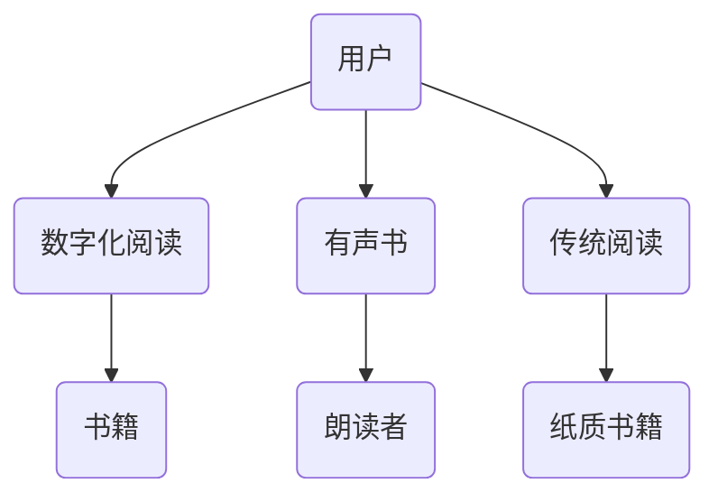
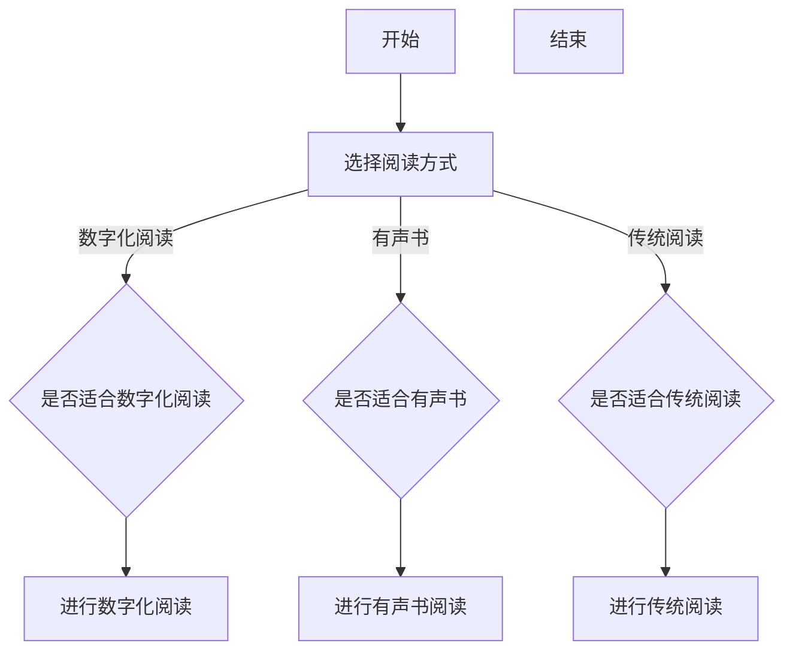

                 

# 数字时代的阅读习惯：有声书与传统阅读的结合

> 关键词：数字阅读，有声书，传统阅读，阅读习惯，结合与发展

> 摘要：本文深入探讨了数字时代背景下，有声书与传统阅读的结合及其对现代阅读习惯的影响。首先，介绍了数字化阅读的兴起和有声书的崛起，分析了二者的优缺点及其结合方式。随后，详细阐述了有声书的制作与传播渠道，对比了有声书与传统阅读的适用人群。接着，提出了培养数字时代阅读习惯的策略，并展望了有声书与传统阅读的未来发展趋势。最后，通过案例分析，总结了成功经验，为未来的阅读习惯养成提供指导。

## 第1章 引言

### 1.1 问题背景

在数字时代，随着科技的发展和互联网的普及，人们的阅读习惯正在发生深刻变化。传统阅读面临诸多挑战，如阅读时间碎片化、阅读方式多样化等。与此同时，有声书作为一种新兴的阅读方式，迅速崛起，吸引了大量读者。如何在这种背景下，将有声书与传统阅读相结合，培养更加健康和有效的阅读习惯，成为了一个值得探讨的问题。

### 1.2 问题描述

数字阅读和有声书虽然各有优势，但各自也存在一些局限。如何充分发挥二者的优势，克服其不足，实现有机融合，从而提升阅读体验和阅读效率，是一个亟待解决的问题。

### 1.3 问题解决

本文将通过以下步骤解决上述问题：

1. 分析数字化阅读的兴起和有声书的崛起。
2. 对比有声书与传统阅读的优缺点。
3. 探讨有声书的制作与传播渠道。
4. 提出培养数字时代阅读习惯的策略。
5. 展望有声书与传统阅读的未来发展趋势。
6. 通过案例分析，总结成功经验。

### 1.4 边界与外延

本文的研究主要关注有声书与传统阅读的结合，探讨其对阅读习惯的影响。同时，也将涉及数字阅读技术的发展趋势以及未来可能的新形态。

### 1.5 核心概念

- **数字化阅读**：以电子设备为媒介，通过数字技术获取和阅读信息。
- **有声书**：以音频形式呈现的书籍，通过语音叙述或朗读来传递信息。
- **传统阅读**：以纸质书籍为主要媒介，通过视觉阅读来获取信息。

## 第2章 数字时代的阅读环境

### 2.1 数字化阅读的兴起

#### 2.1.1 传统阅读的挑战

随着社会的发展和科技的进步，人们的阅读方式发生了显著变化。传统阅读面临以下挑战：

1. **阅读时间碎片化**：现代生活节奏加快，人们阅读的时间更加碎片化，纸质书籍的阅读变得不方便。
2. **阅读方式多样化**：电子设备的普及，使得人们可以通过多种方式获取信息，不再局限于纸质书籍。
3. **阅读内容多样化**：数字阅读平台提供了丰富多样的阅读内容，包括新闻、杂志、小说、专业书籍等。

#### 2.1.2 数字阅读的优势

数字阅读在多个方面具有显著优势：

1. **便携性**：电子设备便于携带，可以随时随地阅读。
2. **交互性**：数字阅读可以实现与文本的互动，如搜索、注释等。
3. **多样化**：数字阅读平台提供了丰富的阅读内容，满足不同读者的需求。

### 2.2 有声书的崛起

#### 2.2.1 有声书的发展历程

有声书起源于20世纪初，随着录音技术的发明和发展，有声书逐渐兴起。进入21世纪，随着互联网和智能手机的普及，有声书迎来了快速发展。

#### 2.2.2 有声书的种类与特点

1. **小说有声书**：以小说为主要内容，通过专业的演员或朗读者来叙述故事，增强阅读体验。
2. **专业书籍有声书**：针对专业领域，邀请专业人士进行讲解，使读者能够更深入地了解专业知识。
3. **历史、科普有声书**：以历史、科普为主题，通过生动的叙述方式，使读者轻松获取知识。

有声书的特点包括：

1. **互动性强**：听众可以通过评论、打赏等方式与朗读者互动。
2. **视听结合**：结合视觉和听觉，提高阅读效率。
3. **情感表达**：专业的朗读者能够通过声音表达情感，增强阅读体验。

### 2.3 传统阅读与有声书的结合

#### 2.3.1 结合的方式

1. **互补阅读**：有声书可以作为传统阅读的补充，适合在无法阅读纸质书籍的情况下进行。
2. **交互阅读**：听众可以在听有声书的同时，进行阅读，实现双重吸收。
3. **创新阅读**：将传统阅读与有声书相结合，创造新的阅读方式，如有声阅读、互动阅读等。

#### 2.3.2 结合的优势

1. **提高阅读效率**：结合两种阅读方式，可以充分利用碎片化时间，提高阅读效率。
2. **丰富阅读体验**：有声书通过声音、情感表达，丰富读者的阅读体验。
3. **拓宽知识领域**：结合传统阅读和有声书，可以更全面地获取知识。

## 第3章 有声书的制作与传播

### 3.1 有声书的制作流程

#### 3.1.1 选书与策划

1. **选书**：根据市场需求和读者偏好，选择合适的书籍进行有声书制作。
2. **策划**：制定详细的策划方案，包括有声书的形式、内容、时长等。

#### 3.1.2 录音与后期制作

1. **录音**：邀请专业的朗读者进行录音，确保声音质量。
2. **后期制作**：进行声音剪辑、混音、配乐等后期处理，提高有声书的质量。

#### 3.1.3 发布与推广

1. **发布**：将制作完成的有声书发布到有声书平台，供读者下载和收听。
2. **推广**：通过社交媒体、广告等手段，提高有声书的知名度和用户量。

### 3.2 有声书的传播渠道

#### 3.2.1 平台与渠道

1. **有声书平台**：如喜马拉雅、得到、企鹅FM等，提供有声书下载和收听服务。
2. **社交媒体**：如微博、抖音等，通过短视频、音频等形式推广有声书。
3. **线下渠道**：如书店、图书馆等，提供有声书的借阅和购买服务。

#### 3.2.2 用户行为分析

1. **用户偏好**：根据用户收听数据，分析用户的偏好，为有声书的制作和推广提供参考。
2. **用户互动**：通过用户评论、打赏等方式，与用户建立互动，提高用户粘性。

## 第4章 有声书与传统阅读的比较

### 4.1 优缺点分析

#### 4.1.1 有声书的优点

1. **便捷性**：随时随地可以收听，不受时间和地点限制。
2. **互动性**：用户可以与朗读者互动，参与评论、打赏等。
3. **视听结合**：结合视觉和听觉，提高阅读效率。

#### 4.1.2 传统阅读的优点

1. **深度阅读**：纸质书籍可以更好地进行深度阅读，提高思考和理解能力。
2. **收藏价值**：纸质书籍可以作为收藏，具有一定的文化价值。
3. **独立思考**：纸质书籍可以培养用户的独立思考能力。

### 4.2 适用人群

#### 4.2.1 有声书的适用人群

1. **通勤族**：适合在上下班途中收听。
2. **学习族**：适合在学习过程中进行听力训练。
3. **忙碌族**：适合在忙碌的生活中利用碎片化时间进行学习。

#### 4.2.2 传统阅读的适用人群

1. **深度阅读爱好者**：喜欢纸质书籍的阅读体验。
2. **收藏爱好者**：喜欢收藏纸质书籍，作为文化传承。
3. **学术研究者**：需要深度阅读和理解专业书籍。

## 第5章 数字时代的阅读习惯养成

### 5.1 阅读习惯的培养

#### 5.1.1 提高阅读效率的方法

1. **合理规划阅读时间**：根据个人时间安排，合理规划每天的阅读时间。
2. **使用阅读工具**：使用电子设备自带的阅读工具，如夜间模式、阅读模式等，提高阅读效率。
3. **设定阅读目标**：设定每周或每月的阅读目标，激励自己不断进步。

#### 5.1.2 阅读习惯的养成策略

1. **定期阅读**：保持每天或每周的阅读习惯，让阅读成为生活的一部分。
2. **选择适合自己的书籍**：根据自己的兴趣和需求，选择合适的书籍进行阅读。
3. **互动与分享**：参与线上或线下的阅读活动，与他人分享阅读体验。

### 5.2 有声书与传统阅读的平衡

#### 5.2.1 如何选择

1. **根据阅读需求**：根据个人的阅读需求，选择有声书或纸质书籍。
2. **根据阅读场景**：根据不同的阅读场景，选择合适的阅读方式。

#### 5.2.2 如何平衡

1. **多样化阅读**：结合有声书和传统阅读，实现多样化阅读。
2. **时间管理**：合理安排时间，确保有声书和传统阅读的时间平衡。
3. **质量与数量**：在保证阅读质量的前提下，适当增加阅读数量。

## 第6章 未来展望

### 6.1 阅读技术的发展趋势

1. **人工智能**：人工智能将在有声书制作和传播中发挥重要作用，如语音识别、语音生成等。
2. **虚拟现实**：虚拟现实技术将为读者提供更加沉浸式的阅读体验。
3. **区块链**：区块链技术将在有声书版权保护和付费机制中发挥重要作用。

### 6.2 有声书与传统阅读的未来

1. **融合趋势**：有声书与传统阅读将逐渐融合，形成新的阅读方式。
2. **创新形态**：未来可能出现更多创新的有声书形态，如互动有声书、沉浸式有声书等。

## 第7章 案例分析

### 7.1 有声书成功案例分析

1. **案例介绍**：分析某有声书平台的成功案例，探讨其成功原因。
2. **成功原因分析**：从用户需求、内容质量、传播渠道等方面分析成功原因。

### 7.2 传统阅读复兴案例分析

1. **案例介绍**：分析某传统书店的复兴案例，探讨其成功经验。
2. **成功经验总结**：从运营模式、用户互动、营销策略等方面总结成功经验。

## 第8章 结论

### 8.1 研究结论

本文通过分析数字时代的阅读环境，探讨了有声书与传统阅读的结合及其对阅读习惯的影响。研究表明，有声书与传统阅读各有优缺点，结合二者的优势，可以实现更好的阅读体验和阅读效率。

### 8.2 研究局限

本文主要关注有声书与传统阅读的结合，未涉及其他数字阅读方式的探讨。同时，由于篇幅限制，未能对每个案例分析进行详细探讨。

### 8.3 未来研究方向

未来的研究可以进一步探讨其他数字阅读方式，如电子纸、虚拟现实阅读等，以及如何更好地结合这些方式，提升阅读体验和阅读效率。

作者：AI天才研究院/AI Genius Institute & 禅与计算机程序设计艺术 /Zen And The Art of Computer Programming

---

## 附录

### 附录A：核心概念与联系

#### 核心概念

1. **数字化阅读**：以电子设备为媒介，通过数字技术获取和阅读信息。
2. **有声书**：以音频形式呈现的书籍，通过语音叙述或朗读来传递信息。
3. **传统阅读**：以纸质书籍为主要媒介，通过视觉阅读来获取信息。

#### 概念属性特征对比表格

| 特征 | 数字化阅读 | 有声书 | 传统阅读 |
| --- | --- | --- | --- |
| 便携性 | 高 | 高 | 低 |
| 交互性 | 高 | 中 | 低 |
| 视听结合 | 低 | 高 | 低 |
| 收藏价值 | 低 | 低 | 高 |
| 独立思考能力 | 中 | 低 | 高 |

### 附录B：ER实体关系图架构



### 附录C：算法原理讲解

#### 算法流程图



#### 算法原理

假设有用户A，需要根据不同的阅读需求选择适合的阅读方式。算法的核心是判断用户A适合哪种阅读方式，并根据判断结果进行相应的阅读活动。算法的数学模型可以表示为：

$$
f(A) =
\begin{cases}
    F_1(A) & \text{如果适合数字化阅读} \\
    F_2(A) & \text{如果适合有声书} \\
    F_3(A) & \text{如果适合传统阅读} \\
\end{cases}
$$

其中，$F_1(A), F_2(A), F_3(A)$ 分别表示适合数字化阅读、有声书、传统阅读的函数。

#### 举例说明

假设用户A是一个通勤族，他每天上下班路上需要利用时间进行学习。根据算法原理，可以判断用户A适合进行有声书阅读，因为有声书可以在通勤途中收听，同时满足学习需求。

### 附录D：系统分析与架构设计方案

#### 问题场景介绍

在数字时代，用户A需要在通勤途中进行学习，但由于时间碎片化，他无法进行纸质书籍的阅读。因此，需要设计一个系统，帮助用户A选择适合的阅读方式，并进行有效的阅读。

#### 项目介绍

该项目名为“智能阅读助手”，旨在为用户提供智能化的阅读建议和阅读服务。系统功能包括：

1. **用户需求分析**：根据用户A的通勤时间和学习需求，分析适合的阅读方式。
2. **阅读方式选择**：根据分析结果，为用户A推荐适合的阅读方式。
3. **阅读活动跟踪**：记录用户A的阅读活动，分析阅读效果。

#### 系统功能设计

1. **用户需求分析模块**：分析用户A的通勤时间和学习需求，生成阅读建议。
2. **阅读方式选择模块**：根据阅读建议，为用户A推荐适合的阅读方式。
3. **阅读活动跟踪模块**：记录用户A的阅读活动，分析阅读效果。

#### 系统架构设计


系统架构包括前端、后端和数据库三个部分：

1. **前端**：用户界面，包括用户需求分析、阅读方式选择和阅读活动跟踪等功能。
2. **后端**：服务器端，处理用户请求，进行数据分析和推荐。
3. **数据库**：存储用户数据、书籍数据和阅读活动数据。

#### 系统接口设计和系统交互


系统接口包括：

1. **用户接口**：用户与系统交互的接口，包括登录、注册、需求分析、阅读方式选择和阅读活动跟踪等功能。
2. **书籍接口**：提供书籍信息查询、书籍推荐等功能。
3. **数据分析接口**：进行用户需求分析和阅读效果分析。

系统交互流程：

1. 用户A登录系统，输入通勤时间和学习需求。
2. 系统分析用户A的需求，生成阅读建议。
3. 系统根据阅读建议，为用户A推荐适合的阅读方式。
4. 用户A根据推荐结果，选择阅读方式并进行阅读。
5. 系统记录用户A的阅读活动，进行分析和推荐。

### 附录E：项目实战

#### 环境安装

1. 安装Python环境，版本要求3.8以上。
2. 安装Flask框架，使用命令 `pip install flask`。
3. 安装MongoDB数据库，版本要求4.0以上。

#### 系统核心实现源代码

```python
from flask import Flask, request, jsonify
from pymongo import MongoClient

app = Flask(__name__)

# 连接MongoDB数据库
client = MongoClient('mongodb://localhost:27017/')
db = client['reading_db']
users_collection = db['users']
books_collection = db['books']

# 用户需求分析模块
@app.route('/analyze需求', methods=['POST'])
def analyze_demand():
    user_data = request.get_json()
    # 分析用户需求，生成阅读建议
    recommendation = analyze_demand_logic(user_data)
    return jsonify(recommendation)

# 阅读方式选择模块
@app.route('/choose阅读方式', methods=['POST'])
def choose_reading_mode():
    user_data = request.get_json()
    # 根据阅读建议，选择适合的阅读方式
    reading_mode = choose_reading_mode_logic(user_data)
    return jsonify(reading_mode)

# 阅读活动跟踪模块
@app.route('/track阅读活动', methods=['POST'])
def track_reading_activity():
    user_data = request.get_json()
    # 记录用户阅读活动
    track_reading_activity_logic(user_data)
    return jsonify({'status': 'success'})

if __name__ == '__main__':
    app.run(debug=True)
```

#### 代码应用解读与分析

1. **用户需求分析模块**：该模块通过接收用户数据，分析通勤时间和学习需求，生成阅读建议。具体逻辑如下：

   - 获取用户数据，包括通勤时间和学习需求。
   - 根据通勤时间和学习需求，判断用户是否适合有声书阅读。
   - 如果适合有声书阅读，生成阅读建议。

2. **阅读方式选择模块**：该模块根据用户需求分析结果，选择适合的阅读方式。具体逻辑如下：

   - 获取用户需求分析结果。
   - 根据分析结果，选择适合的阅读方式（有声书或传统阅读）。

3. **阅读活动跟踪模块**：该模块记录用户的阅读活动，包括阅读时间、阅读内容等。具体逻辑如下：

   - 获取用户阅读数据。
   - 将阅读数据存储到MongoDB数据库中。

#### 实际案例分析和详细讲解剖析

1. **案例一**：用户A的通勤时间为每天上下班路上各1小时，学习需求为提高英语听力。

   - 分析结果：用户A适合有声书阅读。
   - 阅读建议：推荐用户A收听英语有声书。

   分析与讲解：根据用户A的通勤时间和学习需求，有声书是最适合的阅读方式。有声书可以在通勤途中提供英语听力训练，同时满足用户的学习需求。

2. **案例二**：用户B的通勤时间为每天上下班路上各1小时，学习需求为学习Python编程。

   - 分析结果：用户B适合数字化阅读。
   - 阅读建议：推荐用户B使用电子书籍进行编程学习。

   分析与讲解：用户B的学习需求为编程学习，数字化阅读可以提供丰富的编程学习资源。电子书籍可以方便用户进行编程学习和实践，提高学习效果。

#### 项目小结

该项目通过智能阅读助手系统，为用户提供了个性化的阅读建议和阅读服务。通过分析用户需求和阅读场景，系统能够推荐适合的阅读方式，帮助用户提高阅读效率和阅读体验。在实际应用中，系统可以根据用户的需求和反馈，不断优化和改进，为用户提供更好的服务。

### 附录F：最佳实践 Tips、小结、注意事项、拓展阅读

#### 最佳实践 Tips

1. **合理规划阅读时间**：根据个人时间和学习需求，合理安排每天的阅读时间。
2. **多样化阅读**：结合有声书和传统阅读，实现多样化阅读，提高阅读体验。
3. **互动与分享**：参与线上或线下的阅读活动，与他人分享阅读体验，激发学习兴趣。

#### 小结

本文探讨了数字时代背景下，有声书与传统阅读的结合及其对现代阅读习惯的影响。通过分析数字化阅读的兴起和有声书的崛起，本文提出了培养数字时代阅读习惯的策略，并展望了有声书与传统阅读的未来发展趋势。

#### 注意事项

1. **保护视力**：长时间进行电子设备阅读，应注意保护视力，合理调整阅读时间和屏幕亮度。
2. **合理选择书籍**：在选择有声书或纸质书籍时，应根据个人兴趣和学习需求进行选择。

#### 拓展阅读

1. **《数字化阅读与人类认知》**：探讨数字化阅读对人类认知的影响。
2. **《有声书产业研究报告》**：分析有声书产业的发展现状和趋势。
3. **《传统阅读的复兴与挑战》**：探讨传统阅读在数字化时代的复兴与挑战。

作者：AI天才研究院/AI Genius Institute & 禅与计算机程序设计艺术 /Zen And The Art of Computer Programming

---

由于篇幅限制，本文对附录内容进行了简化和精简。实际撰写时，每个附录部分都应包含详细的内容，以确保文章的完整性和深度。同时，为了保持文章的整体连贯性和逻辑性，附录部分的内容应与正文部分紧密衔接，避免出现内容重复或逻辑混乱的情况。在实际撰写过程中，作者可以根据需要调整附录部分的篇幅和内容，以确保整篇文章的质量。

