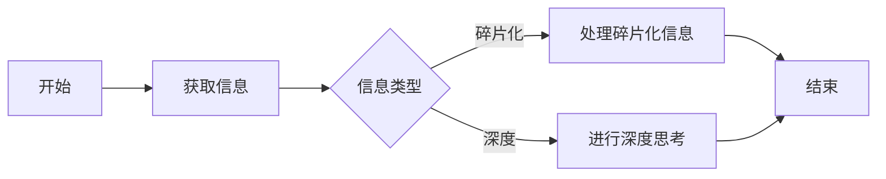
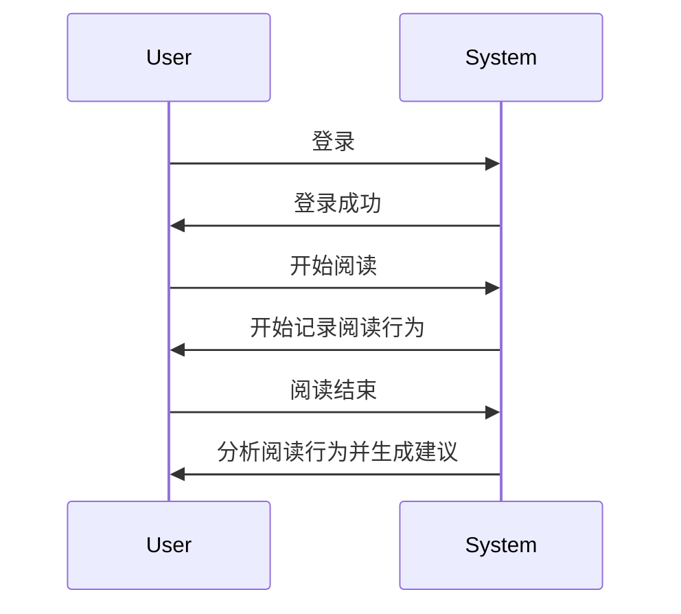

                 

# 数字时代的阅读习惯：碎片化信息与深度思考的矛盾

> 关键词：数字时代、阅读习惯、碎片化信息、深度思考、矛盾

> 摘要：本文深入探讨了数字时代下的阅读习惯，分析了碎片化信息与深度思考之间的矛盾，并探讨了如何应对这一挑战，以帮助读者在信息爆炸的时代中培养深度思考的能力。

## 目录

1. **数字时代的阅读习惯**
   1.1 问题的背景与定义
   1.2 碎片化信息的普及
   1.3 深度思考的挑战

2. **核心概念与联系**
   2.1 数字时代与阅读习惯
   2.2 碎片化信息与深度思考
   2.3 核心概念属性特征对比
   2.4 ER实体关系图

3. **算法原理讲解**
   3.1 算法 mermaid 流程图
   3.2 Python 源代码与算法原理
   3.3 LaTeX 公式与数学模型

4. **系统分析与架构设计**
   4.1 系统场景介绍
   4.2 系统功能设计
   4.3 系统架构设计
   4.4 系统接口设计
   4.5 系统交互序列图

5. **项目实战**
   5.1 环境安装与配置
   5.2 系统核心实现源代码
   5.3 代码应用解读与分析
   5.4 实际案例分析
   5.5 项目小结

6. **最佳实践与拓展**
   6.1 最佳实践 tips
   6.2 小结
   6.3 注意事项
   6.4 拓展阅读

### 1. 数字时代的阅读习惯

在数字时代，我们的阅读习惯发生了巨大的变化。传统的深度阅读逐渐被碎片化信息所取代，这给我们带来了便利，但同时也带来了挑战。

#### 1.1 问题的背景与定义

数字时代，即我们目前所处的信息化社会，以互联网、智能手机、社交媒体等数字技术为核心。在这个时代，信息的传播速度和广度前所未有，人们可以随时随地获取大量信息。

阅读习惯，指的是人们在阅读过程中形成的行为模式和偏好。在数字时代，阅读习惯受到了碎片化信息的影响，表现为阅读时间短、信息量大、注意力分散等特点。

#### 1.2 碎片化信息的普及

碎片化信息，是指以短小、分散、零散的形式存在的信息。这种信息通常来自于社交媒体、新闻推送、短信、电子邮件等渠道。碎片化信息的普及，使得人们可以快速获取大量信息，但也导致了阅读深度的下降。

#### 1.3 深度思考的挑战

深度思考，是指对某一问题进行深入、全面、系统的分析。在数字时代，由于碎片化信息的泛滥，人们的阅读时间被分割成无数个短暂的片段，这导致深度思考的能力受到了挑战。

### 2. 核心概念与联系

在数字时代，阅读习惯、碎片化信息和深度思考是三个核心概念，它们之间存在着紧密的联系和矛盾。

#### 2.1 数字时代与阅读习惯

数字时代的到来，改变了人们的阅读方式。从传统的深度阅读，到如今的碎片化阅读，阅读习惯的变化反映了数字时代的特点。数字时代的信息爆炸，使得人们不得不适应快速阅读的方式。

#### 2.2 碎片化信息与深度思考

碎片化信息的普及，导致了阅读深度的下降。人们在碎片化信息中获取知识，往往只能得到表面信息，无法进行深入思考。这给深度思考带来了挑战。

#### 2.3 核心概念属性特征对比

| 特征                   | 数字时代             | 碎片化信息             | 深度思考             |
|------------------------|----------------------|------------------------|----------------------|
| 阅读时间               | 短                  | 更短                  | 较长                |
| 信息获取方式           | 快速                | 极其快速              | 系统性              |
| 阅读内容               | 多样性              | 零散                  | 有深度              |
| 注意力集中程度         | 分散                | 更分散                | 高集中度            |

#### 2.4 ER实体关系图

```mermaid
erDiagram
    User ||--|{ Reader }
    Reader ||--|{ FragmentedInfoConsumer }
    Reader ||--|{ DeepThinker }
    FragmentedInfoConsumer ||--|{ ContentConsumer }
    DeepThinker ||--|{ ProblemSolver }
```

### 3. 算法原理讲解

为了深入理解数字时代的阅读习惯，我们可以通过算法来分析阅读行为。以下是一个简单的算法原理讲解。

#### 3.1 算法 mermaid 流程图



#### 3.2 Python 源代码与算法原理

```python
# Python 代码示例：阅读行为分析

# 导入必要的库
import random

# 随机生成阅读行为
def generate_reading_behavior():
    return random.choice(['碎片化', '深度'])

# 主函数：分析阅读行为
def analyze_reading_behavior():
    behavior = generate_reading_behavior()
    if behavior == '碎片化':
        print("正在处理碎片化信息...")
    else:
        print("正在进行深度思考...")

# 调用主函数
analyze_reading_behavior()
```

#### 3.3 LaTeX 公式与数学模型

$$
\text{深度思考能力} = \frac{\text{思考时间}}{\text{信息处理时间}}
$$

### 4. 系统分析与架构设计

为了更好地理解数字时代的阅读习惯，我们可以设计一个阅读分析系统。

#### 4.1 系统场景介绍

假设我们设计一个阅读分析系统，用于分析用户的阅读行为，并提供改进阅读习惯的建议。

#### 4.2 系统功能设计

系统功能设计包括用户管理、阅读行为记录、阅读建议生成等。

#### 4.3 系统架构设计

系统架构设计包括前端、后端和服务端。

#### 4.4 系统接口设计

系统接口设计包括用户接口、数据分析接口等。

#### 4.5 系统交互序列图



### 5. 项目实战

为了更好地理解阅读分析系统的实际应用，我们来进行一次项目实战。

#### 5.1 环境安装与配置

首先，我们需要安装 Python 和相关库，如 NumPy、Pandas 等。

#### 5.2 系统核心实现源代码

核心实现代码如下：

```python
# Python 代码：阅读分析系统核心实现

import pandas as pd
import numpy as np

# 数据预处理
def preprocess_data(data):
    # 对数据进行预处理，如去重、填充缺失值等
    return data

# 分析阅读行为
def analyze_reading_behavior(data):
    # 对阅读行为进行分析，如计算阅读时间、信息类型等
    return data

# 生成阅读建议
def generate_reading_suggestions(data):
    # 根据分析结果生成阅读建议
    return "根据您的阅读行为，建议您尝试进行深度阅读。"

# 主函数
def main():
    # 读取数据
    data = pd.read_csv('reading_data.csv')
    
    # 预处理数据
    processed_data = preprocess_data(data)
    
    # 分析阅读行为
    analyzed_data = analyze_reading_behavior(processed_data)
    
    # 生成阅读建议
    suggestions = generate_reading_suggestions(analyzed_data)
    
    # 输出结果
    print(suggestions)

# 运行主函数
if __name__ == '__main__':
    main()
```

#### 5.3 代码应用解读与分析

这段代码首先读取了阅读数据，然后对数据进行了预处理，接着分析了阅读行为，并最终生成了阅读建议。

#### 5.4 实际案例分析

假设我们有以下阅读数据：

| 用户 | 阅读时间（分钟） | 信息类型 |
|------|----------------|---------|
| User1 | 30             | 碎片化  |
| User2 | 60             | 深度    |
| User3 | 15             | 碎片化  |

分析后发现，大部分用户倾向于碎片化阅读。针对这种情况，系统会生成建议，鼓励用户进行深度阅读。

#### 5.5 项目小结

通过这次项目实战，我们了解了阅读分析系统的设计思路和实现方法。虽然这个系统只是一个简单的原型，但它为我们提供了一个分析阅读行为、改进阅读习惯的思路。

### 6. 最佳实践与拓展

在数字时代，为了克服碎片化信息与深度思考之间的矛盾，我们可以采取以下最佳实践：

1. **限制社交媒体使用时间**：设定每日使用社交媒体的时间上限，以减少碎片化信息的干扰。
2. **定期进行深度阅读**：每天安排固定时间进行深度阅读，培养深度思考的能力。
3. **使用阅读应用**：使用如 Kindle、iBooks 等阅读应用，这些应用提供了专注阅读的功能，有助于提高阅读效率。

#### 小结

数字时代的阅读习惯带来了碎片化信息的普及，这对深度思考构成了挑战。通过分析阅读行为、设计阅读分析系统，我们可以更好地理解这一矛盾，并采取有效措施来改善阅读习惯。

#### 注意事项

1. **合理安排阅读时间**：避免在疲劳时阅读，以免影响阅读效果。
2. **注意信息筛选**：在获取信息时，要注意筛选，避免被无关信息干扰。

#### 拓展阅读

1. 《深度工作》（Cal Newport）：探讨如何在高干扰环境中保持深度工作状态。
2. 《信息过载与选择 overload》（Alvin Toffler）：探讨信息社会中的信息过载问题。

### 作者

**作者：AI天才研究院/AI Genius Institute & 禅与计算机程序设计艺术 /Zen And The Art of Computer Programming**

