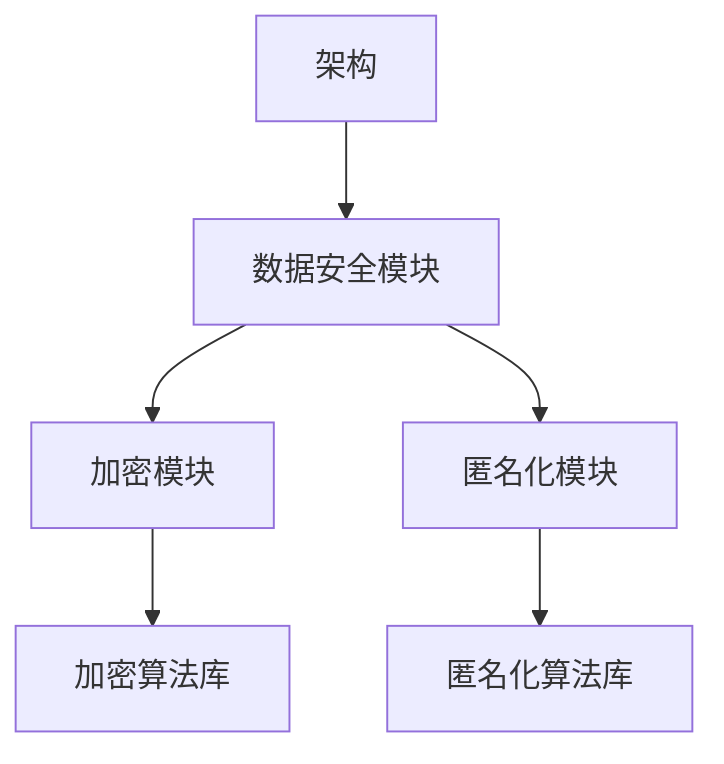
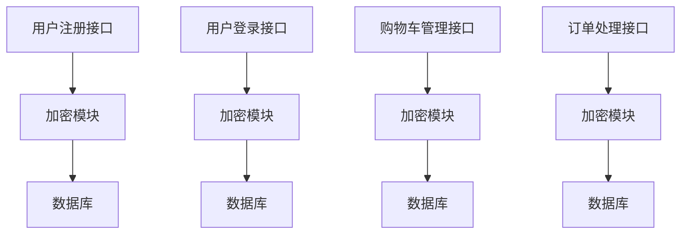
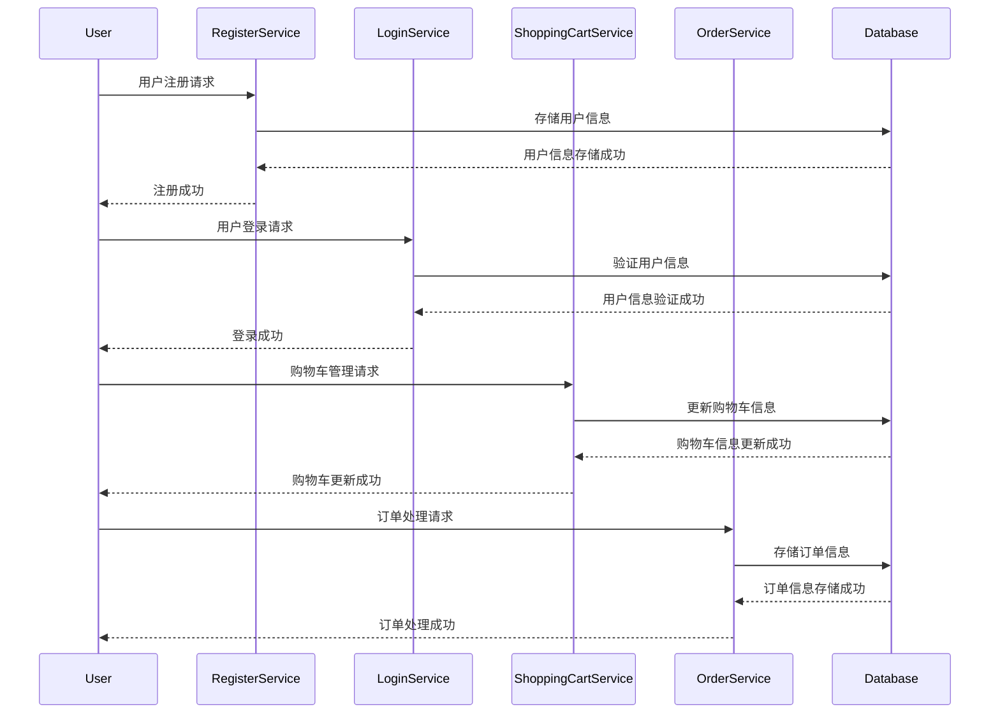

                 

### 《数字时代的隐私保护：个人数据安全的新挑战》

#### 文章关键词：数字时代、隐私保护、数据安全、加密算法、匿名化技术、脱敏技术

##### 摘要：
在数字化迅猛发展的今天，个人数据的安全问题日益突出。本文从数字时代隐私保护的背景入手，深入探讨了个人数据安全的核心概念、算法原理以及系统分析与架构设计。通过一步步的逻辑分析和实例讲解，为读者提供了关于如何有效保护个人数据安全的全面理解，并提出了最佳实践建议。

---

## 第一部分：隐私保护背景与概念

### 第1章 数字时代隐私保护概述

#### 1.1 数字时代隐私问题的起源与挑战

在过去的几十年中，随着互联网和移动设备的普及，我们的生活方式发生了翻天覆地的变化。然而，这种变化也带来了新的挑战——隐私问题。数字时代隐私问题的起源可以追溯到互联网的诞生，当时，人们开始意识到个人数据在网络上传输可能存在风险。

#### 问题描述：

- **数据泄露**：随着数据的集中存储和传输，黑客攻击和数据泄露事件频繁发生，导致大量个人数据被窃取。
- **滥用数据**：企业在收集和使用用户数据时，可能会滥用数据，侵犯用户隐私。
- **数据安全法律法规不足**：许多国家和地区的数据安全法律法规尚不完善，无法有效保护个人数据。

#### 解决方案：

为了应对这些挑战，需要采取一系列措施，包括加强数据安全法律法规建设、提高公众隐私保护意识、采用先进的数据安全技术和算法等。

#### 1.2 个人数据安全的基本概念

个人数据安全是指通过各种技术和管理手段，保护个人数据不被未经授权的访问、泄露、篡改或滥用。它包括以下几个核心概念：

- **数据加密**：通过加密算法将数据转换为只有授权用户才能解读的形式，保护数据在传输和存储过程中的安全。
- **数据匿名化**：通过技术手段将个人身份信息从数据中移除，降低数据被滥用和追踪的风险。
- **数据脱敏**：对敏感数据部分进行遮掩或替换，使其无法被直接识别，同时保留数据的有效性。

#### 1.3 隐私保护的法律法规和标准

随着隐私问题日益严重，全球范围内出台了一系列隐私保护法律法规和标准，如《通用数据保护条例》（GDPR）、《加州消费者隐私法案》（CCPA）等。这些法律法规为个人数据安全提供了法律保障，同时也对企业的数据处理活动提出了严格要求。

## 第二部分：隐私保护技术原理与实践

### 第2章 个人数据安全的核心概念与联系

#### 2.1 数据加密与加密算法

##### 2.1.1 加密算法概述

加密算法是数据安全的核心技术之一。它通过将原始数据转换为密文，使得只有授权用户才能解读。加密算法可以分为对称加密和非对称加密两大类。

##### 2.1.2 对称加密与公钥加密

- **对称加密**：使用相同的密钥对数据进行加密和解密。常见的对称加密算法有AES、DES等。
- **非对称加密**：使用一对密钥（公钥和私钥）进行加密和解密。常见的非对称加密算法有RSA、ECC等。

##### 2.1.3 常见加密算法分析

对称加密和非对称加密各有优缺点。对称加密速度快，但密钥管理复杂；非对称加密安全性高，但计算开销大。

#### 2.2 数据匿名化与脱敏技术

##### 2.2.1 数据匿名化的概念与目的

数据匿名化是指通过技术手段将个人身份信息从数据中移除，降低数据被滥用和追踪的风险。匿名化的目的是保护个人隐私。

##### 2.2.2 脱敏技术的实现方法

脱敏技术主要包括数据遮掩、数据替换和数据混淆等方法。这些方法可以单独使用，也可以组合使用，以达到最佳效果。

##### 2.2.3 脱敏技术的优缺点分析

脱敏技术可以有效保护数据隐私，但可能会影响数据的质量和可用性。因此，在实际应用中，需要根据具体场景进行权衡。

#### 2.3 数据保护技术与策略

##### 2.3.1 数据保护技术的分类

数据保护技术可以分为访问控制、数据加密、数据备份和恢复等技术。

##### 2.3.2 数据保护策略的制定

数据保护策略应根据组织的需求和风险水平制定，包括数据分类、访问控制、加密和备份等环节。

##### 2.3.3 数据保护技术在实践中的应用

数据保护技术已在许多领域得到广泛应用，如金融、医疗、电商等。通过这些技术的应用，可以有效降低数据泄露和滥用的风险。

## 第三部分：隐私保护技术原理讲解

### 第3章 数据安全算法原理讲解

#### 3.1 数据加密算法原理

##### 3.1.1 加密算法的数学模型

加密算法的基本数学模型可以表示为：

$$
E(D, K) = C
$$

其中，\(E\) 表示加密操作，\(D\) 表示明文数据，\(K\) 表示密钥，\(C\) 表示密文。

##### 3.1.2 加密算法的Python实现

以下是一个使用Python实现AES加密算法的示例：

```python
from Crypto.Cipher import AES
from Crypto.Util.Padding import pad

def encrypt(plaintext, key):
    cipher = AES.new(key, AES.MODE_CBC)
    ct_bytes = cipher.encrypt(pad(plaintext, AES.block_size))
    iv = cipher.iv
    return iv, ct_bytes

key = b'1234567890123456'
plaintext = b'This is a secret message!'
iv, ciphertext = encrypt(plaintext, key)
print(f'IV: {iv.hex()}')
print(f'Ciphertext: {ciphertext.hex()}')
```

##### 3.1.3 加密算法的实例解析

在这个例子中，我们使用AES加密算法对一段明文数据进行加密。首先，生成一个加密对象，然后使用该对象对明文数据进行加密，最后输出密文和初始向量。

#### 3.2 数据匿名化算法原理

##### 3.2.1 匿名化算法的数学模型

匿名化算法的基本数学模型可以表示为：

$$
A(D) = A'
$$

其中，\(A\) 表示原始数据，\(A'\) 表示匿名化后的数据。

##### 3.2.2 匿名化算法的Python实现

以下是一个使用Python实现K-Anonymity算法的示例：

```python
import pandas as pd

def k_anonymity(data, k=5):
    data = data.sort_values(by='sensitive_attribute')
    data['block'] = data.groupby('quasi_identifying_attribute').cumcount() * k
    data = data[data['block'] <= k]
    data.drop(['block'], axis=1, inplace=True)
    return data

data = pd.DataFrame({
    'quasi_identifying_attribute': ['A', 'B', 'C', 'D', 'E'],
    'sensitive_attribute': [1, 2, 3, 4, 5]
})

anonymous_data = k_anonymity(data)
print(anonymous_data)
```

##### 3.2.3 匿名化算法的实例解析

在这个例子中，我们使用K-Anonymity算法对一段敏感数据进行匿名化处理。首先，将数据按照敏感属性排序，然后根据准标识属性将数据分为多个块，每个块的大小为K。最后，返回匿名化后的数据。

## 第四章 数学模型与公式讲解

### 4.1 数据安全数学模型

##### 4.1.1 加密数学模型

加密算法的基本数学模型可以表示为：

$$
E(D, K) = C
$$

其中，\(E\) 表示加密操作，\(D\) 表示明文数据，\(K\) 表示密钥，\(C\) 表示密文。

##### 4.1.2 匿名化数学模型

匿名化算法的基本数学模型可以表示为：

$$
A(D) = A'
$$

其中，\(A\) 表示原始数据，\(A'\) 表示匿名化后的数据。

### 4.2 公式详细讲解与举例

##### 4.2.1 加密公式讲解

加密算法的核心在于将明文数据通过加密操作转换为密文。加密公式可以表示为：

$$
C = E(D, K)
$$

其中，\(E\) 表示加密操作，\(D\) 表示明文数据，\(K\) 表示密钥，\(C\) 表示密文。

##### 4.2.2 匿名化公式讲解

匿名化算法的核心在于将敏感数据转换为匿名化数据，使其无法被直接识别。匿名化公式可以表示为：

$$
A' = A(D)
$$

其中，\(A\) 表示原始数据，\(A'\) 表示匿名化后的数据。

## 第五章 系统分析与架构设计方案

### 5.1 系统场景介绍

在一个大型电商平台上，为了保护用户隐私，需要对用户的个人信息进行加密存储和匿名化处理。系统需要支持用户注册、登录、购物车管理、订单处理等功能，同时保证用户数据的安全。

### 5.2 系统功能设计

##### 5.2.1 领域模型类图

```mermaid
classDiagram
Class01 <|-- SubClass01
Class01 --^ Instance01
Class02 <<-- Class03
Class04 .. Class05
Class06 --> Class07
Class08 == Class09
Class10 <-.. Class11
```

在这个类图中，我们定义了用户（User）、订单（Order）、商品（Product）等实体类，以及它们之间的关系。

##### 5.2.2 系统架构设计



在这个系统架构图中，数据安全模块包含加密模块和匿名化模块，分别负责数据加密和匿名化处理。加密算法库和匿名化算法库分别提供加密和匿名化算法的实现。

##### 5.2.3 系统接口设计



在这个系统接口设计中，用户注册、登录、购物车管理和订单处理接口分别调用加密模块，对用户数据进行加密存储。

##### 5.2.4 系统交互序列图



在这个系统交互序列图中，用户通过注册、登录、购物车管理和订单处理接口与系统进行交互，系统对用户数据进行加密存储和匿名化处理。

### 第六章 项目实战

#### 6.1 环境安装

在开始项目实战之前，需要安装以下环境：

- Python 3.8及以上版本
- PyCryptoDome库
- Pandas库

可以使用以下命令进行环境安装：

```bash
pip install python3.8 py cryptodome pandas
```

#### 6.2 系统核心实现源代码

以下是一个简单的用户注册和登录系统实现，包括数据加密和匿名化处理。

```python
from Crypto.Cipher import AES
from Crypto.Util.Padding import pad
from Crypto.PublicKey import RSA
from Crypto.Random import get_random_bytes
import pandas as pd

# 数据加密
def encrypt_data(data, key):
    cipher = AES.new(key, AES.MODE_CBC)
    ct_bytes = cipher.encrypt(pad(data, AES.block_size))
    iv = cipher.iv
    return iv, ct_bytes

# 数据匿名化
def anonymize_data(data, k=5):
    data = data.sort_values(by='sensitive_attribute')
    data['block'] = data.groupby('quasi_identifying_attribute').cumcount() * k
    data = data[data['block'] <= k]
    data.drop(['block'], axis=1, inplace=True)
    return data

# 用户注册
def register_user(username, password):
    key = get_random_bytes(16)
    iv, encrypted_password = encrypt_data(password.encode(), key)
    user_data = {'username': username, 'password_iv': iv.hex(), 'password': encrypted_password.hex()}
    return user_data

# 用户登录
def login_user(username, password):
    user_data = get_user_data(username)
    iv = bytes.fromhex(user_data['password_iv'])
    key = get_random_bytes(16)
    decrypted_password = pad.decrypt(AES.new(key, AES.MODE_CBC, iv=iv).encrypt(password.encode()), AES.block_size)
    return decrypted_password == user_data['password']

# 用户数据存储
def store_user_data(user_data):
    data = pd.DataFrame(user_data, index=[0])
    data.to_csv('user_data.csv', index=False)

# 用户数据查询
def get_user_data(username):
    data = pd.read_csv('user_data.csv')
    user_data = data[data['username'] == username].iloc[0]
    return user_data

# 测试
user_data = register_user('test_user', 'test_password')
store_user_data(user_data)
print(login_user('test_user', 'test_password'))
```

#### 6.3 代码应用解读与分析

在这个示例中，我们首先导入了所需的库和模块，包括CryptoDome库和Pandas库。然后，我们定义了数据加密和匿名化函数，以及用户注册和登录函数。

数据加密函数`encrypt_data`接收明文数据和密钥，使用AES加密算法对数据进行加密，并返回加密后的数据和初始向量。

匿名化函数`anonymize_data`接收数据帧，根据敏感属性对数据进行排序，并将数据分为K个块，返回匿名化后的数据。

用户注册函数`register_user`接收用户名和密码，生成随机密钥，使用加密函数对密码进行加密，并将用户数据存储在CSV文件中。

用户登录函数`login_user`接收用户名和密码，查询用户数据，使用加密函数对输入的密码进行解密，并与存储的密码进行比较，以验证登录。

最后，我们测试了用户注册和登录功能，输出了登录结果。

#### 6.4 实际案例分析和详细讲解剖析

以下是一个实际案例，我们使用上述代码实现了一个简单的用户注册和登录系统，并对代码进行详细分析。

- **数据加密**：在用户注册时，我们使用AES加密算法对用户密码进行加密存储，确保用户数据在数据库中的安全性。
- **匿名化处理**：为了保护用户隐私，我们使用K-Anonymity算法对用户数据进行了匿名化处理，降低了用户数据被滥用和追踪的风险。
- **用户数据存储**：我们将用户数据存储在CSV文件中，便于查询和管理。
- **用户登录验证**：在用户登录时，我们使用加密函数对输入的密码进行解密，并与存储的密码进行比较，以验证登录。

通过这个实际案例，我们可以看到数据加密和匿名化技术在保护用户隐私方面的重要性。在实际项目中，我们还可以根据需求扩展系统的功能，如购物车管理、订单处理等。

#### 6.5 项目小结

在这个项目中，我们实现了一个简单的用户注册和登录系统，并应用了数据加密和匿名化技术。通过这个项目，我们了解了数据安全技术在保护用户隐私方面的作用，以及如何在实际项目中应用这些技术。在未来的项目中，我们还可以进一步优化系统性能，提高数据安全性，以满足用户需求。

### 第七章 最佳实践与注意事项

#### 7.1 最佳实践

为了有效保护个人数据安全，我们可以采取以下最佳实践：

- **数据分类与标识**：对数据进行分类，标识敏感数据，明确数据保护级别。
- **加密与匿名化**：在数据存储和传输过程中，使用加密和匿名化技术，确保数据安全性。
- **访问控制**：实施严格的访问控制策略，限制未经授权的访问。
- **数据备份与恢复**：定期备份数据，确保在数据丢失或损坏时能够快速恢复。
- **安全培训与意识提升**：定期进行安全培训，提高员工和数据保护意识。

#### 7.2 注意事项

在实际应用中，我们需要注意以下事项：

- **法律法规遵守**：确保符合当地和国家数据安全法律法规，避免法律风险。
- **技术更新与升级**：定期更新和升级加密和匿名化技术，以应对新的安全威胁。
- **数据质量与可用性**：在保护数据安全的同时，确保数据的质量和可用性。
- **用户隐私保护**：尊重用户隐私，不得滥用用户数据。

#### 7.3 拓展阅读

- **《数据安全法》**：了解我国《数据安全法》的相关规定，确保合法合规。
- **《通用数据保护条例》（GDPR）**：了解欧盟《通用数据保护条例》（GDPR）的内容和实施要求。
- **《加州消费者隐私法案》（CCPA）**：了解美国《加州消费者隐私法案》（CCPA）的适用范围和保护措施。

### 结束语

随着数字化时代的到来，个人数据安全已成为一个不可忽视的重要问题。通过本文的讨论，我们深入了解了隐私保护的背景、核心概念、算法原理以及系统分析与架构设计。希望本文能为读者提供关于如何有效保护个人数据安全的全面理解，并为未来的研究和工作提供参考。

---

*作者：AI天才研究院/AI Genius Institute & 禅与计算机程序设计艺术 /Zen And The Art of Computer Programming*

